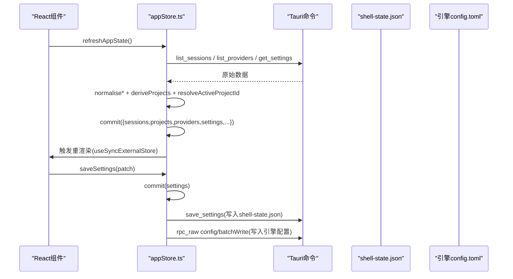
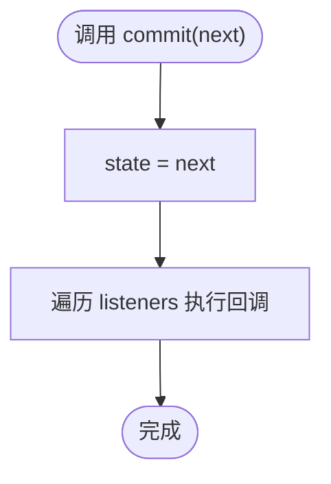
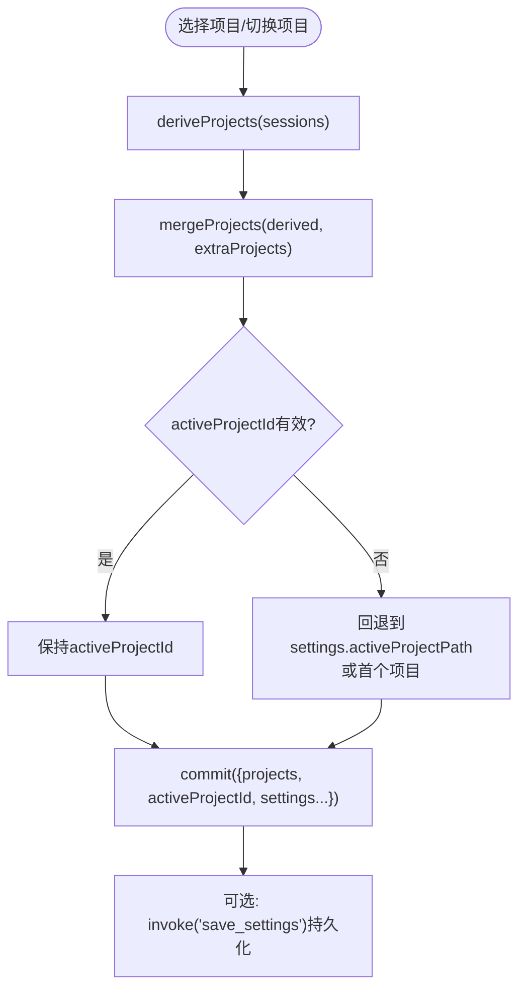
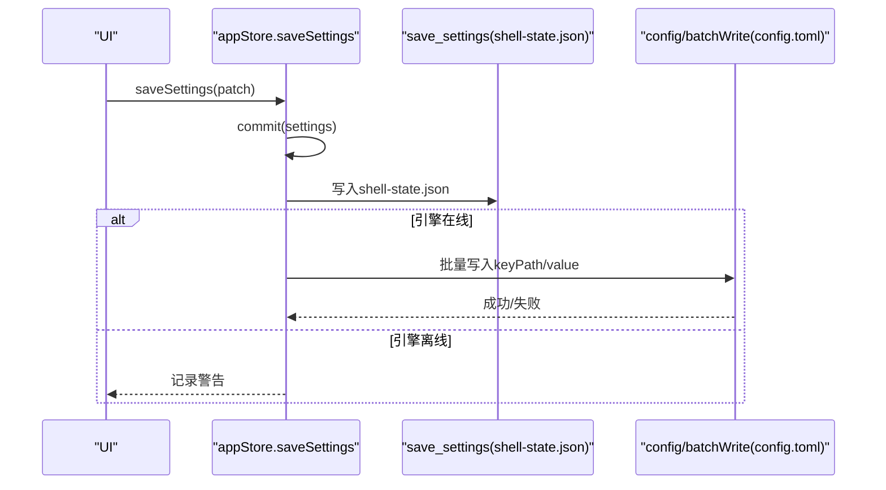
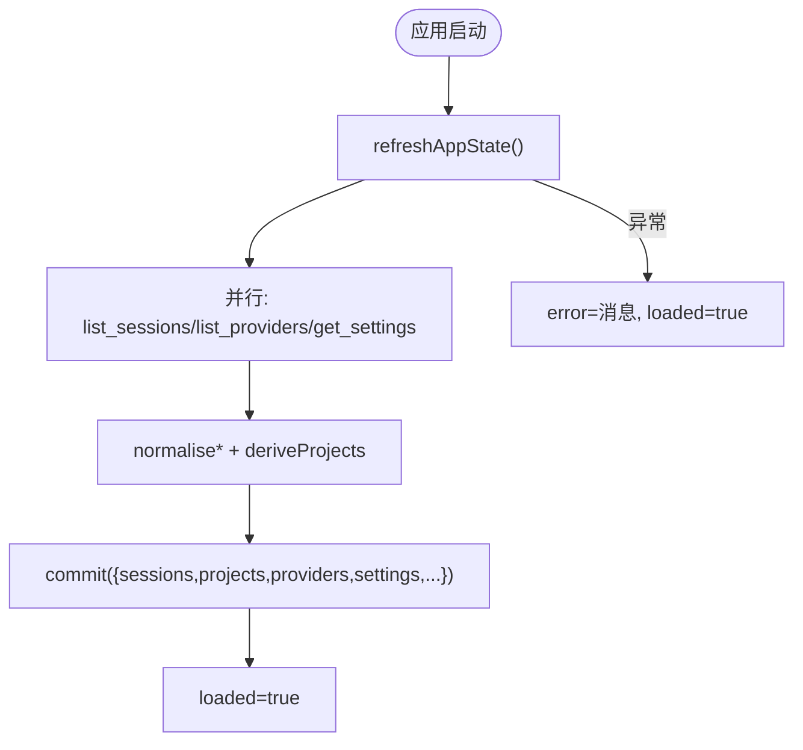
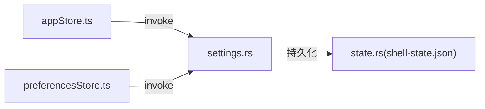

# 应用状态存储 (appStore)

<cite>
**本文引用的文件**
- [frontend/app/state/appStore.ts](file://frontend/app/state/appStore.ts)
- [src-tauri/src/commands/settings.rs](file://src-tauri/src/commands/settings.rs)
- [src-tauri/src/state.rs](file://src-tauri/src/state.rs)
- [frontend/app/state/preferencesStore.ts](file://frontend/app/state/preferencesStore.ts)
- [frontend/app/state/hooks.ts](file://frontend/app/state/hooks.ts)
- [frontend/app/state/types.ts](file://frontend/app/state/types.ts)
</cite>

## 目录
1. [简介](#简介)
2. [项目结构](#项目结构)
3. [核心组件](#核心组件)
4. [架构总览](#架构总览)
5. [详细组件分析](#详细组件分析)
6. [依赖关系分析](#依赖关系分析)
7. [性能考量](#性能考量)
8. [故障排查指南](#故障排查指南)
9. [结论](#结论)
10. [附录：使用示例与最佳实践](#附录使用示例与最佳实践)

## 简介
本模块为 Codex-Tauri 的前端应用状态存储，负责全局状态管理、会话与项目管理、提供者（Provider）列表以及设置持久化。其核心通过一个轻量级 store 暴露 useAppState hook，配合 React 的 useSyncExternalStore 实现无 Provider 的高性能订阅；后端通过 Tauri 命令读写 shell-state.json 与引擎配置，形成“前端状态 + 后端持久化”的双写闭环。

## 项目结构
- 前端状态层
  - appStore.ts：定义 AppState 数据模型、normalize 逻辑、actions（刷新、保存设置、切换项目/会话等）、useAppState hook。
  - preferencesStore.ts：偏好设置（per-section map）的本地缓存与持久化。
  - hooks.ts：turnStore 的 React 绑定（与本模块无关，但体现统一 subscribe/snapshot 模式）。
  - types.ts：Turn 流相关类型（与本模块无关，但体现整体类型规范）。
- 后端持久化
  - settings.rs：Tauri 命令 get_settings/save_settings/get_preferences/save_preferences。
  - state.rs：Rust 侧 AppState/Settings/Preferences 结构与 shell-state.json 序列化/反序列化。

```mermaid
graph TB
subgraph "前端"
A["appStore.ts<br/>全局状态与Actions"]
B["preferencesStore.ts<br/>偏好设置"]
C["hooks.ts<br/>turnStore绑定(参考)"]
end
subgraph "后端(Tauri)"
D["settings.rs<br/>get/save settings & preferences"]
E["state.rs<br/>shell-state.json 持久化"]
end
A --> |invoke("list_sessions"/"list_providers"/"get_settings")| D
A --> |invoke("save_settings"/"rpc_raw config/batchWrite")| D
D --> |写入| E
B --> |invoke("get_preferences"/"save_preferences")| D
```

图表来源
- [frontend/app/state/appStore.ts:149-151](file://frontend/app/state/appStore.ts#L149-L151)
- [frontend/app/state/appStore.ts:378-408](file://frontend/app/state/appStore.ts#L378-L408)
- [frontend/app/state/appStore.ts:446-511](file://frontend/app/state/appStore.ts#L446-L511)
- [src-tauri/src/commands/settings.rs:8-33](file://src-tauri/src/commands/settings.rs#L8-L33)
- [src-tauri/src/commands/settings.rs:35-52](file://src-tauri/src/commands/settings.rs#L35-L52)
- [src-tauri/src/state.rs:176-217](file://src-tauri/src/state.rs#L176-L217)

章节来源
- [frontend/app/state/appStore.ts:1-151](file://frontend/app/state/appStore.ts#L1-L151)
- [src-tauri/src/commands/settings.rs:1-69](file://src-tauri/src/commands/settings.rs#L1-L69)
- [src-tauri/src/state.rs:1-232](file://src-tauri/src/state.rs#L1-L232)

## 核心组件
- AppState 接口与默认值
  - sessions：会话摘要列表（id/title/cwd/projectId/archived/updatedAt/preview）。
  - projects：从 sessions 派生的项目列表（以 cwd 为唯一标识）。
  - providers：提供者列表（id/name/models/hasApiKey/protocol/baseUrl）。
  - settings：当前设置（activeModel/activeProviderId/modelReasoningEffort/approvalPolicy/fullAccess/sidebarCollapsed/language/sandbox/webSearch/outputVerbosity/reasoningSummary/activeProjectPath）。
  - activeSessionId/activeProjectId：当前活跃会话与项目。
  - extraProjects：通过原生文件夹选择器打开的项目（尚未有会话）。
  - engineStatus：最后一次引擎状态探测结果。
  - loaded/error：首次加载完成标志与错误信息。
- 状态更新模式
  - commit(next)：原子替换内部 state，并通知所有订阅者。
  - subscribe(listener)/getSnapshot()：供 useSyncExternalStore 使用。
  - useAppState()：React 钩子，返回当前快照。
- 关键 Actions
  - refreshAppState()：并发拉取 sessions/providers/settings，归一化后提交，并计算 activeProjectId。
  - saveSettings(patch)：双写策略（shell-state.json + 引擎 config.toml），同时同步语言到旧版 i18n。
  - setActiveSession/setActiveProject/openProjectPicker/addProject/pickAttachmentFiles：会话与项目交互。
  - sessionsForProject(projectId)：按项目过滤会话并按更新时间倒序。

章节来源
- [frontend/app/state/appStore.ts:31-128](file://frontend/app/state/appStore.ts#L31-L128)
- [frontend/app/state/appStore.ts:133-155](file://frontend/app/state/appStore.ts#L133-L155)
- [frontend/app/state/appStore.ts:215-245](file://frontend/app/state/appStore.ts#L215-L245)
- [frontend/app/state/appStore.ts:249-376](file://frontend/app/state/appStore.ts#L249-L376)
- [frontend/app/state/appStore.ts:378-433](file://frontend/app/state/appStore.ts#L378-L433)
- [frontend/app/state/appStore.ts:446-518](file://frontend/app/state/appStore.ts#L446-L518)

## 架构总览
- 前端 store 位于 React 之外，通过 useSyncExternalStore 订阅变更，避免重渲染开销。
- 数据源来自后端命令：list_sessions、list_providers、get_settings。
- 设置持久化采用“双写”：
  - 先写 shell-state.json（通过 save_settings），保证 UI 重启后恢复。
  - 再写引擎配置（通过 rpc_raw config/batchWrite），确保引擎运行时生效。
- 项目列表由 sessions 的 cwd 派生，额外通过原生对话框添加的项目保留在 extraProjects 中，合并为最终 projects。



图表来源
- [frontend/app/state/appStore.ts:378-408](file://frontend/app/state/appStore.ts#L378-L408)
- [frontend/app/state/appStore.ts:446-511](file://frontend/app/state/appStore.ts#L446-L511)
- [src-tauri/src/commands/settings.rs:8-33](file://src-tauri/src/commands/settings.rs#L8-L33)
- [src-tauri/src/state.rs:176-217](file://src-tauri/src/state.rs#L176-L217)

## 详细组件分析

### 全局状态管理与订阅机制
- 内部 state 与 listeners 集合，commit 进行不可变更新并广播。
- useAppState 基于 useSyncExternalStore，无需 Context 即可订阅。
- getAppState 提供非 React 环境下的读取能力。



图表来源
- [frontend/app/state/appStore.ts:133-147](file://frontend/app/state/appStore.ts#L133-L147)

章节来源
- [frontend/app/state/appStore.ts:133-155](file://frontend/app/state/appStore.ts#L133-L155)

### 会话与项目管理
- 会话归一化：兼容多种后端字段，提取 id/title/cwd/projectId/archived/updatedAt/preview。
- 项目派生：deriveProjects 基于 distinct session.cwd 生成 ProjectEntry[]。
- 项目合并：mergeProjects 将 derived 与 extraProjects 合并，去重。
- 活跃项目解析：resolveActiveProjectId 优先使用传入或上次保存的 activeProjectPath，否则取首个。
- 切换项目：setActiveProject 更新 activeProjectId 与 settings.activeProjectPath，并尝试持久化。
- 打开项目：openProjectPicker/addProject 通过原生对话框选择目录，注册为项目并选中。



图表来源
- [frontend/app/state/appStore.ts:215-245](file://frontend/app/state/appStore.ts#L215-L245)
- [frontend/app/state/appStore.ts:253-277](file://frontend/app/state/appStore.ts#L253-L277)
- [frontend/app/state/appStore.ts:315-372](file://frontend/app/state/appStore.ts#L315-L372)

章节来源
- [frontend/app/state/appStore.ts:169-245](file://frontend/app/state/appStore.ts#L169-L245)
- [frontend/app/state/appStore.ts:249-372](file://frontend/app/state/appStore.ts#L249-L372)

### 设置状态持久化（双写策略）
- saveSettings(patch) 流程：
  1) 立即 commit 更新前端 settings，并同步语言到旧版 i18n。
  2) 调用 save_settings 写入 shell-state.json（包含 camelCase 与 snake_case 兼容字段）。
  3) 构造 edits 列表，调用 rpc_raw config/batchWrite 写入引擎 config.toml（reloadUserConfig=true）。
- 异常处理：engine 离线时仅记录警告，不阻断 UI 更新。



图表来源
- [frontend/app/state/appStore.ts:446-511](file://frontend/app/state/appStore.ts#L446-L511)
- [src-tauri/src/commands/settings.rs:18-33](file://src-tauri/src/commands/settings.rs#L18-L33)
- [src-tauri/src/state.rs:209-217](file://src-tauri/src/state.rs#L209-L217)

章节来源
- [frontend/app/state/appStore.ts:446-511](file://frontend/app/state/appStore.ts#L446-L511)
- [src-tauri/src/commands/settings.rs:18-33](file://src-tauri/src/commands/settings.rs#L18-L33)
- [src-tauri/src/state.rs:209-217](file://src-tauri/src/state.rs#L209-L217)

### 状态初始化流程
- 首次加载：refreshAppState 并发获取 sessions/providers/settings，归一化后提交，标记 loaded=true。
- 语言同步：若 settings.language 变化，调用 syncLegacyI18n 更新旧版 i18n。
- 错误处理：任何异常都会设置 error 并标记 loaded=true，避免页面空白。



图表来源
- [frontend/app/state/appStore.ts:378-408](file://frontend/app/state/appStore.ts#L378-L408)

章节来源
- [frontend/app/state/appStore.ts:378-408](file://frontend/app/state/appStore.ts#L378-L408)

### 错误处理策略
- 网络/IPC 失败：refreshAppState 捕获异常并设置 error；saveSettings 对引擎配置写入失败仅 warn。
- 选择器失败：pickProjectDirectory/pickAttachmentFiles 捕获异常并返回空/默认值。
- 后端保存失败：save_settings 失败会记录日志但不影响前端状态。

章节来源
- [frontend/app/state/appStore.ts:283-308](file://frontend/app/state/appStore.ts#L283-L308)
- [frontend/app/state/appStore.ts:401-408](file://frontend/app/state/appStore.ts#L401-L408)
- [frontend/app/state/appStore.ts:463-465](file://frontend/app/state/appStore.ts#L463-L465)
- [frontend/app/state/appStore.ts:507-510](file://frontend/app/state/appStore.ts#L507-L510)

### 性能优化方案
- 使用 useSyncExternalStore 将 store 置于 React 外部，减少上下文与 prop 传递成本。
- 并发请求：refreshAppState 使用 Promise.all 并行拉取数据。
- 不可变更新：commit 直接替换 state，避免深层 diff。
- 派生数据最小化：deriveProjects 与 mergeProjects 仅在必要时重建项目列表。
- 选择性持久化：仅对必要字段调用 save_settings/config/batchWrite。

章节来源
- [frontend/app/state/appStore.ts:149-151](file://frontend/app/state/appStore.ts#L149-L151)
- [frontend/app/state/appStore.ts:378-385](file://frontend/app/state/appStore.ts#L378-L385)
- [frontend/app/state/appStore.ts:215-245](file://frontend/app/state/appStore.ts#L215-L245)

## 依赖关系分析
- 前端 appStore 依赖 Tauri invoke 调用后端命令。
- 后端 settings.rs 提供 get/save settings 与 preferences 的读写。
- Rust state.rs 负责 shell-state.json 的加载与保存（原子写入 tmp+rename）。
- preferencesStore 独立维护 per-section 偏好，并通过相同命令持久化。



图表来源
- [frontend/app/state/appStore.ts:378-408](file://frontend/app/state/appStore.ts#L378-L408)
- [frontend/app/state/preferencesStore.ts:59-88](file://frontend/app/state/preferencesStore.ts#L59-L88)
- [src-tauri/src/commands/settings.rs:8-52](file://src-tauri/src/commands/settings.rs#L8-L52)
- [src-tauri/src/state.rs:176-217](file://src-tauri/src/state.rs#L176-L217)

章节来源
- [frontend/app/state/appStore.ts:378-408](file://frontend/app/state/appStore.ts#L378-L408)
- [frontend/app/state/preferencesStore.ts:59-88](file://frontend/app/state/preferencesStore.ts#L59-L88)
- [src-tauri/src/commands/settings.rs:8-52](file://src-tauri/src/commands/settings.rs#L8-L52)
- [src-tauri/src/state.rs:176-217](file://src-tauri/src/state.rs#L176-L217)

## 性能考量
- 高频率更新场景（如 turn 流）通过独立的 turnStore 与 useSyncExternalStore 解耦，避免阻塞 appStore。
- 并发 I/O：refreshAppState 并行请求，降低首屏等待时间。
- 最小化持久化：仅在用户操作或必要变更时写入磁盘，避免频繁 IO。
- 派生数据缓存：extraProjects 与 derived projects 合并后作为单一 source of truth，减少重复计算。

[本节为通用指导，不直接分析具体文件]

## 故障排查指南
- 首次加载失败
  - 现象：界面显示错误信息，loaded=true。
  - 排查：检查 list_sessions/list_providers/get_settings 是否可调用；查看 console 中的错误信息。
  - 参考路径：[刷新与错误处理:378-408](file://frontend/app/state/appStore.ts#L378-L408)
- 设置未持久化
  - 现象：重启后设置丢失。
  - 排查：确认 save_settings 是否成功；检查 shell-state.json 是否被写入；若引擎配置未生效，检查 rpc_raw config/batchWrite 调用。
  - 参考路径：[双写策略:446-511](file://frontend/app/state/appStore.ts#L446-L511)、[后端保存:18-33](file://src-tauri/src/commands/settings.rs#L18-L33)、[持久化实现:209-217](file://src-tauri/src/state.rs#L209-L217)
- 项目未显示或切换无效
  - 现象：侧边栏项目缺失或切换后无响应。
  - 排查：确认 sessions 的 cwd 是否正确；检查 deriveProjects 与 mergeProjects 的结果；验证 activeProjectId 解析逻辑。
  - 参考路径：[项目派生与合并:215-245](file://frontend/app/state/appStore.ts#L215-L245)、[切换项目:253-277](file://frontend/app/state/appStore.ts#L253-L277)

章节来源
- [frontend/app/state/appStore.ts:378-408](file://frontend/app/state/appStore.ts#L378-L408)
- [frontend/app/state/appStore.ts:446-511](file://frontend/app/state/appStore.ts#L446-L511)
- [src-tauri/src/commands/settings.rs:18-33](file://src-tauri/src/commands/settings.rs#L18-L33)
- [src-tauri/src/state.rs:209-217](file://src-tauri/src/state.rs#L209-L217)
- [frontend/app/state/appStore.ts:215-277](file://frontend/app/state/appStore.ts#L215-L277)

## 结论
appStore 通过简洁的不可变状态与订阅机制，结合后端的 shell-state.json 与引擎配置双写，实现了稳定、可扩展的全局状态管理。其设计强调：
- 数据源单一且可追踪（后端命令）
- 状态更新原子且高效（commit + 订阅者通知）
- 持久化可靠（原子写入 + 双写策略）
- 错误处理健壮（失败不阻断 UI）

## 附录：使用示例与最佳实践
- 在组件中订阅全局状态
  - 使用 useAppState() 获取 AppState，并在需要时监听变更。
  - 参考路径：[useAppState:149-151](file://frontend/app/state/appStore.ts#L149-L151)
- 刷新应用状态
  - 调用 refreshAppState() 拉取最新 sessions/providers/settings。
  - 参考路径：[刷新流程:378-408](file://frontend/app/state/appStore.ts#L378-L408)
- 切换活跃项目
  - 调用 setActiveProject(id) 更新 activeProjectId 并持久化。
  - 参考路径：[切换项目:253-277](file://frontend/app/state/appStore.ts#L253-L277)
- 打开项目选择器
  - 调用 openProjectPicker() 或 addProject(path) 添加新目录为项目。
  - 参考路径：[打开项目:315-372](file://frontend/app/state/appStore.ts#L315-L372)
- 保存设置
  - 调用 saveSettings(patch) 进行双写持久化。
  - 参考路径：[保存设置:446-511](file://frontend/app/state/appStore.ts#L446-L511)
- 获取项目下的会话列表
  - 调用 sessionsForProject(projectId) 获取按时间倒序的会话。
  - 参考路径：[项目会话过滤:513-518](file://frontend/app/state/appStore.ts#L513-L518)

章节来源
- [frontend/app/state/appStore.ts:149-151](file://frontend/app/state/appStore.ts#L149-L151)
- [frontend/app/state/appStore.ts:253-277](file://frontend/app/state/appStore.ts#L253-L277)
- [frontend/app/state/appStore.ts:315-372](file://frontend/app/state/appStore.ts#L315-L372)
- [frontend/app/state/appStore.ts:378-408](file://frontend/app/state/appStore.ts#L378-L408)
- [frontend/app/state/appStore.ts:446-518](file://frontend/app/state/appStore.ts#L446-L518)