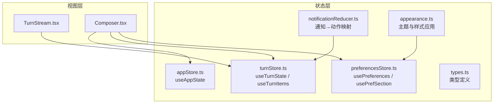
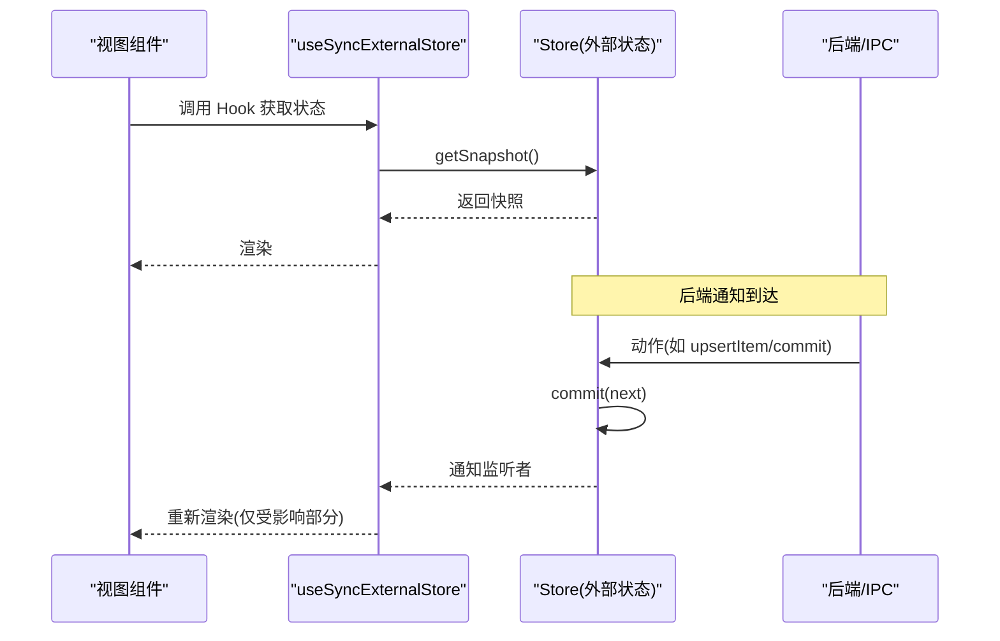
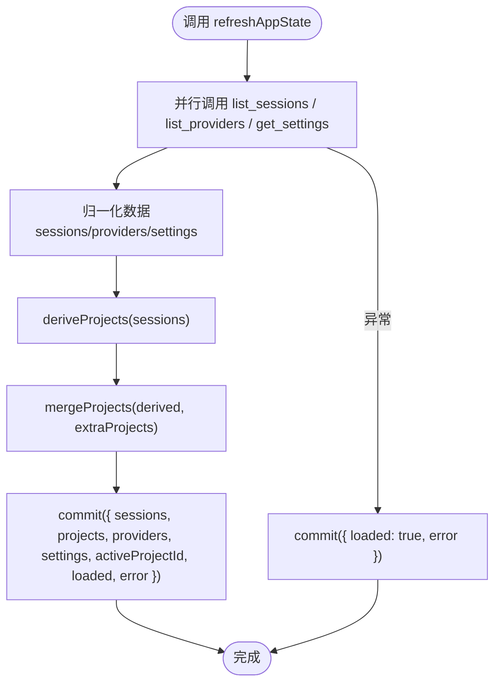
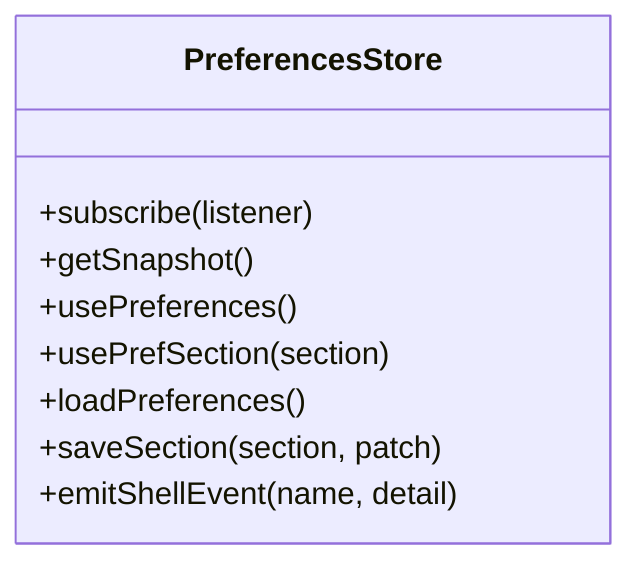
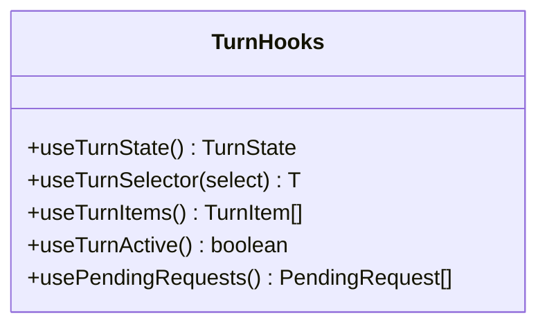
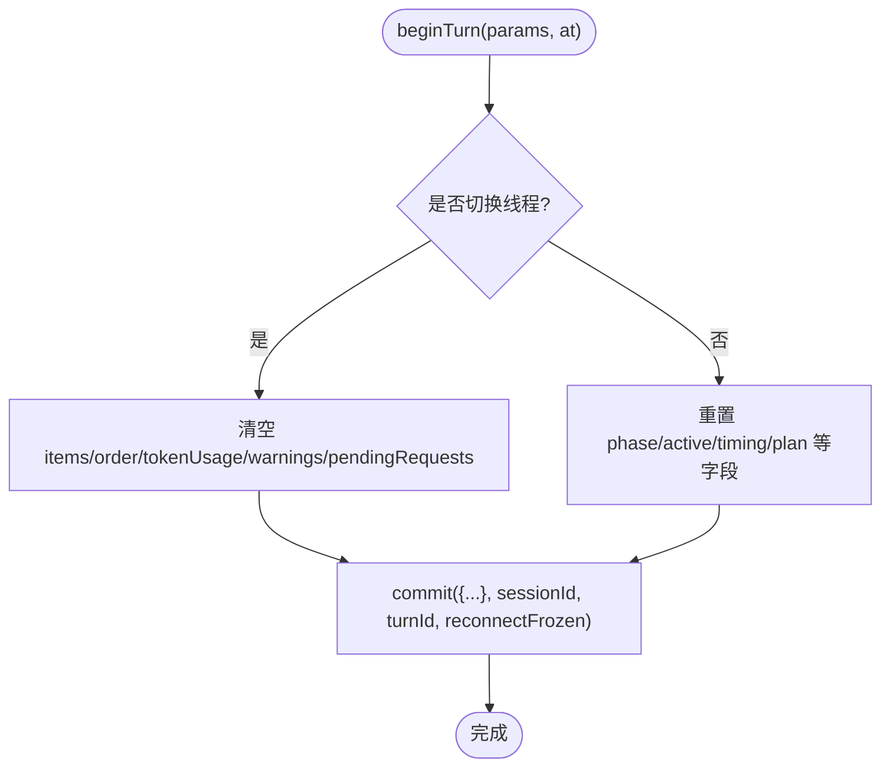
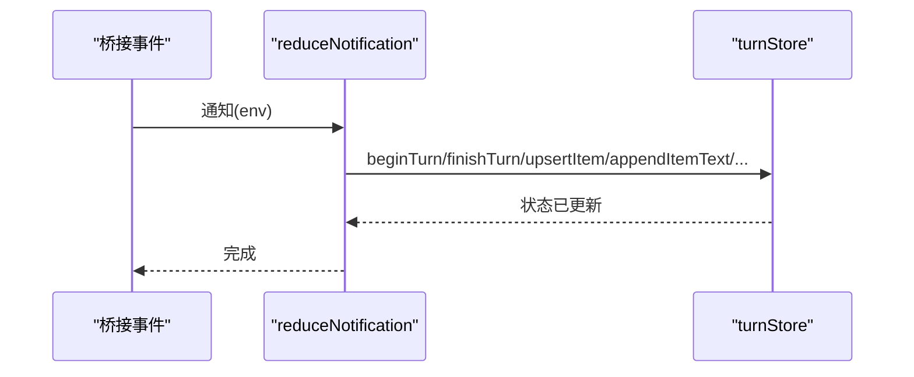
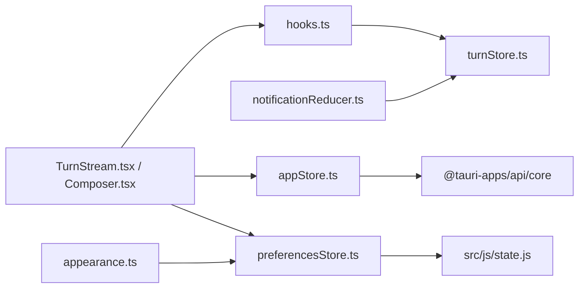

# 状态管理 Hooks

<cite>
**本文引用的文件**
- [hooks.ts](file://frontend/app/state/hooks.ts)
- [appStore.ts](file://frontend/app/state/appStore.ts)
- [preferencesStore.ts](file://frontend/app/state/preferencesStore.ts)
- [turnStore.ts](file://frontend/app/state/turnStore.ts)
- [types.ts](file://frontend/app/state/types.ts)
- [notificationReducer.ts](file://frontend/app/state/notificationReducer.ts)
- [appearance.ts](file://frontend/app/state/appearance.ts)
- [TurnStream.tsx](file://frontend/app/views/TurnStream.tsx)
- [Composer.tsx](file://frontend/app/views/Composer.tsx)
</cite>

## 目录
1. [简介](#简介)
2. [项目结构](#项目结构)
3. [核心组件](#核心组件)
4. [架构总览](#架构总览)
5. [详细组件分析](#详细组件分析)
6. [依赖关系分析](#依赖关系分析)
7. [性能考量](#性能考量)
8. [故障排查指南](#故障排查指南)
9. [结论](#结论)
10. [附录：使用示例与最佳实践](#附录使用示例与最佳实践)

## 简介
本模块为 Codex-Tauri 前端的状态管理提供一组自定义 React Hooks，围绕“应用全局状态”、“偏好设置”和“对话轮次（Turn）流式数据”三大领域展开。其设计目标是：
- 将高频、高并发的后端通知与流式数据置于 React 之外，通过 useSyncExternalStore 订阅，避免 Context 或 props 透传带来的性能与复杂度问题。
- 以最小化重渲染为目标，结合选择器与派生数据，实现细粒度更新。
- 统一错误处理与边界情况策略，确保在离线、网络异常、后端不可用等场景下 UI 仍可稳定运行。
- 提供可组合的 Hook 抽象，便于复杂状态逻辑封装与复用。

## 项目结构
状态管理相关代码集中在 frontend/app/state 目录下，按职责划分：
- appStore.ts：应用级 Store（会话、项目、提供者、设置），提供 useAppState Hook 与一系列动作方法。
- preferencesStore.ts：偏好设置 Store（分 Section 的键值映射），提供 usePreferences/usePrefSection Hook 与持久化能力。
- turnStore.ts：对话轮次 Store（当前 Turn 的完整生命周期与消息项），提供 useTurnState/useTurnItems 等 Hook。
- types.ts：共享类型定义（TurnItem、TurnState、TokenUsage、PlanStep 等）。
- notificationReducer.ts：将后端通知事件映射到 turnStore 的动作，保证“所见即后端”。
- appearance.ts：外观主题与样式变量应用，基于 preferencesStore 的订阅驱动 DOM 变更。

图表来源
- [appStore.ts:14-151](file://frontend/app/state/appStore.ts#L14-L151)
- [preferencesStore.ts:13-43](file://frontend/app/state/preferencesStore.ts#L13-L43)
- [turnStore.ts:28-49](file://frontend/app/state/turnStore.ts#L28-L49)
- [types.ts:11-146](file://frontend/app/state/types.ts#L11-L146)
- [notificationReducer.ts:189-446](file://frontend/app/state/notificationReducer.ts#L189-L446)
- [appearance.ts:152-176](file://frontend/app/state/appearance.ts#L152-L176)
- [TurnStream.tsx:23-67](file://frontend/app/views/TurnStream.tsx#L23-L67)
- [Composer.tsx:24-34](file://frontend/app/views/Composer.tsx#L24-L34)

章节来源
- [appStore.ts:1-151](file://frontend/app/state/appStore.ts#L1-L151)
- [preferencesStore.ts:1-94](file://frontend/app/state/preferencesStore.ts#L1-L94)
- [turnStore.ts:1-467](file://frontend/app/state/turnStore.ts#L1-L467)
- [types.ts:1-146](file://frontend/app/state/types.ts#L1-L146)
- [notificationReducer.ts:1-446](file://frontend/app/state/notificationReducer.ts#L1-L446)
- [appearance.ts:1-177](file://frontend/app/state/appearance.ts#L1-L177)
- [TurnStream.tsx:1-187](file://frontend/app/views/TurnStream.tsx#L1-L187)
- [Composer.tsx:1-200](file://frontend/app/views/Composer.tsx#L1-L200)

## 核心组件
- useAppState：读取应用全局状态（会话、项目、提供者、设置、引擎状态、加载与错误标志）。
- usePreferences / usePrefSection：读取偏好设置整体或指定 Section，支持合并默认值。
- useTurnState / useTurnItems / useTurnActive / usePendingRequests：订阅当前 Turn 的完整状态、有序消息列表、活跃态与待审批请求。
- 通知归约器：将后端通知转换为 turnStore 动作，保持 UI 与后端一致。
- 外观应用：基于偏好设置驱动文档根节点的主题与样式变量。

章节来源
- [hooks.ts:17-42](file://frontend/app/state/hooks.ts#L17-L42)
- [appStore.ts:149-151](file://frontend/app/state/appStore.ts#L149-L151)
- [preferencesStore.ts:40-53](file://frontend/app/state/preferencesStore.ts#L40-L53)
- [turnStore.ts:28-49](file://frontend/app/state/turnStore.ts#L28-L49)
- [notificationReducer.ts:189-446](file://frontend/app/state/notificationReducer.ts#L189-L446)
- [appearance.ts:152-176](file://frontend/app/state/appearance.ts#L152-L176)

## 架构总览
整体采用“外部 Store + useSyncExternalStore”的模式：
- Store 独立于 React 树，维护单一真实状态源。
- 每个 Store 暴露 subscribe/getSnapshot，供 useSyncExternalStore 订阅。
- 视图通过 Hook 订阅所需切片，仅在对应状态变化时触发重渲染。
- 通知流通过 reducer 集中分发到 turnStore，确保所有 UI 行为由后端驱动。

图表来源
- [appStore.ts:130-151](file://frontend/app/state/appStore.ts#L130-L151)
- [preferencesStore.ts:20-43](file://frontend/app/state/preferencesStore.ts#L20-L43)
- [turnStore.ts:28-49](file://frontend/app/state/turnStore.ts#L28-L49)
- [notificationReducer.ts:189-215](file://frontend/app/state/notificationReducer.ts#L189-L215)

## 详细组件分析

### useAppState（应用全局状态）
- 职责：提供 sessions/projects/providers/settings/engineStatus/loaded/error 等全局状态；提供 setActiveSession/setActiveProject/saveSettings/refreshAppState 等动作。
- 订阅机制：使用 useSyncExternalStore(subscribe, getSnapshot, getSnapshot)，保证刷新无需 Provider。
- 数据归一化：normaliseSessions/normaliseProviders/normaliseSettings 对后端数据进行容错解析，兼容驼峰与蛇形命名。
- 项目派生：deriveProjects 从会话 cwd 推导项目列表；mergeProjects 合并额外打开的项目。
- 设置持久化：saveSettings 同时写入 shell 配置与 engine 配置（config/batchWrite），失败不阻断 UI。
- 错误处理：refreshAppState 捕获错误并记录到 state.error；保存操作失败仅记录日志。

图表来源
- [appStore.ts:378-408](file://frontend/app/state/appStore.ts#L378-L408)
- [appStore.ts:215-245](file://frontend/app/state/appStore.ts#L215-L245)
- [appStore.ts:446-511](file://frontend/app/state/appStore.ts#L446-L511)

章节来源
- [appStore.ts:14-151](file://frontend/app/state/appStore.ts#L14-L151)
- [appStore.ts:169-245](file://frontend/app/state/appStore.ts#L169-L245)
- [appStore.ts:378-511](file://frontend/app/state/appStore.ts#L378-L511)

### usePreferences / usePrefSection（偏好设置）
- 职责：提供 Preferences（分 Section 的映射）与单个 Section 的读取；支持 loadPreferences 一次性加载与 saveSection 合并并持久化。
- 默认值合并：mergePreferences(defaultPreferences()) 作为初始状态，确保键存在。
- 副作用：saveSection 先本地提交再异步持久化；emitShellEvent 用于跨层事件广播。
- 错误处理：loadPreferences/saveSection 捕获异常并降级为默认或记录日志。

图表来源
- [preferencesStore.ts:20-94](file://frontend/app/state/preferencesStore.ts#L20-L94)

章节来源
- [preferencesStore.ts:1-94](file://frontend/app/state/preferencesStore.ts#L1-L94)

### useTurnState / useTurnItems / useTurnActive / usePendingRequests（对话轮次）
- 职责：订阅 Turn 的完整状态、有序消息列表、活跃态与待审批请求。
- 订阅机制：useSyncExternalStore(subscribe, getSnapshot, getSnapshot)。
- 派生数据：useTurnItems 根据 order 顺序映射 items，过滤空项。
- 组合模式：useTurnSelector 允许选择任意派生切片（当前实现直接返回 select(state)）。

图表来源
- [hooks.ts:17-42](file://frontend/app/state/hooks.ts#L17-L42)
- [turnStore.ts:28-49](file://frontend/app/state/turnStore.ts#L28-L49)

章节来源
- [hooks.ts:1-43](file://frontend/app/state/hooks.ts#L1-L43)
- [turnStore.ts:28-49](file://frontend/app/state/turnStore.ts#L28-L49)

### turnStore（对话轮次 Store）
- 职责：维护当前 Turn 的生命周期（beginTurn/finishTurn）、消息项（upsertItem/appendItemText/appendItemOutput/completeItem）、计划与 Token 用量、警告与待审批请求。
- 线程切换：beginTurn 检测 threadId 变化，必要时清空 items/order 等，避免历史泄漏。
- 乐观更新：beginUserTurn 立即插入用户气泡，失败可通过 discardItem 回滚。
- 历史加载：loadThreadFromSession 优先使用 thread.messages，否则回退到 timeline，并生成预览气泡。
- 错误处理：setError/pushWarning 记录错误与警告；loadThreadFromSession 捕获异常并设置 error。

图表来源
- [turnStore.ts:71-107](file://frontend/app/state/turnStore.ts#L71-L107)

章节来源
- [turnStore.ts:28-107](file://frontend/app/state/turnStore.ts#L28-L107)
- [turnStore.ts:118-157](file://frontend/app/state/turnStore.ts#L118-L157)
- [turnStore.ts:159-285](file://frontend/app/state/turnStore.ts#L159-L285)
- [turnStore.ts:328-467](file://frontend/app/state/turnStore.ts#L328-L467)

### notificationReducer（通知归约器）
- 职责：将后端通知（turn/item/streaming/thread-level/diagnostics/hook 等）映射到 turnStore 动作。
- 覆盖规则：未处理的方法会记录为警告，确保协议扩展可见。
- 流式处理：item/*/delta 系列事件增量追加文本/输出，避免全量重建。
- 计划与 Token：turn/plan/updated 与 thread/tokenUsage/updated 分别更新 plan 与 tokenUsage。

图表来源
- [notificationReducer.ts:189-446](file://frontend/app/state/notificationReducer.ts#L189-L446)
- [turnStore.ts:71-285](file://frontend/app/state/turnStore.ts#L71-L285)

章节来源
- [notificationReducer.ts:1-446](file://frontend/app/state/notificationReducer.ts#L1-L446)

### appearance（外观应用）
- 职责：根据 appearance 偏好设置应用主题类名、字体族、字号比例、侧边栏风格、对比度、动效与指针光标等。
- 订阅机制：startAppearance 订阅 preferencesStore 的变化，自动重新应用。
- 系统主题：当 theme 为 system 时跟随系统 prefers-color-scheme 变化。

章节来源
- [appearance.ts:1-177](file://frontend/app/state/appearance.ts#L1-L177)

## 依赖关系分析
- hooks.ts 依赖 turnStore 的 subscribe/getSnapshot 与类型。
- appStore.ts 依赖 Tauri invoke、i18n 与状态持久化。
- preferencesStore.ts 依赖 defaultPreferences/mergePreferences 与 Tauri invoke。
- turnStore.ts 依赖 types 与 Tauri invoke（加载历史）。
- notificationReducer.ts 依赖 turnStore 与 @protocol/status。
- 视图层（TurnStream.tsx、Composer.tsx）依赖上述 Hook 与 Store。

图表来源
- [hooks.ts:9-15](file://frontend/app/state/hooks.ts#L9-L15)
- [appStore.ts:14-17](file://frontend/app/state/appStore.ts#L14-L17)
- [preferencesStore.ts:13-15](file://frontend/app/state/preferencesStore.ts#L13-L15)
- [turnStore.ts:13-23](file://frontend/app/state/turnStore.ts#L13-L23)
- [notificationReducer.ts:12-15](file://frontend/app/state/notificationReducer.ts#L12-L15)
- [TurnStream.tsx:23-34](file://frontend/app/views/TurnStream.tsx#L23-L34)
- [Composer.tsx:24-34](file://frontend/app/views/Composer.tsx#L24-L34)
- [appearance.ts:19-19](file://frontend/app/state/appearance.ts#L19-L19)

章节来源
- [hooks.ts:1-43](file://frontend/app/state/hooks.ts#L1-L43)
- [appStore.ts:1-151](file://frontend/app/state/appStore.ts#L1-L151)
- [preferencesStore.ts:1-94](file://frontend/app/state/preferencesStore.ts#L1-L94)
- [turnStore.ts:1-467](file://frontend/app/state/turnStore.ts#L1-L467)
- [notificationReducer.ts:1-446](file://frontend/app/state/notificationReducer.ts#L1-L446)
- [TurnStream.tsx:1-187](file://frontend/app/views/TurnStream.tsx#L1-L187)
- [Composer.tsx:1-200](file://frontend/app/views/Composer.tsx#L1-L200)
- [appearance.ts:1-177](file://frontend/app/state/appearance.ts#L1-L177)

## 性能考量
- 外部 Store + useSyncExternalStore：避免 Context 与 props 传递导致的无关重渲染，适合高频流式数据（如 agent message deltas、命令输出）。
- 选择器与派生数据：useTurnItems 基于 order 映射，避免重复计算；未来可扩展 useTurnSelector 配合 useMemo/useCallback 做更细粒度选择。
- 增量更新：turnStore 的 appendItemText/appendItemOutput/pushItemProgress 仅追加增量，减少对象重建。
- 并发加载：appStore.refreshAppState 使用 Promise.all 并行加载 sessions/providers/settings，缩短首屏时间。
- 最小化副作用：appearance 仅在偏好变化时重新应用样式，避免每次渲染都操作 DOM。

[本节为通用性能建议，不直接分析具体文件]

## 故障排查指南
- 后端不可用或网络异常：
  - appStore.refreshAppState 捕获错误并设置 state.error，UI 可据此显示错误提示。
  - preferencesStore.loadPreferences/saveSection 捕获异常并降级为默认或记录日志。
  - turnStore.loadThreadFromSession 捕获异常并 setError，避免页面空白。
- 未处理的通知方法：
  - notificationReducer 将未知方法记录为警告，便于发现协议扩展点。
- 线程切换导致的数据泄漏：
  - turnStore.beginTurn 检测 threadId 变化，必要时清空 items/order 等，避免历史残留。
- 设置持久化失败：
  - appStore.saveSettings 双写（shell 与 engine），任一失败不影响 UI 状态；仅记录日志或警告。

章节来源
- [appStore.ts:378-408](file://frontend/app/state/appStore.ts#L378-L408)
- [preferencesStore.ts:59-88](file://frontend/app/state/preferencesStore.ts#L59-L88)
- [turnStore.ts:328-348](file://frontend/app/state/turnStore.ts#L328-L348)
- [notificationReducer.ts:437-446](file://frontend/app/state/notificationReducer.ts#L437-L446)
- [turnStore.ts:71-107](file://frontend/app/state/turnStore.ts#L71-L107)
- [appStore.ts:446-511](file://frontend/app/state/appStore.ts#L446-L511)

## 结论
该状态管理 Hooks 模块通过外部 Store 与 useSyncExternalStore 的组合，实现了高性能、可维护的前端状态管理方案。其特点包括：
- 明确的分层与职责：Store 负责状态与动作，Hook 负责订阅与派生，视图专注渲染。
- 强大的流式处理能力：turnStore 与 notificationReducer 协同，确保 UI 与后端严格一致。
- 健壮的容错与降级：多处捕获异常并记录日志，保证 UI 稳定性。
- 可扩展的 Hook 组合：通过选择器与派生数据，支持复杂状态逻辑的封装与复用。

[本节为总结性内容，不直接分析具体文件]

## 附录：使用示例与最佳实践

### 在组件中使用 useTurnState / useTurnItems
- 订阅 Turn 状态与消息列表，渲染头部状态与消息体。
- 使用 groupProcessItems 对工具执行进行分组，提升可读性与性能。

章节来源
- [TurnStream.tsx:23-67](file://frontend/app/views/TurnStream.tsx#L23-L67)
- [TurnStream.tsx:64-187](file://frontend/app/views/TurnStream.tsx#L64-L187)

### 在组件中使用 useAppState
- 读取 sessions/projects/providers/settings，驱动项目选择、模型选择与权限设置。
- 调用 openProjectPicker/pickAttachmentFiles 等动作，与原生对话框交互。

章节来源
- [Composer.tsx:24-34](file://frontend/app/views/Composer.tsx#L24-L34)
- [appStore.ts:249-372](file://frontend/app/state/appStore.ts#L249-L372)

### 在组件中使用 usePreferences / usePrefSection
- 读取 appearance 等 Section 的偏好，驱动主题与样式。
- 调用 saveSection 合并并持久化修改。

章节来源
- [preferencesStore.ts:40-88](file://frontend/app/state/preferencesStore.ts#L40-L88)
- [appearance.ts:152-176](file://frontend/app/state/appearance.ts#L152-L176)

### 性能优化最佳实践
- 使用 useSyncExternalStore 订阅外部 Store，避免 Context 与 props 透传。
- 使用选择器与派生数据（如 useTurnItems）减少不必要的重渲染。
- 对高频流式数据采用增量更新（appendItemText/appendItemOutput）。
- 对昂贵计算使用 useMemo/useCallback（可在 useTurnSelector 中扩展）。

[本节为通用最佳实践，不直接分析具体文件]

### 调试技巧
- 观察 turnStore 的 warnings 与 error，定位未处理通知或错误。
- 在 appStore 中检查 loaded 与 error，确认数据加载状态。
- 使用 preferencesStore 的 emitShellEvent 发送自定义事件，便于跨层调试。

章节来源
- [turnStore.ts:270-285](file://frontend/app/state/turnStore.ts#L270-L285)
- [appStore.ts:378-408](file://frontend/app/state/appStore.ts#L378-L408)
- [preferencesStore.ts:90-94](file://frontend/app/state/preferencesStore.ts#L90-L94)