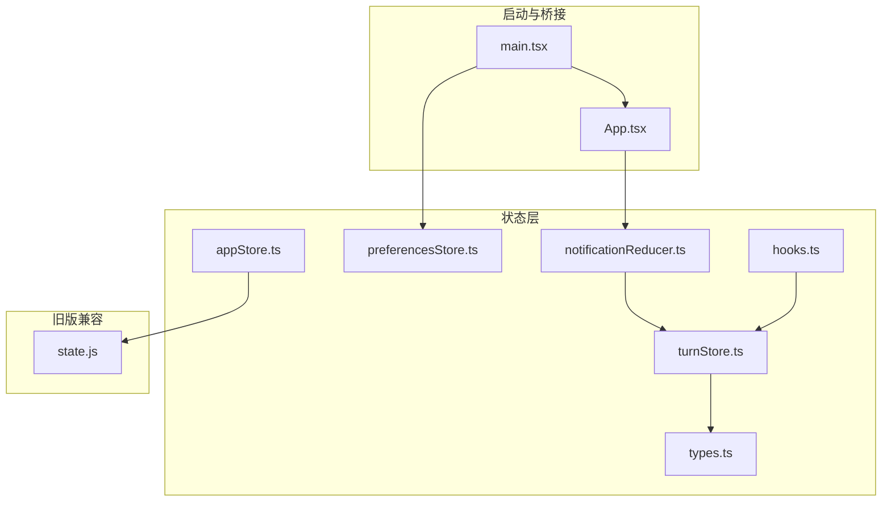
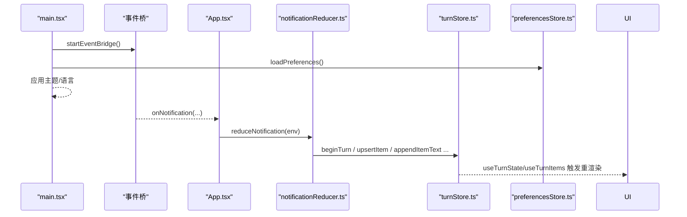
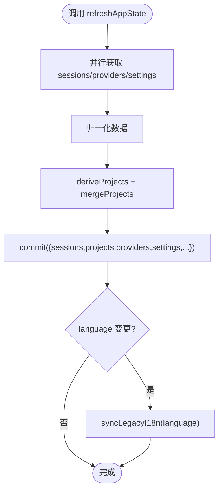
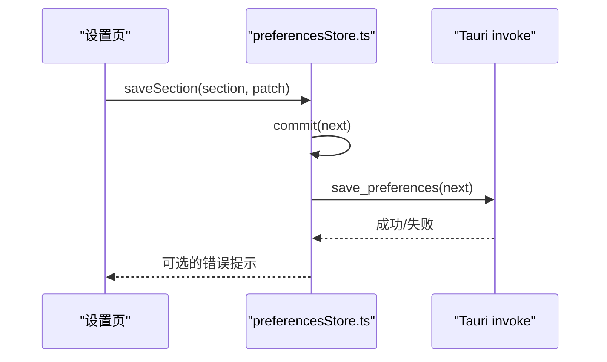
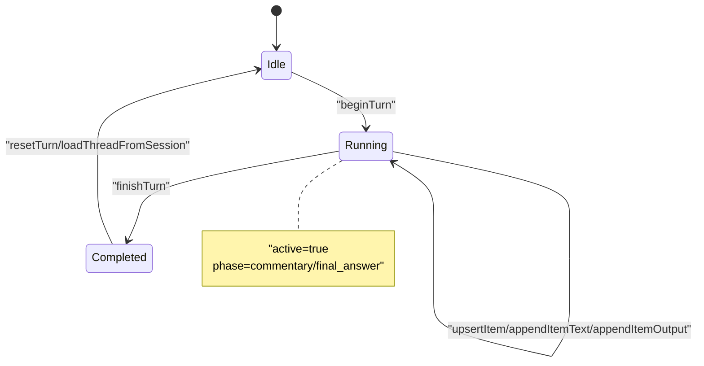
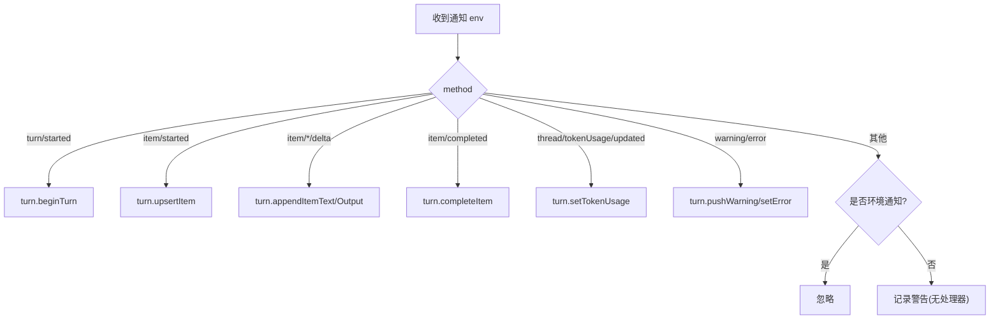
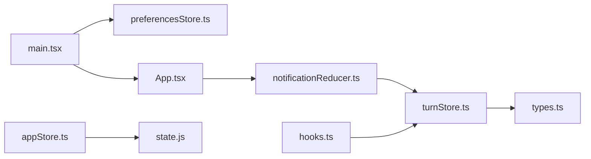

# 状态管理系统

<cite>
**本文引用的文件**
- [appStore.ts](file://frontend/app/state/appStore.ts)
- [preferencesStore.ts](file://frontend/app/state/preferencesStore.ts)
- [turnStore.ts](file://frontend/app/state/turnStore.ts)
- [types.ts](file://frontend/app/state/types.ts)
- [hooks.ts](file://frontend/app/state/hooks.ts)
- [notificationReducer.ts](file://frontend/app/state/notificationReducer.ts)
- [mockTurn.ts](file://frontend/app/state/mockTurn.ts)
- [state.js](file://frontend/src/js/state.js)
- [App.tsx](file://frontend/app/App.tsx)
- [main.tsx](file://frontend/app/main.tsx)
</cite>

## 目录
1. [简介](#简介)
2. [项目结构](#项目结构)
3. [核心组件](#核心组件)
4. [架构总览](#架构总览)
5. [详细组件分析](#详细组件分析)
6. [依赖关系分析](#依赖关系分析)
7. [性能考量](#性能考量)
8. [故障排查指南](#故障排查指南)
9. [结论](#结论)
10. [附录](#附录)

## 简介
本文件为 Codex-Tauri 前端的状态管理系统提供系统化文档，覆盖全局应用状态、偏好设置与对话（回合）状态的存储、更新、同步与持久化策略。重点说明：
- appStore：会话、项目、模型提供者与应用设置的集中管理
- preferencesStore：按分区的偏好配置加载、合并与持久化
- turnStore：基于服务端通知的实时对话流状态机与数据模型
- 状态流转图与数据结构定义，展示模块间依赖与通信机制

## 项目结构
状态管理位于 frontend/app/state 目录下，采用“外部 Store + React useSyncExternalStore”模式，避免在高频消息场景下引入 Context 或 prop drilling 的性能开销。

图表来源
- [main.tsx:41-54](file://frontend/app/main.tsx#L41-L54)
- [App.tsx:15-45](file://frontend/app/App.tsx#L15-L45)
- [notificationReducer.ts:189-445](file://frontend/app/state/notificationReducer.ts#L189-L445)
- [turnStore.ts:28-49](file://frontend/app/state/turnStore.ts#L28-L49)
- [appStore.ts:149-155](file://frontend/app/state/appStore.ts#L149-L155)
- [preferencesStore.ts:40-43](file://frontend/app/state/preferencesStore.ts#L40-L43)

章节来源
- [main.tsx:38-54](file://frontend/app/main.tsx#L38-L54)
- [App.tsx:15-45](file://frontend/app/App.tsx#L15-L45)

## 核心组件
- appStore：维护会话列表、项目列表、模型提供者、应用设置、引擎状态等；通过 Tauri invoke 与后端交互，负责数据归一化、派生计算与持久化。
- preferencesStore：以分区 Map 形式管理偏好（appearance、voice、browser、git 等），统一合并默认值并持久化到 shell 存储。
- turnStore：单一事实源，承载当前对话（turn）的完整状态，包括消息项、计划步骤、令牌用量、警告、待处理请求等；由 notificationReducer 驱动。
- hooks：暴露 useTurnState/useTurnItems/useTurnActive 等 Hook，供 UI 订阅 turnStore 的高频变化。
- notificationReducer：将服务端通知映射为 turnStore 的动作，保证所有通知都有处理器，未处理的协议方法会记录为警告。
- types：定义 TurnItem、TurnState、TokenUsage、PlanStep、ServerWarning、PendingRequest 等类型。

章节来源
- [appStore.ts:98-155](file://frontend/app/state/appStore.ts#L98-L155)
- [preferencesStore.ts:17-43](file://frontend/app/state/preferencesStore.ts#L17-L43)
- [turnStore.ts:80-109](file://frontend/app/state/turnStore.ts#L80-L109)
- [hooks.ts:17-42](file://frontend/app/state/hooks.ts#L17-L42)
- [notificationReducer.ts:189-445](file://frontend/app/state/notificationReducer.ts#L189-L445)
- [types.ts:11-146](file://frontend/app/state/types.ts#L11-L146)

## 架构总览
整体数据流遵循“事件驱动 + 单向数据流”：
- 启动阶段：main.tsx 安装路由、启动事件桥、加载偏好并应用主题与语言。
- 运行时：App.tsx 订阅服务端通知，交由 notificationReducer 转换为 turnStore 动作；UI 通过 hooks 订阅 turnStore。
- 用户操作：通过 appStore 和 preferencesStore 的 action 修改状态，并异步持久化到后端。

图表来源
- [main.tsx:41-54](file://frontend/app/main.tsx#L41-L54)
- [App.tsx:15-45](file://frontend/app/App.tsx#L15-L45)
- [notificationReducer.ts:189-215](file://frontend/app/state/notificationReducer.ts#L189-L215)
- [turnStore.ts:71-107](file://frontend/app/state/turnStore.ts#L71-L107)

## 详细组件分析

### appStore：全局应用状态
- 状态结构
  - sessions：会话摘要（id、title、cwd、projectId、archived、updatedAt、preview）
  - projects：项目条目（id/cwd、name、path）
  - providers：模型提供者（id、name、models、hasApiKey、protocol、baseUrl）
  - settings：应用设置（activeModel、activeProviderId、modelReasoningEffort、approvalPolicy、fullAccess、sidebarCollapsed、language、sandbox、webSearch、outputVerbosity、reasoningSummary、activeProjectPath）
  - activeSessionId、activeProjectId、extraProjects、engineStatus、loaded、error
- 关键能力
  - 数据归一化：normaliseSessions、normaliseProviders、normaliseSettings
  - 派生计算：deriveProjects（从会话 cwd 推导项目）、mergeProjects（合并额外项目）
  - 状态更新：setActiveSession、setActiveProject、openProjectPicker、addProject、saveSettings、refreshAppState
  - 持久化：save_settings（shell-state.json）、config/batchWrite（engine config.toml）、get_preferences/save_preferences（环境项目）
  - 国际化同步：syncLegacyI18n 将 language 推送到旧版 state.js
- 性能要点
  - 使用最小增量提交（commit）与本地 Set 去重，减少重复项目
  - 批量写入 engine 配置（edits 数组），减少 RPC 次数
  - 失败不阻断 UI（如 save_settings 失败仅记录日志）

图表来源
- [appStore.ts:378-408](file://frontend/app/state/appStore.ts#L378-L408)
- [appStore.ts:215-245](file://frontend/app/state/appStore.ts#L215-L245)
- [appStore.ts:446-511](file://frontend/app/state/appStore.ts#L446-L511)

章节来源
- [appStore.ts:98-155](file://frontend/app/state/appStore.ts#L98-L155)
- [appStore.ts:169-245](file://frontend/app/state/appStore.ts#L169-L245)
- [appStore.ts:249-376](file://frontend/app/state/appStore.ts#L249-L376)
- [appStore.ts:378-511](file://frontend/app/state/appStore.ts#L378-L511)

### preferencesStore：偏好设置管理
- 状态结构
  - Preferences：Record<string, PrefSection>，每个分区可独立读写
  - 默认值来自 src/js/state.js 的 defaultPreferences，并通过 mergePreferences 合并
- 关键能力
  - loadPreferences：一次性加载，失败回退到默认值
  - saveSection：先本地 commit，再持久化到后端
  - usePrefSection：读取某个分区并自动合并默认值
  - emitShellEvent：派发 Shell 级自定义事件（如外观变化）
- 数据同步策略
  - 前端优先更新，确保 UI 即时响应
  - 后端写失败仅记录错误，不影响已提交的本地状态

图表来源
- [preferencesStore.ts:59-88](file://frontend/app/state/preferencesStore.ts#L59-L88)
- [state.js:60-136](file://frontend/src/js/state.js#L60-L136)

章节来源
- [preferencesStore.ts:17-94](file://frontend/app/state/preferencesStore.ts#L17-L94)
- [state.js:60-136](file://frontend/src/js/state.js#L60-L136)

### turnStore：会话状态处理
- 状态结构
  - TurnState：sessionId、turnId、active、phase、turnStatus、items、order、startedAt、completedAt、durationMs、error、reconnectAttempt、reconnectFrozen、tokenUsage、plan、warnings、pendingRequests
  - TurnItem：id、type、status、text、phase、command/args/result/output/path/diff/mcpServer/tool/progress、startedAt/completedAt/durationMs、error
- 关键能力
  - beginTurn：开始新回合，仅在切换 thread 时清空 items
  - beginUserTurn：乐观插入用户消息气泡，支持失败回滚（discardItem）
  - upsertItem/appendItemText/appendItemOutput/pushItemProgress：增量更新消息块
  - completeItem：标记完成并计算 durationMs
  - finishTurn：结束回合，保留 reconnectFrozen 语义
  - loadThreadFromSession：从 get_session 与 get_runtime_events 重建历史
- 数据流与状态机
  - 由 notificationReducer 驱动，严格遵循服务端通知
  - 支持断线重连残留状态（reconnectFrozen）与重试计数（reconnectAttempt）

图表来源
- [turnStore.ts:71-107](file://frontend/app/state/turnStore.ts#L71-L107)
- [turnStore.ts:241-256](file://frontend/app/state/turnStore.ts#L241-L256)
- [turnStore.ts:328-466](file://frontend/app/state/turnStore.ts#L328-L466)

章节来源
- [turnStore.ts:28-109](file://frontend/app/state/turnStore.ts#L28-L109)
- [turnStore.ts:118-285](file://frontend/app/state/turnStore.ts#L118-L285)
- [turnStore.ts:328-466](file://frontend/app/state/turnStore.ts#L328-L466)
- [types.ts:11-146](file://frontend/app/state/types.ts#L11-L146)

### notificationReducer：通知到动作映射
- 职责
  - 将服务端通知（turn/item/thread 等）映射为 turnStore 的动作
  - 对未知方法记录警告，确保协议演进可见
- 关键点
  - 区分“仅影响非 turn UI”的环境通知（AMBIENT_METHODS）
  - 标准化字段名（camel/snake_case）与状态枚举
  - 处理 tokenUsage、plan、warnings、pendingRequests 等跨模块共享数据

图表来源
- [notificationReducer.ts:189-445](file://frontend/app/state/notificationReducer.ts#L189-L445)

章节来源
- [notificationReducer.ts:129-184](file://frontend/app/state/notificationReducer.ts#L129-L184)
- [notificationReducer.ts:189-445](file://frontend/app/state/notificationReducer.ts#L189-L445)

### hooks：React 绑定
- useTurnState：订阅 turnStore 快照
- useTurnSelector：选择派生子集，仅在 revision 变化时重算
- useTurnItems：按 order 返回渲染顺序的消息项
- useTurnActive/usePendingRequests：便捷访问活跃状态与待审批请求

章节来源
- [hooks.ts:17-42](file://frontend/app/state/hooks.ts#L17-L42)

### mockTurn：模拟回合（开发调试）
- 通过定时发送一组预置通知，走真实 reduceNotification 路径，便于视觉对比与回归测试
- 支持取消模拟并中断回合

章节来源
- [mockTurn.ts:1-153](file://frontend/app/state/mockTurn.ts#L1-L153)

## 依赖关系分析
- App.tsx 订阅通知并转发给 notificationReducer，后者调用 turnStore 动作
- main.tsx 在启动时加载 preferencesStore，并应用主题与语言
- appStore 与 preferencesStore 均通过 Tauri invoke 与后端交互，分别负责应用设置与偏好配置
- turnStore 依赖 types.ts 的数据结构定义，并由 notificationReducer 驱动
- hooks.ts 暴露 useSyncExternalStore 绑定，使 UI 高效订阅 turnStore

图表来源
- [main.tsx:41-54](file://frontend/app/main.tsx#L41-L54)
- [App.tsx:15-45](file://frontend/app/App.tsx#L15-L45)
- [notificationReducer.ts:189-445](file://frontend/app/state/notificationReducer.ts#L189-L445)
- [turnStore.ts:28-49](file://frontend/app/state/turnStore.ts#L28-L49)
- [types.ts:11-146](file://frontend/app/state/types.ts#L11-L146)
- [appStore.ts:149-155](file://frontend/app/state/appStore.ts#L149-L155)
- [state.js:235-238](file://frontend/src/js/state.js#L235-L238)

章节来源
- [main.tsx:38-54](file://frontend/app/main.tsx#L38-L54)
- [App.tsx:15-45](file://frontend/app/App.tsx#L15-L45)
- [notificationReducer.ts:189-445](file://frontend/app/state/notificationReducer.ts#L189-L445)
- [turnStore.ts:28-49](file://frontend/app/state/turnStore.ts#L28-L49)
- [types.ts:11-146](file://frontend/app/state/types.ts#L11-L146)
- [appStore.ts:149-155](file://frontend/app/state/appStore.ts#L149-L155)
- [state.js:235-238](file://frontend/src/js/state.js#L235-L238)

## 性能考量
- 高频消息优化
  - turnStore 使用外部 Store + useSyncExternalStore，避免 Context 与 prop drilling 带来的重渲染成本
  - 增量更新（appendItemText/appendItemOutput）减少对象重建
  - order 数组保持渲染顺序稳定，查找 O(1)
- 批量持久化
  - appStore.saveSettings 使用 edits 数组批量写入 engine 配置，降低 RPC 次数
- 容错与降级
  - 网络或后端不可用时，UI 仍可工作（如 save_settings 失败仅记录日志）
  - preferencesStore.loadPreferences 失败回退到默认值，避免白屏
- 内存与稳定性
  - 切换 thread 时才清空 items，避免误删历史消息
  - reconnectFrozen 保留断线重连期间的 UI 一致性

[本节为通用性能建议，无需特定文件引用]

## 故障排查指南
- 通知未生效
  - 检查 notificationReducer 是否包含对应 method 的处理分支；未处理的方法会被记录为警告
- 偏好未持久化
  - 确认 preferencesStore.saveSection 的 invoke 是否成功；失败会记录错误但不影响本地状态
- 应用设置未生效
  - 确认 appStore.saveSettings 同时写入了 shell-state.json 与 engine config.toml；若 engine 离线，仅 shell 保存成功
- 对话历史为空
  - 检查 turnStore.loadThreadFromSession 是否正确从 get_session 与 get_runtime_events 拉取数据；若两者皆空，会使用 preview 作为占位
- 语言未切换
  - 确认 appStore.syncLegacyI18n 被调用，且 main.tsx 在启动时应用了语言

章节来源
- [notificationReducer.ts:437-445](file://frontend/app/state/notificationReducer.ts#L437-L445)
- [preferencesStore.ts:76-88](file://frontend/app/state/preferencesStore.ts#L76-L88)
- [appStore.ts:446-511](file://frontend/app/state/appStore.ts#L446-L511)
- [turnStore.ts:328-466](file://frontend/app/state/turnStore.ts#L328-L466)
- [main.tsx:47-54](file://frontend/app/main.tsx#L47-L54)

## 结论
Codex-Tauri 的状态管理采用清晰的分层设计：appStore 负责全局应用状态，preferencesStore 管理分区偏好，turnStore 专注对话流状态。通过 notificationReducer 将服务端通知转化为确定性状态更新，结合 useSyncExternalStore 实现高性能渲染。该架构具备良好的可扩展性与容错性，适合复杂桌面应用的长期演进。

[本节为总结性内容，无需特定文件引用]

## 附录

### 数据结构定义（节选）
- TurnItem：消息块的基本单元，包含类型、状态、文本/输出、进度、时间戳等
- TurnState：当前回合的全量状态，包含消息集合、计划、令牌用量、警告、待处理请求等
- SettingsState：应用设置集合，涵盖模型、沙箱、搜索、输出级别、语言等
- Preferences：分区 Map，每个分区可独立读写并合并默认值

章节来源
- [types.ts:11-146](file://frontend/app/state/types.ts#L11-L146)
- [appStore.ts:63-113](file://frontend/app/state/appStore.ts#L63-L113)
- [preferencesStore.ts:17-18](file://frontend/app/state/preferencesStore.ts#L17-L18)