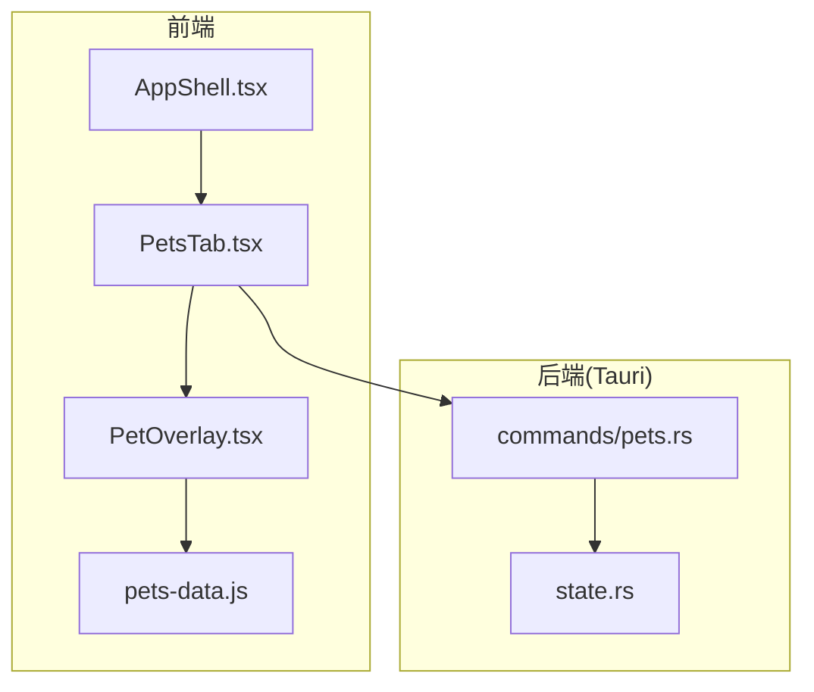
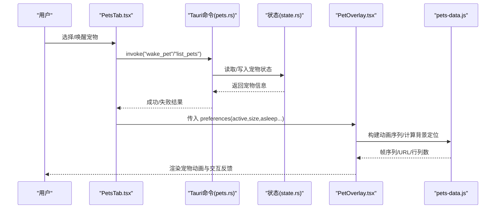
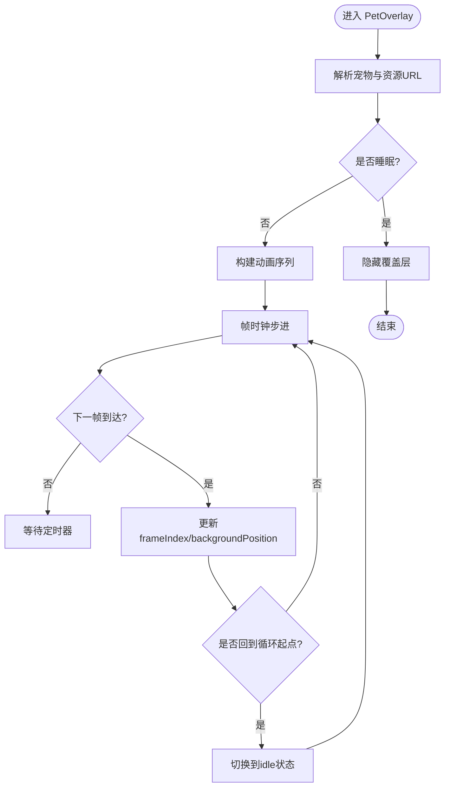
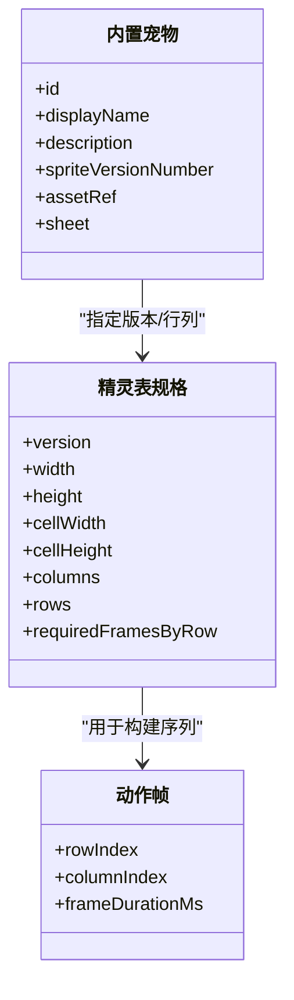
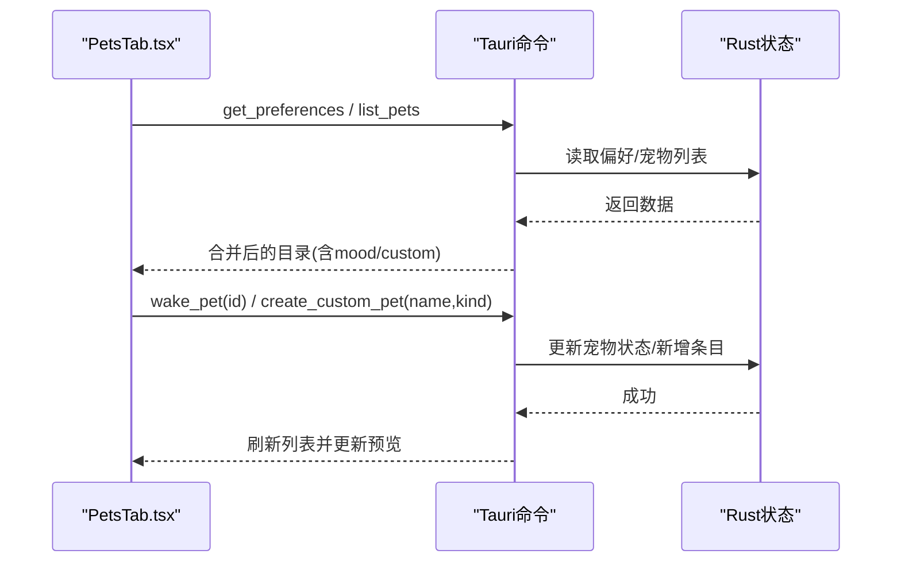
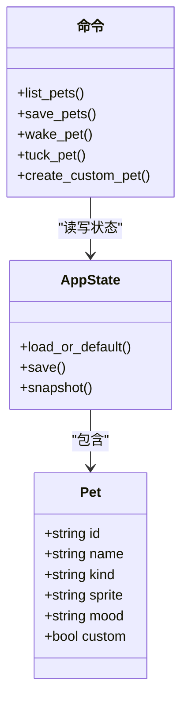
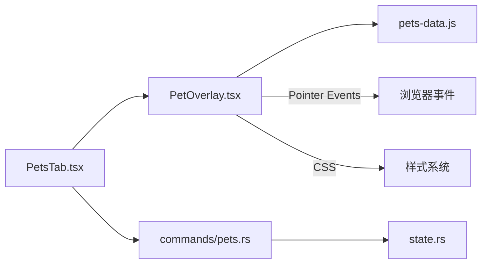

# 宠物覆盖层组件

<cite>
**本文引用的文件**
- [PetOverlay.tsx](file://frontend/app/pet/PetOverlay.tsx)
- [pets-data.js](file://frontend/src/js/pets-data.js)
- [PetsTab.tsx](file://frontend/app/views/settings/tabs/PetsTab.tsx)
- [pets.rs](file://src-tauri/src/commands/pets.rs)
- [state.rs](file://src-tauri/src/state.rs)
- [AppShell.tsx](file://frontend/app/shell/AppShell.tsx)
</cite>

## 目录
1. [简介](#简介)
2. [项目结构](#项目结构)
3. [核心组件](#核心组件)
4. [架构总览](#架构总览)
5. [详细组件分析](#详细组件分析)
6. [依赖关系分析](#依赖关系分析)
7. [性能考量](#性能考量)
8. [故障排查指南](#故障排查指南)
9. [结论](#结论)
10. [附录](#附录)

## 简介
本文件为 Codex-Tauri 的“宠物覆盖层”（PetOverlay）组件提供系统化文档。内容涵盖：
- 宠物的动画系统、交互行为与生命周期管理
- 数据模型、资源管理与性能优化策略
- 与主应用的集成方式、事件通信机制与状态同步
- 自定义开发指南、动画效果实现与用户体验优化
- 主题切换、行为配置与扩展开发的实践示例

## 项目结构
前端侧围绕 React 组件与静态资源组织，后端通过 Tauri 命令暴露持久化与运行时状态。关键位置如下：
- 覆盖层渲染与交互：frontend/app/pet/PetOverlay.tsx
- 动画帧序列、精灵表规格与内置宠物清单：frontend/src/js/pets-data.js
- 设置页中的宠物选择与预览：frontend/app/views/settings/tabs/PetsTab.tsx
- 后端状态与命令：src-tauri/src/state.rs、src-tauri/src/commands/pets.rs
- 应用外壳与全局挂载点：frontend/app/shell/AppShell.tsx

图表来源
- [PetOverlay.tsx:56-114](file://frontend/app/pet/PetOverlay.tsx#L56-L114)
- [pets-data.js:22-147](file://frontend/src/js/pets-data.js#L22-L147)
- [PetsTab.tsx:101-187](file://frontend/app/views/settings/tabs/PetsTab.tsx#L101-L187)
- [pets.rs:4-65](file://src-tauri/src/commands/pets.rs#L4-L65)
- [state.rs:150-231](file://src-tauri/src/state.rs#L150-L231)

章节来源
- [PetOverlay.tsx:1-217](file://frontend/app/pet/PetOverlay.tsx#L1-L217)
- [pets-data.js:1-259](file://frontend/src/js/pets-data.js#L1-L259)
- [PetsTab.tsx:1-274](file://frontend/app/views/settings/tabs/PetsTab.tsx#L1-L274)
- [pets.rs:1-66](file://src-tauri/src/commands/pets.rs#L1-L66)
- [state.rs:1-331](file://src-tauri/src/state.rs#L1-L331)
- [AppShell.tsx:1-205](file://frontend/app/shell/AppShell.tsx#L1-L205)

## 核心组件
- PetOverlay：负责宠物的绘制、动画循环、方向注视、拖拽与交互；根据偏好与引擎返回的宠物列表决定显示内容与行为。
- pets-data：集中维护精灵表规格、动作帧序列、16向注视映射、内置宠物清单与资源 URL 解析。
- PetsTab：设置页中展示宠物目录、选择当前宠物、触发唤醒/创建自定义宠物，并内嵌 PetOverlay 进行实时预览。
- 后端 state 与命令：持久化宠物列表、读写宠物情绪等运行时状态，提供 list_pets/save_pets/wake_pet/tuck_pet/create_custom_pet 等能力。

章节来源
- [PetOverlay.tsx:34-78](file://frontend/app/pet/PetOverlay.tsx#L34-L78)
- [pets-data.js:53-147](file://frontend/src/js/pets-data.js#L53-L147)
- [PetsTab.tsx:29-99](file://frontend/app/views/settings/tabs/PetsTab.tsx#L29-L99)
- [pets.rs:4-65](file://src-tauri/src/commands/pets.rs#L4-L65)
- [state.rs:66-77](file://src-tauri/src/state.rs#L66-L77)

## 架构总览
下图展示了从设置页到覆盖层的完整调用链与数据流：用户在选择或预览时，前端通过 Tauri 命令与 Rust 后端交互，读取/更新宠物状态；PetOverlay 基于 pets-data 提供的帧序列与精灵表资源进行渲染。

图表来源
- [PetsTab.tsx:154-187](file://frontend/app/views/settings/tabs/PetsTab.tsx#L154-L187)
- [pets.rs:4-65](file://src-tauri/src/commands/pets.rs#L4-L65)
- [state.rs:150-231](file://src-tauri/src/state.rs#L150-L231)
- [PetOverlay.tsx:78-114](file://frontend/app/pet/PetOverlay.tsx#L78-L114)
- [pets-data.js:104-147](file://frontend/src/js/pets-data.js#L104-L147)

## 详细组件分析

### PetOverlay 组件
- 职责
  - 根据 preferences 与 enginePets 解析当前宠物与资源 URL
  - 驱动帧时钟，按 sequence.frames 播放动画，支持循环与一次性动作
  - 处理 16 向注视：鼠标移动时计算方向帧，离开后恢复
  - 拖拽：指针捕获 + 视口边界限制
  - 交互：悬停/双击触发跳跃动作，按下开始拖拽时进入挥手动作
- 关键数据结构
  - 状态：state（当前动作）、frameIndex（当前帧）、lookFrame（注视坐标）、position（拖拽位置）
  - 引用：dragRef、lookTimerRef、elRef
- 动画系统
  - 使用 buildPetSequence 生成帧序列；减少动效时仅显示首帧
  - 一次性动作重复三次后回退到空闲循环
  - 帧时长来自 pets-data 的 frameDurationMs
- 资源管理
  - 通过 petSheetUrl 获取精灵图地址；根据 spriteVersionNumber 确定行数
  - 使用 CSS backgroundPosition 与 imageRendering: pixelated 保证像素风格清晰
- 生命周期
  - 当 sequence 变化时重置帧索引并重启定时器
  - 清理 pointermove/blur 监听与定时器，避免内存泄漏
- 可访问性
  - role="img"、aria-label、title 使用 displayName/name 提供语义描述

图表来源
- [PetOverlay.tsx:62-114](file://frontend/app/pet/PetOverlay.tsx#L62-L114)
- [pets-data.js:104-112](file://frontend/src/js/pets-data.js#L104-L112)

章节来源
- [PetOverlay.tsx:56-217](file://frontend/app/pet/PetOverlay.tsx#L56-L217)

### pets-data：动画与资源规范
- 精灵表规格：v1/v2 版本行列、单元格尺寸、每行必需帧数
- 动作定义：failed/jumping/review/running/running-left/running-right/waving/waiting
- 空闲循环：对 row 0 的闪烁帧进行拉伸以形成连续 idle 循环
- 16 向注视：将鼠标相对中心的角度映射到 rows 9-10 的 16 个方向
- 内置宠物清单：id、displayName、description、spriteVersionNumber、assetRef/sheet
- 资源解析：优先使用 thumb/spritesheetUrl，其次 assetRef/id 映射到 /assets/pets/...

图表来源
- [pets-data.js:22-43](file://frontend/src/js/pets-data.js#L22-L43)
- [pets-data.js:87-112](file://frontend/src/js/pets-data.js#L87-L112)
- [pets-data.js:156-229](file://frontend/src/js/pets-data.js#L156-L229)

章节来源
- [pets-data.js:1-259](file://frontend/src/js/pets-data.js#L1-L259)

### PetsTab：设置页与预览
- 加载偏好与后端宠物列表，合并官方清单与自定义宠物
- 提供“显示宠物”按钮，调用 wake_pet 并刷新列表
- 支持创建自定义宠物，自动设为活跃并保存偏好
- 在预览卡片中直接嵌入 PetOverlay，实时反映当前选择

图表来源
- [PetsTab.tsx:106-187](file://frontend/app/views/settings/tabs/PetsTab.tsx#L106-L187)
- [pets.rs:4-65](file://src-tauri/src/commands/pets.rs#L4-L65)
- [state.rs:150-231](file://src-tauri/src/state.rs#L150-L231)

章节来源
- [PetsTab.tsx:1-274](file://frontend/app/views/settings/tabs/PetsTab.tsx#L1-L274)

### 后端状态与命令
- Pet 数据模型：id、name、kind、sprite、mood、custom
- 命令
  - list_pets：返回当前宠物列表
  - save_pets：批量保存宠物列表
  - wake_pet/tuck_pet：修改指定宠物的 mood（happy/sleepy）
  - create_custom_pet：创建自定义宠物并加入列表
- 持久化：AppState.save 将 InnerState 序列化到 shell-state.json，原子写入 tmp 再 rename

图表来源
- [state.rs:66-77](file://src-tauri/src/state.rs#L66-L77)
- [state.rs:150-231](file://src-tauri/src/state.rs#L150-L231)
- [pets.rs:4-65](file://src-tauri/src/commands/pets.rs#L4-L65)

章节来源
- [pets.rs:1-66](file://src-tauri/src/commands/pets.rs#L1-L66)
- [state.rs:1-331](file://src-tauri/src/state.rs#L1-L331)

### 与主应用集成
- AppShell 作为应用外壳，承载标题栏、侧边栏与主视图；设置页以兄弟节点方式渲染，确保样式规则生效
- 宠物覆盖层通常由设置页或其他入口按需挂载；其样式类 codex-pet-overlay 便于全局定位与主题适配

章节来源
- [AppShell.tsx:1-205](file://frontend/app/shell/AppShell.tsx#L1-L205)

## 依赖关系分析
- 组件耦合
  - PetOverlay 强依赖 pets-data 的动画与资源函数，弱依赖 enginePets 注入
  - PetsTab 依赖 Tauri 命令与 pets-data，同时消费 PetOverlay 进行预览
  - 后端通过 state.rs 统一存储与持久化，命令层无副作用地操作状态
- 外部依赖
  - Tauri invoke/listen 用于前后端通信
  - 浏览器 Pointer Events 用于拖拽与注视
  - CSS 像素化渲染与背景定位实现精灵图动画

图表来源
- [PetOverlay.tsx:16-27](file://frontend/app/pet/PetOverlay.tsx#L16-L27)
- [PetsTab.tsx:10-20](file://frontend/app/views/settings/tabs/PetsTab.tsx#L10-L20)
- [pets.rs:1-66](file://src-tauri/src/commands/pets.rs#L1-L66)
- [state.rs:150-231](file://src-tauri/src/state.rs#L150-L231)

章节来源
- [PetOverlay.tsx:1-217](file://frontend/app/pet/PetOverlay.tsx#L1-L217)
- [pets-data.js:1-259](file://frontend/src/js/pets-data.js#L1-L259)
- [PetsTab.tsx:1-274](file://frontend/app/views/settings/tabs/PetsTab.tsx#L1-L274)
- [pets.rs:1-66](file://src-tauri/src/commands/pets.rs#L1-L66)
- [state.rs:1-331](file://src-tauri/src/state.rs#L1-L331)

## 性能考量
- 动画性能
  - 使用 setTimeout 驱动的轻量帧时钟，避免重排重绘开销
  - 减少动效模式下仅渲染首帧，降低 CPU/GPU 压力
  - 一次性动作重复三次后回归 idle，避免长时高帧率动画
- 资源加载
  - 精灵图通过 CSS backgroundPosition 切片，避免多 DOM 节点
  - 图片渲染使用 pixelated 保持像素清晰度，减少模糊采样
- 交互性能
  - 使用 passive 监听 pointermove，提升滚动与拖拽流畅度
  - 拖拽时使用 setPointerCapture 简化事件绑定与释放
- 内存管理
  - 组件卸载时移除 document/window 事件监听并清理定时器
  - 状态变更最小化，仅在必要时更新 frameIndex/position

[本节为通用性能建议，不直接分析具体文件]

## 故障排查指南
- 宠物不显示
  - 检查 preferences.asleep 是否为 true；若为真则覆盖层隐藏
  - 确认 petSheetUrl 能解析到有效资源路径（thumb/spritesheetUrl/assetRef）
- 动画不播放或卡顿
  - 检查 reduceMotion 是否开启导致仅显示首帧
  - 查看 sequence.frames 长度与 loopStartIndex 是否正确
- 拖拽异常
  - 确认 onPointerDown 已捕获指针且 dragRef.current 不为空
  - 检查视口边界计算是否越界
- 后端状态不同步
  - 调用 wake_pet/tuck_pet 后需刷新列表（refreshPets）
  - 注意官方宠物可能不在后端存储，命令失败属预期情况

章节来源
- [PetOverlay.tsx:176-183](file://frontend/app/pet/PetOverlay.tsx#L176-L183)
- [PetOverlay.tsx:145-174](file://frontend/app/pet/PetOverlay.tsx#L145-L174)
- [PetsTab.tsx:154-187](file://frontend/app/views/settings/tabs/PetsTab.tsx#L154-L187)

## 结论
PetOverlay 以简洁的数据驱动方式实现了与官方一致的宠物动画与交互体验。通过 pets-data 集中管理精灵表与动作序列，结合 Tauri 命令完成跨进程状态同步，既保证了行为一致性，又具备良好的可扩展性与性能表现。建议在后续迭代中继续遵循“资源与逻辑解耦”的原则，并通过减少动效模式与懒加载进一步提升体验。

[本节为总结性内容，不直接分析具体文件]

## 附录

### 自定义开发指南
- 添加新宠物
  - 在 pets-data.js 的 OFFICIAL_PETS 或自定义列表中增加条目，提供 id、displayName、description、spriteVersionNumber、assetRef/sheet
  - 如需自定义资源，可在宠物对象上提供 thumb 或 spritesheetUrl
- 自定义行为
  - 在 pets-data.js 的 PET_ACTIONS 中添加新的动作行帧序列，并在 PetOverlay 中通过 action prop 触发
  - 调整 IDLE_LOOP_SCALE 控制空闲循环节奏
- 主题切换
  - 通过 CSS 变量或主题类名作用于 .codex-pet-overlay，配合 imageRendering 与背景色实现明暗适配
- 行为配置
  - 通过 preferences.size 控制大小（MIN_SIZE/MAX_SIZE），preferences.reduced_motion 控制动效强度
  - 通过 enginePets 注入引擎侧宠物列表，实现动态替换

章节来源
- [pets-data.js:87-112](file://frontend/src/js/pets-data.js#L87-L112)
- [pets-data.js:156-229](file://frontend/src/js/pets-data.js#L156-L229)
- [PetOverlay.tsx:30-33](file://frontend/app/pet/PetOverlay.tsx#L30-L33)
- [PetOverlay.tsx:56-78](file://frontend/app/pet/PetOverlay.tsx#L56-L78)

### 事件通信与状态同步
- 前端 → 后端：通过 Tauri invoke 调用 list_pets/save_pets/wake_pet/tuck_pet/create_custom_pet
- 后端 → 前端：命令返回最新宠物状态，前端合并到目录并刷新 UI
- 本地偏好：get_preferences/save_preferences 用于持久化 pets.active/selected/asleep/size

章节来源
- [PetsTab.tsx:106-187](file://frontend/app/views/settings/tabs/PetsTab.tsx#L106-L187)
- [pets.rs:4-65](file://src-tauri/src/commands/pets.rs#L4-L65)
- [state.rs:150-231](file://src-tauri/src/state.rs#L150-L231)