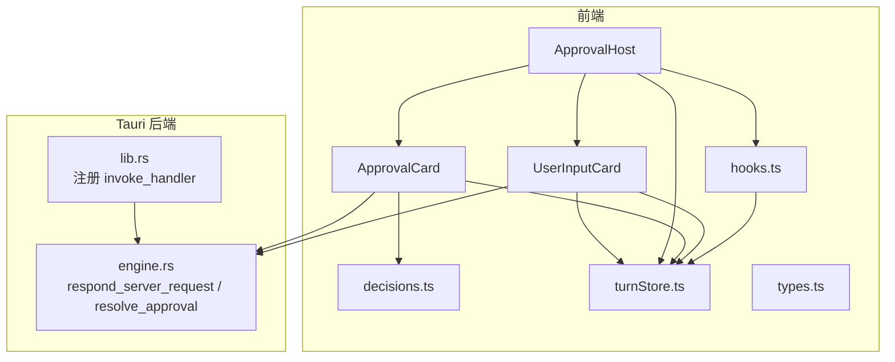
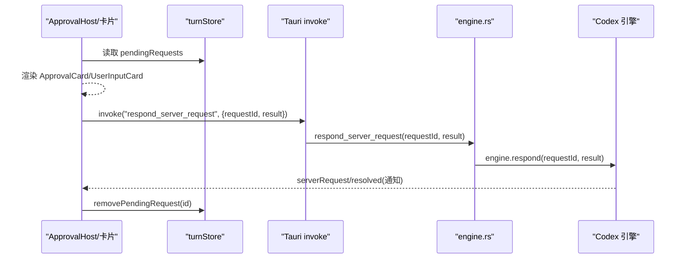
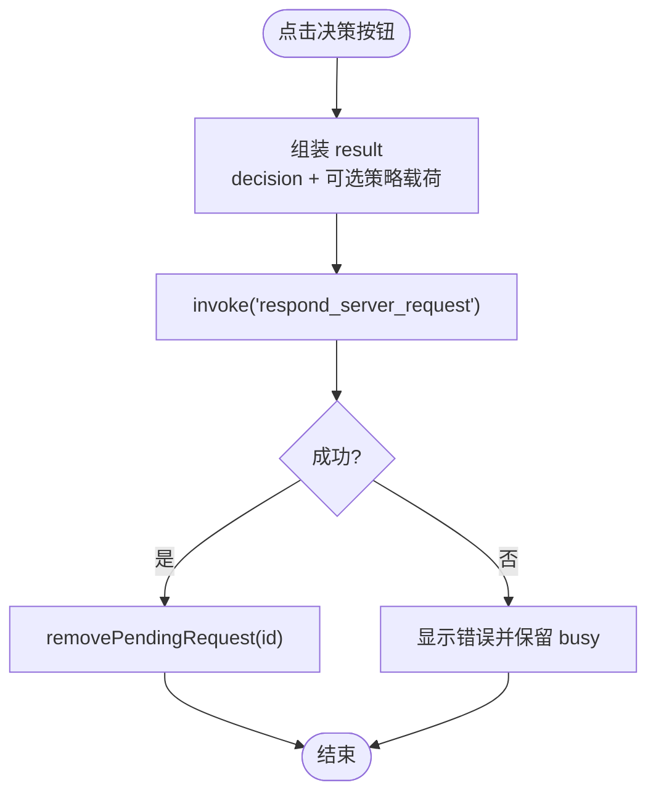
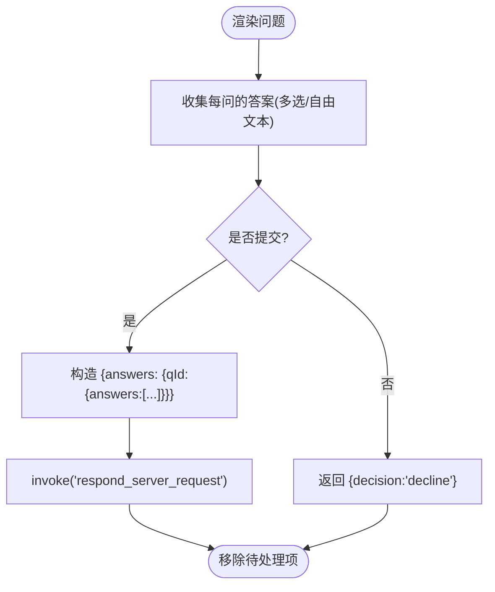
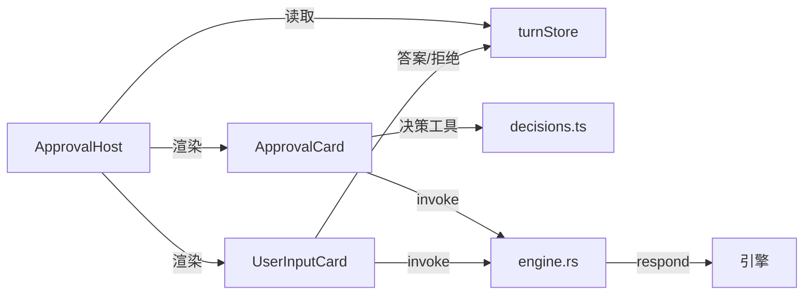

# 审批工作流组件

<cite>
**本文引用的文件**
- [ApprovalHost.tsx](file://frontend/app/approvals/ApprovalHost.tsx)
- [ApprovalCard.tsx](file://frontend/app/approvals/ApprovalCard.tsx)
- [UserInputCard.tsx](file://frontend/app/approvals/UserInputCard.tsx)
- [decisions.ts](file://frontend/app/approvals/decisions.ts)
- [turnStore.ts](file://frontend/app/state/turnStore.ts)
- [types.ts](file://frontend/app/state/types.ts)
- [hooks.ts](file://frontend/app/state/hooks.ts)
- [engine.rs](file://src-tauri/src/commands/engine.rs)
- [lib.rs](file://src-tauri/src/lib.rs)
</cite>

## 目录
1. [简介](#简介)
2. [项目结构](#项目结构)
3. [核心组件](#核心组件)
4. [架构总览](#架构总览)
5. [详细组件分析](#详细组件分析)
6. [依赖关系分析](#依赖关系分析)
7. [性能与可靠性](#性能与可靠性)
8. [故障排查指南](#故障排查指南)
9. [结论](#结论)
10. [附录：扩展与定制指南](#附录：扩展与定制指南)

## 简介
本文件为 Codex-Tauri 的“审批工作流组件”提供系统化文档，聚焦 ApprovalHost 及其子组件如何承载来自后端的服务器→客户端请求（审批、用户输入等），并驱动用户交互、决策回传与状态同步。内容涵盖：
- 审批请求生命周期管理（进入待处理、渲染、响应、清理）
- 用户交互流程（审批卡片、用户输入卡片、未处理请求兜底）
- 决策处理机制（可选项来源、结果构造、策略映射）
- 状态同步、超时与重试策略说明
- 配置项与安全考虑（权限模式、策略开关）
- 自定义审批类型与扩展方法

## 项目结构
审批相关的前端代码集中在 frontend/app/approvals 目录，配合状态层 frontend/app/state 与后端命令 src-tauri/src/commands/engine.rs 完成端到端闭环。

图表来源
- [ApprovalHost.tsx:74-92](file://frontend/app/approvals/ApprovalHost.tsx#L74-L92)
- [ApprovalCard.tsx:37-68](file://frontend/app/approvals/ApprovalCard.tsx#L37-L68)
- [UserInputCard.tsx:65-108](file://frontend/app/approvals/UserInputCard.tsx#L65-L108)
- [decisions.ts:79-108](file://frontend/app/approvals/decisions.ts#L79-L108)
- [turnStore.ts:274-281](file://frontend/app/state/turnStore.ts#L274-L281)
- [hooks.ts:17-42](file://frontend/app/state/hooks.ts#L17-L42)
- [engine.rs:137-183](file://src-tauri/src/commands/engine.rs#L137-L183)
- [lib.rs:71-148](file://src-tauri/src/lib.rs#L71-L148)

章节来源
- [ApprovalHost.tsx:1-92](file://frontend/app/approvals/ApprovalHost.tsx#L1-L92)
- [turnStore.ts:1-467](file://frontend/app/state/turnStore.ts#L1-L467)
- [engine.rs:137-183](file://src-tauri/src/commands/engine.rs#L137-L183)
- [lib.rs:71-148](file://src-tauri/src/lib.rs#L71-L148)

## 核心组件
- ApprovalHost：根据 pendingRequests 列表分发渲染，按 method 路由到 ApprovalCard、UserInputCard 或通用 UnhandledRequestCard。
- ApprovalCard：展示审批上下文（命令、工作目录、变更、原因等），渲染服务端提供的可用决策按钮，提交决策并乐观移除待处理项。
- UserInputCard：结构化用户输入问卷（支持多选、自由文本、敏感字段），提交答案或拒绝。
- decisions.ts：定义决策词汇表、标签、视觉权重，以及将决策与参数拼装为协议所需 result 的工具函数。
- turnStore/types：维护 TurnState 与 PendingRequest，提供 add/remove 待处理请求、订阅更新等能力。
- hooks：通过 useSyncExternalStore 暴露 TurnState 给 React 组件消费。
- engine.rs：将前端的 respond_server_request 转发至引擎侧以回复具体 request_id；resolve_approval 用于兼容旧式布尔审批。

章节来源
- [ApprovalHost.tsx:20-92](file://frontend/app/approvals/ApprovalHost.tsx#L20-L92)
- [ApprovalCard.tsx:37-131](file://frontend/app/approvals/ApprovalCard.tsx#L37-L131)
- [UserInputCard.tsx:22-209](file://frontend/app/approvals/UserInputCard.tsx#L22-L209)
- [decisions.ts:13-108](file://frontend/app/approvals/decisions.ts#L13-L108)
- [turnStore.ts:274-281](file://frontend/app/state/turnStore.ts#L274-L281)
- [types.ts:71-109](file://frontend/app/state/types.ts#L71-L109)
- [hooks.ts:17-42](file://frontend/app/state/hooks.ts#L17-L42)
- [engine.rs:137-183](file://src-tauri/src/commands/engine.rs#L137-L183)

## 架构总览
审批工作流由“服务端发起请求 → 前端渲染卡片 → 用户决策 → 前端调用 Tauri 命令 → 后端转发至引擎”构成闭环。关键路径如下：

图表来源
- [ApprovalHost.tsx:74-92](file://frontend/app/approvals/ApprovalHost.tsx#L74-L92)
- [ApprovalCard.tsx:51-68](file://frontend/app/approvals/ApprovalCard.tsx#L51-L68)
- [UserInputCard.tsx:89-108](file://frontend/app/approvals/UserInputCard.tsx#L89-L108)
- [engine.rs:165-183](file://src-tauri/src/commands/engine.rs#L165-L183)
- [turnStore.ts:274-281](file://frontend/app/state/turnStore.ts#L274-L281)

## 详细组件分析

### ApprovalHost：请求分发与生命周期入口
- 职责：监听 pendingRequests，按 method 分类渲染三类卡片；对未知 method 提供“未处理请求”兜底，确保不会静默挂起。
- 关键点：
  - 仅当 pendingRequests.length > 0 时渲染区域。
  - 使用白名单匹配 APPROVAL_METHODS 与 USER_INPUT_METHODS，其余走 UnhandledRequestCard。
  - 每个卡片携带 data-request-id，便于调试与定位。

章节来源
- [ApprovalHost.tsx:20-92](file://frontend/app/approvals/ApprovalHost.tsx#L20-L92)

### ApprovalCard：审批决策与策略回显
- 职责：展示命令/工作目录/变更数量/原因等上下文，渲染服务端提供的 availableDecisions 列表，提交决策。
- 决策构建：
  - decisionsFor(params) 从 params.availableDecisions 或 available_decisions 提取有序列表；缺失时回退到默认集合，避免提供服务端不支持的选项导致挂起。
  - decisionResult(decision, params) 针对“始终允许”类决策回显服务端下发的策略修正载荷（执行策略/网络策略）。
- 交互：
  - 点击任一决策按钮触发 respond()，调用 Tauri 命令发送 result，并乐观移除 pending 项；失败时显示错误信息并保持阻塞态。
- 可访问性：使用 role="dialog" 与 aria-modal="false" 提示对话性质。

图表来源
- [ApprovalCard.tsx:51-68](file://frontend/app/approvals/ApprovalCard.tsx#L51-L68)
- [decisions.ts:79-108](file://frontend/app/approvals/decisions.ts#L79-L108)
- [turnStore.ts:274-281](file://frontend/app/state/turnStore.ts#L274-L281)

章节来源
- [ApprovalCard.tsx:37-131](file://frontend/app/approvals/ApprovalCard.tsx#L37-L131)
- [decisions.ts:13-108](file://frontend/app/approvals/decisions.ts#L13-L108)

### UserInputCard：结构化用户输入
- 职责：解析 questions 数组，渲染标题/问题/选项/自由文本（支持密码模式），收集 answers 并提交；若无结构化问题则提供“拒绝”兜底。
- 数据模型：
  - Question 包含 id、header、question、isOther、isSecret、options[]。
  - answers 以 questionId 为键，值为字符串数组（支持多选）。
- 交互：
  - submit() 将 answers 封装为 {answers: payload} 并通过 respond_server_request 回传。
  - decline() 返回 {decision: "decline"} 释放阻塞。
  - 无问题时仍必须回答，防止 turn 挂起。

图表来源
- [UserInputCard.tsx:36-108](file://frontend/app/approvals/UserInputCard.tsx#L36-L108)
- [turnStore.ts:274-281](file://frontend/app/state/turnStore.ts#L274-L281)

章节来源
- [UserInputCard.tsx:22-209](file://frontend/app/approvals/UserInputCard.tsx#L22-L209)

### 决策词汇与策略映射（decisions.ts）
- COMMAND_DECISIONS 与 FILE_CHANGE_DECISIONS 定义两类审批的决策集合。
- DECISION_LABEL_KEY/DECISION_TONE/DECISION_FALLBACK 提供国际化键、视觉权重与英文回退。
- decisionsFor 负责从服务端参数中安全地提取可用决策列表，空列表不降级，避免提供无效选项。
- decisionResult 针对“始终允许”类决策回填策略修正载荷，确保持久化生效。

章节来源
- [decisions.ts:13-108](file://frontend/app/approvals/decisions.ts#L13-L108)

### 状态管理与同步（turnStore/types/hooks）
- TurnState.pendingRequests：存放所有等待响应的服务器请求（id、method、params、receivedAt）。
- addPendingRequest/removePendingRequest：原子更新 pending 列表，供各卡片在响应成功后移除。
- useTurnState/useTurnSelector：基于 useSyncExternalStore 订阅外部 store，避免高频重渲染。
- types.PendingRequest：统一描述待处理请求的数据形状。

章节来源
- [turnStore.ts:274-281](file://frontend/app/state/turnStore.ts#L274-L281)
- [types.ts:71-109](file://frontend/app/state/types.ts#L71-L109)
- [hooks.ts:17-42](file://frontend/app/state/hooks.ts#L17-L42)

### 后端命令与转发（engine.rs / lib.rs）
- respond_server_request：接收前端传入的 requestId 与任意 JSON result，直接转发给引擎进行决议。
- resolve_approval：兼容旧式布尔审批，映射为 accept/acceptForSession/decline/cancel。
- lib.rs 中注册了 respond_server_request 等命令，使前端可通过 @tauri-apps/api/core.invoke 调用。

章节来源
- [engine.rs:137-183](file://src-tauri/src/commands/engine.rs#L137-L183)
- [lib.rs:71-148](file://src-tauri/src/lib.rs#L71-L148)

## 依赖关系分析
- 组件耦合：
  - ApprovalHost 依赖 turnStore 获取 pendingRequests，并按 method 路由到 ApprovalCard/UserInputCard。
  - ApprovalCard/UserInputCard 均依赖 decisions.ts 生成决策与结果，依赖 turnStore 移除待处理项。
  - 所有卡片通过 Tauri invoke 调用 engine.rs 的命令，最终到达引擎。
- 外部依赖：
  - Tauri 插件与命令注册在 lib.rs。
  - 引擎通过 EngineHandle.respond 完成实际决议。

图表来源
- [ApprovalHost.tsx:74-92](file://frontend/app/approvals/ApprovalHost.tsx#L74-L92)
- [ApprovalCard.tsx:51-68](file://frontend/app/approvals/ApprovalCard.tsx#L51-L68)
- [UserInputCard.tsx:89-108](file://frontend/app/approvals/UserInputCard.tsx#L89-L108)
- [engine.rs:165-183](file://src-tauri/src/commands/engine.rs#L165-L183)

章节来源
- [ApprovalHost.tsx:74-92](file://frontend/app/approvals/ApprovalHost.tsx#L74-L92)
- [engine.rs:165-183](file://src-tauri/src/commands/engine.rs#L165-L183)

## 性能与可靠性
- 渲染性能：
  - 使用 useSyncExternalStore 订阅外部 store，避免频繁 context 传递导致的重渲染。
  - pendingRequests 以数组形式存储，按 id 去重添加，减少重复。
- 可靠性：
  - 乐观删除 pending 项，同时依赖服务端 serverRequest/resolved 通知做幂等清理。
  - 未知 method 提供“未处理请求”兜底，确保 turn 不被静默阻塞。
  - 决策列表严格遵循服务端 availableDecisions，避免提供无法处理的选项。
- 超时与重试：
  - 当前实现未内置超时与自动重试逻辑。若 invoke 失败，会显示错误并保留 busy 态，需用户重试或刷新。
  - 建议在业务层增加超时控制与重试策略（例如指数退避），并在失败时提供“重试”操作。

[本节为通用指导，不直接分析具体文件]

## 故障排查指南
- 常见问题
  - 卡片一直显示“正在处理”：检查 respond_server_request 是否成功；查看浏览器控制台错误信息；确认服务端是否已发出 resolved 通知。
  - 决策按钮不可用：busy 态未清除，通常因 invoke 异常；查看错误消息并修复。
  - 未处理请求：method 不在白名单内，会渲染 UnhandledRequestCard；可在此处选择“拒绝”释放 turn。
- 定位步骤
  - 通过 data-request-id 定位具体请求。
  - 在 turnStore 中检查 pendingRequests 是否存在及是否正确移除。
  - 在后端日志中搜索 respond_server_request 与 engine.respond 的调用记录。

章节来源
- [ApprovalCard.tsx:51-68](file://frontend/app/approvals/ApprovalCard.tsx#L51-L68)
- [UserInputCard.tsx:89-123](file://frontend/app/approvals/UserInputCard.tsx#L89-L123)
- [turnStore.ts:274-281](file://frontend/app/state/turnStore.ts#L274-L281)

## 结论
ApprovalHost 及其子组件构成了 Codex-Tauri 审批工作流的核心前端实现：以服务端驱动的 availableDecisions 为准，提供安全的决策渲染与回传；通过 turnStore 集中管理待处理请求，保证状态一致性与可观测性；借助 Tauri 命令将决策可靠地转发至引擎。整体设计强调“不发明状态、不静默挂起”，并提供兜底路径确保用户体验与系统健壮性。

[本节为总结性内容，不直接分析具体文件]

## 附录：扩展与定制指南

### 新增审批类型
- 在前端 ApprovalHost 中添加新的 method 白名单，并决定路由到现有卡片或新建专用卡片。
- 如需新决策集，可在 decisions.ts 中扩展决策常量与映射，并在 decisionResult 中处理载荷回显。
- 若需要新的用户输入表单，参考 UserInputCard 的 questions 解析与 answers 聚合方式。

章节来源
- [ApprovalHost.tsx:20-29](file://frontend/app/approvals/ApprovalHost.tsx#L20-L29)
- [decisions.ts:13-108](file://frontend/app/approvals/decisions.ts#L13-L108)
- [UserInputCard.tsx:36-108](file://frontend/app/approvals/UserInputCard.tsx#L36-L108)

### 审批策略配置与权限控制
- 前端设置页提供 approvalPolicy 下拉（on-request/never），影响是否总是请求审批或跳过。
- Composer 中的权限模式（askApproval/helpApproval/fullAccess）影响行为粒度与风险面。
- 注意：这些配置主要影响服务端是否发起审批请求；一旦请求到达前端，UI 必须提供可操作的决策路径，避免阻塞。

章节来源
- [ConfigurationTab.tsx:144-178](file://frontend/app/views/settings/tabs/ConfigurationTab.tsx#L144-L178)
- [Composer.tsx:120-260](file://frontend/app/views/Composer.tsx#L120-L260)

### 安全考虑
- 最小权限原则：仅在必要时请求审批；对用户可见的敏感字段使用 isSecret 保护。
- 策略载荷回显：对于“始终允许”类决策，务必回显服务端下发的策略修正载荷，确保规则正确持久化。
- 未知 method 兜底：提供明确的拒绝路径，避免被恶意或未知请求长期阻塞。

章节来源
- [ApprovalCard.tsx:51-68](file://frontend/app/approvals/ApprovalCard.tsx#L51-L68)
- [UserInputCard.tsx:180-194](file://frontend/app/approvals/UserInputCard.tsx#L180-L194)
- [decisions.ts:93-108](file://frontend/app/approvals/decisions.ts#L93-L108)

### 超时与重试建议（实现建议）
- 在卡片层增加本地超时计时器（如 30 秒），超时后显示“超时”并提供重试按钮。
- 重试采用指数退避，限制最大次数，避免雪崩。
- 失败时保持 pending 项存在，直到收到 resolved 或用户主动取消。

[本节为通用建议，不直接分析具体文件]