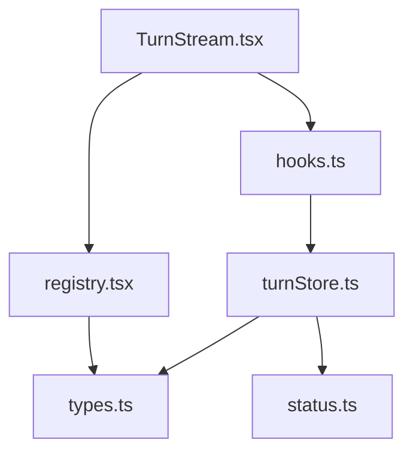
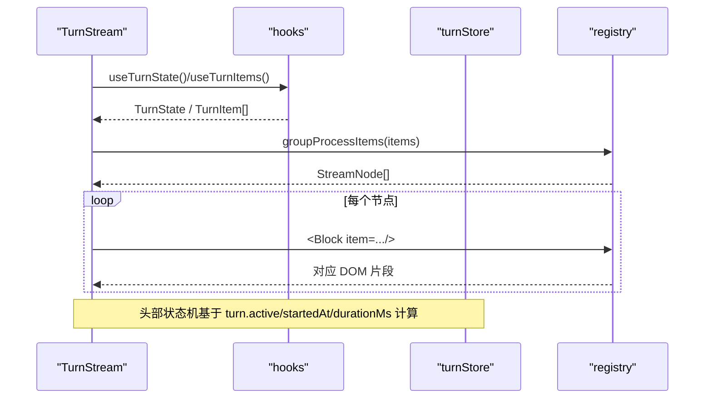
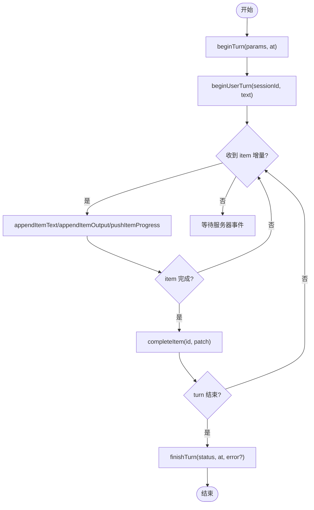
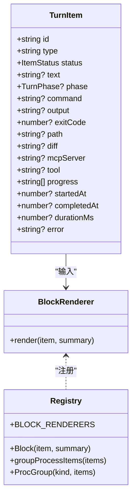
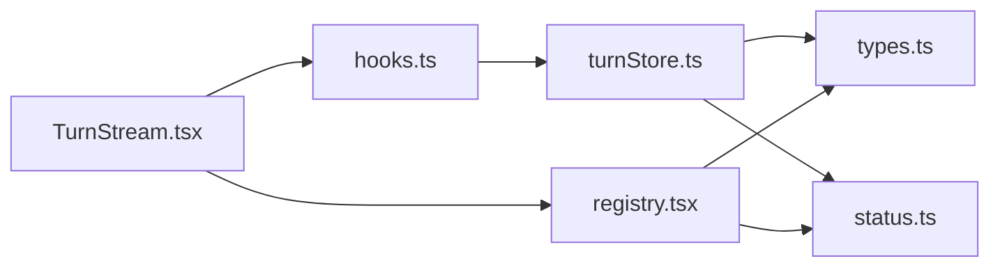

# 消息流组件

<cite>
**本文引用的文件**
- [TurnStream.tsx](file://frontend/app/views/TurnStream.tsx)
- [turnStore.ts](file://frontend/app/state/turnStore.ts)
- [types.ts](file://frontend/app/state/types.ts)
- [hooks.ts](file://frontend/app/state/hooks.ts)
- [registry.tsx](file://frontend/app/blocks/registry.tsx)
- [status.ts](file://frontend/src/protocol/status.ts)
</cite>

## 目录
1. [简介](#简介)
2. [项目结构](#项目结构)
3. [核心组件](#核心组件)
4. [架构总览](#架构总览)
5. [详细组件分析](#详细组件分析)
6. [依赖关系分析](#依赖关系分析)
7. [性能考量](#性能考量)
8. [故障排查指南](#故障排查指南)
9. [结论](#结论)
10. [附录](#附录)

## 简介
本文件面向 Codex-Tauri 的消息流组件，围绕 TurnStream 组件的设计模式与实现进行系统化说明。重点覆盖：
- 实时消息渲染、流式响应处理与消息状态管理
- 消息类型区分（用户消息、AI 响应、系统通知）
- 乐观更新机制与错误恢复策略
- 大消息的分块加载与内存管理
- 消息格式化、代码高亮、Markdown 渲染与交互式元素的处理方式
- 性能优化建议与调试技巧

## 项目结构
前端消息流由“视图层 + 状态层 + 渲染注册表”三部分构成：
- 视图层：TurnStream 负责当前 turn 的头部状态机、折叠/展开、以及将 items 映射为可渲染节点
- 状态层：turnStore 维护单例 TurnState，提供订阅/快照；hooks 暴露 React 绑定
- 渲染层：blocks/registry 根据 item.type 分派到具体 Block 渲染器，并支持工具调用分组、文件变更展示、命令执行卡片等

图表来源
- [TurnStream.tsx:23-27](file://frontend/app/views/TurnStream.tsx#L23-L27)
- [hooks.ts:17-32](file://frontend/app/state/hooks.ts#L17-L32)
- [turnStore.ts:13-26](file://frontend/app/state/turnStore.ts#L13-L26)
- [registry.tsx:17-20](file://frontend/app/blocks/registry.tsx#L17-L20)
- [types.ts:11-109](file://frontend/app/state/types.ts#L11-L109)
- [status.ts:10-46](file://frontend/src/protocol/status.ts#L10-L46)

章节来源
- [TurnStream.tsx:1-21](file://frontend/app/views/TurnStream.tsx#L1-L21)
- [turnStore.ts:1-11](file://frontend/app/state/turnStore.ts#L1-L11)
- [registry.tsx:1-15](file://frontend/app/blocks/registry.tsx#L1-L15)

## 核心组件
- TurnStream：当前 turn 的实时渲染入口，维护“思考/进行中/完成”的头部状态机，按边界定位插入头部行，并对已完成 turn 支持折叠
- turnStore：全局不可变状态源，通过 subscribe/getSnapshot 暴露给 React；集中处理 beginTurn、beginUserTurn、appendItemText、completeItem、finishTurn 等动作
- hooks：useSyncExternalStore 桥接外部 store 到 React，避免高频流导致的上下文重渲染
- registry：Block 渲染器注册表，按 item.type 路由到 ProseBlock、ToolBlock、FileOpBlock、ShellCard、PlanBlock、ImageBlock、ErrorBlock 等；并提供 groupProcessItems 对连续完成的同类工具进行分组折叠

章节来源
- [TurnStream.tsx:64-186](file://frontend/app/views/TurnStream.tsx#L64-L186)
- [turnStore.ts:28-285](file://frontend/app/state/turnStore.ts#L28-L285)
- [hooks.ts:17-43](file://frontend/app/state/hooks.ts#L17-L43)
- [registry.tsx:127-824](file://frontend/app/blocks/registry.tsx#L127-L824)

## 架构总览
TurnStream 读取 turnStore 中的 items 与 turn 元信息，使用 groupProcessItems 生成 StreamNode 列表，再交由 Block 渲染器统一输出。头部行根据 turn.active、firstAgentIdx、durationMs 计算显示文案与交互行为。

图表来源
- [TurnStream.tsx:64-166](file://frontend/app/views/TurnStream.tsx#L64-L166)
- [hooks.ts:17-32](file://frontend/app/state/hooks.ts#L17-L32)
- [registry.tsx:554-635](file://frontend/app/blocks/registry.tsx#L554-L635)
- [registry.tsx:813-818](file://frontend/app/blocks/registry.tsx#L813-L818)

## 详细组件分析

### TurnStream：实时渲染与头部状态机
- 头部状态机：
  - thinking：turn.active 且尚未出现首个 agent 内容时，显示“正在思考”，位于最新用户气泡下方
  - live：出现首个 agent 内容后，显示“已处理 X 秒”，以约 4Hz 刷新
  - done：turn/completed 后，显示“用时 X 秒”，并可折叠 turn 主体（用户气泡保持可见）
- 锚点策略：通过遍历 nodes 找到最后一个 user-message 作为边界，确保 follow-up turn 的头部不会浮入上一个 turn 的回答中
- 折叠逻辑：仅对已完成 turn 生效；首次进入新 turn 默认展开
- 摘要标记：在 turn 完成后，从尾部向前查找最后一个有文本的 agentMessage，将其标记为 summary，用于最终答案的高亮呈现

章节来源
- [TurnStream.tsx:64-166](file://frontend/app/views/TurnStream.tsx#L64-L166)
- [TurnStream.tsx:171-186](file://frontend/app/views/TurnStream.tsx#L171-L186)

### turnStore：消息状态管理与乐观更新
- 单例状态：TurnState 包含 sessionId、turnId、active、phase、items、order、时间戳、tokenUsage、plan、warnings、pendingRequests 等
- 乐观更新：beginUserTurn 立即插入用户消息气泡（status=completed），即使服务端尚未确认；若发送失败可通过 discardItem 回滚该气泡，而不影响历史会话
- 流式追加：appendItemText/appendItemOutput/pushItemProgress 支持增量拼接文本、输出与进度消息，保证到达顺序稳定
- 生命周期：
  - beginTurn：重置 turn 级字段，跨线程切换时清空 items/order
  - completeItem：为 item 打 completedAt/durationMs，并设置 status
  - finishTurn：关闭 turn，记录 durationMs、error、reconnectFrozen 等
- 历史加载：loadThreadFromSession 优先使用 thread.messages，否则回退到 get_runtime_events 的时间线；将不同 itemType 映射为内部 block 类型（如 commandExecution、agentMessage、user-message、reasoning）

图表来源
- [turnStore.ts:71-107](file://frontend/app/state/turnStore.ts#L71-L107)
- [turnStore.ts:118-157](file://frontend/app/state/turnStore.ts#L118-L157)
- [turnStore.ts:159-234](file://frontend/app/state/turnStore.ts#L159-L234)
- [turnStore.ts:241-285](file://frontend/app/state/turnStore.ts#L241-L285)
- [turnStore.ts:328-466](file://frontend/app/state/turnStore.ts#L328-L466)

章节来源
- [turnStore.ts:28-285](file://frontend/app/state/turnStore.ts#L28-L285)
- [turnStore.ts:328-466](file://frontend/app/state/turnStore.ts#L328-L466)

### 渲染注册表：消息类型与可视化
- 消息类型区分：
  - 用户消息：user-message → UserProseBlock
  - AI 响应：agentMessage/assistant-message/realtime-transcript → ProseBlock
  - 推理过程：reasoning → ReasoningBlock（隐藏）
  - 工具调用：commandExecution/exec/mcp-tool-call/dynamic-tool-call → ToolBlock/ProcLine
  - 文件操作：fileChange/patch/read/list_files/search → FileOpBlock
  - 计划：plan/proposed-plan/codexDirective → PlanBlock
  - 图片/附件：imageGeneration/generated-image → ImageBlock
  - 错误：error/system-error → ErrorBlock
  - 其他：unknown → UnknownBlock
- 工具分组：groupProcessItems 将连续的、同 kind 的已完成工具合并为 ProcGroup，减少视觉噪音
- Shell 命令卡：运行中自动展开并滚动到底部；完成后默认折叠，失败/拒绝保持展开
- 文件差异：解析 diff 统计新增/删除行数，支持复制 diff 文本

图表来源
- [types.ts:11-46](file://frontend/app/state/types.ts#L11-L46)
- [registry.tsx:749-818](file://frontend/app/blocks/registry.tsx#L749-L818)
- [registry.tsx:554-635](file://frontend/app/blocks/registry.tsx#L554-L635)

章节来源
- [registry.tsx:127-824](file://frontend/app/blocks/registry.tsx#L127-L824)

### 消息格式化、代码高亮、Markdown 渲染与交互
- 文本渲染：ProseBlock 直接输出纯文本段落；未引入 Markdown 解析器，因此不渲染 Markdown 语法
- 代码高亮：DiffBlock/FileOpBlock 对 diff 文本进行行级着色（+/-/context），但未集成语法高亮库
- 交互式元素：
  - Shell 命令卡：运行中自动滚动至末尾，完成后折叠；失败/拒绝保持展开
  - 文件差异：支持展开查看、复制 diff
  - 工具分组：点击展开查看子项
- 进度与提示：pushItemProgress 累积 MCP 进度消息，在工具行内展示

章节来源
- [registry.tsx:127-163](file://frontend/app/blocks/registry.tsx#L127-L163)
- [registry.tsx:235-241](file://frontend/app/blocks/registry.tsx#L235-L241)
- [registry.tsx:305-404](file://frontend/app/blocks/registry.tsx#L305-L404)
- [registry.tsx:416-509](file://frontend/app/blocks/registry.tsx#L416-L509)
- [registry.tsx:511-513](file://frontend/app/blocks/registry.tsx#L511-L513)
- [registry.tsx:614-635](file://frontend/app/blocks/registry.tsx#L614-L635)

## 依赖关系分析
- TurnStream 依赖 hooks 获取状态，依赖 registry 渲染节点
- hooks 通过 useSyncExternalStore 订阅 turnStore，避免频繁 re-render
- turnStore 依赖 types 定义的数据结构与协议状态枚举
- registry 依赖 types 的 TurnItem 与 protocol 的状态枚举，决定样式类名与分组策略

图表来源
- [TurnStream.tsx:23-27](file://frontend/app/views/TurnStream.tsx#L23-L27)
- [hooks.ts:17-32](file://frontend/app/state/hooks.ts#L17-L32)
- [turnStore.ts:13-26](file://frontend/app/state/turnStore.ts#L13-L26)
- [registry.tsx:17-20](file://frontend/app/blocks/registry.tsx#L17-L20)
- [status.ts:10-46](file://frontend/src/protocol/status.ts#L10-L46)

章节来源
- [turnStore.ts:13-26](file://frontend/app/state/turnStore.ts#L13-L26)
- [registry.tsx:17-20](file://frontend/app/blocks/registry.tsx#L17-L20)

## 性能考量
- 虚拟滚动：当前实现未启用虚拟滚动，所有 items 均参与渲染。对于超长对话，建议在 TurnStream 或外层容器引入基于可视区域的虚拟滚动，仅渲染可见窗口内的节点
- 大消息分块：
  - 文本：appendItemText 逐段拼接，渲染层未做分页；可在渲染层按需懒加载长文本（例如首屏显示前 N 行，其余折叠/延迟渲染）
  - Shell 输出：ShellCard 限制最多显示 400 行，超出部分隐藏并以“…更早的行”提示，避免 DOM 爆炸
  - Diff：DiffBlock 限制最多显示 200 行，超出部分截断
- 内存管理：
  - 历史加载时，仅保留必要字段；避免重复插入相同 id 的 item
  - 跨线程切换时清空 items/order，防止旧会话泄漏
- 渲染频率：
  - 头部“已处理 X 秒”使用 250ms 定时器驱动，避免每帧重绘
  - 工具分组减少重复渲染开销
- 建议优化：
  - 引入虚拟列表（如 react-window）包裹 TurnStream 的 body
  - 对超大文本采用分段渲染与 IntersectionObserver 懒加载
  - 对图片/附件使用占位图与按需加载
  - 对 diff/shell 输出增加“加载更多”按钮而非一次性全量渲染

章节来源
- [TurnStream.tsx:51-60](file://frontend/app/views/TurnStream.tsx#L51-L60)
- [registry.tsx:448-453](file://frontend/app/blocks/registry.tsx#L448-L453)
- [registry.tsx:639-662](file://frontend/app/blocks/registry.tsx#L639-L662)
- [turnStore.ts:71-107](file://frontend/app/state/turnStore.ts#L71-L107)

## 故障排查指南
- 连接与重连：
  - finishTurn 会保留 reconnectFrozen 标志，避免短暂抖动导致误判
  - warnings 数组记录服务端警告，TurnStream 底部以 code 形式展示
- 乐观更新回滚：
  - 若 beginUserTurn 后发送失败，调用 discardItem 移除该气泡，不影响历史会话
- 状态不一致：
  - 检查 beginTurn 是否正确传入 threadId；跨线程切换会清空 items/order
  - 确认 appendItemText/appendItemOutput 的 id/type 与 completeItem 一致
- 渲染异常：
  - 确认 item.type 在 BLOCK_RENDERERS 中有对应渲染器；未知类型会走 UnknownBlock
  - 检查 CSS 类名是否符合 home.css 契约（message-row、proc-line、diff-card 等）

章节来源
- [turnStore.ts:241-285](file://frontend/app/state/turnStore.ts#L241-L285)
- [turnStore.ts:135-141](file://frontend/app/state/turnStore.ts#L135-L141)
- [registry.tsx:736-745](file://frontend/app/blocks/registry.tsx#L736-L745)
- [TurnStream.tsx:171-186](file://frontend/app/views/TurnStream.tsx#L171-L186)

## 结论
TurnStream 组件通过清晰的状态机与稳定的数据流，实现了可靠的实时消息渲染与流式响应处理。turnStore 提供单一事实源与乐观更新能力，registry 则通过类型化路由与分组策略保障可读性与性能。当前实现在大消息与超长对话场景下仍有优化空间，建议引入虚拟滚动与懒加载策略以提升体验。

## 附录
- 关键数据结构
  - TurnItem：描述单个可渲染单元，包含 id、type、status、text/output、时间戳、错误信息等
  - TurnState：描述当前 turn 的全局状态，包括 items、order、active、phase、durationMs、tokenUsage、plan、warnings、pendingRequests 等
- 协议状态
  - ItemStatus：completed/done/failed/in_progress/inProgress/running/interrupted/skipped/denied
  - TurnPhase：commentary/final_answer

章节来源
- [types.ts:11-146](file://frontend/app/state/types.ts#L11-L146)
- [status.ts:10-46](file://frontend/src/protocol/status.ts#L10-L46)