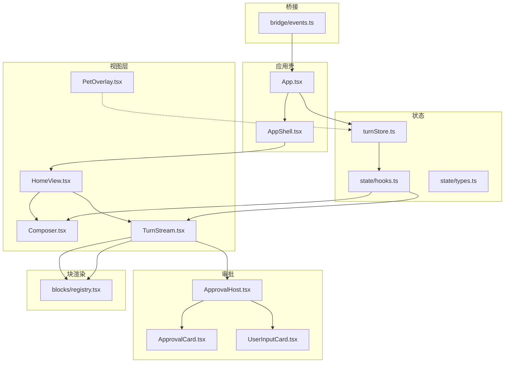
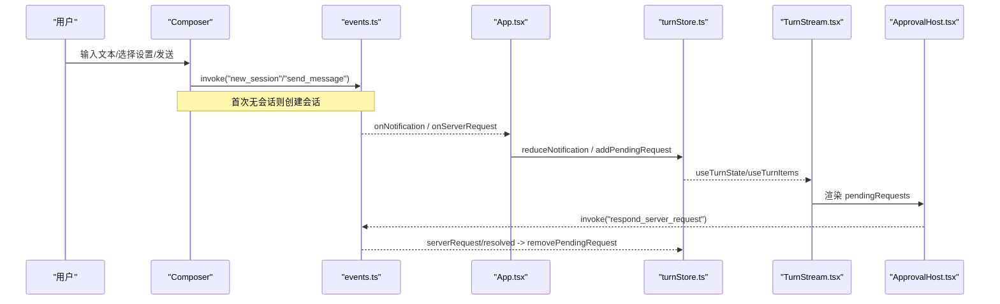
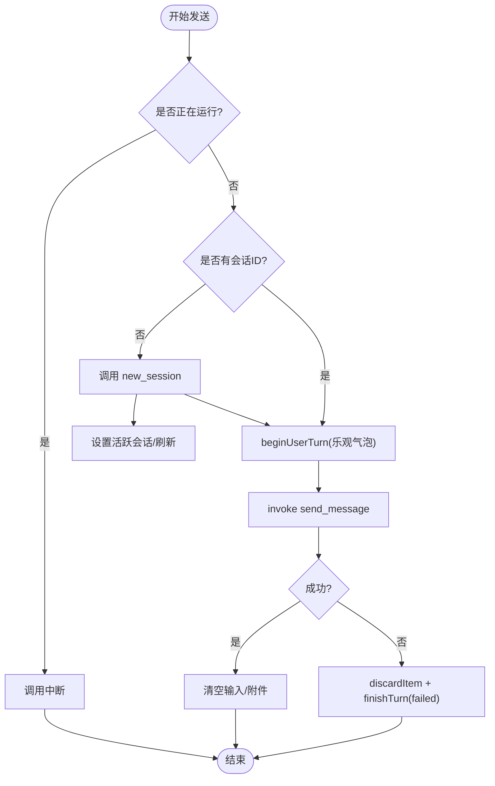
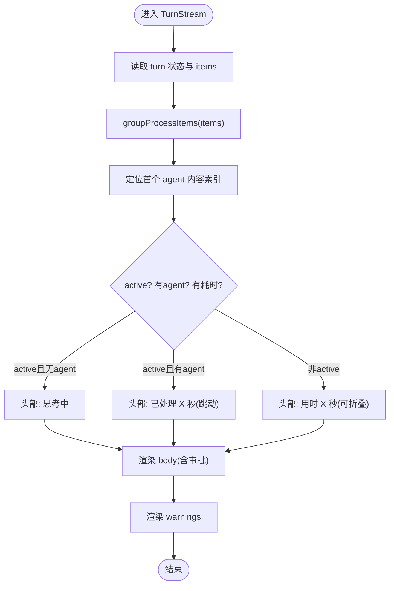
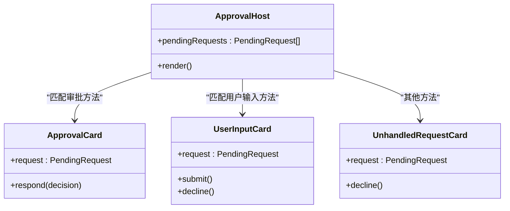
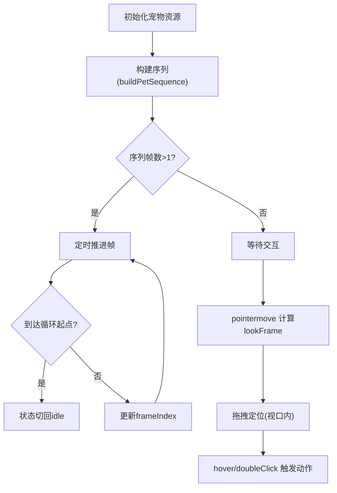
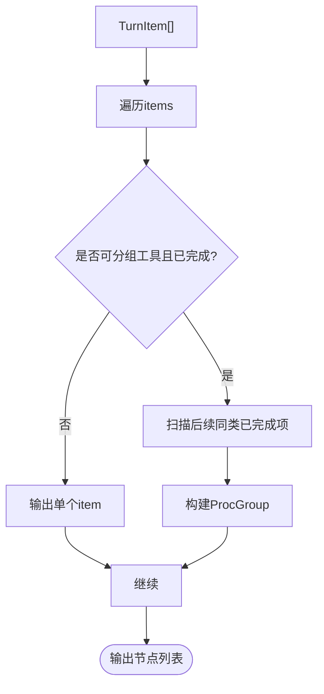
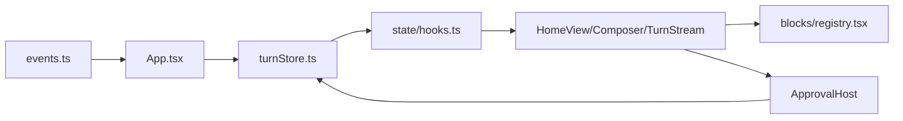

# 组件系统设计

<cite>
**本文引用的文件**
- [App.tsx](file://frontend/app/App.tsx)
- [AppShell.tsx](file://frontend/app/shell/AppShell.tsx)
- [HomeView.tsx](file://frontend/app/views/HomeView.tsx)
- [Composer.tsx](file://frontend/app/views/Composer.tsx)
- [TurnStream.tsx](file://frontend/app/views/TurnStream.tsx)
- [ApprovalHost.tsx](file://frontend/app/approvals/ApprovalHost.tsx)
- [ApprovalCard.tsx](file://frontend/app/approvals/ApprovalCard.tsx)
- [UserInputCard.tsx](file://frontend/app/approvals/UserInputCard.tsx)
- [PetOverlay.tsx](file://frontend/app/pet/PetOverlay.tsx)
- [registry.tsx](file://frontend/app/blocks/registry.tsx)
- [turnStore.ts](file://frontend/app/state/turnStore.ts)
- [hooks.ts](file://frontend/app/state/hooks.ts)
- [types.ts](file://frontend/app/state/types.ts)
- [events.ts](file://frontend/app/bridge/events.ts)
</cite>

## 目录
1. [简介](#简介)
2. [项目结构](#项目结构)
3. [核心组件](#核心组件)
4. [架构总览](#架构总览)
5. [详细组件分析](#详细组件分析)
6. [依赖关系分析](#依赖关系分析)
7. [性能考量](#性能考量)
8. [故障排查指南](#故障排查指南)
9. [结论](#结论)

## 简介
本文件面向 Codex-Tauri 前端 React 组件系统，聚焦以下目标：
- 阐述组件分层、复用策略与性能优化原则
- 深入解析 Composer（输入）、TurnStream（消息流）、ApprovalHost（审批）、PetOverlay（宠物）等核心组件的实现模式
- 说明组件间通信机制、状态提升策略与事件处理模式
- 提供组件关系图与生命周期图，展示嵌套结构与数据流向

## 项目结构
前端采用“视图层 + 块渲染层 + 状态层 + 桥接层”的分层组织：
- 视图层：AppShell、HomeView、Composer、TurnStream、PetOverlay
- 块渲染层：blocks/registry.tsx（统一将 TurnItem 渲染为官方 DOM 契约）
- 状态层：turnStore（不可变快照 + 订阅）、hooks（useSyncExternalStore 绑定）
- 桥接层：events（Tauri 通知/请求通道），App 根组件负责订阅并写入状态

图表来源
- [App.tsx:15-46](file://frontend/app/App.tsx#L15-L46)
- [AppShell.tsx:78-205](file://frontend/app/shell/AppShell.tsx#L78-L205)
- [HomeView.tsx:135-207](file://frontend/app/views/HomeView.tsx#L135-L207)
- [events.ts:145-159](file://frontend/app/bridge/events.ts#L145-L159)
- [turnStore.ts:28-49](file://frontend/app/state/turnStore.ts#L28-L49)
- [hooks.ts:17-43](file://frontend/app/state/hooks.ts#L17-L43)

章节来源
- [App.tsx:15-46](file://frontend/app/App.tsx#L15-L46)
- [AppShell.tsx:78-205](file://frontend/app/shell/AppShell.tsx#L78-L205)
- [HomeView.tsx:135-207](file://frontend/app/views/HomeView.tsx#L135-L207)
- [events.ts:145-159](file://frontend/app/bridge/events.ts#L145-L159)

## 核心组件
- Composer：用户输入、发送/停止、模型/权限/项目选择；通过 Tauri invoke 创建会话并发送消息；支持附件与快捷键。
- TurnStream：按 turn 生命周期渲染消息流，包含头部状态机（思考/进行中/完成）与折叠逻辑，集成 ApprovalHost。
- ApprovalHost：集中渲染服务端发起的待决请求（审批、用户输入、未处理请求）。
- PetOverlay：浮动宠物动画，驱动帧时钟、拖拽、方向注视与尺寸控制。

章节来源
- [Composer.tsx:50-800](file://frontend/app/views/Composer.tsx#L50-L800)
- [TurnStream.tsx:1-187](file://frontend/app/views/TurnStream.tsx#L1-L187)
- [ApprovalHost.tsx:1-93](file://frontend/app/approvals/ApprovalHost.tsx#L1-L93)
- [PetOverlay.tsx:1-217](file://frontend/app/pet/PetOverlay.tsx#L1-L217)

## 架构总览
- 事件驱动：所有 UI 状态来自后端推送的通知或请求，UI 不自行构造进度。
- 单一事实源：turnStore 维护当前 turn 的完整状态，使用 useSyncExternalStore 暴露给 React 组件。
- 块渲染契约：registry.tsx 严格产出 home.css 期望的 DOM 类名与层级，保证样式一致。
- 审批隔离：ApprovalHost 独立于消息流，阻塞 turn 直到响应。

图表来源
- [events.ts:57-87](file://frontend/app/bridge/events.ts#L57-L87)
- [App.tsx:15-46](file://frontend/app/App.tsx#L15-L46)
- [turnStore.ts:274-281](file://frontend/app/state/turnStore.ts#L274-L281)
- [TurnStream.tsx:64-187](file://frontend/app/views/TurnStream.tsx#L64-L187)
- [ApprovalHost.tsx:74-93](file://frontend/app/approvals/ApprovalHost.tsx#L74-L93)

## 详细组件分析

### Composer（输入组件）
职责与行为
- 管理本地输入、附件、菜单（权限/模型/项目）与发送流程
- 支持 Enter/Ctrl+Enter 发送、Esc 中断、自动高度增长
- 首次发送时创建会话，随后发送消息；失败时回滚乐观气泡

关键实现要点
- 乐观更新：beginUserTurn 立即插入用户消息项，失败时用 discardItem 回滚
- 会话切换：若无 activeSessionId，先调用 new_session，再 send_message
- 中断：调用 interrupt_session 取消运行中的 turn
- 快捷键与偏好：根据通用偏好决定发送快捷键语义

图表来源
- [Composer.tsx:711-785](file://frontend/app/views/Composer.tsx#L711-L785)
- [turnStore.ts:118-141](file://frontend/app/state/turnStore.ts#L118-L141)

章节来源
- [Composer.tsx:50-800](file://frontend/app/views/Composer.tsx#L50-L800)
- [turnStore.ts:118-141](file://frontend/app/state/turnStore.ts#L118-L141)

### TurnStream（消息流组件）
职责与行为
- 按 turn 生命周期渲染消息流，头部状态机：thinking → live → done
- 计算首个 agent 内容位置以锚定头部，支持折叠已完成 turn
- 聚合工具输出（groupProcessItems），渲染警告信息

关键实现要点
- 实时计时：useLiveElapsed 在 turn 进行中约 4Hz 刷新显示
- 折叠策略：仅对已完成 turn 的首个 agent 内容之后进行折叠
- 汇总行：最后一个 agentMessage 作为 summary 高亮

图表来源
- [TurnStream.tsx:33-187](file://frontend/app/views/TurnStream.tsx#L33-L187)
- [registry.tsx:558-595](file://frontend/app/blocks/registry.tsx#L558-L595)

章节来源
- [TurnStream.tsx:1-187](file://frontend/app/views/TurnStream.tsx#L1-L187)
- [registry.tsx:558-595](file://frontend/app/blocks/registry.tsx#L558-L595)

### ApprovalHost（审批组件）
职责与行为
- 集中渲染服务端发起的待决请求：命令/文件/权限审批、用户输入、未处理请求
- 每个请求必须得到回应，否则 turn 保持阻塞

关键实现要点
- 方法分类：APPROVAL_METHODS、USER_INPUT_METHODS、Unhandled
- 决策回调：调用 respond_server_request 并移除 pending request
- 错误反馈：失败时保留卡片并显示错误信息

图表来源
- [ApprovalHost.tsx:20-93](file://frontend/app/approvals/ApprovalHost.tsx#L20-L93)
- [ApprovalCard.tsx:37-131](file://frontend/app/approvals/ApprovalCard.tsx#L37-L131)
- [UserInputCard.tsx:65-209](file://frontend/app/approvals/UserInputCard.tsx#L65-L209)

章节来源
- [ApprovalHost.tsx:1-93](file://frontend/app/approvals/ApprovalHost.tsx#L1-L93)
- [ApprovalCard.tsx:1-131](file://frontend/app/approvals/ApprovalCard.tsx#L1-L131)
- [UserInputCard.tsx:1-209](file://frontend/app/approvals/UserInputCard.tsx#L1-L209)

### PetOverlay（宠物组件）
职责与行为
- 浮动宠物动画：帧时钟、拖拽、方向注视、悬停/双击触发动作
- 尺寸控制与精灵表背景定位

关键实现要点
- 序列播放：buildPetSequence 生成帧序列，setTimeout 驱动帧推进
- 方向注视：pointermove 计算 lookFrame，延迟释放
- 拖拽：pointer capture + 视口边界限制
- 资源：从 pets-data.js 获取精灵表 URL、行列数、帧映射

图表来源
- [PetOverlay.tsx:50-217](file://frontend/app/pet/PetOverlay.tsx#L50-L217)

章节来源
- [PetOverlay.tsx:1-217](file://frontend/app/pet/PetOverlay.tsx#L1-L217)

### 块渲染器（blocks/registry.tsx）
职责与行为
- 将 TurnItem 映射到官方 DOM 契约（类名、层级），确保样式一致
- 分组连续完成的同类工具，减少视觉噪音
- 提供多种块类型：文本、工具、文件操作、差异、计划、图片/附件、错误等

关键实现要点
- 工具分类：classifyTool 将命令名归类为 shell/write/search/read/browser/mcp/other
- 状态映射：procStatusClass 将协议状态映射为 is-* 类
- 分组算法：groupProcessItems 将连续的已完成同类工具合并为 ProcGroup

图表来源
- [registry.tsx:558-595](file://frontend/app/blocks/registry.tsx#L558-L595)
- [registry.tsx:49-79](file://frontend/app/blocks/registry.tsx#L49-L79)

章节来源
- [registry.tsx:1-824](file://frontend/app/blocks/registry.tsx#L1-L824)

## 依赖关系分析
- 事件入口：events.ts 监听 Tauri 通知与请求，分发到 App 根组件
- 状态中心：turnStore 维护 TurnState，hooks 提供 useSyncExternalStore 绑定
- 视图消费：HomeView/Composer/TurnStream 通过 hooks 读取状态并触发 actions
- 渲染契约：registry.tsx 严格遵循 CSS 契约，避免样式丢失
- 审批闭环：ApprovalHost 接收 pendingRequests，调用 respond_server_request 后由 store 移除

图表来源
- [events.ts:145-159](file://frontend/app/bridge/events.ts#L145-L159)
- [App.tsx:15-46](file://frontend/app/App.tsx#L15-L46)
- [turnStore.ts:28-49](file://frontend/app/state/turnStore.ts#L28-L49)
- [hooks.ts:17-43](file://frontend/app/state/hooks.ts#L17-L43)
- [registry.tsx:747-824](file://frontend/app/blocks/registry.tsx#L747-L824)
- [ApprovalHost.tsx:74-93](file://frontend/app/approvals/ApprovalHost.tsx#L74-L93)

章节来源
- [events.ts:145-159](file://frontend/app/bridge/events.ts#L145-L159)
- [App.tsx:15-46](file://frontend/app/App.tsx#L15-L46)
- [turnStore.ts:28-49](file://frontend/app/state/turnStore.ts#L28-L49)
- [hooks.ts:17-43](file://frontend/app/state/hooks.ts#L17-L43)
- [registry.tsx:747-824](file://frontend/app/blocks/registry.tsx#L747-L824)
- [ApprovalHost.tsx:74-93](file://frontend/app/approvals/ApprovalHost.tsx#L74-L93)

## 性能考量
- 高频流式更新：turnStore 使用外部 store + subscribe 模式，避免 Context 重渲染开销；hooks 使用 useSyncExternalStore 精确订阅
- 节流与批量：TurnStream 使用 ~4Hz 定时器刷新头部时间，避免过度重绘
- 列表优化：registry.tsx 将连续完成的同类工具分组为 ProcGroup，减少 DOM 节点数量
- 滚动优化：ShellCard 在运行中将输出面板滚动到底部，限制最大行数防止长输出导致渲染压力
- 资源加载：PetOverlay 基于精灵表背景定位，避免多图片切换开销

[本节为通用指导，不直接分析具体文件]

## 故障排查指南
- 发送失败回滚：当 send_message 失败时，Composer 会丢弃乐观气泡并标记 turn 失败，检查 console 日志与 turnStore 的 error 字段
- 审批卡住：若 pendingRequests 未消失，确认 respond_server_request 是否成功；serverRequest/resolved 通知会移除请求
- 样式错乱：确保 registry.tsx 输出的类名与层级符合 home.css 契约，避免自定义 wrapper 破坏选择器
- 宠物异常：检查 pets-data.js 的资源版本与帧序列；确认 pointer 事件未被拦截

章节来源
- [Composer.tsx:711-785](file://frontend/app/views/Composer.tsx#L711-L785)
- [turnStore.ts:241-285](file://frontend/app/state/turnStore.ts#L241-L285)
- [ApprovalHost.tsx:31-93](file://frontend/app/approvals/ApprovalHost.tsx#L31-L93)
- [registry.tsx:1-15](file://frontend/app/blocks/registry.tsx#L1-L15)
- [PetOverlay.tsx:116-174](file://frontend/app/pet/PetOverlay.tsx#L116-L174)

## 结论
Codex-Tauri 的前端组件系统以“事件驱动 + 单一事实源 + 严格渲染契约”为核心：
- 所有 UI 状态来自后端通知/请求，避免本地猜测
- turnStore 作为唯一状态源，通过 hooks 高效暴露给 React
- 块渲染层确保样式一致性，并通过分组与折叠优化体验
- 审批模块独立且可阻塞 turn，保障安全与可控性
- 宠物组件提供轻量级动效与交互，不影响主流程

该设计在保证可维护性与性能的同时，提供了清晰的扩展点与稳定的用户体验。