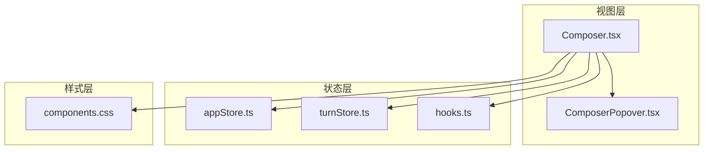
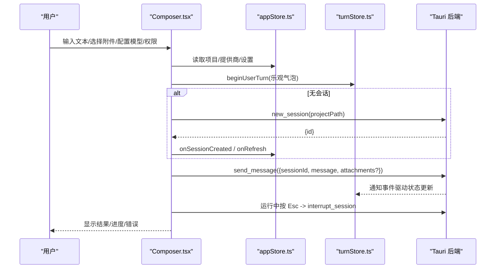
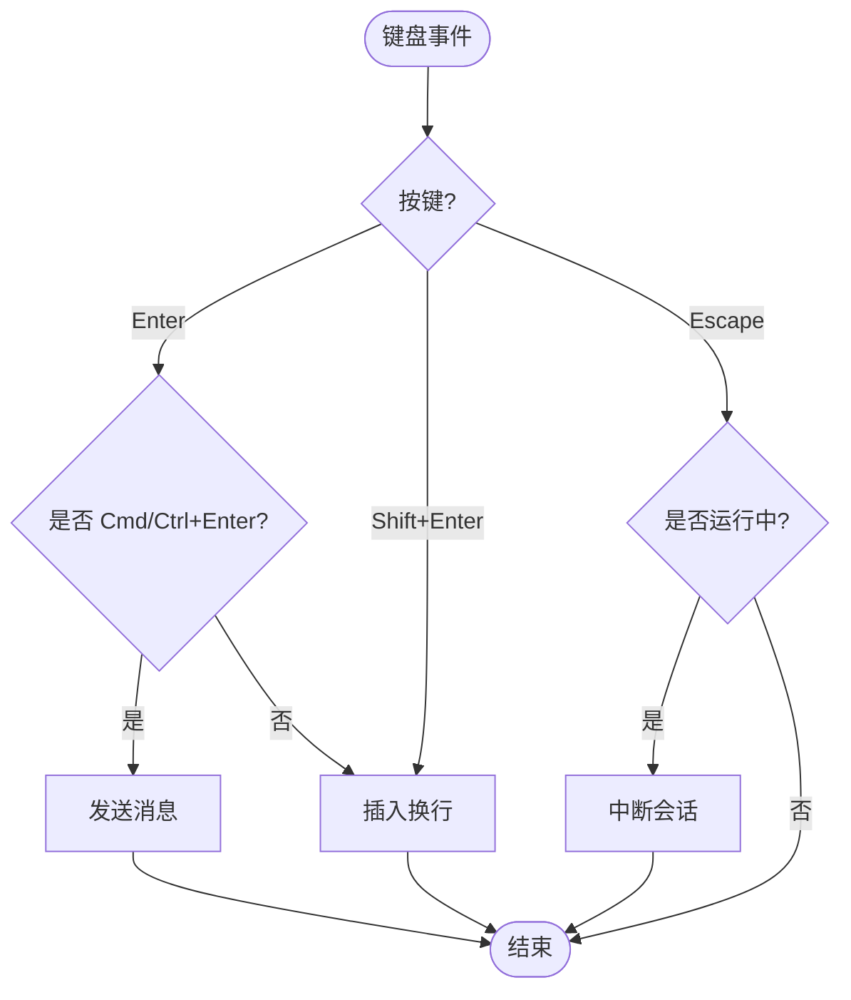
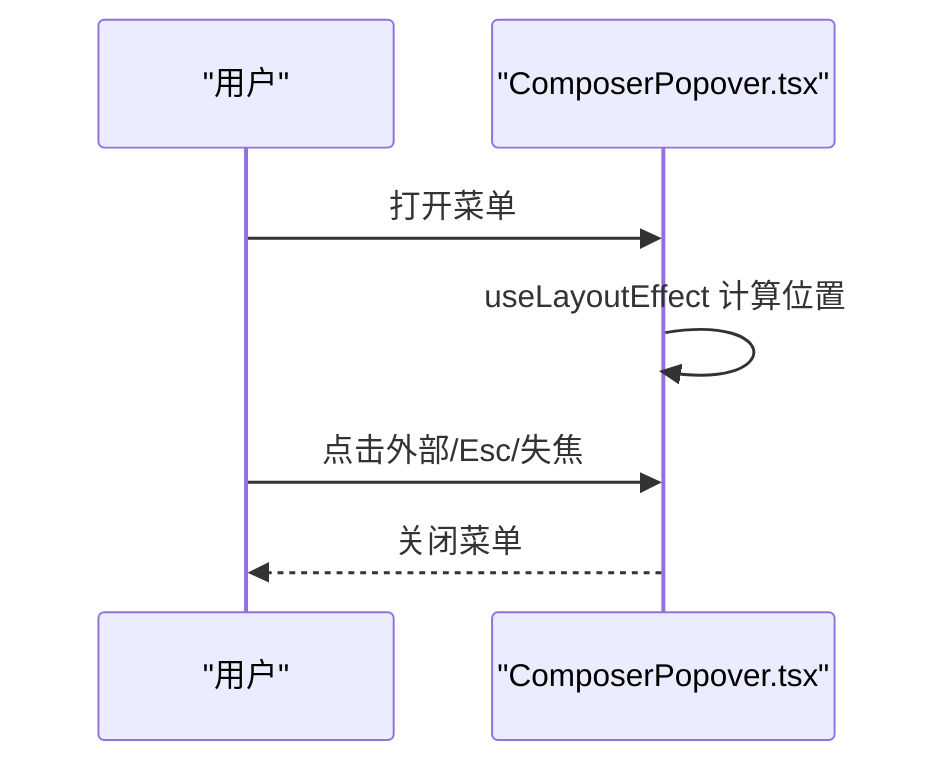
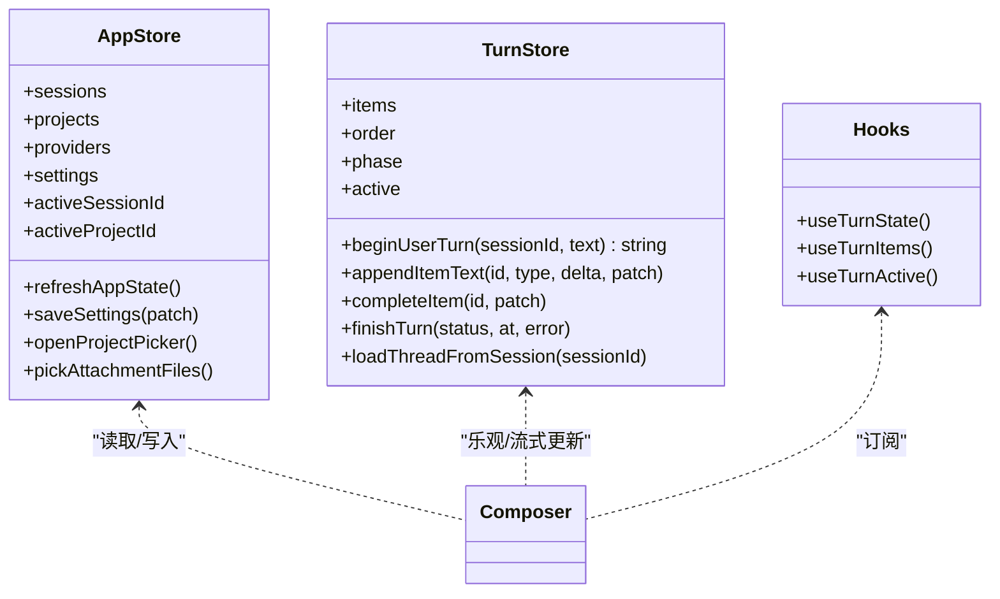
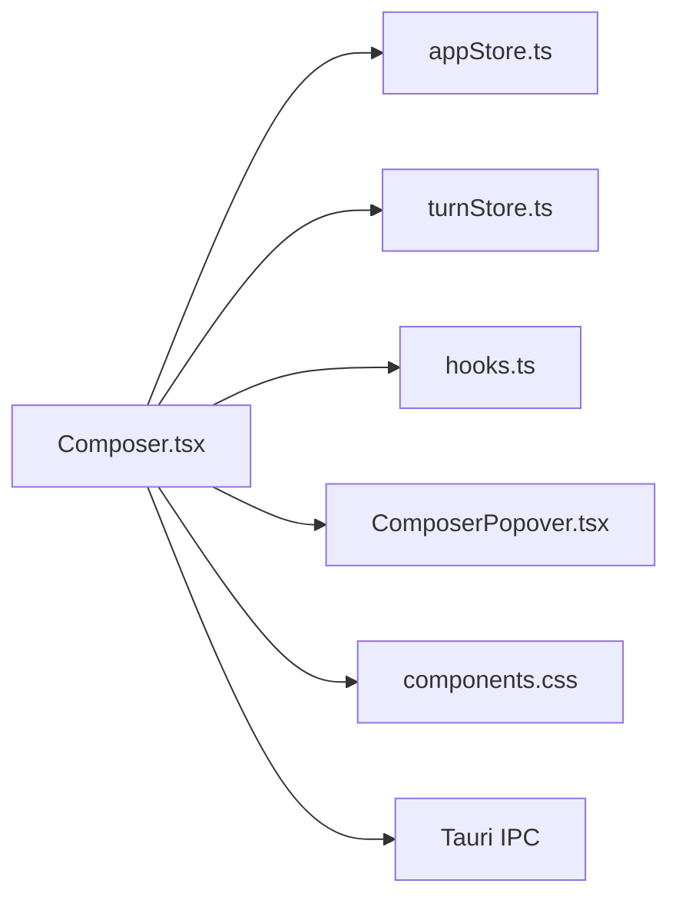

# 输入组件系统

<cite>
**本文引用的文件**
- [Composer.tsx](file://frontend/app/views/Composer.tsx)
- [ComposerPopover.tsx](file://frontend/app/shell/ComposerPopover.tsx)
- [appStore.ts](file://frontend/app/state/appStore.ts)
- [turnStore.ts](file://frontend/app/state/turnStore.ts)
- [hooks.ts](file://frontend/app/state/hooks.ts)
- [components.css](file://frontend/src/styles/components.css)
</cite>

## 目录
1. [简介](#简介)
2. [项目结构](#项目结构)
3. [核心组件](#核心组件)
4. [架构总览](#架构总览)
5. [详细组件分析](#详细组件分析)
6. [依赖关系分析](#依赖关系分析)
7. [性能考量](#性能考量)
8. [故障排查指南](#故障排查指南)
9. [结论](#结论)
10. [附录：扩展与自定义示例](#附录：扩展与自定义示例)

## 简介
本文件为 Codex-Tauri 的输入组件系统提供系统化文档，聚焦 Composer 组件的实现与协作机制。内容涵盖文本输入处理、附件管理、项目选择、模型配置与权限设置；解释自适应高度、键盘快捷键（Enter 发送、Shift+Enter 换行）、文件选择器集成与多模态输入支持；并说明状态管理策略（本地状态与全局状态协调、表单验证与错误处理）。文末提供扩展输入功能、自定义验证规则与新增输入类型的实践指引。

## 项目结构
Composer 位于前端视图层，负责用户输入、附件与上下文配置（项目、模型、权限），并通过 Tauri IPC 与后端交互；状态由 appStore 与 turnStore 管理，弹出菜单由 ComposerPopover 统一定位与关闭逻辑。样式基于统一的组件库 CSS。

图表来源
- [Composer.tsx:600-1089](file://frontend/app/views/Composer.tsx#L600-L1089)
- [ComposerPopover.tsx:72-159](file://frontend/app/shell/ComposerPopover.tsx#L72-L159)
- [appStore.ts:149-151](file://frontend/app/state/appStore.ts#L149-L151)
- [turnStore.ts:118-133](file://frontend/app/state/turnStore.ts#L118-L133)
- [hooks.ts:18-20](file://frontend/app/state/hooks.ts#L18-L20)
- [components.css:116-162](file://frontend/src/styles/components.css#L116-L162)

章节来源
- [Composer.tsx:600-1089](file://frontend/app/views/Composer.tsx#L600-L1089)
- [ComposerPopover.tsx:72-159](file://frontend/app/shell/ComposerPopover.tsx#L72-L159)
- [appStore.ts:149-151](file://frontend/app/state/appStore.ts#L149-L151)
- [turnStore.ts:118-133](file://frontend/app/state/turnStore.ts#L118-L133)
- [hooks.ts:18-20](file://frontend/app/state/hooks.ts#L18-L20)
- [components.css:116-162](file://frontend/src/styles/components.css#L116-L162)

## 核心组件
- Composer：输入框、附件区、工具栏（添加文件、权限、模型、模拟模式、发送/停止）与三个弹出菜单（项目、权限、模型）。
- ComposerPopover：固定定位的弹出容器，负责对齐、翻转、外部点击关闭、Esc 关闭与窗口失焦关闭。
- appStore：应用级状态（会话、项目、提供商、设置、引擎状态），提供持久化与刷新能力。
- turnStore：当前对话轮次状态（消息项、计划、警告、令牌用量等），驱动流式渲染。
- hooks：将 turnStore 暴露为 React 订阅接口，避免高频更新导致重渲染开销。

章节来源
- [Composer.tsx:600-1089](file://frontend/app/views/Composer.tsx#L600-L1089)
- [ComposerPopover.tsx:72-159](file://frontend/app/shell/ComposerPopover.tsx#L72-L159)
- [appStore.ts:98-151](file://frontend/app/state/appStore.ts#L98-L151)
- [turnStore.ts:28-55](file://frontend/app/state/turnStore.ts#L28-L55)
- [hooks.ts:18-20](file://frontend/app/state/hooks.ts#L18-L20)

## 架构总览
Composer 作为入口，聚合本地输入状态与全局配置，通过 Tauri invoke 调用后端命令（如 new_session、send_message、interrupt_session），同时使用 appStore 与 turnStore 维护 UI 一致性。弹出菜单由 ComposerPopover 统一管理定位与交互。

图表来源
- [Composer.tsx:711-785](file://frontend/app/views/Composer.tsx#L711-L785)
- [turnStore.ts:118-133](file://frontend/app/state/turnStore.ts#L118-L133)
- [appStore.ts:378-408](file://frontend/app/state/appStore.ts#L378-L408)

## 详细组件分析

### Composer 组件
- 文本输入与自适应高度：根据内容滚动高度动态调整 textarea 高度，上限为常量限制，超过阈值切换多行模式以改变布局。
- 键盘快捷键：
  - Enter：默认发送；若配置为“Cmd/Ctrl+Enter 发送”，则仅在该修饰键组合时发送，否则插入换行。
  - Shift+Enter：始终插入换行。
  - Escape：在运行中中断当前会话。
- 附件管理：通过原生对话框多选文件，去重后展示为可删除的标签；图片与文件分别映射到不同用户输入类型以支持多模态。
- 项目选择：弹出项目列表，支持搜索、新建项目、取消项目绑定；选择后更新全局项目并触发刷新。
- 模型配置：提供商分组与模型列表，支持强度滑块（推理努力度）与重置；未配置时引导至设置页。
- 权限设置：三种模式（工作区询问、帮助批准、完全访问），对应不同安全策略，并在弹出面板中可视化呈现。
- 发送流程：若无会话则先创建；乐观插入用户消息；发送失败回滚气泡并标记失败；完成后清理输入与附件。
- 模拟模式：前端播放预设回复，走真实通知路径，便于调试。

图表来源
- [Composer.tsx:787-813](file://frontend/app/views/Composer.tsx#L787-L813)
- [Composer.tsx:662-670](file://frontend/app/views/Composer.tsx#L662-L670)
- [Composer.tsx:684-693](file://frontend/app/views/Composer.tsx#L684-L693)
- [Composer.tsx:711-785](file://frontend/app/views/Composer.tsx#L711-L785)

章节来源
- [Composer.tsx:600-1089](file://frontend/app/views/Composer.tsx#L600-L1089)

### ComposerPopover 组件
- 定位策略：根据锚点元素计算 left/top，支持 start/end 水平对齐；垂直方向支持“below”或“auto”（空间不足时向上翻转）。
- 关闭策略：捕获外部指针按下、Esc、窗口失焦时关闭；忽略特定 ref（如触发按钮）以避免误关。
- 尺寸变化：使用 ResizeObserver 监听菜单尺寸变化并重新计算位置。

图表来源
- [ComposerPopover.tsx:39-70](file://frontend/app/shell/ComposerPopover.tsx#L39-L70)
- [ComposerPopover.tsx:85-114](file://frontend/app/shell/ComposerPopover.tsx#L85-L114)
- [ComposerPopover.tsx:117-142](file://frontend/app/shell/ComposerPopover.tsx#L117-L142)

章节来源
- [ComposerPopover.tsx:72-159](file://frontend/app/shell/ComposerPopover.tsx#L72-L159)

### 状态管理：appStore 与 turnStore
- appStore：集中管理会话、项目、提供商、设置与引擎状态；提供刷新、保存设置、打开项目选择器与附件选择器等方法；通过 useSyncExternalStore 暴露给 React 组件。
- turnStore：单一事实源，驱动当前轮次状态；支持乐观插入用户消息、追加流式文本/输出、完成项、设置计划与警告、记录令牌用量；从历史加载会话时优先 thread.messages，其次 timeline。
- hooks：提供 useTurnState/useTurnItems/useTurnActive 等便捷订阅方法，避免频繁重渲染。

图表来源
- [appStore.ts:98-151](file://frontend/app/state/appStore.ts#L98-L151)
- [appStore.ts:249-372](file://frontend/app/state/appStore.ts#L249-L372)
- [appStore.ts:378-511](file://frontend/app/state/appStore.ts#L378-L511)
- [turnStore.ts:28-55](file://frontend/app/state/turnStore.ts#L28-L55)
- [turnStore.ts:118-133](file://frontend/app/state/turnStore.ts#L118-L133)
- [turnStore.ts:209-268](file://frontend/app/state/turnStore.ts#L209-L268)
- [turnStore.ts:328-466](file://frontend/app/state/turnStore.ts#L328-L466)
- [hooks.ts:18-42](file://frontend/app/state/hooks.ts#L18-L42)

章节来源
- [appStore.ts:98-151](file://frontend/app/state/appStore.ts#L98-L151)
- [appStore.ts:249-372](file://frontend/app/state/appStore.ts#L249-L372)
- [appStore.ts:378-511](file://frontend/app/state/appStore.ts#L378-L511)
- [turnStore.ts:28-55](file://frontend/app/state/turnStore.ts#L28-L55)
- [turnStore.ts:118-133](file://frontend/app/state/turnStore.ts#L118-L133)
- [turnStore.ts:209-268](file://frontend/app/state/turnStore.ts#L209-L268)
- [turnStore.ts:328-466](file://frontend/app/state/turnStore.ts#L328-L466)
- [hooks.ts:18-42](file://frontend/app/state/hooks.ts#L18-L42)

### 样式与多模态输入
- 输入框样式：统一使用 .input/.textarea 类，具备焦点高亮、悬停边框变化、深色主题适配；Composer 中的 textarea 通过 rows=1 配合动态高度实现紧凑输入体验。
- 多模态输入：附件分为图片与文件两类，分别映射为不同的用户输入类型，以便后端正确识别与处理。

章节来源
- [components.css:116-162](file://frontend/src/styles/components.css#L116-L162)
- [Composer.tsx:79-88](file://frontend/app/views/Composer.tsx#L79-L88)

## 依赖关系分析
- Composer 依赖：
  - 状态：appStore（项目/提供商/设置）、turnStore（乐观气泡/流式更新）、hooks（订阅）。
  - UI：ComposerPopover（弹出菜单定位与关闭）。
  - 样式：components.css（输入控件基础样式）。
  - 后端：Tauri invoke（new_session、send_message、interrupt_session、list_sessions、list_providers、get_settings、save_settings、rpc_raw 等）。
- 耦合与内聚：
  - Composer 内聚了输入、附件、配置与发送流程；状态解耦至 appStore/turnStore，降低组件复杂度。
  - ComposerPopover 独立于业务，专注弹出行为，复用性强。
- 外部依赖：
  - Tauri 插件 dialog 用于文件/文件夹选择。
  - 后端引擎配置通过 rpc_raw 批量写入。

图表来源
- [Composer.tsx:600-1089](file://frontend/app/views/Composer.tsx#L600-L1089)
- [appStore.ts:378-511](file://frontend/app/state/appStore.ts#L378-L511)
- [turnStore.ts:118-133](file://frontend/app/state/turnStore.ts#L118-L133)
- [ComposerPopover.tsx:72-159](file://frontend/app/shell/ComposerPopover.tsx#L72-L159)
- [components.css:116-162](file://frontend/src/styles/components.css#L116-L162)

章节来源
- [Composer.tsx:600-1089](file://frontend/app/views/Composer.tsx#L600-L1089)
- [appStore.ts:378-511](file://frontend/app/state/appStore.ts#L378-L511)
- [turnStore.ts:118-133](file://frontend/app/state/turnStore.ts#L118-L133)
- [ComposerPopover.tsx:72-159](file://frontend/app/shell/ComposerPopover.tsx#L72-L159)
- [components.css:116-162](file://frontend/src/styles/components.css#L116-L162)

## 性能考量
- 自适应高度：仅在文本变化时计算一次高度，避免频繁重排；使用 requestAnimationFrame 保证光标位置稳定。
- 弹出菜单定位：useLayoutEffect 确保在绘制前计算位置；ResizeObserver 监听尺寸变化，减少不必要的重算。
- 状态更新：
  - appStore 使用 useSyncExternalStore，避免 Context 导致的无关重渲染。
  - turnStore 对高频流式数据采用增量追加（appendItemText/appendItemOutput），最小化状态变更。
- 网络请求：
  - 首次发送前按需创建会话，避免多余调用。
  - 设置保存采用双写（shell 与 engine config），失败不阻断 UI。

[本节为通用性能建议，无需具体文件引用]

## 故障排查指南
- 发送失败：
  - 现象：发送后出现错误提示，乐观气泡被移除。
  - 排查：检查 send_message 返回值与 catch 分支；确认 sessionId 是否存在；查看 turnStore finishTurn 的错误字段。
  - 参考路径：[Composer.tsx:711-785](file://frontend/app/views/Composer.tsx#L711-L785)、[turnStore.ts:241-256](file://frontend/app/state/turnStore.ts#L241-L256)
- 中断失败：
  - 现象：运行中按 Esc 无响应。
  - 排查：确认 activeSessionId 存在；检查 interrupt_session 调用与异常日志。
  - 参考路径：[Composer.tsx:684-693](file://frontend/app/views/Composer.tsx#L684-L693)
- 项目/提供商为空：
  - 现象：项目选择器或模型列表为空。
  - 排查：调用 refreshAppState 获取最新数据；检查 list_sessions/list_providers/get_settings 返回。
  - 参考路径：[appStore.ts:378-408](file://frontend/app/state/appStore.ts#L378-L408)
- 弹出菜单无法关闭：
  - 现象：点击外部或按 Esc 不生效。
  - 排查：确认 ignoreRefs 是否正确排除触发按钮；检查事件监听注册与移除。
  - 参考路径：[ComposerPopover.tsx:117-142](file://frontend/app/shell/ComposerPopover.tsx#L117-L142)

章节来源
- [Composer.tsx:684-693](file://frontend/app/views/Composer.tsx#L684-L693)
- [Composer.tsx:711-785](file://frontend/app/views/Composer.tsx#L711-L785)
- [appStore.ts:378-408](file://frontend/app/state/appStore.ts#L378-L408)
- [ComposerPopover.tsx:117-142](file://frontend/app/shell/ComposerPopover.tsx#L117-L142)
- [turnStore.ts:241-256](file://frontend/app/state/turnStore.ts#L241-L256)

## 结论
Composer 组件将输入、附件、项目、模型与权限整合为一致的交互体验，结合 appStore 与 turnStore 实现了高效的状态管理与流式渲染。弹出菜单由 ComposerPopover 统一处理，保证了行为一致性与可维护性。通过清晰的职责划分与稳健的错误处理，系统具备良好的可扩展性与用户体验。

[本节为总结性内容，无需具体文件引用]

## 附录：扩展与自定义示例

- 扩展输入功能（例如添加“代码片段”快捷插入）
  - 步骤：
    - 在 Composer 中添加新的工具栏按钮，触发插入逻辑。
    - 通过 setText 更新输入值，保持受控组件一致性。
    - 如需新类型附件，扩展 toUserInput 映射与后端协议。
  - 参考路径：
    - [Composer.tsx:695-709](file://frontend/app/views/Composer.tsx#L695-L709)
    - [Composer.tsx:79-88](file://frontend/app/views/Composer.tsx#L79-L88)

- 自定义验证规则（例如限制最大字符数或敏感词过滤）
  - 步骤：
    - 在 onChange 中校验 text，必要时截断或提示。
    - 在 send 前进行二次校验，阻止非法提交。
    - 将错误信息通过 turnStore 或 UI 提示反馈给用户。
  - 参考路径：
    - [Composer.tsx:711-785](file://frontend/app/views/Composer.tsx#L711-L785)

- 新增输入类型（例如视频附件）
  - 步骤：
    - 扩展 isImagePath 判断逻辑，增加视频后缀匹配。
    - 在 toUserInput 中新增视频类型映射。
    - 确保后端协议支持该类型，并在 UI 中展示预览。
  - 参考路径：
    - [Composer.tsx:79-88](file://frontend/app/views/Composer.tsx#L79-L88)

- 调整键盘快捷键行为
  - 步骤：
    - 修改 sendOnMod 配置逻辑，支持更多组合键。
    - 在 onKeyDown 中扩展分支，处理新快捷键。
  - 参考路径：
    - [Composer.tsx:787-813](file://frontend/app/views/Composer.tsx#L787-L813)

- 接入新的提供商或模型
  - 步骤：
    - 通过后端 list_providers 返回新的提供商与模型列表。
    - 在 ModelMenuContent 中自动渲染新模型；必要时调整 effort 映射。
  - 参考路径：
    - [Composer.tsx:264-462](file://frontend/app/views/Composer.tsx#L264-L462)
    - [appStore.ts:195-213](file://frontend/app/state/appStore.ts#L195-L213)

- 增强弹出菜单定位与交互
  - 步骤：
    - 在 ComposerPopover 中扩展 prefer 策略，支持更多对齐方式。
    - 增加键盘导航（上下箭头选择、Enter 确认）。
  - 参考路径：
    - [ComposerPopover.tsx:39-70](file://frontend/app/shell/ComposerPopover.tsx#L39-L70)
    - [ComposerPopover.tsx:85-114](file://frontend/app/shell/ComposerPopover.tsx#L85-L114)

[本节为扩展指引，无需额外文件引用]