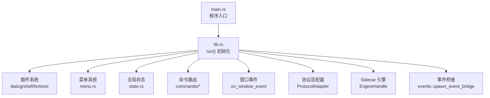
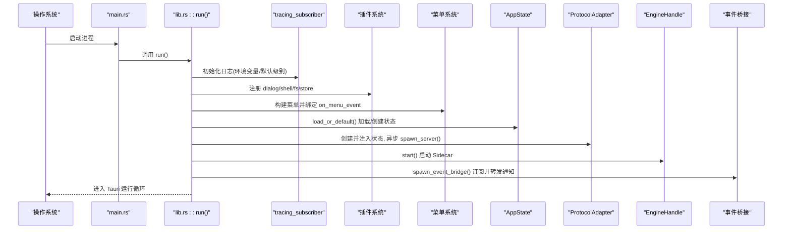
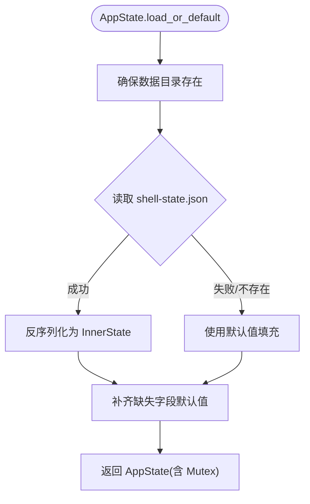
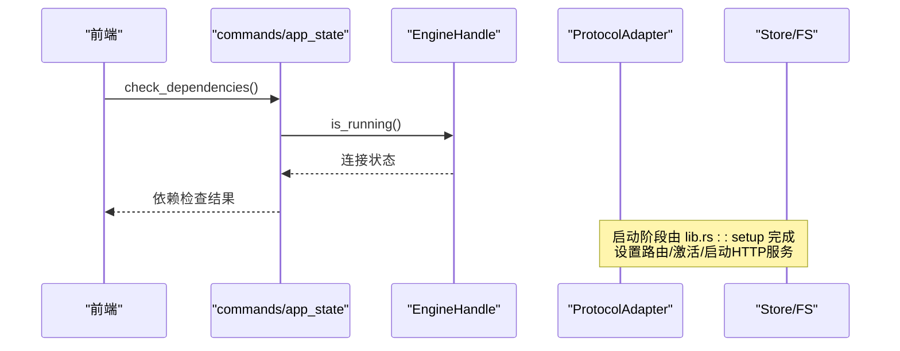
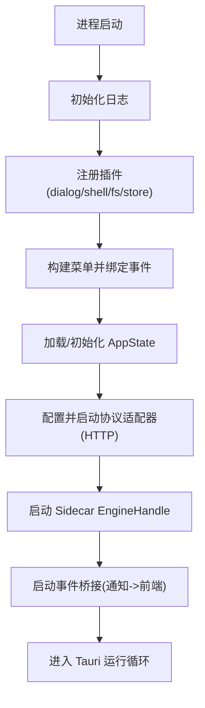
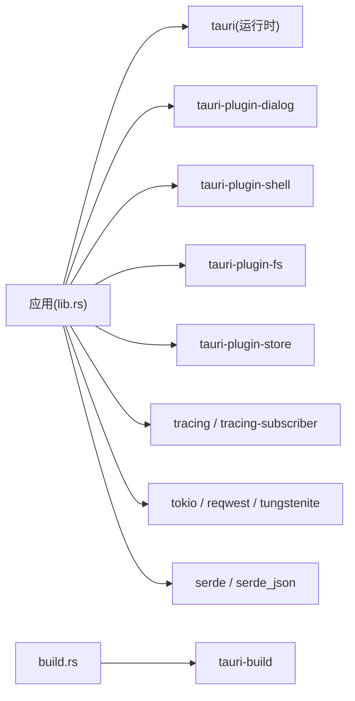

# Tauri应用初始化

<cite>
**本文引用的文件**
- [main.rs](file://src-tauri/src/main.rs)
- [lib.rs](file://src-tauri/src/lib.rs)
- [state.rs](file://src-tauri/src/state.rs)
- [menu.rs](file://src-tauri/src/menu.rs)
- [app_state.rs](file://src-tauri/src/commands/app_state.rs)
- [Cargo.toml](file://src-tauri/Cargo.toml)
- [tauri.conf.json](file://src-tauri/tauri.conf.json)
- [build.rs](file://src-tauri/build.rs)
</cite>

## 目录
1. [简介](#简介)
2. [项目结构](#项目结构)
3. [核心组件](#核心组件)
4. [架构总览](#架构总览)
5. [详细组件分析](#详细组件分析)
6. [依赖关系分析](#依赖关系分析)
7. [性能考虑](#性能考虑)
8. [故障排查指南](#故障排查指南)
9. [结论](#结论)
10. [附录](#附录)

## 简介
本文件面向 Codex Tauri 应用的“初始化模块”，聚焦 Rust 后端的启动流程与生命周期管理。内容涵盖：
- Tauri Builder 配置、插件系统初始化
- 全局状态管理与持久化
- 日志系统配置
- 原生菜单系统集成与事件转发
- 窗口事件处理（关闭时优雅退出）
- 应用生命周期：依赖检查、协议适配器启动、Sidecar 进程管理
- 初始化流程图与错误处理策略
- 配置选项说明与自定义扩展点指导

## 项目结构
Tauri 后端位于 src-tauri 目录，入口为 main.rs，实际初始化逻辑在 lib.rs 中通过 codex_tauri_lib::run 暴露。关键职责划分如下：
- main.rs：平台相关入口（Windows GUI 子系统），调用库函数 run()
- lib.rs：Tauri 构建器装配、插件注册、菜单、设置、命令、窗口事件、生命周期钩子
- state.rs：本地桌面端状态模型与持久化（用户设置、偏好、宠物、日历、连接器等）
- menu.rs：原生菜单构建与事件转发到前端
- commands/app_state.rs：应用状态查询与依赖检查命令
- Cargo.toml：Rust 依赖与特性开关
- tauri.conf.json：Tauri 应用配置（窗口、安全、资源、插件）
- build.rs：构建期脚本（调用 tauri_build::build）

图表来源
- [main.rs:4-6](file://src-tauri/src/main.rs#L4-L6)
- [lib.rs:8-160](file://src-tauri/src/lib.rs#L8-L160)

章节来源
- [main.rs:1-7](file://src-tauri/src/main.rs#L1-L7)
- [lib.rs:1-162](file://src-tauri/src/lib.rs#L1-L162)

## 核心组件
- 日志系统：使用 tracing_subscriber，按环境变量或默认级别初始化，便于调试与生产分级输出
- 插件系统：对话框、Shell、文件系统、Store 插件启用，提供 UI 交互、外部进程、文件读写、键值存储能力
- 菜单系统：构建 File/Edit/View/Help 四级菜单，将点击事件以 “menu” 事件广播给前端
- 全局状态：AppState 封装 Settings、Preferences、Pets、Calendar、Connectors、Shortcuts 等，并持久化到 shell-state.json
- 命令层：通过 generate_handler! 暴露大量 IPC 命令，供前端调用（如设置、引擎、市场、FS、计划任务等）
- 窗口事件：捕获 CloseRequested，先停止 Sidecar，再销毁窗口，确保优雅退出
- 协议适配器：启动本地 HTTP 服务，将不同 Provider 的请求路由到目标地址，支持 active provider 选择
- Sidecar 引擎：启动官方 codex-app-server（WebSocket），并通过事件桥接将通知转发到前端

章节来源
- [lib.rs:8-160](file://src-tauri/src/lib.rs#L8-L160)
- [menu.rs:1-220](file://src-tauri/src/menu.rs#L1-L220)
- [state.rs:1-331](file://src-tauri/src/state.rs#L1-L331)
- [app_state.rs:1-62](file://src-tauri/src/commands/app_state.rs#L1-L62)

## 架构总览
下图展示从进程启动到核心服务就绪的完整流程，包括日志、插件、菜单、状态、适配器、Sidecar 与事件桥接。

图表来源
- [lib.rs:8-160](file://src-tauri/src/lib.rs#L8-L160)

## 详细组件分析

### Tauri 构建器与插件初始化
- 日志：优先读取环境变量过滤规则，否则回退到 info + codex_tauri=debug
- 插件：
  - dialog：文件/文件夹选择等对话框
  - shell：执行外部命令（受 tauri.conf.json 控制）
  - fs：文件系统访问（受 tauri.conf.json 控制）
  - store：键值存储（用于持久化轻量数据）
- 菜单：通过闭包构建，并在 on_menu_event 中将动作 ID 作为 payload 发出 “menu” 事件
- 命令：集中注册所有 IPC 命令，形成前后端通信契约

章节来源
- [lib.rs:8-23](file://src-tauri/src/lib.rs#L8-L23)
- [menu.rs:8-220](file://src-tauri/src/menu.rs#L8-L220)

### 全局状态管理（AppState）
- 数据结构：Settings、Preferences、Pet、CalendarEvent、CinemaTimeline、CinemaJob、Connector、Shortcut、ScheduledTask 等
- 持久化：load_or_default 从配置目录下的 shell-state.json 加载；save 原子写入（先写 .tmp 再 rename）
- 默认值：主题、语言、服务端监听地址、默认计划任务等
- 提供者密钥注入：provider_env_key 生成环境变量名，避免明文存储密钥
- 快照：snapshot 提供只读视图给前端

图表来源
- [state.rs:176-207](file://src-tauri/src/state.rs#L176-L207)
- [state.rs:209-217](file://src-tauri/src/state.rs#L209-L217)

章节来源
- [state.rs:1-331](file://src-tauri/src/state.rs#L1-L331)

### 菜单系统集成与事件处理
- 构建 File/Edit/View/Help 四个子菜单，包含常用操作与快捷键
- on_menu_event 将菜单项 id 转换为字符串并通过 app.emit("menu", id) 发送给前端
- 前端可据此实现统一的行为分发

章节来源
- [menu.rs:8-220](file://src-tauri/src/menu.rs#L8-L220)

### 窗口事件处理机制
- 监听 WindowEvent::CloseRequested
- 若存在 EngineHandle，则调用 shutdown() 停止 Sidecar
- 阻止默认关闭行为，主动销毁窗口，确保资源释放

章节来源
- [lib.rs:149-158](file://src-tauri/src/lib.rs#L149-L158)

### 应用生命周期：依赖检查、协议适配器、Sidecar 管理
- 依赖检查：check_dependencies 命令报告 tauri-shell、codex-app-server、ripgrep 的状态
- 协议适配器：
  - 创建 ProtocolAdapter 并注入应用状态
  - 根据已配置的 provider_endpoints/provider_protocols/provider_secrets 设置路由与激活项
  - 异步启动 HTTP 服务器，失败时记录错误日志
- Sidecar 引擎：
  - EngineHandle::start 启动官方 codex-app-server（WebSocket）
  - 将 handle 注入应用状态以便后续命令使用
- 事件桥接：
  - events::spawn_event_bridge 订阅 Sidecar 通知并转发到前端

图表来源
- [app_state.rs:17-62](file://src-tauri/src/commands/app_state.rs#L17-L62)
- [lib.rs:23-68](file://src-tauri/src/lib.rs#L23-L68)

章节来源
- [app_state.rs:1-62](file://src-tauri/src/commands/app_state.rs#L1-L62)
- [lib.rs:23-68](file://src-tauri/src/lib.rs#L23-L68)

### 初始化流程图（端到端）

图表来源
- [lib.rs:8-160](file://src-tauri/src/lib.rs#L8-L160)

## 依赖关系分析
- 运行时依赖：
  - tauri 2.11.5（固定版本，避免运行时不兼容）
  - 插件：dialog、shell、fs、store
  - 网络与并发：tokio、tokio-tungstenite、reqwest
  - 序列化：serde、serde_json
  - 日志：tracing、tracing-subscriber
  - 其他：dirs、chrono、notify-rust、cron、walkdir、regex、uuid、base64、thiserror、anyhow
- 构建期依赖：tauri-build（在 build.rs 中调用）
- 配置文件：
  - tauri.conf.json：窗口尺寸、安全策略、资源打包、插件权限
  - Cargo.toml：特性与依赖锁定

图表来源
- [Cargo.toml:17-49](file://src-tauri/Cargo.toml#L17-L49)
- [build.rs:1-4](file://src-tauri/build.rs#L1-L4)

章节来源
- [Cargo.toml:1-58](file://src-tauri/Cargo.toml#L1-L58)
- [build.rs:1-4](file://src-tauri/build.rs#L1-L4)

## 性能考虑
- 日志级别：生产环境建议收紧日志级别，仅保留必要信息；调试时可提高 codex_tauri 的日志级别
- 异步启动：协议适配器与服务端启动采用异步，避免阻塞主线程
- 状态持久化：保存时使用临时文件+rename，减少损坏风险
- 插件权限：按需开启 shell/fs 能力，最小权限原则降低攻击面
- 资源打包：仅在 bundle.resources 中包含必要的 sidecar 二进制，减小安装包体积

[本节为通用指导，无需特定文件引用]

## 故障排查指南
- 协议适配器启动失败：查看日志中的错误信息，确认端口占用或网络问题；必要时调整默认端口或防火墙策略
- Sidecar 未连接：通过 check_dependencies 命令检测；若未连接，检查 sidecar 二进制是否存在且可执行
- 菜单无响应：确认菜单项 id 与前端事件监听一致；检查 on_menu_event 是否正确发出 “menu” 事件
- 关闭窗口未退出：确认 on_window_event 是否拦截 CloseRequested 并调用 engine.shutdown()
- 状态未持久化：检查 shell-state.json 所在目录是否有写权限；关注 save 过程中的异常

章节来源
- [lib.rs:54-58](file://src-tauri/src/lib.rs#L54-L58)
- [lib.rs:149-158](file://src-tauri/src/lib.rs#L149-L158)
- [app_state.rs:17-62](file://src-tauri/src/commands/app_state.rs#L17-L62)
- [state.rs:209-217](file://src-tauri/src/state.rs#L209-L217)

## 结论
该初始化模块以 Tauri 构建器为核心，串联日志、插件、菜单、状态、命令、窗口事件、协议适配器与 Sidecar 引擎，形成完整的桌面应用启动链路。通过清晰的职责分离与健壮的错误处理，保证了应用的可维护性与可扩展性。建议在扩展新功能时遵循现有模式：新增命令、更新状态模型、完善菜单与事件转发，并保持最小权限与异步优先的原则。

[本节为总结性内容，无需特定文件引用]

## 附录

### 配置选项说明（来自 tauri.conf.json）
- 应用标识与版本：productName、version、identifier
- 构建：devUrl、frontendDist、beforeBuildCommand
- 窗口：title、尺寸、最小尺寸、可调整大小、全屏、装饰、透明、居中、拖拽
- 安全：CSP、assetProtocol（启用并允许所有范围）
- 打包：active、targets、icon、resources（sidecar 二进制）、webviewInstallMode
- 插件：shell.open、fs.requireLiteralLeadingDot

章节来源
- [tauri.conf.json:1-61](file://src-tauri/tauri.conf.json#L1-L61)

### 自定义扩展点指导
- 新增命令：在 commands 下新增模块，并在 lib.rs 的 generate_handler! 中注册
- 新增菜单项：在 menu.rs 中添加 MenuItem/Submenu，并在 on_menu_event 中保持事件转发
- 新增状态字段：在 state.rs 的 InnerState 添加字段，并在 ShellStateFile 中同步序列化/反序列化
- 新增插件：在 Cargo.toml 引入对应 crate，在 lib.rs 中 .plugin(...) 注册，并在 tauri.conf.json 中配置权限
- 新增 Sidecar 或适配器：参考 EngineHandle 与 ProtocolAdapter 的使用方式，注意异步启动与错误日志

章节来源
- [lib.rs:71-148](file://src-tauri/src/lib.rs#L71-L148)
- [menu.rs:8-220](file://src-tauri/src/menu.rs#L8-L220)
- [state.rs:150-331](file://src-tauri/src/state.rs#L150-L331)
- [Cargo.toml:17-49](file://src-tauri/Cargo.toml#L17-L49)
- [tauri.conf.json:52-59](file://src-tauri/tauri.conf.json#L52-L59)