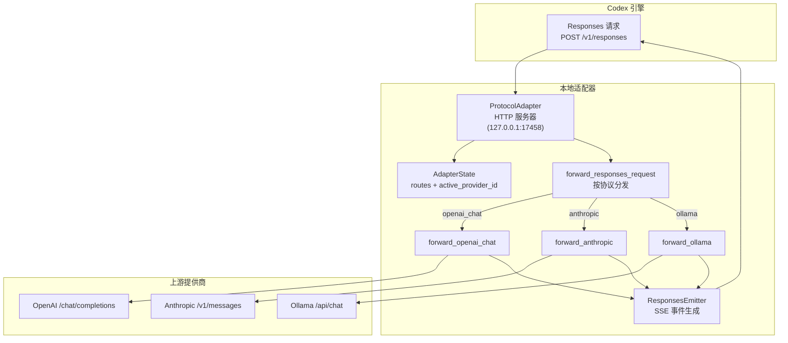
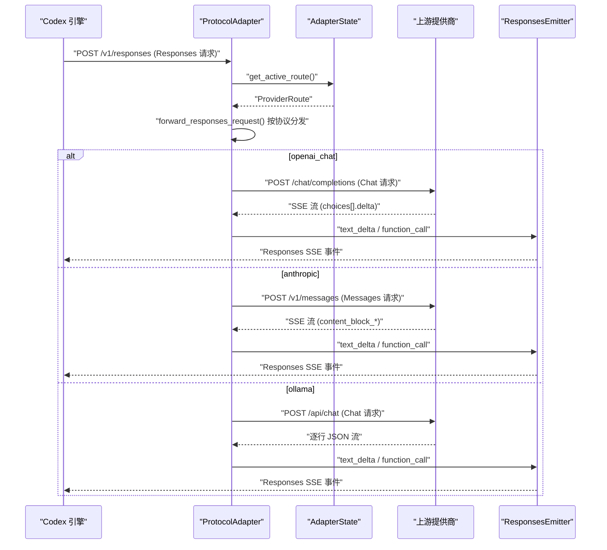
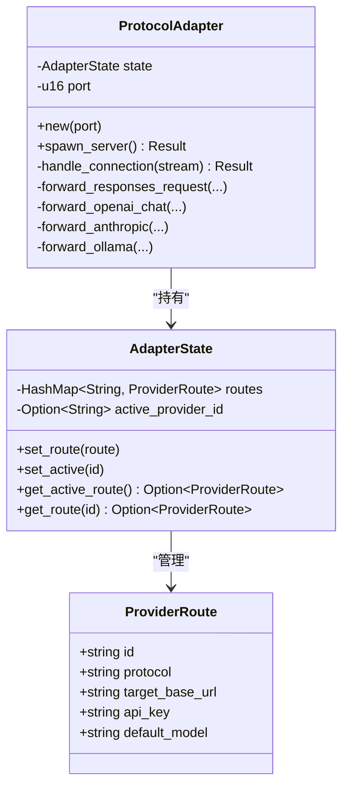
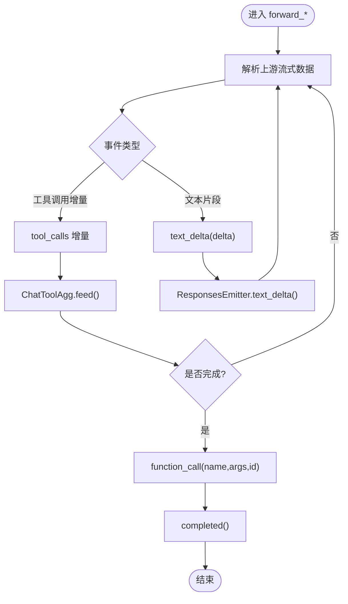
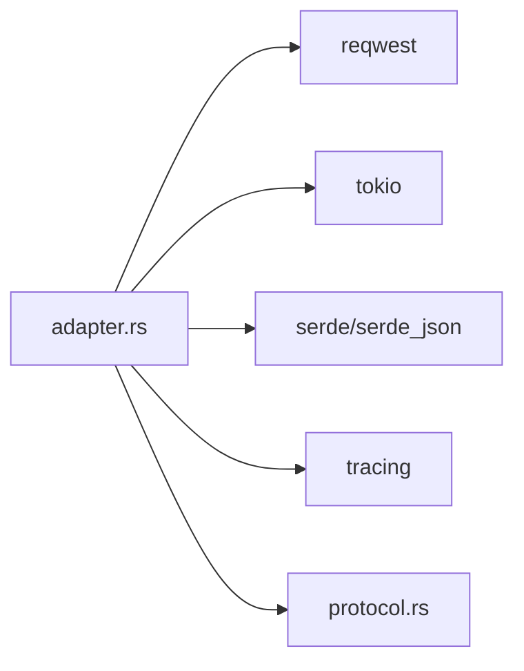

# 协议适配层

<cite>
**本文引用的文件**
- [adapter.rs](file://src-tauri/src/codex/adapter.rs)
- [protocol.rs](file://src-tauri/src/codex/protocol.rs)
- [mod.rs](file://src-tauri/src/codex/mod.rs)
- [client.rs](file://src-tauri/src/codex/client.rs)
- [test-adapter-protocol.mjs](file://scripts/test-adapter-protocol.mjs)
</cite>

## 目录
1. [简介](#简介)
2. [项目结构](#项目结构)
3. [核心组件](#核心组件)
4. [架构总览](#架构总览)
5. [详细组件分析](#详细组件分析)
6. [依赖关系分析](#依赖关系分析)
7. [性能考量](#性能考量)
8. [故障排查指南](#故障排查指南)
9. [结论](#结论)
10. [附录](#附录)

## 简介
本模块为 Codex 引擎提供“协议适配层”，将引擎统一要求的 Responses 协议（本地 HTTP，默认端口 17458）透明地转换为多种上游提供商的协议（OpenAI Chat Completions、Anthropic Messages、Ollama Chat），并在流式响应中保持与 Responses SSE 事件一致的语义。其目标包括：
- 多提供商支持：通过 ProviderRoute 配置不同后端，按协议路由请求。
- 协议转换：将 Responses 的请求体与工具调用历史转换为各提供商格式；将上游流式响应转回 Responses SSE。
- 请求路由：根据当前激活的 ProviderRoute 决定转发目标。
- 错误映射：将上游错误包装为统一的 JSON 错误返回给引擎。
- 可扩展性：新增提供商只需实现一个 forward_* 方法并注册到路由分发逻辑。

## 项目结构
适配层位于 Rust Tauri 后端模块 codex 下，核心文件如下：
- adapter.rs：HTTP 服务器、请求解析、路由分发、协议转换、SSE 发射器、工具聚合等。
- protocol.rs：JSON-RPC 常量与方法名定义，供客户端与引擎交互使用。
- mod.rs：导出适配层对外类型（ProtocolAdapter、AdapterState、ProviderRoute）。
- client.rs：WebSocket JSON-RPC 客户端，负责与官方 app-server 握手与消息收发（与适配层解耦但同属 codex 子模块）。
- test-adapter-protocol.mjs：Node 脚本，验证消息提取与系统提示分离等转换逻辑。

图表来源
- [adapter.rs:85-111](file://src-tauri/src/codex/adapter.rs#L85-L111)
- [adapter.rs:194-220](file://src-tauri/src/codex/adapter.rs#L194-L220)
- [adapter.rs:222-343](file://src-tauri/src/codex/adapter.rs#L222-L343)
- [adapter.rs:345-494](file://src-tauri/src/codex/adapter.rs#L345-L494)
- [adapter.rs:496-601](file://src-tauri/src/codex/adapter.rs#L496-L601)
- [adapter.rs:604-724](file://src-tauri/src/codex/adapter.rs#L604-L724)

章节来源
- [adapter.rs:1-111](file://src-tauri/src/codex/adapter.rs#L1-L111)
- [mod.rs:1-9](file://src-tauri/src/codex/mod.rs#L1-L9)

## 核心组件
- ProtocolAdapter：启动本地 HTTP 服务，接收引擎的 Responses 请求，解析并路由到具体提供商适配器，再将上游流式响应以 Responses SSE 形式写回。
- AdapterState：维护 ProviderRoute 集合与当前激活的 provider id，用于动态切换与查询。
- ProviderRoute：描述一个提供商路由，包含 id、protocol、target_base_url、api_key、default_model。
- ResponsesEmitter：封装 Responses SSE 事件序列（response.created → output_item.added → output_text.delta → output_item.done → response.completed），保证消息与函数调用的顺序一致性。
- ChatToolAgg：聚合 OpenAI Chat 流中的增量 tool_calls，合并为完整函数调用后一次性发出。

章节来源
- [adapter.rs:30-71](file://src-tauri/src/codex/adapter.rs#L30-L71)
- [adapter.rs:604-724](file://src-tauri/src/codex/adapter.rs#L604-L724)
- [adapter.rs:726-769](file://src-tauri/src/codex/adapter.rs#L726-L769)

## 架构总览
适配层作为网关，屏蔽下游差异，向上暴露统一接口。关键流程：
- 连接处理：读取 HTTP 头与 body，识别 POST /v1/responses。
- 路由选择：从 AdapterState 获取 active provider route。
- 协议转换：根据 route.protocol 选择 forward_openai_chat / forward_anthropic / forward_ollama。
- 上游请求：构造对应协议的请求体（含 messages/tools/system），设置鉴权头。
- 上游响应：解析 SSE 或逐行 JSON 流，转换为 Responses 事件并通过 ResponsesEmitter 写出。
- 错误处理：网络错误、非成功状态码均被捕获并转为 HTTP 错误响应。

图表来源
- [adapter.rs:113-192](file://src-tauri/src/codex/adapter.rs#L113-L192)
- [adapter.rs:194-220](file://src-tauri/src/codex/adapter.rs#L194-L220)
- [adapter.rs:222-343](file://src-tauri/src/codex/adapter.rs#L222-L343)
- [adapter.rs:345-494](file://src-tauri/src/codex/adapter.rs#L345-L494)
- [adapter.rs:496-601](file://src-tauri/src/codex/adapter.rs#L496-L601)
- [adapter.rs:604-724](file://src-tauri/src/codex/adapter.rs#L604-L724)

## 详细组件分析

### 多提供商支持与请求路由策略
- 路由数据结构：ProviderRoute 包含协议标识（openai_chat | anthropic | ollama | openai_responses）、目标 base_url、API Key、默认模型。
- 活跃路由：AdapterState 维护 routes 映射与 active_provider_id，支持 set_route/set_active/get_active_route。
- 路由分发：forward_responses_request 根据 route.protocol 分派到具体 forward_* 方法，未匹配时默认走 openai_chat。

图表来源
- [adapter.rs:30-71](file://src-tauri/src/codex/adapter.rs#L30-L71)
- [adapter.rs:85-111](file://src-tauri/src/codex/adapter.rs#L85-L111)
- [adapter.rs:194-220](file://src-tauri/src/codex/adapter.rs#L194-L220)

章节来源
- [adapter.rs:30-71](file://src-tauri/src/codex/adapter.rs#L30-L71)
- [adapter.rs:194-220](file://src-tauri/src/codex/adapter.rs#L194-L220)

### 协议转换逻辑（请求预处理）
- OpenAI Chat：
  - 从 Responses 请求中提取 model、messages、tools、temperature、reasoning_effort 等字段。
  - 将 responses-format tools 转换为 Chat tools（仅保留 function 类型）。
  - 将 function_call / function_call_output 历史转换为 assistant 的 tool_calls 与 tool role 消息。
- Anthropic：
  - 提取 system 提示与 messages，将 responses-format tools 转换为 input_schema。
  - 将 function_call / function_call_output 转换为 tool_use / tool_result content blocks。
  - 严格遵循 user/assistant 交替规则，合并相邻同角色块。
- Ollama：
  - 复用 extract_chat_messages 生成 messages，附加 tools。
  - 将 tool_calls 直接映射为 function 调用。

章节来源
- [adapter.rs:222-343](file://src-tauri/src/codex/adapter.rs#L222-L343)
- [adapter.rs:345-494](file://src-tauri/src/codex/adapter.rs#L345-L494)
- [adapter.rs:496-601](file://src-tauri/src/codex/adapter.rs#L496-L601)
- [adapter.rs:796-849](file://src-tauri/src/codex/adapter.rs#L796-L849)
- [adapter.rs:851-1045](file://src-tauri/src/codex/adapter.rs#L851-L1045)

### 响应后处理（SSE 发射器与工具聚合）
- ResponsesEmitter：
  - begin：发送 response.created。
  - text_delta：首次文本时打开输出项（output_item.added），随后持续发送 output_text.delta，结束时发送 output_item.done。
  - function_call：关闭当前消息，发送 function_call 的 added/done 事件，携带 name、call_id、arguments。
  - completed：最终发送 response.completed。
- ChatToolAgg：
  - 聚合 OpenAI Chat 流中的增量 tool_calls，按 index 合并为完整调用，在流结束或需要时一次性发出。

图表来源
- [adapter.rs:222-343](file://src-tauri/src/codex/adapter.rs#L222-L343)
- [adapter.rs:604-724](file://src-tauri/src/codex/adapter.rs#L604-L724)
- [adapter.rs:726-769](file://src-tauri/src/codex/adapter.rs#L726-L769)

章节来源
- [adapter.rs:604-724](file://src-tauri/src/codex/adapter.rs#L604-L724)
- [adapter.rs:726-769](file://src-tauri/src/codex/adapter.rs#L726-L769)

### 错误映射机制
- 上游网络错误：捕获 reqwest 错误，返回 HTTP 502 Bad Gateway，并附带错误信息。
- 上游非成功状态码：读取响应体，原样返回给引擎，便于上层诊断。
- 无激活路由：返回 400 Bad Request，提示未配置活动提供商。
- 通用错误：所有异常路径均确保写入完整的 HTTP 响应头与 body。

章节来源
- [adapter.rs:162-192](file://src-tauri/src/codex/adapter.rs#L162-L192)
- [adapter.rs:270-295](file://src-tauri/src/codex/adapter.rs#L270-L295)
- [adapter.rs:388-412](file://src-tauri/src/codex/adapter.rs#L388-L412)
- [adapter.rs:527-545](file://src-tauri/src/codex/adapter.rs#L527-L545)

### 新提供商集成指南
步骤：
1. 在 ProviderRoute.protocol 中增加新的协议标识（如 "custom"）。
2. 在 forward_responses_request 中添加分支，调用新的 forward_custom 方法。
3. 实现 forward_custom：
   - 解析 Responses 请求，构造自定义协议请求体（含 messages/tools/system）。
   - 发送请求，处理鉴权头与超时。
   - 解析上游流式响应，使用 ResponsesEmitter 输出标准 Responses SSE 事件。
   - 处理工具调用：若上游返回增量工具调用，需聚合并在适当时机以 function_call 事件发出。
4. 测试：
   - 使用 scripts/test-adapter-protocol.mjs 验证消息提取与系统提示分离。
   - 通过本地 17458 端口模拟引擎请求，端到端验证事件顺序与内容正确性。

扩展点：
- convert_tools_*：新增工具定义转换函数，将 responses-format tools 映射到上游格式。
- extract_*_messages：新增消息提取函数，处理不同协议的消息结构与工具往返。

章节来源
- [adapter.rs:194-220](file://src-tauri/src/codex/adapter.rs#L194-L220)
- [adapter.rs:796-849](file://src-tauri/src/codex/adapter.rs#L796-L849)
- [adapter.rs:851-1045](file://src-tauri/src/codex/adapter.rs#L851-L1045)
- [test-adapter-protocol.mjs:1-66](file://scripts/test-adapter-protocol.mjs#L1-L66)

### 协议扩展方法
- 新增协议标识：在 ProviderRoute.protocol 中声明新值。
- 新增转发方法：实现 forward_<provider>()，遵循现有模式（构造请求、发送、解析流、发射事件）。
- 工具与消息转换：实现 convert_tools_<provider>() 与 extract_<provider>_messages()。
- 错误处理：确保所有异常路径返回合适的 HTTP 状态码与 JSON 错误体。

章节来源
- [adapter.rs:194-220](file://src-tauri/src/codex/adapter.rs#L194-L220)
- [adapter.rs:796-849](file://src-tauri/src/codex/adapter.rs#L796-L849)
- [adapter.rs:851-1045](file://src-tauri/src/codex/adapter.rs#L851-L1045)

## 依赖关系分析
- 内部依赖：
  - adapter.rs 依赖 protocol.rs 中的 JSON-RPC 常量（用于客户端侧，适配层本身不直接使用）。
  - adapter.rs 通过 std::sync::Arc<Mutex<T>> 共享 AdapterState。
  - 使用 tokio 进行异步 I/O 与流处理。
- 外部依赖：
  - reqwest 用于上游 HTTP 请求。
  - serde/serde_json 用于 JSON 序列化与反序列化。
  - tracing 用于日志记录。

图表来源
- [adapter.rs:17-26](file://src-tauri/src/codex/adapter.rs#L17-L26)
- [protocol.rs:1-102](file://src-tauri/src/codex/protocol.rs#L1-L102)

章节来源
- [adapter.rs:17-26](file://src-tauri/src/codex/adapter.rs#L17-L26)
- [protocol.rs:1-102](file://src-tauri/src/codex/protocol.rs#L1-L102)

## 性能考量
- 流式处理：使用 chunk().await 逐块读取上游响应，避免全量缓冲，降低内存占用。
- SSE 缓冲：对上游 SSE 行进行最小化缓冲（按行分割），及时解析与转发。
- 工具调用聚合：ChatToolAgg 使用 BTreeMap 按索引聚合增量 tool_calls，减少重复计算。
- 超时控制：上游请求设置 180 秒超时，防止长时间挂起。
- 并发连接：每个连接在独立任务中处理，提高吞吐能力。

优化建议：
- 可考虑引入更高效的 SSE 解析库（如 sse-stream）以减少字符串拼接开销。
- 对大消息场景，可增加背压控制与最大缓冲区限制。
- 对高频工具调用，可评估使用零拷贝技术减少序列化成本。

[本节为一般性指导，无需特定文件引用]

## 故障排查指南
常见问题与定位：
- 无激活路由：检查 AdapterState.active_provider_id 是否正确设置，确认 set_active 已调用。
- 上游 502：检查 target_base_url、api_key、网络连通性与上游服务状态。
- 事件顺序错误：确认 ResponsesEmitter 的 begin/text_delta/function_call/completed 调用顺序符合规范。
- 工具调用丢失：检查 ChatToolAgg 是否正确聚合增量 tool_calls，并在合适时机 drain。
- 日志与断言：启用 tracing 日志，使用 Node 脚本验证消息提取逻辑。

调试工具：
- 本地抓包：监听 127.0.0.1:17458，查看 Requests 与 Responses SSE 事件。
- 单元测试：运行 scripts/test-adapter-protocol.mjs 验证转换逻辑。
- 日志级别：调整 tracing 级别，观察 error/warn/info 输出。

章节来源
- [adapter.rs:162-192](file://src-tauri/src/codex/adapter.rs#L162-L192)
- [adapter.rs:270-295](file://src-tauri/src/codex/adapter.rs#L270-L295)
- [adapter.rs:388-412](file://src-tauri/src/codex/adapter.rs#L388-L412)
- [adapter.rs:527-545](file://src-tauri/src/codex/adapter.rs#L527-L545)
- [test-adapter-protocol.mjs:1-66](file://scripts/test-adapter-protocol.mjs#L1-L66)

## 结论
本协议适配层通过清晰的组件划分与可扩展的设计，实现了多提供商的统一接入与 Responses 协议的稳定输出。其核心优势在于：
- 解耦：适配层与上游协议细节解耦，易于扩展新提供商。
- 一致：统一 Responses SSE 事件序列，保障引擎兼容性。
- 健壮：完善的错误映射与超时控制，提升稳定性。
- 可测：提供脚本验证与日志支持，便于调试与回归测试。

未来可进一步优化的方向包括：
- 引入更高效的流式解析与序列化方案。
- 增强配置管理能力，支持动态热更新路由。
- 完善监控指标，量化延迟与错误率。

[本节为总结性内容，无需特定文件引用]

## 附录
- 相关常量与方法名定义见 protocol.rs，供客户端与引擎交互使用。
- 客户端 WebSocket 通信见 client.rs，负责 initialize 握手与消息收发。

章节来源
- [protocol.rs:1-207](file://src-tauri/src/codex/protocol.rs#L1-L207)
- [client.rs:1-234](file://src-tauri/src/codex/client.rs#L1-L234)