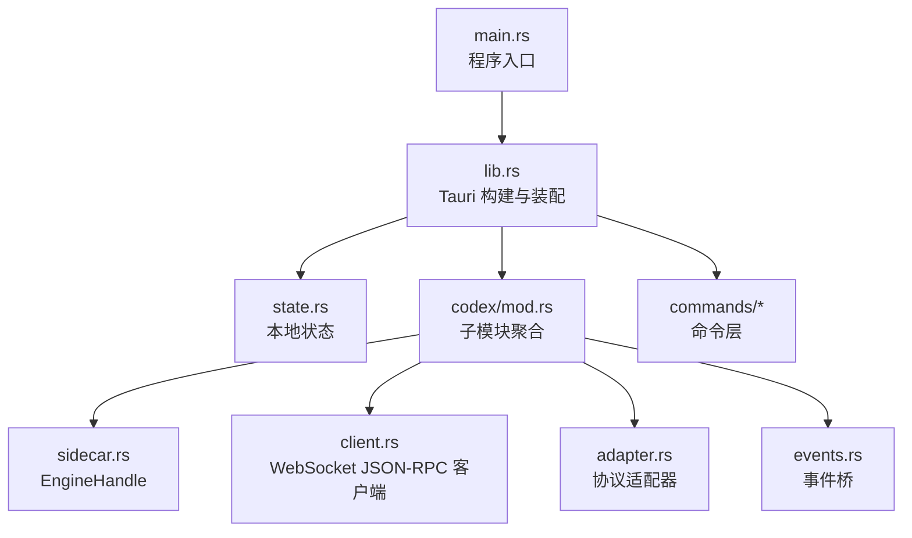
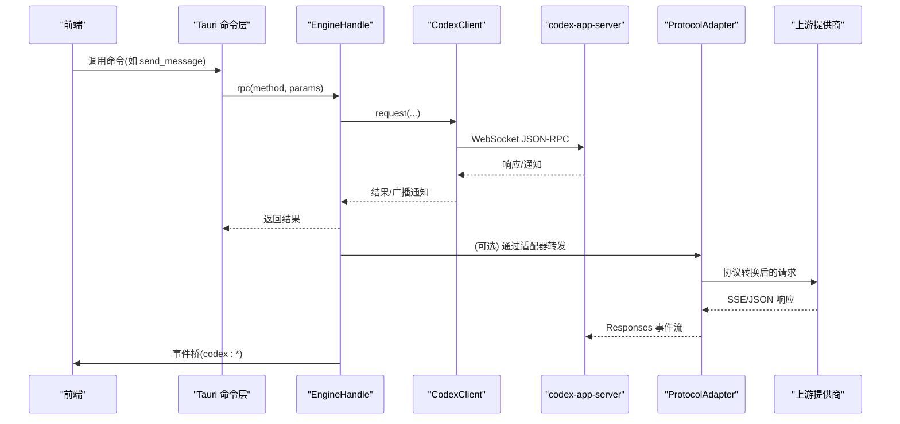
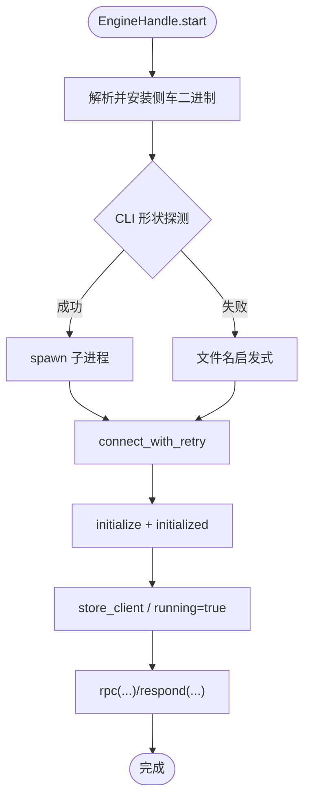
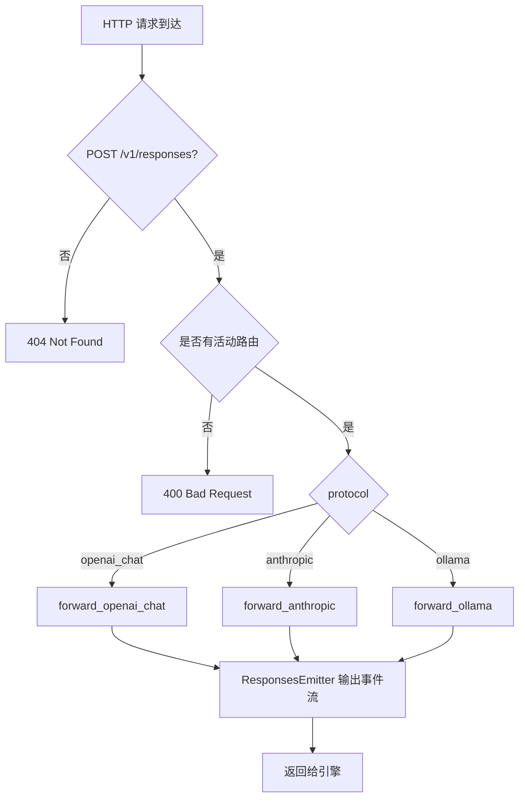
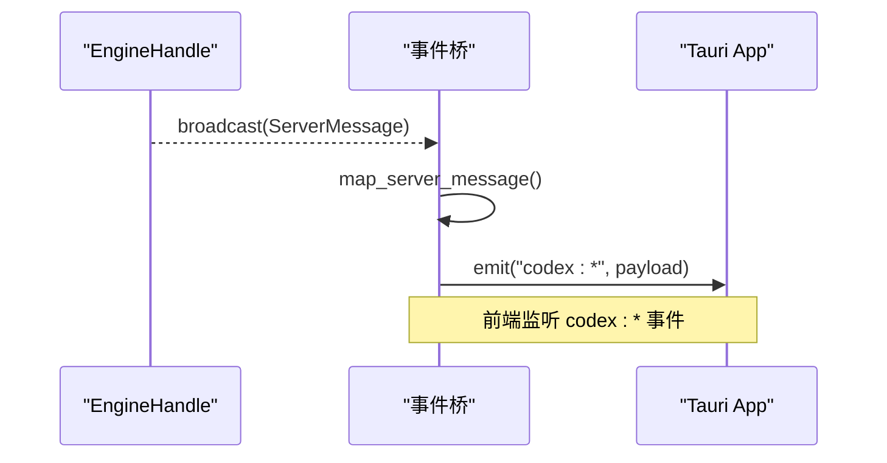
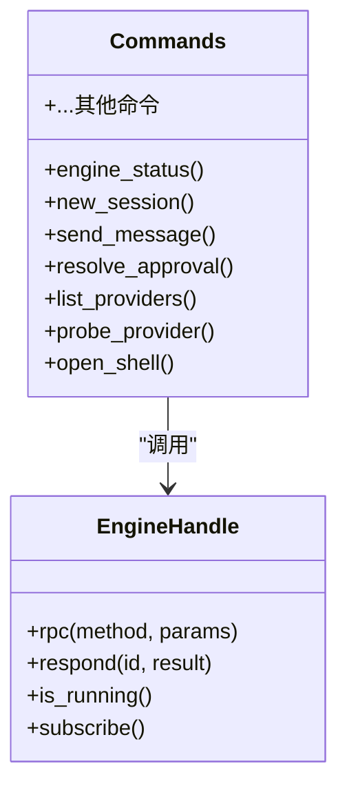
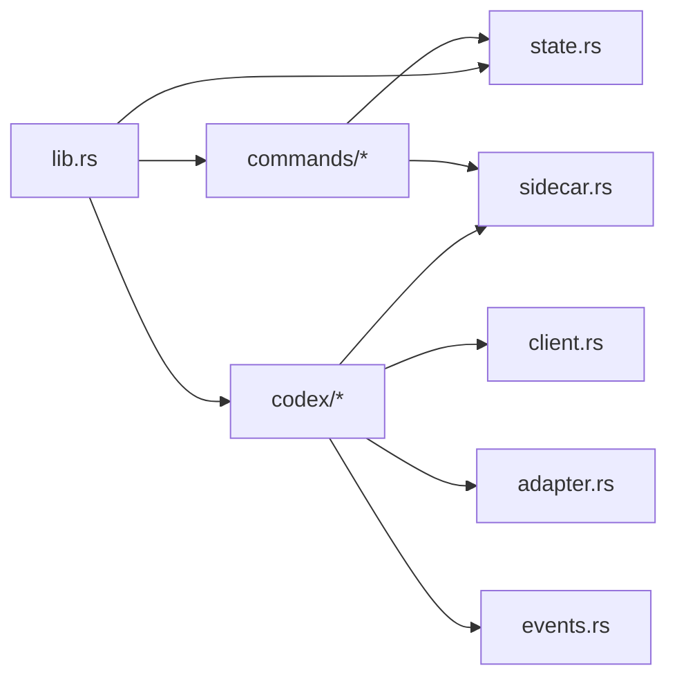

# 后端架构

<cite>
**本文引用的文件**
- [main.rs](file://src-tauri/src/main.rs)
- [lib.rs](file://src-tauri/src/lib.rs)
- [state.rs](file://src-tauri/src/state.rs)
- [Cargo.toml](file://src-tauri/Cargo.toml)
- [RUST_BACKEND.md](file://docs/RUST_BACKEND.md)
- [codex/mod.rs](file://src-tauri/src/codex/mod.rs)
- [codex/sidecar.rs](file://src-tauri/src/codex/sidecar.rs)
- [codex/client.rs](file://src-tauri/src/codex/client.rs)
- [codex/adapter.rs](file://src-tauri/src/codex/adapter.rs)
- [codex/events.rs](file://src-tauri/src/codex/events.rs)
- [commands/mod.rs](file://src-tauri/src/commands/mod.rs)
- [commands/engine.rs](file://src-tauri/src/commands/engine.rs)
</cite>

## 目录
1. [简介](#简介)
2. [项目结构](#项目结构)
3. [核心组件](#核心组件)
4. [架构总览](#架构总览)
5. [详细组件分析](#详细组件分析)
6. [依赖关系分析](#依赖关系分析)
7. [性能与并发](#性能与并发)
8. [故障排查指南](#故障排查指南)
9. [结论](#结论)

## 简介
本文件面向 Codex-Tauri 的 Rust 后端，系统性阐述 Tauri 主进程初始化、模块组织、命令处理机制，以及 EngineHandle 引擎管理、ProtocolAdapter 协议适配、事件桥接系统的实现。同时覆盖异步处理模式、错误处理策略、资源管理与性能优化要点，并给出架构图表以展示模块间依赖与数据流。

## 项目结构
- 入口与装配
  - 程序入口在 main.rs，仅调用库函数 run()。
  - 应用启动在 lib.rs：注册插件、菜单、状态、EngineHandle、ProtocolAdapter、事件桥，并挂载所有 Tauri 命令。
- 模块划分
  - codex：侧车（engine）生命周期、WebSocket JSON-RPC 客户端、协议适配器、事件桥。
  - commands：Tauri 命令层，将前端调用转发到 engine 或本地状态。
  - state：桌面端持久化状态（设置、偏好、宠物、日历、连接器等）。
- 配置与依赖
  - Cargo.toml 声明 tauri、tokio、reqwest 等关键依赖；使用 tracing/tracing-subscriber 进行日志。

图表来源
- [main.rs:4-6](file://src-tauri/src/main.rs#L4-L6)
- [lib.rs:16-159](file://src-tauri/src/lib.rs#L16-L159)
- [state.rs:150-232](file://src-tauri/src/state.rs#L150-L232)
- [codex/mod.rs:1-9](file://src-tauri/src/codex/mod.rs#L1-L9)

章节来源
- [main.rs:4-6](file://src-tauri/src/main.rs#L4-L6)
- [lib.rs:16-159](file://src-tauri/src/lib.rs#L16-L159)
- [Cargo.toml:17-49](file://src-tauri/Cargo.toml#L17-L49)

## 核心组件
- EngineHandle：负责侧车二进制发现、安装、启动、连接握手、RPC 请求、通知广播、优雅关闭。
- ProtocolAdapter：本地 HTTP 网关，接收引擎的 Responses 请求，按路由转至 OpenAI Chat、Anthropic Messages、Ollama 等上游，并将上游 SSE 流转换为 Responses 事件流返回给引擎。
- 事件桥：订阅 EngineHandle 的稳定广播通道，将服务器通知/请求映射为 Tauri 事件（如 codex:turn-completed、codex:approval），供前端消费。
- 命令层：将前端通过 Tauri 调用的命令（如 new_session、send_message、list_providers、probe_provider 等）转发到 EngineHandle 或读取/写入本地状态。

章节来源
- [codex/sidecar.rs:22-276](file://src-tauri/src/codex/sidecar.rs#L22-L276)
- [codex/adapter.rs:68-111](file://src-tauri/src/codex/adapter.rs#L68-L111)
- [codex/events.rs:12-43](file://src-tauri/src/codex/events.rs#L12-L43)
- [commands/engine.rs:22-800](file://src-tauri/src/commands/engine.rs#L22-L800)

## 架构总览
下图展示了从前端到后端的完整调用链：前端通过 Tauri 命令调用 Rust 命令层，命令层通过 EngineHandle 与官方 codex-app-server 进行 WebSocket JSON-RPC 通信；同时，引擎的通知经事件桥转为 Tauri 事件推送给前端。对于非 Responses 协议的第三方模型提供商，请求先经过 ProtocolAdapter 进行协议转换。

图表来源
- [lib.rs:71-148](file://src-tauri/src/lib.rs#L71-L148)
- [codex/sidecar.rs:195-244](file://src-tauri/src/codex/sidecar.rs#L195-L244)
- [codex/client.rs:37-94](file://src-tauri/src/codex/client.rs#L37-L94)
- [codex/adapter.rs:113-220](file://src-tauri/src/codex/adapter.rs#L113-L220)
- [codex/events.rs:12-43](file://src-tauri/src/codex/events.rs#L12-L43)

## 详细组件分析

### EngineHandle 引擎管理
- 职责
  - 侧车二进制解析与安装：支持环境变量、用户配置、打包资源、已安装副本、PATH 等多级查找；内容寻址安装到本地目录，保证原子性。
  - 启动与 CLI 探测：根据二进制帮助输出决定前缀参数（standalone vs multi-call）及是否传递 --session-source。
  - 连接与握手：重试连接直到侧车就绪；执行 initialize 请求并在成功后发送 initialized 通知。
  - RPC 与响应：维护 pending 请求映射，超时控制；支持 respond 回复服务器请求（审批、用户输入等）。
  - 事件广播：将客户端收到的通知/请求广播到稳定通道，供事件桥消费。
  - 生命周期：is_running、shutdown 清理连接与子进程。
- 关键流程
  - 启动：resolve_and_install_sidecar → probe_invocation → spawn → connect_with_retry → store_client。
  - 请求：rpc → 若未连接则重试连接 → 发送请求 → 等待响应或超时。
  - 关闭：close client + kill child process。

图表来源
- [codex/sidecar.rs:32-125](file://src-tauri/src/codex/sidecar.rs#L32-L125)
- [codex/sidecar.rs:195-244](file://src-tauri/src/codex/sidecar.rs#L195-L244)
- [codex/sidecar.rs:262-275](file://src-tauri/src/codex/sidecar.rs#L262-L275)

章节来源
- [codex/sidecar.rs:22-276](file://src-tauri/src/codex/sidecar.rs#L22-L276)
- [codex/sidecar.rs:278-540](file://src-tauri/src/codex/sidecar.rs#L278-L540)

### ProtocolAdapter 协议适配
- 职责
  - 监听本地 HTTP 端口，接收来自引擎的 POST /v1/responses 请求。
  - 根据 ProviderRoute 选择上游协议（openai_chat、anthropic、ollama），构造对应请求体并转发。
  - 将上游 SSE 流转换为 Responses 事件流（response.created → output_item.added → output_text.delta → output_item.done → response.completed）。
  - 对工具调用进行聚合与重建，确保 function_call 语义正确。
- 关键流程
  - 连接处理：读取 HTTP 头与 body → 路由匹配 → 选择 forward_* 方法。
  - OpenAI Chat：提取 messages/tools/stream → 发送请求 → 解析 choices[].delta.tool_calls → 聚合 → 输出 function_call。
  - Anthropic：解析 content_block_start/delta/stop → 组装 tool_use → 输出 function_call。
  - Ollama：解析 message.tool_calls → 直接输出 function_call。
- 错误处理
  - 上游不可达/非 2xx：返回 502/错误体。
  - 无活动路由：返回 400 错误。

图表来源
- [codex/adapter.rs:113-220](file://src-tauri/src/codex/adapter.rs#L113-L220)
- [codex/adapter.rs:222-343](file://src-tauri/src/codex/adapter.rs#L222-L343)
- [codex/adapter.rs:345-494](file://src-tauri/src/codex/adapter.rs#L345-L494)
- [codex/adapter.rs:496-601](file://src-tauri/src/codex/adapter.rs#L496-L601)
- [codex/adapter.rs:604-724](file://src-tauri/src/codex/adapter.rs#L604-L724)

章节来源
- [codex/adapter.rs:68-111](file://src-tauri/src/codex/adapter.rs#L68-L111)
- [codex/adapter.rs:113-220](file://src-tauri/src/codex/adapter.rs#L113-L220)
- [codex/adapter.rs:222-601](file://src-tauri/src/codex/adapter.rs#L222-L601)
- [codex/adapter.rs:604-724](file://src-tauri/src/codex/adapter.rs#L604-L724)

### 事件桥接系统
- 职责
  - 启动时订阅 EngineHandle 的稳定广播通道。
  - 将服务器通知/请求映射为 Tauri 事件：
    - 通知：codex:{method with / and . replaced by -}
    - 请求：codex:approval、codex:user-input、codex:server-request-{sanitized}
  - 向窗口/应用 emit 事件，供前端 bridge.js 消费。
- 关键点
  - 使用 tokio::sync::broadcast，容量 256，避免阻塞请求映射。
  - 延迟订阅（50ms）确保 EngineHandle 已 manage。
  - Lagged/Closed 错误处理：记录警告或退出。

图表来源
- [codex/events.rs:12-43](file://src-tauri/src/codex/events.rs#L12-L43)
- [codex/events.rs:45-82](file://src-tauri/src/codex/events.rs#L45-L82)

章节来源
- [codex/events.rs:12-43](file://src-tauri/src/codex/events.rs#L12-L43)
- [codex/events.rs:45-82](file://src-tauri/src/codex/events.rs#L45-L82)

### 命令处理机制
- 命令注册：lib.rs 中集中注册所有命令（本地状态、引擎转发、市场、文件系统、计划任务等）。
- 引擎命令：
  - 会话管理：new_session、list_sessions、get_session、delete_session、archive/unarchive。
  - 消息与中断：send_message、interrupt_session。
  - 审批与用户输入：resolve_approval、respond_server_request。
  - 提供商与 MCP：list_providers、save_provider、probe_provider、list_mcp_servers、save_mcp_server、test_mcp_connection、set_mcp_server_enabled。
  - 技能与插件：list_skills、reload_skills、list_plugins、set_plugin_enabled。
  - Shell：open_shell、write_shell、read_shell、close_shell。
- 数据归一化：对部分响应进行扁平化/字段重命名，便于前端消费（如 thread/start 的 threadStart 保留、thread/list 的 data 包装等）。

图表来源
- [lib.rs:71-148](file://src-tauri/src/lib.rs#L71-L148)
- [commands/engine.rs:22-800](file://src-tauri/src/commands/engine.rs#L22-L800)

章节来源
- [lib.rs:71-148](file://src-tauri/src/lib.rs#L71-L148)
- [commands/engine.rs:22-800](file://src-tauri/src/commands/engine.rs#L22-L800)

## 依赖关系分析
- 模块耦合
  - lib.rs 作为装配中心，依赖 state、codex、commands、menu。
  - commands/engine 强依赖 codex 的 protocol 常量与 EngineHandle。
  - sidecar 依赖 client、protocol、state（用于 provider 环境注入）。
  - adapter 独立于 engine，但被 save_provider 等命令激活。
  - events 依赖 EngineHandle 的广播通道。
- 外部依赖
  - tauri、tauri-plugin-*：UI 集成、文件系统、存储、shell。
  - tokio/tokio-tungstenite：异步运行时与 WebSocket。
  - reqwest：HTTP 客户端（适配器与探针）。
  - tracing/tracing-subscriber：结构化日志。
  - serde/serde_json：序列化/反序列化。

图表来源
- [lib.rs:1-5](file://src-tauri/src/lib.rs#L1-L5)
- [lib.rs:71-148](file://src-tauri/src/lib.rs#L71-L148)
- [commands/mod.rs:1-11](file://src-tauri/src/commands/mod.rs#L1-L11)
- [codex/mod.rs:1-9](file://src-tauri/src/codex/mod.rs#L1-L9)

章节来源
- [Cargo.toml:17-49](file://src-tauri/Cargo.toml#L17-L49)
- [lib.rs:1-5](file://src-tauri/src/lib.rs#L1-L5)

## 性能与并发
- 异步模型
  - 基于 tokio 的多线程运行时；WebSocket 读写分离为独立任务；请求使用 oneshot channel 配合 pending map 管理。
  - 事件广播使用 tokio::sync::broadcast，容量 256，避免阻塞请求处理。
- 超时与重试
  - initialize 超时 10s；普通请求超时 120s；连接重试最多 40 次，间隔 250ms。
- 内存与资源
  - 二进制内容寻址安装，避免重复拷贝；临时文件+rename 保证原子性。
  - 子进程句柄在 shutdown 时释放；WebSocket 连接在 close 时释放。
- 并发策略
  - 每个适配器连接独立任务处理；上游 SSE 流逐行解析，减少内存占用。
  - 工具调用增量聚合（OpenAI Chat 的 delta.tool_calls）降低重组开销。
- 建议
  - 在高并发场景下关注 pending map 的清理与泄漏；当前文档指出冷启动双连接竞态问题，建议在后续版本增加去重与快速失败。
  - 考虑对侧车进程加入存活监控与自动重启策略。

章节来源
- [codex/client.rs:19-21](file://src-tauri/src/codex/client.rs#L19-L21)
- [codex/sidecar.rs:195-222](file://src-tauri/src/codex/sidecar.rs#L195-L222)
- [codex/sidecar.rs:483-513](file://src-tauri/src/codex/sidecar.rs#L483-L513)
- [RUST_BACKEND.md:144-171](file://docs/RUST_BACKEND.md#L144-L171)
- [RUST_BACKEND.md:288-298](file://docs/RUST_BACKEND.md#L288-L298)

## 故障排查指南
- 无法连接侧车
  - 现象：首次 RPC 报连接拒绝；检查侧车是否成功 spawn 并绑定端口。
  - 处理：确认二进制路径、CLI 形状探测结果、settings.app_server_listen。
- 事件丢失
  - 现象：前端未收到某些通知；检查事件桥 lagged 日志。
  - 处理：提高前端消费速度或调整广播容量。
- 提供商探针失败
  - 现象：probe_provider 返回 ok=false；检查 Base URL、协议、API Key。
  - 处理：根据 hint 修正地址格式或认证头。
- 审批卡住
  - 现象：turn 长时间等待；检查 serverRequest/resolved 通知是否到达。
  - 处理：确保前端正确处理 approval/user-input 并调用 resolve_approval/respond_server_request。
- 适配器错误
  - 现象：上游 502/400；查看适配器日志与上游响应体。
  - 处理：校验路由配置、API Key、上游可达性。

章节来源
- [codex/sidecar.rs:106-116](file://src-tauri/src/codex/sidecar.rs#L106-L116)
- [codex/events.rs:33-40](file://src-tauri/src/codex/events.rs#L33-L40)
- [commands/engine.rs:416-521](file://src-tauri/src/commands/engine.rs#L416-L521)
- [codex/adapter.rs:170-191](file://src-tauri/src/codex/adapter.rs#L170-L191)
- [RUST_BACKEND.md:241-263](file://docs/RUST_BACKEND.md#L241-L263)

## 结论
Codex-Tauri 后端采用清晰的模块化设计：Tauri 命令层统一暴露能力，EngineHandle 封装侧车生命周期与 RPC 通信，ProtocolAdapter 提供灵活的协议适配能力，事件桥确保前后端实时联动。整体方案在异步处理、错误恢复和资源管理方面具备良好实践。后续可进一步增强侧车存活监控、连接去重与更细粒度的超时控制，以提升稳定性与可观测性。