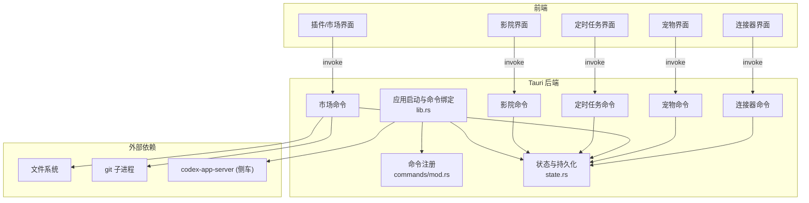
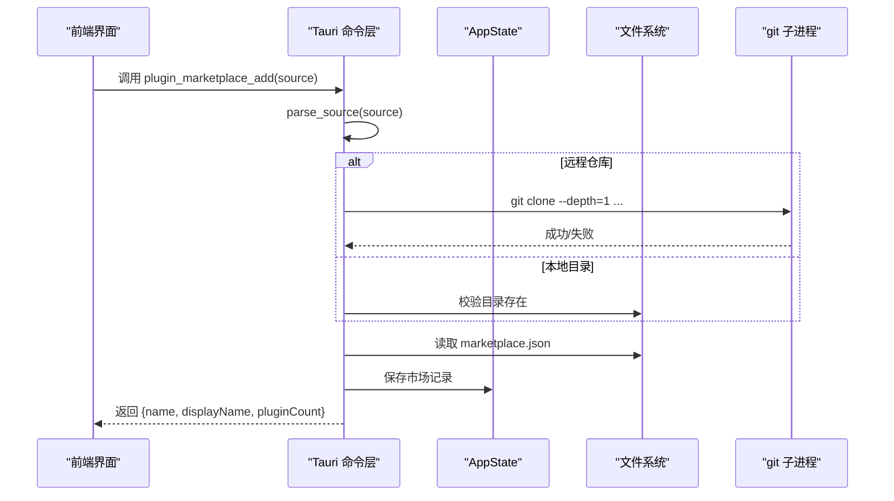
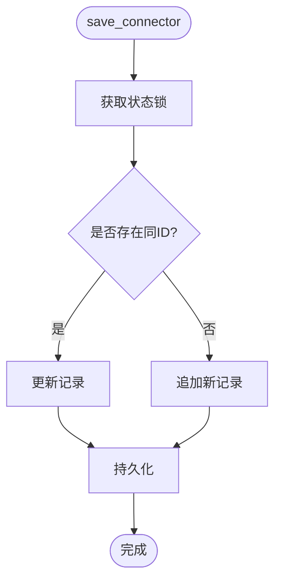
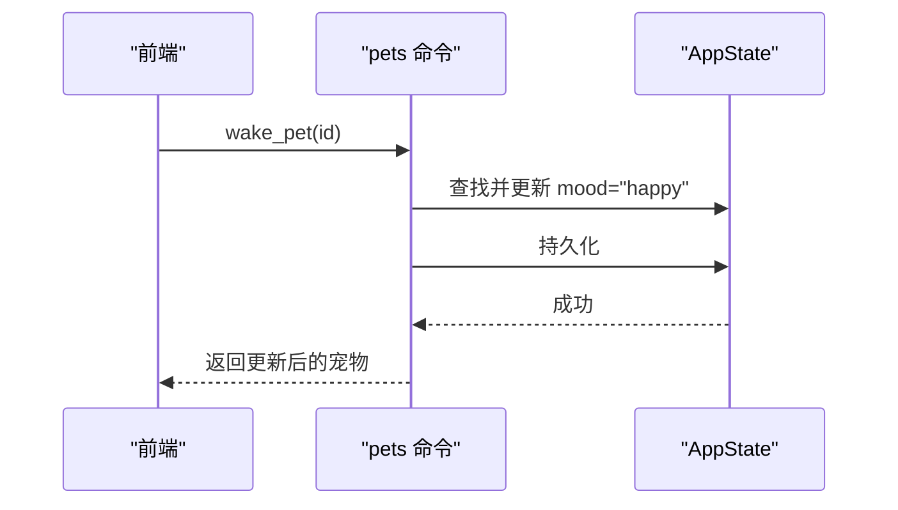
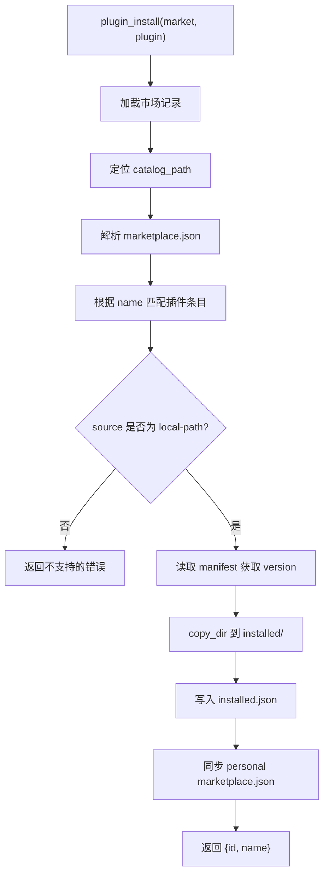
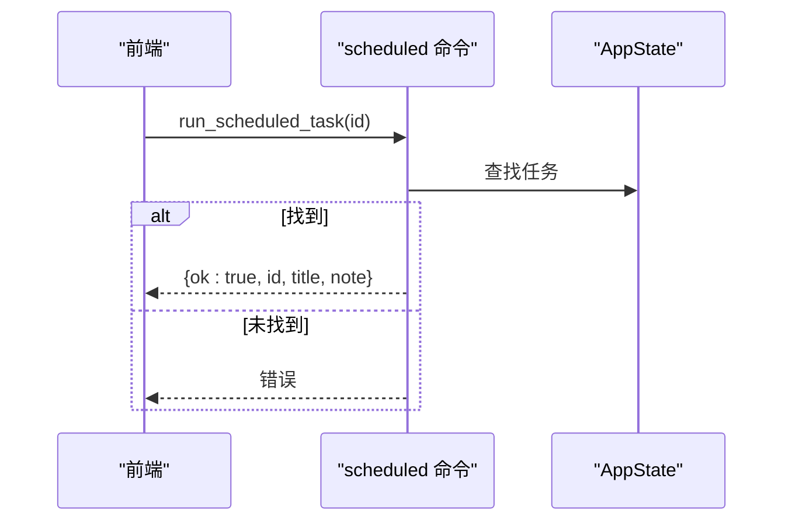
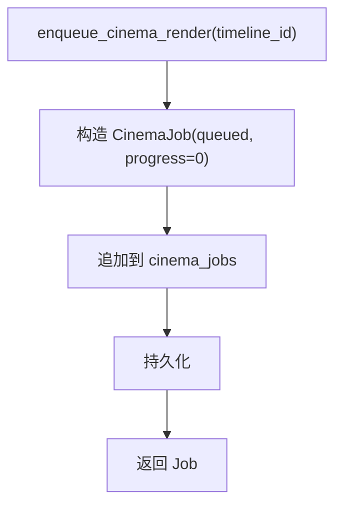
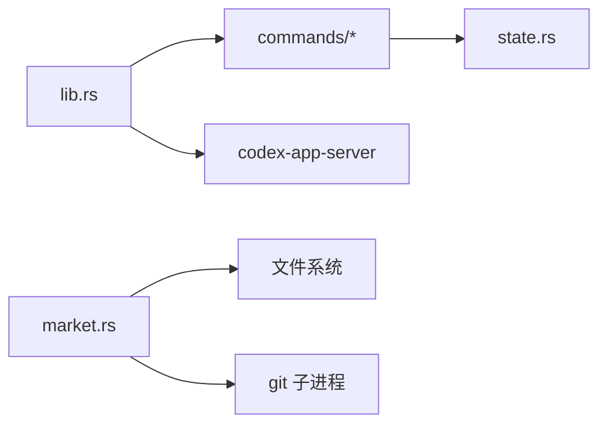

# 其他命令

<cite>
**本文引用的文件**
- [src-tauri/src/commands/mod.rs](file://src-tauri/src/commands/mod.rs)
- [src-tauri/src/lib.rs](file://src-tauri/src/lib.rs)
- [src-tauri/src/state.rs](file://src-tauri/src/state.rs)
- [src-tauri/src/commands/connectors.rs](file://src-tauri/src/commands/connectors.rs)
- [src-tauri/src/commands/pets.rs](file://src-tauri/src/commands/pets.rs)
- [src-tauri/src/commands/market.rs](file://src-tauri/src/commands/market.rs)
- [src-tauri/src/commands/scheduled.rs](file://src-tauri/src/commands/scheduled.rs)
- [src-tauri/src/commands/cinema.rs](file://src-tauri/src/commands/cinema.rs)
- [frontend/app/views/settings/tabs/PluginsTab.tsx](file://frontend/app/views/settings/tabs/PluginsTab.tsx)
- [frontend/app/views/DiscoveryView.tsx](file://frontend/app/views/DiscoveryView.tsx)
- [frontend/app/pet/PetOverlay.tsx](file://frontend/app/pet/PetOverlay.tsx)
</cite>

## 目录
1. [简介](#简介)
2. [项目结构](#项目结构)
3. [核心组件](#核心组件)
4. [架构总览](#架构总览)
5. [详细组件分析](#详细组件分析)
6. [依赖关系分析](#依赖关系分析)
7. [性能考虑](#性能考虑)
8. [故障排查指南](#故障排查指南)
9. [结论](#结论)
10. [附录：命令参考与扩展指南](#附录命令参考与扩展指南)

## 简介
本章节面向“其他辅助命令模块”，覆盖连接器管理、宠物系统、市场（插件）功能、定时任务、影院模式等辅助能力的命令接口、数据流转、外部依赖集成、插件架构与扩展点设计、第三方服务对接方式，并提供使用示例、配置选项、错误处理策略、系统集成注意事项、性能与安全最佳实践，以及自定义扩展开发指南。

## 项目结构
后端通过 Tauri 暴露一组命令，按职责划分在 commands 目录下；状态集中保存在 AppState 中并持久化到 shell-state.json；前端通过 Tauri invoke 调用这些命令。市场模块还涉及本地文件系统操作、Git 子进程克隆、JSON 清单解析与个人市场目录同步。

图表来源
- [src-tauri/src/lib.rs:16-148](file://src-tauri/src/lib.rs#L16-L148)
- [src-tauri/src/commands/mod.rs:1-11](file://src-tauri/src/commands/mod.rs#L1-L11)
- [src-tauri/src/state.rs:150-231](file://src-tauri/src/state.rs#L150-L231)

章节来源
- [src-tauri/src/commands/mod.rs:1-11](file://src-tauri/src/commands/mod.rs#L1-L11)
- [src-tauri/src/lib.rs:16-148](file://src-tauri/src/lib.rs#L16-L148)

## 核心组件
- 连接器管理：提供连接器的增删改查与测试能力，状态由 AppState 维护并持久化。
- 宠物系统：提供宠物的列表、保存、唤醒/安抚、创建自定义宠物等能力。
- 市场（插件）：支持添加/移除市场源、浏览插件、安装/卸载、启用/禁用、技能扫描、个人市场目录同步。
- 定时任务：提供任务列表、保存、手动运行、拉取请求列表与保存。
- 影院模式：时间线管理、渲染任务入队与取消。

章节来源
- [src-tauri/src/commands/connectors.rs:4-52](file://src-tauri/src/commands/connectors.rs#L4-L52)
- [src-tauri/src/commands/pets.rs:4-65](file://src-tauri/src/commands/pets.rs#L4-L65)
- [src-tauri/src/commands/market.rs:388-800](file://src-tauri/src/commands/market.rs#L388-L800)
- [src-tauri/src/commands/scheduled.rs:11-65](file://src-tauri/src/commands/scheduled.rs#L11-L65)
- [src-tauri/src/commands/cinema.rs:4-79](file://src-tauri/src/commands/cinema.rs#L4-L79)

## 架构总览
- 命令注册：所有命令在 lib.rs 中统一注册，确保前端可通过 invoke 调用。
- 状态管理：AppState 持有各模块数据，并通过 save() 原子写入 shell-state.json。
- 插件市场：基于本地文件系统与 Git 子进程实现市场源克隆与插件安装，遵循官方 marketplace 布局约定。
- 事件桥接：侧车通知经事件桥转发至前端（与本模块间接相关）。

图表来源
- [src-tauri/src/commands/market.rs:412-517](file://src-tauri/src/commands/market.rs#L412-L517)
- [src-tauri/src/commands/market.rs:300-384](file://src-tauri/src/commands/market.rs#L300-L384)
- [src-tauri/src/state.rs:176-217](file://src-tauri/src/state.rs#L176-L217)

## 详细组件分析

### 连接器管理
- 职责边界：仅负责连接器的 CRUD 与连通性探测占位。
- 数据模型：Connector（id/name/kind/config），持久化于 AppState.connectors。
- 关键命令：
  - list_connectors：返回当前连接器列表。
  - save_connector：新增或更新连接器，随后持久化。
  - delete_connector：删除指定 id 的连接器，随后持久化。
  - test_connector：对指定连接器执行探测（当前为 stub，返回 ok/id/kind/detail）。
- 错误处理：锁获取失败、未找到连接器时返回错误字符串；保存失败透传。
- 前端集成：可在设置页中列出/编辑/删除连接器，并在需要时触发测试。

图表来源
- [src-tauri/src/commands/connectors.rs:14-32](file://src-tauri/src/commands/connectors.rs#L14-L32)
- [src-tauri/src/state.rs:150-217](file://src-tauri/src/state.rs#L150-L217)

章节来源
- [src-tauri/src/commands/connectors.rs:4-52](file://src-tauri/src/commands/connectors.rs#L4-L52)
- [src-tauri/src/state.rs:108-115](file://src-tauri/src/state.rs#L108-L115)

### 宠物系统
- 职责边界：管理用户可见的宠物实例及其情绪状态，用于增强交互体验。
- 数据模型：Pet（id/name/kind/sprite/mood/custom）。
- 关键命令：
  - list_pets：返回宠物列表。
  - save_pets：批量保存宠物列表。
  - wake_pet / tuck_pet：修改指定宠物的情绪（happy/sleepy）。
  - create_custom_pet：创建自定义宠物（生成 UUID、默认 idle）。
- 错误处理：找不到宠物时返回错误；状态锁失败或持久化失败均返回错误。
- 前端集成：PetOverlay 负责动画与交互；设置页可预览动作；状态来自后端 pets 列表。

图表来源
- [src-tauri/src/commands/pets.rs:15-28](file://src-tauri/src/commands/pets.rs#L15-L28)
- [src-tauri/src/state.rs:66-77](file://src-tauri/src/state.rs#L66-L77)

章节来源
- [src-tauri/src/commands/pets.rs:4-65](file://src-tauri/src/commands/pets.rs#L4-L65)
- [frontend/app/pet/PetOverlay.tsx:50-67](file://frontend/app/pet/PetOverlay.tsx#L50-L67)

### 市场（插件）功能
- 职责边界：本地插件市场的添加、浏览、安装、卸载、启用/禁用、技能扫描与个人市场目录同步。
- 数据模型：MarketplaceRecord、InstalledRecord；清单文件遵循官方布局（marketplace.json、plugin.json 或 .codex-plugin/plugin.json）。
- 关键命令：
  - plugin_marketplaces：列出已添加的市场源及插件数量。
  - plugin_marketplace_add：添加市场源（GitHub/URL/本地目录），支持分支/引用。
  - plugin_marketplace_remove：移除市场源（git 类型会清理本地缓存）。
  - plugin_marketplace_plugins：列出某市场下的插件条目（含 logo、品牌色、技能等）。
  - plugin_install：从本地路径条目安装插件到 installed 目录，并记录元数据。
  - plugin_add_local：直接添加本地插件目录。
  - plugin_installed：列出已安装插件（过滤掉目录缺失的记录）。
  - plugin_uninstall：卸载插件（删除目录并移除记录）。
  - plugin_set_enabled / plugin_skills：启用/禁用插件与查询技能（在 lib.rs 中注册）。
- 外部依赖：
  - 文件系统：读写 JSON、复制目录、生成 data URL 小图标。
  - Git：通过子进程执行 git clone（深度克隆，超时保护）。
- 安全与健壮性：
  - 名称规范化 safe_name 避免非法字符。
  - 目录遍历跳过 .git 与 node_modules。
  - 异步克隆带超时，错误信息友好提示。
  - 个人市场目录 marketplaces-personal.json 与官方布局兼容。
- 前端集成：DiscoveryView 与 PluginsTab 通过 invoke 调用上述命令，展示市场、安装、启用/禁用等操作。

图表来源
- [src-tauri/src/commands/market.rs:711-739](file://src-tauri/src/commands/market.rs#L711-L739)
- [src-tauri/src/commands/market.rs:659-687](file://src-tauri/src/commands/market.rs#L659-L687)
- [src-tauri/src/commands/market.rs:689-709](file://src-tauri/src/commands/market.rs#L689-L709)

章节来源
- [src-tauri/src/commands/market.rs:27-153](file://src-tauri/src/commands/market.rs#L27-L153)
- [src-tauri/src/commands/market.rs:388-800](file://src-tauri/src/commands/market.rs#L388-L800)
- [frontend/app/views/DiscoveryView.tsx:1086-1168](file://frontend/app/views/DiscoveryView.tsx#L1086-L1168)
- [frontend/app/views/settings/tabs/PluginsTab.tsx:74-158](file://frontend/app/views/settings/tabs/PluginsTab.tsx#L74-L158)

### 定时任务
- 职责边界：维护本地定时任务与拉取请求列表，供侧边栏建议与调度使用。
- 数据模型：ScheduledTask（id/title/desc/icon/cron/status）、PR 列表（Value）。
- 关键命令：
  - list_scheduled_tasks / save_scheduled_tasks：读取/保存任务列表。
  - run_scheduled_task：尝试运行任务（当前仅返回元信息，实际执行由前端或引擎处理）。
  - list_pull_requests / save_pull_requests：读取/保存 PR 列表。
- 错误处理：任务不存在时返回错误；状态锁失败或持久化失败均返回错误。
- 前端集成：侧边栏或设置页可展示默认任务（每日简报、每周回顾、跟进监控）。

图表来源
- [src-tauri/src/commands/scheduled.rs:32-47](file://src-tauri/src/commands/scheduled.rs#L32-L47)
- [src-tauri/src/state.rs:124-136](file://src-tauri/src/state.rs#L124-L136)

章节来源
- [src-tauri/src/commands/scheduled.rs:1-66](file://src-tauri/src/commands/scheduled.rs#L1-L66)
- [src-tauri/src/state.rs:198-201](file://src-tauri/src/state.rs#L198-L201)

### 影院模式
- 职责边界：管理视频/媒体时间线与渲染任务队列。
- 数据模型：CinemaTimeline（id/name/clips）、CinemaJob（id/timeline_id/status/progress）。
- 关键命令：
  - list_cinema_timelines / save_cinema_timeline / delete_cinema_timeline：时间线 CRUD。
  - enqueue_cinema_render：将时间线加入渲染队列（状态 queued，进度 0）。
  - cancel_cinema_job：取消任务（状态改为 cancelled）。
- 错误处理：状态锁失败或持久化失败返回错误。
- 前端集成：设置或影院视图可创建时间线、提交渲染、查看任务状态。

图表来源
- [src-tauri/src/commands/cinema.rs:51-69](file://src-tauri/src/commands/cinema.rs#L51-L69)
- [src-tauri/src/state.rs:91-106](file://src-tauri/src/state.rs#L91-L106)

章节来源
- [src-tauri/src/commands/cinema.rs:4-79](file://src-tauri/src/commands/cinema.rs#L4-L79)
- [src-tauri/src/state.rs:91-106](file://src-tauri/src/state.rs#L91-L106)

## 依赖关系分析
- 命令注册：所有命令在 lib.rs 中集中注册，保证前后端契约稳定。
- 状态共享：各命令通过 AppState 访问与更新共享状态，确保一致性。
- 文件系统：市场模块大量依赖 JSON 读写、目录复制、data URL 生成。
- Git 子进程：市场模块通过 tokio::process::Command 调用 git clone，具备超时与错误提示。
- 侧车集成：lib.rs 启动 codex-app-server 并管理协议适配器，插件启用/禁用最终通过 engine 命令生效（如 set_plugin_enabled）。

图表来源
- [src-tauri/src/lib.rs:16-148](file://src-tauri/src/lib.rs#L16-L148)
- [src-tauri/src/commands/market.rs:354-384](file://src-tauri/src/commands/market.rs#L354-L384)

章节来源
- [src-tauri/src/lib.rs:16-148](file://src-tauri/src/lib.rs#L16-L148)
- [src-tauri/src/commands/market.rs:354-384](file://src-tauri/src/commands/market.rs#L354-L384)

## 性能考虑
- 并发与锁：AppState 使用 Mutex 保护内部状态，命令中先 lock 再 drop，减少持锁时间。
- 磁盘 IO：市场模块采用临时文件 + rename 的方式写 JSON，降低损坏风险。
- 网络与子进程：git clone 使用深度克隆与超时限制，避免长时间阻塞。
- 资源优化：小图标转 data URL 减少额外请求；跳过 .git/node_modules 提升复制效率。
- 前端并行：DiscoveryView 并行调用多个命令以缩短加载时间。

[本节为通用指导，不直接分析具体文件]

## 故障排查指南
- 连接器测试失败：检查 test_connector 是否已实现对应 kind 的探测逻辑；确认 Connector.config 正确。
- 宠物操作失败：确认 id 存在且状态锁可用；检查持久化路径权限。
- 市场安装失败：
  - 无法解析 source：检查格式（owner/repo、URL、本地目录）。
  - git clone 失败：确认系统安装了 git 且网络可达；查看 stderr 输出。
  - 目录不存在：installed 记录会被自动清理。
- 定时任务运行失败：确认任务 id 存在；如需真正执行，需在前端或引擎层补充调度逻辑。
- 影院渲染失败：当前仅入队任务，后续需接入真实渲染管线（如 ffmpeg）。

章节来源
- [src-tauri/src/commands/connectors.rs:34-52](file://src-tauri/src/commands/connectors.rs#L34-L52)
- [src-tauri/src/commands/market.rs:354-384](file://src-tauri/src/commands/market.rs#L354-L384)
- [src-tauri/src/commands/scheduled.rs:32-47](file://src-tauri/src/commands/scheduled.rs#L32-L47)
- [src-tauri/src/commands/cinema.rs:51-79](file://src-tauri/src/commands/cinema.rs#L51-L79)

## 结论
该辅助命令模块围绕连接器、宠物、市场、定时任务与影院五大能力，提供了清晰的前后端命令契约与稳定的状态持久化机制。市场模块实现了完整的本地插件生态闭环，具备良好的可扩展性与容错性。未来可进一步增强连接器探测、影院渲染管线与定时任务的真实调度能力。

[本节为总结，不直接分析具体文件]

## 附录：命令参考与扩展指南

### 命令参考（按模块）
- 连接器
  - list_connectors：返回连接器列表
  - save_connector(connector)：新增或更新连接器
  - delete_connector(id)：删除连接器
  - test_connector(id)：探测连接器连通性
- 宠物
  - list_pets：返回宠物列表
  - save_pets(pets)：批量保存宠物
  - wake_pet(id)：唤醒宠物
  - tuck_pet(id)：安抚宠物
  - create_custom_pet(name, kind)：创建自定义宠物
- 市场（插件）
  - plugin_marketplaces：列出市场源
  - plugin_marketplace_add(source)：添加市场源
  - plugin_marketplace_remove(name)：移除市场源
  - plugin_marketplace_plugins(marketplace)：列出插件条目
  - plugin_install(marketplace, plugin)：安装插件
  - plugin_add_local(path)：添加本地插件
  - plugin_installed：列出已安装插件
  - plugin_uninstall(id)：卸载插件
  - plugin_set_enabled(id, enabled)：启用/禁用插件
  - plugin_skills：查询插件技能
- 定时任务
  - list_scheduled_tasks：列出任务
  - save_scheduled_tasks(tasks)：保存任务
  - run_scheduled_task(id)：运行任务
  - list_pull_requests：列出 PR
  - save_pull_requests(prs)：保存 PR
- 影院
  - list_cinema_timelines：列出时间线
  - save_cinema_timeline(timeline)：保存时间线
  - delete_cinema_timeline(id)：删除时间线
  - enqueue_cinema_render(timeline_id)：入队渲染
  - cancel_cinema_job(id)：取消任务

章节来源
- [src-tauri/src/commands/connectors.rs:4-52](file://src-tauri/src/commands/connectors.rs#L4-L52)
- [src-tauri/src/commands/pets.rs:4-65](file://src-tauri/src/commands/pets.rs#L4-L65)
- [src-tauri/src/commands/market.rs:388-800](file://src-tauri/src/commands/market.rs#L388-L800)
- [src-tauri/src/commands/scheduled.rs:11-65](file://src-tauri/src/commands/scheduled.rs#L11-L65)
- [src-tauri/src/commands/cinema.rs:4-79](file://src-tauri/src/commands/cinema.rs#L4-L79)
- [src-tauri/src/lib.rs:71-148](file://src-tauri/src/lib.rs#L71-L148)

### 使用示例（前端调用）
- 添加市场源：调用 plugin_marketplace_add，传入 GitHub 简写或 URL。
- 安装插件：调用 plugin_install，传入 marketplace 与 plugin 名称。
- 启用插件：调用 plugin_set_enabled，传入 id 与 enabled 标志。
- 运行定时任务：调用 run_scheduled_task，传入任务 id。
- 创建宠物：调用 create_custom_pet，传入 name 与 kind。

章节来源
- [frontend/app/views/DiscoveryView.tsx:1086-1168](file://frontend/app/views/DiscoveryView.tsx#L1086-L1168)
- [frontend/app/views/settings/tabs/PluginsTab.tsx:94-158](file://frontend/app/views/settings/tabs/PluginsTab.tsx#L94-L158)

### 配置选项
- 市场源支持：
  - owner/repo 或 owner/repo@ref
  - https://…git / git@… 地址（可选 #ref 后缀）
  - 本地 marketplace 根目录
- 插件清单：
  - 优先读取 plugin.json，其次 .codex-plugin/plugin.json
  - 支持 OpenAI 扩展字段 extensions.com.openai.interface
- 个人市场目录：
  - 自动生成 marketplaces-personal.json，兼容官方布局

章节来源
- [src-tauri/src/commands/market.rs:1-17](file://src-tauri/src/commands/market.rs#L1-L17)
- [src-tauri/src/commands/market.rs:127-163](file://src-tauri/src/commands/market.rs#L127-L163)
- [src-tauri/src/commands/market.rs:689-709](file://src-tauri/src/commands/market.rs#L689-L709)

### 错误处理策略
- 状态锁失败：统一返回错误字符串，前端应捕获并提示。
- 资源不存在：如连接器/宠物/任务未找到，返回明确错误消息。
- 文件系统错误：读写失败时返回错误，市场模块使用临时文件+rename 降低风险。
- 子进程错误：git clone 失败时返回友好提示（如未安装 git）。

章节来源
- [src-tauri/src/commands/connectors.rs:4-52](file://src-tauri/src/commands/connectors.rs#L4-L52)
- [src-tauri/src/commands/pets.rs:15-65](file://src-tauri/src/commands/pets.rs#L15-L65)
- [src-tauri/src/commands/market.rs:354-384](file://src-tauri/src/commands/market.rs#L354-L384)
- [src-tauri/src/commands/scheduled.rs:32-47](file://src-tauri/src/commands/scheduled.rs#L32-L47)

### 系统集成注意事项
- 命令注册：新增命令需在 lib.rs 中注册，确保前端可调用。
- 状态持久化：任何状态变更都应调用 state.save()，保证重启后一致。
- 侧车联动：插件启用/禁用最终通过 engine 命令生效，需保持契约一致。
- 环境变量注入：provider 密钥通过 provider_env_key 注入侧车环境，避免明文存储。

章节来源
- [src-tauri/src/lib.rs:16-148](file://src-tauri/src/lib.rs#L16-L148)
- [src-tauri/src/state.rs:8-25](file://src-tauri/src/state.rs#L8-L25)

### 安全最佳实践
- 输入校验：市场源解析严格匹配格式，防止注入。
- 路径安全：safe_name 规范化名称；resolve_entry 校验路径在根目录下。
- 最小权限：仅访问必要目录，跳过敏感目录（.git/node_modules）。
- 密钥管理：provider 密钥不落地配置文件，仅在侧车启动时注入。

章节来源
- [src-tauri/src/commands/market.rs:96-106](file://src-tauri/src/commands/market.rs#L96-L106)
- [src-tauri/src/commands/market.rs:534-552](file://src-tauri/src/commands/market.rs#L534-L552)
- [src-tauri/src/state.rs:8-25](file://src-tauri/src/state.rs#L8-L25)

### 自定义扩展开发指南
- 新增命令：
  - 在 commands 下新建模块，实现 #[tauri::command] 函数。
  - 在 lib.rs 中注册命令。
- 扩展市场：
  - 遵循 marketplace.json 与 plugin.json 规范。
  - 支持 skills/SKILL.md 描述技能。
- 扩展连接器：
  - 在 test_connector 中实现不同 kind 的探测逻辑。
- 扩展影院：
  - 在 enqueue_cinema_render 后接入真实渲染管线（如 ffmpeg）。

章节来源
- [src-tauri/src/commands/market.rs:208-256](file://src-tauri/src/commands/market.rs#L208-L256)
- [src-tauri/src/commands/connectors.rs:34-52](file://src-tauri/src/commands/connectors.rs#L34-L52)
- [src-tauri/src/commands/cinema.rs:51-79](file://src-tauri/src/commands/cinema.rs#L51-L79)
- [src-tauri/src/lib.rs:71-148](file://src-tauri/src/lib.rs#L71-L148)