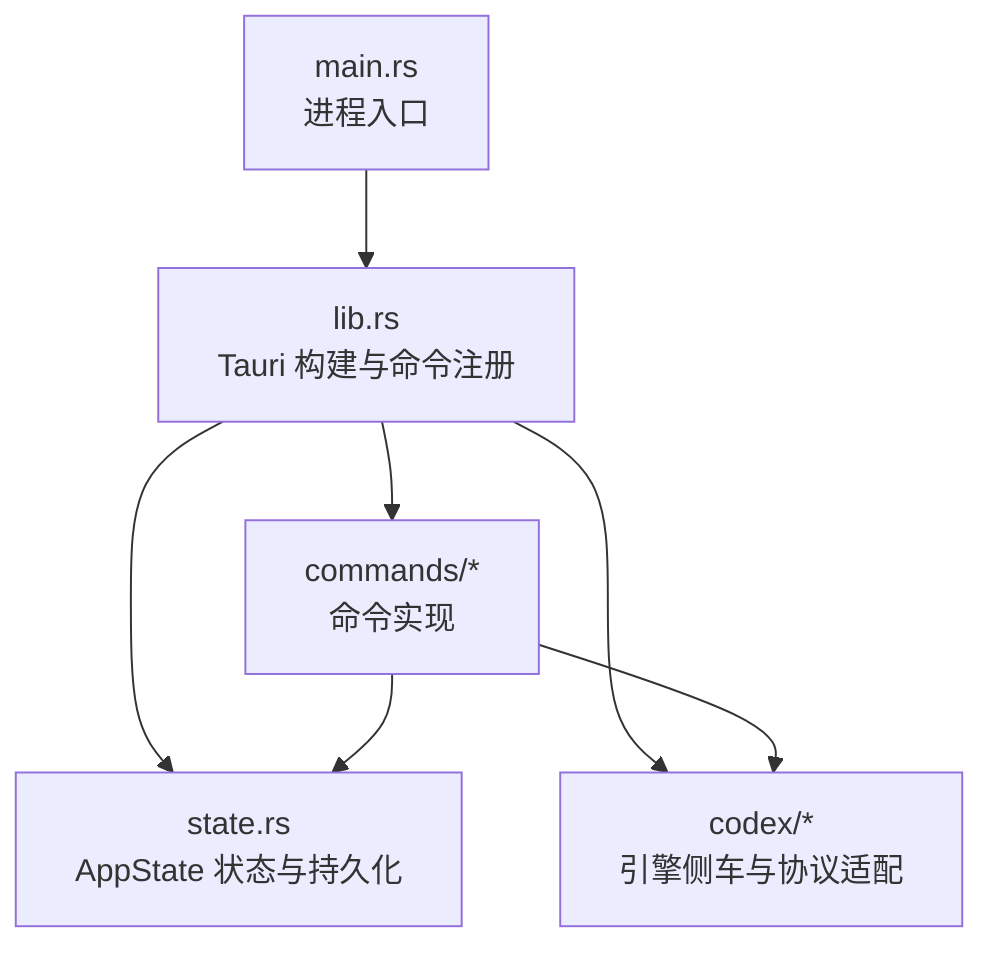
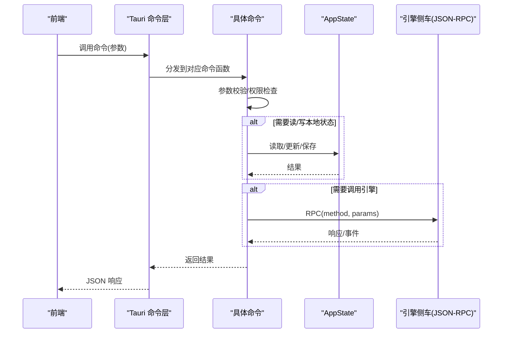
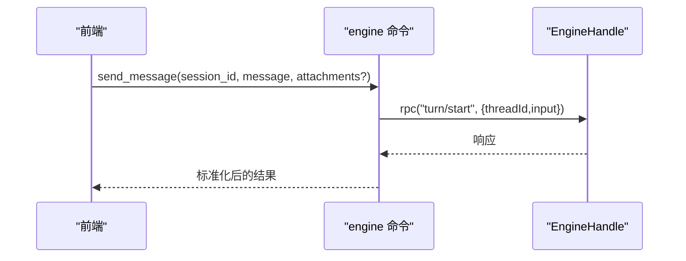
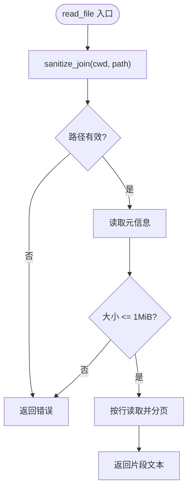
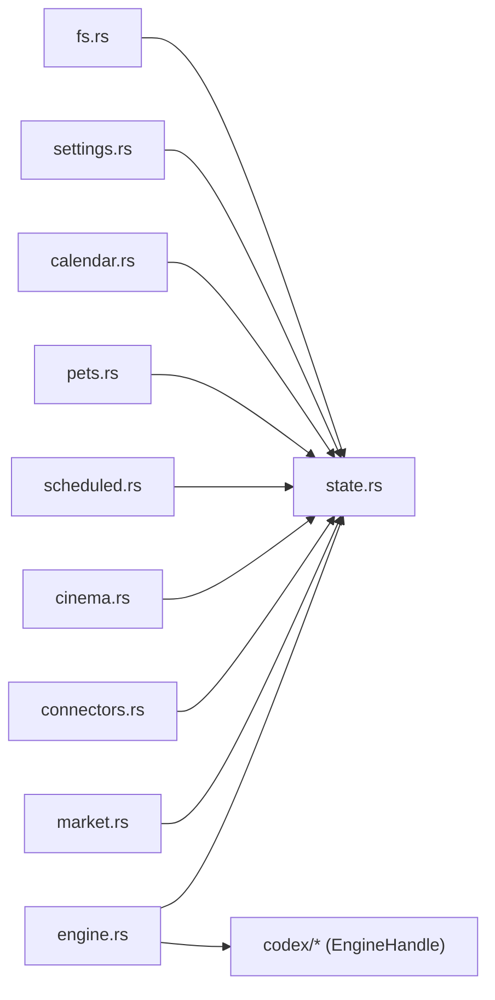

# 命令处理系统

<cite>
**本文引用的文件**
- [src-tauri/src/lib.rs](file://src-tauri/src/lib.rs)
- [src-tauri/src/main.rs](file://src-tauri/src/main.rs)
- [src-tauri/Cargo.toml](file://src-tauri/Cargo.toml)
- [src-tauri/src/commands/mod.rs](file://src-tauri/src/commands/mod.rs)
- [src-tauri/src/commands/engine.rs](file://src-tauri/src/commands/engine.rs)
- [src-tauri/src/commands/fs.rs](file://src-tauri/src/commands/fs.rs)
- [src-tauri/src/commands/settings.rs](file://src-tauri/src/commands/settings.rs)
- [src-tauri/src/commands/calendar.rs](file://src-tauri/src/commands/calendar.rs)
- [src-tauri/src/commands/pets.rs](file://src-tauri/src/commands/pets.rs)
- [src-tauri/src/commands/scheduled.rs](file://src-tauri/src/commands/scheduled.rs)
- [src-tauri/src/commands/cinema.rs](file://src-tauri/src/commands/cinema.rs)
- [src-tauri/src/commands/connectors.rs](file://src-tauri/src/commands/connectors.rs)
- [src-tauri/src/commands/market.rs](file://src-tauri/src/commands/market.rs)
- [src-tauri/src/commands/app_state.rs](file://src-tauri/src/commands/app_state.rs)
- [src-tauri/src/state.rs](file://src-tauri/src/state.rs)
</cite>

## 目录
1. [简介](#简介)
2. [项目结构](#项目结构)
3. [核心组件](#核心组件)
4. [架构总览](#架构总览)
5. [详细组件分析](#详细组件分析)
6. [依赖关系分析](#依赖关系分析)
7. [性能考虑](#性能考虑)
8. [故障排查指南](#故障排查指南)
9. [结论](#结论)
10. [附录：命令调用示例与规范](#附录命令调用示例与规范)

## 简介
本文件面向 Tauri 命令处理系统，系统性说明前后端 IPC 通信机制（命令注册、参数校验、异步处理）、各类命令的实现架构（引擎命令、文件系统命令、设置命令、日历命令等），并给出错误处理策略、权限控制机制、性能优化建议。同时提供命令调用示例、参数规范、返回值格式，以及自定义命令开发指南与最佳实践。

## 项目结构
后端以 Tauri 应用为入口，通过 Builder 初始化插件、状态、菜单，并在 invoke_handler 中集中注册所有命令。命令模块按职责拆分到 commands 子模块，状态集中在 state.rs 的 AppState 中持久化到本地 JSON。

图表来源
- [src-tauri/src/main.rs:1-7](file://src-tauri/src/main.rs#L1-L7)
- [src-tauri/src/lib.rs:16-148](file://src-tauri/src/lib.rs#L16-L148)
- [src-tauri/src/commands/mod.rs:1-11](file://src-tauri/src/commands/mod.rs#L1-L11)
- [src-tauri/src/state.rs:150-231](file://src-tauri/src/state.rs#L150-L231)

章节来源
- [src-tauri/src/main.rs:1-7](file://src-tauri/src/main.rs#L1-L7)
- [src-tauri/src/lib.rs:16-148](file://src-tauri/src/lib.rs#L16-L148)
- [src-tauri/src/commands/mod.rs:1-11](file://src-tauri/src/commands/mod.rs#L1-L11)
- [src-tauri/src/state.rs:150-231](file://src-tauri/src/state.rs#L150-L231)

## 核心组件
- 命令注册中心：在 lib.rs 中通过 tauri::generate_handler! 将各命令函数暴露给前端。
- 状态管理：AppState 持有 UI 相关配置、宠物、日历、影院时间线、连接器、快捷方式、计划任务、PR 列表、Provider 密钥与路由信息；支持快照与原子写入 shell-state.json。
- 引擎桥接：engine 命令模块将前端请求转发至官方 codex-app-server JSON-RPC，封装会话、消息、工具、MCP、插件等能力。
- 文件系统命令：提供受限的文件浏览、读取、写入，包含路径穿越防护与大小限制。
- 其他领域命令：设置、日历、宠物、计划任务、影院、连接器、市场（插件）等。

章节来源
- [src-tauri/src/lib.rs:71-148](file://src-tauri/src/lib.rs#L71-L148)
- [src-tauri/src/state.rs:150-231](file://src-tauri/src/state.rs#L150-L231)
- [src-tauri/src/commands/engine.rs:13-20](file://src-tauri/src/commands/engine.rs#L13-L20)
- [src-tauri/src/commands/fs.rs:31-48](file://src-tauri/src/commands/fs.rs#L31-L48)

## 架构总览
Tauri 命令作为 IPC 边界，统一接收前端调用，进行参数校验、权限检查、业务处理，必要时访问本地状态或调用引擎侧车。状态变更通过 AppState.save() 原子落盘。

图表来源
- [src-tauri/src/lib.rs:71-148](file://src-tauri/src/lib.rs#L71-L148)
- [src-tauri/src/commands/engine.rs:13-20](file://src-tauri/src/commands/engine.rs#L13-L20)
- [src-tauri/src/state.rs:209-217](file://src-tauri/src/state.rs#L209-L217)

## 详细组件分析

### 引擎命令（engine）
- 作用：将前端对会话、消息、工具、MCP、插件等的操作转发到官方 codex-app-server JSON-RPC。
- 关键模式：
  - 统一 rpc 包装器：将方法名与参数转换为 JSON-RPC 调用。
  - 会话生命周期：new_session、list_sessions、get_session、delete_session、archive/unarchive。
  - 消息流：send_message、interrupt_session、resolve_approval、respond_server_request。
  - Provider/MCP/插件：list/save/probe、MCP 状态与开关、插件启用/禁用。
  - Shell：open/write/read/close_shell，基于 command/exec 的 TTY 交互。
- 错误处理：未知/可选端点返回结构化错误，UI 可降级展示；网络探测不抛错，而是返回 ok:false + error/hint。

图表来源
- [src-tauri/src/commands/engine.rs:102-127](file://src-tauri/src/commands/engine.rs#L102-L127)
- [src-tauri/src/commands/engine.rs:13-20](file://src-tauri/src/commands/engine.rs#L13-L20)

章节来源
- [src-tauri/src/commands/engine.rs:22-183](file://src-tauri/src/commands/engine.rs#L22-L183)
- [src-tauri/src/commands/engine.rs:185-404](file://src-tauri/src/commands/engine.rs#L185-L404)
- [src-tauri/src/commands/engine.rs:406-558](file://src-tauri/src/commands/engine.rs#L406-L558)
- [src-tauri/src/commands/engine.rs:560-693](file://src-tauri/src/commands/engine.rs#L560-L693)
- [src-tauri/src/commands/engine.rs:695-799](file://src-tauri/src/commands/engine.rs#L695-L799)

### 文件系统命令（fs）
- 作用：安全地列出、读取、写入工作区文件。
- 安全策略：
  - sanitize_join 拒绝 .. 路径穿越，并确保最终路径仍在根目录下。
  - 忽略隐藏文件和常见构建/依赖目录。
  - 读取上限 MAX_READ_BYTES 防止大文件导致内存压力。
- 数据模型：FileEntry 包含 name、path、absPath、isDirectory、ext。

图表来源
- [src-tauri/src/commands/fs.rs:31-48](file://src-tauri/src/commands/fs.rs#L31-L48)
- [src-tauri/src/commands/fs.rs:101-121](file://src-tauri/src/commands/fs.rs#L101-L121)

章节来源
- [src-tauri/src/commands/fs.rs:1-132](file://src-tauri/src/commands/fs.rs#L1-L132)

### 设置命令（settings）
- 作用：读写应用设置、偏好、快捷键；切换活跃 Provider 时同步协议适配器。
- 关键点：save_settings 会尝试更新 AdapterState 的 active provider，保证运行时生效。

章节来源
- [src-tauri/src/commands/settings.rs:1-69](file://src-tauri/src/commands/settings.rs#L1-L69)
- [src-tauri/src/state.rs:27-64](file://src-tauri/src/state.rs#L27-L64)

### 日历命令（calendar）
- 作用：增删改查本地日历事件；保存后原子落盘。
- 数据结构：CalendarEvent（id、title、starts_at、ends_at、notes）。

章节来源
- [src-tauri/src/commands/calendar.rs:1-33](file://src-tauri/src/commands/calendar.rs#L1-L33)
- [src-tauri/src/state.rs:79-89](file://src-tauri/src/state.rs#L79-L89)

### 宠物命令（pets）
- 作用：管理宠物列表与状态（唤醒/收起/创建自定义）。
- 数据：Pet（id、name、kind、sprite、mood、custom）。

章节来源
- [src-tauri/src/commands/pets.rs:1-66](file://src-tauri/src/commands/pets.rs#L1-L66)
- [src-tauri/src/state.rs:66-77](file://src-tauri/src/state.rs#L66-L77)

### 计划任务与 PR（scheduled）
- 作用：维护本地计划任务与 PR 列表；run_scheduled_task 仅做本地触发（引擎无调度 API）。
- 默认任务：首次启动注入若干推荐任务。

章节来源
- [src-tauri/src/commands/scheduled.rs:1-66](file://src-tauri/src/commands/scheduled.rs#L1-L66)
- [src-tauri/src/state.rs:124-136](file://src-tauri/src/state.rs#L124-L136)
- [src-tauri/src/state.rs:302-330](file://src-tauri/src/state.rs#L302-L330)

### 影院时间线与作业（cinema）
- 作用：管理时间线、渲染作业队列与取消。
- 数据：CinemaTimeline、CinemaJob。

章节来源
- [src-tauri/src/commands/cinema.rs:1-80](file://src-tauri/src/commands/cinema.rs#L1-L80)
- [src-tauri/src/state.rs:91-106](file://src-tauri/src/state.rs#L91-L106)

### 连接器（connectors）
- 作用：CRUD 连接器配置；test_connector 为占位探测。
- 数据：Connector（id、name、kind、config）。

章节来源
- [src-tauri/src/commands/connectors.rs:1-53](file://src-tauri/src/commands/connectors.rs#L1-L53)
- [src-tauri/src/state.rs:108-115](file://src-tauri/src/state.rs#L108-L115)

### 插件市场（market）
- 作用：添加/移除市场源、浏览插件、安装/卸载、启用/禁用；生成个人市场清单。
- 特性：
  - 支持 GitHub 简写、Git URL、本地目录三种来源。
  - 克隆仓库到 sources，安装复制到 installed，并同步 personal marketplace 清单。
  - 扫描 SKILL.md 前元数据，提取技能信息。
  - logo 小图转 data URL 减少额外文件访问。

章节来源
- [src-tauri/src/commands/market.rs:1-800](file://src-tauri/src/commands/market.rs#L1-L800)

### 应用状态与依赖检查（app_state）
- get_state：返回当前快照。
- check_dependencies：检查 Tauri 壳、引擎连接、ripgrep 是否可用。

章节来源
- [src-tauri/src/commands/app_state.rs:1-62](file://src-tauri/src/commands/app_state.rs#L1-L62)

## 依赖关系分析
- 命令模块均依赖 state.rs 中的 AppState 进行状态读写。
- engine 命令依赖 codex 模块提供的 EngineHandle 与协议常量。
- 市场命令依赖 git 客户端执行 clone，并使用 chrono、base64 等库。
- Cargo.toml 声明了 Tauri 及其插件、tokio、reqwest、serde 等依赖。

图表来源
- [src-tauri/src/commands/fs.rs:1-132](file://src-tauri/src/commands/fs.rs#L1-L132)
- [src-tauri/src/commands/engine.rs:1-20](file://src-tauri/src/commands/engine.rs#L1-L20)
- [src-tauri/src/state.rs:150-231](file://src-tauri/src/state.rs#L150-L231)

章节来源
- [src-tauri/Cargo.toml:17-50](file://src-tauri/Cargo.toml#L17-L50)
- [src-tauri/src/commands/engine.rs:1-20](file://src-tauri/src/commands/engine.rs#L1-L20)

## 性能考虑
- 状态持久化：AppState.save 使用临时文件+rename 原子写入，避免损坏。
- 文件读取：限制最大读取大小并按行分页，降低内存占用。
- 网络探测：provider probe 使用超时与多候选端点，失败不抛错，返回结构化提示。
- Shell 交互：open_shell 可能返回带 note 的部分成功，以便 UI 继续 write/close。
- 插件安装：git clone 设置超时与深度克隆，避免长时间阻塞。

[本节为通用指导，无需特定文件引用]

## 故障排查指南
- 引擎未连接：check_dependencies 会报告 codex-app-server 未连接；需安装侧车二进制。
- Provider 探测失败：probe_provider 返回 ok:false 与 hint，检查 Base URL、协议与 API Key。
- 文件路径非法：fs 命令会拒绝路径穿越与越界路径。
- 状态锁竞争：AppState.inner 使用 Mutex，若获取失败会返回错误字符串。
- 插件市场源无效：marketplace 缺少 catalog 或无法解析时会报错。

章节来源
- [src-tauri/src/commands/app_state.rs:17-61](file://src-tauri/src/commands/app_state.rs#L17-L61)
- [src-tauri/src/commands/engine.rs:416-521](file://src-tauri/src/commands/engine.rs#L416-L521)
- [src-tauri/src/commands/fs.rs:31-48](file://src-tauri/src/commands/fs.rs#L31-L48)
- [src-tauri/src/state.rs:209-217](file://src-tauri/src/state.rs#L209-L217)
- [src-tauri/src/commands/market.rs:479-517](file://src-tauri/src/commands/market.rs#L479-L517)

## 结论
该命令处理系统以 Tauri 命令为统一 IPC 边界，结合 AppState 的集中状态管理与引擎侧车的远程能力，实现了前后端解耦、可扩展的命令体系。通过严格的路径与大小限制、原子落盘、结构化错误与探测反馈，系统在安全性、可靠性与可维护性方面具备良好基础。后续可按相同模式扩展新命令。

[本节为总结，无需特定文件引用]

## 附录：命令调用示例与规范

### 通用约定
- 调用方式：前端通过 Tauri invoke 调用已注册的命令名。
- 参数：JSON 对象，字段名与类型见各命令描述。
- 返回值：Result<Value/String> 或具体类型，错误以字符串形式返回。
- 异步：engine 相关命令多为 async；其他命令可为同步。

### 引擎命令示例
- new_session
  - 参数：{ project_path?: string }
  - 返回：会话扁平化对象，含 threadStart 完整负载
- send_message
  - 参数：{ session_id: string, message: string, attachments?: any[] }
  - 返回：turn/start 响应
- resolve_approval
  - 参数：{ request_id: any, approved: boolean, kind?: string, session_scope?: boolean }
  - 返回：空
- list_providers / save_provider / probe_provider
  - 参数：参见命令定义
  - 返回：providers 列表、保存结果、探测结果（ok/models/error/hint）
- open_shell / write_shell / read_shell / close_shell
  - 参数：processId/sessionId、shell、cwd 等
  - 返回：TTY 过程信息与输出通知

章节来源
- [src-tauri/src/commands/engine.rs:30-183](file://src-tauri/src/commands/engine.rs#L30-L183)
- [src-tauri/src/commands/engine.rs:185-404](file://src-tauri/src/commands/engine.rs#L185-L404)
- [src-tauri/src/commands/engine.rs:406-558](file://src-tauri/src/commands/engine.rs#L406-L558)
- [src-tauri/src/commands/engine.rs:695-799](file://src-tauri/src/commands/engine.rs#L695-L799)

### 文件系统命令示例
- list_files
  - 参数：{ cwd: string, dir: string }
  - 返回：FileEntry[]
- read_file
  - 参数：{ cwd: string, path: string, offset?: number, limit?: number }
  - 返回：字符串片段
- write_file
  - 参数：{ cwd: string, path: string, content: string }
  - 返回：空

章节来源
- [src-tauri/src/commands/fs.rs:50-132](file://src-tauri/src/commands/fs.rs#L50-L132)

### 设置命令示例
- get_settings / save_settings
  - 参数：Settings 对象
  - 返回：Settings 或空
- get_preferences / save_preferences
  - 参数：Preferences 对象
  - 返回：Preferences 或空
- list_shortcuts / save_shortcuts
  - 参数：Shortcut[]
  - 返回：Shortcut[] 或空

章节来源
- [src-tauri/src/commands/settings.rs:8-69](file://src-tauri/src/commands/settings.rs#L8-L69)

### 日历命令示例
- list_calendar_events
  - 返回：CalendarEvent[]
- save_calendar_event
  - 参数：CalendarEvent
  - 返回：空
- delete_calendar_event
  - 参数：{ id: string }
  - 返回：空

章节来源
- [src-tauri/src/commands/calendar.rs:4-33](file://src-tauri/src/commands/calendar.rs#L4-L33)

### 自定义命令开发指南
- 步骤
  1) 在 commands 下新增模块，导出命令函数。
  2) 在 commands/mod.rs 中声明模块。
  3) 在 lib.rs 的 invoke_handler! 中注册命令。
  4) 如需持久化，使用 AppState 并调用 save()。
  5) 如需调用引擎，使用 engine.rs 中的 rpc 模式或直接调用 EngineHandle。
- 最佳实践
  - 参数校验：在命令入口处校验必填字段与格式。
  - 错误处理：返回明确的错误字符串，便于前端展示。
  - 安全：对路径、URL、外部输入进行白名单或范围校验。
  - 性能：避免阻塞主线程，I/O 与网络使用异步；限制资源大小。
  - 幂等：尽量设计幂等接口，便于重试。
  - 日志：使用 tracing 记录关键流程与异常。

章节来源
- [src-tauri/src/commands/mod.rs:1-11](file://src-tauri/src/commands/mod.rs#L1-L11)
- [src-tauri/src/lib.rs:71-148](file://src-tauri/src/lib.rs#L71-L148)
- [src-tauri/src/state.rs:209-217](file://src-tauri/src/state.rs#L209-L217)
- [src-tauri/src/commands/engine.rs:13-20](file://src-tauri/src/commands/engine.rs#L13-L20)