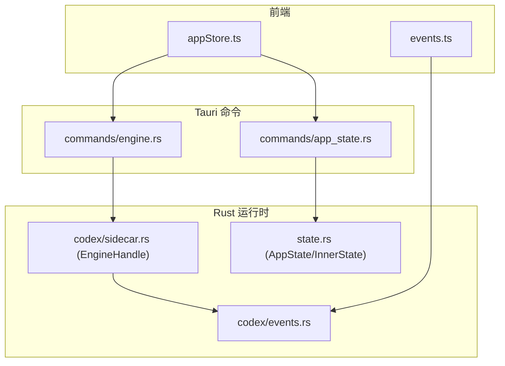
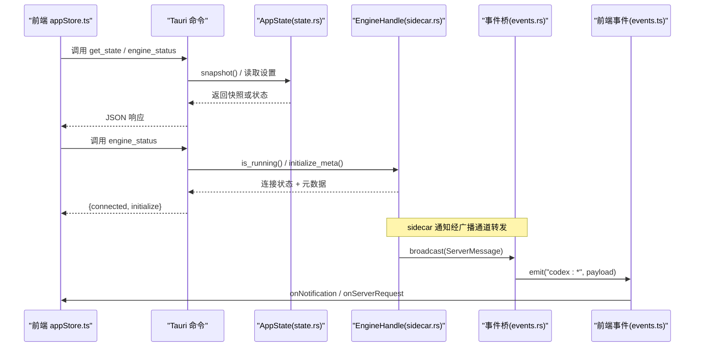
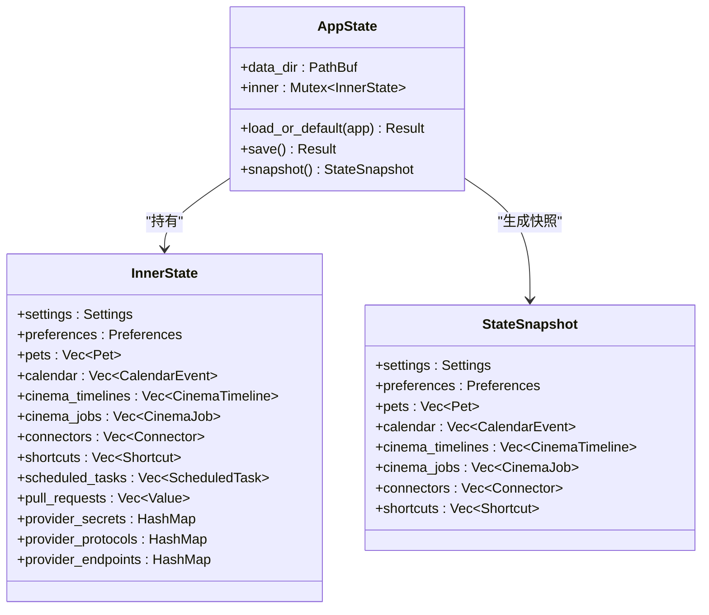
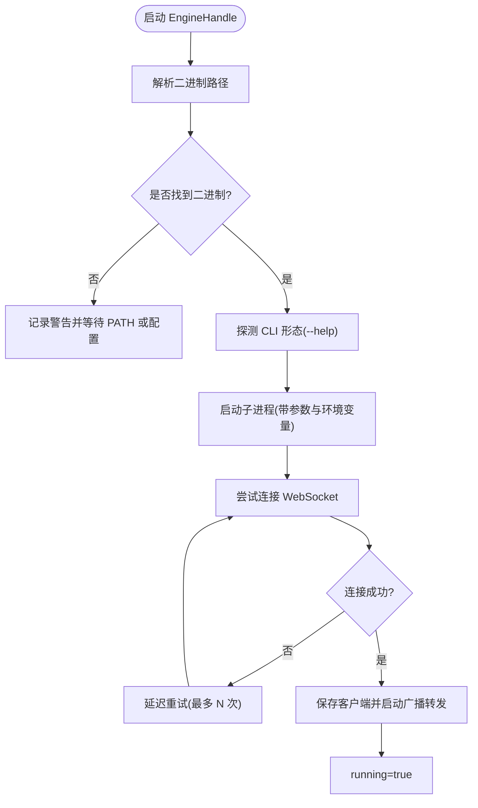
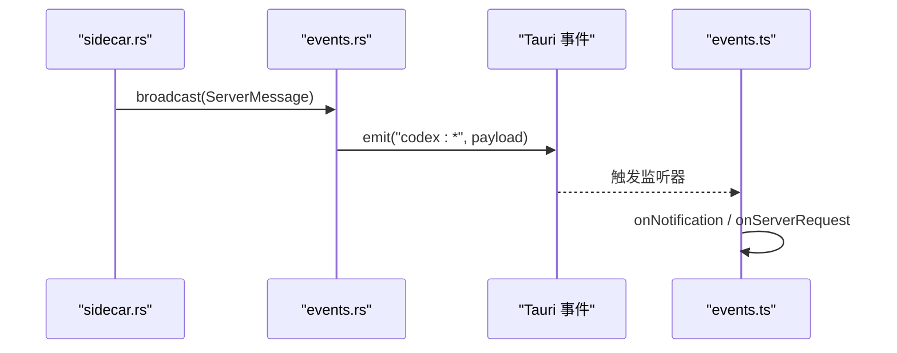
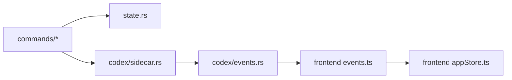

# 应用状态命令

<cite>
**本文引用的文件**
- [src-tauri/src/commands/app_state.rs](file://src-tauri/src/commands/app_state.rs)
- [src-tauri/src/state.rs](file://src-tauri/src/state.rs)
- [src-tauri/src/codex/sidecar.rs](file://src-tauri/src/codex/sidecar.rs)
- [src-tauri/src/codex/events.rs](file://src-tauri/src/codex/events.rs)
- [src-tauri/src/commands/engine.rs](file://src-tauri/src/commands/engine.rs)
- [frontend/app/state/appStore.ts](file://frontend/app/state/appStore.ts)
- [frontend/app/bridge/events.ts](file://frontend/app/bridge/events.ts)
- [frontend/app/devbridge/shellState.ts](file://frontend/app/devbridge/shellState.ts)
</cite>

## 目录
1. [简介](#简介)
2. [项目结构](#项目结构)
3. [核心组件](#核心组件)
4. [架构总览](#架构总览)
5. [详细组件分析](#详细组件分析)
6. [依赖关系分析](#依赖关系分析)
7. [性能考量](#性能考量)
8. [故障排查指南](#故障排查指南)
9. [结论](#结论)
10. [附录](#附录)

## 简介
本模块聚焦“应用状态命令”，围绕应用运行状态的获取与管理，涵盖：
- 状态快照与持久化（本地 shell 状态）
- 引擎连接与健康检查（sidecar 进程、RPC 客户端、通知通道）
- 事件桥接与前端监听（通知与服务器请求）
- 配置与提供者信息同步（协议、端点、密钥注入）
- 诊断与可观测性（依赖检查、状态查询）

该模块通过 Tauri 命令暴露能力，Rust 侧维护 AppState 与 EngineHandle，前端通过 store 与事件总线消费状态与事件。

## 项目结构
- Rust 后端
  - 命令层：app_state.rs、engine.rs 等
  - 状态层：state.rs（AppState、InnerState、序列化格式）
  - 引擎层：codex/sidecar.rs（子进程管理、连接重试、广播事件）
  - 事件桥：codex/events.rs（将 sidecar 通知转发为 Tauri 事件）
- 前端
  - 状态存储：appStore.ts（会话、提供者、设置、引擎状态）
  - 事件桥：events.ts（订阅通知与服务器请求）
  - 开发镜像：shellState.ts（浏览器模式下的 shell-state 镜像）

图表来源
- [src-tauri/src/commands/app_state.rs:5-8](file://src-tauri/src/commands/app_state.rs#L5-L8)
- [src-tauri/src/commands/engine.rs:22-28](file://src-tauri/src/commands/engine.rs#L22-L28)
- [src-tauri/src/state.rs:150-231](file://src-tauri/src/state.rs#L150-L231)
- [src-tauri/src/codex/sidecar.rs:22-139](file://src-tauri/src/codex/sidecar.rs#L22-L139)
- [src-tauri/src/codex/events.rs:12-43](file://src-tauri/src/codex/events.rs#L12-L43)
- [frontend/app/state/appStore.ts:374-408](file://frontend/app/state/appStore.ts#L374-L408)
- [frontend/app/bridge/events.ts:145-159](file://frontend/app/bridge/events.ts#L145-L159)

章节来源
- [src-tauri/src/commands/app_state.rs:1-62](file://src-tauri/src/commands/app_state.rs#L1-L62)
- [src-tauri/src/state.rs:1-331](file://src-tauri/src/state.rs#L1-L331)
- [src-tauri/src/codex/sidecar.rs:1-540](file://src-tauri/src/codex/sidecar.rs#L1-L540)
- [src-tauri/src/codex/events.rs:1-82](file://src-tauri/src/codex/events.rs#L1-L82)
- [src-tauri/src/commands/engine.rs:1-800](file://src-tauri/src/commands/engine.rs#L1-L800)
- [frontend/app/state/appStore.ts:1-519](file://frontend/app/state/appStore.ts#L1-L519)
- [frontend/app/bridge/events.ts:41-171](file://frontend/app/bridge/events.ts#L41-L171)
- [frontend/app/devbridge/shellState.ts:1-147](file://frontend/app/devbridge/shellState.ts#L1-L147)

## 核心组件
- 应用状态快照与持久化
  - 提供 get_state 命令返回当前快照；内部使用 Mutex 保护 InnerState，避免并发读写冲突。
  - 持久化采用原子写入（先写临时文件再 rename），确保崩溃不损坏数据。
- 引擎健康与依赖检查
  - check_dependencies 报告 tauri-shell、codex-app-server 连接状态、ripgrep 可选依赖。
  - engine_status 暴露 connected 与 initialize 元数据，供前端展示引擎连通性与初始化结果。
- 事件桥接
  - events.rs 在启动时订阅 EngineHandle 的广播通道，将 sidecar 通知映射为 codex:* 事件，并处理 lagged/dropped 情况。
- 前端状态与事件消费
  - appStore.ts 负责拉取会话、提供者、设置，并维护 engineStatus。
  - events.ts 统一订阅通知与服务器请求，提供 onNotification/onServerRequest 回调注册。

章节来源
- [src-tauri/src/commands/app_state.rs:5-21](file://src-tauri/src/commands/app_state.rs#L5-L21)
- [src-tauri/src/state.rs:176-231](file://src-tauri/src/state.rs#L176-L231)
- [src-tauri/src/commands/engine.rs:22-28](file://src-tauri/src/commands/engine.rs#L22-L28)
- [src-tauri/src/codex/events.rs:12-43](file://src-tauri/src/codex/events.rs#L12-L43)
- [frontend/app/state/appStore.ts:374-408](file://frontend/app/state/appStore.ts#L374-L408)
- [frontend/app/bridge/events.ts:57-87](file://frontend/app/bridge/events.ts#L57-L87)

## 架构总览
整体流程：前端调用 Tauri 命令 → Rust 命令层访问 AppState/EngineHandle → 必要时与 sidecar 通信 → 通过广播通道将通知推送到前端事件系统 → 前端 store/事件处理器更新 UI。

图表来源
- [src-tauri/src/commands/app_state.rs:5-8](file://src-tauri/src/commands/app_state.rs#L5-L8)
- [src-tauri/src/commands/engine.rs:22-28](file://src-tauri/src/commands/engine.rs#L22-L28)
- [src-tauri/src/state.rs:219-231](file://src-tauri/src/state.rs#L219-L231)
- [src-tauri/src/codex/sidecar.rs:136-168](file://src-tauri/src/codex/sidecar.rs#L136-L168)
- [src-tauri/src/codex/events.rs:12-43](file://src-tauri/src/codex/events.rs#L12-L43)
- [frontend/app/bridge/events.ts:145-159](file://frontend/app/bridge/events.ts#L145-L159)

## 详细组件分析

### 应用状态快照与持久化（AppState）
- 数据结构
  - Settings、Preferences、Pet、CalendarEvent、CinemaTimeline、CinemaJob、Connector、Shortcut、ScheduledTask 等构成完整 Shell 状态集合。
  - InnerState 持有所有可变状态，并通过 Mutex 保证线程安全。
  - StateSnapshot 是对外只读视图，用于命令返回。
- 加载与默认值
  - load_or_default 从配置目录读取 shell-state.json，缺失则填充默认主题、语言、监听地址与示例任务。
- 保存策略
  - save 使用“先写临时文件再原子重命名”的策略，避免部分写入导致的状态损坏。
- 快照生成
  - snapshot 克隆各字段形成不可变快照，避免后续修改影响已返回的数据。

图表来源
- [src-tauri/src/state.rs:138-174](file://src-tauri/src/state.rs#L138-L174)
- [src-tauri/src/state.rs:176-231](file://src-tauri/src/state.rs#L176-L231)

章节来源
- [src-tauri/src/state.rs:27-174](file://src-tauri/src/state.rs#L27-L174)
- [src-tauri/src/state.rs:176-231](file://src-tauri/src/state.rs#L176-L231)
- [src-tauri/src/state.rs:234-300](file://src-tauri/src/state.rs#L234-L300)

### 引擎连接与健康检查（EngineHandle）
- 子进程管理
  - start 解析二进制路径，按多入口或独立可执行两种形态启动，注入 provider 环境变量，隐藏控制台窗口（Windows）。
- 连接与重试
  - connect_with_retry 在 sidecar 刚启动时进行有限次重试，避免首次 RPC 因端口未就绪失败。
- 事件广播
  - store_client 将客户端的广播转发到稳定的 EngineHandle 广播通道，供事件桥订阅。
- 健康检查
  - is_running 综合进程存活与客户端连接状态；initialize_meta 返回上次握手元数据。
  - shutdown 关闭客户端并终止子进程。

图表来源
- [src-tauri/src/codex/sidecar.rs:31-125](file://src-tauri/src/codex/sidecar.rs#L31-L125)
- [src-tauri/src/codex/sidecar.rs:188-222](file://src-tauri/src/codex/sidecar.rs#L188-L222)
- [src-tauri/src/codex/sidecar.rs:224-275](file://src-tauri/src/codex/sidecar.rs#L224-L275)

章节来源
- [src-tauri/src/codex/sidecar.rs:22-139](file://src-tauri/src/codex/sidecar.rs#L22-L139)
- [src-tauri/src/codex/sidecar.rs:188-275](file://src-tauri/src/codex/sidecar.rs#L188-L275)

### 事件桥接与前端监听
- 后端事件桥
  - spawn_event_bridge 在启动后订阅 EngineHandle 的广播，将 ServerMessage 映射为 codex:* 事件并 emit。
  - 对 lagged 接收者会记录跳过数量，避免阻塞。
- 前端事件桥
  - startEventBridge 绑定通知与两类服务器请求通道（approval、user-input）。
  - onNotification/onServerRequest 提供统一的回调注册与错误隔离。

图表来源
- [src-tauri/src/codex/events.rs:12-43](file://src-tauri/src/codex/events.rs#L12-L43)
- [frontend/app/bridge/events.ts:145-159](file://frontend/app/bridge/events.ts#L145-L159)

章节来源
- [src-tauri/src/codex/events.rs:1-82](file://src-tauri/src/codex/events.rs#L1-L82)
- [frontend/app/bridge/events.ts:41-171](file://frontend/app/bridge/events.ts#L41-L171)

### 状态命令与引擎命令
- 应用状态命令
  - get_state：返回 AppState 快照。
  - check_dependencies：输出 tauri-shell、codex-app-server、ripgrep 的可用性。
- 引擎命令
  - engine_status：返回 connected 与 initialize 元数据。
  - list_sessions/get_session/delete_session/archive_session/unarchive_session：会话生命周期管理。
  - send_message/interrupt_session：对话控制。
  - resolve_approval/respond_server_request：处理服务器→客户端请求。
  - list_providers/save_provider/probe_provider：提供者管理与连通性探测。
  - open_shell/write_shell/read_shell/close_shell：命令执行与流式输出。
  - list_mcp_servers/test_mcp_connection/set_mcp_server_enabled：MCP 服务管理。
  - list_skills/reload_skills/list_plugins/set_plugin_enabled：技能与插件管理。

章节来源
- [src-tauri/src/commands/app_state.rs:5-61](file://src-tauri/src/commands/app_state.rs#L5-L61)
- [src-tauri/src/commands/engine.rs:22-800](file://src-tauri/src/commands/engine.rs#L22-L800)

### 前端状态与事件消费
- 状态存储（appStore.ts）
  - refreshAppState 并行拉取会话、提供者、设置，归一化后提交到 store。
  - setEngineStatus 更新引擎状态，驱动空态与提示。
  - saveSettings 双写：shell-state.json 与 engine config.toml（batchWrite）。
- 事件消费（events.ts）
  - 启动时绑定通知与服务器请求通道，提供 onNotification/onServerRequest 回调。
  - 对未知方法发出告警，保障可扩展性。

章节来源
- [frontend/app/state/appStore.ts:374-511](file://frontend/app/state/appStore.ts#L374-L511)
- [frontend/app/bridge/events.ts:57-87](file://frontend/app/bridge/events.ts#L57-L87)
- [frontend/app/bridge/events.ts:115-159](file://frontend/app/bridge/events.ts#L115-L159)

## 依赖关系分析
- 组件耦合
  - commands 依赖 state 与 codex；state 被多个命令共享；events 依赖 codex 的广播通道。
- 外部依赖
  - sidecar 二进制（codex-app-server）通过环境变量、配置项、资源目录等多路径解析。
  - 网络：WebSocket 连接至 sidecar；HTTP 探针用于 provider 连通性检测。
- 潜在循环
  - 无直接循环依赖；事件流向单向：sidecar → events → frontend。

图表来源
- [src-tauri/src/commands/mod.rs:1-11](file://src-tauri/src/commands/mod.rs#L1-L11)
- [src-tauri/src/codex/mod.rs:1-9](file://src-tauri/src/codex/mod.rs#L1-L9)

章节来源
- [src-tauri/src/commands/mod.rs:1-11](file://src-tauri/src/commands/mod.rs#L1-L11)
- [src-tauri/src/codex/mod.rs:1-9](file://src-tauri/src/codex/mod.rs#L1-L9)

## 性能考量
- 状态快照
  - snapshot 使用 clone 创建不可变视图，适合高频读取但可能带来内存拷贝开销；建议仅在需要跨线程传递或长期缓存时使用。
- 持久化写入
  - 原子写入避免损坏，但频繁保存会增加磁盘 IO；建议合并写操作或使用节流策略。
- 事件广播
  - broadcast 通道容量有限，lagged 时会丢弃消息；前端应尽快消费，避免堆积。
- 连接重试
  - connect_with_retry 限制最大次数与间隔，避免长时间阻塞；建议在冷启动时优先显示“连接中”状态。
- HTTP 探针
  - probe_provider 使用短超时与候选端点列表，减少无效请求；失败时返回结构化错误便于 UI 降级。

[本节为通用性能指导，不直接分析具体文件]

## 故障排查指南
- 无法连接引擎
  - 检查 check_dependencies 输出中 codex-app-server 是否为 connected。
  - 查看 sidecar 日志与二进制解析路径；确认 CODEX_APP_SERVER 或 settings.app_server_binary 指向有效文件。
- 事件丢失
  - 关注 events.rs 中的 lagged 日志；确认前端事件桥已启动且及时消费。
- 提供者连通性失败
  - 使用 probe_provider 返回的 error/hint 定位问题（如 401/404、Base URL 格式）。
- 状态未持久化
  - 检查 shell-state.json 所在目录权限；确认 save 调用是否成功。

章节来源
- [src-tauri/src/commands/app_state.rs:17-61](file://src-tauri/src/commands/app_state.rs#L17-L61)
- [src-tauri/src/codex/sidecar.rs:188-222](file://src-tauri/src/codex/sidecar.rs#L188-L222)
- [src-tauri/src/codex/events.rs:33-39](file://src-tauri/src/codex/events.rs#L33-L39)
- [src-tauri/src/commands/engine.rs:416-521](file://src-tauri/src/commands/engine.rs#L416-L521)

## 结论
本模块以 AppState 为中心，结合 EngineHandle 与事件桥，实现了稳定可靠的应用状态获取、引擎健康检查与前后端事件联动。通过原子持久化、连接重试与结构化错误反馈，提供了良好的可观测性与容错能力。前端通过统一的事件接口与 store 管理，简化了状态消费与 UI 更新。

[本节为总结性内容，不直接分析具体文件]

## 附录

### 状态序列化格式与传输优化
- 序列化格式
  - shell-state.json 包含 settings、preferences、pets、calendar、cinema_*、connectors、shortcuts、scheduled_tasks、pull_requests、provider_secrets、provider_protocols、provider_endpoints 等字段。
  - 前端 devbridge 镜像保持相同结构，便于浏览器开发调试。
- 传输优化
  - 事件桥仅转发必要字段；对于大对象（如 turn 内容）建议使用增量通知与分页。
  - 探针请求使用短超时与候选端点列表，减少无效往返。

章节来源
- [src-tauri/src/state.rs:234-300](file://src-tauri/src/state.rs#L234-L300)
- [frontend/app/devbridge/shellState.ts:26-98](file://frontend/app/devbridge/shellState.ts#L26-L98)
- [src-tauri/src/commands/engine.rs:416-521](file://src-tauri/src/commands/engine.rs#L416-L521)

### 状态监控示例与工具使用方法
- 获取状态快照
  - 调用 get_state 命令，获得当前 Shell 状态快照。
- 检查依赖与引擎状态
  - 调用 check_dependencies 与 engine_status，观察 tauri-shell、codex-app-server 连接与初始化元数据。
- 订阅事件
  - 在前端调用 startEventBridge，并使用 onNotification/onServerRequest 监听通知与请求。
- 提供者连通性测试
  - 使用 probe_provider，传入 base_url、protocol、api_key 等参数，查看 models 列表与错误提示。

章节来源
- [src-tauri/src/commands/app_state.rs:5-61](file://src-tauri/src/commands/app_state.rs#L5-L61)
- [src-tauri/src/commands/engine.rs:22-28](file://src-tauri/src/commands/engine.rs#L22-L28)
- [frontend/app/bridge/events.ts:145-159](file://frontend/app/bridge/events.ts#L145-L159)
- [src-tauri/src/commands/engine.rs:416-521](file://src-tauri/src/commands/engine.rs#L416-L521)