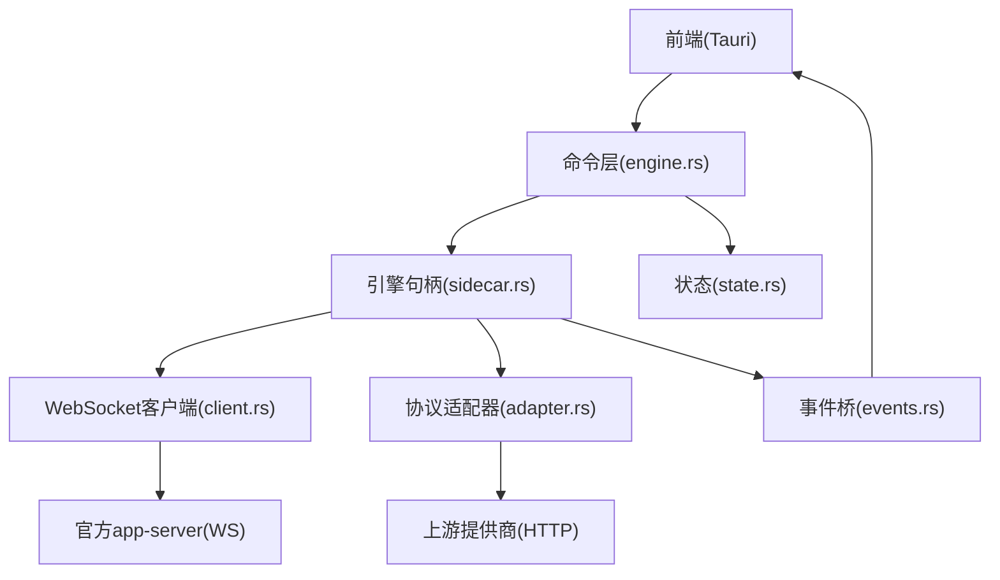
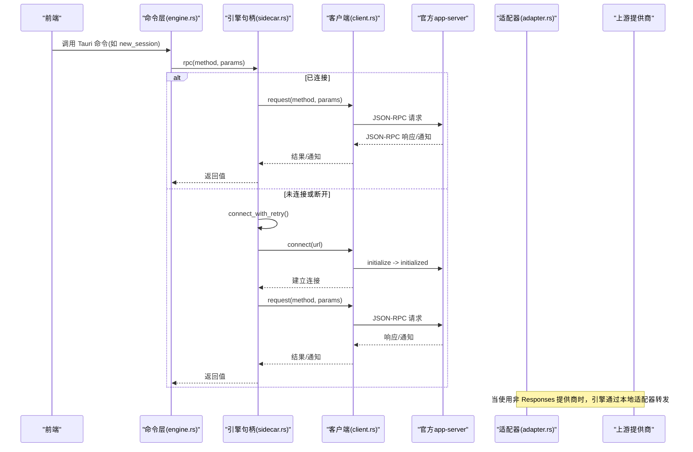
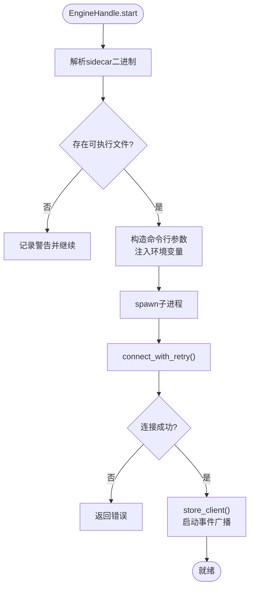
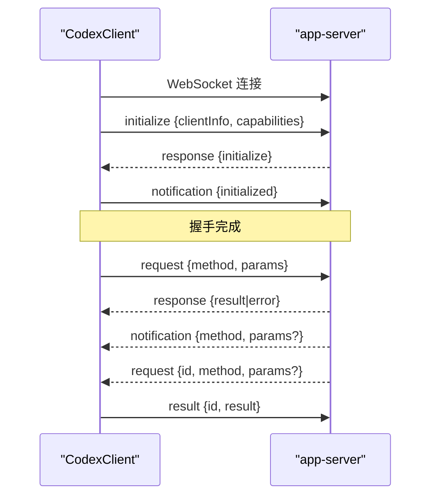
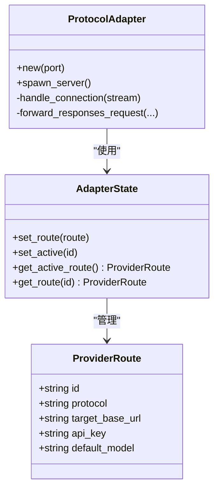
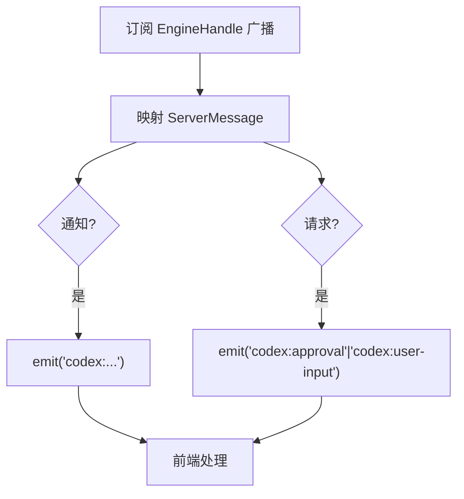
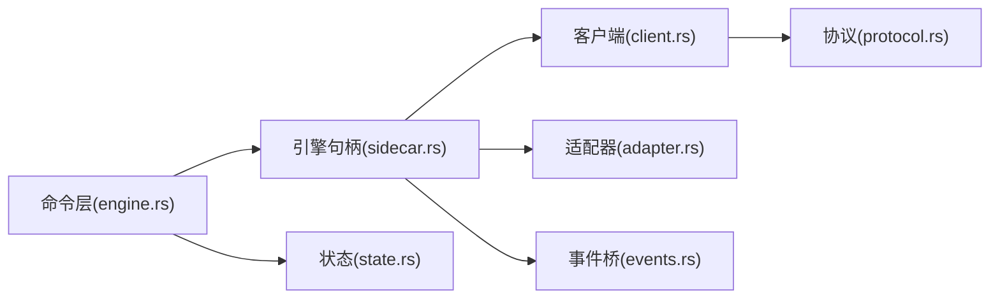

# 引擎命令

<cite>
**本文引用的文件**
- [engine.rs](file://src-tauri/src/commands/engine.rs)
- [sidecar.rs](file://src-tauri/src/codex/sidecar.rs)
- [client.rs](file://src-tauri/src/codex/client.rs)
- [protocol.rs](file://src-tauri/src/codex/protocol.rs)
- [adapter.rs](file://src-tauri/src/codex/adapter.rs)
- [events.rs](file://src-tauri/src/codex/events.rs)
- [state.rs](file://src-tauri/src/state.rs)
- [lib.rs](file://src-tauri/src/lib.rs)
</cite>

## 目录
1. [简介](#简介)
2. [项目结构](#项目结构)
3. [核心组件](#核心组件)
4. [架构总览](#架构总览)
5. [详细组件分析](#详细组件分析)
6. [依赖关系分析](#依赖关系分析)
7. [性能与可靠性](#性能与可靠性)
8. [故障排查指南](#故障排查指南)
9. [结论](#结论)
10. [附录：命令参考与示例](#附录命令参考与示例)

## 简介
本模块负责“引擎命令”的对外暴露与编排，核心职责包括：
- 管理官方 Codex app-server sidecar 的生命周期（启动、连接、停止）
- 维护 WebSocket JSON-RPC 客户端，完成握手、请求/响应、通知广播
- 将前端 Tauri 命令转发到 engine RPC，并处理会话、消息、审批等流程
- 提供协议适配器，将第三方模型提供商（OpenAI Chat、Anthropic、Ollama）适配为引擎期望的 Responses 协议
- 将引擎侧通知桥接到前端事件通道，实现 UI 实时反馈
- 提供配置读写、MCP/插件/技能查询、Shell 执行等扩展能力

## 项目结构
围绕引擎命令的关键代码分布在以下位置：
- 命令层：Tauri 命令封装与参数映射（engine.rs）
- 引擎句柄：sidecar 进程管理与 RPC 客户端生命周期（sidecar.rs）
- 客户端：WebSocket JSON-RPC 通信、握手、超时、通知分发（client.rs）
- 协议定义：方法名常量、消息类型解析（protocol.rs）
- 协议适配器：本地 HTTP 服务，将 Responses 请求转译为上游协议（adapter.rs）
- 事件桥：将引擎通知转为前端事件（events.rs）
- 状态与配置：应用状态、Provider 密钥注入、默认监听地址（state.rs）
- 初始化入口：注册命令、启动适配器与引擎（lib.rs）

图表来源
- [lib.rs:23-69](file://src-tauri/src/lib.rs#L23-L69)
- [engine.rs:13-20](file://src-tauri/src/commands/engine.rs#L13-L20)
- [sidecar.rs:22-276](file://src-tauri/src/codex/sidecar.rs#L22-L276)
- [client.rs:37-199](file://src-tauri/src/codex/client.rs#L37-L199)
- [adapter.rs:68-220](file://src-tauri/src/codex/adapter.rs#L68-L220)
- [events.rs:11-43](file://src-tauri/src/codex/events.rs#L11-L43)

章节来源
- [lib.rs:23-69](file://src-tauri/src/lib.rs#L23-L69)
- [engine.rs:13-20](file://src-tauri/src/commands/engine.rs#L13-L20)

## 核心组件
- 引擎句柄 EngineHandle：封装 sidecar 进程、RPC 客户端、事件广播、连接重试、元数据缓存。
- WebSocket 客户端 CodexClient：实现 initialize/initialized 握手、请求/响应、通知广播、超时控制。
- 协议适配器 ProtocolAdapter：本地 HTTP 服务，接收 Responses 请求，转译为 OpenAI Chat / Anthropic / Ollama，并以 Responses SSE 流返回。
- 事件桥 events：订阅 EngineHandle 的通知，转换为前端 codex:* 事件。
- 命令层 engine.rs：将 Tauri 命令映射为 engine RPC 调用，处理会话、消息、审批、配置、MCP、插件、Shell 等。
- 状态 state.rs：保存 Provider 密钥、协议、端点；提供默认监听地址与二进制路径解析。

章节来源
- [sidecar.rs:22-276](file://src-tauri/src/codex/sidecar.rs#L22-L276)
- [client.rs:37-199](file://src-tauri/src/codex/client.rs#L37-L199)
- [adapter.rs:68-220](file://src-tauri/src/codex/adapter.rs#L68-L220)
- [events.rs:11-43](file://src-tauri/src/codex/events.rs#L11-L43)
- [engine.rs:22-800](file://src-tauri/src/commands/engine.rs#L22-L800)
- [state.rs:150-232](file://src-tauri/src/state.rs#L150-L232)

## 架构总览
系统采用“命令层 + 引擎句柄 + 客户端 + 适配器 + 事件桥”的分层架构：
- 命令层仅做参数转换与错误透传，保持薄封装
- 引擎句柄负责 sidecar 生命周期与连接复用
- 客户端专注 JSON-RPC 协议细节与超时
- 适配器屏蔽上游差异，统一以 Responses 协议与引擎交互
- 事件桥确保 UI 能实时收到引擎通知与请求

图表来源
- [sidecar.rs:188-244](file://src-tauri/src/codex/sidecar.rs#L188-L244)
- [client.rs:37-133](file://src-tauri/src/codex/client.rs#L37-L133)
- [adapter.rs:162-220](file://src-tauri/src/codex/adapter.rs#L162-L220)

## 详细组件分析

### 引擎句柄与 Sidecar 生命周期
- 启动流程
  - 读取设置中的监听地址，默认 ws://127.0.0.1:17457
  - 解析并安装 sidecar 二进制（支持多调用入口与独立可执行体），注入 Provider API Key 环境变量
  - 启动子进程，记录进程句柄
- 连接与重试
  - 首次 RPC 时尝试连接，带有限次数与间隔的重试，避免冷启动竞态
  - 成功后缓存客户端，并启动通知广播任务，将客户端通知转发到稳定通道
- 关闭流程
  - 关闭 WebSocket 客户端，终止 sidecar 进程，重置运行标志

图表来源
- [sidecar.rs:31-125](file://src-tauri/src/codex/sidecar.rs#L31-L125)
- [sidecar.rs:188-244](file://src-tauri/src/codex/sidecar.rs#L188-L244)
- [sidecar.rs:262-276](file://src-tauri/src/codex/sidecar.rs#L262-L276)

章节来源
- [sidecar.rs:31-125](file://src-tauri/src/codex/sidecar.rs#L31-L125)
- [sidecar.rs:188-244](file://src-tauri/src/codex/sidecar.rs#L188-L244)
- [sidecar.rs:262-276](file://src-tauri/src/codex/sidecar.rs#L262-L276)

### WebSocket 客户端与握手
- 握手协议
  - 连接后发送 initialize 请求，携带客户端标识与能力
  - 等待响应后发送 initialized 通知，完成握手
- 请求/响应
  - 每个请求分配唯一 id，维护 pending map，响应到达后完成对应 oneshot channel
  - 请求与初始化分别有超时控制
- 通知与请求
  - 服务器通知与服务器→客户端请求通过 broadcast 通道分发
  - 支持 respond(id, result) 回复服务器请求（如审批、用户输入）

图表来源
- [client.rs:37-133](file://src-tauri/src/codex/client.rs#L37-L133)
- [client.rs:148-199](file://src-tauri/src/codex/client.rs#L148-L199)
- [protocol.rs:103-156](file://src-tauri/src/codex/protocol.rs#L103-L156)

章节来源
- [client.rs:37-133](file://src-tauri/src/codex/client.rs#L37-L133)
- [client.rs:148-199](file://src-tauri/src/codex/client.rs#L148-L199)
- [protocol.rs:103-156](file://src-tauri/src/codex/protocol.rs#L103-L156)

### 协议适配器（自定义提供商）
- 作用
  - 在本地监听 HTTP 端口，接收引擎的 POST /v1/responses 请求
  - 根据配置的协议（openai_chat、anthropic、ollama）转译为上游格式
  - 将上游 SSE 流转换为 Responses 规范的事件流返回给引擎
- 路由与激活
  - 通过 AdapterState 维护多个 ProviderRoute，并设置 active provider
  - 保存 provider 时自动写入配置并通过 env_key 注入密钥
- 错误处理
  - 上游不可达或返回错误时，向引擎返回合适的 HTTP 状态与错误体

图表来源
- [adapter.rs:30-66](file://src-tauri/src/codex/adapter.rs#L30-L66)
- [adapter.rs:68-220](file://src-tauri/src/codex/adapter.rs#L68-L220)

章节来源
- [adapter.rs:30-66](file://src-tauri/src/codex/adapter.rs#L30-L66)
- [adapter.rs:68-220](file://src-tauri/src/codex/adapter.rs#L68-L220)

### 事件桥与消息路由
- 订阅 EngineHandle 的稳定广播通道
- 将服务器通知映射为前端事件名称（如 turn-completed → codex:turn-completed）
- 将服务器→客户端请求（审批、用户输入、elicitation）映射为专用事件（codex:approval、codex:user-input）
- 将结果回传给引擎（respond）

图表来源
- [events.rs:11-43](file://src-tauri/src/codex/events.rs#L11-L43)
- [events.rs:45-82](file://src-tauri/src/codex/events.rs#L45-L82)

章节来源
- [events.rs:11-43](file://src-tauri/src/codex/events.rs#L11-L43)
- [events.rs:45-82](file://src-tauri/src/codex/events.rs#L45-L82)

### 命令层（engine.rs）关键功能
- 会话管理
  - new_session：创建线程，可选 cwd
  - list_sessions/get_session/delete_session/archive_session/unarchive_session
- 消息与中断
  - send_message：按官方 TurnStartParams.input 格式组装
  - interrupt_session：中断当前 turn
- 审批与用户输入
  - resolve_approval：根据 approved 和 kind 决定 decision
  - respond_server_request：通用回复任意服务器请求
- 配置与提供商
  - list_providers/save_provider/probe_provider：读取/写入配置，探测上游可达性与模型列表
- MCP/技能/插件
  - list_mcp_servers/save_mcp_server/test_mcp_connection/set_mcp_server_enabled
  - list_skills/reload_skills
  - list_plugins/set_plugin_enabled
- Shell 执行
  - open_shell/write_shell/read_shell/close_shell：基于 command/exec 系列方法

章节来源
- [engine.rs:22-800](file://src-tauri/src/commands/engine.rs#L22-L800)

## 依赖关系分析
- 命令层依赖 EngineHandle 进行 RPC 调用
- EngineHandle 依赖 CodexClient 进行 WebSocket 通信
- CodexClient 依赖 protocol 中定义的常量与消息解析
- 适配器依赖 AdapterState 获取路由信息，并与上游 HTTP 交互
- 事件桥依赖 EngineHandle 的广播通道，将通知转为前端事件
- 状态模块提供 Provider 密钥、协议、端点以及默认监听地址

图表来源
- [lib.rs:23-69](file://src-tauri/src/lib.rs#L23-L69)
- [engine.rs:13-20](file://src-tauri/src/commands/engine.rs#L13-L20)
- [sidecar.rs:22-276](file://src-tauri/src/codex/sidecar.rs#L22-L276)
- [client.rs:37-199](file://src-tauri/src/codex/client.rs#L37-L199)
- [protocol.rs:103-156](file://src-tauri/src/codex/protocol.rs#L103-L156)
- [adapter.rs:68-220](file://src-tauri/src/codex/adapter.rs#L68-L220)
- [events.rs:11-43](file://src-tauri/src/codex/events.rs#L11-L43)
- [state.rs:150-232](file://src-tauri/src/state.rs#L150-L232)

章节来源
- [lib.rs:23-69](file://src-tauri/src/lib.rs#L23-L69)
- [engine.rs:13-20](file://src-tauri/src/commands/engine.rs#L13-L20)

## 性能与可靠性
- 连接重试：冷启动时多次尝试连接，避免首次 RPC 失败
- 超时控制：初始化与常规请求均设超时，防止阻塞 UI
- 事件缓冲：广播通道容量限制，滞后时记录日志并丢弃多余通知
- 适配器并发：每个连接独立处理，错误不影响其他连接
- 二进制安装：内容哈希目录保证原子写入与版本隔离

[本节为通用指导，不直接分析具体文件]

## 故障排查指南
- 无法连接 app-server
  - 检查监听地址与端口是否被占用
  - 确认 sidecar 二进制是否存在并可执行
  - 查看日志中是否有 spawn 失败或连接重试失败
- 握手失败
  - 确认 initialize 响应正常且随后发送了 initialized 通知
  - 检查客户端标识与能力字段是否符合要求
- 上游提供商不可达
  - 使用 probe_provider 验证 base_url 与协议选择
  - 检查 API Key 与鉴权头是否正确
- 审批/用户输入无响应
  - 确认前端收到了 codex:approval 或 codex:user-input 事件
  - 使用 respond_server_request 或 resolve_approval 正确回复服务器请求 id
- Shell 输出为空
  - 注意 read_shell 仅为占位，实际输出通过 command/exec/outputDelta 通知推送

章节来源
- [sidecar.rs:188-244](file://src-tauri/src/codex/sidecar.rs#L188-L244)
- [client.rs:37-133](file://src-tauri/src/codex/client.rs#L37-L133)
- [engine.rs:416-521](file://src-tauri/src/commands/engine.rs#L416-L521)
- [events.rs:45-82](file://src-tauri/src/codex/events.rs#L45-L82)

## 结论
引擎命令模块通过清晰的层次划分与健壮的连接管理，实现了与官方 Codex app-server 的稳定通信，同时借助协议适配器兼容多种上游提供商。事件桥确保了 UI 的实时性，命令层提供了丰富的会话、消息、配置与工具管理能力。整体设计兼顾了可扩展性与可维护性。

[本节为总结，不直接分析具体文件]

## 附录：命令参考与示例

### 会话管理
- new_session(project_path?)
  - 用途：创建新会话，可选指定工作目录
  - 返回：包含 thread 信息的扁平化对象
- list_sessions(archived?)
  - 用途：列出会话，支持归档过滤
- get_session(session_id)
  - 用途：获取单个会话详情
- delete_session(session_id)
  - 用途：删除会话
- archive_session(session_id)
  - 用途：归档会话
- unarchive_session(session_id)
  - 用途：取消归档

章节来源
- [engine.rs:30-100](file://src-tauri/src/commands/engine.rs#L30-L100)

### 消息与中断
- send_message(session_id, message, attachments?)
  - 用途：发送文本与附件到当前会话
  - 注意：input 格式遵循官方 TurnStartParams.input
- interrupt_session(session_id)
  - 用途：中断当前 turn

章节来源
- [engine.rs:102-135](file://src-tauri/src/commands/engine.rs#L102-L135)

### 审批与用户输入
- resolve_approval(request_id, approved, kind?, session_scope?)
  - 用途：对审批请求做出 accept/decline/cancel 决策
- respond_server_request(request_id, result)
  - 用途：通用回复任意服务器请求（含复杂决策）

章节来源
- [engine.rs:137-183](file://src-tauri/src/commands/engine.rs#L137-L183)

### 提供商与配置
- list_providers()
  - 用途：从配置读取模型提供商列表
- save_provider(provider)
  - 用途：持久化提供商配置，注入密钥到环境，禁用 code_mode_host
- probe_provider(provider_id?, base_url?, protocol?, api_key?, model?)
  - 用途：探测上游可达性与模型列表，返回 ok/error/hint

章节来源
- [engine.rs:185-404](file://src-tauri/src/commands/engine.rs#L185-L404)
- [engine.rs:416-521](file://src-tauri/src/commands/engine.rs#L416-L521)

### MCP/技能/插件
- list_mcp_servers()
  - 用途：列出 MCP 服务器状态
- save_mcp_server(server)
  - 用途：保存 MCP 服务器配置
- test_mcp_connection(server)
  - 用途：刷新并列出状态，验证连通性
- set_mcp_server_enabled(name, enabled)
  - 用途：启用/禁用 MCP 服务器
- list_skills()/reload_skills()
  - 用途：列出与刷新技能
- list_plugins()/set_plugin_enabled(id, enabled)
  - 用途：列出与安装/卸载插件

章节来源
- [engine.rs:560-693](file://src-tauri/src/commands/engine.rs#L560-L693)

### Shell 执行
- open_shell(session_id?, shell?, cwd?)
  - 用途：启动交互式 TTY 会话，返回 processId
- write_shell(session_id, data)
  - 用途：向 stdin 写入 base64 编码数据
- read_shell(session_id)
  - 用途：占位接口，实际输出通过通知推送
- close_shell(session_id)
  - 用途：关闭 stdin 并终止进程

章节来源
- [engine.rs:695-800](file://src-tauri/src/commands/engine.rs#L695-L800)

### 引擎状态与元数据
- engine_status()
  - 用途：返回 connected 与 initialize 元数据

章节来源
- [engine.rs:22-28](file://src-tauri/src/commands/engine.rs#L22-L28)

### 配置选项与监控
- 监听地址：settings.app_server_listen（默认 ws://127.0.0.1:17457）
- 二进制路径：settings.app_server_binary 或环境变量 CODEX_APP_SERVER
- Provider 密钥：保存在本地存储，通过 env_key 注入 sidecar 环境
- 适配器端口：DEFAULT_ADAPTER_PORT（默认 17458）

章节来源
- [state.rs:27-47](file://src-tauri/src/state.rs#L27-L47)
- [state.rs:150-232](file://src-tauri/src/state.rs#L150-L232)
- [adapter.rs:28-79](file://src-tauri/src/codex/adapter.rs#L28-L79)
- [sidecar.rs:13-18](file://src-tauri/src/codex/sidecar.rs#L13-L18)