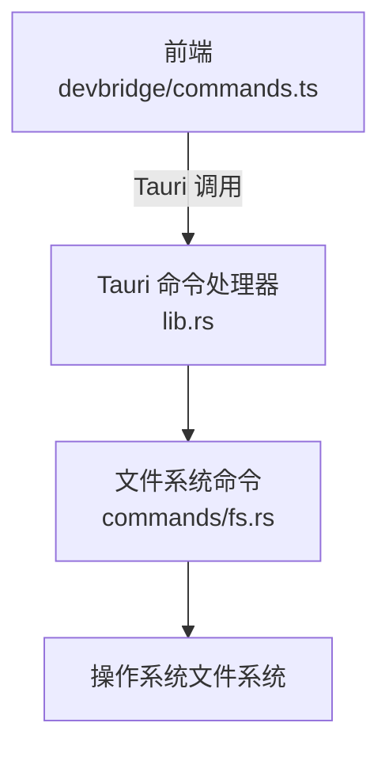
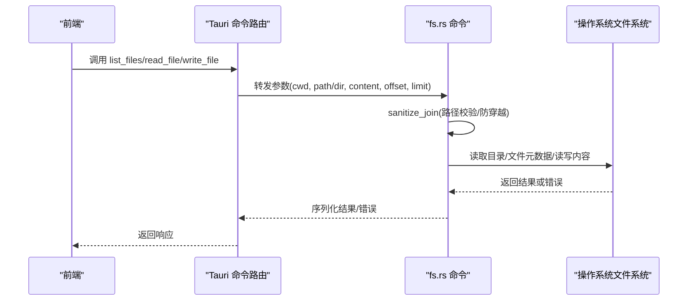
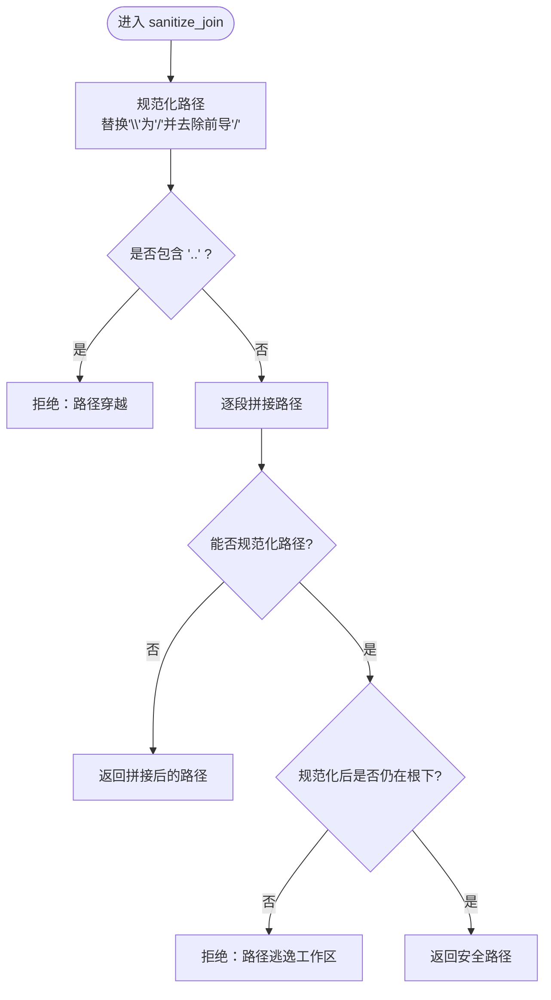
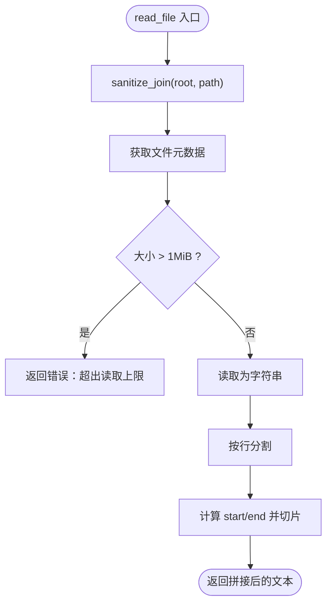
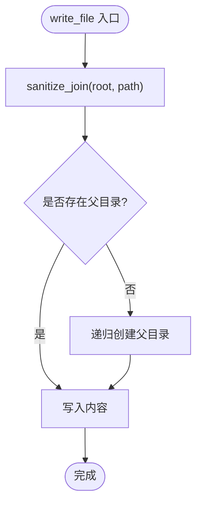
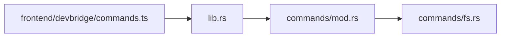

# 文件系统命令

<cite>
**本文引用的文件**
- [src-tauri/src/commands/fs.rs](file://src-tauri/src/commands/fs.rs)
- [src-tauri/src/lib.rs](file://src-tauri/src/lib.rs)
- [frontend/app/devbridge/commands.ts](file://frontend/app/devbridge/commands.ts)
</cite>

## 目录
1. [简介](#简介)
2. [项目结构](#项目结构)
3. [核心组件](#核心组件)
4. [架构总览](#架构总览)
5. [详细组件分析](#详细组件分析)
6. [依赖关系分析](#依赖关系分析)
7. [性能考虑](#性能考虑)
8. [故障排查指南](#故障排查指南)
9. [结论](#结论)
10. [附录：API 参考与使用示例](#附录api-参考与使用示例)

## 简介
本模块为 Tauri 后端的“文件系统命令”能力，提供安全的文件浏览、读取、写入等基础操作。它通过 Tauri 命令暴露给前端调用，并在后端进行路径校验、权限控制与大文件限制，确保在受限工作区内安全地访问文件系统。当前实现包含：
- 文件列表浏览（支持忽略特定目录）
- 文本文件读取（支持按行偏移与限制）
- 文本文件写入（自动创建父目录）

该模块未实现删除、移动、复制等写操作；如需扩展，可参照现有模式新增命令。

## 项目结构
- 后端命令实现位于 Rust 模块 commands/fs.rs，定义并注册了 list_files、read_file、write_file 三个 Tauri 命令。
- 命令在 lib.rs 中集中注册到 Tauri 的 invoke_handler，使前端可通过统一通道调用。
- 前端存在 devbridge 兼容层，用于浏览器开发环境下的虚拟文件系统模拟，行为与后端命令保持一致的接口契约。



图表来源
- [src-tauri/src/lib.rs:71-101](file://src-tauri/src/lib.rs#L71-L101)
- [src-tauri/src/commands/fs.rs:50-131](file://src-tauri/src/commands/fs.rs#L50-L131)
- [frontend/app/devbridge/commands.ts:537-581](file://frontend/app/devbridge/commands.ts#L537-L581)

章节来源
- [src-tauri/src/commands/fs.rs:1-132](file://src-tauri/src/commands/fs.rs#L1-L132)
- [src-tauri/src/lib.rs:71-101](file://src-tauri/src/lib.rs#L71-L101)
- [frontend/app/devbridge/commands.ts:537-581](file://frontend/app/devbridge/commands.ts#L537-L581)

## 核心组件
- 路径安全化与校验：sanitize_join 负责规范化相对路径、拒绝目录穿越、并确保最终路径仍在工作区根目录下。
- 文件列表：list_files 列出指定目录内容，过滤隐藏文件和忽略目录，返回标准化条目信息。
- 文件读取：read_file 限制最大读取大小，按行切片返回，避免一次性加载大文件。
- 文件写入：write_file 自动创建父目录并写入文本内容。

章节来源
- [src-tauri/src/commands/fs.rs:31-48](file://src-tauri/src/commands/fs.rs#L31-L48)
- [src-tauri/src/commands/fs.rs:50-99](file://src-tauri/src/commands/fs.rs#L50-L99)
- [src-tauri/src/commands/fs.rs:101-131](file://src-tauri/src/commands/fs.rs#L101-L131)

## 架构总览
下图展示了从前端发起的文件系统操作到后端执行的安全流程。



图表来源
- [src-tauri/src/lib.rs:71-101](file://src-tauri/src/lib.rs#L71-L101)
- [src-tauri/src/commands/fs.rs:31-48](file://src-tauri/src/commands/fs.rs#L31-L48)
- [src-tauri/src/commands/fs.rs:50-131](file://src-tauri/src/commands/fs.rs#L50-L131)

## 详细组件分析

### 路径验证与安全机制
- 输入归一化：将反斜杠替换为正斜杠，去除前导斜杠，拆分路径段逐个拼接。
- 目录穿越防护：若路径段包含 ".."，直接拒绝。
- 工作区边界检查：尝试对根与工作路径进行规范化，确保最终路径以根路径开头，防止逃逸。
- 错误语义：返回明确的错误消息，便于上层处理。



图表来源
- [src-tauri/src/commands/fs.rs:31-48](file://src-tauri/src/commands/fs.rs#L31-L48)

章节来源
- [src-tauri/src/commands/fs.rs:31-48](file://src-tauri/src/commands/fs.rs#L31-L48)

### 文件浏览（list_files）
- 功能：列出指定目录下的文件与子目录，过滤隐藏文件（以 "." 开头），跳过预定义的忽略目录（如 node_modules、dist、build、out、target、.git、.idea、.vscode、vendor）。
- 输出：每个条目包含名称、相对路径、绝对路径、是否目录、扩展名（小写）。
- 排序：目录优先，其次按名称不区分大小写排序。
- 安全性：所有子目录均通过 sanitize_join 校验，确保仅在工作区内遍历。

```mermaid
flowchart TD
LStart(["list_files 入口"]) --> ValidateCWD{"cwd 是否为目录?"}
ValidateCWD --> |否| ErrCWD["返回错误：cwd 不是目录"]
ValidateCWD --> |是| ResolveBase{"dir 是否为空?"}
ResolveBase --> |是| Base=root
ResolveBase --> |否| Sanitize["sanitize_join(root, dir)"]
Sanitize --> ReadDir["读取目录项"]
ReadDir --> Filter["过滤隐藏文件与忽略目录"]
Filter --> BuildEntry["构建 FileEntry(name,path,abs_path,is_directory,ext)"]
BuildEntry --> Sort["排序：目录优先，再按名称排序"]
Sort --> LEnd(["返回列表"])
```

图表来源
- [src-tauri/src/commands/fs.rs:50-99](file://src-tauri/src/commands/fs.rs#L50-L99)

章节来源
- [src-tauri/src/commands/fs.rs:50-99](file://src-tauri/src/commands/fs.rs#L50-L99)

### 文件读取（read_file）
- 功能：读取文本文件并按行切片返回，支持 offset 和 limit 分页。
- 大文件保护：若文件大小超过 1MiB，直接拒绝读取。
- 编码：使用标准库 read_to_string，默认依赖平台编码；未显式检测或转换字符集。
- 分页：lines[start..end] 切片，避免一次性传输大量数据。



图表来源
- [src-tauri/src/commands/fs.rs:101-121](file://src-tauri/src/commands/fs.rs#L101-L121)

章节来源
- [src-tauri/src/commands/fs.rs:101-121](file://src-tauri/src/commands/fs.rs#L101-L121)

### 文件写入（write_file）
- 功能：将文本内容写入目标路径，若父目录不存在则自动创建。
- 安全性：同样通过 sanitize_join 校验路径，确保写入位置在工作区内。
- 编码：使用标准库 write，默认依赖平台编码；未显式指定编码。



图表来源
- [src-tauri/src/commands/fs.rs:123-131](file://src-tauri/src/commands/fs.rs#L123-L131)

章节来源
- [src-tauri/src/commands/fs.rs:123-131](file://src-tauri/src/commands/fs.rs#L123-L131)

### 前端兼容层（devbridge）
- 目的：在浏览器开发环境中提供与后端一致的命令接口，但基于内存中的虚拟文件系统。
- 行为：list_files、read_file、write_file 的实现与后端命令保持相同参数与返回结构，便于前后端联调。

章节来源
- [frontend/app/devbridge/commands.ts:537-581](file://frontend/app/devbridge/commands.ts#L537-L581)

## 依赖关系分析
- Tauri 命令注册：lib.rs 将 fs 模块的命令注册到全局命令表，供前端调用。
- 文件系统命令：fs.rs 依赖标准库 Path、PathBuf、std::fs 进行路径与文件操作。
- 前端桥接：devbridge/commands.ts 提供与后端一致的前端调用封装。



图表来源
- [src-tauri/src/lib.rs:71-101](file://src-tauri/src/lib.rs#L71-L101)
- [src-tauri/src/commands/mod.rs:1-11](file://src-tauri/src/commands/mod.rs#L1-L11)
- [src-tauri/src/commands/fs.rs:1-132](file://src-tauri/src/commands/fs.rs#L1-L132)
- [frontend/app/devbridge/commands.ts:537-581](file://frontend/app/devbridge/commands.ts#L537-L581)

章节来源
- [src-tauri/src/lib.rs:71-101](file://src-tauri/src/lib.rs#L71-L101)
- [src-tauri/src/commands/mod.rs:1-11](file://src-tauri/src/commands/mod.rs#L1-L11)
- [src-tauri/src/commands/fs.rs:1-132](file://src-tauri/src/commands/fs.rs#L1-L132)
- [frontend/app/devbridge/commands.ts:537-581](file://frontend/app/devbridge/commands.ts#L537-L581)

## 性能考虑
- 大文件限制：read_file 限制单次读取不超过 1MiB，避免内存占用过高。
- 行级分页：read_file 支持 offset/limit，减少网络传输与渲染压力。
- 目录遍历优化：list_files 过滤隐藏文件与忽略目录，降低无关条目数量。
- 建议扩展：
  - 流式读取：对超大文件采用分块读取与流式传输。
  - 增量更新：对目录监听变更，避免全量刷新。
  - 并发控制：批量操作时限制并发度，避免 I/O 风暴。

[本节为通用性能建议，不直接分析具体文件]

## 故障排查指南
- 路径穿越/逃逸：当传入路径包含 ".." 或规范化后不在工作区根下，会返回明确错误。检查前端传入的 cwd 与 path 是否正确。
- 非目录作为 cwd：list_files 要求 cwd 必须是目录，否则返回错误。确认传入的 cwd 有效。
- 文件过大：read_file 对超过 1MiB 的文件直接拒绝。如需读取更大文件，请改用分块或流式方案。
- 编码问题：read_to_string 与 write 使用平台默认编码。若出现乱码，建议在更高层进行编码检测与转换（例如 UTF-8 强制转换）。
- 权限错误：若目标路径无写入权限或目录不可写，write_file 会返回底层错误。检查文件系统权限与路径有效性。

章节来源
- [src-tauri/src/commands/fs.rs:31-48](file://src-tauri/src/commands/fs.rs#L31-L48)
- [src-tauri/src/commands/fs.rs:50-99](file://src-tauri/src/commands/fs.rs#L50-L99)
- [src-tauri/src/commands/fs.rs:101-131](file://src-tauri/src/commands/fs.rs#L101-L131)

## 结论
当前文件系统命令模块提供了安全的基础文件浏览、读取与写入能力，重点强化了路径安全校验与大文件限制。缺失的功能包括删除、移动、复制、搜索、批量操作、编码检测与类型检测等。后续可在现有 sanitize_join 与命令注册模式基础上扩展更多安全且高效的文件系统操作。

[本节为总结性内容，不直接分析具体文件]

## 附录：API 参考与使用示例

### 已实现的命令
- list_files(cwd: string, dir: string): 返回文件与目录列表，字段包括 name、path、abs_path、is_directory、ext。
- read_file(cwd: string, path: string, offset?: number, limit?: number): 返回文本片段，按行切片。
- write_file(cwd: string, path: string, content: string): 写入文本内容，自动创建父目录。

章节来源
- [src-tauri/src/commands/fs.rs:50-131](file://src-tauri/src/commands/fs.rs#L50-L131)
- [src-tauri/src/lib.rs:99-101](file://src-tauri/src/lib.rs#L99-L101)

### 典型使用场景
- 浏览工作区目录：前端调用 list_files(cwd=项目根, dir="") 获取顶层文件与目录，再根据 is_directory 决定是否深入。
- 预览代码片段：调用 read_file(cwd, path, offset, limit) 分页读取代码文件，提升 UI 响应速度。
- 保存编辑内容：调用 write_file(cwd, path, content) 保存用户修改，自动创建必要目录。

章节来源
- [frontend/app/devbridge/commands.ts:537-581](file://frontend/app/devbridge/commands.ts#L537-L581)

### 未实现但可规划的能力
- 删除/移动/复制：可新增 delete_file、move_file、copy_file 命令，复用 sanitize_join 与错误处理模式。
- 搜索与批量操作：可结合目录遍历与异步任务队列，实现全文检索与批量重命名/移动。
- 编码与类型检测：可在读取前检测 BOM 或尝试多编码解码，结合扩展名与内容特征进行类型推断。
- 权限控制：可引入白名单目录策略或用户角色权限模型，限制敏感目录访问。

[本节为概念性规划，不直接分析具体文件]