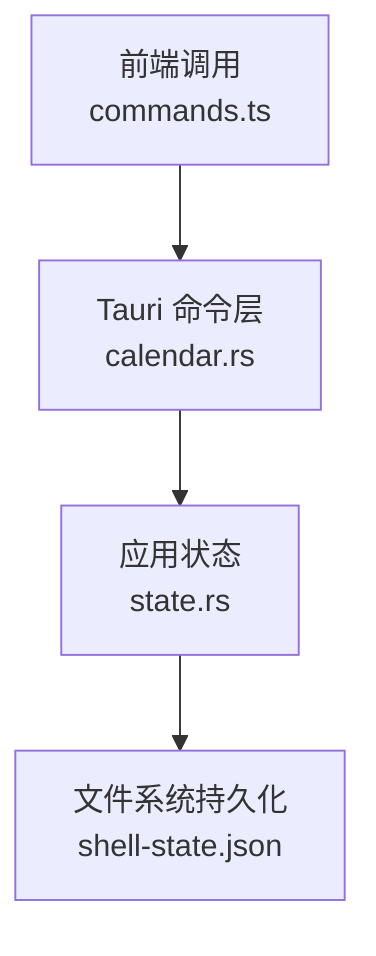
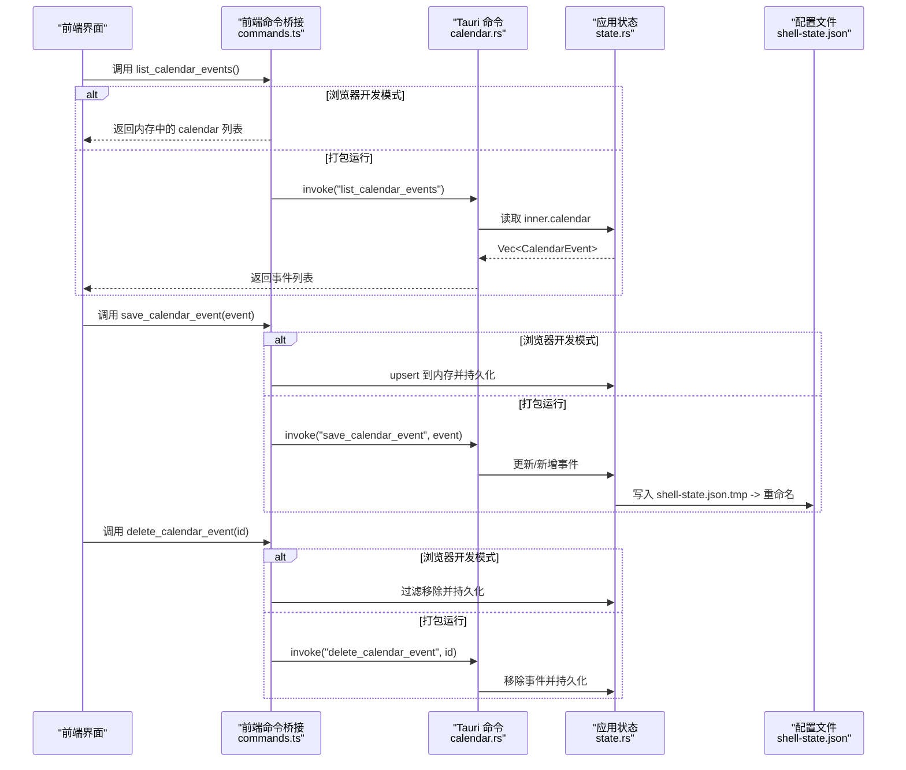
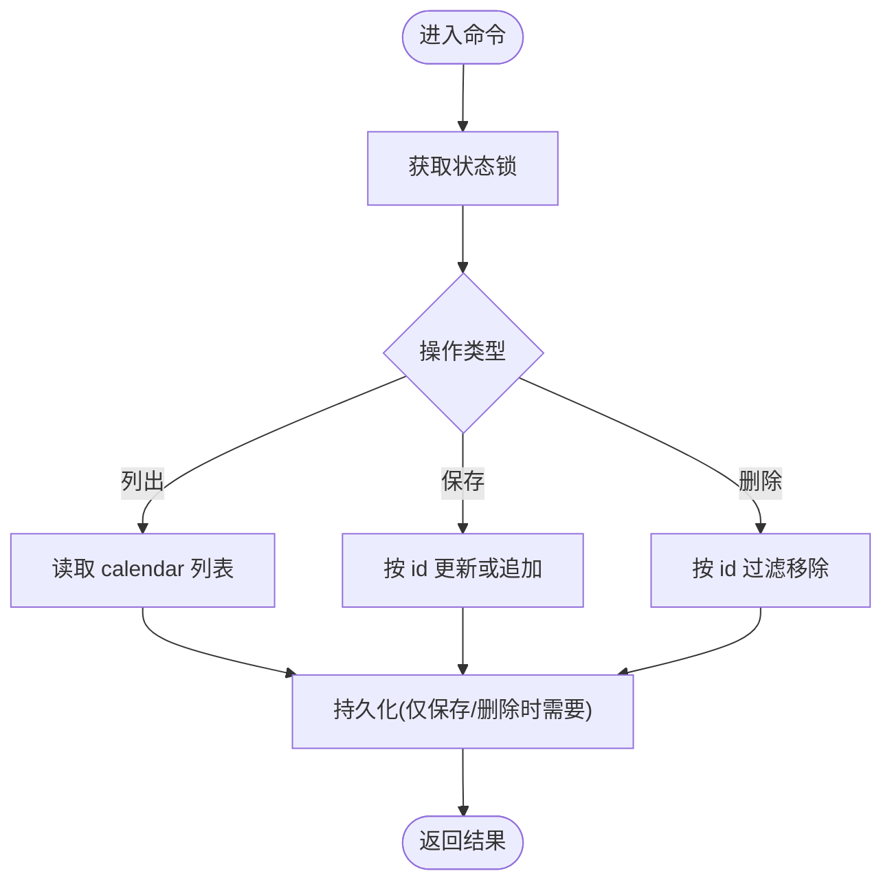
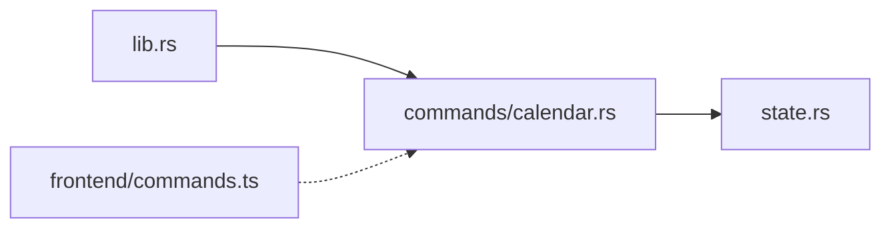

# 日历命令

<cite>
**本文引用的文件**
- [calendar.rs](file://src-tauri/src/commands/calendar.rs)
- [state.rs](file://src-tauri/src/state.rs)
- [lib.rs](file://src-tauri/src/lib.rs)
- [mod.rs](file://src-tauri/src/commands/mod.rs)
- [tauri.conf.json](file://src-tauri/tauri.conf.json)
- [commands.ts](file://frontend/app/devbridge/commands.ts)
</cite>

## 目录
1. [简介](#简介)
2. [项目结构](#项目结构)
3. [核心组件](#核心组件)
4. [架构总览](#架构总览)
5. [详细组件分析](#详细组件分析)
6. [依赖关系分析](#依赖关系分析)
7. [性能考虑](#性能考虑)
8. [故障排查指南](#故障排查指南)
9. [结论](#结论)
10. [附录：集成与使用示例](#附录：集成与使用示例)

## 简介
本模块提供桌面应用内的“本地日历事件”管理能力，包括事件的创建、查询、修改与删除。数据以进程内状态持久化到用户配置目录的 JSON 文件中，前端通过 Tauri 命令或开发桥接（devbridge）进行交互。当前实现为轻量级本地存储方案，未内置跨平台系统日历 API 适配、时区处理、重复事件、账户管理、权限请求、数据同步、提醒通知与冲突检测等高级能力；这些可作为后续扩展方向。

## 项目结构
日历功能由后端 Rust 命令与前端命令桥接组成：
- 后端命令：定义并注册三个 Tauri 命令，用于读取、保存和删除日历事件。
- 状态模型：在应用状态中维护日历事件列表，并提供序列化/反序列化和持久化能力。
- 前端桥接：在浏览器开发模式下提供等效的前端命令实现，直接操作本地状态。

图表来源
- [calendar.rs:4-32](file://src-tauri/src/commands/calendar.rs#L4-L32)
- [state.rs:176-217](file://src-tauri/src/state.rs#L176-L217)
- [commands.ts:473-484](file://frontend/app/devbridge/commands.ts#L473-L484)

章节来源
- [calendar.rs:1-32](file://src-tauri/src/commands/calendar.rs#L1-L32)
- [state.rs:79-217](file://src-tauri/src/state.rs#L79-L217)
- [commands.ts:473-484](file://frontend/app/devbridge/commands.ts#L473-L484)

## 核心组件
- 日历事件数据模型：包含唯一标识、标题、开始时间、结束时间与备注字段。
- 应用状态：维护日历事件集合，并在启动时从配置文件加载，变更时写回磁盘。
- Tauri 命令：暴露 list/save/delete 三个命令供前端调用。
- 前端命令桥接：在浏览器开发环境下模拟相同行为，便于本地调试。

章节来源
- [state.rs:79-89](file://src-tauri/src/state.rs#L79-L89)
- [state.rs:150-217](file://src-tauri/src/state.rs#L150-L217)
- [calendar.rs:4-32](file://src-tauri/src/commands/calendar.rs#L4-L32)
- [commands.ts:473-484](file://frontend/app/devbridge/commands.ts#L473-L484)

## 架构总览
下图展示了从前端到后端的完整调用链，以及状态持久化的过程。

图表来源
- [commands.ts:473-484](file://frontend/app/devbridge/commands.ts#L473-L484)
- [calendar.rs:4-32](file://src-tauri/src/commands/calendar.rs#L4-L32)
- [state.rs:176-217](file://src-tauri/src/state.rs#L176-L217)

## 详细组件分析

### 数据模型：CalendarEvent
- 字段说明
  - id：字符串类型，事件唯一标识。
  - title：字符串类型，事件标题。
  - starts_at：字符串类型，事件开始时间（ISO 字符串或自定义格式）。
  - ends_at：字符串类型，事件结束时间。
  - notes：字符串类型，事件备注。
- 复杂度
  - 增删改查均为 O(n) 线性扫描（基于 id 匹配），n 为事件数量。
- 可扩展点
  - 可增加时区、重复规则、提醒、颜色、位置等字段以满足更复杂场景。

章节来源
- [state.rs:79-89](file://src-tauri/src/state.rs#L79-L89)

### 应用状态与持久化
- 状态容器
  - InnerState 持有 calendar 列表及其他应用数据。
  - AppState 提供 load_or_default 初始化与 save 持久化。
- 持久化策略
  - 启动时从配置目录下的 shell-state.json 加载；若不存在或解析失败则使用默认值。
  - 保存时先写入临时文件再原子重命名，避免部分写入导致的数据损坏。
- 快照
  - snapshot 方法可导出当前状态，便于前端或测试使用。

章节来源
- [state.rs:150-217](file://src-tauri/src/state.rs#L150-L217)
- [state.rs:234-262](file://src-tauri/src/state.rs#L234-L262)

### Tauri 命令：CRUD 操作
- list_calendar_events
  - 读取内存中的 calendar 列表并返回。
- save_calendar_event
  - 根据 id 判断是更新还是新增；完成后调用 state.save() 持久化。
- delete_calendar_event
  - 按 id 过滤移除事件；完成后调用 state.save() 持久化。
- 错误处理
  - 所有命令对 Mutex 加锁失败进行错误转换，确保上层能感知异常。

图表来源
- [calendar.rs:4-32](file://src-tauri/src/commands/calendar.rs#L4-L32)
- [state.rs:209-217](file://src-tauri/src/state.rs#L209-L217)

章节来源
- [calendar.rs:4-32](file://src-tauri/src/commands/calendar.rs#L4-L32)

### 前端命令桥接（开发模式）
- 在浏览器开发环境中，commands.ts 提供了与后端命令等价的前端实现：
  - list_calendar_events：返回内存中的 calendar。
  - save_calendar_event：upsert 事件并持久化到本地状态。
  - delete_calendar_event：按 id 过滤并持久化。
- 该桥接使前端在无需后端的情况下也能完成基本联调。

章节来源
- [commands.ts:473-484](file://frontend/app/devbridge/commands.ts#L473-L484)

### 命令注册与入口
- 命令模块声明
  - commands/mod.rs 中声明了 calendar 子模块。
- 命令注册
  - lib.rs 中将 calendar 的三个命令注册到 Tauri 运行时，使其可通过 IPC 调用。
- 安全与插件
  - tauri.conf.json 启用了 fs 与 shell 插件，但日历模块本身不依赖这些插件。

章节来源
- [mod.rs:1-11](file://src-tauri/src/commands/mod.rs#L1-L11)
- [lib.rs:86-88](file://src-tauri/src/lib.rs#L86-L88)
- [tauri.conf.json:52-59](file://src-tauri/tauri.conf.json#L52-L59)

## 依赖关系分析
- 模块耦合
  - calendar.rs 依赖 state.rs 中的 AppState 与 CalendarEvent。
  - lib.rs 将 calendar 命令注册到 Tauri 运行时。
  - commands.ts 在开发模式下提供等价实现，降低前后端耦合。
- 外部依赖
  - 当前实现无第三方日历服务依赖，完全本地化。
- 潜在循环依赖
  - 未发现循环依赖；命令层单向依赖状态层。

图表来源
- [lib.rs:86-88](file://src-tauri/src/lib.rs#L86-L88)
- [calendar.rs:1-32](file://src-tauri/src/commands/calendar.rs#L1-L32)
- [state.rs:79-217](file://src-tauri/src/state.rs#L79-L217)
- [commands.ts:473-484](file://frontend/app/devbridge/commands.ts#L473-L484)

章节来源
- [lib.rs:86-88](file://src-tauri/src/lib.rs#L86-L88)
- [calendar.rs:1-32](file://src-tauri/src/commands/calendar.rs#L1-L32)
- [state.rs:79-217](file://src-tauri/src/state.rs#L79-L217)
- [commands.ts:473-484](file://frontend/app/devbridge/commands.ts#L473-L484)

## 性能考虑
- 数据结构
  - 使用 Vec 存储事件，查找与删除为 O(n)。对于小规模事件集合理可接受。
- 并发访问
  - 通过 Mutex 保护共享状态，避免竞态条件；在高并发场景下可能成为瓶颈。
- 持久化
  - 采用临时文件+重命名的原子写入，减少数据损坏风险。
- 优化建议
  - 当事件规模增长时，可引入索引（如 HashMap<id, index>）以提升查找与删除效率。
  - 批量操作时可合并多次保存，减少磁盘 IO。

[本节为通用性能讨论，不直接分析具体代码行]

## 故障排查指南
- 常见问题
  - 命令不可用：确认命令已在 lib.rs 中注册。
  - 数据未持久化：检查 state.save() 是否被调用，以及目标目录是否有写权限。
  - 并发锁错误：Mutex 加锁失败会转换为字符串错误，需在上层捕获并提示。
- 定位步骤
  - 查看命令返回值与错误信息。
  - 检查 shell-state.json 是否存在且可读写。
  - 在开发模式下验证 commands.ts 的行为是否与预期一致。

章节来源
- [calendar.rs:4-32](file://src-tauri/src/commands/calendar.rs#L4-L32)
- [state.rs:209-217](file://src-tauri/src/state.rs#L209-L217)
- [lib.rs:86-88](file://src-tauri/src/lib.rs#L86-L88)

## 结论
当前日历命令模块实现了基础的本地事件管理能力，具备清晰的命令接口与稳定的持久化机制。由于尚未集成系统日历 API、时区与重复事件等高级特性，适合用于轻量级日程记录与内部任务编排。未来可按需扩展跨平台日历适配、提醒通知、冲突检测与多账户同步等功能。

[本节为总结性内容，不直接分析具体代码行]

## 附录：集成与使用示例

### 事件数据模型
- 字段
  - id：字符串，唯一标识。
  - title：字符串，标题。
  - starts_at：字符串，开始时间。
  - ends_at：字符串，结束时间。
  - notes：字符串，备注。
- 示例路径
  - 模型定义参考：[state.rs:79-89](file://src-tauri/src/state.rs#L79-L89)

章节来源
- [state.rs:79-89](file://src-tauri/src/state.rs#L79-L89)

### 查询事件
- 后端命令
  - 调用 list_calendar_events 返回事件列表。
  - 参考：[calendar.rs:4-12](file://src-tauri/src/commands/calendar.rs#L4-L12)
- 前端桥接
  - 浏览器开发模式下，commands.ts 提供等价实现。
  - 参考：[commands.ts:473-473](file://frontend/app/devbridge/commands.ts#L473-L473)

章节来源
- [calendar.rs:4-12](file://src-tauri/src/commands/calendar.rs#L4-L12)
- [commands.ts:473-473](file://frontend/app/devbridge/commands.ts#L473-L473)

### 创建或更新事件
- 后端命令
  - 调用 save_calendar_event，传入事件对象；若存在同 id 则更新，否则新增。
  - 参考：[calendar.rs:14-24](file://src-tauri/src/commands/calendar.rs#L14-L24)
- 前端桥接
  - 浏览器开发模式下，commands.ts 执行 upsert 并持久化。
  - 参考：[commands.ts:474-478](file://frontend/app/devbridge/commands.ts#L474-L478)

章节来源
- [calendar.rs:14-24](file://src-tauri/src/commands/calendar.rs#L14-L24)
- [commands.ts:474-478](file://frontend/app/devbridge/commands.ts#L474-L478)

### 删除事件
- 后端命令
  - 调用 delete_calendar_event，传入事件 id。
  - 参考：[calendar.rs:26-32](file://src-tauri/src/commands/calendar.rs#L26-L32)
- 前端桥接
  - 浏览器开发模式下，commands.ts 按 id 过滤并持久化。
  - 参考：[commands.ts:480-484](file://frontend/app/devbridge/commands.ts#L480-L484)

章节来源
- [calendar.rs:26-32](file://src-tauri/src/commands/calendar.rs#L26-L32)
- [commands.ts:480-484](file://frontend/app/devbridge/commands.ts#L480-L484)

### 搜索与过滤
- 当前实现
  - 未提供服务端搜索与过滤接口；可在前端对返回的事件列表进行过滤。
- 建议
  - 如需服务端过滤，可在命令层增加参数（如按标题、时间范围过滤）并返回筛选结果。

[本节为概念性说明，不直接分析具体代码行]

### 跨平台日历 API 适配、时区、重复事件、账户与权限、同步、提醒与冲突检测
- 现状
  - 当前模块为本地存储，未集成系统日历 API、时区处理、重复事件、账户管理、权限请求、数据同步、提醒通知与冲突检测。
- 扩展建议
  - 抽象日历提供者接口，封装不同平台的日历 API（如 Windows Calendar、macOS EventKit、Linux Evolution/GNOME）。
  - 统一时区处理，使用 ISO 8601 与时区偏移。
  - 支持重复事件规则（RRULE）与实例展开。
  - 引入账户管理与权限流程（OAuth/系统授权）。
  - 设计增量同步与冲突解决策略（最后写入优先、合并策略）。
  - 集成系统通知与提醒触发器。

[本节为规划性内容，不直接分析具体代码行]