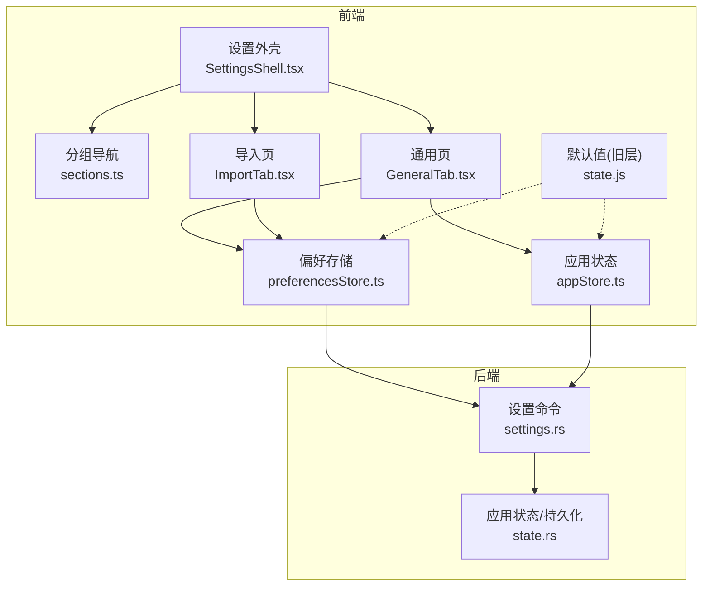
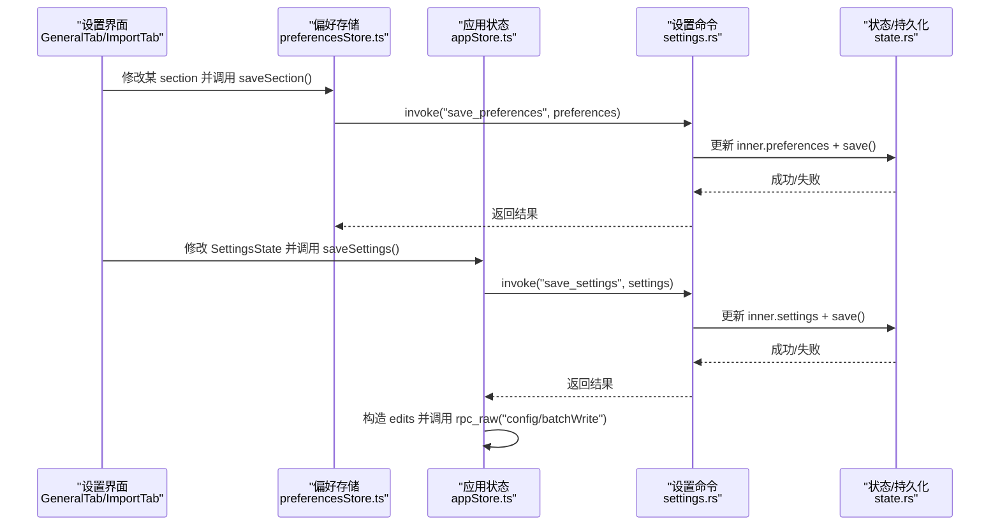
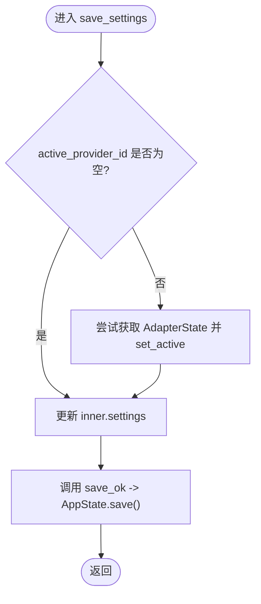
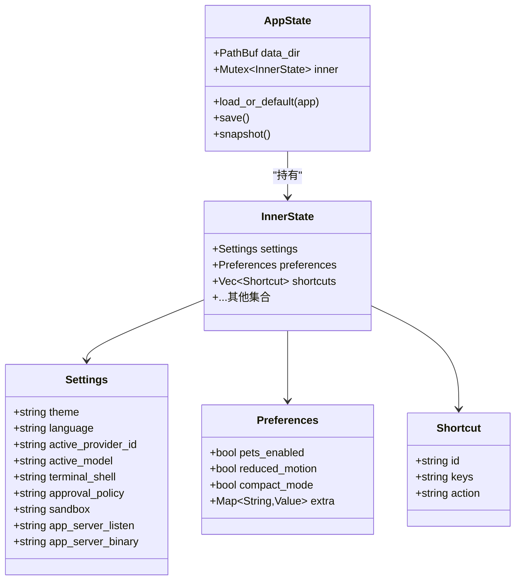
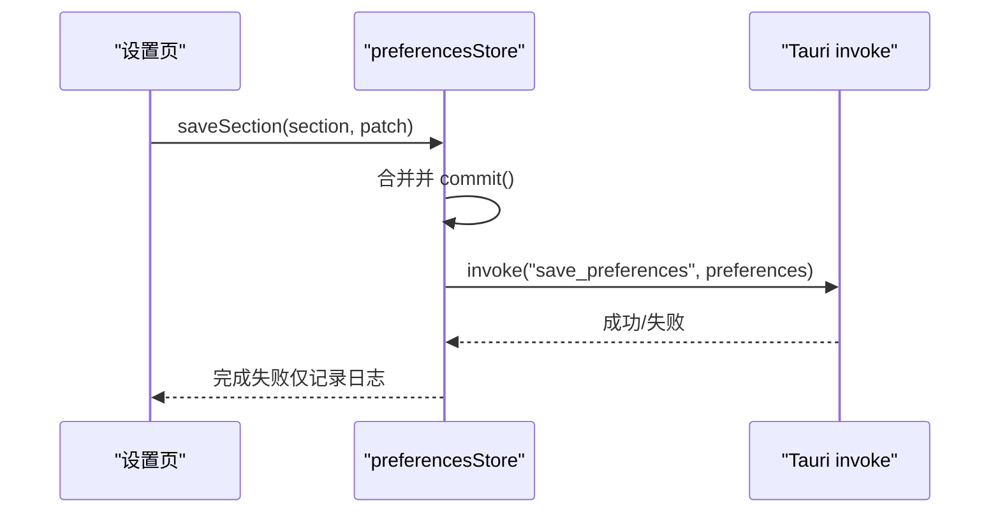
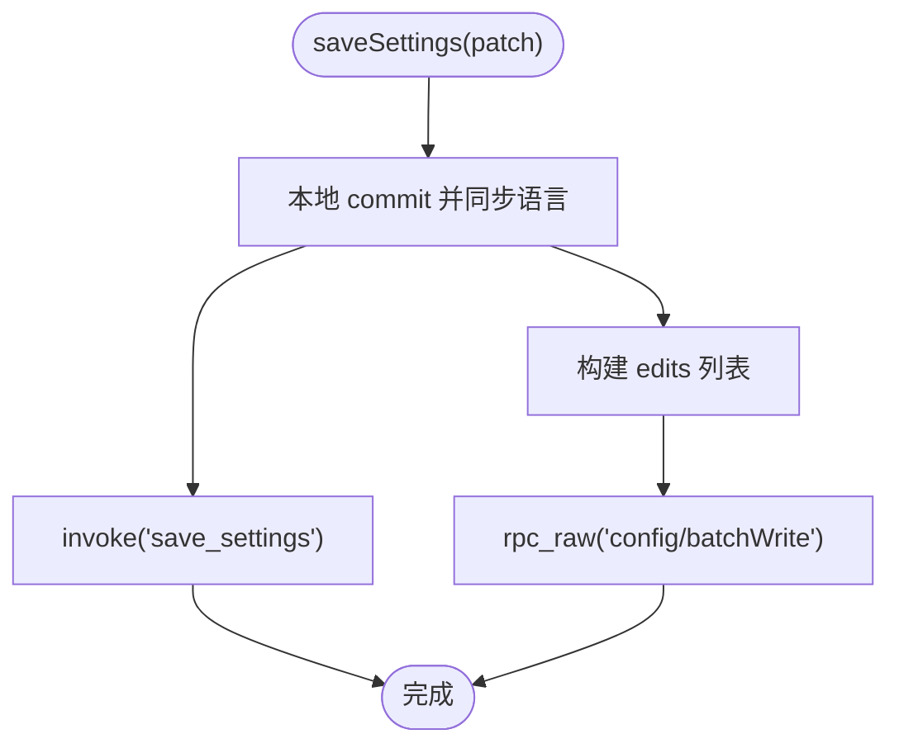
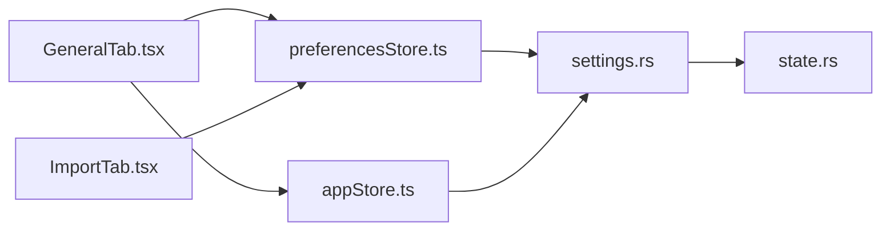

# 设置命令

<cite>
**本文引用的文件**
- [src-tauri/src/commands/settings.rs](file://src-tauri/src/commands/settings.rs)
- [src-tauri/src/state.rs](file://src-tauri/src/state.rs)
- [frontend/app/state/preferencesStore.ts](file://frontend/app/state/preferencesStore.ts)
- [frontend/app/state/appStore.ts](file://frontend/app/state/appStore.ts)
- [frontend/src/js/state.js](file://frontend/src/js/state.js)
- [frontend/app/views/settings/SettingsShell.tsx](file://frontend/app/views/settings/SettingsShell.tsx)
- [frontend/app/views/settings/sections.ts](file://frontend/app/views/settings/sections.ts)
- [frontend/app/views/settings/tabs/GeneralTab.tsx](file://frontend/app/views/settings/tabs/GeneralTab.tsx)
- [frontend/app/views/settings/tabs/ImportTab.tsx](file://frontend/app/views/settings/tabs/ImportTab.tsx)
</cite>

## 目录
1. [简介](#简介)
2. [项目结构](#项目结构)
3. [核心组件](#核心组件)
4. [架构总览](#架构总览)
5. [详细组件分析](#详细组件分析)
6. [依赖关系分析](#依赖关系分析)
7. [性能考虑](#性能考虑)
8. [故障排查指南](#故障排查指南)
9. [结论](#结论)
10. [附录](#附录)

## 简介
本文件围绕“设置命令模块”提供完整的技术与使用文档，覆盖以下主题：
- 应用设置的持久化存储机制（配置文件读写、原子写入、默认值管理）
- 设置项的分类结构与数据类型约定
- 设置变更的通知机制、热重载支持与配置同步策略
- 设置导入导出、备份恢复、配置模板能力
- 设置验证规则、错误处理与数据完整性保证
- 具体操作示例与管理最佳实践

## 项目结构
设置相关代码横跨后端（Rust/Tauri 命令与状态）、前端（React 设置页、偏好存储与应用状态），以及共享的默认值定义。

**图表来源**
- [frontend/app/views/settings/SettingsShell.tsx:1-162](file://frontend/app/views/settings/SettingsShell.tsx#L1-L162)
- [frontend/app/views/settings/sections.ts:1-95](file://frontend/app/views/settings/sections.ts#L1-L95)
- [frontend/app/views/settings/tabs/GeneralTab.tsx:1-428](file://frontend/app/views/settings/tabs/GeneralTab.tsx#L1-L428)
- [frontend/app/views/settings/tabs/ImportTab.tsx:1-206](file://frontend/app/views/settings/tabs/ImportTab.tsx#L1-L206)
- [frontend/app/state/preferencesStore.ts:1-94](file://frontend/app/state/preferencesStore.ts#L1-L94)
- [frontend/app/state/appStore.ts:1-519](file://frontend/app/state/appStore.ts#L1-L519)
- [frontend/src/js/state.js:1-238](file://frontend/src/js/state.js#L1-L238)
- [src-tauri/src/commands/settings.rs:1-69](file://src-tauri/src/commands/settings.rs#L1-L69)
- [src-tauri/src/state.rs:1-331](file://src-tauri/src/state.rs#L1-L331)

**章节来源**
- [src-tauri/src/commands/settings.rs:1-69](file://src-tauri/src/commands/settings.rs#L1-L69)
- [src-tauri/src/state.rs:1-331](file://src-tauri/src/state.rs#L1-L331)
- [frontend/app/state/preferencesStore.ts:1-94](file://frontend/app/state/preferencesStore.ts#L1-L94)
- [frontend/app/state/appStore.ts:1-519](file://frontend/app/state/appStore.ts#L1-L519)
- [frontend/src/js/state.js:1-238](file://frontend/src/js/state.js#L1-L238)
- [frontend/app/views/settings/SettingsShell.tsx:1-162](file://frontend/app/views/settings/SettingsShell.tsx#L1-L162)
- [frontend/app/views/settings/sections.ts:1-95](file://frontend/app/views/settings/sections.ts#L1-L95)
- [frontend/app/views/settings/tabs/GeneralTab.tsx:1-428](file://frontend/app/views/settings/tabs/GeneralTab.tsx#L1-L428)
- [frontend/app/views/settings/tabs/ImportTab.tsx:1-206](file://frontend/app/views/settings/tabs/ImportTab.tsx#L1-L206)

## 核心组件
- 设置命令（Tauri 命令）
  - 读取/保存 Settings、Preferences、Shortcuts
  - 写回时触发持久化；当 active_provider_id 变化时更新适配器活跃提供者
- 应用状态与持久化（Rust）
  - 内存 InnerState 包含 settings、preferences、shortcuts 等
  - 启动时从 shell-state.json 加载，缺失字段按默认值补齐
  - 保存采用“先写临时文件再原子重命名”的策略，避免损坏
- 前端偏好存储（preferencesStore.ts）
  - 以 section 为单位合并并持久化到后端 save_preferences
  - 首次加载失败降级为默认值，保证 UI 可用
- 前端应用状态（appStore.ts）
  - 统一维护 SettingsState，并在保存时同时写 shell-state.json 与引擎 config.toml（通过 rpc_raw config/batchWrite）
  - 语言切换会同步到旧层 state.js，确保 i18n 生效
- 默认值（state.js）
  - 作为前端“单一事实源”，与 Rust 默认值共同保障一致性

**章节来源**
- [src-tauri/src/commands/settings.rs:1-69](file://src-tauri/src/commands/settings.rs#L1-L69)
- [src-tauri/src/state.rs:176-217](file://src-tauri/src/state.rs#L176-L217)
- [frontend/app/state/preferencesStore.ts:59-88](file://frontend/app/state/preferencesStore.ts#L59-L88)
- [frontend/app/state/appStore.ts:435-511](file://frontend/app/state/appStore.ts#L435-L511)
- [frontend/src/js/state.js:33-136](file://frontend/src/js/state.js#L33-L136)

## 架构总览
设置变更的典型流程如下：

**图表来源**
- [frontend/app/views/settings/tabs/GeneralTab.tsx:111-118](file://frontend/app/views/settings/tabs/GeneralTab.tsx#L111-L118)
- [frontend/app/state/preferencesStore.ts:76-88](file://frontend/app/state/preferencesStore.ts#L76-L88)
- [frontend/app/state/appStore.ts:446-511](file://frontend/app/state/appStore.ts#L446-L511)
- [src-tauri/src/commands/settings.rs:18-33](file://src-tauri/src/commands/settings.rs#L18-L33)
- [src-tauri/src/state.rs:209-217](file://src-tauri/src/state.rs#L209-L217)

## 详细组件分析

### 设置命令（settings.rs）
- get_settings / save_settings：读写 Settings，并在 active_provider_id 非空时通知适配器切换活跃提供者
- get_preferences / save_preferences：读写 Preferences（含 extra 扩展段）
- list_shortcuts / save_shortcuts：读写快捷键列表
- 所有写操作最终调用 save_ok -> AppState.save() 进行持久化

**图表来源**
- [src-tauri/src/commands/settings.rs:18-33](file://src-tauri/src/commands/settings.rs#L18-L33)
- [src-tauri/src/state.rs:209-217](file://src-tauri/src/state.rs#L209-L217)

**章节来源**
- [src-tauri/src/commands/settings.rs:1-69](file://src-tauri/src/commands/settings.rs#L1-L69)

### 应用状态与持久化（state.rs）
- 数据结构
  - Settings：主题、语言、活跃提供者/模型、终端 Shell、审批策略、沙箱、应用服务器地址与二进制路径
  - Preferences：布尔开关与 extra 扩展段（支持任意 section 的扁平化存储）
  - Shortcuts：快捷键映射
- 加载与默认值
  - 启动时读取 shell-state.json，若解析失败或字段为空则填充默认值（如 theme=light、language=zh-CN、app_server_listen=ws://127.0.0.1:17457）
- 持久化
  - 写 shell-state.json.tmp 后原子 rename 到目标文件，保证完整性

**图表来源**
- [src-tauri/src/state.rs:27-64](file://src-tauri/src/state.rs#L27-L64)
- [src-tauri/src/state.rs:117-174](file://src-tauri/src/state.rs#L117-L174)
- [src-tauri/src/state.rs:150-231](file://src-tauri/src/state.rs#L150-L231)

**章节来源**
- [src-tauri/src/state.rs:176-217](file://src-tauri/src/state.rs#L176-L217)
- [src-tauri/src/state.rs:234-300](file://src-tauri/src/state.rs#L234-L300)

### 前端偏好存储（preferencesStore.ts）
- 职责
  - 加载：首次调用 loadPreferences 拉取后端 Preferences，合并默认值
  - 订阅：usePreferences/usePrefSection 暴露响应式数据
  - 保存：saveSection 先本地 commit，再异步调用 save_preferences
- 容错
  - 加载失败降级为默认值，不阻断 UI
  - 保存失败记录日志，不影响本地即时更新

**图表来源**
- [frontend/app/state/preferencesStore.ts:59-88](file://frontend/app/state/preferencesStore.ts#L59-L88)

**章节来源**
- [frontend/app/state/preferencesStore.ts:1-94](file://frontend/app/state/preferencesStore.ts#L1-L94)

### 前端应用状态（appStore.ts）
- 职责
  - 统一维护 SettingsState，并提供 saveSettings(patch)
  - 将关键设置同时写入：
    - 壳层：invoke("save_settings") 持久化到 shell-state.json
    - 引擎：构造 edits 并通过 rpc_raw("config/batchWrite") 写入 config.toml
  - 语言切换时同步到旧层 state.js，确保 i18n 立即生效
- 键映射
  - 兼容 camelCase/snake_case 两种命名
  - 将 approvalPolicy/sandbox 等映射到引擎 key（如 approval_policy、sandbox_mode）

**图表来源**
- [frontend/app/state/appStore.ts:446-511](file://frontend/app/state/appStore.ts#L446-L511)

**章节来源**
- [frontend/app/state/appStore.ts:1-519](file://frontend/app/state/appStore.ts#L1-L519)

### 设置分类与导航（sections.ts + SettingsShell.tsx）
- 分类
  - personal（个人）、integrations（集成）、coding（编码）、archived（归档）
- 导航
  - SettingsShell 渲染侧边栏与内容区，基于 sections 动态生成链接与标题
  - 搜索过滤：根据查询词隐藏不匹配项与空组

**章节来源**
- [frontend/app/views/settings/sections.ts:1-95](file://frontend/app/views/settings/sections.ts#L1-L95)
- [frontend/app/views/settings/SettingsShell.tsx:1-162](file://frontend/app/views/settings/SettingsShell.tsx#L1-L162)

### 通用设置页（GeneralTab.tsx）
- 行为
  - 权限：fullAccess 通过 saveSettings 写入 shell 与引擎
  - 语言：通过 saveSettings(language) 触发语言切换与 i18n 同步
  - 任务文件夹：读取 engine_status.initialize.codexHome 显示默认位置
  - 其余选项：通过 saveSection("general", ...) 持久化为 preferences
- 交互
  - 下拉框、开关、分段控件等组合，均遵循“真实控件、无假交互”原则

**章节来源**
- [frontend/app/views/settings/tabs/GeneralTab.tsx:1-428](file://frontend/app/views/settings/tabs/GeneralTab.tsx#L1-L428)

### 导入页（ImportTab.tsx）
- 功能
  - 选择 JSON/TOML/TXT 文件，解析为 edits，调用 rpc_raw("config/batchWrite") 批量写入
  - 成功后标记 importDone=true，解锁“内容选择”下拉
- 校验与错误
  - 空文件、非 JSON、无可识别键等情况给出明确错误提示
  - 失败不伪装成功

**章节来源**
- [frontend/app/views/settings/tabs/ImportTab.tsx:1-206](file://frontend/app/views/settings/tabs/ImportTab.tsx#L1-L206)

## 依赖关系分析
- 前端依赖
  - GeneralTab/ImportTab 依赖 preferencesStore 与 appStore
  - preferencesStore 依赖 Tauri invoke 调用后端设置命令
  - appStore 在保存设置时既调用设置命令，又通过 rpc_raw 与引擎通信
- 后端依赖
  - settings.rs 依赖 state.rs 提供的 AppState.load_or_default/save
  - 保存时可能影响 AdapterState（活跃提供者切换）

**图表来源**
- [frontend/app/views/settings/tabs/GeneralTab.tsx:111-118](file://frontend/app/views/settings/tabs/GeneralTab.tsx#L111-L118)
- [frontend/app/state/preferencesStore.ts:76-88](file://frontend/app/state/preferencesStore.ts#L76-L88)
- [frontend/app/state/appStore.ts:446-511](file://frontend/app/state/appStore.ts#L446-L511)
- [src-tauri/src/commands/settings.rs:18-33](file://src-tauri/src/commands/settings.rs#L18-L33)
- [src-tauri/src/state.rs:209-217](file://src-tauri/src/state.rs#L209-L217)

**章节来源**
- [src-tauri/src/commands/mod.rs:1-11](file://src-tauri/src/commands/mod.rs#L1-L11)

## 性能考虑
- 原子写入：shell-state.json 通过临时文件+rename 写入，降低崩溃导致文件损坏的风险
- 最小化 IO：preferencesStore 先本地 commit 再异步持久化，提升 UI 响应性
- 批量写入：引擎配置通过 batchWrite 一次性提交多个 edits，减少往返
- 懒加载与降级：首次加载失败使用默认值，避免阻塞主流程

[本节为通用指导，无需特定文件引用]

## 故障排查指南
- 常见问题
  - 设置未持久化：检查 save_settings/save_preferences 是否被调用且无异常；确认 shell-state.json 所在目录可写
  - 引擎配置未生效：确认 rpc_raw("config/batchWrite") 调用成功；若引擎离线，shell 层已保存但引擎层可能失败
  - 导入失败：确认文件格式为 JSON；检查是否存在可识别的 keyPath/value 编辑项
- 定位方法
  - 查看控制台日志（preferencesStore/appStore 的错误/警告输出）
  - 检查 shell-state.json 是否生成且内容正确
  - 核对引擎配置是否通过 batchWrite 写入成功

**章节来源**
- [frontend/app/state/preferencesStore.ts:59-88](file://frontend/app/state/preferencesStore.ts#L59-L88)
- [frontend/app/state/appStore.ts:446-511](file://frontend/app/state/appStore.ts#L446-L511)
- [frontend/app/views/settings/tabs/ImportTab.tsx:89-152](file://frontend/app/views/settings/tabs/ImportTab.tsx#L89-L152)

## 结论
设置命令模块通过前后端协作实现了：
- 安全的持久化（原子写入、默认值兜底）
- 清晰的分类与可扩展的偏好结构（extra 段）
- 双通道配置同步（壳层 shell-state.json + 引擎 config.toml）
- 友好的导入导出与错误反馈
建议在生产环境中关注引擎连通性与权限控制，结合批量写入与降级策略获得稳定体验。

[本节为总结，无需特定文件引用]

## 附录

### 设置项分类与类型约定
- Settings（壳层）
  - 字符串型：theme、language、active_provider_id、active_model、terminal_shell、approval_policy、sandbox、app_server_listen、app_server_binary
- Preferences（前端 section 聚合）
  - 布尔型：pets_enabled、reduced_motion、compact_mode
  - 扩展段 extra：任意 section 的扁平键值对（由前端新增 section 时无需后端改动）
- Shortcuts
  - 对象数组：id、keys、action

**章节来源**
- [src-tauri/src/state.rs:27-64](file://src-tauri/src/state.rs#L27-L64)
- [src-tauri/src/state.rs:117-122](file://src-tauri/src/state.rs#L117-L122)

### 默认值管理与迁移
- 启动默认值
  - 语言默认为 zh-CN，主题 light，应用服务器监听 ws://127.0.0.1:17457
  - 首次运行若无计划任务则注入官方建议任务
- 前端默认值
  - state.js 提供 defaultSettings/defaultPreferences，作为单一事实源
  - mergePreferences 将后端返回与默认值合并，保证未知字段不丢失

**章节来源**
- [src-tauri/src/state.rs:176-201](file://src-tauri/src/state.rs#L176-L201)
- [frontend/src/js/state.js:33-136](file://frontend/src/js/state.js#L33-L136)

### 设置变更通知与热重载
- 通知机制
  - 语言切换时同步到旧层 state.js 并调用 applyLanguage，使 i18n 立即生效
- 热重载
  - 引擎配置通过 batchWrite 的 reloadUserConfig=true 触发重载
  - 壳层设置保存在 shell-state.json，重启后自动恢复

**章节来源**
- [frontend/app/state/appStore.ts:24-28](file://frontend/app/state/appStore.ts#L24-L28)
- [frontend/app/state/appStore.ts:446-511](file://frontend/app/state/appStore.ts#L446-L511)

### 导入导出、备份恢复与模板
- 导入
  - ImportTab 支持 JSON/TOML/TXT，解析为 edits 并批量写入引擎配置
  - 首次导入成功后解锁“内容选择”下拉
- 导出/备份/模板
  - 当前实现侧重导入；导出可通过读取 shell-state.json 与引擎配置实现（仓库未提供直接导出命令）
  - 可将常用 edits 序列化为模板文件，配合导入流程复用

**章节来源**
- [frontend/app/views/settings/tabs/ImportTab.tsx:89-152](file://frontend/app/views/settings/tabs/ImportTab.tsx#L89-L152)

### 设置验证规则与数据完整性
- 前端
  - 导入时对空文件、非 JSON、无可识别键进行校验并提示
  - 保存失败仅记录日志，不中断 UI 更新
- 后端
  - 原子写入 shell-state.json.tmp 再重命名，防止部分写入
  - 锁保护（Mutex）避免并发写冲突

**章节来源**
- [frontend/app/views/settings/tabs/ImportTab.tsx:107-133](file://frontend/app/views/settings/tabs/ImportTab.tsx#L107-L133)
- [src-tauri/src/state.rs:209-217](file://src-tauri/src/state.rs#L209-L217)

### 操作示例与管理最佳实践
- 修改语言
  - 在通用页选择语言，触发 saveSettings({ language })，壳层与引擎配置同步更新
- 切换活跃模型/提供者
  - 通过 saveSettings 更新 activeModel/activeProviderId，后端会尝试切换适配器活跃提供者
- 批量导入配置
  - 准备 JSON 格式的 edits 列表，使用导入页选择文件执行导入
- 最佳实践
  - 优先使用 preferencesStore 的 section 保存页面级偏好
  - 需要影响引擎行为的设置通过 appStore.saveSettings 统一入口
  - 导入前校验文件格式与键名，避免无效写入

**章节来源**
- [frontend/app/views/settings/tabs/GeneralTab.tsx:111-118](file://frontend/app/views/settings/tabs/GeneralTab.tsx#L111-L118)
- [frontend/app/state/appStore.ts:446-511](file://frontend/app/state/appStore.ts#L446-L511)
- [frontend/app/views/settings/tabs/ImportTab.tsx:89-152](file://frontend/app/views/settings/tabs/ImportTab.tsx#L89-L152)