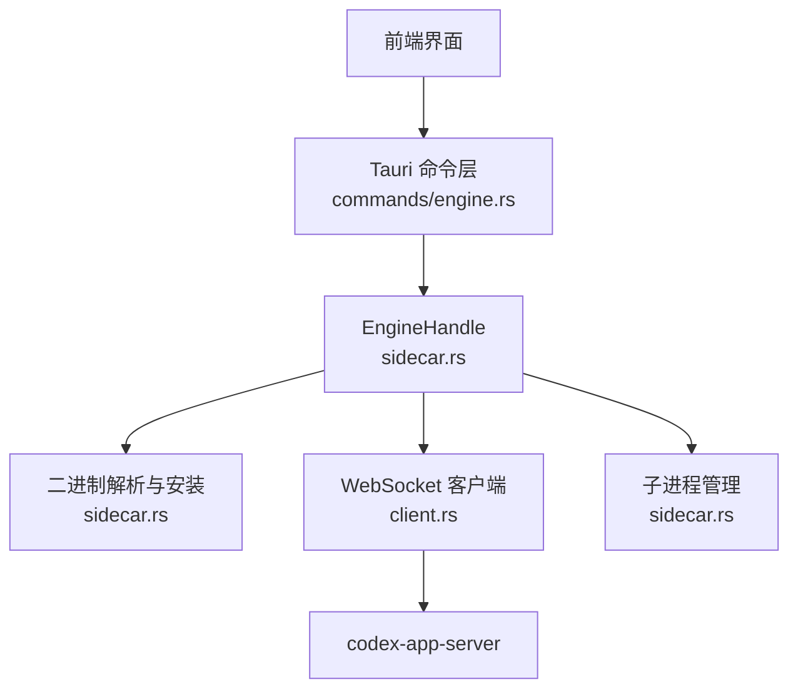
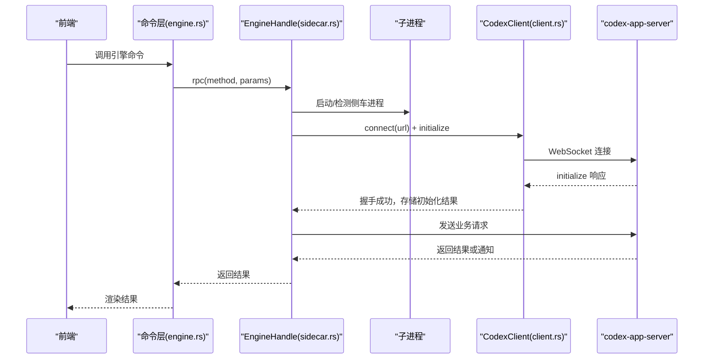
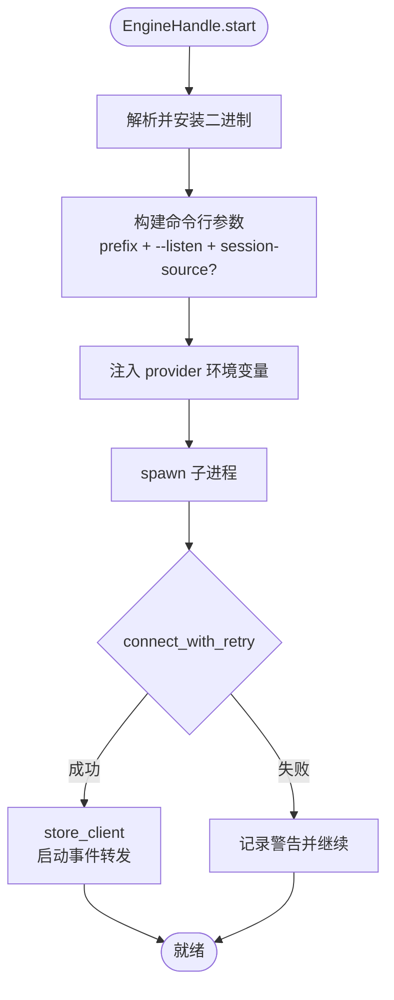
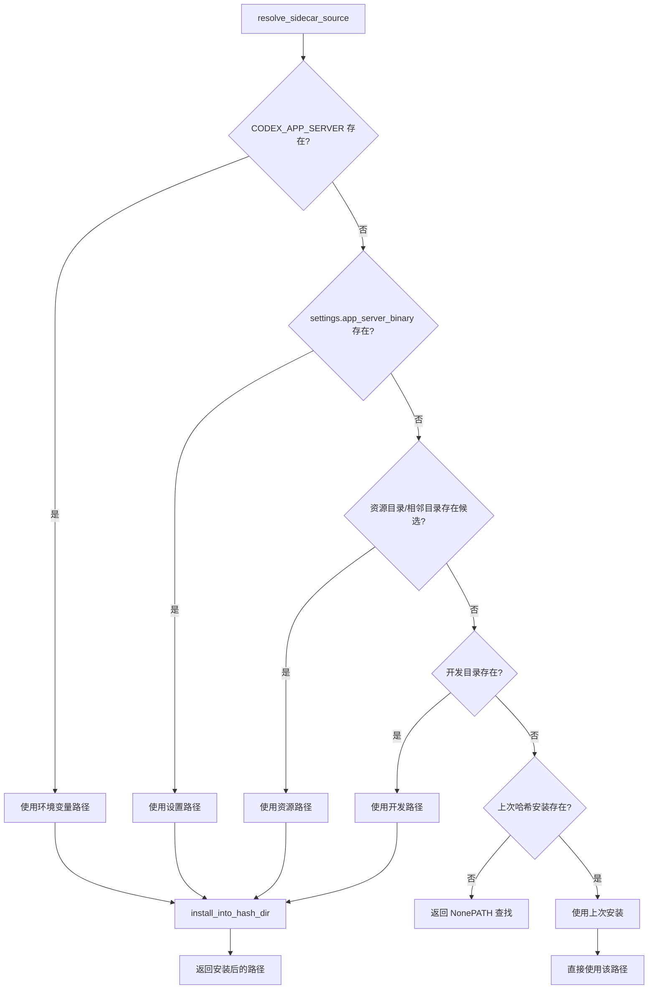
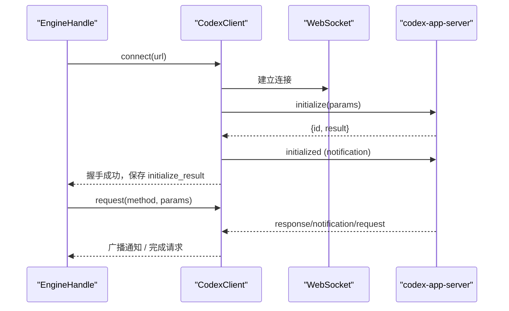
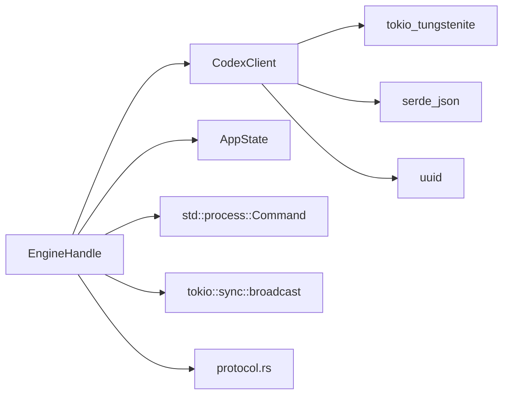

# Sidecar进程管理

<cite>
**本文引用的文件**
- [sidecar.rs](file://src-tauri/src/codex/sidecar.rs)
- [client.rs](file://src-tauri/src/codex/client.rs)
- [protocol.rs](file://src-tauri/src/codex/protocol.rs)
- [state.rs](file://src-tauri/src/state.rs)
- [engine.rs](file://src-tauri/src/commands/engine.rs)
</cite>

## 目录
1. [简介](#简介)
2. [项目结构](#项目结构)
3. [核心组件](#核心组件)
4. [架构总览](#架构总览)
5. [详细组件分析](#详细组件分析)
6. [依赖关系分析](#依赖关系分析)
7. [性能考虑](#性能考虑)
8. [故障排查指南](#故障排查指南)
9. [结论](#结论)

## 简介
本模块负责在 Tauri 应用中以 sidecar 方式启动、监控并管理与官方 codex-app-server 的通信。其核心职责包括：
- 二进制文件的解析与安装策略（内容哈希目录、多调用格式支持、环境变量注入）
- EngineHandle 的生命周期管理（启动、停止、连接重试、会话状态维护）
- 基于 WebSocket 的 JSON-RPC 进程间通信（连接重试、广播事件、错误恢复）
- 资源清理、异常处理与调试方法

## 项目结构
Sidecar 相关代码集中在 src-tauri/src/codex 目录下，并通过命令层暴露给前端：
- codex/sidecar.rs：EngineHandle 实现、sidecar 进程生命周期、二进制解析与安装
- codex/client.rs：WebSocket JSON-RPC 客户端、握手、请求/响应、通知广播
- codex/protocol.rs：协议常量、消息类型定义、服务端消息解析
- state.rs：本地状态与设置（包含 provider 密钥与环境变量名映射）
- commands/engine.rs：Tauri 命令封装，将 UI 操作转发到 EngineHandle

图表来源
- [sidecar.rs:22-276](file://src-tauri/src/codex/sidecar.rs#L22-L276)
- [client.rs:23-199](file://src-tauri/src/codex/client.rs#L23-L199)
- [engine.rs:13-28](file://src-tauri/src/commands/engine.rs#L13-L28)

章节来源
- [sidecar.rs:22-276](file://src-tauri/src/codex/sidecar.rs#L22-L276)
- [client.rs:23-199](file://src-tauri/src/codex/client.rs#L23-L199)
- [protocol.rs:103-156](file://src-tauri/src/codex/protocol.rs#L103-L156)
- [state.rs:27-47](file://src-tauri/src/state.rs#L27-L47)
- [engine.rs:13-28](file://src-tauri/src/commands/engine.rs#L13-L28)

## 核心组件
- EngineHandle：封装 sidecar 子进程、WebSocket 客户端、运行状态与事件广播通道，提供启动、RPC、响应、关闭等能力
- CodexClient：异步 WebSocket JSON-RPC 客户端，完成 initialize/initialized 握手，维护待处理请求映射与通知广播
- Protocol：定义 JSON-RPC 方法名、消息结构与解析逻辑
- State：应用本地状态，包含设置项（监听地址、二进制路径）、provider 密钥与环境变量名映射

章节来源
- [sidecar.rs:22-276](file://src-tauri/src/codex/sidecar.rs#L22-L276)
- [client.rs:23-199](file://src-tauri/src/codex/client.rs#L23-L199)
- [protocol.rs:103-156](file://src-tauri/src/codex/protocol.rs#L103-L156)
- [state.rs:27-47](file://src-tauri/src/state.rs#L27-L47)

## 架构总览
EngineHandle 作为 sidecar 管理器，负责：
- 启动 codex-app-server 子进程（可带前缀参数与环境变量）
- 通过 WebSocket 建立连接并完成握手
- 将服务端通知广播给订阅者
- 提供 RPC 接口与服务器请求响应机制
- 在关闭时释放子进程与连接资源

图表来源
- [engine.rs:13-28](file://src-tauri/src/commands/engine.rs#L13-L28)
- [sidecar.rs:32-125](file://src-tauri/src/codex/sidecar.rs#L32-L125)
- [client.rs:37-94](file://src-tauri/src/codex/client.rs#L37-L94)

## 详细组件分析

### EngineHandle 设计与生命周期
- 数据结构
  - child：子进程句柄（可选），用于存活检测与终止
  - client：CodexClient（可选），用于 JSON-RPC 通信
  - running：原子布尔，表示整体运行态
  - listen_url：监听地址（默认 ws://127.0.0.1:17457）
  - events_tx：稳定广播通道，独立于客户端重连，用于分发服务端通知
- 启动流程
  - 读取设置中的监听地址，若为空则使用默认值
  - 解析并安装二进制文件（见“二进制解析与安装”）
  - 构建命令行参数：根据多调用格式探测结果添加前缀（如 app-server），附加 --listen 与可选 --session-source
  - 注入 provider 密钥为环境变量（名称由 state::provider_env_key 生成）
  - 在 Windows 下隐藏控制台窗口
  - 启动子进程并记录日志
- 连接与重试
  - connect_with_retry：当检测到子进程存在时进行多次尝试连接，避免冷启动竞态导致首次请求失败
  - 每次失败后短暂休眠并重试，直到成功或达到预算次数
- 请求与响应
  - rpc：优先复用已连接客户端；否则自动连接并执行请求，成功后缓存客户端并启动事件转发
  - respond：向服务器回传审批/用户输入等请求的结果（按服务器请求 id）
- 监控与状态
  - is_running：结合 running 标志与客户端连接状态判断
  - subscribe：订阅稳定的事件广播通道
  - sidecar_alive：通过 try_wait 检查子进程是否仍在运行
- 关闭与资源清理
  - shutdown：关闭客户端连接、杀死并等待子进程退出、重置运行标志

图表来源
- [sidecar.rs:32-125](file://src-tauri/src/codex/sidecar.rs#L32-L125)
- [sidecar.rs:188-244](file://src-tauri/src/codex/sidecar.rs#L188-L244)
- [sidecar.rs:262-276](file://src-tauri/src/codex/sidecar.rs#L262-L276)

章节来源
- [sidecar.rs:22-276](file://src-tauri/src/codex/sidecar.rs#L22-L276)

### 二进制文件解析与安装策略
- 解析优先级
  - 环境变量 CODEX_APP_SERVER 指定绝对路径
  - 设置项 app_server_binary
  - 自包含安装包资源目录或 exe 相邻目录下的候选文件名（含 x86_64-pc-windows-msvc.exe）
  - 开发环境 CARGO_MANIFEST_DIR/binaries 下的二进制
  - 最后回退到之前内容哈希目录的最新安装
- 多调用格式支持
  - 通过 probe_invocation 调用 <bin> app-server --help 或 <bin> --help 来探测 CLI 形状
  - 若帮助文本包含 --listen，则判定为有效入口；同时检测是否支持 --session-source
  - 无法探测时回退到文件名启发式规则（非 codex-app-server* 视为多调用）
- 内容哈希目录管理
  - 计算源二进制内容的 FNV-1a 64 位哈希，作为安装目录名
  - 安装目标位于 %LOCALAPPDATA%\CodexDesktop\bin\<hash>\codex-app-server(.exe)
  - 写入采用临时文件+重命名保证原子性；Unix 平台设置可执行权限
  - latest_hash_dir_install 选择最近修改的安装版本
- 环境变量配置
  - provider 密钥不写入配置文件，而是通过 state::provider_env_key 生成环境变量名（如 CODEX_PROVIDER_<ID>_API_KEY）
  - 启动 sidecar 时将键值对注入子进程环境

图表来源
- [sidecar.rs:366-464](file://src-tauri/src/codex/sidecar.rs#L366-L464)
- [sidecar.rs:472-513](file://src-tauri/src/codex/sidecar.rs#L472-L513)
- [sidecar.rs:515-539](file://src-tauri/src/codex/sidecar.rs#L515-L539)
- [state.rs:8-25](file://src-tauri/src/state.rs#L8-L25)

章节来源
- [sidecar.rs:278-360](file://src-tauri/src/codex/sidecar.rs#L278-L360)
- [sidecar.rs:366-539](file://src-tauri/src/codex/sidecar.rs#L366-L539)
- [state.rs:8-25](file://src-tauri/src/state.rs#L8-L25)

### WebSocket 连接管理与进程间通信
- 连接建立与握手
  - connect：建立 WebSocket 连接，拆分读写任务
  - perform_initialize：发送 initialize 请求，等待响应后发送 initialized 通知，完成握手
  - 超时控制：initialize 超时 10s，普通请求超时 120s
- 请求/响应模型
  - request：生成唯一 id，注册 oneshot 通道等待响应，发送 JSON-RPC 请求
  - handle_text_frame：解析服务端消息，响应类消息完成 pending 请求，通知/请求类消息广播
- 事件广播与会话状态
  - notify_tx：广播服务端通知，EngineHandle 将其转发到稳定通道，供 UI 订阅
  - initialize_result：保存最后一次成功的 initialize 结果，便于 UI 读取元数据
- 错误恢复策略
  - connect_with_retry：针对首次连接竞态进行有限次重试，避免冷启动报错
  - store_client：新客户端建立后将事件转发到稳定通道，屏蔽客户端重连带来的中断
  - 关闭连接：close 发送关闭帧，reader 任务检测到 Close 后标记断开

图表来源
- [client.rs:37-94](file://src-tauri/src/codex/client.rs#L37-L94)
- [client.rs:148-199](file://src-tauri/src/codex/client.rs#L148-L199)
- [client.rs:201-234](file://src-tauri/src/codex/client.rs#L201-L234)
- [sidecar.rs:188-244](file://src-tauri/src/codex/sidecar.rs#L188-L244)

章节来源
- [client.rs:23-199](file://src-tauri/src/codex/client.rs#L23-L199)
- [protocol.rs:103-156](file://src-tauri/src/codex/protocol.rs#L103-L156)
- [sidecar.rs:136-168](file://src-tauri/src/codex/sidecar.rs#L136-L168)

### 进程资源清理、异常处理与调试方法
- 资源清理
  - shutdown：关闭客户端连接，杀死并等待子进程退出，重置运行标志
  - 子进程存活检测：sidecar_alive 使用 try_wait 判断进程是否仍在运行
- 异常处理
  - 启动失败：记录警告日志，保持断开状态，避免阻塞 UI
  - 连接失败：connect_with_retry 捕获错误并记录，最终返回错误信息
  - 请求超时：request 中设置超时，移除 pending 并返回错误
  - 事件滞后：store_client 的事件转发中记录跳过数量
- 调试方法
  - 启用 tracing 日志：启动、连接、错误、滞后等关键路径均有日志输出
  - 探针模式：probe_invocation 会执行 help 命令并记录探测结果
  - 环境变量覆盖：通过 CODEX_APP_SERVER 指定二进制路径，便于测试不同版本
  - 设置项覆盖：app_server_listen 与 app_server_binary 可调整监听地址与二进制位置

章节来源
- [sidecar.rs:177-276](file://src-tauri/src/codex/sidecar.rs#L177-L276)
- [client.rs:148-199](file://src-tauri/src/codex/client.rs#L148-L199)
- [client.rs:201-234](file://src-tauri/src/codex/client.rs#L201-L234)

## 依赖关系分析
- EngineHandle 依赖
  - CodexClient：用于 JSON-RPC 通信与事件广播
  - AppState：读取设置与 provider 密钥
  - std::process::Command：启动子进程
  - tokio::sync::broadcast：事件广播
- CodexClient 依赖
  - tokio_tungstenite：WebSocket 连接
  - futures_util：流与汇操作
  - serde_json：序列化/反序列化
  - uuid：生成请求 id
- protocol.rs 提供统一的方法名与消息结构，确保前后端一致

图表来源
- [sidecar.rs:22-276](file://src-tauri/src/codex/sidecar.rs#L22-L276)
- [client.rs:23-199](file://src-tauri/src/codex/client.rs#L23-L199)
- [protocol.rs:103-156](file://src-tauri/src/codex/protocol.rs#L103-L156)

章节来源
- [sidecar.rs:22-276](file://src-tauri/src/codex/sidecar.rs#L22-L276)
- [client.rs:23-199](file://src-tauri/src/codex/client.rs#L23-L199)
- [protocol.rs:103-156](file://src-tauri/src/codex/protocol.rs#L103-L156)

## 性能考虑
- 连接重试预算：首次连接最多 40 次尝试，间隔 250ms，避免长时间阻塞
- 事件广播容量：notify 与 engine 事件通道容量为 256，防止背压导致丢失
- 超时控制：initialize 10s，普通请求 120s，平衡用户体验与稳定性
- 二进制安装原子性：临时文件+重命名减少部分写入导致的损坏风险
- 多调用格式探测：仅在启动时执行一次，成本约 200ms

[本节为通用指导，无需特定文件引用]

## 故障排查指南
- 无法连接
  - 检查监听地址是否正确（默认 ws://127.0.0.1:17457）
  - 确认 sidecar 进程已启动且端口未被占用
  - 查看 connect_with_retry 日志，确认重试次数与错误信息
- 二进制未找到
  - 设置 CODEX_APP_SERVER 指向可用二进制
  - 检查 settings.app_server_binary 是否为空或无效
  - 确认资源目录或相邻目录中存在候选文件
- 多调用格式错误
  - 查看 probe_invocation 日志，确认是否识别为多调用或独立二进制
  - 若无法探测，检查二进制是否可执行及帮助文本是否包含 --listen
- 事件滞后
  - 关注 store_client 中关于 skipped 数量的警告，必要时增加广播容量或优化消费者速度
- 资源未释放
  - 确认 shutdown 被调用，检查子进程是否被 kill 并 wait
  - 验证客户端连接是否关闭

章节来源
- [sidecar.rs:188-244](file://src-tauri/src/codex/sidecar.rs#L188-L244)
- [sidecar.rs:262-276](file://src-tauri/src/codex/sidecar.rs#L262-L276)
- [client.rs:148-199](file://src-tauri/src/codex/client.rs#L148-L199)

## 结论
Sidecar 进程管理模块通过 EngineHandle 统一管理 sidecar 子进程与 WebSocket 通信，具备健壮的二进制解析与安装策略、可靠的重试与错误恢复机制，以及完善的资源清理与调试支持。该设计在保证用户体验的同时，提供了灵活的配置与扩展点，适用于桌面应用的复杂后端交互场景。