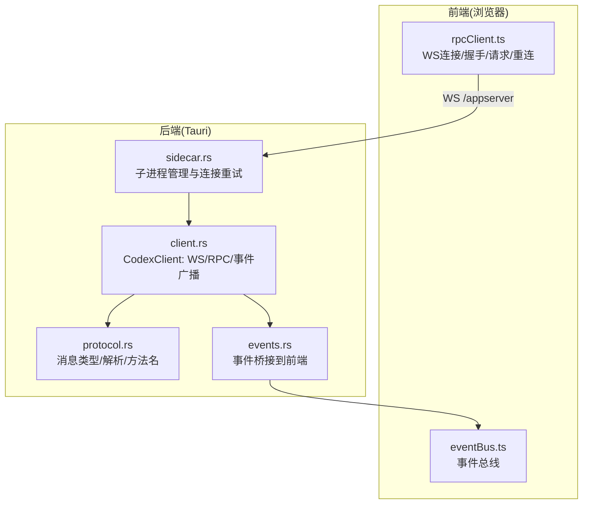
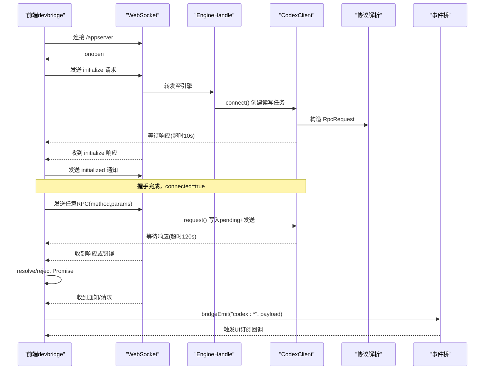
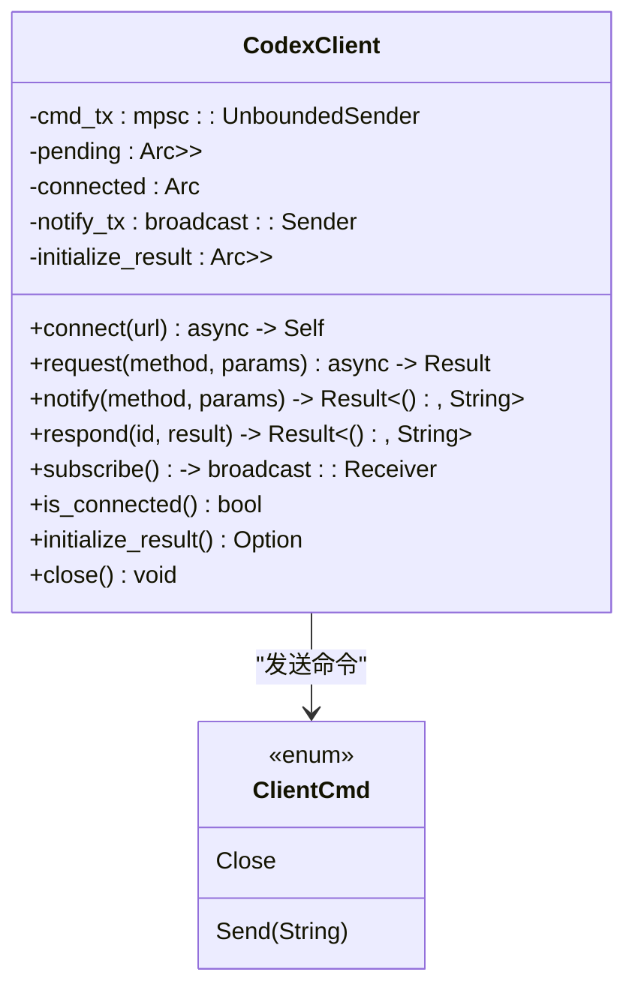
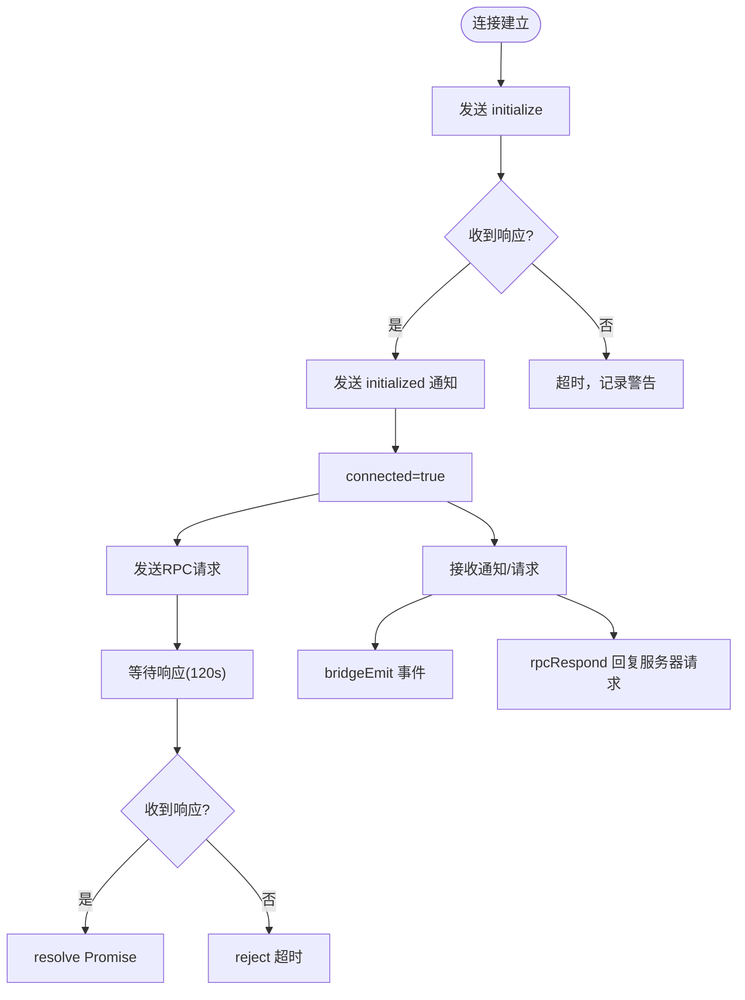
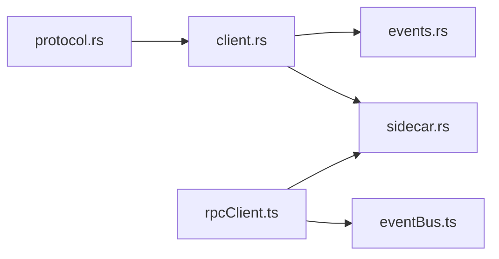

# WebSocket客户端

<cite>
**本文引用的文件**
- [client.rs](file://src-tauri/src/codex/client.rs)
- [protocol.rs](file://src-tauri/src/codex/protocol.rs)
- [events.rs](file://src-tauri/src/codex/events.rs)
- [sidecar.rs](file://src-tauri/src/codex/sidecar.rs)
- [rpcClient.ts](file://frontend/app/devbridge/rpcClient.ts)
- [eventBus.ts](file://frontend/app/devbridge/eventBus.ts)
</cite>

## 目录
1. [简介](#简介)
2. [项目结构](#项目结构)
3. [核心组件](#核心组件)
4. [架构总览](#架构总览)
5. [详细组件分析](#详细组件分析)
6. [依赖关系分析](#依赖关系分析)
7. [性能与可靠性](#性能与可靠性)
8. [故障排查指南](#故障排查指南)
9. [结论](#结论)
10. [附录：使用示例](#附录使用示例)

## 简介
本模块提供与 codex-app-server 的 WebSocket JSON-RPC 通信能力，包含后端 Rust 实现（Tauri 侧）与前端浏览器开发桥接实现。核心目标包括：
- 建立并维护 WebSocket 连接，完成 initialize/initialized 握手
- 发送 RPC 请求、接收响应与通知，处理服务器发起的请求（审批、用户输入等）
- 通过广播通道分发事件，支持多订阅者
- 管理连接生命周期、超时与重连策略
- 在 Tauri 端将引擎事件桥接到前端事件总线

## 项目结构
WebSocket 客户端由两部分组成：
- 后端 Rust 客户端：负责底层连接、RPC 协议编解码、事件广播、握手流程、超时控制
- 前端 devbridge：浏览器环境下的等价实现，封装连接、握手、请求、事件转发与自动重连

图表来源
- [rpcClient.ts:150-189](file://frontend/app/devbridge/rpcClient.ts#L150-L189)
- [sidecar.rs:195-244](file://src-tauri/src/codex/sidecar.rs#L195-L244)
- [client.rs:37-94](file://src-tauri/src/codex/client.rs#L37-L94)
- [protocol.rs:103-156](file://src-tauri/src/codex/protocol.rs#L103-L156)
- [events.rs:12-43](file://src-tauri/src/codex/events.rs#L12-L43)

章节来源
- [client.rs:1-234](file://src-tauri/src/codex/client.rs#L1-L234)
- [protocol.rs:1-207](file://src-tauri/src/codex/protocol.rs#L1-L207)
- [events.rs:1-82](file://src-tauri/src/codex/events.rs#L1-L82)
- [sidecar.rs:1-540](file://src-tauri/src/codex/sidecar.rs#L1-L540)
- [rpcClient.ts:1-230](file://frontend/app/devbridge/rpcClient.ts#L1-L230)
- [eventBus.ts:1-47](file://frontend/app/devbridge/eventBus.ts#L1-L47)

## 核心组件
- CodexClient（Rust）：封装 WebSocket 读写任务、RPC 请求映射、通知广播、初始化握手、超时控制、连接状态
- EngineHandle（Rust）：管理 sidecar 子进程、连接重试、事件广播稳定通道、对外 RPC 接口
- 协议层（Rust）：定义 JSON-RPC 请求/响应/错误、服务端消息枚举、方法名常量、解析器
- 事件桥（Rust）：将服务端消息转换为前端事件名称与载荷，统一命名规范
- 前端 devbridge（TypeScript）：浏览器端 WS 连接、握手、请求、事件分发、自动重连

章节来源
- [client.rs:23-199](file://src-tauri/src/codex/client.rs#L23-L199)
- [sidecar.rs:22-276](file://src-tauri/src/codex/sidecar.rs#L22-L276)
- [protocol.rs:103-207](file://src-tauri/src/codex/protocol.rs#L103-L207)
- [events.rs:12-82](file://src-tauri/src/codex/events.rs#L12-L82)
- [rpcClient.ts:20-230](file://frontend/app/devbridge/rpcClient.ts#L20-L230)

## 架构总览
整体数据流如下：
- 前端通过 WebSocket 连接到 Vite 代理路径 /appserver，实际转发到 codex-app-server
- 前端执行三步握手：initialize → 收到响应 → 发送 initialized 通知
- 后续所有 RPC 请求携带唯一 id，前端维护 pending 表与定时器
- 服务端响应按 id 匹配并 resolve/reject 对应 Promise
- 服务端通知与请求经事件桥转发为前端事件，供 UI 订阅
- 连接断开时前端自动重连，清理 pending 并恢复状态

图表来源
- [rpcClient.ts:70-101](file://frontend/app/devbridge/rpcClient.ts#L70-L101)
- [rpcClient.ts:103-148](file://frontend/app/devbridge/rpcClient.ts#L103-L148)
- [rpcClient.ts:201-221](file://frontend/app/devbridge/rpcClient.ts#L201-L221)
- [client.rs:37-94](file://src-tauri/src/codex/client.rs#L37-L94)
- [client.rs:148-170](file://src-tauri/src/codex/client.rs#L148-L170)
- [events.rs:51-82](file://src-tauri/src/codex/events.rs#L51-L82)

## 详细组件分析

### CodexClient（Rust）设计与实现
- 设计模式
  - 生产者-消费者：cmd_tx + mpsc 通道驱动写任务；read.next() 驱动读任务
  - 发布-订阅：broadcast::Sender<ServerMessage> 用于事件广播，容量固定避免内存膨胀
  - 请求-响应映射：pending map 以 id 为键存储 oneshot channel，响应到达后完成
- 关键流程
  - 连接与握手：connect() 建立 WS，perform_initialize() 发送 initialize，等待响应后发送 initialized 通知
  - RPC 请求：request() 生成唯一 id，序列化 RpcRequest，写入 pending，设置 REQUEST_TIMEOUT
  - 通知与响应：notify() 发送无 id 的通知；respond() 回复服务器发起的请求（审批/用户输入）
  - 连接状态：AtomicBool connected 标记当前连接是否存活；close() 发送关闭帧
- 复杂度与性能
  - pending map 查找 O(1)，广播通道 fan-out 为 O(n) 订阅者数量
  - 超时控制避免悬挂请求，防止资源泄漏
  - 文本帧解析集中处理，减少重复逻辑

图表来源
- [client.rs:23-35](file://src-tauri/src/codex/client.rs#L23-L35)
- [client.rs:37-199](file://src-tauri/src/codex/client.rs#L37-L199)

章节来源
- [client.rs:1-234](file://src-tauri/src/codex/client.rs#L1-L234)

### 协议层（protocol.rs）
- 数据结构
  - RpcRequest：id、method、可选 params
  - RpcResponse：id、result/error
  - RpcResultMessage：用于回复服务器请求（无 jsonrpc 字段）
  - ServerMessage：Response/Notification/Request 三种形态
- 解析逻辑
  - parse_server_message() 根据字段组合区分消息类型，兼容官方 app-server 协议
  - rpc_id_key() 标准化 id 为字符串键，适配整数/字符串 id
- 方法名常量
  - 涵盖线程、turn、配置、MCP、插件、命令执行、文件系统、项目等

章节来源
- [protocol.rs:1-207](file://src-tauri/src/codex/protocol.rs#L1-L207)

### 事件桥（events.rs）
- 功能
  - 启动后台任务订阅 EngineHandle 的稳定广播通道
  - 将 ServerMessage 映射为前端事件名称与载荷
  - 对 lagged 接收进行告警，避免阻塞
- 命名规则
  - 通知：codex:{method with / and . replaced by -}
  - 服务器请求：codex:approval / codex:user-input / codex:server-request-{sanitized}

章节来源
- [events.rs:1-82](file://src-tauri/src/codex/events.rs#L1-L82)

### EngineHandle（sidecar.rs）
- 职责
  - 启动/停止 codex-app-server 子进程
  - 管理 WebSocket 客户端实例，提供稳定的事件广播通道
  - 对外暴露 rpc() 与 respond() 接口，内部处理连接重试与热启动
- 连接重试
  - connect_with_retry() 在子进程存活时尝试多次连接，避免冷启动竞态
  - 首次成功后将客户端广播转发到 EngineHandle 的稳定通道
- 元数据与状态
  - initialize_meta() 返回握手结果
  - is_running() 综合子进程与客户端状态

章节来源
- [sidecar.rs:1-540](file://src-tauri/src/codex/sidecar.rs#L1-L540)

### 前端 devbridge（rpcClient.ts）
- 连接与握手
  - serverUrl() 计算 WS 地址，默认通过 Vite 代理 /appserver
  - performHandshake() 发送 initialize，等待响应后发送 initialized 通知
- 请求与响应
  - rpcRequest() 生成 id，发送请求，维护 pending Map 与超时定时器
  - handleMessage() 解析消息，区分服务器请求/通知/响应，路由到不同频道
- 事件分发
  - 服务器通知：bridgeEmit(`codex:${sanitize(method)}`, params)
  - 服务器请求：bridgeEmit(`codex:approval` / `codex:user-input` / `codex:server-request-${method}`)
- 重连策略
  - onclose 触发 scheduleReconnect()，固定延迟重连
  - 断线时 failAllPending() 清理并拒绝所有待处理请求

图表来源
- [rpcClient.ts:70-101](file://frontend/app/devbridge/rpcClient.ts#L70-L101)
- [rpcClient.ts:103-148](file://frontend/app/devbridge/rpcClient.ts#L103-L148)
- [rpcClient.ts:150-189](file://frontend/app/devbridge/rpcClient.ts#L150-L189)
- [rpcClient.ts:201-229](file://frontend/app/devbridge/rpcClient.ts#L201-L229)

章节来源
- [rpcClient.ts:1-230](file://frontend/app/devbridge/rpcClient.ts#L1-L230)
- [eventBus.ts:1-47](file://frontend/app/devbridge/eventBus.ts#L1-L47)

## 依赖关系分析
- 模块耦合
  - client.rs 依赖 protocol.rs 的消息类型与解析器
  - events.rs 依赖 EngineHandle 的稳定广播通道
  - sidecar.rs 依赖 client.rs 与 protocol.rs，并管理子进程生命周期
  - 前端 rpcClient.ts 依赖 eventBus.ts 进行事件分发
- 外部依赖
  - tokio_tungstenite：WebSocket 通信
  - tokio：异步运行时、通道、超时
  - serde_json：JSON 序列化/反序列化
  - uuid：请求 id 生成（后端）

图表来源
- [client.rs:8-15](file://src-tauri/src/codex/client.rs#L8-L15)
- [events.rs:7-9](file://src-tauri/src/codex/events.rs#L7-L9)
- [sidecar.rs:3-11](file://src-tauri/src/codex/sidecar.rs#L3-L11)
- [rpcClient.ts:20-20](file://frontend/app/devbridge/rpcClient.ts#L20-L20)

章节来源
- [client.rs:1-234](file://src-tauri/src/codex/client.rs#L1-L234)
- [protocol.rs:1-207](file://src-tauri/src/codex/protocol.rs#L1-L207)
- [events.rs:1-82](file://src-tauri/src/codex/events.rs#L1-L82)
- [sidecar.rs:1-540](file://src-tauri/src/codex/sidecar.rs#L1-L540)
- [rpcClient.ts:1-230](file://frontend/app/devbridge/rpcClient.ts#L1-L230)
- [eventBus.ts:1-47](file://frontend/app/devbridge/eventBus.ts#L1-L47)

## 性能与可靠性
- 超时控制
  - 初始化握手超时：10 秒
  - 普通 RPC 超时：120 秒
  - 前端同样实现相同超时，确保两端一致
- 事件广播容量
  - 后端广播通道容量 256，避免背压导致内存增长
  - 事件桥对 lagged 接收进行告警，提示下游消费慢
- 连接状态管理
  - AtomicBool 标记连接状态，避免并发竞争
  - 前端断线清理 pending 并拒绝所有请求，避免悬挂
- 重连策略
  - 前端固定延迟重连（2 秒），简单可靠
  - 后端 EngineHandle 在子进程存活时多次重试连接，缓解冷启动竞态

[本节为通用性能讨论，不直接分析具体文件]

## 故障排查指南
- 常见错误
  - 初始化超时：检查网络连通性与引擎是否就绪
  - RPC 超时：检查服务端处理耗时与网络状况
  - 连接关闭：检查 onclose 事件与重连逻辑
  - 事件丢失：检查事件桥 lagged 告警与订阅者消费速度
- 定位步骤
  - 查看日志输出中的连接、握手、超时、错误信息
  - 确认前端 engineConnected() 状态与 initialize 元数据
  - 检查事件频道名称是否符合命名规范（替换 / 和 . 为 -）
  - 验证服务器请求是否正确通过 rpcRespond() 回复

章节来源
- [client.rs:121-132](file://src-tauri/src/codex/client.rs#L121-L132)
- [client.rs:161-169](file://src-tauri/src/codex/client.rs#L161-L169)
- [rpcClient.ts:85-99](file://frontend/app/devbridge/rpcClient.ts#L85-L99)
- [rpcClient.ts:169-187](file://frontend/app/devbridge/rpcClient.ts#L169-L187)
- [events.rs:33-39](file://src-tauri/src/codex/events.rs#L33-L39)

## 结论
该 WebSocket 客户端模块在后端与前端分别实现了健壮的连接管理、RPC 协议处理与事件分发机制。通过严格的超时控制、广播通道与重连策略，确保了在高负载与不稳定网络环境下的稳定性。前后端语义对齐，便于开发与调试。

[本节为总结性内容，不直接分析具体文件]

## 附录：使用示例
- 后端 Rust 使用
  - 启动 EngineHandle：调用 start() 并获取 EngineHandle 实例
  - 发起 RPC：调用 rpc("method", Some(params)) 获取结果
  - 回复服务器请求：调用 respond(id, result)
  - 订阅事件：调用 subscribe() 获取 Receiver 并循环接收
  - 关闭：调用 shutdown() 释放资源
- 前端 TypeScript 使用
  - 连接与握手：模块自动连接并握手，可通过 engineConnected() 检查状态
  - 发起 RPC：调用 rpcRequest("method", params) 获取 Promise
  - 订阅事件：监听 codex:* 频道，如 codex:turn-completed
  - 回复服务器请求：调用 rpcRespond(id, result, error?)
  - 重连：模块自动处理，无需手动干预

章节来源
- [sidecar.rs:32-125](file://src-tauri/src/codex/sidecar.rs#L32-L125)
- [sidecar.rs:224-276](file://src-tauri/src/codex/sidecar.rs#L224-L276)
- [rpcClient.ts:193-229](file://frontend/app/devbridge/rpcClient.ts#L193-L229)