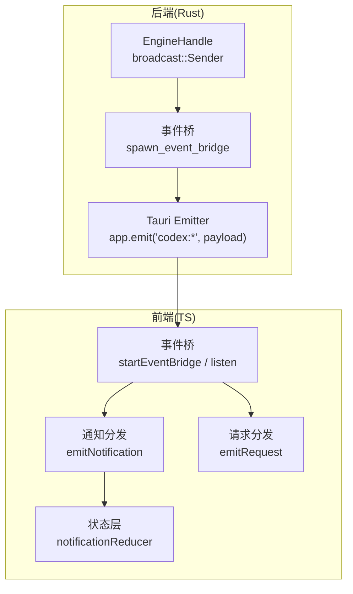
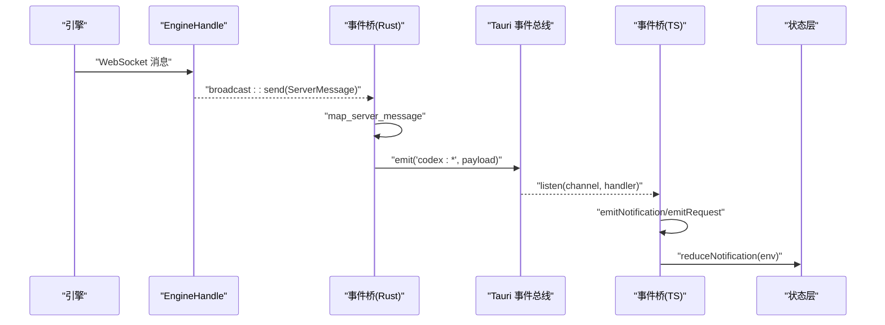
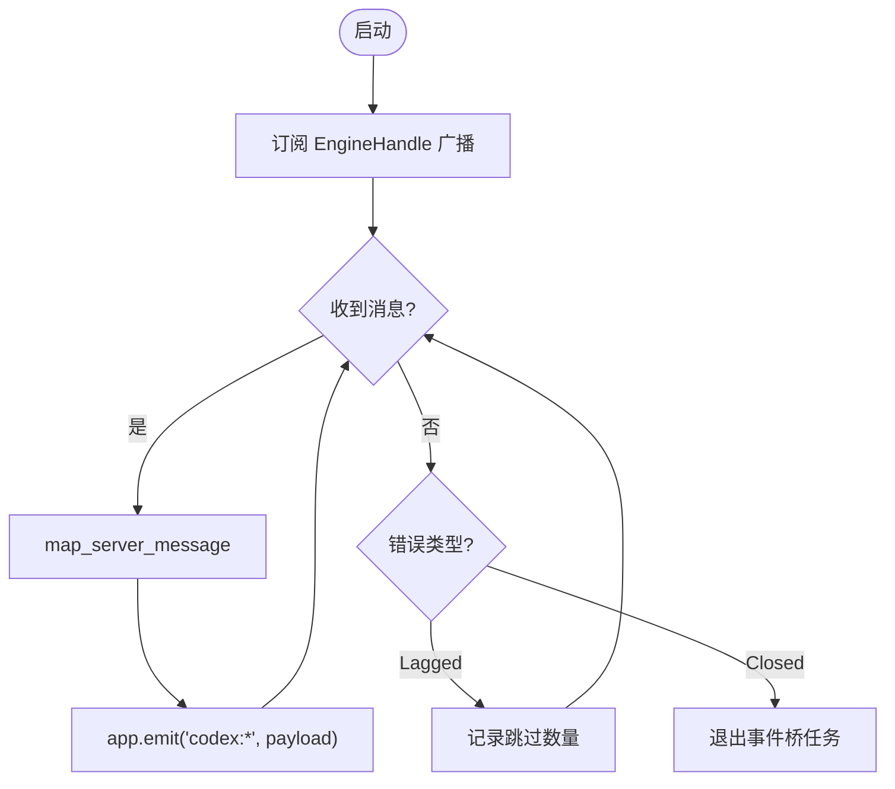
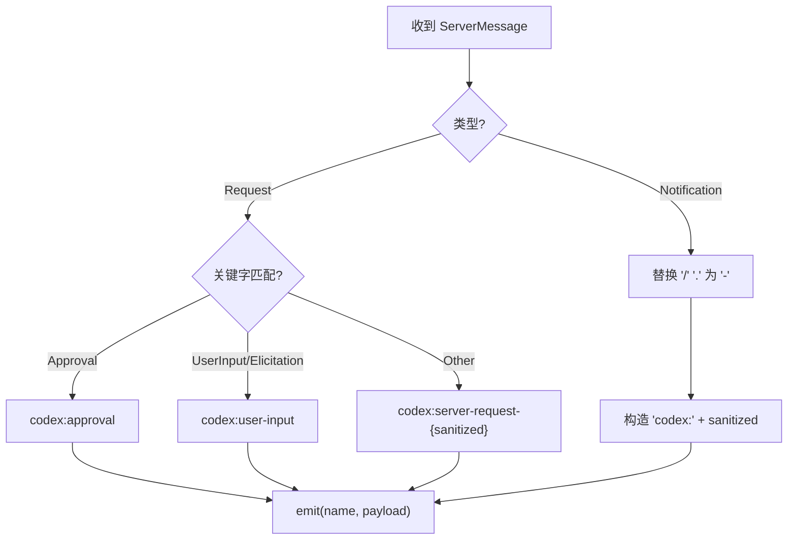
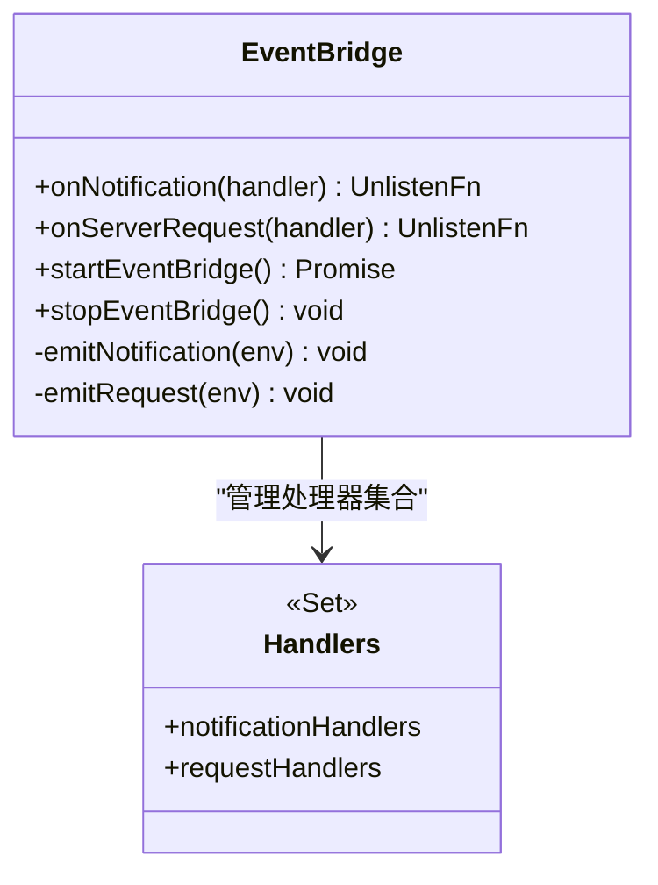
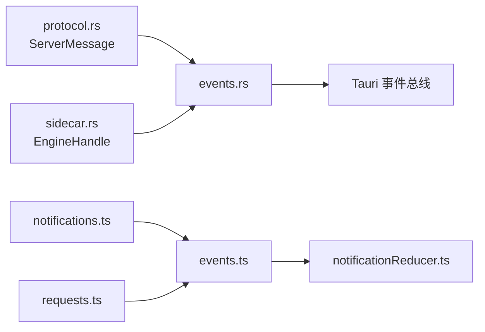

# 事件桥接系统

<cite>
**本文引用的文件**
- [events.rs](file://src-tauri/src/codex/events.rs)
- [protocol.rs](file://src-tauri/src/codex/protocol.rs)
- [sidecar.rs](file://src-tauri/src/codex/sidecar.rs)
- [mod.rs](file://src-tauri/src/codex/mod.rs)
- [events.ts](file://frontend/app/bridge/events.ts)
- [notifications.ts](file://frontend/src/protocol/notifications.ts)
- [requests.ts](file://frontend/src/protocol/requests.ts)
- [notificationReducer.ts](file://frontend/app/state/notificationReducer.ts)
</cite>

## 目录
1. [简介](#简介)
2. [项目结构](#项目结构)
3. [核心组件](#核心组件)
4. [架构总览](#架构总览)
5. [详细组件分析](#详细组件分析)
6. [依赖关系分析](#依赖关系分析)
7. [性能考量](#性能考量)
8. [故障排查指南](#故障排查指南)
9. [结论](#结论)
10. [附录](#附录)

## 简介
本文件为“事件桥接系统”的完整技术文档，聚焦以下目标：
- 说明 ServerMessage 类型定义与事件模型设计（事件分类、数据结构、版本兼容性）
- 解释事件广播机制（broadcast 通道使用、消费者管理、背压处理）
- 描述事件路由与过滤逻辑（分发策略、优先级、性能优化）
- 提供事件监听器的注册、注销、错误处理机制与最佳实践

该系统由后端 Rust 侧将引擎通知转发到前端 Tauri 事件，再由前端桥接统一分发给 UI 状态层。

## 项目结构
事件桥接横跨前后端：
- 后端（Rust）
  - 协议与消息：ServerMessage 枚举定义通知、请求、响应三类消息
  - 引擎句柄：EngineHandle 持有 broadcast::Sender，负责从客户端连接中消费并稳定扇出
  - 事件桥：spawn_event_bridge 订阅 EngineHandle 的广播，映射为 Tauri 事件名并 emit
- 前端（TypeScript）
  - 协议表：NOTIFICATION_METHODS、SERVER_REQUEST_METHODS 等生成式常量，驱动监听绑定
  - 事件桥：startEventBridge 批量绑定通知与请求通道，onNotification/onServerRequest 暴露给 UI
  - 状态层：notificationReducer 将通知映射为状态变更，未处理的方法记录为警告

图表来源
- [events.rs:12-43](file://src-tauri/src/codex/events.rs#L12-L43)
- [events.ts:145-159](file://frontend/app/bridge/events.ts#L145-L159)
- [sidecar.rs:22-29](file://src-tauri/src/codex/sidecar.rs#L22-L29)

章节来源
- [events.rs:1-82](file://src-tauri/src/codex/events.rs#L1-L82)
- [events.ts:1-172](file://frontend/app/bridge/events.ts#L1-L172)
- [sidecar.rs:22-168](file://src-tauri/src/codex/sidecar.rs#L22-L168)

## 核心组件
- ServerMessage（后端协议）
  - 三种变体：Response、Notification、Request
  - Notification 携带 method + params；Request 携带 id + method + params；Response 用于 JSON-RPC 应答
- EngineHandle（后端）
  - 维护 broadcast::Sender<ServerMessage>，容量固定，作为稳定的事件扇出点
  - subscribe() 返回 Receiver，供事件桥订阅
  - store_client 将客户端连接的广播转发到 EngineHandle 的稳定通道
- 事件桥（后端 events.rs）
  - 启动后延迟获取 EngineHandle，订阅其广播
  - map_server_message 将 Notification/Request 映射为 Tauri 事件名与负载
  - 对 Lagged/Closed 错误进行日志与退出处理
- 事件桥（前端 events.ts）
  - startEventBridge 并行绑定所有 NOTIFICATION_METHODS 与两个请求通道
  - onNotification/onServerRequest 提供注册/注销能力
  - emitNotification/emitRequest 遍历处理器集合，捕获异常避免单点失败影响整体
- 协议表（前端）
  - notifications.ts 生成 NOTIFICATION_METHODS、EXPERIMENTAL_NOTIFICATION_METHODS、NOTIFICATION_VARIANTS
  - requests.ts 生成 SERVER_REQUEST_METHODS、APPROVAL_REQUEST_METHODS、USER_INPUT_REQUEST_METHODS
- 状态层（前端）
  - notificationReducer 实现每个通知的处理分支，未覆盖方法以警告形式记录

章节来源
- [protocol.rs:122-156](file://src-tauri/src/codex/protocol.rs#L122-L156)
- [sidecar.rs:22-168](file://src-tauri/src/codex/sidecar.rs#L22-L168)
- [events.rs:12-82](file://src-tauri/src/codex/events.rs#L12-L82)
- [events.ts:1-172](file://frontend/app/bridge/events.ts#L1-L172)
- [notifications.ts:1-222](file://frontend/src/protocol/notifications.ts#L1-L222)
- [requests.ts:23-49](file://frontend/src/protocol/requests.ts#L23-L49)
- [notificationReducer.ts:128-183](file://frontend/app/state/notificationReducer.ts#L128-L183)

## 架构总览
事件从后端引擎经 WebSocket 到达 sidecar 进程，再通过 EngineHandle 的 broadcast 通道扇出到事件桥，最终通过 Tauri 事件投递到前端，由前端桥接统一分发到状态层。

图表来源
- [sidecar.rs:146-168](file://src-tauri/src/codex/sidecar.rs#L146-L168)
- [events.rs:24-43](file://src-tauri/src/codex/events.rs#L24-L43)
- [events.ts:99-139](file://frontend/app/bridge/events.ts#L99-L139)
- [notificationReducer.ts:189-200](file://frontend/app/state/notificationReducer.ts#L189-L200)

## 详细组件分析

### ServerMessage 类型与事件模型
- 事件分类
  - 通知（Notification）：单向推送，如 turn/started、item/agentMessage/delta 等
  - 请求（Request）：需要客户端回复，如 approval、user-input、elicitation 等
  - 响应（Response）：JSON-RPC 应答，不对外广播
- 数据结构
  - Notification：method + params
  - Request：id + method + params
  - Response：id + result/error
- 版本兼容性
  - 前端通过生成式协议表（notifications.ts、requests.ts）约束可接收的方法集
  - 未知方法在前端被拒绝或记录警告，避免破坏性升级导致崩溃
  - 实验性功能通过 EXPERIMENTAL_NOTIFICATION_METHODS 标记，便于灰度控制

章节来源
- [protocol.rs:122-156](file://src-tauri/src/codex/protocol.rs#L122-L156)
- [notifications.ts:11-95](file://frontend/src/protocol/notifications.ts#L11-L95)
- [notifications.ts:99-127](file://frontend/src/protocol/notifications.ts#L99-L127)
- [requests.ts:23-49](file://frontend/src/protocol/requests.ts#L23-L49)

### 事件广播机制（broadcast 通道、消费者、背压）
- 广播通道
  - EngineHandle 内部维护 broadcast::Sender<ServerMessage>，容量固定（EVENT_CAPACITY=256）
  - 新客户端连接时，store_client 将其订阅流转发到 EngineHandle 的稳定通道
- 消费者管理
  - 后端事件桥 spawn_event_bridge 在应用启动时订阅一次，循环 recv 并 emit
  - 前端 startEventBridge 并行绑定所有通知方法与两个请求通道，收集 unlisteners 以便统一注销
- 背压处理
  - 后端事件桥遇到 Lagged 时记录跳过数量，继续消费最新数据
  - 前端处理器遍历调用，单个处理器抛错不影响其他处理器执行
  - 前端监听绑定失败仅记录错误，不中断其余通道的绑定

图表来源
- [events.rs:24-43](file://src-tauri/src/codex/events.rs#L24-L43)
- [sidecar.rs:146-168](file://src-tauri/src/codex/sidecar.rs#L146-L168)
- [events.ts:145-171](file://frontend/app/bridge/events.ts#L145-L171)

章节来源
- [events.rs:12-43](file://src-tauri/src/codex/events.rs#L12-L43)
- [sidecar.rs:22-168](file://src-tauri/src/codex/sidecar.rs#L22-L168)
- [events.ts:52-87](file://frontend/app/bridge/events.ts#L52-L87)

### 事件路由与过滤逻辑
- 事件分发策略
  - 后端 map_server_message 将 Notification 映射为 codex:{method with / and . replaced by -}
  - Request 根据关键字路由到专用通道：
    - 包含 Approval → codex:approval
    - 包含 userInput/requestUserInput/elicitation → codex:user-input
    - 其他 → codex:server-request-{sanitized}
- 优先级处理
  - 无显式优先级队列；按到达顺序处理
  - 前端处理器集合无序，建议关键路径处理器保持轻量
- 性能优化
  - 后端使用固定容量广播通道，避免阻塞上游
  - 前端并行绑定所有通道，减少启动时间
  - 状态层对未处理的方法记录警告，便于快速发现缺失

图表来源
- [events.rs:45-81](file://src-tauri/src/codex/events.rs#L45-L81)
- [events.ts:23-30](file://frontend/app/bridge/events.ts#L23-L30)

章节来源
- [events.rs:45-81](file://src-tauri/src/codex/events.rs#L45-L81)
- [events.ts:99-139](file://frontend/app/bridge/events.ts#L99-L139)

### 事件监听器注册、注销与错误处理
- 注册
  - onNotification(handler)：添加通知处理器，返回注销函数
  - onServerRequest(handler)：添加请求处理器，返回注销函数
- 注销
  - stopEventBridge：遍历 unlisteners 调用对应的取消监听函数
  - 各处理器可通过返回的注销函数自行移除
- 错误处理
  - emitNotification/emitRequest 包裹 try/catch，记录错误但不中断后续处理器
  - 前端监听绑定失败仅记录错误，不中断其余通道绑定
  - 后端事件桥对 Lagged/Closed 分别记录并退出

图表来源
- [events.ts:52-87](file://frontend/app/bridge/events.ts#L52-L87)
- [events.ts:145-171](file://frontend/app/bridge/events.ts#L145-L171)

章节来源
- [events.ts:52-87](file://frontend/app/bridge/events.ts#L52-L87)
- [events.ts:145-171](file://frontend/app/bridge/events.ts#L145-L171)

### 状态层与覆盖率保障
- 状态层将通知映射为具体状态更新，未处理的方法记录为警告
- 脚本 verify-notification-coverage.mjs 校验协议方法是否全部被处理或标记为环境方法
- 有助于在协议演进时及时发现遗漏

章节来源
- [notificationReducer.ts:1-10](file://frontend/app/state/notificationReducer.ts#L1-L10)
- [notificationReducer.ts:128-183](file://frontend/app/state/notificationReducer.ts#L128-L183)
- [verify-notification-coverage.mjs:37-83](file://scripts/verify-notification-coverage.mjs#L37-L83)

## 依赖关系分析
- 模块耦合
  - events.rs 依赖 protocol.rs 的 ServerMessage 与 sidecar.rs 的 EngineHandle
  - events.ts 依赖生成的协议表（notifications.ts、requests.ts）
  - notificationReducer.ts 依赖 events.ts 的 NotificationEnvelope
- 外部依赖
  - Tauri 事件总线用于跨进程通信
  - tokio::sync::broadcast 用于高效扇出
- 潜在循环依赖
  - 当前结构清晰，未见循环依赖

图表来源
- [events.rs:7-9](file://src-tauri/src/codex/events.rs#L7-L9)
- [events.ts:13-21](file://frontend/app/bridge/events.ts#L13-L21)
- [notificationReducer.ts:12-15](file://frontend/app/state/notificationReducer.ts#L12-L15)

章节来源
- [mod.rs:1-9](file://src-tauri/src/codex/mod.rs#L1-L9)
- [events.rs:7-9](file://src-tauri/src/codex/events.rs#L7-L9)
- [events.ts:13-21](file://frontend/app/bridge/events.ts#L13-L21)

## 性能考量
- 广播容量
  - EVENT_CAPACITY=256，适合高频通知场景；若持续 Lagged，需评估消费者处理速度或调整容量
- 并行绑定
  - 前端 startEventBridge 并行绑定所有通知通道，缩短启动时间
- 处理器隔离
  - 单个处理器异常不影响其他处理器，提升鲁棒性
- 事件命名转换
  - 后端将 / 和 . 替换为 -，避免 Tauri 事件名限制，减少解析开销

[本节提供通用指导，无需特定文件引用]

## 故障排查指南
- 常见症状与定位
  - 事件丢失：检查后端 Lagged 日志，确认消费者是否过慢
  - 通道绑定失败：查看前端控制台错误，确认 Tauri 事件名是否正确
  - 未知方法：前端会记录警告，确保协议表已更新且状态层已处理
- 调试步骤
  - 启用 tracing/console 日志，观察事件桥生命周期
  - 验证 NOTIFICATION_METHODS 与状态层覆盖情况
  - 检查 EngineHandle 是否成功连接并转发消息

章节来源
- [events.rs:33-40](file://src-tauri/src/codex/events.rs#L33-L40)
- [events.ts:110-113](file://frontend/app/bridge/events.ts#L110-L113)
- [events.ts:124-127](file://frontend/app/bridge/events.ts#L124-L127)
- [notificationReducer.ts:437-443](file://frontend/app/state/notificationReducer.ts#L437-L443)

## 结论
该事件桥接系统通过稳定的广播通道与前后端协作，实现了高吞吐、低耦合的事件分发。ServerMessage 明确区分通知与请求，前端通过生成式协议表保证类型安全与可扩展性。背压与错误处理机制提升了系统的鲁棒性。建议在新增协议方法时同步更新状态层处理，并利用覆盖率脚本保障一致性。

[本节总结性内容，无需特定文件引用]

## 附录
- 事件命名规范
  - 后端将 method 中的 / 和 . 替换为 -，前缀 codex:
  - 前端 tauriEventName 保持一致的转换规则
- 最佳实践
  - 处理器保持轻量，避免阻塞主线程
  - 对高频通知考虑节流或批处理
  - 使用 onNotification/onServerRequest 的返回值进行精确注销
  - 新增协议方法后立即补充状态层处理，并通过覆盖率脚本验证

[本节提供通用指导，无需特定文件引用]