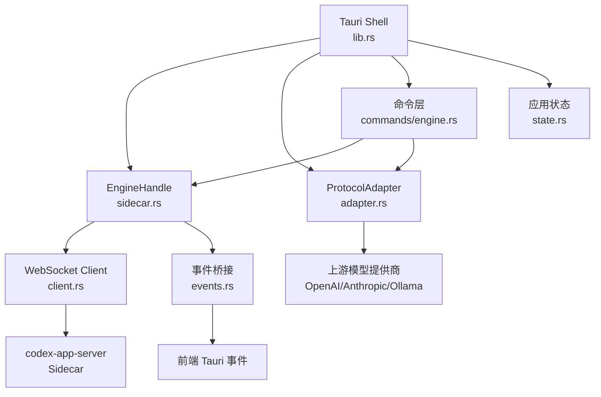
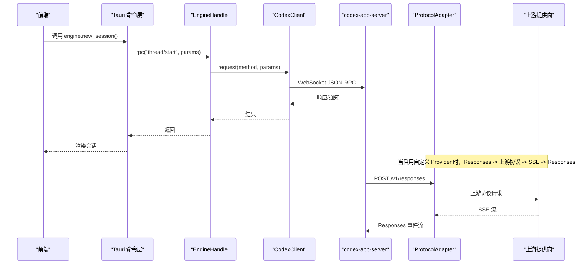
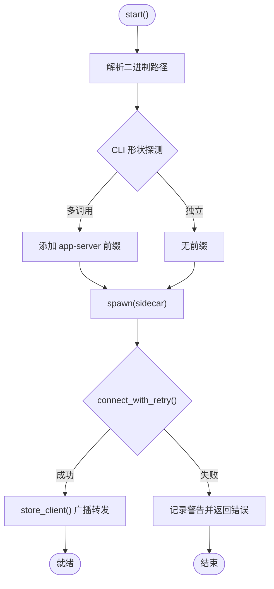
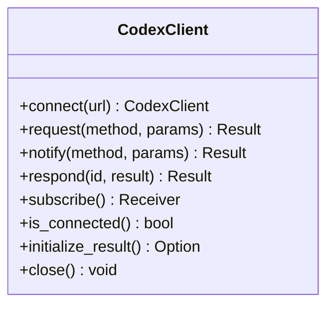
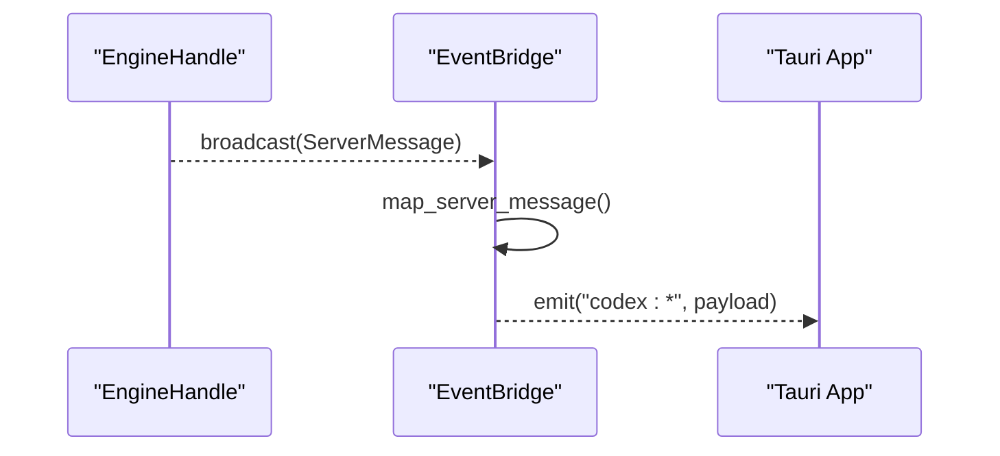
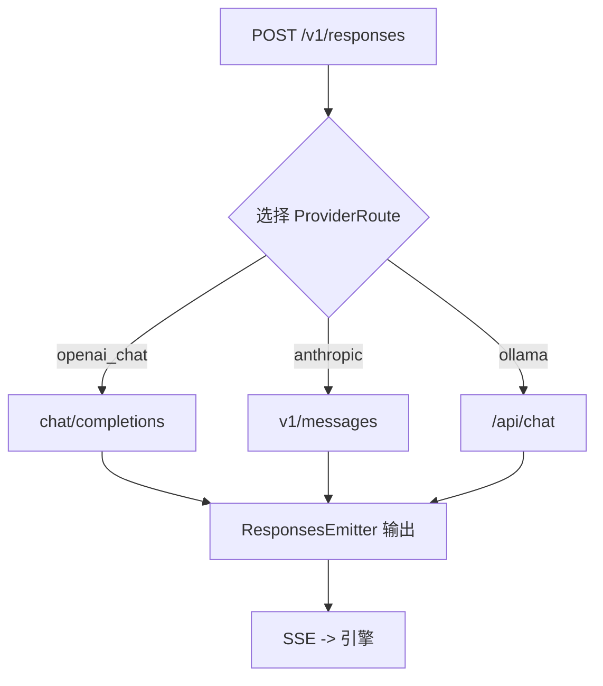
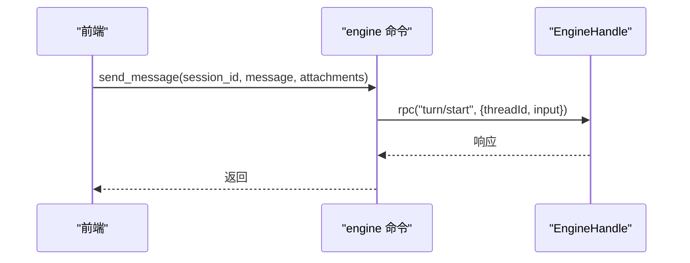
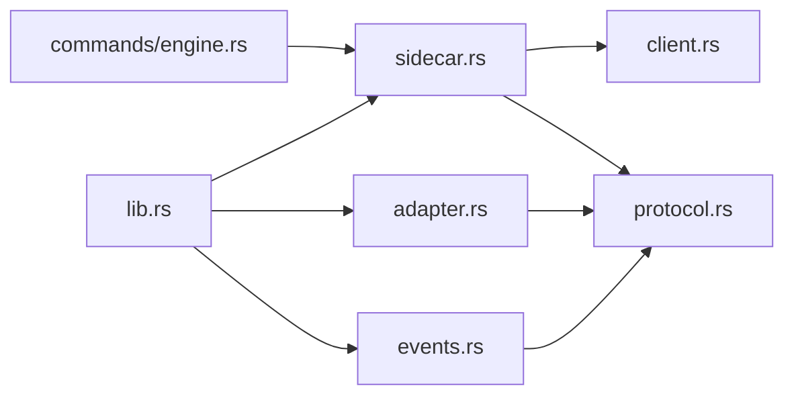

# 引擎管理系统

<cite>
**本文引用的文件**
- [src-tauri/src/codex/mod.rs](file://src-tauri/src/codex/mod.rs)
- [src-tauri/src/codex/sidecar.rs](file://src-tauri/src/codex/sidecar.rs)
- [src-tauri/src/codex/client.rs](file://src-tauri/src/codex/client.rs)
- [src-tauri/src/codex/protocol.rs](file://src-tauri/src/codex/protocol.rs)
- [src-tauri/src/codex/events.rs](file://src-tauri/src/codex/events.rs)
- [src-tauri/src/codex/adapter.rs](file://src-tauri/src/codex/adapter.rs)
- [src-tauri/src/commands/engine.rs](file://src-tauri/src/commands/engine.rs)
- [src-tauri/src/state.rs](file://src-tauri/src/state.rs)
- [src-tauri/src/lib.rs](file://src-tauri/src/lib.rs)
- [README.md](file://README.md)
</cite>

## 目录
1. [简介](#简介)
2. [项目结构](#项目结构)
3. [核心组件](#核心组件)
4. [架构总览](#架构总览)
5. [详细组件分析](#详细组件分析)
6. [依赖关系分析](#依赖关系分析)
7. [性能与可靠性](#性能与可靠性)
8. [故障排除指南](#故障排除指南)
9. [结论](#结论)
10. [附录：集成与配置](#附录：集成与配置)

## 简介
本系统以 Tauri v2 为桌面壳，通过启动官方 codex-app-server 作为 Sidecar 进程，使用 WebSocket JSON-RPC 与其通信。EngineHandle 负责 Sidecar 生命周期管理、二进制解析与安装、连接重试、RPC 请求转发、事件桥接（通知/请求/响应）以及资源清理。ProtocolAdapter 提供本地 HTTP 网关，将 Codex Responses 协议适配到 OpenAI Chat、Anthropic Messages、Ollama 等上游模型提供商，实现统一接入。

## 项目结构
- 后端入口与初始化：lib.rs
- 引擎侧车与客户端：codex/sidecar.rs、codex/client.rs、codex/protocol.rs
- 事件桥接：codex/events.rs
- 协议适配器：codex/adapter.rs
- 命令层（IPC 暴露）：commands/engine.rs
- 应用状态与设置：state.rs
- 顶层模块导出：codex/mod.rs
- 项目说明：README.md

图表来源
- [src-tauri/src/lib.rs:23-68](file://src-tauri/src/lib.rs#L23-L68)
- [src-tauri/src/codex/sidecar.rs:22-125](file://src-tauri/src/codex/sidecar.rs#L22-L125)
- [src-tauri/src/codex/client.rs:37-94](file://src-tauri/src/codex/client.rs#L37-L94)
- [src-tauri/src/codex/adapter.rs:85-111](file://src-tauri/src/codex/adapter.rs#L85-L111)
- [src-tauri/src/codex/events.rs:11-43](file://src-tauri/src/codex/events.rs#L11-L43)
- [src-tauri/src/commands/engine.rs:13-20](file://src-tauri/src/commands/engine.rs#L13-L20)
- [src-tauri/src/state.rs:150-174](file://src-tauri/src/state.rs#L150-L174)

章节来源
- [README.md:1-58](file://README.md#L1-L58)
- [src-tauri/src/lib.rs:1-162](file://src-tauri/src/lib.rs#L1-L162)

## 核心组件
- EngineHandle：封装 Sidecar 进程启动、二进制解析与安装、WebSocket 连接与握手、RPC 调用、事件广播、关闭与资源释放。
- CodexClient：异步 WebSocket JSON-RPC 客户端，维护待处理请求映射、通知广播、initialize 握手与超时控制。
- ProtocolAdapter：本地 HTTP 服务器，接收 Codex Responses 请求并转发到上游提供商，再将 SSE 流转换为 Responses 事件流。
- 事件桥接：订阅 EngineHandle 的稳定广播通道，将服务端通知/请求映射为前端可消费的 Tauri 事件。
- 命令层：将前端 IPC 调用映射到 EngineHandle/CodexClient 的 RPC 方法，并提供会话、消息、审批、MCP、插件、Shell 等能力。
- 应用状态：持久化设置、偏好、Provider 密钥与路由信息，供启动时恢复。

章节来源
- [src-tauri/src/codex/sidecar.rs:22-276](file://src-tauri/src/codex/sidecar.rs#L22-L276)
- [src-tauri/src/codex/client.rs:23-199](file://src-tauri/src/codex/client.rs#L23-L199)
- [src-tauri/src/codex/adapter.rs:30-111](file://src-tauri/src/codex/adapter.rs#L30-L111)
- [src-tauri/src/codex/events.rs:11-82](file://src-tauri/src/codex/events.rs#L11-L82)
- [src-tauri/src/commands/engine.rs:22-800](file://src-tauri/src/commands/engine.rs#L22-L800)
- [src-tauri/src/state.rs:150-331](file://src-tauri/src/state.rs#L150-L331)

## 架构总览
系统采用“壳-引擎-适配器”分层：
- 壳（Tauri）：负责 UI、IPC、状态持久化、Sidecar 生命周期。
- 引擎（codex-app-server）：通过 WebSocket JSON-RPC 提供线程、回合、配置、MCP、插件、Shell 等能力。
- 适配器（ProtocolAdapter）：将 Responses 协议适配到不同上游模型提供商，屏蔽差异。

图表来源
- [src-tauri/src/commands/engine.rs:30-52](file://src-tauri/src/commands/engine.rs#L30-L52)
- [src-tauri/src/codex/sidecar.rs:224-244](file://src-tauri/src/codex/sidecar.rs#L224-L244)
- [src-tauri/src/codex/client.rs:148-170](file://src-tauri/src/codex/client.rs#L148-L170)
- [src-tauri/src/codex/adapter.rs:162-219](file://src-tauri/src/codex/adapter.rs#L162-L219)

## 详细组件分析

### EngineHandle：Sidecar 进程生命周期管理与 RPC 封装
- 二进制解析与安装：
  - 支持环境变量覆盖、设置项指定、安装包资源、可执行文件相邻目录、开发目录、历史哈希目录等多优先级查找。
  - 内容寻址安装：对源二进制计算 FNV-1a 哈希，写入 %LOCALAPPDATA%\CodexDesktop\bin\<hash>\，原子写入避免损坏。
  - CLI 探测：通过运行 --help 判断多调用（codex.exe app-server）或独立二进制，决定是否传递 --session-source。
- 进程启动与参数：
  - 注入 Provider 密钥为环境变量（如 CODEX_PROVIDER_XXX_API_KEY），避免明文写入配置文件。
  - Windows 下隐藏控制台窗口。
- 连接与重试：
  - connect_with_retry 在首次冷启动时多次尝试连接，避免 sidecar 尚未绑定端口导致的瞬时失败。
- RPC 与事件：
  - 每次请求若未连接则自动连接；成功后缓存客户端并启动广播转发任务，将客户端通知广播复制到 EngineHandle 的稳定广播通道。
  - 支持 respond 回写服务端请求（审批、用户输入）。
- 资源清理：
  - shutdown 关闭 WebSocket 连接、终止子进程、重置运行标志。

图表来源
- [src-tauri/src/codex/sidecar.rs:31-125](file://src-tauri/src/codex/sidecar.rs#L31-L125)
- [src-tauri/src/codex/sidecar.rs:188-222](file://src-tauri/src/codex/sidecar.rs#L188-L222)
- [src-tauri/src/codex/sidecar.rs:262-276](file://src-tauri/src/codex/sidecar.rs#L262-L276)

章节来源
- [src-tauri/src/codex/sidecar.rs:22-540](file://src-tauri/src/codex/sidecar.rs#L22-L540)

### CodexClient：WebSocket JSON-RPC 客户端
- 连接与握手：
  - 建立 WebSocket 后执行 initialize 请求，等待响应后发送 initialized 通知完成握手。
  - 维护 initialize_result 以便后续查询元数据。
- 请求/响应：
  - 每个请求生成唯一 id，放入 pending map，等待响应或错误。
  - 请求超时与响应通道关闭均有明确错误处理。
- 通知与广播：
  - 读取服务端帧，区分 Response/Notification/Request，Response 完成 pending，其他类型广播给订阅者。
- 服务端请求应答：
  - respond 发送 JSON-RPC result 给服务端，用于审批、用户输入等场景。

图表来源
- [src-tauri/src/codex/client.rs:23-199](file://src-tauri/src/codex/client.rs#L23-L199)
- [src-tauri/src/codex/protocol.rs:103-156](file://src-tauri/src/codex/protocol.rs#L103-L156)

章节来源
- [src-tauri/src/codex/client.rs:1-234](file://src-tauri/src/codex/client.rs#L1-L234)
- [src-tauri/src/codex/protocol.rs:1-207](file://src-tauri/src/codex/protocol.rs#L1-L207)

### 事件桥接：通知/请求/响应的转发与过滤
- 订阅 EngineHandle 的稳定广播通道，将 ServerMessage 映射为 Tauri 事件：
  - 通知：method 中的 “/” 或 “.” 替换为 “-”，形成 codex:* 事件名。
  - 请求：审批类映射为 codex:approval，用户输入类映射为 codex:user-input，其他映射为 codex:server-request-*。
  - 响应：不转发。
- 容错：忽略 lagged 丢失的事件，关闭通道时优雅退出。

图表来源
- [src-tauri/src/codex/events.rs:11-82](file://src-tauri/src/codex/events.rs#L11-L82)

章节来源
- [src-tauri/src/codex/events.rs:1-82](file://src-tauri/src/codex/events.rs#L1-82)

### 协议适配器：Responses -> 上游协议 -> Responses
- 监听本地 HTTP 端口，接收 POST /v1/responses。
- 根据配置的 ProviderRoute 选择上游协议：
  - openai_chat：转 chat/completions，聚合 tool_calls delta，输出 Responses 事件流。
  - anthropic：转 v1/messages，处理 content_block_* 事件，输出 Responses 事件流。
  - ollama：转 /api/chat，处理 message.tool_calls，输出 Responses 事件流。
- ResponsesEmitter：按规范输出 response.created、output_item.added/done、output_text.delta、response.completed 等事件。
- 错误处理：上游不可达或错误返回 502/4xx，并附带错误体。

图表来源
- [src-tauri/src/codex/adapter.rs:162-219](file://src-tauri/src/codex/adapter.rs#L162-L219)
- [src-tauri/src/codex/adapter.rs:222-601](file://src-tauri/src/codex/adapter.rs#L222-L601)
- [src-tauri/src/codex/adapter.rs:604-724](file://src-tauri/src/codex/adapter.rs#L604-L724)

章节来源
- [src-tauri/src/codex/adapter.rs:1-800](file://src-tauri/src/codex/adapter.rs#L1-L800)

### 命令层：IPC 到引擎能力的映射
- 会话管理：new_session、list_sessions、get_session、delete_session、archive/unarchive。
- 消息与中断：send_message、interrupt_session。
- 审批与用户输入：resolve_approval、respond_server_request。
- 配置与模型：list_providers、save_provider、probe_provider。
- MCP：list_mcp_servers、save_mcp_server、test_mcp_connection、set_mcp_server_enabled。
- 技能与插件：list_skills、reload_skills、list_plugins、set_plugin_enabled。
- Shell：open_shell、write_shell、read_shell、close_shell。

图表来源
- [src-tauri/src/commands/engine.rs:102-127](file://src-tauri/src/commands/engine.rs#L102-L127)
- [src-tauri/src/codex/sidecar.rs:224-244](file://src-tauri/src/codex/sidecar.rs#L224-L244)

章节来源
- [src-tauri/src/commands/engine.rs:1-800](file://src-tauri/src/commands/engine.rs#L1-L800)

### 应用状态与 Provider 密钥管理
- Settings：主题、语言、活跃 Provider、终端 Shell、审批策略、沙箱、app_server_listen、app_server_binary。
- Preferences：宠物、动效、紧凑模式及扩展字段。
- Provider 密钥：保存在 shell store，通过 provider_env_key 生成环境变量名，在启动 sidecar 时注入，避免明文落盘。
- 启动恢复：从 shell-state.json 加载状态，恢复 Provider 路由与活跃 Provider。

章节来源
- [src-tauri/src/state.rs:27-64](file://src-tauri/src/state.rs#L27-L64)
- [src-tauri/src/state.rs:150-174](file://src-tauri/src/state.rs#L150-L174)
- [src-tauri/src/state.rs:176-217](file://src-tauri/src/state.rs#L176-L217)
- [src-tauri/src/lib.rs:27-58](file://src-tauri/src/lib.rs#L27-L58)

## 依赖关系分析
- lib.rs 初始化顺序：
  - 创建并启动 ProtocolAdapter，注册 AdapterState。
  - 加载 AppState，注入 Provider 路由与活跃 Provider。
  - 启动 EngineHandle，管理 Sidecar。
  - 启动事件桥接，将引擎通知广播到前端。
  - 注册所有 Tauri 命令。
- 模块耦合：
  - commands/engine.rs 依赖 codex::EngineHandle 与 protocol 常量。
  - sidecar.rs 依赖 client、protocol、state。
  - events.rs 依赖 EngineHandle 与 protocol。
  - adapter.rs 独立于 EngineHandle，仅依赖 state 中 ProviderRoute。

图表来源
- [src-tauri/src/lib.rs:23-68](file://src-tauri/src/lib.rs#L23-L68)
- [src-tauri/src/codex/mod.rs:1-9](file://src-tauri/src/codex/mod.rs#L1-L9)

章节来源
- [src-tauri/src/lib.rs:1-162](file://src-tauri/src/lib.rs#L1-L162)
- [src-tauri/src/codex/mod.rs:1-9](file://src-tauri/src/codex/mod.rs#L1-L9)

## 性能与可靠性
- 连接重试：首次冷启动最多 40 次、间隔 250ms 的重试，避免 sidecar 启动竞态导致的首次失败。
- 广播容量：客户端与服务端事件广播均使用容量 256 的 channel，避免阻塞；lagged 会记录告警。
- 超时控制：initialize 超时 10s，普通 RPC 超时 120s，防止长时间挂起。
- 原子写入：二进制安装使用临时文件 + rename，确保一致性。
- 资源清理：窗口关闭时主动 shutdown，关闭 WebSocket 并终止子进程。

[本节为通用指导，无需具体文件引用]

## 故障排除指南
- 无法连接 Sidecar：
  - 检查是否已解析到二进制（环境变量、设置项、安装包资源、PATH）。
  - 查看日志中 spawn 与 connect 错误，确认端口未被占用。
- 首次请求失败：
  - 可能因 sidecar 尚未绑定端口，系统会自动重试；若仍失败，检查 --listen 地址与防火墙。
- 审批/用户输入无响应：
  - 确认事件桥接已订阅，且前端正确调用 resolve_approval/respond_server_request。
- 自定义 Provider 不通：
  - 使用 probe_provider 检测 Base URL、协议与 API Key；注意 Anthropic 使用 x-api-key，OpenAI 兼容使用 Bearer。
  - 检查 ProtocolAdapter 是否启动并监听默认端口。
- 二进制异常：
  - 清理 %LOCALAPPDATA%\CodexDesktop\bin 下的旧哈希目录，重新触发安装。
  - 使用 CODEX_APP_SERVER 指向已知可用的二进制进行调试。

章节来源
- [src-tauri/src/codex/sidecar.rs:188-222](file://src-tauri/src/codex/sidecar.rs#L188-L222)
- [src-tauri/src/codex/events.rs:24-43](file://src-tauri/src/codex/events.rs#L24-L43)
- [src-tauri/src/commands/engine.rs:416-521](file://src-tauri/src/commands/engine.rs#L416-L521)
- [src-tauri/src/codex/adapter.rs:162-191](file://src-tauri/src/codex/adapter.rs#L162-L191)

## 结论
EngineHandle 提供了健壮的 Sidecar 生命周期管理、二进制解析与安装、连接重试与资源清理；CodexClient 实现了稳定的 WebSocket JSON-RPC 通信；事件桥接将引擎通知与请求可靠地传递给前端；ProtocolAdapter 屏蔽了上游模型提供商的差异，使系统具备灵活的模型接入能力。整体架构清晰、可扩展性强，适合桌面端集成与管理引擎。

[本节为总结性内容，无需具体文件引用]

## 附录：集成与配置
- 启动流程：
  - 初始化 ProtocolAdapter 并启动服务。
  - 加载 AppState，恢复 Provider 路由与活跃 Provider。
  - 启动 EngineHandle，管理 Sidecar 进程。
  - 启动事件桥接，将引擎通知广播到前端。
- 关键配置：
  - app_server_listen：Sidecar 监听地址（默认 ws://127.0.0.1:17457）。
  - app_server_binary：可选的二进制路径覆盖。
  - Provider：保存 provider 配置与密钥，重启后生效。
- 集成步骤：
  - 在前端通过 Tauri 命令调用 engine.* 系列接口。
  - 如需自定义模型提供商，配置 ProviderRoute 并设置 active provider。
  - 使用 probe_provider 验证连通性与模型列表。

章节来源
- [src-tauri/src/lib.rs:23-68](file://src-tauri/src/lib.rs#L23-L68)
- [src-tauri/src/state.rs:176-217](file://src-tauri/src/state.rs#L176-L217)
- [src-tauri/src/commands/engine.rs:263-404](file://src-tauri/src/commands/engine.rs#L263-L404)
- [src-tauri/src/commands/engine.rs:416-521](file://src-tauri/src/commands/engine.rs#L416-L521)