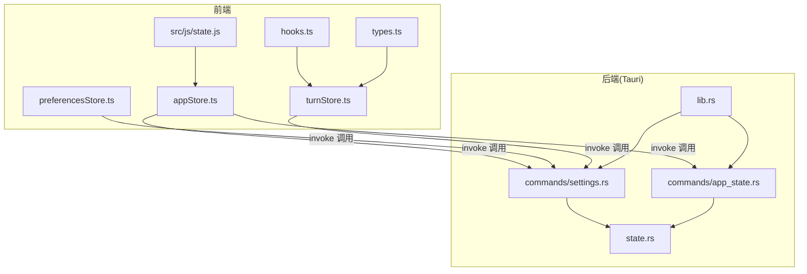
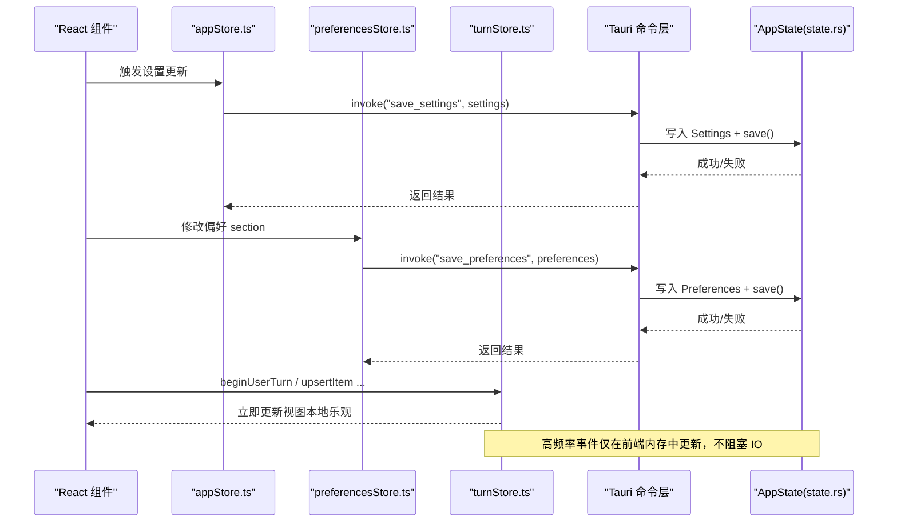
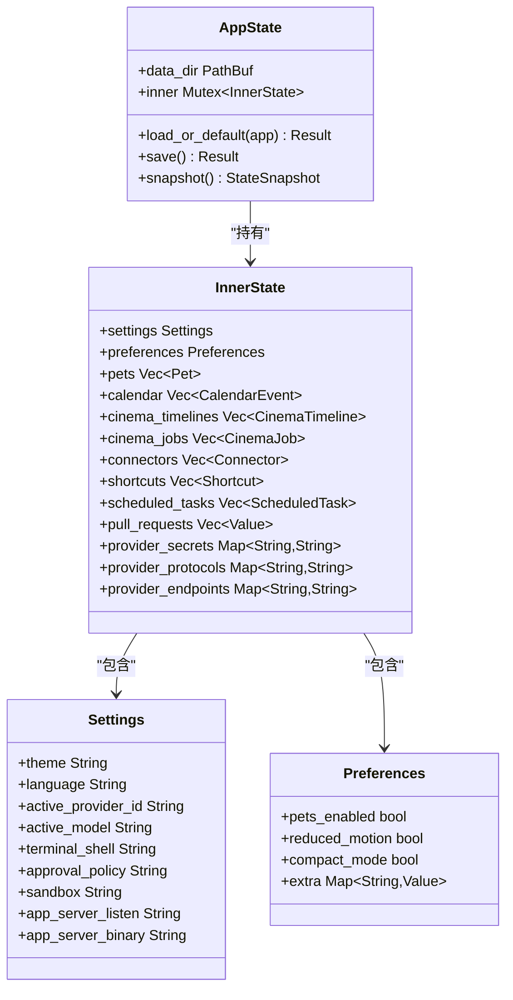
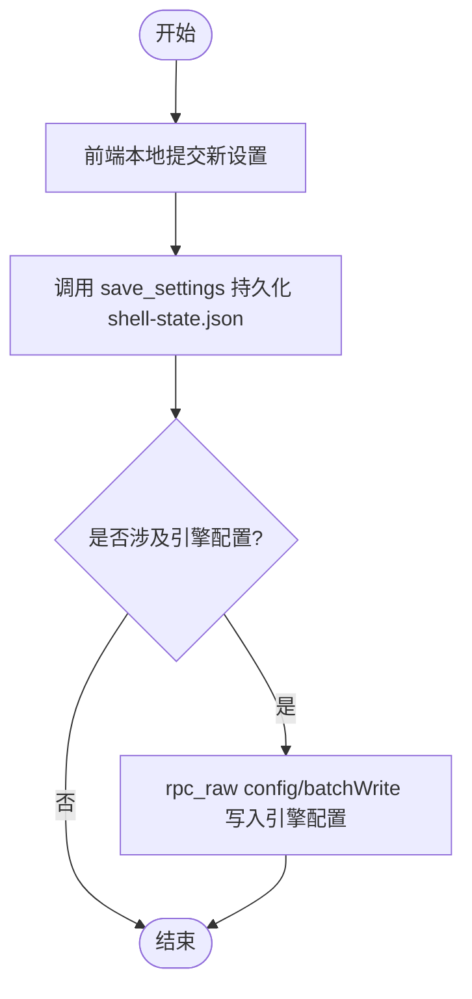
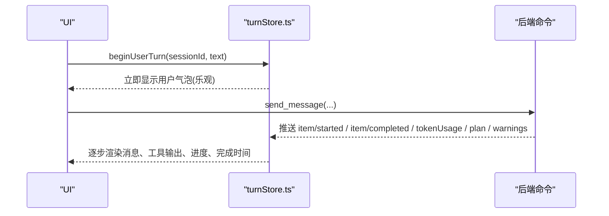
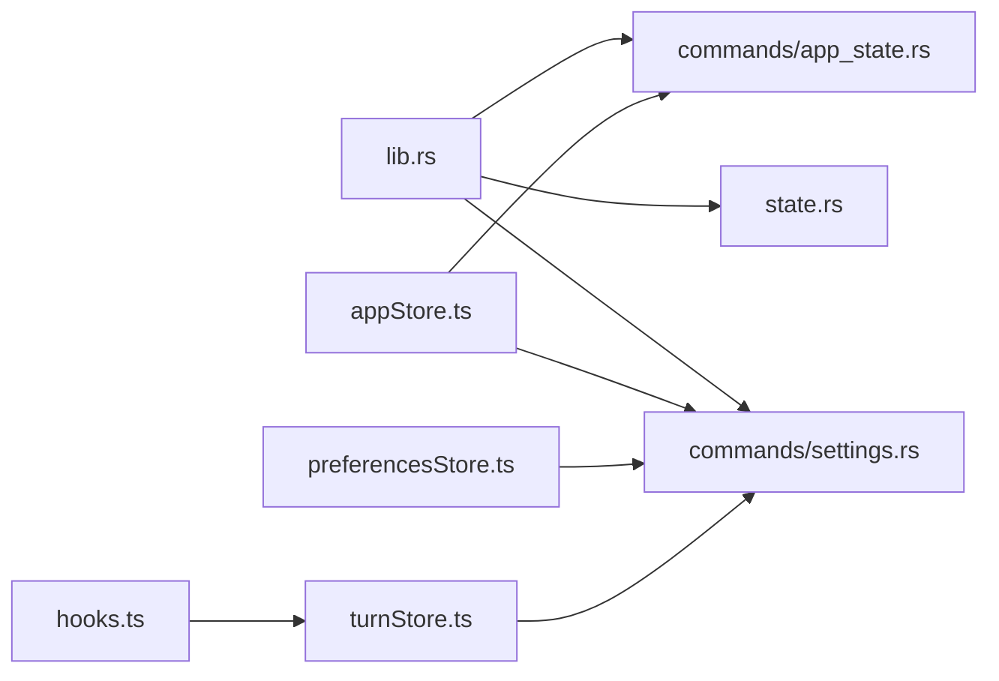

# 状态管理

<cite>
**本文引用的文件**
- [src-tauri/src/state.rs](file://src-tauri/src/state.rs)
- [src-tauri/src/commands/settings.rs](file://src-tauri/src/commands/settings.rs)
- [src-tauri/src/commands/app_state.rs](file://src-tauri/src/commands/app_state.rs)
- [src-tauri/src/lib.rs](file://src-tauri/src/lib.rs)
- [frontend/app/state/appStore.ts](file://frontend/app/state/appStore.ts)
- [frontend/app/state/preferencesStore.ts](file://frontend/app/state/preferencesStore.ts)
- [frontend/app/state/types.ts](file://frontend/app/state/types.ts)
- [frontend/app/state/hooks.ts](file://frontend/app/state/hooks.ts)
- [frontend/app/state/turnStore.ts](file://frontend/app/state/turnStore.ts)
- [frontend/src/js/state.js](file://frontend/src/js/state.js)
</cite>

## 目录
1. [简介](#简介)
2. [项目结构](#项目结构)
3. [核心组件](#核心组件)
4. [架构总览](#架构总览)
5. [详细组件分析](#详细组件分析)
6. [依赖关系分析](#依赖关系分析)
7. [性能考虑](#性能考虑)
8. [故障排查指南](#故障排查指南)
9. [结论](#结论)
10. [附录](#附录)

## 简介
本文件面向后端与前端协同的状态管理系统，重点说明 AppState 的设计模式、线程安全状态共享、持久化存储机制、状态变更通知；并覆盖设置数据模型、偏好配置管理、会话状态维护；同时描述状态同步策略、冲突解决机制、数据迁移方案，以及状态查询接口、更新操作、事务处理。最后给出最佳实践与性能优化建议。

## 项目结构
- 后端（Rust/Tauri）
  - 状态定义与持久化：state.rs
  - 命令层暴露读写能力：commands/settings.rs、commands/app_state.rs
  - 应用初始化与命令注册：lib.rs
- 前端（React/TypeScript）
  - 应用级状态与设置同步：appStore.ts
  - 偏好配置管理：preferencesStore.ts
  - 会话/流转态：turnStore.ts、types.ts、hooks.ts
  - 兼容旧版全局 store：src/js/state.js

图表来源
- [src-tauri/src/state.rs:150-231](file://src-tauri/src/state.rs#L150-L231)
- [src-tauri/src/commands/settings.rs:1-69](file://src-tauri/src/commands/settings.rs#L1-L69)
- [src-tauri/src/commands/app_state.rs:1-62](file://src-tauri/src/commands/app_state.rs#L1-L62)
- [src-tauri/src/lib.rs:23-70](file://src-tauri/src/lib.rs#L23-L70)
- [frontend/app/state/appStore.ts:130-155](file://frontend/app/state/appStore.ts#L130-L155)
- [frontend/app/state/preferencesStore.ts:20-43](file://frontend/app/state/preferencesStore.ts#L20-L43)
- [frontend/app/state/turnStore.ts:28-49](file://frontend/app/state/turnStore.ts#L28-L49)

章节来源
- [src-tauri/src/state.rs:1-331](file://src-tauri/src/state.rs#L1-L331)
- [src-tauri/src/commands/settings.rs:1-69](file://src-tauri/src/commands/settings.rs#L1-L69)
- [src-tauri/src/commands/app_state.rs:1-62](file://src-tauri/src/commands/app_state.rs#L1-L62)
- [src-tauri/src/lib.rs:1-162](file://src-tauri/src/lib.rs#L1-L162)
- [frontend/app/state/appStore.ts:1-519](file://frontend/app/state/appStore.ts#L1-L519)
- [frontend/app/state/preferencesStore.ts:1-94](file://frontend/app/state/preferencesStore.ts#L1-L94)
- [frontend/app/state/turnStore.ts:1-467](file://frontend/app/state/turnStore.ts#L1-L467)
- [frontend/app/state/types.ts:1-146](file://frontend/app/state/types.ts#L1-L146)
- [frontend/src/js/state.js:1-238](file://frontend/src/js/state.js#L1-L238)

## 核心组件
- 后端状态容器
  - AppState：封装数据目录与受互斥锁保护的内部状态 InnerState，提供加载默认值、保存快照、原子保存等能力。
  - InnerState：包含 Settings、Preferences、Pets、Calendar、Cinema、Connectors、Shortcuts、ScheduledTasks、Provider Secrets/Protocols/Endpoints 等。
  - ShellStateFile：用于持久化的 JSON 结构，与 InnerState 双向转换。
- 命令层
  - settings 命令：读取/保存 Settings、Preferences、Shortcuts。
  - app_state 命令：获取当前状态快照、检查依赖。
- 前端状态层
  - appStore：应用级状态（会话、项目、提供者、设置），通过 useSyncExternalStore 暴露给 React。
  - preferencesStore：偏好配置按 section 管理，合并默认值后持久化。
  - turnStore：会话流转态（消息流、计划、警告、待审批请求等）。
  - hooks：为 React 提供订阅与选择器。
  - types：流转态数据结构定义。
  - state.js：旧版全局 store，保留默认值与兼容性逻辑。

章节来源
- [src-tauri/src/state.rs:27-174](file://src-tauri/src/state.rs#L27-L174)
- [src-tauri/src/state.rs:176-231](file://src-tauri/src/state.rs#L176-L231)
- [src-tauri/src/commands/settings.rs:8-68](file://src-tauri/src/commands/settings.rs#L8-L68)
- [src-tauri/src/commands/app_state.rs:5-8](file://src-tauri/src/commands/app_state.rs#L5-L8)
- [frontend/app/state/appStore.ts:98-155](file://frontend/app/state/appStore.ts#L98-L155)
- [frontend/app/state/preferencesStore.ts:20-43](file://frontend/app/state/preferencesStore.ts#L20-L43)
- [frontend/app/state/turnStore.ts:28-49](file://frontend/app/state/turnStore.ts#L28-L49)
- [frontend/app/state/hooks.ts:17-43](file://frontend/app/state/hooks.ts#L17-L43)
- [frontend/app/state/types.ts:11-109](file://frontend/app/state/types.ts#L11-L109)
- [frontend/src/js/state.js:33-136](file://frontend/src/js/state.js#L33-L136)

## 架构总览
后端以 Mutex 保护内存状态，所有写路径通过命令层统一落盘；前端通过 Tauri invoke 调用命令进行读/写，并使用 useSyncExternalStore 将外部 store 桥接到 React。

图表来源
- [frontend/app/state/appStore.ts:446-511](file://frontend/app/state/appStore.ts#L446-L511)
- [frontend/app/state/preferencesStore.ts:76-88](file://frontend/app/state/preferencesStore.ts#L76-L88)
- [frontend/app/state/turnStore.ts:118-157](file://frontend/app/state/turnStore.ts#L118-L157)
- [src-tauri/src/commands/settings.rs:18-52](file://src-tauri/src/commands/settings.rs#L18-L52)
- [src-tauri/src/state.rs:176-217](file://src-tauri/src/state.rs#L176-L217)

## 详细组件分析

### 后端 AppState：线程安全与持久化
- 设计要点
  - 使用 std::sync::Mutex 包裹 InnerState，确保多线程访问安全。
  - load_or_default：从配置目录加载 shell-state.json，缺失或解析失败时回退到默认值（主题、语言、服务端地址、默认任务等）。
  - save：原子写入临时文件再 rename，避免部分写入导致损坏。
  - snapshot：对外提供只读快照，便于前端一次性拉取。
- 数据模型
  - Settings：主题、语言、活跃 Provider/Model、终端 Shell、审批策略、沙箱、服务端监听/二进制路径等。
  - Preferences：启用宠物、动效、紧凑模式及扩展字段 extra（支持任意 section 的扁平化存储）。
  - 其他：Pet、CalendarEvent、CinemaTimeline/Job、Connector、Shortcut、ScheduledTask 等。
- 持久化格式
  - ShellStateFile：与 InnerState 一一对应，含 provider 密钥、协议、端点映射等。

图表来源
- [src-tauri/src/state.rs:150-174](file://src-tauri/src/state.rs#L150-L174)
- [src-tauri/src/state.rs:27-64](file://src-tauri/src/state.rs#L27-L64)
- [src-tauri/src/state.rs:176-231](file://src-tauri/src/state.rs#L176-L231)

章节来源
- [src-tauri/src/state.rs:176-231](file://src-tauri/src/state.rs#L176-L231)
- [src-tauri/src/state.rs:234-299](file://src-tauri/src/state.rs#L234-L299)

### 设置数据模型与偏好配置管理
- 后端
  - get_settings/save_settings：读取/写入 Settings，并在保存时更新适配器活跃 Provider。
  - get_preferences/save_preferences：读取/写入 Preferences，最终统一调用 save() 持久化。
  - list_shortcuts/save_shortcuts：快捷方式列表的读写。
- 前端
  - appStore.saveSettings：先本地 commit，再并发写入 shell-state.json 与引擎 config.toml（通过 rpc_raw config/batchWrite），保证 UI 即时响应与配置一致性。
  - preferencesStore：按 section 合并默认值，持久化整个 preferences map；支持 emitShellEvent 触发壳层自定义事件。

图表来源
- [frontend/app/state/appStore.ts:446-511](file://frontend/app/state/appStore.ts#L446-L511)
- [src-tauri/src/commands/settings.rs:18-52](file://src-tauri/src/commands/settings.rs#L18-L52)

章节来源
- [src-tauri/src/commands/settings.rs:1-69](file://src-tauri/src/commands/settings.rs#L1-L69)
- [frontend/app/state/appStore.ts:446-511](file://frontend/app/state/appStore.ts#L446-L511)
- [frontend/app/state/preferencesStore.ts:59-88](file://frontend/app/state/preferencesStore.ts#L59-L88)

### 会话状态维护与流转态
- 前端 turnStore
  - 以不可变更新 + 订阅者模式实现高频增量更新（消息文本、工具输出、MCP 进度等）。
  - 支持乐观用户气泡、断线重连计数、冻结标志、错误信息、计划步骤、令牌用量、警告、待审批请求等。
  - 历史加载：优先 thread.messages，否则回退到 runtime events/timeline，并映射为标准块类型。
- 类型定义
  - TurnItem、TokenUsage、PlanStep、ServerWarning、PendingRequest、TurnState 等。

图表来源
- [frontend/app/state/turnStore.ts:118-157](file://frontend/app/state/turnStore.ts#L118-L157)
- [frontend/app/state/turnStore.ts:209-285](file://frontend/app/state/turnStore.ts#L209-L285)
- [frontend/app/state/turnStore.ts:328-466](file://frontend/app/state/turnStore.ts#L328-L466)

章节来源
- [frontend/app/state/turnStore.ts:1-467](file://frontend/app/state/turnStore.ts#L1-L467)
- [frontend/app/state/types.ts:11-146](file://frontend/app/state/types.ts#L11-L146)

### 状态同步策略与冲突解决
- 前端优先本地提交，再异步持久化，保证交互流畅。
- 设置更新采用双写：shell-state.json（壳层设置）+ 引擎 config.toml（通过 batchWrite），键名映射与策略由前端控制。
- 偏好配置按 section 合并默认值，避免未知 section 丢失（后端 Preferences.extra 支持任意扩展）。
- 冲突处理
  - 后端保存使用临时文件 + rename 原子替换，避免部分写入。
  - 前端在批量写入引擎配置失败时记录警告，不影响 shell 侧已保存的设置。
  - 首次加载时若为空则填充默认值（如语言、主题、默认任务等）。

章节来源
- [src-tauri/src/state.rs:176-217](file://src-tauri/src/state.rs#L176-L217)
- [frontend/app/state/appStore.ts:446-511](file://frontend/app/state/appStore.ts#L446-L511)
- [frontend/app/state/preferencesStore.ts:76-88](file://frontend/app/state/preferencesStore.ts#L76-L88)

### 数据迁移方案
- 启动时 load_or_default 对空字段进行回填（主题、语言、服务端地址、默认任务），保证向后兼容。
- Preferences 的 extra 字段允许新增 section 无需后端改动，前端可自由扩展。
- 前端 normaliseSettings 兼容驼峰与下划线命名，降低前后端契约变更成本。

章节来源
- [src-tauri/src/state.rs:176-207](file://src-tauri/src/state.rs#L176-L207)
- [frontend/app/state/appStore.ts:410-433](file://frontend/app/state/appStore.ts#L410-L433)

### 状态查询接口与更新操作
- 查询
  - get_state：返回 StateSnapshot（settings、preferences、pets、calendar、cinema、connectors、shortcuts）。
  - get_settings/get_preferences/list_shortcuts：分别读取对应数据。
- 更新
  - save_settings/save_preferences/save_shortcuts：写入并持久化。
  - saveSettings（前端）：本地提交 + shell 持久化 + 引擎配置批量写入。
  - saveSection（前端）：按 section 合并并持久化。

章节来源
- [src-tauri/src/commands/app_state.rs:5-8](file://src-tauri/src/commands/app_state.rs#L5-L8)
- [src-tauri/src/commands/settings.rs:8-68](file://src-tauri/src/commands/settings.rs#L8-L68)
- [frontend/app/state/appStore.ts:446-511](file://frontend/app/state/appStore.ts#L446-L511)
- [frontend/app/state/preferencesStore.ts:76-88](file://frontend/app/state/preferencesStore.ts#L76-L88)

### 事务处理
- 单条写操作的“事务”语义通过原子保存实现：先写临时文件，再 rename 为目标文件，确保要么全量成功，要么保持原状。
- 多步写（前端设置更新）采用“先本地、后远端”的两阶段提交风格：本地立即生效，远端失败不影响 UI 状态，但会记录日志以便排查。

章节来源
- [src-tauri/src/state.rs:209-217](file://src-tauri/src/state.rs#L209-L217)
- [frontend/app/state/appStore.ts:446-511](file://frontend/app/state/appStore.ts#L446-L511)

## 依赖关系分析
- 初始化流程
  - lib.rs 创建 AppState 并 manage，启动协议适配器与 sidecar，注册命令处理器。
  - 命令层依赖 state.rs 提供的 AppState 能力。
- 前端依赖
  - appStore 依赖 Tauri invoke 调用后端命令，并通过 useSyncExternalStore 暴露给 React。
  - preferencesStore 与 appStore 共同维护设置与偏好，前者侧重 section 粒度，后者侧重应用级设置。
  - turnStore 独立于 React，通过 hooks 暴露订阅能力。

图表来源
- [src-tauri/src/lib.rs:23-70](file://src-tauri/src/lib.rs#L23-L70)
- [src-tauri/src/commands/settings.rs:1-69](file://src-tauri/src/commands/settings.rs#L1-L69)
- [src-tauri/src/commands/app_state.rs:1-62](file://src-tauri/src/commands/app_state.rs#L1-L62)
- [frontend/app/state/appStore.ts:130-155](file://frontend/app/state/appStore.ts#L130-L155)
- [frontend/app/state/preferencesStore.ts:20-43](file://frontend/app/state/preferencesStore.ts#L20-L43)
- [frontend/app/state/turnStore.ts:28-49](file://frontend/app/state/turnStore.ts#L28-L49)
- [frontend/app/state/hooks.ts:17-43](file://frontend/app/state/hooks.ts#L17-L43)

章节来源
- [src-tauri/src/lib.rs:1-162](file://src-tauri/src/lib.rs#L1-L162)
- [src-tauri/src/commands/settings.rs:1-69](file://src-tauri/src/commands/settings.rs#L1-L69)
- [src-tauri/src/commands/app_state.rs:1-62](file://src-tauri/src/commands/app_state.rs#L1-L62)
- [frontend/app/state/appStore.ts:1-519](file://frontend/app/state/appStore.ts#L1-L519)
- [frontend/app/state/preferencesStore.ts:1-94](file://frontend/app/state/preferencesStore.ts#L1-L94)
- [frontend/app/state/turnStore.ts:1-467](file://frontend/app/state/turnStore.ts#L1-L467)
- [frontend/app/state/hooks.ts:1-43](file://frontend/app/state/hooks.ts#L1-L43)

## 性能考虑
- 前端高频更新
  - turnStore 使用最小化更新与订阅者模式，避免 React 上下文与 prop drilling 带来的开销。
  - 使用 useSyncExternalStore 将外部 store 高效接入 React，减少不必要的重渲染。
- 后端持久化
  - 原子写入（临时文件 + rename）避免锁竞争期间的脏读。
  - 批量写入引擎配置时采用一次 batchWrite，减少网络往返。
- 默认值与懒加载
  - 首次加载填充默认值，减少后续分支判断。
  - 偏好 section 按需合并默认值，避免重复计算。

[本节为通用性能讨论，不直接分析具体文件]

## 故障排查指南
- 常见问题定位
  - 设置未持久化：检查 save_settings/save_preferences 调用链与后端 save() 返回值。
  - 引擎配置未生效：确认前端 saveSettings 中的 edits 构建与 rpc_raw 调用是否成功。
  - 偏好 section 丢失：确认后端 Preferences.extra 是否正确序列化，前端 mergePreferences 是否覆盖默认值。
  - 会话历史为空：检查 turnStore 的历史加载逻辑（thread.messages 与 timeline 回退）。
- 日志与调试
  - 后端 tracing_subscriber 已启用，可通过环境变量调整日志级别。
  - 前端 console.warn/error 用于捕获异步失败（如引擎离线时的配置写入）。

章节来源
- [src-tauri/src/lib.rs:8-14](file://src-tauri/src/lib.rs#L8-L14)
- [frontend/app/state/appStore.ts:446-511](file://frontend/app/state/appStore.ts#L446-L511)
- [frontend/app/state/preferencesStore.ts:76-88](file://frontend/app/state/preferencesStore.ts#L76-L88)
- [frontend/app/state/turnStore.ts:328-466](file://frontend/app/state/turnStore.ts#L328-L466)

## 结论
该状态管理系统以后端 AppState 为核心，结合 Mutex 保障线程安全，通过原子持久化确保数据一致性；前端采用模块化 store（appStore、preferencesStore、turnStore）配合 useSyncExternalStore 实现高性能 UI 更新。设置与偏好通过双写策略与默认值回填实现跨版本兼容与平滑迁移。整体设计兼顾可靠性、可扩展性与用户体验。

[本节为总结性内容，不直接分析具体文件]

## 附录
- 关键接口速览
  - 后端命令
    - get_state：返回 StateSnapshot
    - get_settings/save_settings：读取/写入 Settings
    - get_preferences/save_preferences：读取/写入 Preferences
    - list_shortcuts/save_shortcuts：读取/写入 Shortcuts
  - 前端方法
    - refreshAppState：刷新会话、项目、提供者、设置
    - saveSettings：本地提交 + shell 持久化 + 引擎配置批量写入
    - saveSection：按 section 合并并持久化偏好
    - beginUserTurn/upsertItem/completeItem：流转态操作

章节来源
- [src-tauri/src/commands/app_state.rs:5-8](file://src-tauri/src/commands/app_state.rs#L5-L8)
- [src-tauri/src/commands/settings.rs:8-68](file://src-tauri/src/commands/settings.rs#L8-L68)
- [frontend/app/state/appStore.ts:378-433](file://frontend/app/state/appStore.ts#L378-L433)
- [frontend/app/state/appStore.ts:446-511](file://frontend/app/state/appStore.ts#L446-L511)
- [frontend/app/state/preferencesStore.ts:76-88](file://frontend/app/state/preferencesStore.ts#L76-L88)
- [frontend/app/state/turnStore.ts:118-285](file://frontend/app/state/turnStore.ts#L118-L285)