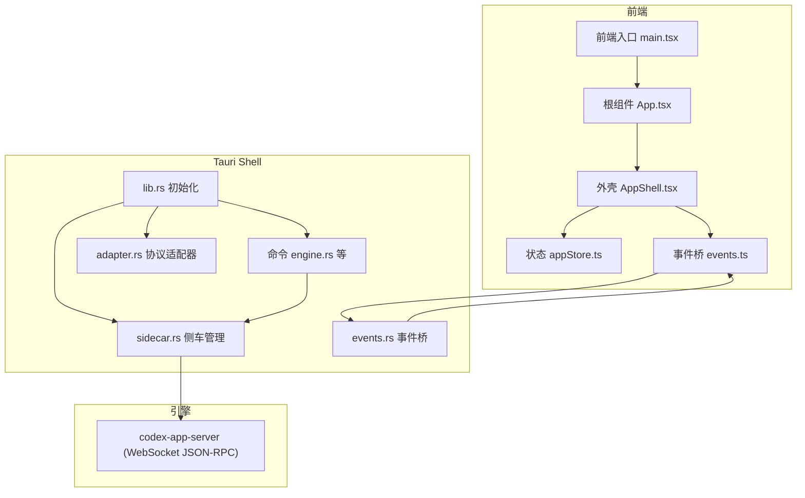
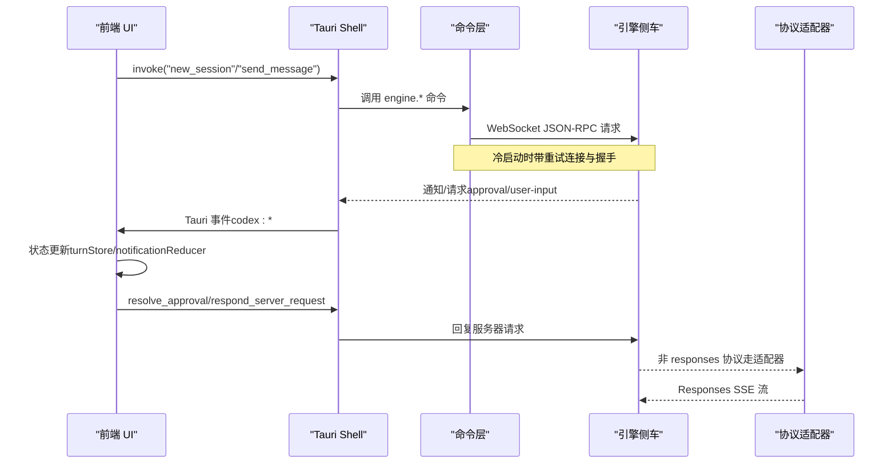
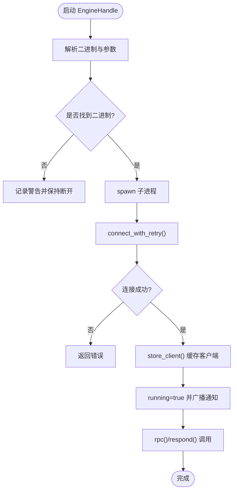
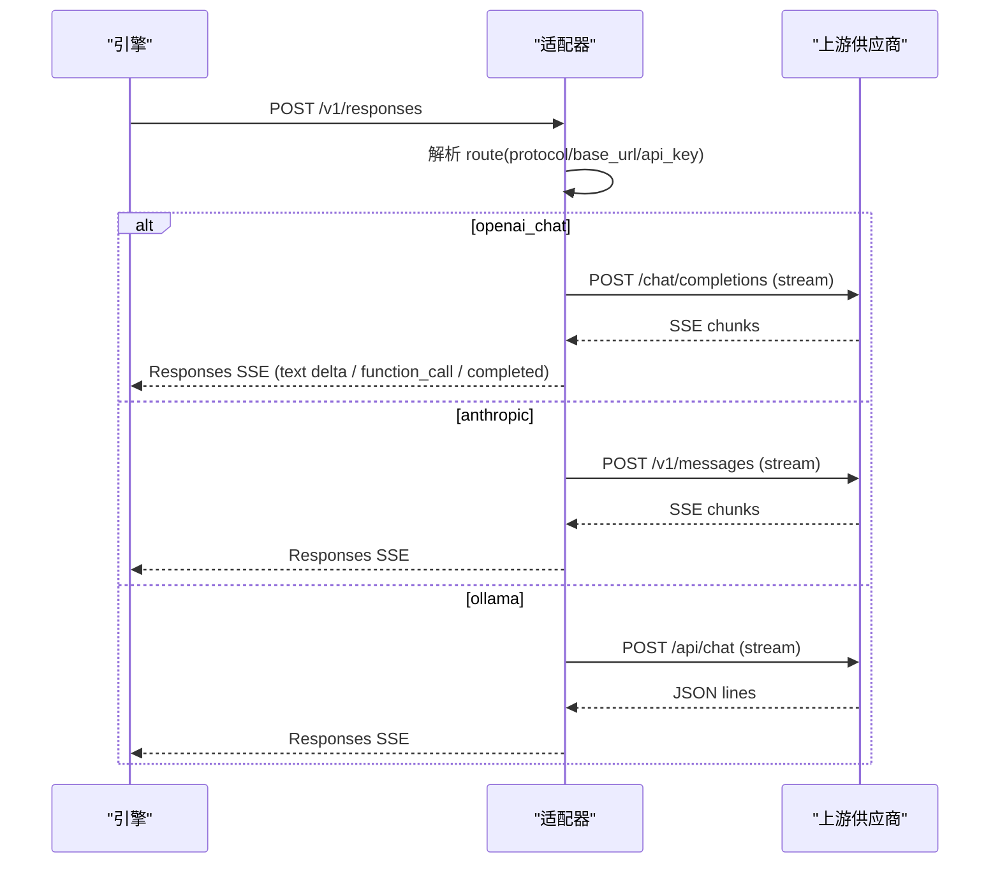
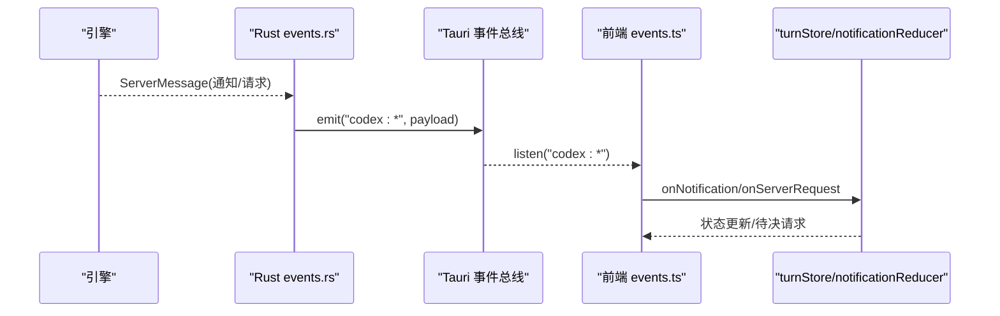
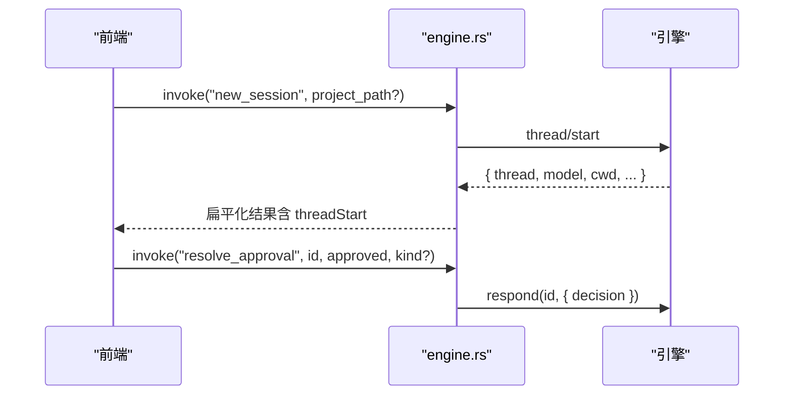
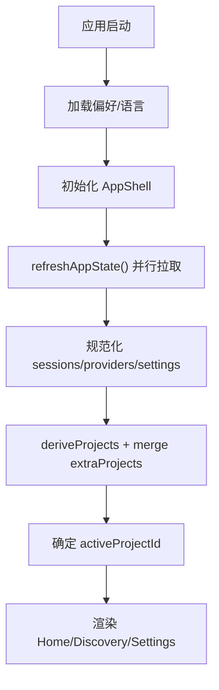
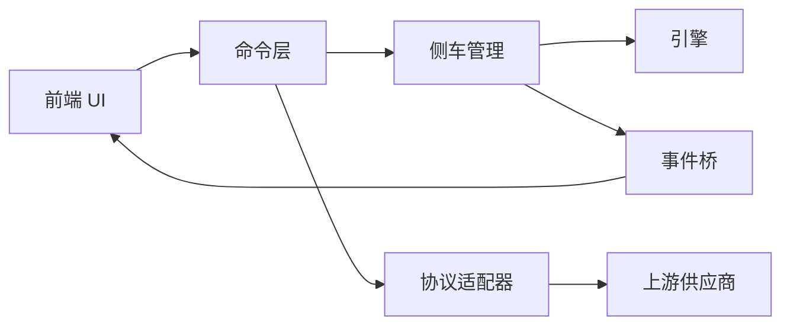

# 架构设计

<cite>
**本文引用的文件**
- [README.md](file://README.md)
- [main.rs](file://src-tauri/src/main.rs)
- [lib.rs](file://src-tauri/src/lib.rs)
- [mod.rs](file://src-tauri/src/codex/mod.rs)
- [sidecar.rs](file://src-tauri/src/codex/sidecar.rs)
- [adapter.rs](file://src-tauri/src/codex/adapter.rs)
- [events.rs](file://src-tauri/src/codex/events.rs)
- [engine.rs](file://src-tauri/src/commands/engine.rs)
- [RUST_BACKEND.md](file://docs/RUST_BACKEND.md)
- [main.tsx](file://frontend/app/main.tsx)
- [App.tsx](file://frontend/app/App.tsx)
- [AppShell.tsx](file://frontend/app/shell/AppShell.tsx)
- [appStore.ts](file://frontend/app/state/appStore.ts)
- [events.ts](file://frontend/app/bridge/events.ts)
</cite>

## 目录
1. [简介](#简介)
2. [项目结构](#项目结构)
3. [核心组件](#核心组件)
4. [架构总览](#架构总览)
5. [详细组件分析](#详细组件分析)
6. [依赖关系分析](#依赖关系分析)
7. [性能考量](#性能考量)
8. [故障排查指南](#故障排查指南)
9. [结论](#结论)
10. [附录](#附录)

## 简介
本架构文档面向 Codex-Tauri，描述其分层设计与组件交互：UI 层（React）、Shell 层（Tauri 主进程与命令）、适配层（协议适配器）、引擎层（官方 codex-app-server sidecar）。重点说明 Tauri 主进程与渲染进程的通信机制、Sidecar 进程管理、WebSocket 实时通信与事件桥接、前后端分离决策、状态管理与错误处理策略，并给出架构图与数据流图。

## 项目结构
仓库采用“前端 + Rust Shell”的双仓式组织：
- 前端（frontend）：React UI、路由、状态、事件桥、视图与设置页。
- Rust Shell（src-tauri）：Tauri 应用入口、插件初始化、命令注册、引擎侧车启动、事件桥转发、本地能力（宠物/日历/市场等）。
- 文档（docs）：后端集成、方法清单、布局与设计说明。

**图表来源**
- [lib.rs:16-69](file://src-tauri/src/lib.rs#L16-L69)
- [sidecar.rs:22-125](file://src-tauri/src/codex/sidecar.rs#L22-L125)
- [adapter.rs:68-111](file://src-tauri/src/codex/adapter.rs#L68-L111)
- [events.rs:12-43](file://src-tauri/src/codex/events.rs#L12-L43)
- [engine.rs:13-28](file://src-tauri/src/commands/engine.rs#L13-L28)
- [main.tsx:38-59](file://frontend/app/main.tsx#L38-L59)
- [App.tsx:15-45](file://frontend/app/App.tsx#L15-L45)
- [AppShell.tsx:78-100](file://frontend/app/shell/AppShell.tsx#L78-L100)
- [appStore.ts:378-408](file://frontend/app/state/appStore.ts#L378-L408)
- [events.ts:145-159](file://frontend/app/bridge/events.ts#L145-L159)

**章节来源**
- [README.md:16-22](file://README.md#L16-L22)
- [lib.rs:16-69](file://src-tauri/src/lib.rs#L16-L69)
- [main.tsx:38-59](file://frontend/app/main.tsx#L38-L59)

## 核心组件
- 引擎侧车管理器（EngineHandle）：负责解析二进制、启动子进程、连接 WebSocket、重试握手、广播通知、关闭清理。
- 协议适配器（ProtocolAdapter）：本地 HTTP 服务，将引擎的 Responses 请求适配到 OpenAI Chat / Anthropic Messages / Ollama，并以 Responses SSE 回写引擎。
- 事件桥（events.rs + frontend bridge）：将引擎通知映射为 Tauri 事件，再由前端订阅并驱动状态更新。
- 命令层（commands/engine.rs 等）：暴露 Tauri 命令，封装 JSON-RPC 调用，统一响应形状，提供会话、配置、MCP、技能、插件、Shell 执行等能力。
- 前端状态与桥接：appStore 聚合会话/项目/提供者/设置；events.ts 集中订阅所有通知与服务器请求通道。

**章节来源**
- [sidecar.rs:22-276](file://src-tauri/src/codex/sidecar.rs#L22-L276)
- [adapter.rs:68-220](file://src-tauri/src/codex/adapter.rs#L68-L220)
- [events.rs:12-82](file://src-tauri/src/codex/events.rs#L12-L82)
- [engine.rs:13-183](file://src-tauri/src/commands/engine.rs#L13-L183)
- [appStore.ts:98-151](file://frontend/app/state/appStore.ts#L98-L151)
- [events.ts:1-172](file://frontend/app/bridge/events.ts#L1-L172)

## 架构总览
Codex-Tauri 采用四层架构：
- UI 层：React 组件、路由、状态、视图。
- Shell 层：Tauri 主进程、命令、本地能力、菜单与快捷键。
- 适配层：协议适配器，屏蔽不同模型供应商接口差异。
- 引擎层：官方 codex-app-server sidecar，通过 WebSocket JSON-RPC 与事件流驱动 Agent 工作流。

**图表来源**
- [lib.rs:71-148](file://src-tauri/src/lib.rs#L71-L148)
- [engine.rs:30-127](file://src-tauri/src/commands/engine.rs#L30-L127)
- [sidecar.rs:188-244](file://src-tauri/src/codex/sidecar.rs#L188-L244)
- [events.rs:51-82](file://src-tauri/src/codex/events.rs#L51-L82)
- [adapter.rs:194-343](file://src-tauri/src/codex/adapter.rs#L194-L343)

## 详细组件分析

### 引擎侧车管理（EngineHandle）
- 职责：解析二进制路径、注入环境变量（API Key 等）、启动子进程、建立 WebSocket 客户端、维护连接与广播通道、优雅关闭。
- 关键流程：
  - 启动：根据配置与环境变量选择监听地址与 CLI 参数，探测多调用入口或独立可执行体。
  - 连接：首次 RPC 时尝试连接并重试，成功后缓存客户端并开启通知广播。
  - 关闭：在窗口关闭事件中终止子进程并释放资源。

**图表来源**
- [sidecar.rs:31-125](file://src-tauri/src/codex/sidecar.rs#L31-L125)
- [sidecar.rs:188-244](file://src-tauri/src/codex/sidecar.rs#L188-L244)
- [sidecar.rs:262-276](file://src-tauri/src/codex/sidecar.rs#L262-L276)

**章节来源**
- [sidecar.rs:22-276](file://src-tauri/src/codex/sidecar.rs#L22-L276)
- [lib.rs:23-69](file://src-tauri/src/lib.rs#L23-L69)

### 协议适配器（ProtocolAdapter）
- 职责：监听本地 HTTP 端口，接收引擎的 Responses 请求，按配置的协议（OpenAI Chat / Anthropic / Ollama）转换请求与流式响应，再回写为 Responses SSE。
- 关键点：
  - 路由：基于 active provider 的 protocol 与 base_url 决定上游目标。
  - 流式处理：聚合 tool_calls 片段，构造 function_call 输出项，最终 completed。
  - 错误映射：上游失败转换为 502/错误体，便于 UI 降级展示。

**图表来源**
- [adapter.rs:85-111](file://src-tauri/src/codex/adapter.rs#L85-L111)
- [adapter.rs:194-343](file://src-tauri/src/codex/adapter.rs#L194-L343)
- [adapter.rs:345-601](file://src-tauri/src/codex/adapter.rs#L345-L601)

**章节来源**
- [adapter.rs:68-220](file://src-tauri/src/codex/adapter.rs#L68-L220)
- [engine.rs:312-329](file://src-tauri/src/commands/engine.rs#L312-L329)

### 事件桥（Rust → Frontend）
- 职责：订阅引擎通知广播，映射为 Tauri 事件名（替换 / 与 . 为 -），分发至前端；对服务器→客户端请求进行归类（approval / user-input / server-request-*）。
- 前端侧：一次性绑定所有通知方法与两个固定请求通道，统一包装为 envelope 后交给 reducer 与 turnStore。

**图表来源**
- [events.rs:12-82](file://src-tauri/src/codex/events.rs#L12-L82)
- [events.ts:57-159](file://frontend/app/bridge/events.ts#L57-L159)
- [App.tsx:15-45](file://frontend/app/App.tsx#L15-L45)

**章节来源**
- [events.rs:12-82](file://src-tauri/src/codex/events.rs#L12-L82)
- [events.ts:1-172](file://frontend/app/bridge/events.ts#L1-L172)
- [App.tsx:15-45](file://frontend/app/App.tsx#L15-L45)

### 命令层（engine 命令）
- 职责：将 UI 操作映射为引擎 JSON-RPC 方法，规范化响应形状，处理 approvals 与用户输入，提供 MCP/技能/插件/Shell 执行等能力。
- 典型流程：
  - new_session/send_message：构造 threadId/input，调用 turn/start。
  - resolve_approval/respond_server_request：以 request id 回复引擎，支持多种决策。
  - list_providers/save_provider/probe_provider：读取/写入配置，注入 env_key，探针连通性。

**图表来源**
- [engine.rs:30-127](file://src-tauri/src/commands/engine.rs#L30-L127)
- [engine.rs:137-183](file://src-tauri/src/commands/engine.rs#L137-L183)

**章节来源**
- [engine.rs:13-183](file://src-tauri/src/commands/engine.rs#L13-L183)

### 前端状态与外壳
- 状态管理：appStore 使用 useSyncExternalStore 暴露快照，集中刷新 sessions/providers/settings，派生 projects，持久化 shell 设置与引擎配置。
- 外壳：AppShell 负责标题栏、侧边栏、视图宿主、菜单动作与快捷键，加载引擎数据并恢复 UI 状态。

**图表来源**
- [main.tsx:38-59](file://frontend/app/main.tsx#L38-L59)
- [AppShell.tsx:78-100](file://frontend/app/shell/AppShell.tsx#L78-L100)
- [appStore.ts:378-408](file://frontend/app/state/appStore.ts#L378-L408)
- [appStore.ts:215-245](file://frontend/app/state/appStore.ts#L215-L245)

**章节来源**
- [main.tsx:38-59](file://frontend/app/main.tsx#L38-L59)
- [AppShell.tsx:78-100](file://frontend/app/shell/AppShell.tsx#L78-L100)
- [appStore.ts:98-151](file://frontend/app/state/appStore.ts#L98-L151)
- [appStore.ts:378-408](file://frontend/app/state/appStore.ts#L378-L408)

## 依赖关系分析
- 耦合与内聚：
  - 命令层与引擎侧车强耦合（JSON-RPC 方法名与响应形状），但通过命令函数封装降低 UI 直接依赖。
  - 事件桥解耦了引擎通知与前端订阅，命名约定（/ 与 . 替换为 -）保证一致性。
  - 适配器与引擎通过 Responses 协议耦合，但对上游供应商弱耦合（按协议分支）。
- 外部依赖：
  - Tauri 插件：dialog、shell、fs、store。
  - 网络：reqwest（适配器与探针）、WebSocket（引擎）。
- 潜在循环：无直接循环依赖；事件桥单向从引擎到前端。

**图表来源**
- [lib.rs:71-148](file://src-tauri/src/lib.rs#L71-L148)
- [sidecar.rs:22-125](file://src-tauri/src/codex/sidecar.rs#L22-L125)
- [adapter.rs:68-220](file://src-tauri/src/codex/adapter.rs#L68-L220)
- [events.rs:12-82](file://src-tauri/src/codex/events.rs#L12-L82)

**章节来源**
- [lib.rs:71-148](file://src-tauri/src/lib.rs#L71-L148)
- [RUST_BACKEND.md:58-69](file://docs/RUST_BACKEND.md#L58-L69)

## 性能考量
- 连接与重试：冷启动时对引擎连接进行有限次重试，避免首次 RPC 因侧车未就绪而失败。
- 广播容量：通知广播通道容量 256，避免阻塞；若前端滞后会丢弃部分通知并记录告警。
- 流式处理：适配器对上游 SSE/JSON Lines 进行行缓冲与增量聚合，减少内存占用与延迟。
- I/O 并发：前端 refreshAppState 并行拉取 sessions/providers/settings，缩短首屏等待。
- 进程生命周期：窗口关闭时主动终止侧车，避免僵尸进程。

[本节为通用指导，不直接分析具体文件]

## 故障排查指南
- 引擎未连接：
  - 检查侧车二进制是否解析成功（环境变量、设置项、资源目录、PATH）。
  - 查看日志中 “no codex-app-server binary resolved” 与 “failed to spawn”。
  - 确认监听端口未被占用，必要时调整 settings.app_server_listen。
- 连接失败：
  - 观察 connect_with_retry 日志，确认是否多次重试后仍失败。
  - 校验 CLI 参数探测结果（是否传递了不被支持的 --session-source）。
- 适配器问题：
  - 确认 active provider 已设置且 base_url/api_key 正确。
  - 上游返回非 2xx 时，适配器会返回错误体，检查提示与 URL 格式。
- 事件丢失：
  - 若出现 “event bridge lagged”，说明前端订阅过慢导致丢弃；优化前端处理或增加缓冲。
- 批准/用户输入卡住：
  - 确保前端已订阅 codex:approval 与 codex:user-input，并通过 resolve_approval/respond_server_request 回复。

**章节来源**
- [sidecar.rs:106-116](file://src-tauri/src/codex/sidecar.rs#L106-L116)
- [sidecar.rs:188-222](file://src-tauri/src/codex/sidecar.rs#L188-L222)
- [events.rs:33-39](file://src-tauri/src/codex/events.rs#L33-L39)
- [RUST_BACKEND.md:278-298](file://docs/RUST_BACKEND.md#L278-L298)

## 结论
Codex-Tauri 通过清晰的分层与明确的边界，实现了 UI 与引擎的松耦合：Shell 层专注进程与 IPC，适配层屏蔽多供应商差异，引擎层保持单一职责。事件桥与命令层提供了稳定的数据与控制面。该设计兼顾可维护性与扩展性，新增供应商只需在适配器中添加分支，新增能力可通过命令层暴露。未来可在传输安全（认证）、进程健康监控与 SHA-256 校验等方面进一步增强。

[本节为总结性内容，不直接分析具体文件]

## 附录
- 技术选型权衡：
  - 传输：当前使用 ws:// 本地回环，调试便捷但无鉴权；后续可考虑 stdio 以降低攻击面。
  - Sidecar 管理：内容寻址安装提升升级原子性与版本隔离；FNV 哈希仅用于版本键，非完整性校验。
  - 适配器：Responses 作为统一出口，简化引擎侧逻辑，上游协议差异收敛在适配器。
- 系统边界：
  - 引擎不可修改，仅通过 JSON-RPC 与事件交互。
  - API Key 保存在 Shell 存储并通过环境变量注入，不进入 config.toml 与前端。
- 扩展点：
  - 新增协议：在 adapter.rs 添加分支与消息映射。
  - 新增命令：在 commands/* 注册新 Tauri 命令并转发至引擎。
  - 新增通知：无需改动前端列表，events.ts 自动绑定生成表中的方法。

[本节为补充信息，不直接分析具体文件]