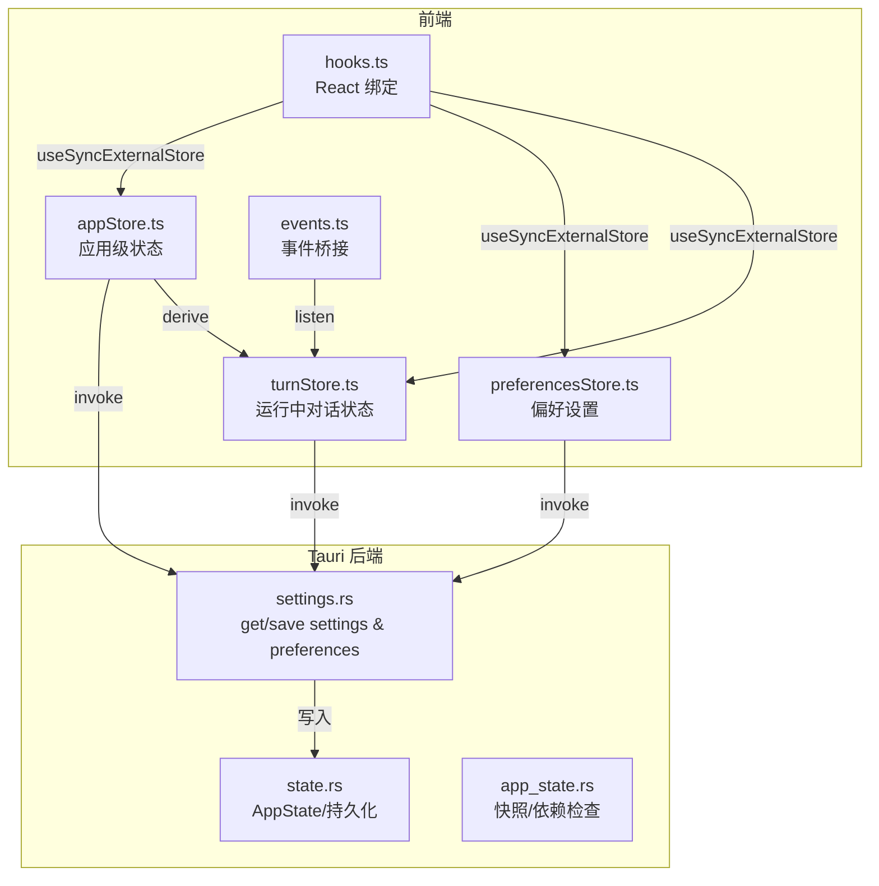
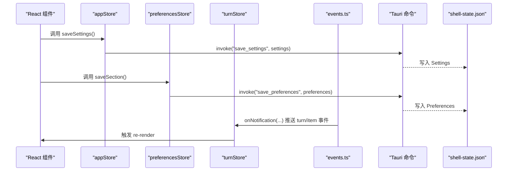
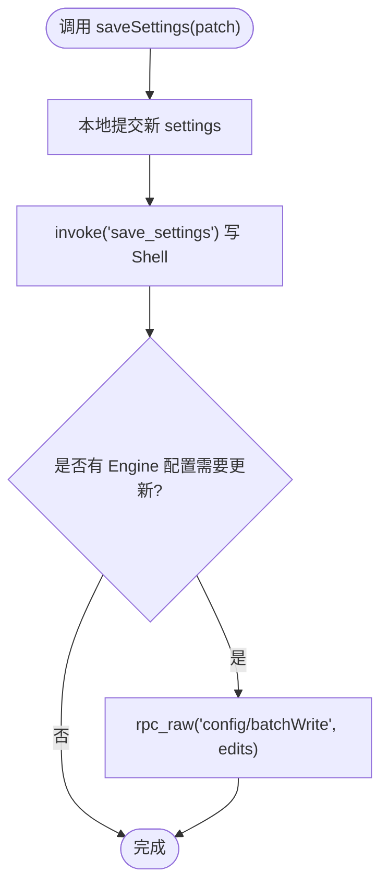
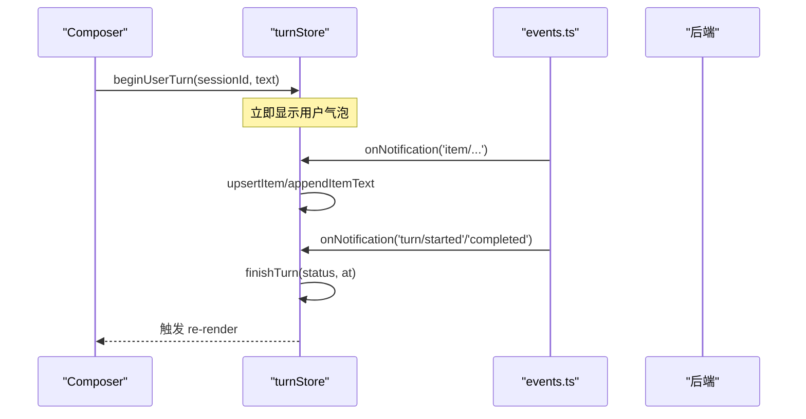
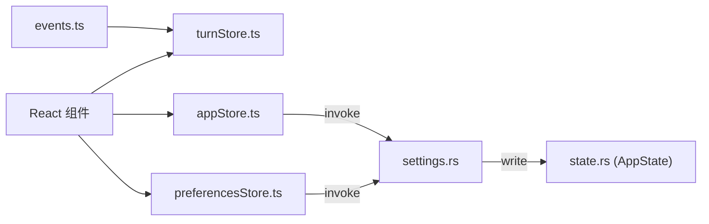
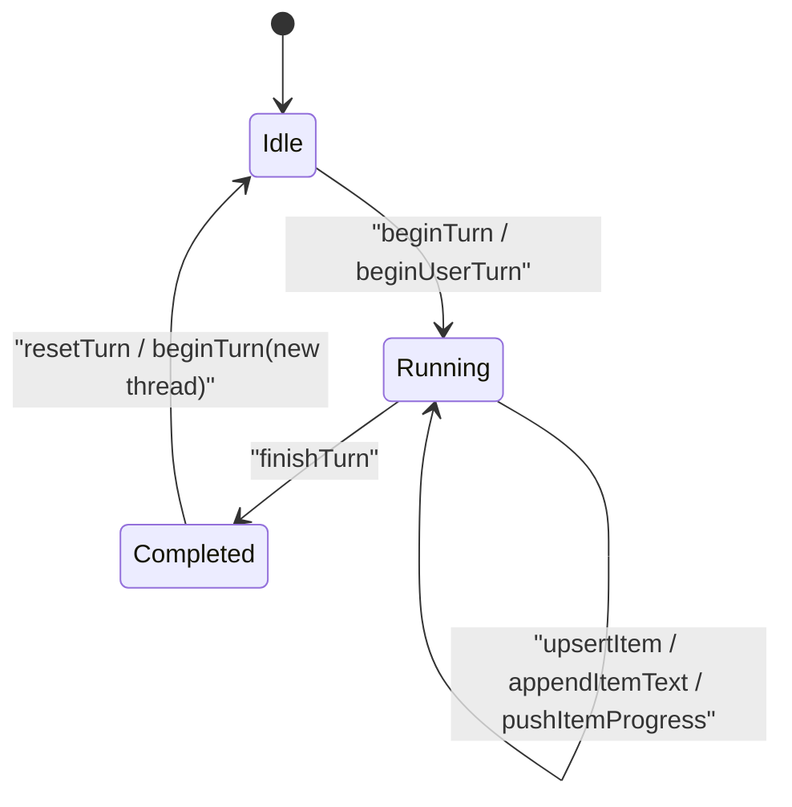
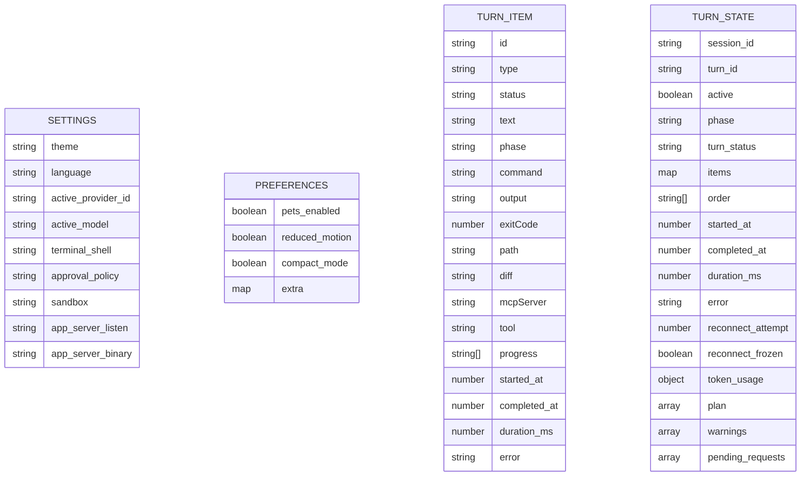

# 状态管理

<cite>
**本文引用的文件**
- [appStore.ts](file://frontend/app/state/appStore.ts)
- [preferencesStore.ts](file://frontend/app/state/preferencesStore.ts)
- [turnStore.ts](file://frontend/app/state/turnStore.ts)
- [types.ts](file://frontend/app/state/types.ts)
- [hooks.ts](file://frontend/app/state/hooks.ts)
- [events.ts](file://frontend/app/bridge/events.ts)
- [state.js](file://frontend/src/js/state.js)
- [state.rs](file://src-tauri/src/state.rs)
- [settings.rs](file://src-tauri/src/commands/settings.rs)
- [app_state.rs](file://src-tauri/src/commands/app_state.rs)
</cite>

## 目录
1. [简介](#简介)
2. [项目结构](#项目结构)
3. [核心组件](#核心组件)
4. [架构总览](#架构总览)
5. [详细组件分析](#详细组件分析)
6. [依赖关系分析](#依赖关系分析)
7. [性能考虑](#性能考虑)
8. [故障排查指南](#故障排查指南)
9. [结论](#结论)
10. [附录](#附录)

## 简介
本文件系统化梳理 Codex-Tauri 的状态管理机制，覆盖前后端状态同步、数据持久化策略、状态更新流程、应用状态结构设计、偏好设置管理、会话与运行中对话（Turn）状态跟踪、状态变更监听、数据验证规则、状态迁移机制、一致性保证、性能优化与调试方法，并给出最佳实践与常见问题解决方案。

## 项目结构
前端采用“外部 Store + React useSyncExternalStore”的模式，将高频流式状态（如 Turn 流）与低频配置状态（应用设置、偏好）解耦；后端通过 Tauri 命令暴露读写能力，并在内存中维护可序列化的 Shell State 文件。

图表来源
- [appStore.ts:1-519](file://frontend/app/state/appStore.ts#L1-L519)
- [preferencesStore.ts:1-94](file://frontend/app/state/preferencesStore.ts#L1-L94)
- [turnStore.ts:1-467](file://frontend/app/state/turnStore.ts#L1-L467)
- [events.ts:1-172](file://frontend/app/bridge/events.ts#L1-L172)
- [settings.rs:1-69](file://src-tauri/src/commands/settings.rs#L1-L69)
- [state.rs:1-331](file://src-tauri/src/state.rs#L1-L331)
- [app_state.rs:1-62](file://src-tauri/src/commands/app_state.rs#L1-L62)

章节来源
- [appStore.ts:1-519](file://frontend/app/state/appStore.ts#L1-L519)
- [preferencesStore.ts:1-94](file://frontend/app/state/preferencesStore.ts#L1-L94)
- [turnStore.ts:1-467](file://frontend/app/state/turnStore.ts#L1-L467)
- [events.ts:1-172](file://frontend/app/bridge/events.ts#L1-L172)
- [settings.rs:1-69](file://src-tauri/src/commands/settings.rs#L1-L69)
- [state.rs:1-331](file://src-tauri/src/state.rs#L1-L331)
- [app_state.rs:1-62](file://src-tauri/src/commands/app_state.rs#L1-L62)

## 核心组件
- 应用状态 Store（appStore.ts）：集中管理会话、项目、提供者、引擎状态、Shell 设置等，提供刷新、保存、派生项目列表等能力。
- 偏好设置 Store（preferencesStore.ts）：按 section 组织偏好，合并默认值后持久化到 shell-state.json。
- 运行中对话 Store（turnStore.ts）：单一事实源，驱动 UI 渲染当前 turn 的增量消息、工具调用、计划、警告、待处理请求等。
- 类型定义（types.ts）：TurnItem/TurnState 等数据结构，确保前后端一致。
- React Hooks（hooks.ts）：基于 useSyncExternalStore 的轻量订阅器，避免上下文传递和重渲染风暴。
- 事件桥（events.ts）：统一接收服务端通知与请求，分发给各 Store 处理器。
- 后端状态（state.rs, settings.rs, app_state.rs）：内存态 + 磁盘持久化（shell-state.json），并提供 Tauri 命令供前端调用。

章节来源
- [appStore.ts:1-519](file://frontend/app/state/appStore.ts#L1-L519)
- [preferencesStore.ts:1-94](file://frontend/app/state/preferencesStore.ts#L1-L94)
- [turnStore.ts:1-467](file://frontend/app/state/turnStore.ts#L1-L467)
- [types.ts:1-146](file://frontend/app/state/types.ts#L1-L146)
- [hooks.ts:1-43](file://frontend/app/state/hooks.ts#L1-L43)
- [events.ts:1-172](file://frontend/app/bridge/events.ts#L1-L172)
- [state.rs:1-331](file://src-tauri/src/state.rs#L1-L331)
- [settings.rs:1-69](file://src-tauri/src/commands/settings.rs#L1-L69)
- [app_state.rs:1-62](file://src-tauri/src/commands/app_state.rs#L1-L62)

## 架构总览
前后端通过 Tauri invoke/listen 进行通信：
- 前端 Store 通过 invoke 读取/写入设置与偏好，并通过 listen 订阅服务端通知。
- 后端 AppState 持有 Settings、Preferences 等，并以原子方式写入 shell-state.json。
- 引擎配置（config.toml）由前端通过 rpc_raw 批量写入，实现“双写”策略：Shell 层与 Engine 层分别持久化各自关心的字段。

图表来源
- [appStore.ts:435-511](file://frontend/app/state/appStore.ts#L435-L511)
- [preferencesStore.ts:70-88](file://frontend/app/state/preferencesStore.ts#L70-L88)
- [turnStore.ts:328-466](file://frontend/app/state/turnStore.ts#L328-L466)
- [events.ts:145-159](file://frontend/app/bridge/events.ts#L145-L159)
- [settings.rs:18-52](file://src-tauri/src/commands/settings.rs#L18-L52)
- [state.rs:176-217](file://src-tauri/src/state.rs#L176-L217)

## 详细组件分析

### 应用状态（appStore.ts）
- 职责
  - 维护 sessions/projects/providers/settings/engineStatus 等全局状态。
  - 从后端加载并归一化数据，派生项目列表（基于 session.cwd）。
  - 提供 setActiveSession/setActiveProject/openProjectPicker/addProject/saveSettings 等操作。
  - 双写策略：save_settings 写 Shell 层；rpc_raw config/batchWrite 写 Engine 层配置。
- 关键流程
  - refreshAppState：并行拉取 sessions/providers/settings，归一化后 commit，并联动语言国际化。
  - saveSettings：先本地 commit，再异步双写；失败不阻断 UI。
  - addProject：打开文件夹 → 加入 extraProjects → 合并派生 projects → 持久化 activeProjectPath → 同时写入 preferences.environments.projects。
- 数据验证
  - normaliseSessions/normaliseProviders/normaliseSettings 对未知或缺失字段做安全降级。
- 性能
  - 使用不可变更新 + 订阅者集合，避免不必要的重渲染。
  - deriveProjects 去重构建项目列表，mergeProjects 保留用户额外项目。

图表来源
- [appStore.ts:435-511](file://frontend/app/state/appStore.ts#L435-L511)

章节来源
- [appStore.ts:1-519](file://frontend/app/state/appStore.ts#L1-L519)

### 偏好设置（preferencesStore.ts）
- 职责
  - 以 section 为单位组织偏好，合并默认值作为唯一真相源。
  - loadPreferences 一次性加载，saveSection 合并并持久化。
  - emitShellEvent 用于跨模块广播外观/宠物等变化。
- 数据模型
  - Preferences = Record<section, PrefSection>，Rust 侧用 flatten 保留未知 section。
- 容错
  - 加载失败回退到默认值，不阻塞页面。

章节来源
- [preferencesStore.ts:1-94](file://frontend/app/state/preferencesStore.ts#L1-L94)
- [state.rs:49-64](file://src-tauri/src/state.rs#L49-L64)
- [state.js:60-136](file://frontend/src/js/state.js#L60-L136)

### 运行中对话（turnStore.ts）
- 职责
  - 维护单个 turn 的全量状态：items/order、phase、tokenUsage、plan、warnings、pendingRequests 等。
  - 提供 beginUserTurn/upsertItem/appendItemText/completeItem/finishTurn 等动作。
  - loadThreadFromSession 从 get_session/get_runtime_events 重建历史。
- 关键规则
  - 同一 thread 内 beginTurn 不清除 items，仅重置 turn 级别字段；切换 thread 才清空。
  - 乐观用户气泡：beginUserTurn 立即插入，发送失败时 discardItem 回滚。
  - 时间戳与时长计算：startedAt/completedAt/durationMs。
- 数据流
  - 事件桥 events.ts 收到通知后，调用 turnStore 对应方法更新状态。

图表来源
- [turnStore.ts:53-285](file://frontend/app/state/turnStore.ts#L53-L285)
- [events.ts:57-87](file://frontend/app/bridge/events.ts#L57-L87)

章节来源
- [turnStore.ts:1-467](file://frontend/app/state/turnStore.ts#L1-L467)
- [events.ts:1-172](file://frontend/app/bridge/events.ts#L1-L172)

### 类型与数据结构（types.ts）
- TurnItem：单条消息/工具调用的最小单元，包含 id/type/status/text/output/progress/timing/error 等。
- TurnState：包裹 sessionId/turnId/active/phase/items/order/tokenUsage/plan/warnings/pendingRequests 等。
- emptyTurn/newItem：构造初始态与标准项，确保字段完整性。

章节来源
- [types.ts:1-146](file://frontend/app/state/types.ts#L1-L146)

### React 绑定（hooks.ts）
- useTurnState/useTurnSelector/useTurnItems/useTurnActive/usePendingRequests：基于 useSyncExternalStore 订阅 turnStore，避免 prop drilling 与上下文开销。

章节来源
- [hooks.ts:1-43](file://frontend/app/state/hooks.ts#L1-L43)

### 后端状态与持久化（state.rs, settings.rs, app_state.rs）
- AppState/InnerState：内存态，包含 Settings、Preferences、Pets、Calendar、Cinema、Connectors、Shortcuts、ScheduledTasks、Provider Secrets/Protocols/Endpoints 等。
- 持久化：load_or_default 从 shell-state.json 加载，save 原子写入（先写 tmp 再 rename）。
- 命令：
  - get_settings/save_settings：读写 Settings，并在保存时激活 provider。
  - get_preferences/save_preferences：读写 Preferences。
  - get_state/check_dependencies：导出快照与依赖健康检查。

章节来源
- [state.rs:1-331](file://src-tauri/src/state.rs#L1-L331)
- [settings.rs:1-69](file://src-tauri/src/commands/settings.rs#L1-L69)
- [app_state.rs:1-62](file://src-tauri/src/commands/app_state.rs#L1-L62)

## 依赖关系分析
- 前端 Store 之间松耦合：appStore 负责应用级元数据与设置；preferencesStore 专注偏好；turnStore 专注运行时对话。
- 事件桥为单向通道：后端→前端通知，前端→后端请求（通过 Tauri invoke）。
- 后端 AppState 为唯一持久化入口，所有设置/偏好均经其 save() 落盘。

图表来源
- [events.ts:145-159](file://frontend/app/bridge/events.ts#L145-L159)
- [turnStore.ts:328-466](file://frontend/app/state/turnStore.ts#L328-L466)
- [appStore.ts:435-511](file://frontend/app/state/appStore.ts#L435-L511)
- [preferencesStore.ts:70-88](file://frontend/app/state/preferencesStore.ts#L70-L88)
- [settings.rs:18-52](file://src-tauri/src/commands/settings.rs#L18-L52)
- [state.rs:176-217](file://src-tauri/src/state.rs#L176-L217)

章节来源
- [events.ts:1-172](file://frontend/app/bridge/events.ts#L1-L172)
- [turnStore.ts:1-467](file://frontend/app/state/turnStore.ts#L1-L467)
- [appStore.ts:1-519](file://frontend/app/state/appStore.ts#L1-L519)
- [preferencesStore.ts:1-94](file://frontend/app/state/preferencesStore.ts#L1-L94)
- [settings.rs:1-69](file://src-tauri/src/commands/settings.rs#L1-L69)
- [state.rs:1-331](file://src-tauri/src/state.rs#L1-L331)

## 性能考虑
- 高频率流式更新：turnStore 使用不可变更新与订阅者模式，配合 useSyncExternalStore 避免 React 内部队列抖动。
- 批量写入：engine 配置通过 batchWrite 一次下发多个 keyPath 编辑，减少往返。
- 派生数据缓存：projects 由 sessions 派生并去重，避免重复计算。
- 懒加载与只读快照：preferencesStore 首次加载后不再重复拉取；AppState 提供 snapshot 便于诊断。

[本节为通用指导，无需特定文件引用]

## 故障排查指南
- 设置未持久化
  - 检查 save_settings/save_preferences 是否成功；查看控制台日志中的错误信息。
  - 确认 Rust 侧 save() 是否执行成功（异常会返回字符串错误）。
- 偏好丢失
  - 确认 Rust Preferences 结构使用了 flatten，否则未知 section 会被丢弃。
- 对话状态不同步
  - 检查 events.ts 是否正确绑定通知频道；核对 NOTIFICATION_METHODS 是否全部覆盖。
  - 若出现线程切换导致历史丢失，确认 beginTurn 仅在 threadId 变化时清空 items。
- 引擎配置未生效
  - 确认 batchWrite 的 keyPath 映射正确（如 model、model_provider、approval_policy、sandbox_mode 等）。
  - 若引擎离线，前端会记录警告但不会阻断 Shell 设置保存。

章节来源
- [settings.rs:18-52](file://src-tauri/src/commands/settings.rs#L18-L52)
- [state.rs:49-64](file://src-tauri/src/state.rs#L49-L64)
- [events.ts:145-159](file://frontend/app/bridge/events.ts#L145-L159)
- [turnStore.ts:71-107](file://frontend/app/state/turnStore.ts#L71-L107)
- [appStore.ts:467-511](file://frontend/app/state/appStore.ts#L467-L511)

## 结论
Codex-Tauri 的状态管理以“前端多 Store + 后端单一 AppState”为核心，结合事件桥实现前后端实时同步；通过双写策略兼顾 Shell 与 Engine 的配置持久化；在高频流式场景下采用不可变更新与外部订阅，保障性能与一致性。遵循本文的最佳实践与排障建议，可有效降低状态漂移与数据丢失风险。

[本节为总结性内容，无需特定文件引用]

## 附录

### 状态流转图（Turn 生命周期）

图表来源
- [turnStore.ts:53-285](file://frontend/app/state/turnStore.ts#L53-L285)

### 数据结构定义（ER 风格）

图表来源
- [state.rs:27-64](file://src-tauri/src/state.rs#L27-L64)
- [types.ts:11-146](file://frontend/app/state/types.ts#L11-L146)

### 最佳实践
- 始终通过 Store 的动作修改状态，禁止直接改写全局变量。
- 对来自后端的原始数据进行归一化后再入库，避免脏数据传播。
- 对高频通知使用增量更新（appendItemText/appendItemOutput），避免全量替换。
- 持久化失败应记录日志且不影响 UI 即时反馈。
- 新增通知类型需同步更新事件桥与处理器，保持协议覆盖率。

[本节为通用指导，无需特定文件引用]

### 常见问题与解决方案
- 问题：重启后偏好丢失
  - 原因：Rust Preferences 缺少 flatten，未知 section 被丢弃
  - 解决：确保 Preferences.extra 使用 flatten
- 问题：切换会话后历史消息消失
  - 原因：beginTurn 误清除了 items
  - 解决：仅在 threadId 变化时清空 items，同 thread 内保留历史
- 问题：引擎配置未生效
  - 原因：batchWrite keyPath 映射错误或引擎离线
  - 解决：核对 keyPath 映射；允许离线时 Shell 设置仍保存

章节来源
- [state.rs:49-64](file://src-tauri/src/state.rs#L49-L64)
- [turnStore.ts:71-107](file://frontend/app/state/turnStore.ts#L71-L107)
- [appStore.ts:467-511](file://frontend/app/state/appStore.ts#L467-L511)