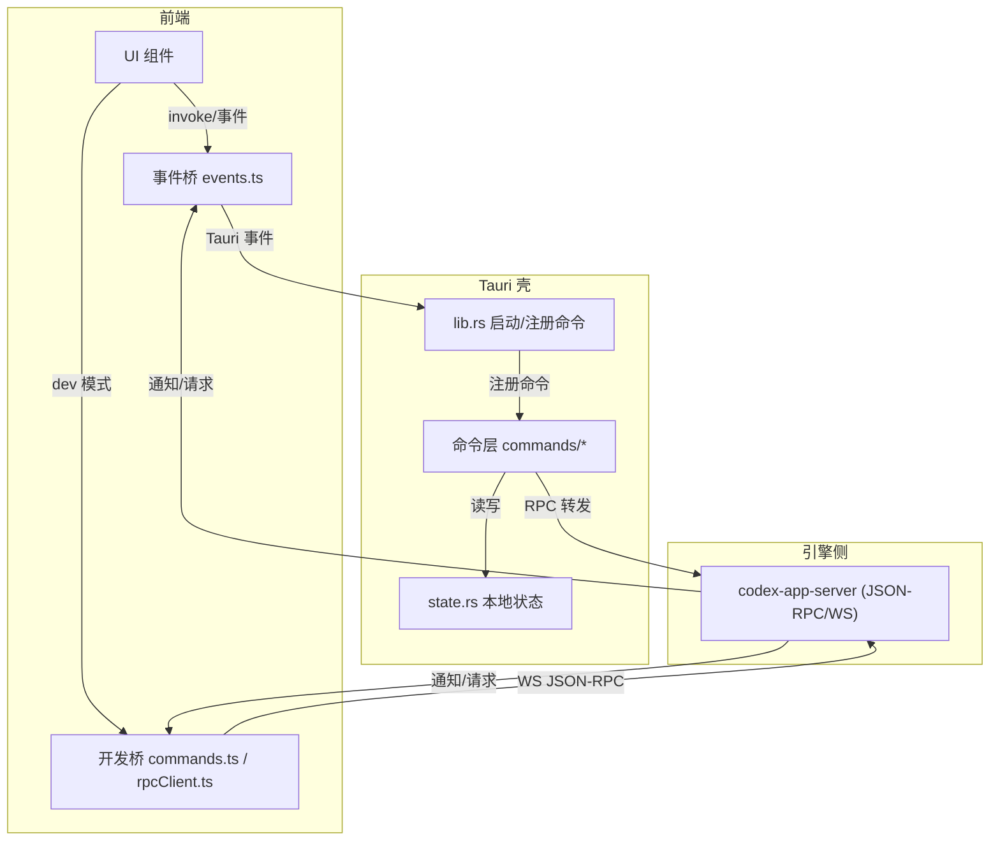
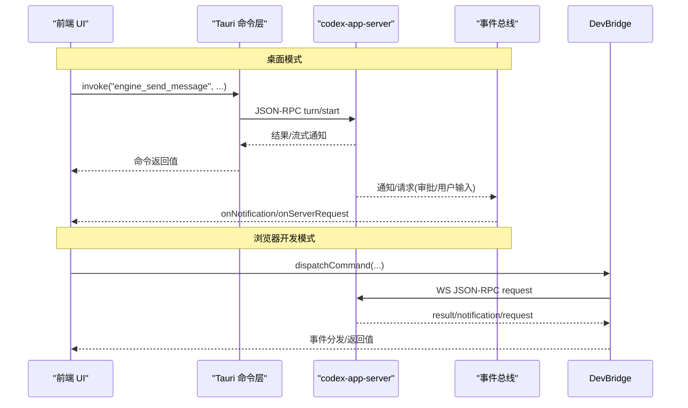
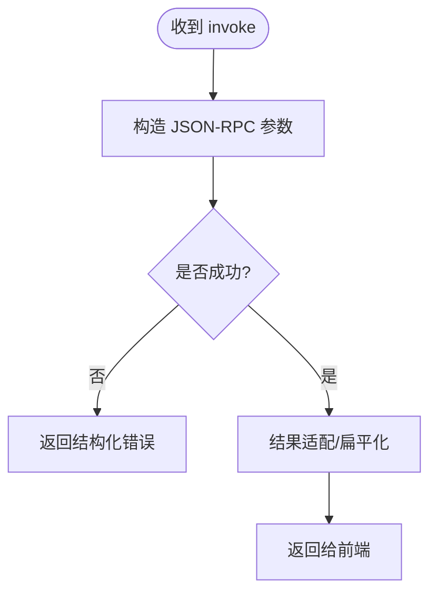
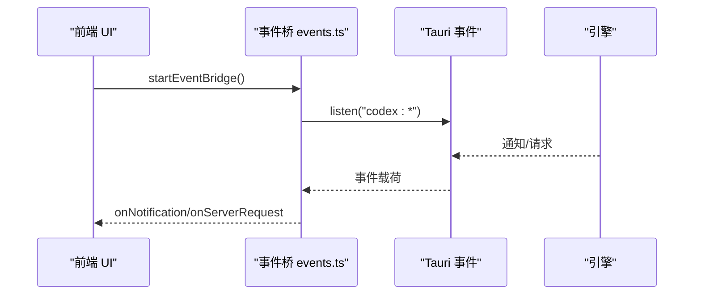
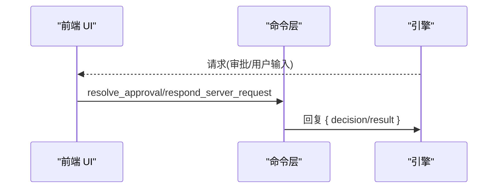
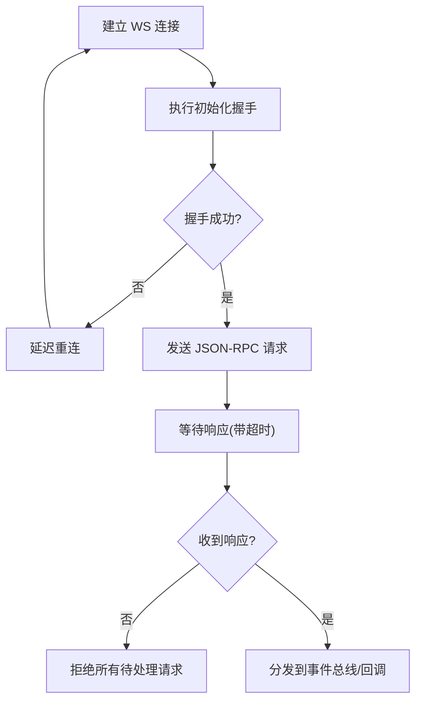
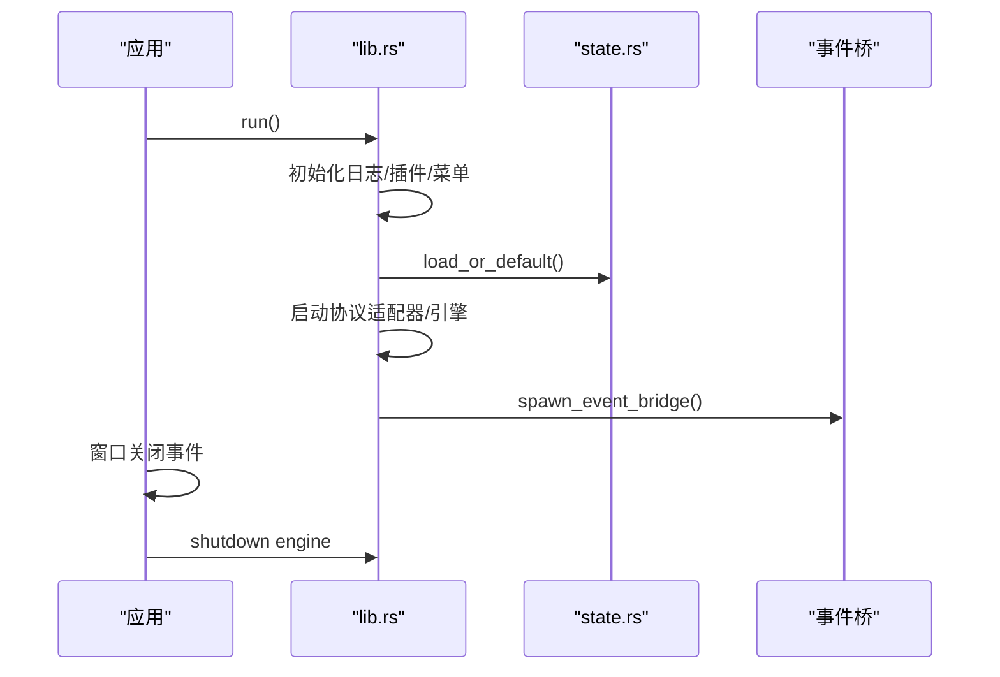
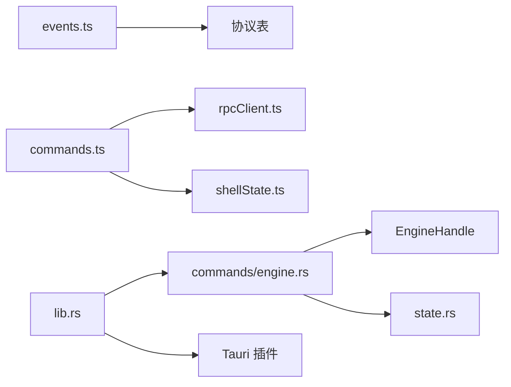

# 组件交互

<cite>
**本文引用的文件**
- [main.rs](file://src-tauri/src/main.rs)
- [lib.rs](file://src-tauri/src/lib.rs)
- [state.rs](file://src-tauri/src/state.rs)
- [commands/mod.rs](file://src-tauri/src/commands/mod.rs)
- [commands/engine.rs](file://src-tauri/src/commands/engine.rs)
- [events.ts](file://frontend/app/bridge/events.ts)
- [tauri-core.ts](file://frontend/app/devbridge/tauri-core.ts)
- [commands.ts](file://frontend/app/devbridge/commands.ts)
- [rpcClient.ts](file://frontend/app/devbridge/rpcClient.ts)
- [eventBus.ts](file://frontend/app/devbridge/eventBus.ts)
- [shellState.ts](file://frontend/app/devbridge/shellState.ts)
</cite>

## 目录
1. [简介](#简介)
2. [项目结构](#项目结构)
3. [核心组件](#核心组件)
4. [架构总览](#架构总览)
5. [详细组件分析](#详细组件分析)
6. [依赖关系分析](#依赖关系分析)
7. [性能考量](#性能考量)
8. [故障排除指南](#故障排除指南)
9. [结论](#结论)
10. [附录](#附录)

## 简介
本文件面向 Codex-Tauri 的前后端组件交互模式，聚焦以下目标：
- 前后端组件间的调用关系与事件驱动架构
- 异步任务处理机制（JSON-RPC、WebSocket、命令转发）
- 命令处理器设计、事件总线模式、回调机制实现
- 组件生命周期管理、资源清理策略、错误传播机制
- 提供时序图与调用关系图，说明解耦原则、接口抽象与扩展点
- 给出集成最佳实践与故障排除建议

## 项目结构
整体采用“前端 UI + Tauri 壳 + Rust 命令层 + 引擎侧服务”的分层架构：
- 前端通过 Tauri invoke 或浏览器开发模式的桥接层发起命令
- Rust 命令层将请求转发到 codex-app-server（JSON-RPC over WebSocket）
- 引擎侧通过事件通道回推通知与请求，前端统一接入事件总线
- 本地状态由 Rust 持久化（桌面）或浏览器 localStorage（开发模式）镜像

图表来源
- [lib.rs:16-159](file://src-tauri/src/lib.rs#L16-L159)
- [commands/engine.rs:13-20](file://src-tauri/src/commands/engine.rs#L13-L20)
- [events.ts:145-159](file://frontend/app/bridge/events.ts#L145-L159)
- [commands.ts:669-682](file://frontend/app/devbridge/commands.ts#L669-L682)
- [rpcClient.ts:70-101](file://frontend/app/devbridge/rpcClient.ts#L70-L101)

章节来源
- [lib.rs:16-159](file://src-tauri/src/lib.rs#L16-L159)
- [commands/mod.rs:1-11](file://src-tauri/src/commands/mod.rs#L1-L11)
- [events.ts:145-159](file://frontend/app/bridge/events.ts#L145-L159)
- [commands.ts:669-682](file://frontend/app/devbridge/commands.ts#L669-L682)
- [rpcClient.ts:70-101](file://frontend/app/devbridge/rpcClient.ts#L70-L101)

## 核心组件
- 命令处理器（Rust 命令层）
  - 负责接收前端 invoke 调用，参数校验与适配，再转发到引擎的 JSON-RPC 方法
  - 对返回结果做扁平化、包装等适配，保证 UI 消费一致性
- 事件总线（前端事件桥）
  - 订阅所有通知方法与两类服务器请求通道（审批、用户输入）
  - 将服务端推送的消息转换为统一的信封对象，分发给各 UI 模块
- 开发模式桥接（Browser Dev Bridge）
  - 在浏览器模式下模拟 Tauri 命令表，直接通过 WebSocket 与引擎通信
  - 使用内存虚拟 FS 与 localStorage 镜像 shell-state.json
- 本地状态管理（Rust state.rs）
  - 持久化设置、偏好、宠物、日历、连接器、快捷方式、计划任务等
  - 维护 provider 密钥与协议路由信息，注入 sidecar 环境变量

章节来源
- [commands/engine.rs:22-183](file://src-tauri/src/commands/engine.rs#L22-L183)
- [events.ts:57-159](file://frontend/app/bridge/events.ts#L57-L159)
- [commands.ts:669-682](file://frontend/app/devbridge/commands.ts#L669-L682)
- [state.rs:176-232](file://src-tauri/src/state.rs#L176-L232)

## 架构总览
下图展示从 UI 发起调用到引擎响应、再到事件回推的完整链路。包含桌面模式与浏览器开发模式两条路径。

图表来源
- [lib.rs:71-148](file://src-tauri/src/lib.rs#L71-L148)
- [commands/engine.rs:102-183](file://src-tauri/src/commands/engine.rs#L102-L183)
- [events.ts:145-159](file://frontend/app/bridge/events.ts#L145-L159)
- [commands.ts:669-682](file://frontend/app/devbridge/commands.ts#L669-L682)
- [rpcClient.ts:201-230](file://frontend/app/devbridge/rpcClient.ts#L201-L230)

## 详细组件分析

### 命令处理器设计（Rust 命令层）
- 职责
  - 接收前端 invoke 调用，构造引擎所需的 JSON-RPC 参数
  - 对返回结果进行适配（如线程对象扁平化、包裹原始消息等）
  - 处理审批/用户输入等双向请求的应答
- 关键流程
  - 会话创建、消息发送、中断、归档/取消归档
  - 模型提供者列表、MCP 服务器配置、插件能力查询
  - Shell 打开/写入/读取/关闭、Git 状态、运行时事件
- 错误处理
  - 未知或可选端点返回结构化错误，使 UI 优雅降级
  - 超时与网络异常在 RPC 层捕获并向上抛出

图表来源
- [commands/engine.rs:13-20](file://src-tauri/src/commands/engine.rs#L13-L20)
- [commands/engine.rs:30-183](file://src-tauri/src/commands/engine.rs#L30-L183)

章节来源
- [commands/engine.rs:22-183](file://src-tauri/src/commands/engine.rs#L22-L183)

### 事件总线模式（前端事件桥）
- 职责
  - 统一订阅所有通知方法与两类服务器请求通道
  - 将服务端推送的消息封装为统一信封，分发给订阅者
- 关键点
  - 事件名规范化：将 `/` 和 `.` 替换为 `-`，兼容 Tauri 事件命名限制
  - 安全监听：单个通道绑定失败不影响其他通道
  - 生命周期：启动时一次性绑定，支持停止以释放资源

图表来源
- [events.ts:57-159](file://frontend/app/bridge/events.ts#L57-L159)

章节来源
- [events.ts:57-159](file://frontend/app/bridge/events.ts#L57-L159)

### 回调机制与双向请求（审批/用户输入）
- 桌面模式
  - 引擎通过固定通道下发请求（如审批、用户输入），前端通过命令层回复
  - 命令层将请求 id 与决策结果回传给引擎
- 浏览器开发模式
  - 通过 rpcRespond 直接按 id 回复，保持与桌面一致的行为

图表来源
- [commands/engine.rs:137-183](file://src-tauri/src/commands/engine.rs#L137-L183)
- [commands.ts:112-130](file://frontend/app/devbridge/commands.ts#L112-L130)
- [rpcClient.ts:223-230](file://frontend/app/devbridge/rpcClient.ts#L223-L230)

章节来源
- [commands/engine.rs:137-183](file://src-tauri/src/commands/engine.rs#L137-L183)
- [commands.ts:112-130](file://frontend/app/devbridge/commands.ts#L112-L130)
- [rpcClient.ts:223-230](file://frontend/app/devbridge/rpcClient.ts#L223-L230)

### 异步任务处理机制（JSON-RPC 与重连）
- 请求超时
  - 初始化握手超时与通用请求超时，避免悬挂等待
- 连接管理
  - 自动重连与退避策略，断开时清理待处理请求
- 事件广播
  - 通知与请求通过事件总线分发，确保 UI 实时响应

图表来源
- [rpcClient.ts:70-101](file://frontend/app/devbridge/rpcClient.ts#L70-L101)
- [rpcClient.ts:150-187](file://frontend/app/devbridge/rpcClient.ts#L150-L187)
- [rpcClient.ts:201-230](file://frontend/app/devbridge/rpcClient.ts#L201-L230)

章节来源
- [rpcClient.ts:70-101](file://frontend/app/devbridge/rpcClient.ts#L70-L101)
- [rpcClient.ts:150-187](file://frontend/app/devbridge/rpcClient.ts#L150-L187)
- [rpcClient.ts:201-230](file://frontend/app/devbridge/rpcClient.ts#L201-L230)

### 组件生命周期管理与资源清理
- 应用启动
  - 初始化日志、加载插件、构建菜单、注册命令、启动协议适配器与服务端
  - 启动事件桥，将引擎通知扇出到前端
- 窗口关闭
  - 优雅停止 sidecar，防止资源泄漏
- 事件桥生命周期
  - 启动时批量绑定通知与请求通道；支持停止以释放监听器

图表来源
- [lib.rs:8-70](file://src-tauri/src/lib.rs#L8-L70)
- [lib.rs:149-159](file://src-tauri/src/lib.rs#L149-L159)
- [state.rs:176-232](file://src-tauri/src/state.rs#L176-L232)

章节来源
- [lib.rs:8-70](file://src-tauri/src/lib.rs#L8-L70)
- [lib.rs:149-159](file://src-tauri/src/lib.rs#L149-L159)
- [state.rs:176-232](file://src-tauri/src/state.rs#L176-L232)

### 错误传播机制
- 命令层
  - 未知/可选端点返回结构化错误，便于 UI 降级显示
- 事件桥
  - 单个通道绑定失败仅记录错误，不阻断其他通道
- 开发桥
  - 未知命令抛错；市场相关命令明确不可用提示
- RPC 客户端
  - 超时与连接断开导致待处理请求被拒绝，避免悬挂

章节来源
- [commands/engine.rs:1-6](file://src-tauri/src/commands/engine.rs#L1-L6)
- [events.ts:99-139](file://frontend/app/bridge/events.ts#L99-L139)
- [commands.ts:669-682](file://frontend/app/devbridge/commands.ts#L669-L682)
- [rpcClient.ts:201-230](file://frontend/app/devbridge/rpcClient.ts#L201-L230)

### 解耦设计原则、接口抽象与扩展点
- 解耦原则
  - 命令层只关注参数适配与转发，不耦合具体业务逻辑
  - 事件桥统一入口，屏蔽底层事件差异（Tauri/浏览器）
  - 开发桥与桌面桥共享同一命令表，降低重复实现
- 接口抽象
  - 命令表映射（commands.ts）与 Tauri 命令注册（lib.rs）形成稳定契约
  - 事件名规范化函数（events.ts）统一命名规则
- 扩展点
  - 新增命令：在命令表中添加映射，并在 Rust 命令层注册
  - 新增通知/请求：生成协议后，事件桥自动订阅新通道
  - Provider/MCP/插件：通过配置与命令扩展，无需改动核心流程

章节来源
- [commands.ts:669-682](file://frontend/app/devbridge/commands.ts#L669-L682)
- [lib.rs:71-148](file://src-tauri/src/lib.rs#L71-L148)
- [events.ts:23-30](file://frontend/app/bridge/events.ts#L23-L30)

## 依赖关系分析
- 前端依赖
  - 事件桥依赖协议表（通知/请求方法集合）
  - 开发桥依赖 rpcClient 与 shellState
- Rust 依赖
  - 命令层依赖引擎句柄与状态
  - 状态模块提供本地数据持久化与默认值
- 外部依赖
  - WebSocket 与 JSON-RPC 协议
  - Tauri 插件（对话框、Shell、文件系统、存储）

图表来源
- [events.ts:145-159](file://frontend/app/bridge/events.ts#L145-L159)
- [commands.ts:669-682](file://frontend/app/devbridge/commands.ts#L669-L682)
- [rpcClient.ts:201-230](file://frontend/app/devbridge/rpcClient.ts#L201-L230)
- [commands/engine.rs:13-20](file://src-tauri/src/commands/engine.rs#L13-L20)
- [state.rs:176-232](file://src-tauri/src/state.rs#L176-L232)
- [lib.rs:16-23](file://src-tauri/src/lib.rs#L16-L23)

章节来源
- [events.ts:145-159](file://frontend/app/bridge/events.ts#L145-L159)
- [commands.ts:669-682](file://frontend/app/devbridge/commands.ts#L669-L682)
- [rpcClient.ts:201-230](file://frontend/app/devbridge/rpcClient.ts#L201-L230)
- [commands/engine.rs:13-20](file://src-tauri/src/commands/engine.rs#L13-L20)
- [state.rs:176-232](file://src-tauri/src/state.rs#L176-L232)
- [lib.rs:16-23](file://src-tauri/src/lib.rs#L16-L23)

## 性能考量
- 减少不必要的序列化与反序列化：命令层尽量传递最小必要参数
- 批量操作：配置写入使用 batchWrite，减少往返次数
- 事件分发：事件桥对每个处理器加 try/catch，避免单点失败影响整体
- 连接复用：WS 连接保持并自动重连，避免频繁握手开销
- 超时控制：合理设置初始化与请求超时，避免长时间阻塞

[本节为通用指导，不直接分析具体文件]

## 故障排除指南
- 无法连接引擎
  - 检查 WebSocket 地址与代理配置
  - 确认初始化握手是否完成，查看连接状态
- 命令无响应
  - 检查命令是否在命令表中注册
  - 查看 RPC 超时与待处理请求是否被拒绝
- 事件未触发
  - 确认事件名规范化是否正确
  - 检查事件桥是否已启动并绑定通道
- 审批/用户输入无反馈
  - 确认请求 id 正确回传
  - 检查命令层 respond 调用是否成功

章节来源
- [rpcClient.ts:70-101](file://frontend/app/devbridge/rpcClient.ts#L70-L101)
- [rpcClient.ts:150-187](file://frontend/app/devbridge/rpcClient.ts#L150-L187)
- [events.ts:99-139](file://frontend/app/bridge/events.ts#L99-L139)
- [commands/engine.rs:137-183](file://src-tauri/src/commands/engine.rs#L137-L183)

## 结论
Codex-Tauri 通过清晰的命令层、统一的事件总线与稳定的 JSON-RPC 协议，实现了前后端的高内聚、低耦合交互。桌面模式与浏览器开发模式共享命令表与事件语义，提升了可维护性与可测试性。结合生命周期管理与错误传播机制，系统具备良好的健壮性与可扩展性。

[本节为总结，不直接分析具体文件]

## 附录
- 最佳实践
  - 新增命令时，同步更新命令表与 Rust 命令注册
  - 新增通知/请求时，确保协议表生成并验证事件名
  - 使用批写与最小参数传递优化性能
  - 在事件处理器中做好异常隔离，避免级联失败
- 调试技巧
  - 启用详细日志，观察握手与重连过程
  - 使用开发模式桥快速验证命令与事件流转
  - 检查本地状态文件与 localStorage 内容一致性

[本节为补充信息，不直接分析具体文件]