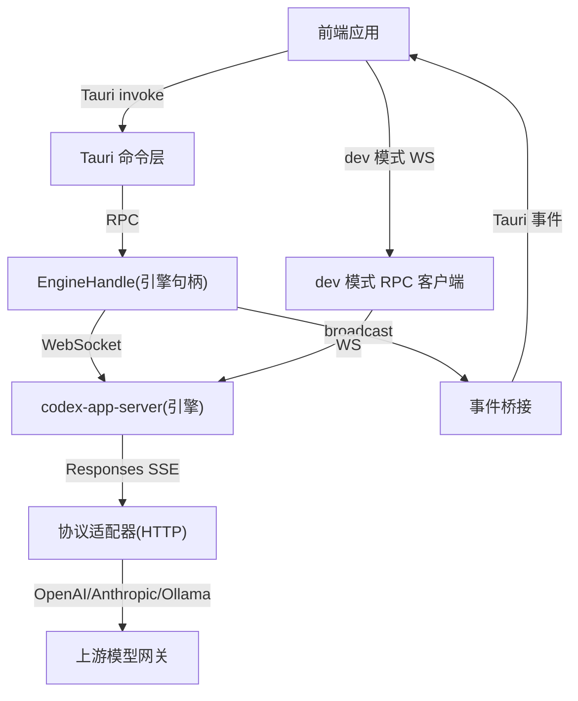
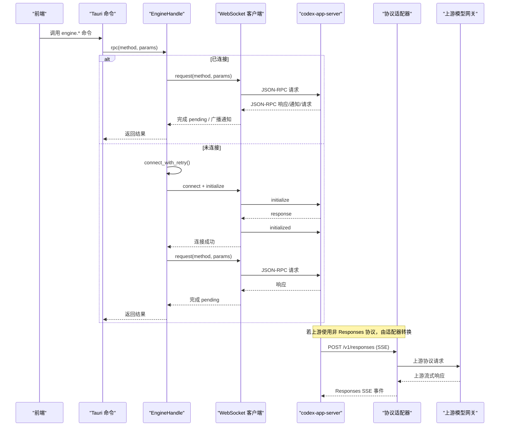
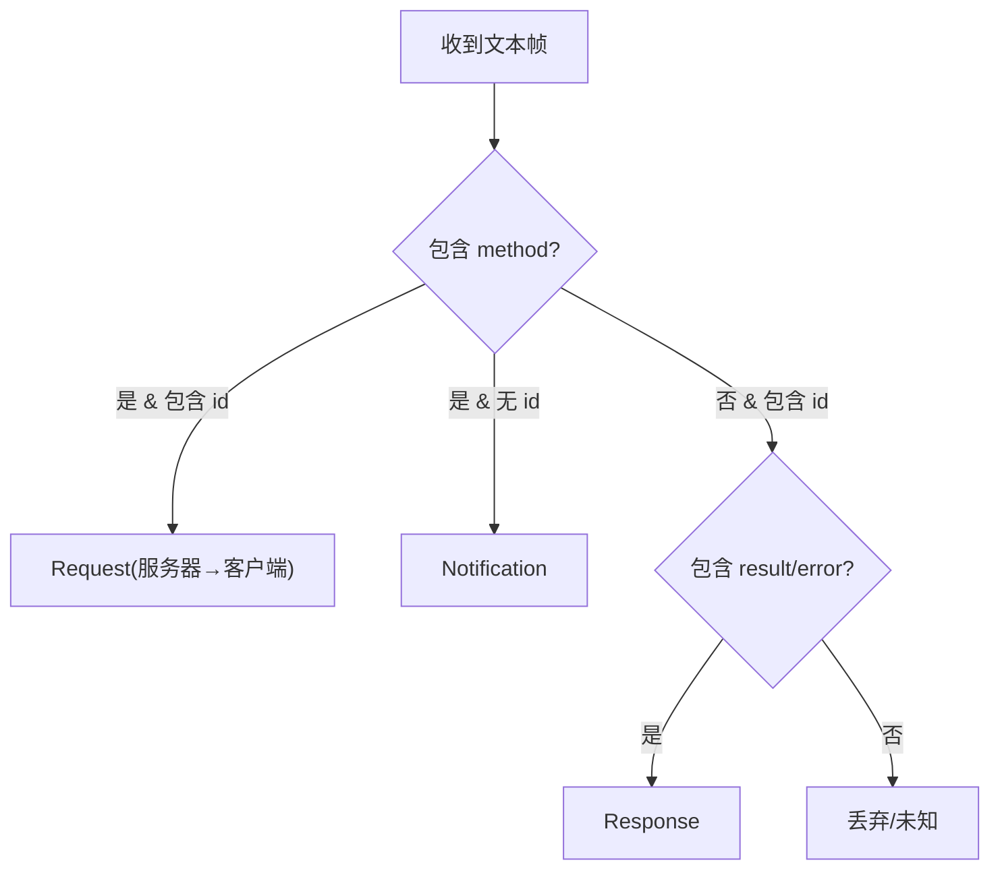
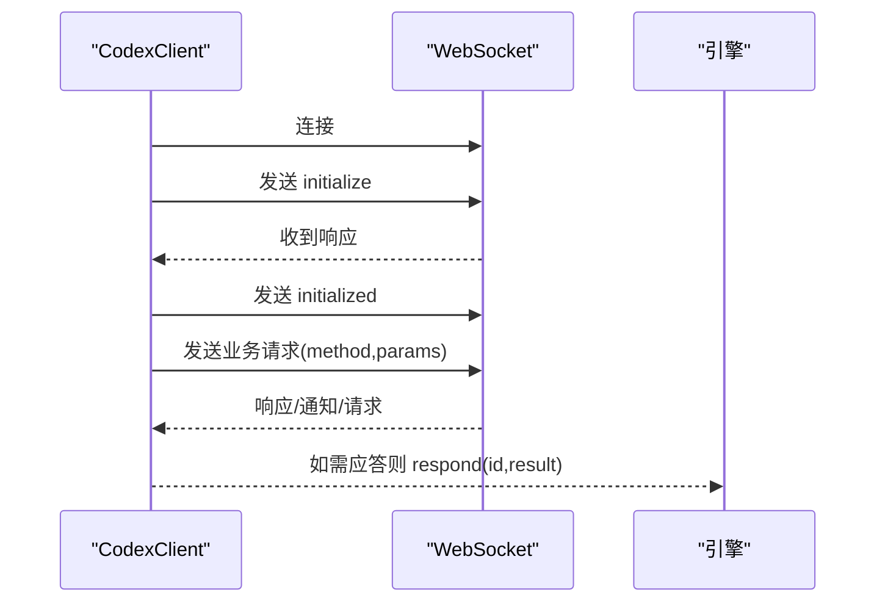
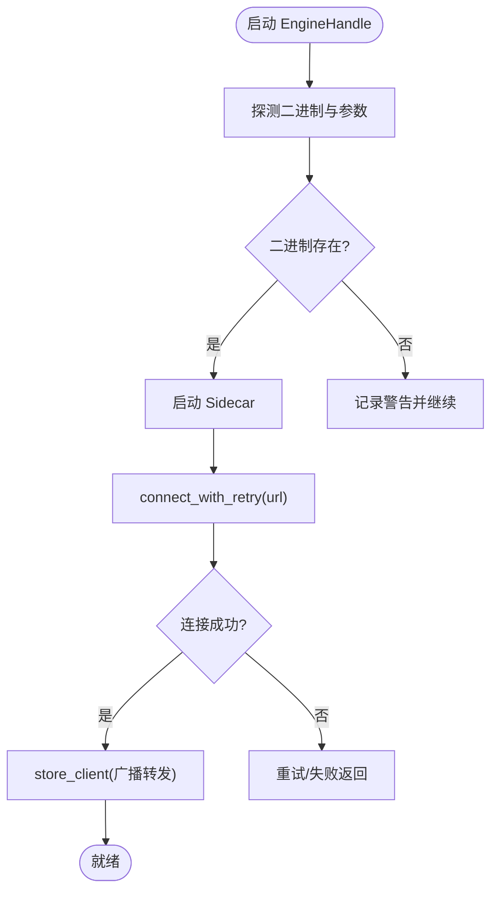
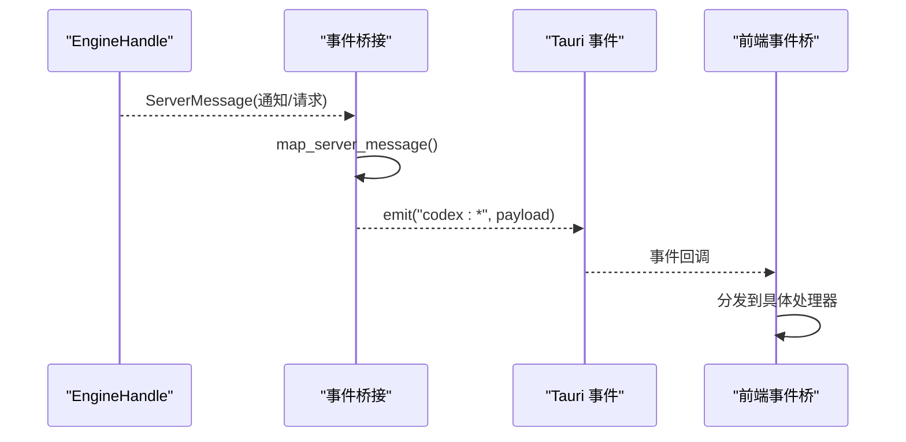
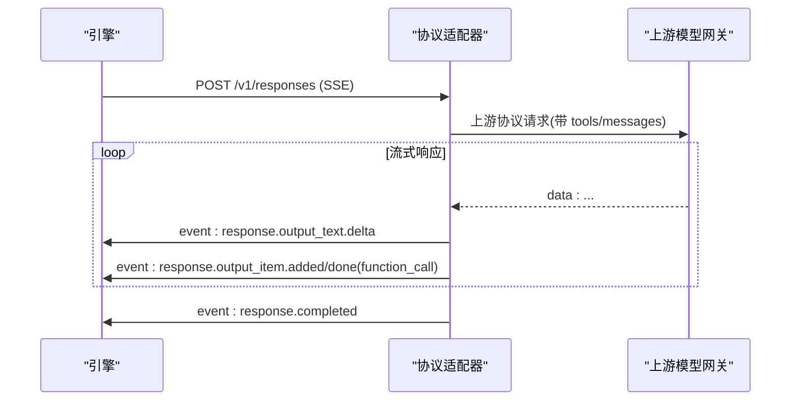
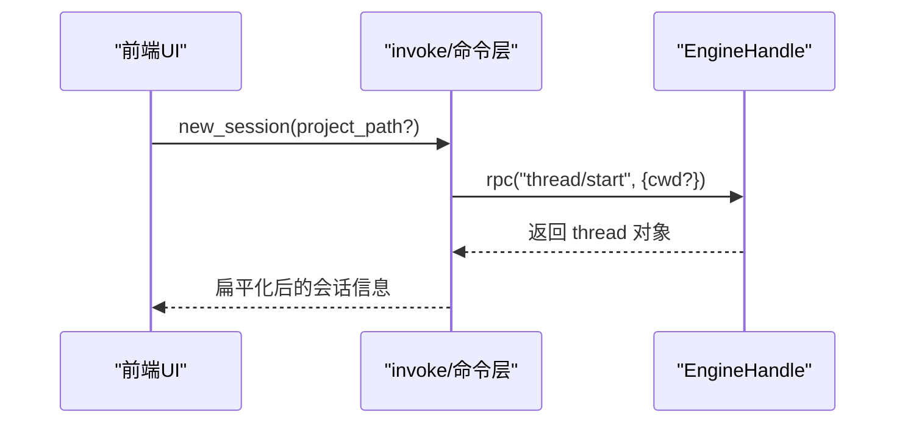
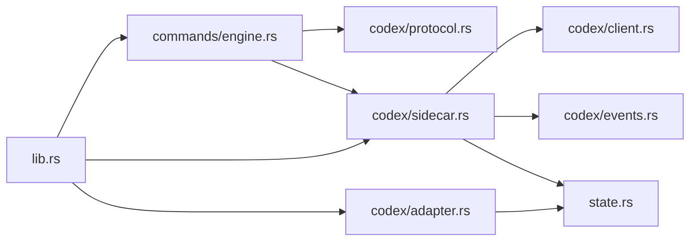
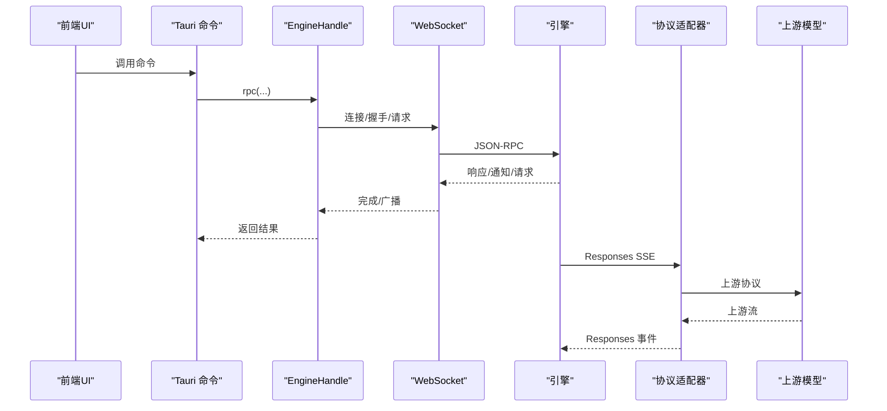

# 通信协议

<cite>
**本文引用的文件**
- [src-tauri/src/codex/mod.rs](file://src-tauri/src/codex/mod.rs)
- [src-tauri/src/codex/protocol.rs](file://src-tauri/src/codex/protocol.rs)
- [src-tauri/src/codex/client.rs](file://src-tauri/src/codex/client.rs)
- [src-tauri/src/codex/sidecar.rs](file://src-tauri/src/codex/sidecar.rs)
- [src-tauri/src/codex/events.rs](file://src-tauri/src/codex/events.rs)
- [src-tauri/src/codex/adapter.rs](file://src-tauri/src/codex/adapter.rs)
- [src-tauri/src/lib.rs](file://src-tauri/src/lib.rs)
- [src-tauri/src/commands/engine.rs](file://src-tauri/src/commands/engine.rs)
- [frontend/app/devbridge/rpcClient.ts](file://frontend/app/devbridge/rpcClient.ts)
- [frontend/app/devbridge/eventBus.ts](file://frontend/app/devbridge/eventBus.ts)
- [frontend/app/devbridge/tauri-core.ts](file://frontend/app/devbridge/tauri-core.ts)
- [frontend/app/devbridge/tauri-event.ts](file://frontend/app/devbridge/tauri-event.ts)
- [frontend/app/bridge/events.ts](file://frontend/app/bridge/events.ts)
- [frontend/src/protocol/requests.ts](file://frontend/src/protocol/requests.ts)
- [frontend/src/protocol/notifications.ts](file://frontend/src/protocol/notifications.ts)
</cite>

## 目录
1. [简介](#简介)
2. [项目结构](#项目结构)
3. [核心组件](#核心组件)
4. [架构总览](#架构总览)
5. [详细组件分析](#详细组件分析)
6. [依赖关系分析](#依赖关系分析)
7. [性能考虑](#性能考虑)
8. [故障排查指南](#故障排查指南)
9. [结论](#结论)
10. [附录](#附录)

## 简介
本文件为 Codex-Tauri 的通信协议文档，覆盖前后端 IPC、WebSocket 实时通信、事件驱动消息传递、Sidecar 进程间通信、协议适配器流程与事件广播机制。文档包含通信流程图、数据包格式说明、连接管理与重连策略、安全与性能优化建议，以及客户端集成示例与调试方法。

## 项目结构
- 后端（Rust/Tauri）
  - 引擎句柄：管理 codex-app-server Sidecar 生命周期、WebSocket 连接、RPC 请求与响应、事件广播通道。
  - 协议定义：JSON-RPC 方法名、请求/通知/响应结构体、解析器。
  - 事件桥接：将引擎侧消息映射为 Tauri 前端事件。
  - 协议适配器：本地 HTTP 服务，将官方 Responses 协议适配到 OpenAI Chat、Anthropic Messages、Ollama 等上游协议。
  - 命令层：暴露 Tauri 命令给前端调用，转发至引擎或执行配置变更。
- 前端（TypeScript/React）
  - 开发模式 RPC 客户端：浏览器下直连引擎 WebSocket，实现握手、请求、重连、事件分发。
  - 事件总线：模拟 Tauri 事件 API，用于浏览器开发模式。
  - 事件桥接：订阅 Tauri 事件，统一分发给 UI 模块。
  - 协议类型：自动生成通知与方法清单，供前端按契约消费。

**图示来源**
- [src-tauri/src/lib.rs:23-69](file://src-tauri/src/lib.rs#L23-L69)
- [src-tauri/src/codex/sidecar.rs:22-139](file://src-tauri/src/codex/sidecar.rs#L22-L139)
- [src-tauri/src/codex/events.rs:11-43](file://src-tauri/src/codex/events.rs#L11-L43)
- [src-tauri/src/codex/adapter.rs:68-111](file://src-tauri/src/codex/adapter.rs#L68-L111)
- [frontend/app/devbridge/rpcClient.ts:37-189](file://frontend/app/devbridge/rpcClient.ts#L37-L189)

**章节来源**
- [src-tauri/src/lib.rs:23-69](file://src-tauri/src/lib.rs#L23-L69)
- [src-tauri/src/codex/mod.rs:1-9](file://src-tauri/src/codex/mod.rs#L1-L9)

## 核心组件
- JSON-RPC 协议与消息解析
  - 方法名常量、请求/响应/通知结构体、服务端消息解析器、ID 规范化。
- WebSocket 客户端
  - 建立连接、initialize/initialized 握手、请求超时、通知广播、服务端请求应答。
- 引擎句柄与 Sidecar
  - 启动/停止 Sidecar、自动重试连接、事件广播通道、元数据缓存。
- 事件桥接
  - 将服务端通知与请求映射为 Tauri 事件，命名规范与路由规则。
- 协议适配器
  - 监听本地 HTTP，接收 Responses 请求，适配到上游协议并回写 Responses SSE。
- 命令层
  - 将前端 Tauri 命令转发到引擎 RPC，封装参数与结果。

**章节来源**
- [src-tauri/src/codex/protocol.rs:103-207](file://src-tauri/src/codex/protocol.rs#L103-L207)
- [src-tauri/src/codex/client.rs:23-199](file://src-tauri/src/codex/client.rs#L23-L199)
- [src-tauri/src/codex/sidecar.rs:22-276](file://src-tauri/src/codex/sidecar.rs#L22-L276)
- [src-tauri/src/codex/events.rs:11-82](file://src-tauri/src/codex/events.rs#L11-L82)
- [src-tauri/src/codex/adapter.rs:68-724](file://src-tauri/src/codex/adapter.rs#L68-L724)
- [src-tauri/src/commands/engine.rs:13-183](file://src-tauri/src/commands/engine.rs#L13-L183)

## 架构总览
系统采用“前端 → Tauri 命令 → 引擎句柄 → WebSocket(JSON-RPC) → 引擎”的主路径；同时通过“事件广播通道 → Tauri 事件 → 前端事件桥”实现服务端推送。对于非 Responses 协议的第三方模型，提供本地协议适配器进行双向转换。

**图示来源**
- [src-tauri/src/codex/sidecar.rs:188-244](file://src-tauri/src/codex/sidecar.rs#L188-L244)
- [src-tauri/src/codex/client.rs:37-199](file://src-tauri/src/codex/client.rs#L37-L199)
- [src-tauri/src/codex/adapter.rs:113-220](file://src-tauri/src/codex/adapter.rs#L113-L220)
- [src-tauri/src/commands/engine.rs:13-183](file://src-tauri/src/commands/engine.rs#L13-L183)

## 详细组件分析

### JSON-RPC 协议与消息格式
- 方法名：线程、回合、配置、MCP、插件、Shell、项目等类别的方法常量集中定义。
- 请求/响应/通知：
  - 请求：id、method、params（可选）。
  - 响应：id、result 或 error。
  - 通知：method、params（可选）。
- 服务端消息解析：根据字段组合区分 Request/Notification/Response。
- ID 规范化：字符串或数字 id 统一转为字符串键，便于待处理映射。

**图示来源**
- [src-tauri/src/codex/protocol.rs:103-207](file://src-tauri/src/codex/protocol.rs#L103-L207)

**章节来源**
- [src-tauri/src/codex/protocol.rs:1-207](file://src-tauri/src/codex/protocol.rs#L1-L207)

### WebSocket 客户端与握手
- 连接后执行三步握手：发送 initialize → 等待响应 → 发送 initialized 通知（无 params）。
- 请求：生成唯一 id，注册 oneshot 通道，设置超时，发送 JSON-RPC 请求。
- 响应：根据 id 完成对应 pending；错误携带 code/message。
- 通知/请求：广播到 notify channel，供事件桥接消费。
- 服务端请求应答：对 approval/user-input/elicitation 等请求，通过 respond(id, result) 回复。

**图示来源**
- [src-tauri/src/codex/client.rs:37-199](file://src-tauri/src/codex/client.rs#L37-L199)

**章节来源**
- [src-tauri/src/codex/client.rs:1-234](file://src-tauri/src/codex/client.rs#L1-L234)

### 引擎句柄与 Sidecar 进程管理
- Sidecar 发现与启动：支持多入口（环境变量、设置、资源目录、PATH），探测 CLI 形状（是否需子命令、是否接受 --session-source）。
- 连接重试：首次冷启动时多次尝试连接，避免竞态导致失败。
- 事件广播：每次新客户端连接都会将其通知转发到稳定的 broadcast 通道，保证事件不丢失。
- 元数据：保存最后一次 initialize 的结果，供 UI 读取能力信息。
- 关闭：断开客户端并终止 Sidecar 进程。

**图示来源**
- [src-tauri/src/codex/sidecar.rs:31-139](file://src-tauri/src/codex/sidecar.rs#L31-L139)
- [src-tauri/src/codex/sidecar.rs:188-244](file://src-tauri/src/codex/sidecar.rs#L188-L244)
- [src-tauri/src/codex/sidecar.rs:278-360](file://src-tauri/src/codex/sidecar.rs#L278-L360)

**章节来源**
- [src-tauri/src/codex/sidecar.rs:1-540](file://src-tauri/src/codex/sidecar.rs#L1-L540)

### 事件桥接与前端事件映射
- 命名规则：将 method 中的 “/” 和 “.” 替换为 “-”，形成 Tauri 事件名 `codex:*`。
- 路由规则：
  - 通知：直接映射为 `codex:{sanitized-method}`。
  - 请求：approval/user-input/elicitation 走专用频道，其他走 `codex:server-request-{sanitized}`。
- 前端桥接：在 Tauri 模式下，前端监听这些事件；在浏览器开发模式下，由 dev 事件总线模拟相同行为。

**图示来源**
- [src-tauri/src/codex/events.rs:11-82](file://src-tauri/src/codex/events.rs#L11-L82)
- [frontend/app/bridge/events.ts:23-159](file://frontend/app/bridge/events.ts#L23-L159)

**章节来源**
- [src-tauri/src/codex/events.rs:1-82](file://src-tauri/src/codex/events.rs#L1-L82)
- [frontend/app/bridge/events.ts:1-172](file://frontend/app/bridge/events.ts#L1-L172)

### 协议适配器工作流程
- 监听本地 HTTP 端口，接收 POST /v1/responses。
- 根据当前激活 ProviderRoute，选择上游协议（OpenAI Chat、Anthropic Messages、Ollama）。
- 将 Responses 请求转换为上游格式，转发请求并读取上游流式响应。
- 将上游流式数据转换为 Responses SSE 事件序列，回写给引擎。
- 工具调用聚合：对 OpenAI Chat 增量 tool_calls 进行聚合，最终输出完整 function_call。

**图示来源**
- [src-tauri/src/codex/adapter.rs:113-220](file://src-tauri/src/codex/adapter.rs#L113-L220)
- [src-tauri/src/codex/adapter.rs:222-724](file://src-tauri/src/codex/adapter.rs#L222-L724)

**章节来源**
- [src-tauri/src/codex/adapter.rs:1-800](file://src-tauri/src/codex/adapter.rs#L1-L800)

### 命令层与前端集成
- Tauri 命令：engine_status、new_session、send_message、resolve_approval、respond_server_request、list_providers、save_provider、probe_provider、open_shell 等。
- 参数封装：例如 send_message 将输入项包装为 UserInput 数组；shell 操作使用 command/exec 系列方法。
- 前端集成：
  - Tauri 模式：通过 @tauri-apps/api/core 的 invoke 调用命令。
  - 浏览器开发模式：通过 devbridge 的 tauri-core.ts 与 rpcClient.ts 直连引擎 WebSocket，保持与后端一致的事件语义。

**图示来源**
- [src-tauri/src/commands/engine.rs:30-52](file://src-tauri/src/commands/engine.rs#L30-L52)
- [frontend/app/devbridge/tauri-core.ts:10-17](file://frontend/app/devbridge/tauri-core.ts#L10-L17)

**章节来源**
- [src-tauri/src/commands/engine.rs:1-861](file://src-tauri/src/commands/engine.rs#L1-L861)
- [frontend/app/devbridge/tauri-core.ts:1-24](file://frontend/app/devbridge/tauri-core.ts#L1-L24)

## 依赖关系分析
- 模块耦合
  - commands/engine.rs 依赖 codex::protocol 与 EngineHandle。
  - sidecar.rs 依赖 client.rs、events.rs、state.rs。
  - adapter.rs 独立于引擎，仅依赖运行时网络库与配置状态。
  - events.rs 依赖 EngineHandle 的广播通道。
- 外部依赖
  - WebSocket 客户端使用 tokio_tungstenite。
  - 协议适配器使用 reqwest 与 tokio 网络原语。
  - 事件桥接使用 Tauri 事件 API。

**图示来源**
- [src-tauri/src/lib.rs:23-69](file://src-tauri/src/lib.rs#L23-L69)
- [src-tauri/src/commands/engine.rs:1-183](file://src-tauri/src/commands/engine.rs#L1-L183)
- [src-tauri/src/codex/sidecar.rs:1-139](file://src-tauri/src/codex/sidecar.rs#L1-L139)

**章节来源**
- [src-tauri/src/lib.rs:1-162](file://src-tauri/src/lib.rs#L1-L162)

## 性能考虑
- 连接与重试
  - Sidecar 启动后使用有限预算的重试策略，避免阻塞 UI。
  - 请求超时：initialize 10s，普通 RPC 120s，防止长时间挂起。
- 事件容量
  - 广播通道容量 256，消费者滞后会记录告警，避免内存无限增长。
- 流式处理
  - 协议适配器逐行缓冲解析上游 SSE，及时输出 Responses 事件，降低延迟。
- 资源释放
  - 关闭窗口时主动 shutdown 引擎句柄，确保 Sidecar 与连接清理。

[本节为通用指导，无需特定文件引用]

## 故障排查指南
- 无法连接引擎
  - 检查 Sidecar 二进制是否存在与可执行权限；查看日志中 spawn 与 connect 错误。
  - 确认 listen URL 与端口未被占用。
- 握手失败
  - 确认 initialize 响应正常且后续发送了 initialized 通知。
- 事件未到达前端
  - 检查事件桥接是否订阅成功；核对事件名映射（/ 与 . 替换为 -）。
- 上游协议错误
  - 协议适配器返回 502 或上游错误码时，检查 base_url、鉴权头与协议匹配。
- Shell 会话异常
  - open_shell 可能先返回空/错误但进程存活；write/close 仍可使用 processId。

**章节来源**
- [src-tauri/src/codex/sidecar.rs:188-244](file://src-tauri/src/codex/sidecar.rs#L188-L244)
- [src-tauri/src/codex/client.rs:96-199](file://src-tauri/src/codex/client.rs#L96-L199)
- [src-tauri/src/codex/adapter.rs:222-724](file://src-tauri/src/codex/adapter.rs#L222-L724)
- [src-tauri/src/commands/engine.rs:695-799](file://src-tauri/src/commands/engine.rs#L695-L799)

## 结论
Codex-Tauri 通过 Tauri 命令层、WebSocket JSON-RPC、事件广播与协议适配器，实现了稳定可靠的前后端通信与实时交互。Sidecar 的生命周期管理、连接重试与事件广播保证了高可用；协议适配器扩展了对多种上游模型的支持。前端通过统一的桥接与事件总线，屏蔽底层差异，提供一致的集成体验。

[本节为总结性内容，无需特定文件引用]

## 附录

### 通信流程图（端到端）

**图示来源**
- [src-tauri/src/codex/sidecar.rs:188-244](file://src-tauri/src/codex/sidecar.rs#L188-L244)
- [src-tauri/src/codex/client.rs:37-199](file://src-tauri/src/codex/client.rs#L37-L199)
- [src-tauri/src/codex/adapter.rs:113-220](file://src-tauri/src/codex/adapter.rs#L113-L220)

### 数据包格式说明
- JSON-RPC 请求
  - 字段：id、method、params（可选）
- JSON-RPC 响应
  - 字段：id、result 或 error（code、message、data 可选）
- 通知
  - 字段：method、params（可选）
- 服务端请求（approval/user-input/elicitation）
  - 字段：id、method、params（可选），前端需以 respond(id, result) 回复

**章节来源**
- [src-tauri/src/codex/protocol.rs:103-207](file://src-tauri/src/codex/protocol.rs#L103-L207)

### 连接管理与重连策略
- 引擎句柄
  - 首次连接使用固定次数与间隔重试，避免冷启动竞态。
  - 连接成功后维护活跃状态，并在关闭时释放资源。
- 前端开发模式
  - 断线后定时重连，失败时清空待处理请求并重置初始化状态。

**章节来源**
- [src-tauri/src/codex/sidecar.rs:188-244](file://src-tauri/src/codex/sidecar.rs#L188-L244)
- [frontend/app/devbridge/rpcClient.ts:150-189](file://frontend/app/devbridge/rpcClient.ts#L150-L189)

### 安全考虑
- 密钥注入
  - 提供商密钥保存在本机 shell 存储，通过环境变量注入 Sidecar，不写入配置文件。
- 鉴权头
  - 协议适配器根据上游协议设置 Authorization 或 x-api-key。
- 最小权限
  - 仅启用必要的功能开关（如禁用 code_mode_host），减少攻击面。

**章节来源**
- [src-tauri/src/commands/engine.rs:248-404](file://src-tauri/src/commands/engine.rs#L248-L404)
- [src-tauri/src/codex/adapter.rs:222-268](file://src-tauri/src/codex/adapter.rs#L222-L268)

### 客户端集成示例与调试
- Tauri 模式
  - 通过 @tauri-apps/api/core 的 invoke 调用 engine.* 命令。
  - 订阅 Tauri 事件 codex:*，处理通知与请求。
- 浏览器开发模式
  - 使用 devbridge 的 tauri-core.ts 与 rpcClient.ts 直连引擎 WebSocket。
  - 通过 eventBus.ts 模拟 Tauri 事件 API，便于本地调试。
- 调试要点
  - 观察 initialize 握手与 initialized 通知。
  - 检查事件名映射是否正确（/ 与 . 替换为 -）。
  - 关注上游协议适配器的 502 或错误响应。

**章节来源**
- [frontend/app/devbridge/tauri-core.ts:10-17](file://frontend/app/devbridge/tauri-core.ts#L10-L17)
- [frontend/app/devbridge/rpcClient.ts:70-148](file://frontend/app/devbridge/rpcClient.ts#L70-L148)
- [frontend/app/devbridge/eventBus.ts:21-47](file://frontend/app/devbridge/eventBus.ts#L21-L47)
- [frontend/app/bridge/events.ts:95-159](file://frontend/app/bridge/events.ts#L95-L159)