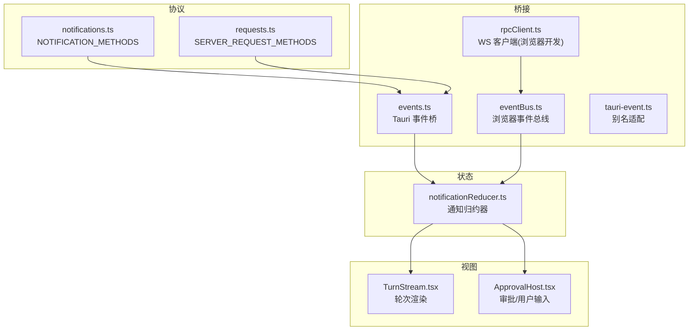
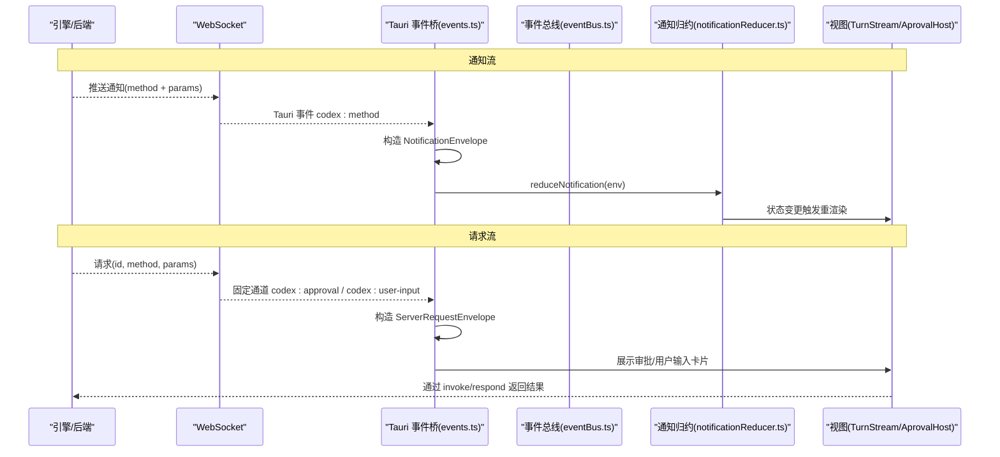
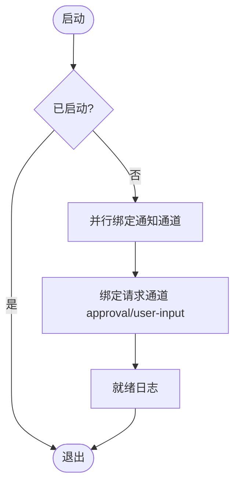
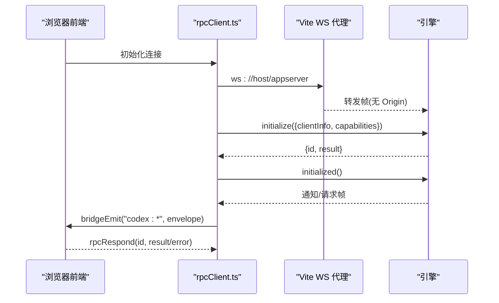
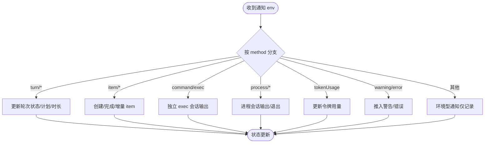
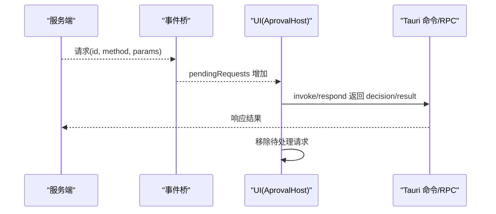
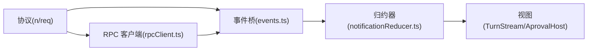

# 事件系统

<cite>
**本文引用的文件**
- [events.ts](file://frontend/app/bridge/events.ts)
- [eventBus.ts](file://frontend/app/devbridge/eventBus.ts)
- [tauri-event.ts](file://frontend/app/devbridge/tauri-event.ts)
- [rpcClient.ts](file://frontend/app/devbridge/rpcClient.ts)
- [notifications.ts](file://frontend/src/protocol/notifications.ts)
- [requests.ts](file://frontend/src/protocol/requests.ts)
- [notificationReducer.ts](file://frontend/app/state/notificationReducer.ts)
- [TurnStream.tsx](file://frontend/app/views/TurnStream.tsx)
- [ApprovalHost.tsx](file://frontend/app/approvals/ApprovalHost.tsx)
</cite>

## 目录
1. [简介](#简介)
2. [项目结构](#项目结构)
3. [核心组件](#核心组件)
4. [架构总览](#架构总览)
5. [详细组件分析](#详细组件分析)
6. [依赖关系分析](#依赖关系分析)
7. [性能考虑](#性能考虑)
8. [故障排查指南](#故障排查指南)
9. [结论](#结论)
10. [附录](#附录)

## 简介
本文件为 Codex-Tauri 的事件驱动架构提供系统化文档，重点覆盖：
- WebSocket 双向通信机制与实时数据流处理
- 事件订阅与发布模式（通知、请求）
- 前后端事件桥接、消息序列化、错误重试与连接管理
- 通知系统、状态同步、进度更新与用户交互事件的传递
- 事件类型定义、消息格式规范、性能优化与调试工具使用
- 事件处理示例与自定义事件扩展指南

该事件系统以前端生成的协议表为契约，通过 Tauri 事件通道或浏览器开发模式的虚拟事件总线，将后端（或引擎）推送的通知和请求统一接入前端状态机与 UI。

## 项目结构
事件系统主要位于前端：
- 协议层：自动生成通知与请求方法清单，作为订阅与处理的白名单
- 桥接层：Tauri 事件桥与浏览器开发模式的事件总线
- 状态层：通知归约器将事件映射为应用状态变更
- 视图层：渲染当前轮次、审批与用户输入等交互

图表来源
- [notifications.ts:10-95](file://frontend/src/protocol/notifications.ts#L10-L95)
- [requests.ts:10-48](file://frontend/src/protocol/requests.ts#L10-L48)
- [events.ts:13-159](file://frontend/app/bridge/events.ts#L13-L159)
- [eventBus.ts:19-46](file://frontend/app/devbridge/eventBus.ts#L19-L46)
- [tauri-event.ts:9-22](file://frontend/app/devbridge/tauri-event.ts#L9-L22)
- [rpcClient.ts:20-189](file://frontend/app/devbridge/rpcClient.ts#L20-L189)
- [notificationReducer.ts:189-445](file://frontend/app/state/notificationReducer.ts#L189-L445)
- [TurnStream.tsx:64-186](file://frontend/app/views/TurnStream.tsx#L64-L186)
- [ApprovalHost.tsx:20-92](file://frontend/app/approvals/ApprovalHost.tsx#L20-L92)

章节来源
- [notifications.ts:10-95](file://frontend/src/protocol/notifications.ts#L10-L95)
- [requests.ts:10-48](file://frontend/src/protocol/requests.ts#L10-L48)
- [events.ts:13-159](file://frontend/app/bridge/events.ts#L13-L159)
- [eventBus.ts:19-46](file://frontend/app/devbridge/eventBus.ts#L19-L46)
- [tauri-event.ts:9-22](file://frontend/app/devbridge/tauri-event.ts#L9-L22)
- [rpcClient.ts:20-189](file://frontend/app/devbridge/rpcClient.ts#L20-L189)
- [notificationReducer.ts:189-445](file://frontend/app/state/notificationReducer.ts#L189-L445)
- [TurnStream.tsx:64-186](file://frontend/app/views/TurnStream.tsx#L64-L186)
- [ApprovalHost.tsx:20-92](file://frontend/app/approvals/ApprovalHost.tsx#L20-L92)

## 核心组件
- 协议清单：自动生成并维护通知与请求方法集合，确保前后端一致
- Tauri 事件桥：监听所有通知通道与固定请求通道，封装为统一信封并分发到处理器
- 浏览器开发事件总线：在浏览器模式下模拟 Tauri 事件语义，便于本地调试
- JSON-RPC 客户端：实现握手、请求/响应、超时、重连，并将服务端请求路由到事件总线
- 通知归约器：将每个通知映射为状态变更（如轮次开始/结束、增量文本、进度、警告等）
- 视图组件：基于状态渲染轮次、审批与用户输入，保证可交互与可观测

章节来源
- [notifications.ts:10-95](file://frontend/src/protocol/notifications.ts#L10-L95)
- [requests.ts:10-48](file://frontend/src/protocol/requests.ts#L10-L48)
- [events.ts:57-159](file://frontend/app/bridge/events.ts#L57-L159)
- [eventBus.ts:19-46](file://frontend/app/devbridge/eventBus.ts#L19-L46)
- [rpcClient.ts:70-189](file://frontend/app/devbridge/rpcClient.ts#L70-L189)
- [notificationReducer.ts:189-445](file://frontend/app/state/notificationReducer.ts#L189-L445)
- [TurnStream.tsx:64-186](file://frontend/app/views/TurnStream.tsx#L64-L186)
- [ApprovalHost.tsx:20-92](file://frontend/app/approvals/ApprovalHost.tsx#L20-L92)

## 架构总览
下图展示了从后端（或引擎）到前端 UI 的端到端事件流，包括通知与请求两条路径。

图表来源
- [events.ts:99-159](file://frontend/app/bridge/events.ts#L99-L159)
- [eventBus.ts:21-46](file://frontend/app/devbridge/eventBus.ts#L21-L46)
- [rpcClient.ts:103-189](file://frontend/app/devbridge/rpcClient.ts#L103-L189)
- [notificationReducer.ts:189-445](file://frontend/app/state/notificationReducer.ts#L189-L445)
- [ApprovalHost.tsx:31-92](file://frontend/app/approvals/ApprovalHost.tsx#L31-L92)

## 详细组件分析

### 事件桥与通道命名（Tauri）
- 通道命名规则：将协议方法中的“.”和“/”替换为“-”，前缀为“codex:”，以兼容 Tauri 对事件名的限制
- 通知订阅：按 NOTIFICATION_METHODS 批量绑定监听，失败不中断整体启动
- 请求订阅：固定监听两个通道用于服务端→客户端请求（审批、用户输入）
- 信封模型：
  - 通知信封：包含 method、params、receivedAt
  - 请求信封：包含 id、method、params、receivedAt
- 生命周期：startEventBridge 一次性绑定；stopEventBridge 清理监听

图表来源
- [events.ts:23-30](file://frontend/app/bridge/events.ts#L23-L30)
- [events.ts:57-159](file://frontend/app/bridge/events.ts#L57-L159)

章节来源
- [events.ts:23-30](file://frontend/app/bridge/events.ts#L23-L30)
- [events.ts:57-159](file://frontend/app/bridge/events.ts#L57-L159)

### 浏览器开发模式事件总线与 RPC 客户端
- 事件总线：提供 listen/emit，模拟 Tauri 事件语义，便于浏览器调试
- RPC 客户端：
  - 连接：通过 Vite 代理到 /appserver，去除 Origin 头
  - 握手：三步（initialize → response → initialized），带能力声明
  - 请求：字符串 id，120s 超时，挂起队列管理
  - 消息路由：
    - 通知：广播到 codex:{sanitize(method)}
    - 请求：根据 method 特征路由到 codex:approval 或 codex:user-input，否则 codex:server-request-{method}
  - 重连：指数退避式定时重连，断开时清空挂起请求
  - 对外 API：engineConnected、engineInitializeMeta、rpcRequest、rpcRespond

图表来源
- [rpcClient.ts:43-101](file://frontend/app/devbridge/rpcClient.ts#L43-L101)
- [rpcClient.ts:103-189](file://frontend/app/devbridge/rpcClient.ts#L103-L189)
- [rpcClient.ts:201-229](file://frontend/app/devbridge/rpcClient.ts#L201-L229)
- [eventBus.ts:21-46](file://frontend/app/devbridge/eventBus.ts#L21-L46)

章节来源
- [rpcClient.ts:43-101](file://frontend/app/devbridge/rpcClient.ts#L43-L101)
- [rpcClient.ts:103-189](file://frontend/app/devbridge/rpcClient.ts#L103-L189)
- [rpcClient.ts:201-229](file://frontend/app/devbridge/rpcClient.ts#L201-L229)
- [eventBus.ts:21-46](file://frontend/app/devbridge/eventBus.ts#L21-L46)

### 协议与消息格式
- 通知方法：由自动生成清单维护，涵盖线程、任务项、MCP、账户、安全缓冲等
- 请求方法：涵盖命令执行审批、文件变更审批、权限审批、工具用户输入、MCP 提示、动态工具调用、认证刷新、时间读取等
- 信封格式：
  - 通知：{ method, params, receivedAt }
  - 请求：{ id, method, params, receivedAt }
- 通道映射：
  - 通知：codex:{method.replace(/[/.]/g, "-")}
  - 请求：codex:approval / codex:user-input / codex:server-request-{method}

章节来源
- [notifications.ts:10-95](file://frontend/src/protocol/notifications.ts#L10-L95)
- [requests.ts:10-48](file://frontend/src/protocol/requests.ts#L10-L48)
- [events.ts:23-30](file://frontend/app/bridge/events.ts#L23-L30)
- [events.ts:119-139](file://frontend/app/bridge/events.ts#L119-L139)
- [rpcClient.ts:113-132](file://frontend/app/devbridge/rpcClient.ts#L113-L132)

### 通知归约与状态同步
- 职责：将每种通知转换为状态变更，如轮次生命周期、任务项创建/完成、增量文本输出、计划步骤、令牌用量、警告等
- 设计要点：
  - 对未知但受管的方法记录为警告，避免静默丢弃
  - 对“环境型”通知仅记录不渲染
  - 对增量类通知（agentMessage/reasoning/command/fileChange 等）追加文本或输出
  - 对流程类通知（process/exec）建立独立会话流
- 与 UI 的关系：状态变更后，TurnStream 与 ApprovalHost 自动重渲染

图表来源
- [notificationReducer.ts:189-445](file://frontend/app/state/notificationReducer.ts#L189-L445)

章节来源
- [notificationReducer.ts:189-445](file://frontend/app/state/notificationReducer.ts#L189-L445)

### 审批与用户交互事件
- 请求分类：
  - 审批类：命令执行、文件变更、权限审批
  - 用户输入类：工具用户输入、MCP 提示
  - 其他：动态工具调用、认证刷新、时间读取等
- UI 呈现：
  - 已知类型渲染专用卡片
  - 未知类型显示“未处理请求”并提供拒绝路径，防止阻塞
- 响应方式：通过 Tauri 命令或 RPC 响应接口返回决策

图表来源
- [requests.ts:10-48](file://frontend/src/protocol/requests.ts#L10-L48)
- [events.ts:119-139](file://frontend/app/bridge/events.ts#L119-L139)
- [ApprovalHost.tsx:20-92](file://frontend/app/approvals/ApprovalHost.tsx#L20-L92)

章节来源
- [requests.ts:10-48](file://frontend/src/protocol/requests.ts#L10-L48)
- [events.ts:119-139](file://frontend/app/bridge/events.ts#L119-L139)
- [ApprovalHost.tsx:20-92](file://frontend/app/approvals/ApprovalHost.tsx#L20-L92)

### 实时数据流与进度更新
- 增量文本：agentMessage、reasoning、plan 等通过 delta 字段逐步追加
- 输出流：命令执行、文件变更、进程输出通过 outputDelta/chunk 增量拼接
- 进度：mcpToolCall/progress 等推送进度消息，更新对应 item 的进度信息
- 视图表现：TurnStream 在活跃轮次中高频刷新，显示“已处理 X 秒”

章节来源
- [notificationReducer.ts:276-349](file://frontend/app/state/notificationReducer.ts#L276-L349)
- [TurnStream.tsx:47-60](file://frontend/app/views/TurnStream.tsx#L47-L60)

## 依赖关系分析
- 协议依赖：events.ts 与 rpcClient.ts 均依赖 notifications.ts 与 requests.ts 的生成清单，确保只订阅/处理已知方法
- 桥接依赖：Tauri 事件桥依赖 Tauri 事件 API；浏览器模式通过 tauri-event.ts 别名到 eventBus.ts
- 状态依赖：notificationReducer.ts 依赖 turnStore 与 types，负责将事件转为状态
- 视图依赖：TurnStream.tsx 与 ApprovalHost.tsx 消费状态并渲染

图表来源
- [notifications.ts:10-95](file://frontend/src/protocol/notifications.ts#L10-L95)
- [requests.ts:10-48](file://frontend/src/protocol/requests.ts#L10-L48)
- [events.ts:57-159](file://frontend/app/bridge/events.ts#L57-L159)
- [rpcClient.ts:103-189](file://frontend/app/devbridge/rpcClient.ts#L103-L189)
- [notificationReducer.ts:189-445](file://frontend/app/state/notificationReducer.ts#L189-L445)
- [TurnStream.tsx:64-186](file://frontend/app/views/TurnStream.tsx#L64-L186)
- [ApprovalHost.tsx:20-92](file://frontend/app/approvals/ApprovalHost.tsx#L20-L92)

章节来源
- [notifications.ts:10-95](file://frontend/src/protocol/notifications.ts#L10-L95)
- [requests.ts:10-48](file://frontend/src/protocol/requests.ts#L10-L48)
- [events.ts:57-159](file://frontend/app/bridge/events.ts#L57-L159)
- [rpcClient.ts:103-189](file://frontend/app/devbridge/rpcClient.ts#L103-L189)
- [notificationReducer.ts:189-445](file://frontend/app/state/notificationReducer.ts#L189-L445)
- [TurnStream.tsx:64-186](file://frontend/app/views/TurnStream.tsx#L64-L186)
- [ApprovalHost.tsx:20-92](file://frontend/app/approvals/ApprovalHost.tsx#L20-L92)

## 性能考虑
- 批量订阅：通知通道并行绑定，减少启动延迟
- 失败隔离：单个通道监听失败不影响其余通道
- 增量更新：大量 delta 消息采用追加而非全量重建，降低渲染压力
- 超时与重连：请求超时与断线重连避免 UI 长期阻塞
- 节流刷新：活跃轮次头部计时器以固定频率刷新，避免过度重绘
- 协议白名单：仅处理已知方法，减少无效分支判断

[本节为通用指导，不直接分析具体文件]

## 故障排查指南
- 事件名不匹配：确认通道命名规则（替换“.”和“/”为“-”，加“codex:”前缀）
- 未知方法告警：若出现“未处理”或“尚无处理器”的警告，检查协议是否已更新且归约器是否新增分支
- 请求无响应：检查 RPC 客户端是否处于连接状态、是否超时、是否被重连打断
- 审批卡住：确认 UI 是否正确渲染审批卡片，以及 respond/decline 是否成功调用
- 浏览器调试：使用浏览器模式下的事件总线与 WS 代理，观察桥接事件与消息内容

章节来源
- [events.ts:23-30](file://frontend/app/bridge/events.ts#L23-L30)
- [events.ts:99-159](file://frontend/app/bridge/events.ts#L99-L159)
- [rpcClient.ts:150-189](file://frontend/app/devbridge/rpcClient.ts#L150-L189)
- [ApprovalHost.tsx:31-92](file://frontend/app/approvals/ApprovalHost.tsx#L31-L92)
- [notificationReducer.ts:437-445](file://frontend/app/state/notificationReducer.ts#L437-L445)

## 结论
Codex-Tauri 的事件系统以协议清单为核心契约，通过 Tauri 事件桥与浏览器开发模式的事件总线，将后端通知与请求统一接入前端状态机。通知归约器负责将事件转化为可渲染的状态，视图层据此实时更新 UI。该设计具备良好的可扩展性、容错性与可观测性，适合复杂的多通道实时交互场景。

[本节为总结，不直接分析具体文件]

## 附录

### 事件类型与消息格式规范
- 通知信封：{ method, params, receivedAt }
- 请求信封：{ id, method, params, receivedAt }
- 通道命名：
  - 通知：codex:{method.replace(/[/.]/g, "-")}
  - 请求：codex:approval / codex:user-input / codex:server-request-{method}
- 方法白名单：来自 notifications.ts 与 requests.ts 的自动生成清单

章节来源
- [events.ts:32-47](file://frontend/app/bridge/events.ts#L32-L47)
- [events.ts:99-139](file://frontend/app/bridge/events.ts#L99-L139)
- [notifications.ts:10-95](file://frontend/src/protocol/notifications.ts#L10-L95)
- [requests.ts:10-48](file://frontend/src/protocol/requests.ts#L10-L48)

### 性能优化建议
- 合并小粒度 delta：在必要时进行批处理再写入状态
- 控制渲染频率：对高频增量采用节流策略
- 懒加载长列表：按需渲染历史条目
- 避免重复订阅：确保 startEventBridge 幂等

[本节为通用指导，不直接分析具体文件]

### 调试工具与用法
- 浏览器模式：通过 vite 代理连接引擎，观察 bridgeEmit 与 WS 帧
- 控制台日志：关注 events 与 devbridge 的日志输出
- 协议校验：确保 NOTIFICATION_METHODS 与 SERVER_REQUEST_METHODS 与实际一致

章节来源
- [rpcClient.ts:20-189](file://frontend/app/devbridge/rpcClient.ts#L20-L189)
- [eventBus.ts:21-46](file://frontend/app/devbridge/eventBus.ts#L21-L46)
- [events.ts:145-159](file://frontend/app/bridge/events.ts#L145-L159)

### 事件处理示例与自定义扩展指南
- 新增通知类型：
  - 在协议清单中新增方法（自动生成）
  - 在 notificationReducer.ts 中添加分支处理
  - 验证 UI 是否展示正确
- 新增请求类型：
  - 在协议清单中新增方法（自动生成）
  - 在 ApprovalHost.tsx 中增加渲染逻辑或保持“未处理”降级
  - 通过 invoke/respond 返回结果
- 自定义事件桥：
  - 遵循通道命名规则
  - 复用事件信封模型
  - 在 startEventBridge 中注册新通道

章节来源
- [notifications.ts:10-95](file://frontend/src/protocol/notifications.ts#L10-L95)
- [requests.ts:10-48](file://frontend/src/protocol/requests.ts#L10-L48)
- [notificationReducer.ts:189-445](file://frontend/app/state/notificationReducer.ts#L189-L445)
- [ApprovalHost.tsx:20-92](file://frontend/app/approvals/ApprovalHost.tsx#L20-L92)
- [events.ts:145-159](file://frontend/app/bridge/events.ts#L145-L159)