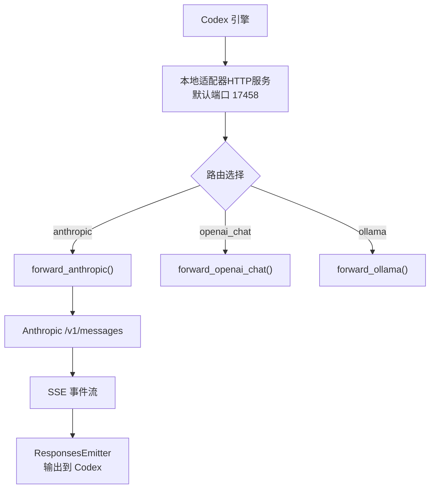
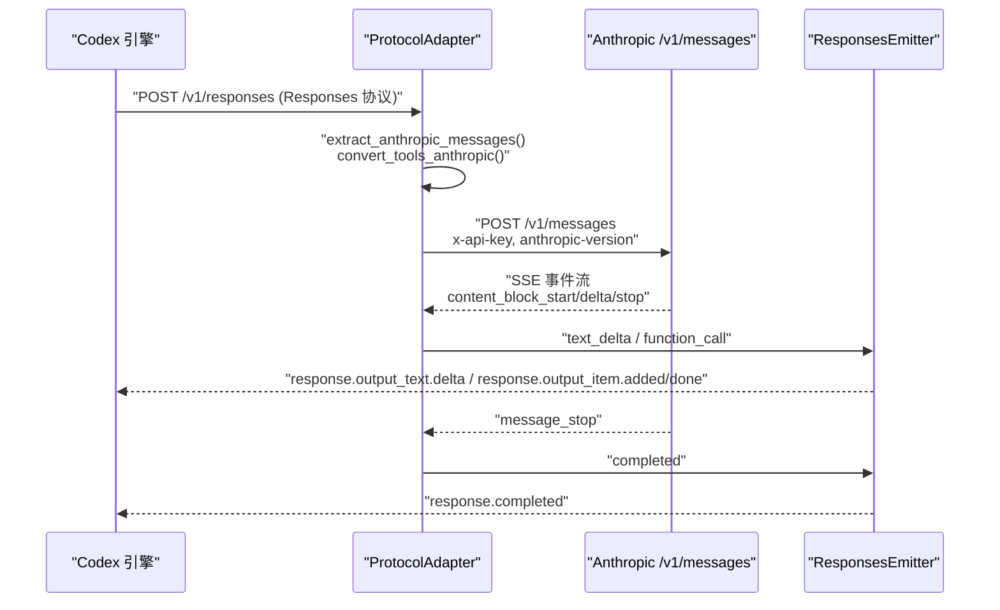
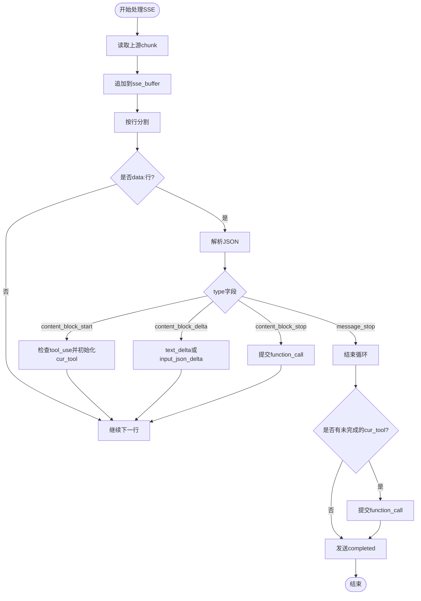
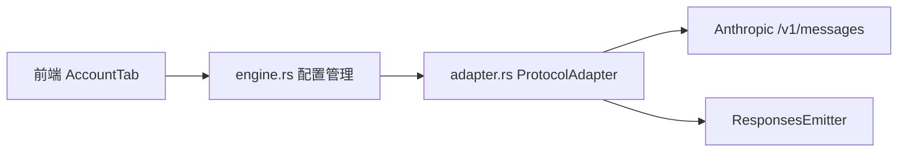

# Anthropic 适配器

<cite>
**本文引用的文件**
- [adapter.rs](file://src-tauri/src/codex/adapter.rs)
- [engine.rs](file://src-tauri/src/commands/engine.rs)
</cite>

## 目录
1. [简介](#简介)
2. [项目结构](#项目结构)
3. [核心组件](#核心组件)
4. [架构总览](#架构总览)
5. [详细组件分析](#详细组件分析)
6. [依赖关系分析](#依赖关系分析)
7. [性能考量](#性能考量)
8. [故障排查指南](#故障排查指南)
9. [结论](#结论)
10. [附录：配置示例与最佳实践](#附录配置示例与最佳实践)

## 简介
本文件为 Codex-Tauri 中的“Anthropic Messages API 适配器”提供深入技术文档。该适配器将 Codex 引擎的 Responses 协议请求，转换为上游 Anthropic Messages API 的请求，并将 Anthropic 的 SSE 事件流转换回 Codex 期望的 Responses SSE 事件流。重点包括：
- 系统提示词提取、消息格式转换、工具定义映射
- forward_anthropic 方法的实现细节（认证头、版本控制、max_tokens）
- Anthropic SSE 事件流处理（content_block_start/delta/stop、tool_use 累积与完成）
- 配置示例与最佳实践

## 项目结构
适配器的核心逻辑位于 Rust 后端模块中，通过本地 HTTP 服务器接收 Codex 引擎的 POST /v1/responses 请求，按路由选择不同上游协议进行转发。对于 Anthropic，适配器会构造 /v1/messages 请求并处理其 SSE 流。

图表来源
- [adapter.rs:85-111](file://src-tauri/src/codex/adapter.rs#L85-L111)
- [adapter.rs:194-220](file://src-tauri/src/codex/adapter.rs#L194-L220)
- [adapter.rs:346-494](file://src-tauri/src/codex/adapter.rs#L346-L494)

章节来源
- [adapter.rs:1-16](file://src-tauri/src/codex/adapter.rs#L1-L16)
- [adapter.rs:85-111](file://src-tauri/src/codex/adapter.rs#L85-L111)
- [adapter.rs:194-220](file://src-tauri/src/codex/adapter.rs#L194-L220)

## 核心组件
- ProviderRoute：描述一个上游模型提供商的路由信息（id、protocol、target_base_url、api_key、default_model）。
- AdapterState：维护当前激活的路由和所有已注册路由。
- ProtocolAdapter：启动本地 HTTP 服务，解析请求并按 protocol 分发到具体转发方法。
- ResponsesEmitter：将上游响应转换为 Codex 期望的 Responses SSE 事件流。
- extract_anthropic_messages / convert_tools_anthropic：负责将 Codex 请求体转换为 Anthropic 的消息、系统提示词与工具定义。
- forward_anthropic：核心方法，封装了请求构建、认证头设置、SSE 事件流处理与工具调用聚合。

章节来源
- [adapter.rs:30-71](file://src-tauri/src/codex/adapter.rs#L30-L71)
- [adapter.rs:604-724](file://src-tauri/src/codex/adapter.rs#L604-L724)
- [adapter.rs:942-1044](file://src-tauri/src/codex/adapter.rs#L942-L1044)
- [adapter.rs:346-494](file://src-tauri/src/codex/adapter.rs#L346-L494)

## 架构总览
下图展示了从 Codex 引擎到 Anthropic 的完整数据流，包括请求转换、SSE 事件流处理和响应回写。

图表来源
- [adapter.rs:194-220](file://src-tauri/src/codex/adapter.rs#L194-L220)
- [adapter.rs:346-494](file://src-tauri/src/codex/adapter.rs#L346-L494)
- [adapter.rs:604-724](file://src-tauri/src/codex/adapter.rs#L604-L724)

## 详细组件分析

### forward_anthropic 方法
该方法实现了从 Codex Responses 到 Anthropic Messages 的完整适配流程：
- 模型选择：优先使用请求中的 model，否则回退到 ProviderRoute.default_model，再回退到默认值。
- 消息与工具转换：调用 extract_anthropic_messages 获取 system_prompt、messages、tools。
- 请求体构建：包含 model、max_tokens、messages、stream，可选 system 与 tools。
- 目标地址：拼接 target_base_url + "/v1/messages"。
- 认证与版本控制：设置 x-api-key 与 anthropic-version 头部。
- 错误处理：对上游错误返回 502 Bad Gateway 或原始状态码。
- SSE 流处理：逐行解析 data: 事件，处理 content_block_start/delta/stop 与 message_stop。
- 工具调用累积：在 content_block_start 中记录 tool_use 块，在 delta 中累积 partial_json，在 stop 时触发 function_call。
- 结束流程：确保未完成的 tool_use 被 flush，最后发送 completed 事件。

章节来源
- [adapter.rs:346-494](file://src-tauri/src/codex/adapter.rs#L346-L494)

#### 关键实现要点
- 认证头：x-api-key 来自 route.api_key；anthropic-version 固定为 2023-06-01。
- max_tokens：硬编码为 8192，可根据业务需求调整。
- SSE 缓冲：使用字符串缓冲按行解析，避免跨 chunk 的事件边界问题。
- 工具累积：cur_tool 保存 (tool_use_id, name, args)，在 input_json_delta 中追加 partial_json，在 content_block_stop 中提交。

章节来源
- [adapter.rs:376-386](file://src-tauri/src/codex/adapter.rs#L376-L386)
- [adapter.rs:418-490](file://src-tauri/src/codex/adapter.rs#L418-L490)

### 系统提示词提取与消息格式转换
extract_anthropic_messages 负责：
- 从 requests.instructions 提取系统提示词，合并为单行或多段落字符串。
- 遍历 input 数组，将不同类型的 item 转换为 Anthropic 兼容的消息内容块：
  - function_call -> assistant 侧的 tool_use 内容块
  - function_call_output -> user 侧的 tool_result 内容块
  - 普通文本 -> text 内容块
- 保证用户/助手交替严格性，相同角色的连续内容块合并到同一条消息中。
- 最终返回 (system_prompt, messages, tools)。

章节来源
- [adapter.rs:942-1044](file://src-tauri/src/codex/adapter.rs#L942-L1044)

### 工具定义映射
convert_tools_anthropic 将 Codex 的 tools 数组转换为 Anthropic 的 tools 定义：
- 仅保留 type 为 function 的工具
- 字段映射：name、description、input_schema（对应 parameters）
- 若无有效工具则返回 None

章节来源
- [adapter.rs:828-849](file://src-tauri/src/codex/adapter.rs#L828-L849)

### Anthropic SSE 事件流处理
forward_anthropic 中对 SSE 的处理逻辑如下：
- 读取上游 chunk，追加到 sse_buffer
- 按行分割，跳过非 data: 行
- 解析 JSON payload，根据 type 分支处理：
  - content_block_start：若 content_block.type == tool_use，初始化 cur_tool
  - content_block_delta：
    - text_delta：直接输出 text_delta 事件
    - input_json_delta：将 partial_json 追加到 cur_tool.args
  - content_block_stop：若存在 cur_tool，调用 function_call 提交工具调用
  - message_stop：终止循环
- 循环结束后，确保任何未提交的 cur_tool 被 flush，然后发送 completed

图表来源
- [adapter.rs:422-490](file://src-tauri/src/codex/adapter.rs#L422-L490)

章节来源
- [adapter.rs:422-490](file://src-tauri/src/codex/adapter.rs#L422-L490)

### ResponsesEmitter 与工具调用完成
ResponsesEmitter 负责将适配器内部状态转换为 Codex 期望的 Responses SSE 事件：
- begin：发送 response.created
- text_delta：首次文本时创建 output_item.added（message），随后发送 output_text.delta
- function_call：关闭当前消息，发送 function_call 的 added 与 done（含 arguments 与 status）
- completed：关闭消息并发送 response.completed

章节来源
- [adapter.rs:604-724](file://src-tauri/src/codex/adapter.rs#L604-L724)

## 依赖关系分析
- adapter.rs 依赖 reqwest 进行 HTTP 请求，tokio 进行异步 I/O，serde_json 进行 JSON 序列化/反序列化。
- engine.rs 负责 ProviderRoute 的配置持久化与激活，当 protocol 不为 openai_responses 时，将请求重定向到本地适配器端口。
- 前端 AccountTab.tsx 提供用户界面用于配置 provider，包括 baseUrl、apiKey、protocol、defaultModel。

图表来源
- [engine.rs:281-329](file://src-tauri/src/commands/engine.rs#L281-L329)
- [adapter.rs:85-111](file://src-tauri/src/codex/adapter.rs#L85-L111)

章节来源
- [engine.rs:281-329](file://src-tauri/src/commands/engine.rs#L281-L329)
- [adapter.rs:85-111](file://src-tauri/src/codex/adapter.rs#L85-L111)

## 性能考量
- SSE 缓冲策略：使用字符串缓冲按行解析，避免频繁分配，适合高吞吐场景。
- 工具调用聚合：Anthropic 的 tool_use 通过 partial_json 增量累积，减少 JSON 解析开销。
- 超时设置：上游请求超时设为 180 秒，避免长时间阻塞。
- 内存使用：ResponsesEmitter 维护当前消息文本，长对话可能增加内存占用，建议定期清理或限制长度。

[本节为通用性能讨论，不直接分析具体文件]

## 故障排查指南
- 认证失败：检查 x-api-key 是否正确传递，anthropic-version 是否为 2023-06-01。
- 上游错误：adapter 会将上游错误状态码与 body 原样返回给客户端，便于定位问题。
- 工具调用未完成：确保 content_block_stop 事件被正确处理，若有异常中断，flush 逻辑会尝试提交未完成的 tool_use。
- 模型不可用：确认 default_model 或请求中的 model 与上游支持列表匹配。

章节来源
- [adapter.rs:396-412](file://src-tauri/src/codex/adapter.rs#L396-L412)
- [engine.rs:513-520](file://src-tauri/src/commands/engine.rs#L513-L520)

## 结论
Anthropic 适配器成功将 Codex 的 Responses 协议与 Anthropic Messages API 桥接起来，通过精确的消息转换、工具定义映射与 SSE 事件流处理，实现了无缝的模型调用体验。forward_anthropic 方法作为核心，确保了认证、版本控制、max_tokens 限制以及工具调用的正确累积与完成。配合合理的配置与最佳实践，可在多种上游环境中稳定运行。

[本节为总结性内容，不直接分析具体文件]

## 附录：配置示例与最佳实践

### ProviderRoute 配置字段
- id：唯一标识符
- protocol：协议类型，如 "anthropic"
- target_base_url：上游基础 URL，如 https://api.anthropic.com
- api_key：API 密钥，用于 x-api-key 认证
- default_model：默认模型，如 claude-3-5-sonnet-20241022

章节来源
- [adapter.rs:30-37](file://src-tauri/src/codex/adapter.rs#L30-L37)
- [engine.rs:281-329](file://src-tauri/src/commands/engine.rs#L281-L329)

### 最佳实践
- 始终设置 anthropic-version 为 2023-06-01，确保 API 行为一致。
- 合理设置 max_tokens，避免过长响应导致资源消耗。
- 使用 stream=true 以启用 SSE，提升交互体验。
- 工具定义应明确参数 schema，提高工具调用准确性。
- 监控上游错误，及时捕获并反馈给用户。

[本节为通用指导，不直接分析具体文件]