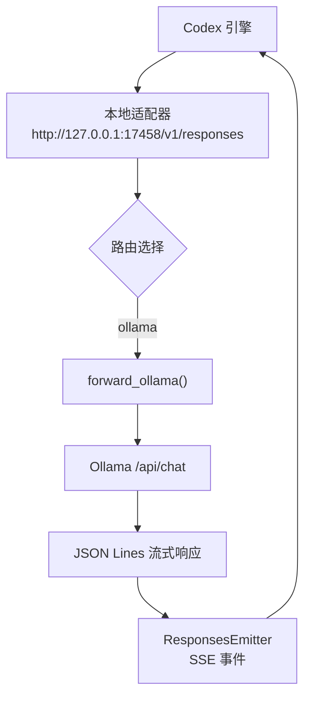
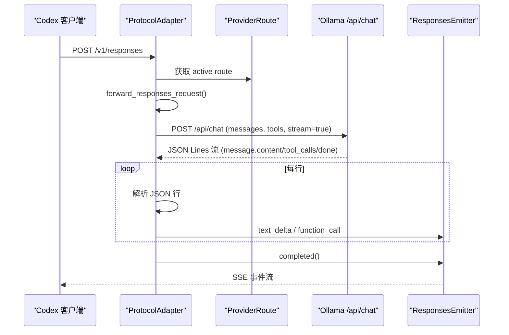
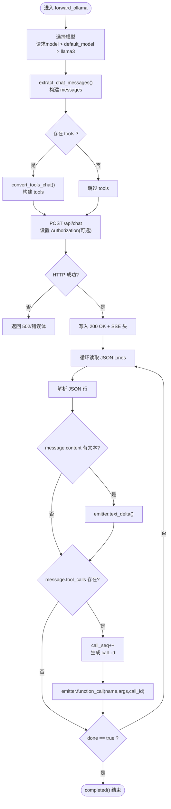
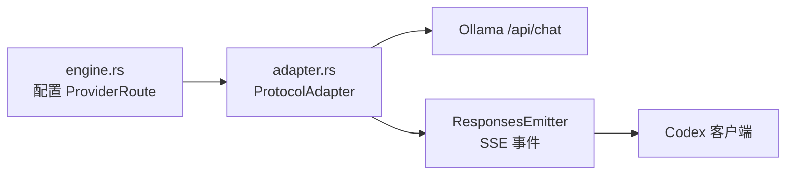

# Ollama 适配器

<cite>
**本文引用的文件**
- [adapter.rs](file://src-tauri/src/codex/adapter.rs)
- [engine.rs](file://src-tauri/src/commands/engine.rs)
- [test-adapter-protocol.mjs](file://scripts/test-adapter-protocol.mjs)
</cite>

## 目录
1. [简介](#简介)
2. [项目结构](#项目结构)
3. [核心组件](#核心组件)
4. [架构总览](#架构总览)
5. [详细组件分析](#详细组件分析)
6. [依赖关系分析](#依赖关系分析)
7. [性能考量](#性能考量)
8. [故障排查指南](#故障排查指南)
9. [结论](#结论)
10. [附录](#附录)

## 简介
本文件为本地模型服务 Ollama 的 Chat API 适配器提供完整技术文档。该适配器将 Codex 引擎的 Responses 协议请求，适配到 Ollama 的 /api/chat 端点，并实现：
- 消息格式转换（Codex → Ollama）
- 工具函数支持（tools 定义与调用）
- 流式响应处理（JSON Lines 解析、文本增量输出、tool_calls 聚合）
- call_seq 序列号生成与 done 标志检测
- 本地部署配置与性能优化建议

## 项目结构
适配器位于 Rust 后端模块中，作为轻量级 HTTP 服务器运行在本地回环地址，接收来自 Codex 的请求后转发至上游模型服务（Ollama），并将上游流式响应转换为 Codex 期望的 SSE 事件流。

图表来源
- [adapter.rs:85-111](file://src-tauri/src/codex/adapter.rs#L85-L111)
- [adapter.rs:194-220](file://src-tauri/src/codex/adapter.rs#L194-L220)
- [adapter.rs:496-601](file://src-tauri/src/codex/adapter.rs#L496-L601)

章节来源
- [adapter.rs:1-16](file://src-tauri/src/codex/adapter.rs#L1-L16)
- [adapter.rs:85-111](file://src-tauri/src/codex/adapter.rs#L85-L111)
- [adapter.rs:194-220](file://src-tauri/src/codex/adapter.rs#L194-L220)

## 核心组件
- ProviderRoute：描述上游提供者路由信息（协议、目标地址、API Key、默认模型）。
- AdapterState：管理多个路由与当前激活的路由。
- ProtocolAdapter：启动本地 HTTP 服务器，解析请求并转发到对应上游。
- forward_ollama：Ollama 专用转发逻辑，包含消息转换、工具转换、流式响应处理。
- ResponsesEmitter：将上游流式数据封装为 Codex Responses SSE 事件。
- extract_chat_messages / convert_tools_chat：请求侧消息与工具转换。

章节来源
- [adapter.rs:30-71](file://src-tauri/src/codex/adapter.rs#L30-L71)
- [adapter.rs:496-601](file://src-tauri/src/codex/adapter.rs#L496-L601)
- [adapter.rs:604-724](file://src-tauri/src/codex/adapter.rs#L604-L724)
- [adapter.rs:796-826](file://src-tauri/src/codex/adapter.rs#L796-L826)
- [adapter.rs:851-925](file://src-tauri/src/codex/adapter.rs#L851-L925)

## 架构总览
适配器通过本地 TCP 监听端口接收 HTTP 请求，解析路径与方法后，根据 ProviderRoute.protocol 选择具体转发器。对于 ollama 协议，进入 forward_ollama 流程，构造 Ollama Chat 请求体并发送；随后逐行读取 JSON Lines 流，提取 message.content 文本与 tool_calls 数组，按顺序生成 Responses SSE 事件返回给客户端。

图表来源
- [adapter.rs:113-191](file://src-tauri/src/codex/adapter.rs#L113-L191)
- [adapter.rs:194-220](file://src-tauri/src/codex/adapter.rs#L194-L220)
- [adapter.rs:496-601](file://src-tauri/src/codex/adapter.rs#L496-L601)
- [adapter.rs:604-724](file://src-tauri/src/codex/adapter.rs#L604-L724)

## 详细组件分析

### forward_ollama 方法实现
- 模型自动选择：优先使用请求中的 model，否则回退到 route.default_model，再默认使用 llama3。
- 消息转换：调用 extract_chat_messages 将 Codex responses input 转换为 Ollama messages。
- 工具函数支持：若存在 tools，则通过 convert_tools_chat 转换为 Ollama tools 定义。
- 连接管理：使用 reqwest::Client（超时 180s）发起 POST /api/chat，携带可选 Authorization 头。
- 错误处理：网络错误或上游非成功状态码时，返回 502/自定义错误体。
- 流式响应处理：逐行解析 JSON Lines，提取 message.content 文本增量与 tool_calls 数组，生成 Responses SSE 事件。
- call_seq 序列号：对每个 tool_calls 项递增生成 call_id（如 call_1、call_2...）。
- done 标志检测：当 JSON 行包含 done=true 时停止读取并结束流。

图表来源
- [adapter.rs:496-601](file://src-tauri/src/codex/adapter.rs#L496-L601)
- [adapter.rs:796-826](file://src-tauri/src/codex/adapter.rs#L796-L826)
- [adapter.rs:851-925](file://src-tauri/src/codex/adapter.rs#L851-L925)

章节来源
- [adapter.rs:496-601](file://src-tauri/src/codex/adapter.rs#L496-L601)

### 消息格式转换（extract_chat_messages）
- 系统提示：从 instructions 字段提取 system 消息。
- 输入处理：遍历 input 数组，区分 function_call、function_call_output、reasoning 与普通消息。
- 工具往返：连续的 function_call 合并为一条 assistant 消息的 tool_calls；function_call_output 转为 role=tool 的消息。
- 空输入兜底：若无有效消息，插入默认 user 消息。

章节来源
- [adapter.rs:851-925](file://src-tauri/src/codex/adapter.rs#L851-L925)

### 工具函数支持（convert_tools_chat）
- 仅保留 type=function 的工具，丢弃其他类型（如 local_shell、web_search）并记录警告。
- 将 Codex tools 参数映射为 OpenAI/Ollama 兼容的 function 定义（name、description、parameters）。

章节来源
- [adapter.rs:796-826](file://src-tauri/src/codex/adapter.rs#L796-L826)

### Ollama 流式响应处理
- JSON 行解析：逐行读取并解析 JSON，忽略空行与非法行。
- message.content 文本提取：若存在字符串内容，调用 emitter.text_delta 推送增量。
- tool_calls 数组处理：遍历数组，为每项生成唯一 call_id（基于 call_seq），调用 emitter.function_call。
- done 标志检测：当行中包含 done=true 时，清空缓冲区并退出循环。

章节来源
- [adapter.rs:551-599](file://src-tauri/src/codex/adapter.rs#L551-L599)

### call_seq 序列号生成机制
- 初始化 call_seq = 0。
- 每次遇到 tool_calls 项，先递增 call_seq，再拼接为 call_{call_seq} 作为 call_id。
- 保证每个工具调用拥有唯一标识，便于下游追踪与执行。

章节来源
- [adapter.rs:552-588](file://src-tauri/src/codex/adapter.rs#L552-L588)

### ResponsesEmitter（SSE 事件封装）
- begin：发送 response.created 事件。
- text_delta：首次文本时创建 output_item.added（assistant message），后续推送 output_text.delta。
- function_call：关闭当前消息，发送 function_call 的 added 与 done 事件，包含 name、arguments、call_id。
- completed：关闭消息并发送 response.completed。

章节来源
- [adapter.rs:604-724](file://src-tauri/src/codex/adapter.rs#L604-L724)

## 依赖关系分析
- 本地 HTTP 服务器：监听 127.0.0.1:17458，接收 /v1/responses。
- 上游 Ollama：通过 /api/chat 提供聊天能力，支持 JSON Lines 流式响应。
- 工具链：reqwest 用于 HTTP 请求，serde_json 用于 JSON 解析与构造。
- 配置注入：ProviderRoute 由 engine.rs 设置，包含协议、目标地址、API Key、默认模型。

图表来源
- [engine.rs:281-329](file://src-tauri/src/commands/engine.rs#L281-L329)
- [adapter.rs:85-111](file://src-tauri/src/codex/adapter.rs#L85-L111)
- [adapter.rs:496-601](file://src-tauri/src/codex/adapter.rs#L496-L601)

章节来源
- [engine.rs:281-329](file://src-tauri/src/commands/engine.rs#L281-L329)
- [adapter.rs:85-111](file://src-tauri/src/codex/adapter.rs#L85-L111)

## 性能考量
- 超时设置：适配器使用 180 秒超时，适合长对话或大模型推理场景。
- 流式缓冲：采用行级缓冲（line_buffer）避免内存膨胀，及时释放已处理行。
- 工具调用聚合：对 tool_calls 逐项处理，避免批量积压。
- 连接复用：reqwest::Client 可复用底层连接，减少握手开销。
- 建议优化：
  - 调整超时时间以匹配模型响应时长。
  - 在高并发场景下考虑连接池大小与并发限制。
  - 监控上游错误率与延迟，必要时增加重试或熔断机制。

[本节为通用性能讨论，不直接分析具体代码文件]

## 故障排查指南
- 上游连接失败：检查 Ollama 服务是否运行于 target_base_url，确认端口与网络可达。
- 非成功状态码：适配器会返回上游状态码与错误体，查看日志定位问题。
- JSON 解析失败：忽略非法行，确保上游遵循 JSON Lines 规范。
- 工具调用异常：检查 tools 定义是否与模型能力匹配，确认 arguments 格式正确。
- 流式中断：确认 done 标志是否正确触发，检查 line_buffer 清理逻辑。

章节来源
- [adapter.rs:527-545](file://src-tauri/src/codex/adapter.rs#L527-L545)
- [adapter.rs:554-599](file://src-tauri/src/codex/adapter.rs#L554-L599)

## 结论
Ollama 适配器通过本地 HTTP 网关实现了 Codex Responses 协议与 Ollama Chat API 的无缝对接，支持消息转换、工具调用、流式响应与错误处理。其设计简洁高效，适用于本地模型服务的快速集成与扩展。

[本节为总结性内容，不直接分析具体代码文件]

## 附录

### 本地部署配置
- 启动适配器：在应用内通过 engine.rs 设置 ProviderRoute，协议设为 ollama，target_base_url 指向本地 Ollama 服务（如 http://127.0.0.1:11434）。
- 模型选择：可在请求中指定 model，或通过 route.default_model 设置默认模型。
- 认证配置：如需鉴权，设置 route.api_key，适配器会自动添加 Authorization 头。

章节来源
- [engine.rs:281-329](file://src-tauri/src/commands/engine.rs#L281-L329)
- [adapter.rs:30-37](file://src-tauri/src/codex/adapter.rs#L30-L37)

### 测试脚本参考
- test-adapter-protocol.mjs 提供了消息提取与格式验证的示例逻辑，可用于调试与回归测试。

章节来源
- [test-adapter-protocol.mjs:1-42](file://scripts/test-adapter-protocol.mjs#L1-L42)