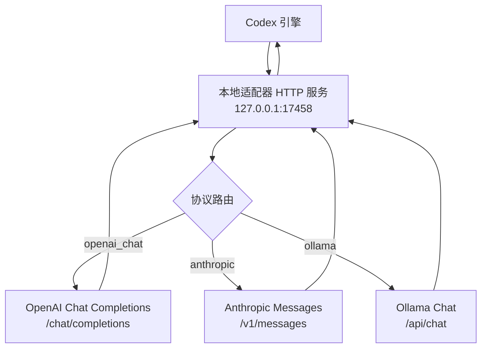
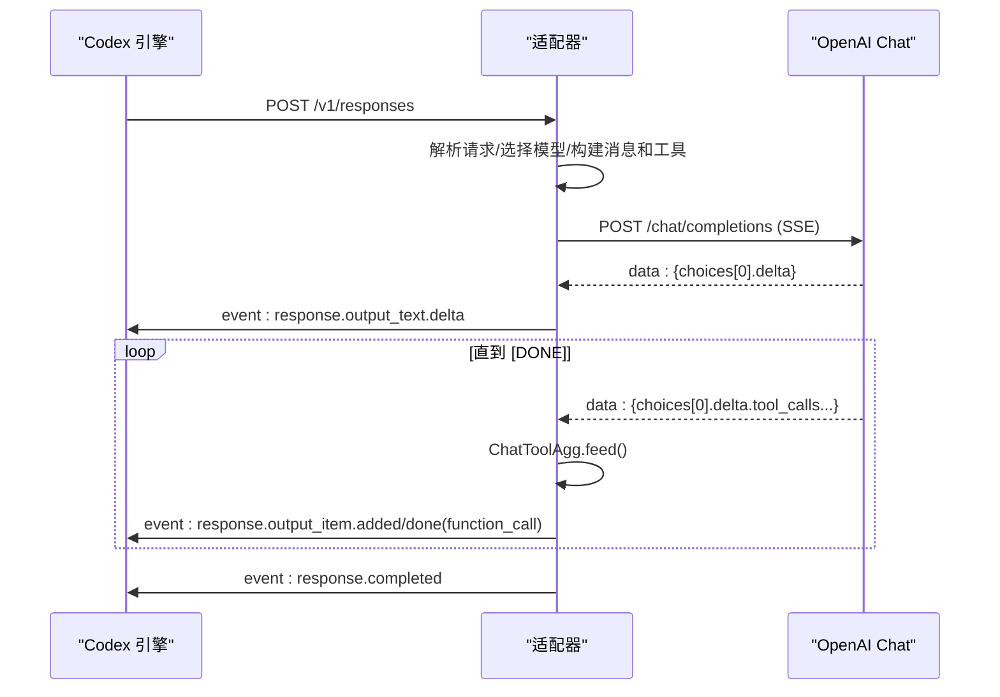
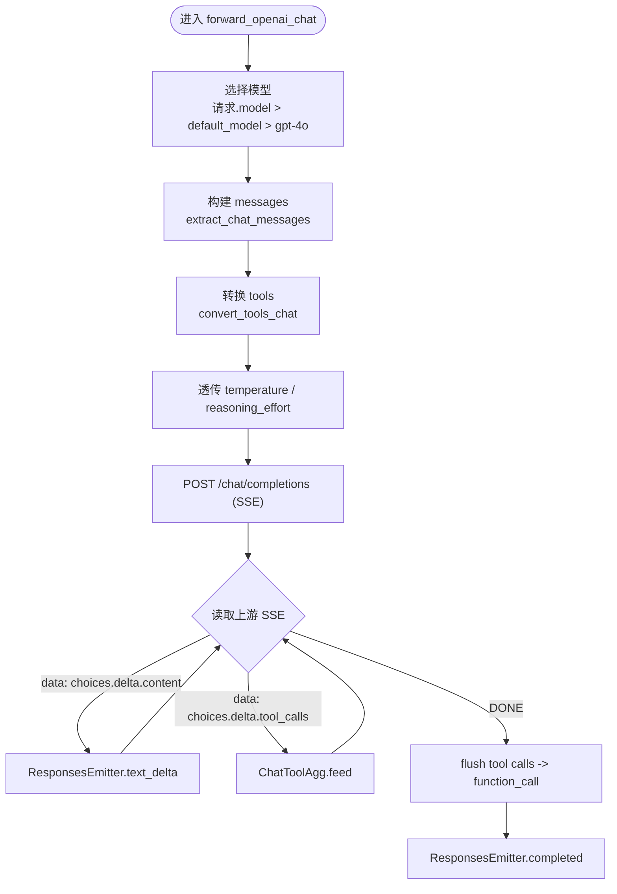
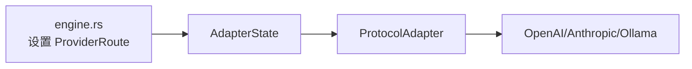

# OpenAI 适配器

<cite>
**本文引用的文件**
- [adapter.rs](file://backend-codex-backup/adapter.rs)
- [mod.rs](file://backend-codex-backup/mod.rs)
- [engine.rs](file://src-tauri/src/commands/engine.rs)
</cite>

## 目录
1. [简介](#简介)
2. [项目结构](#项目结构)
3. [核心组件](#核心组件)
4. [架构总览](#架构总览)
5. [详细组件分析](#详细组件分析)
6. [依赖关系分析](#依赖关系分析)
7. [性能考量](#性能考量)
8. [故障排查指南](#故障排查指南)
9. [结论](#结论)
10. [附录：配置示例与最佳实践](#附录：配置示例与最佳实践)

## 简介
本适配器为 Codex 引擎的 Responses 协议提供本地 HTTP 网关，将 Codex 的请求转发到上游第三方模型提供商（默认 OpenAI Chat Completions），并将上游 SSE 流转换回 Codex 期望的 Responses SSE 事件。重点说明：
- 如何将 Codex Responses 请求转换为 OpenAI Chat API 请求（消息、工具、温度、推理努力等）
- 流式响应处理：choices.delta 内容提取、tool_calls 聚合、ChatToolAgg 工作原理
- forward_openai_chat 方法的实现细节：模型选择策略、参数透传、错误处理
- 配置方式与常见问题定位

## 项目结构
适配器位于后端 Rust 模块中，通过本地 TCP 监听端口接收 Codex 的 /v1/responses 请求，按路由协议转发至上游，并以 SSE 形式返回给 Codex。



图表来源
- [adapter.rs:85-111](file://backend-codex-backup/adapter.rs#L85-L111)
- [adapter.rs:194-220](file://backend-codex-backup/adapter.rs#L194-L220)

章节来源
- [adapter.rs:1-27](file://backend-codex-backup/adapter.rs#L1-L27)
- [adapter.rs:85-111](file://backend-codex-backup/adapter.rs#L85-L111)
- [mod.rs:1-9](file://backend-codex-backup/mod.rs#L1-L9)

## 核心组件
- ProviderRoute：描述一个上游提供商路由（id、protocol、target_base_url、api_key、default_model）
- AdapterState：维护当前活跃路由与所有路由表
- ProtocolAdapter：启动本地 HTTP 服务、解析请求、按协议转发并写回 SSE
- ResponsesEmitter：将上游流转换为 Codex Responses SSE 事件
- ChatToolAgg：聚合 OpenAI Chat SSE 中的增量 tool_calls

章节来源
- [adapter.rs:30-71](file://backend-codex-backup/adapter.rs#L30-L71)
- [adapter.rs:68-111](file://backend-codex-backup/adapter.rs#L68-L111)
- [adapter.rs:604-724](file://backend-codex-backup/adapter.rs#L604-L724)
- [adapter.rs:728-769](file://backend-codex-backup/adapter.rs#L728-L769)

## 架构总览
适配器作为中间层，屏蔽了不同上游协议的差异，统一以 Codex Responses SSE 暴露能力。关键流程：
- 接收 POST /v1/responses
- 根据 active route 决定协议（默认 openai_chat）
- 构造上游请求体（消息、工具、温度、推理努力等）
- 发送请求并读取上游 SSE
- 将 choices.delta.content 转为 text_delta
- 将 delta.tool_calls 聚合后转成 function_call 事件
- 结束时输出 response.completed



图表来源
- [adapter.rs:194-343](file://backend-codex-backup/adapter.rs#L194-L343)
- [adapter.rs:604-724](file://backend-codex-backup/adapter.rs#L604-L724)
- [adapter.rs:728-769](file://backend-codex-backup/adapter.rs#L728-L769)

## 详细组件分析

### forward_openai_chat 方法
职责：将 Codex Responses 请求适配为 OpenAI Chat Completions 请求，并流式回写 Responses SSE。

- 模型选择策略
  - 优先使用请求中的 model；若未提供则回退到 route.default_model；再缺省则为 gpt-4o
- 消息转换
  - 调用 extract_chat_messages 将 responses input 列表转换为 OpenAI messages
  - 支持 system、user、assistant、tool 角色；function_call/function_call_output 会合并为 assistant.tool_calls 与 tool 消息
- 工具函数转换
  - convert_tools_chat 将 responses tools 数组转换为 OpenAI tools（仅保留 type=function 的工具）
- 温度与推理努力
  - temperature 直接透传
  - reasoning/effort 映射到 reasoning_effort（对具备推理能力的模型有效）
- 流式处理
  - 读取上游 SSE，逐行解析 data: ...
  - 从 choices[0].delta.content 提取文本增量，通过 ResponsesEmitter.text_delta 写出
  - 从 choices[0].delta.tool_calls 增量聚合，结束后统一写出 function_call
- 错误处理
  - 上游连接失败：返回 502 Bad Gateway JSON
  - 上游非成功状态码：原样返回状态码与响应体
  - 无活动路由：返回 400 错误提示



图表来源
- [adapter.rs:222-343](file://backend-codex-backup/adapter.rs#L222-L343)

章节来源
- [adapter.rs:222-343](file://backend-codex-backup/adapter.rs#L222-L343)

### 消息格式转换（extract_chat_messages）
- 将 responses input 中的 message 项转为 OpenAI messages
- function_call 累积为 assistant 的 tool_calls，遇到 function_call_output 时输出 tool 消息
- 空输入兜底为 user 消息，避免空对话

章节来源
- [adapter.rs:851-925](file://backend-codex-backup/adapter.rs#L851-L925)

### 工具函数转换（convert_tools_chat）
- 仅保留 type=function 的工具
- 将 parameters 映射为 OpenAI 工具的 function.parameters
- 非 function 工具将被丢弃并记录警告

章节来源
- [adapter.rs:796-826](file://backend-codex-backup/adapter.rs#L796-L826)

### 流式响应处理与 SSE 事件
- ResponsesEmitter 负责向客户端写出标准 Responses 事件：
  - response.created
  - response.output_item.added（message 或 function_call）
  - response.output_text.delta
  - response.output_item.done
  - response.completed
- 文本增量通过 text_delta 追加到当前 assistant 消息
- 工具调用在流结束时以 function_call 事件写出

章节来源
- [adapter.rs:604-724](file://backend-codex-backup/adapter.rs#L604-L724)

### ChatToolAgg 的工作原理
- 目的：聚合 OpenAI Chat SSE 中分片到达的 delta.tool_calls
- 数据结构：BTreeMap<index, (call_id, name, arguments)>
- feed(entries)：
  - 按 index 定位条目
  - 更新 id、function.name、function.arguments（字符串拼接）
- drain()：按顺序输出完整调用

```mermaid
classDiagram
class ChatToolAgg {
-calls : BTreeMap<u64, (String,String,String)>
+feed(entries)
+drain() Vec<(String,String,String)>
}
```

图表来源
- [adapter.rs:728-769](file://backend-codex-backup/adapter.rs#L728-L769)

章节来源
- [adapter.rs:728-769](file://backend-codex-backup/adapter.rs#L728-L769)

### 其他协议适配（Anthropic/Ollama）
- Anthropic：将 responses 转换为 messages 与 tools，处理 content_block_start/delta/stop 事件
- Ollama：将 responses 转换为 messages，处理每条消息的 tool_calls
- 两者均通过 ResponsesEmitter 输出统一的 Responses SSE

章节来源
- [adapter.rs:345-494](file://backend-codex-backup/adapter.rs#L345-L494)
- [adapter.rs:496-601](file://backend-codex-backup/adapter.rs#L496-L601)

## 依赖关系分析
- 运行时依赖：reqwest（HTTP）、tokio（异步 I/O）、serde_json（JSON）、tracing（日志）
- 模块导出：mod.rs 暴露 AdapterState、ProtocolAdapter、ProviderRoute、DEFAULT_ADAPTER_PORT
- 前端集成：engine.rs 将用户配置的 provider 写入 AdapterState，并根据 protocol 决定是否走本地适配器



图表来源
- [mod.rs:1-9](file://backend-codex-backup/mod.rs#L1-L9)
- [engine.rs:281-329](file://src-tauri/src/commands/engine.rs#L281-L329)
- [adapter.rs:85-111](file://backend-codex-backup/adapter.rs#L85-L111)

章节来源
- [mod.rs:1-9](file://backend-codex-backup/mod.rs#L1-L9)
- [engine.rs:281-329](file://src-tauri/src/commands/engine.rs#L281-L329)
- [adapter.rs:85-111](file://backend-codex-backup/adapter.rs#L85-L111)

## 性能考量
- 流式处理：逐行解析 SSE，避免全量缓冲，降低内存占用
- 超时控制：上游请求设置 180 秒超时，防止长时间阻塞
- 并发模型：每个连接独立 tokio task 处理，提高吞吐
- 工具调用聚合：使用 BTreeMap 按 index 有序聚合，减少重复计算
- 建议：在高并发场景下关注网络 IO 与序列化开销；必要时可调整缓冲区大小与超时

## 故障排查指南
- 无活动路由
  - 现象：返回 400，提示未配置活动提供商
  - 处理：确保已设置 active route（见“配置示例”）
- 上游连接失败
  - 现象：返回 502 Bad Gateway，包含错误信息
  - 处理：检查 target_base_url、api_key、网络连通性
- 上游非成功状态码
  - 现象：返回上游原始状态码与响应体
  - 处理：根据上游错误码定位问题（鉴权、限流、参数不合法等）
- 工具调用未触发
  - 现象：只收到文本增量，无 function_call
  - 处理：确认 upstream 是否返回 tool_calls；检查 convert_tools_chat 是否正确转换 tools
- 文本为空
  - 现象：无 text_delta
  - 处理：检查上游 delta.content 是否为空；确认 ResponsesEmitter 的 msg_open/close_msg 逻辑

章节来源
- [adapter.rs:162-191](file://backend-codex-backup/adapter.rs#L162-L191)
- [adapter.rs:270-295](file://backend-codex-backup/adapter.rs#L270-L295)
- [adapter.rs:305-343](file://backend-codex-backup/adapter.rs#L305-L343)

## 结论
该适配器以最小成本桥接 Codex Responses 与多种上游模型接口，重点实现了 OpenAI Chat 的消息与工具映射、流式 SSE 转换与工具调用聚合。通过清晰的错误处理与可插拔的路由机制，便于扩展更多上游协议。

## 附录：配置示例与最佳实践
- 配置 ProviderRoute
  - id：唯一标识
  - protocol：openai_chat（默认）、anthropic、ollama、openai_responses
  - target_base_url：上游基础地址（如 https://api.openai.com）
  - api_key：上游鉴权密钥
  - default_model：当请求未指定 model 时的回退模型
- 设置活动路由
  - 通过 engine.rs 将 ProviderRoute 写入 AdapterState 并设为 active
- 请求参数建议
  - 明确传入 model 与 temperature
  - 如需推理努力，可在 reasoning.effort 字段传递
  - 工具定义需为 function 类型，否则会被丢弃
- 安全与稳定性
  - 校验 target_base_url 与 api_key
  - 合理设置超时与重试策略（在上游层面）
  - 监控日志中的警告与错误，及时处理上游异常

章节来源
- [engine.rs:281-329](file://src-tauri/src/commands/engine.rs#L281-L329)
- [adapter.rs:30-66](file://backend-codex-backup/adapter.rs#L30-L66)
- [adapter.rs:222-343](file://backend-codex-backup/adapter.rs#L222-L343)