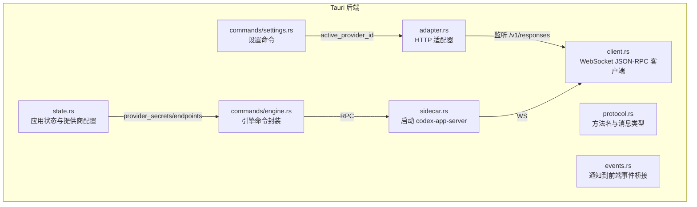
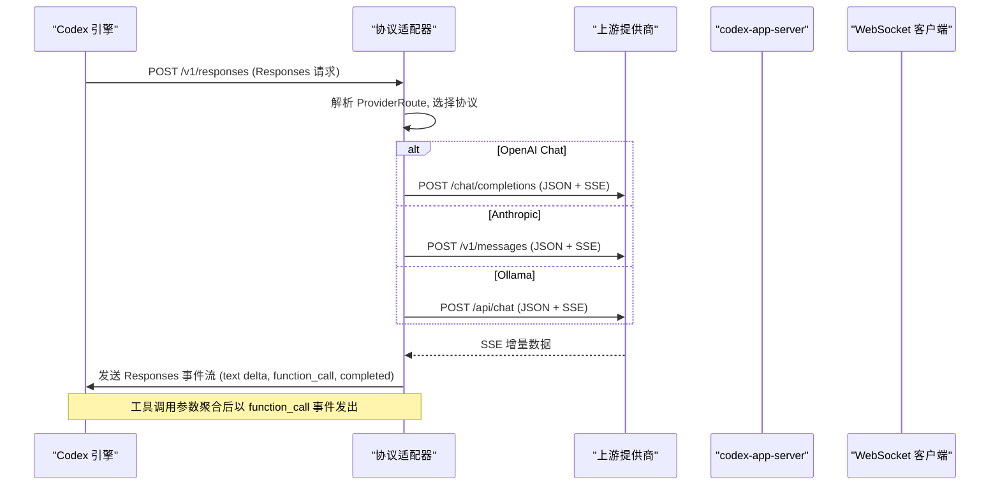
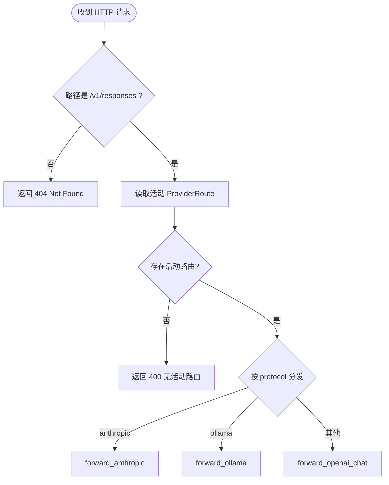
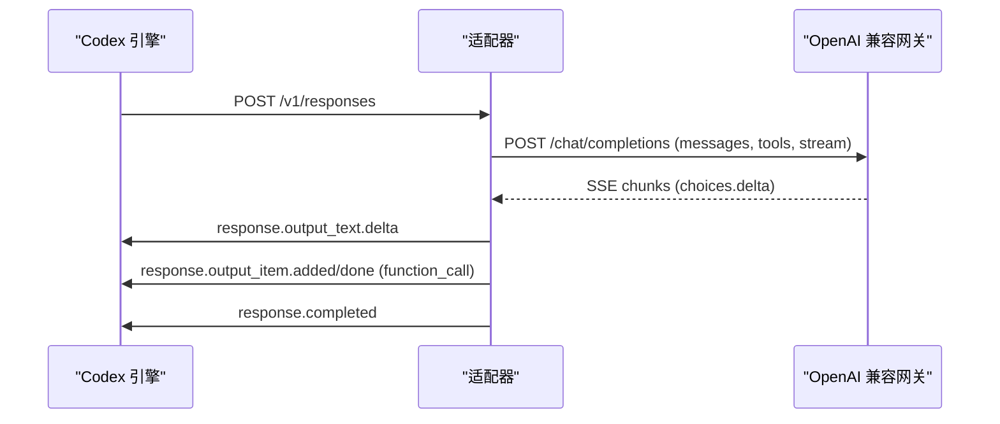
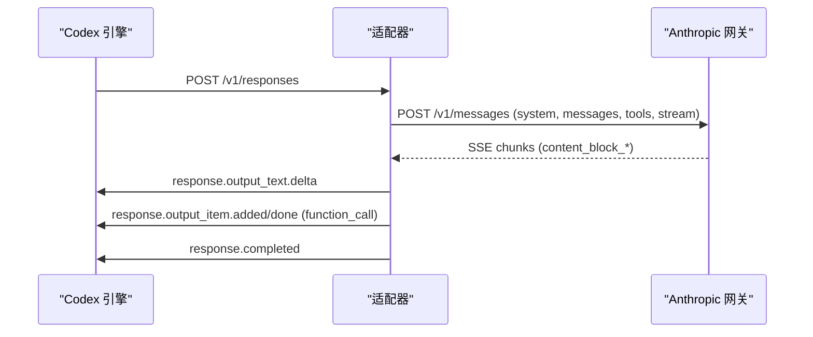
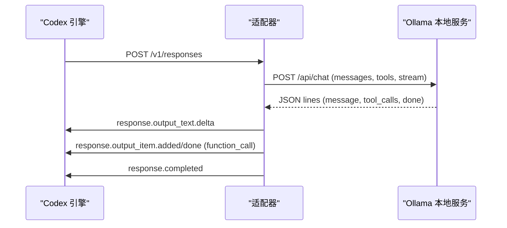
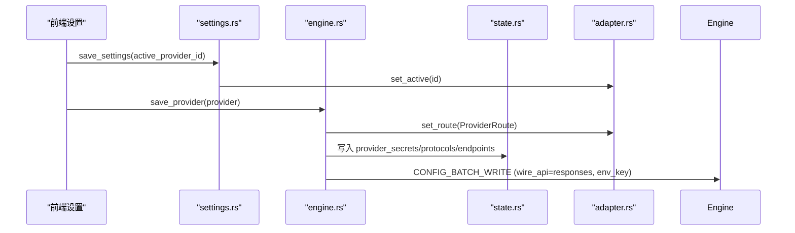
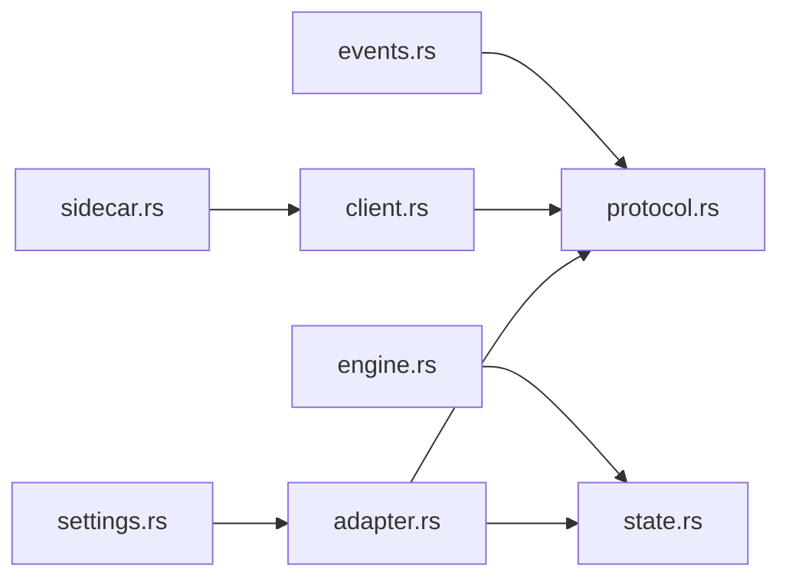

# 协议适配器

<cite>
**本文引用的文件**
- [adapter.rs](file://src-tauri/src/codex/adapter.rs)
- [mod.rs](file://src-tauri/src/codex/mod.rs)
- [client.rs](file://src-tauri/src/codex/client.rs)
- [protocol.rs](file://src-tauri/src/codex/protocol.rs)
- [events.rs](file://src-tauri/src/codex/events.rs)
- [sidecar.rs](file://src-tauri/src/codex/sidecar.rs)
- [state.rs](file://src-tauri/src/state.rs)
- [engine.rs](file://src-tauri/src/commands/engine.rs)
- [settings.rs](file://src-tauri/src/commands/settings.rs)
</cite>

## 目录
1. [简介](#简介)
2. [项目结构](#项目结构)
3. [核心组件](#核心组件)
4. [架构总览](#架构总览)
5. [详细组件分析](#详细组件分析)
6. [依赖关系分析](#依赖关系分析)
7. [性能考量](#性能考量)
8. [故障排查指南](#故障排查指南)
9. [结论](#结论)
10. [附录](#附录)

## 简介
本文件为 Codex-Tauri 协议适配器系统的技术文档，聚焦多提供商支持架构与请求/响应适配。系统通过本地 HTTP 适配器将 Codex 引擎的 Responses 协议（/v1/responses）转换为上游多种模型提供商的协议：OpenAI Chat Completions、Anthropic Messages、Ollama 本地模型。文档涵盖：
- 请求转换机制（消息、工具定义、参数序列化）
- 响应流处理（SSE 事件流聚合与规范化）
- 工具调用转发与结果回填
- 错误映射与网关错误处理
- ProviderRoute 配置管理、动态路由选择、API 密钥管理与连接池优化
- SSE 事件流处理、消息格式转换、异步流聚合
- 配置示例与自定义提供商集成指南

## 项目结构
Codex-Tauri 在 Tauri 后端中提供协议适配器模块，位于 src-tauri/src/codex 下，包含适配器、客户端、协议常量、事件桥接与 sidecar 管理。命令层暴露设置与引擎交互接口，状态层维护提供商配置与密钥。



图表来源
- [adapter.rs:1-120](file://src-tauri/src/codex/adapter.rs#L1-L120)
- [client.rs:1-120](file://src-tauri/src/codex/client.rs#L1-L120)
- [protocol.rs:1-120](file://src-tauri/src/codex/protocol.rs#L1-L120)
- [events.rs:1-82](file://src-tauri/src/codex/events.rs#L1-L82)
- [sidecar.rs:1-120](file://src-tauri/src/codex/sidecar.rs#L1-L120)
- [state.rs:1-175](file://src-tauri/src/state.rs#L1-L175)
- [engine.rs:185-404](file://src-tauri/src/commands/engine.rs#L185-L404)
- [settings.rs:1-33](file://src-tauri/src/commands/settings.rs#L1-L33)

章节来源
- [mod.rs:1-9](file://src-tauri/src/codex/mod.rs#L1-L9)

## 核心组件
- 协议适配器（ProtocolAdapter）：本地 HTTP 服务器，接收 Codex 引擎的 POST /v1/responses，按 ProviderRoute 路由到不同上游协议，并将上游 SSE 流转换为 Responses 规范事件流返回给引擎。
- ProviderRoute：描述一个提供商路由，包括 id、协议类型、目标 base_url、API 密钥、默认模型。
- AdapterState：线程安全的提供商路由与活动路由管理器。
- ResponsesEmitter：将文本增量、工具调用完成、消息关闭等事件以 Responses 事件流形式写入客户端。
- 上游适配：forward_openai_chat、forward_anthropic、forward_ollama，分别实现 OpenAI、Anthropic、Ollama 的请求/响应转换。
- 请求转换：extract_chat_messages、extract_anthropic_messages、convert_tools_chat、convert_tools_anthropic。
- 流聚合：ChatToolAgg 聚合 OpenAI delta.tool_calls 为完整函数调用；Anthropic 使用 cur_tool 累积 input_json_delta。
- 状态与命令：AppState 保存 provider_secrets、provider_protocols、provider_endpoints；engine.rs 负责保存提供商、注入 env_key、更新适配器路由；settings.rs 设置活动提供商。

章节来源
- [adapter.rs:30-120](file://src-tauri/src/codex/adapter.rs#L30-L120)
- [adapter.rs:194-602](file://src-tauri/src/codex/adapter.rs#L194-L602)
- [adapter.rs:604-724](file://src-tauri/src/codex/adapter.rs#L604-L724)
- [adapter.rs:726-849](file://src-tauri/src/codex/adapter.rs#L726-L849)
- [adapter.rs:851-1045](file://src-tauri/src/codex/adapter.rs#L851-L1045)
- [state.rs:150-174](file://src-tauri/src/state.rs#L150-L174)
- [engine.rs:248-404](file://src-tauri/src/commands/engine.rs#L248-L404)
- [settings.rs:18-33](file://src-tauri/src/commands/settings.rs#L18-L33)

## 架构总览
适配器作为中间层，屏蔽上游协议差异，统一向 Codex 引擎输出 Responses 事件流。引擎通过 WebSocket 与 sidecar 通信，侧车进程由 sidecar.rs 管理并注入环境变量密钥。



图表来源
- [adapter.rs:194-602](file://src-tauri/src/codex/adapter.rs#L194-L602)
- [sidecar.rs:1-120](file://src-tauri/src/codex/sidecar.rs#L1-L120)
- [client.rs:1-120](file://src-tauri/src/codex/client.rs#L1-L120)

## 详细组件分析

### 协议适配器与路由选择
- 监听端口：默认 17458，绑定 127.0.0.1。
- 请求路由：仅处理 POST /v1/responses 或 /responses；若无活动路由则返回 400 错误。
- 动态路由：根据 AdapterState.active_provider_id 获取 ProviderRoute，按 protocol 字段分发到具体转发函数。
- 错误映射：上游连接失败返回 502 Bad Gateway；非成功状态码透传上游错误体。



图表来源
- [adapter.rs:113-220](file://src-tauri/src/codex/adapter.rs#L113-L220)

章节来源
- [adapter.rs:85-220](file://src-tauri/src/codex/adapter.rs#L85-L220)

### OpenAI Chat 适配
- 请求转换：
  - model：优先使用请求中的 model，否则回退到 route.default_model，再默认 gpt-4o。
  - messages：从 responses input 提取为标准 OpenAI 消息数组，合并 tool_calls 与 tool 输出。
  - tools：将 responses tools 转换为 OpenAI tools（仅保留 function 类型）。
  - reasoning_effort：若存在 reasoning.effort 且非空，透传到上游。
- 流处理：
  - 解析 SSE data 行，提取 choices[0].delta.content 文本增量，发送 text_delta。
  - 聚合 delta.tool_calls 为完整函数调用，完成后以 function_call 事件发出。
- 认证：Authorization: Bearer {api_key}。



图表来源
- [adapter.rs:222-343](file://src-tauri/src/codex/adapter.rs#L222-L343)
- [adapter.rs:726-769](file://src-tauri/src/codex/adapter.rs#L726-L769)

章节来源
- [adapter.rs:222-343](file://src-tauri/src/codex/adapter.rs#L222-L343)
- [adapter.rs:796-826](file://src-tauri/src/codex/adapter.rs#L796-L826)
- [adapter.rs:851-925](file://src-tauri/src/codex/adapter.rs#L851-L925)

### Anthropic Messages 适配
- 请求转换：
  - model：优先请求 model，否则 route.default_model，再默认 claude-3-5-sonnet-20241022。
  - system：从 instructions 提取系统提示。
  - messages：将 responses input 转换为 Anthropic 的 user/assistant 交替消息块，合并 tool_use/tool_result。
  - tools：将 responses tools 转换为 Anthropic 工具定义（input_schema）。
- 流处理：
  - 解析 content_block_start/content_block_delta/content_block_stop，累积 text_delta 与 input_json_delta。
  - 在 content_block_stop 时发出 function_call；message_stop 结束流。
- 认证：x-api-key 与 anthropic-version 头。



图表来源
- [adapter.rs:345-494](file://src-tauri/src/codex/adapter.rs#L345-L494)
- [adapter.rs:828-849](file://src-tauri/src/codex/adapter.rs#L828-L849)
- [adapter.rs:927-1045](file://src-tauri/src/codex/adapter.rs#L927-L1045)

章节来源
- [adapter.rs:345-494](file://src-tauri/src/codex/adapter.rs#L345-L494)
- [adapter.rs:828-849](file://src-tauri/src/codex/adapter.rs#L828-L849)
- [adapter.rs:927-1045](file://src-tauri/src/codex/adapter.rs#L927-L1045)

### Ollama 本地模型适配
- 请求转换：
  - model：优先请求 model，否则 route.default_model，再默认 llama3。
  - messages：使用标准 chat messages。
  - tools：转换为 Ollama 支持的 tools（function 类型）。
- 流处理：
  - 逐行解析 JSON 对象，提取 message.content 文本增量。
  - 对每个 tool_calls 生成 call_id 并发出 function_call。
  - done=true 结束流。
- 认证：可选 Authorization: Bearer {api_key}。



图表来源
- [adapter.rs:496-601](file://src-tauri/src/codex/adapter.rs#L496-L601)

章节来源
- [adapter.rs:496-601](file://src-tauri/src/codex/adapter.rs#L496-L601)

### Responses 事件发射器与工具调用聚合
- ResponsesEmitter：
  - begin：发送 response.created。
  - text_delta：首次文本增量时打开 assistant message，持续发送 output_text.delta。
  - close_msg：发送 output_item.done，携带最终文本内容。
  - function_call：关闭当前消息，发送 added/done 事件，arguments 在完成后填充。
  - completed：发送 response.completed。
- ChatToolAgg：
  - 基于 index 聚合 delta.tool_calls，合并 name 与 arguments。
  - drain 输出完整调用列表。

```mermaid
classDiagram
class ResponsesEmitter {
+new(stream)
+begin() Result
+text_delta(delta) Result
+close_msg() Result
+function_call(name, args, call_id) Result
+completed() Result
-send(body) Result
-output_index : u64
-msg_open : bool
-msg_text : String
}
class ChatToolAgg {
+feed(entries)
+drain() Vec<(String,String,String)>
-calls : BTreeMap<u64,(String,String,String)>
}
ResponsesEmitter --> ChatToolAgg : "用于聚合 OpenAI tool_calls"
```

图表来源
- [adapter.rs:604-724](file://src-tauri/src/codex/adapter.rs#L604-L724)
- [adapter.rs:726-769](file://src-tauri/src/codex/adapter.rs#L726-L769)

章节来源
- [adapter.rs:604-724](file://src-tauri/src/codex/adapter.rs#L604-L724)
- [adapter.rs:726-769](file://src-tauri/src/codex/adapter.rs#L726-L769)

### 提供商配置与密钥管理
- AppState：
  - provider_secrets：providerId -> API Key，保存在 shell store，不写入明文配置文件。
  - provider_protocols：providerId -> 协议类型。
  - provider_endpoints：providerId -> 真实 upstream base_url。
- engine.save_provider：
  - 校验并提取 id、name、base_url、apiKey、protocol、defaultModel。
  - 若非 openai_responses，effective_base_url 指向本地适配器端口。
  - 更新 AdapterState 路由与活动路由。
  - 持久化 provider 到引擎配置（name、base_url、wire_api、requires_openai_auth、env_key），禁用 code_mode_host。
  - 将 API key 存入 state.provider_secrets，并通过 provider_env_key 注入 sidecar 环境。
- settings.save_settings：
  - 当 active_provider_id 变化时，更新 AdapterState 的活动路由。



图表来源
- [settings.rs:18-33](file://src-tauri/src/commands/settings.rs#L18-L33)
- [engine.rs:248-404](file://src-tauri/src/commands/engine.rs#L248-L404)
- [state.rs:150-174](file://src-tauri/src/state.rs#L150-L174)
- [adapter.rs:45-66](file://src-tauri/src/codex/adapter.rs#L45-L66)

章节来源
- [engine.rs:248-404](file://src-tauri/src/commands/engine.rs#L248-L404)
- [settings.rs:18-33](file://src-tauri/src/commands/settings.rs#L18-L33)
- [state.rs:150-174](file://src-tauri/src/state.rs#L150-L174)

### SSE 事件流处理与消息格式转换
- 文本增量：
  - OpenAI：choices[0].delta.content → text_delta。
  - Anthropic：content_block_delta.text_delta → text_delta。
  - Ollama：message.content → text_delta。
- 工具调用：
  - OpenAI：delta.tool_calls 聚合为完整调用，完成后以 function_call 事件发出。
  - Anthropic：content_block_start 记录 tool_use，content_block_delta.input_json_delta 累积参数，content_block_stop 发出 function_call。
  - Ollama：每条消息的 tool_calls 直接发出 function_call。
- 消息闭合：
  - 每次 function_call 前关闭当前 assistant 消息，确保 output_item.done 携带完整文本。
  - 流结束时发送 response.completed。

章节来源
- [adapter.rs:222-343](file://src-tauri/src/codex/adapter.rs#L222-L343)
- [adapter.rs:345-494](file://src-tauri/src/codex/adapter.rs#L345-L494)
- [adapter.rs:496-601](file://src-tauri/src/codex/adapter.rs#L496-L601)
- [adapter.rs:604-724](file://src-tauri/src/codex/adapter.rs#L604-L724)

### 错误映射与网关错误处理
- 无活动路由：返回 400 Invalid Request Error。
- 上游连接失败：返回 502 Bad Gateway，附带错误信息。
- 上游非成功状态：透传状态码与响应体。
- 探针错误：probe_provider 返回 ok=false 与 hint，区分 401/403/404 场景。

章节来源
- [adapter.rs:162-191](file://src-tauri/src/codex/adapter.rs#L162-L191)
- [adapter.rs:270-295](file://src-tauri/src/codex/adapter.rs#L270-L295)
- [adapter.rs:388-412](file://src-tauri/src/codex/adapter.rs#L388-L412)
- [adapter.rs:527-545](file://src-tauri/src/codex/adapter.rs#L527-L545)
- [engine.rs:416-521](file://src-tauri/src/commands/engine.rs#L416-L521)

## 依赖关系分析
- adapter.rs 依赖 reqwest、serde_json、tokio 进行 HTTP/SSE 处理；依赖 AdapterState 管理路由。
- client.rs 依赖 tokio_tungstenite 建立 WebSocket 连接，实现 initialize/initialized 握手与 RPC 请求/响应。
- protocol.rs 定义 JSON-RPC 方法名与消息类型，供 client 与 events 使用。
- events.rs 订阅 EngineHandle 的通知广播，映射为前端 Tauri 事件。
- sidecar.rs 管理 codex-app-server 生命周期，注入环境变量密钥，提供 RPC 封装。
- state.rs 维护提供商配置与密钥，engine.rs 通过 CONFIG_BATCH_WRITE 持久化配置。



图表来源
- [adapter.rs:1-120](file://src-tauri/src/codex/adapter.rs#L1-L120)
- [client.rs:1-120](file://src-tauri/src/codex/client.rs#L1-L120)
- [protocol.rs:1-120](file://src-tauri/src/codex/protocol.rs#L1-L120)
- [events.rs:1-82](file://src-tauri/src/codex/events.rs#L1-L82)
- [sidecar.rs:1-120](file://src-tauri/src/codex/sidecar.rs#L1-L120)
- [state.rs:150-174](file://src-tauri/src/state.rs#L150-L174)
- [engine.rs:185-404](file://src-tauri/src/commands/engine.rs#L185-L404)
- [settings.rs:18-33](file://src-tauri/src/commands/settings.rs#L18-L33)

章节来源
- [adapter.rs:1-120](file://src-tauri/src/codex/adapter.rs#L1-L120)
- [client.rs:1-120](file://src-tauri/src/codex/client.rs#L1-L120)
- [protocol.rs:1-120](file://src-tauri/src/codex/protocol.rs#L1-L120)
- [events.rs:1-82](file://src-tauri/src/codex/events.rs#L1-L82)
- [sidecar.rs:1-120](file://src-tauri/src/codex/sidecar.rs#L1-L120)
- [state.rs:150-174](file://src-tauri/src/state.rs#L150-L174)
- [engine.rs:185-404](file://src-tauri/src/commands/engine.rs#L185-L404)
- [settings.rs:18-33](file://src-tauri/src/commands/settings.rs#L18-L33)

## 性能考量
- 连接复用：reqwest::Client 在单次请求内复用连接；适配器未显式配置连接池大小，建议在高并发场景下调整超时与连接池参数。
- 流式处理：SSE 逐行解析，避免全量缓冲；Anthropic 使用 cur_tool 累积参数，减少内存分配。
- 工具调用聚合：ChatToolAgg 基于 BTreeMap 按 index 聚合，保证顺序与去重。
- 重试机制：sidecar 连接采用有限次重试，避免冷启动竞态导致的连接失败。
- 事件广播：EngineHandle 使用 broadcast channel，容量 256，滞后时会丢弃通知并记录警告。

章节来源
- [adapter.rs:200-203](file://src-tauri/src/codex/adapter.rs#L200-L203)
- [adapter.rs:305-343](file://src-tauri/src/codex/adapter.rs#L305-L343)
- [adapter.rs:422-494](file://src-tauri/src/codex/adapter.rs#L422-L494)
- [adapter.rs:554-601](file://src-tauri/src/codex/adapter.rs#L554-L601)
- [adapter.rs:726-769](file://src-tauri/src/codex/adapter.rs#L726-L769)
- [sidecar.rs:195-222](file://src-tauri/src/codex/sidecar.rs#L195-L222)
- [events.rs:24-43](file://src-tauri/src/codex/events.rs#L24-L43)

## 故障排查指南
- 无活动路由：检查是否已保存提供商并设置为活动；确认 settings.save_settings 正确调用 set_active。
- 上游连接失败：检查 base_url、协议类型、API Key；使用 probe_provider 验证连通性与模型列表。
- 认证错误：OpenAI 使用 Authorization: Bearer；Anthropic 使用 x-api-key；确保协议与网关匹配。
- 工具调用异常：检查工具定义是否为 function 类型；确认参数序列化正确；查看 function_call 事件是否发出。
- 事件丢失：检查事件广播容量与消费者处理速度；关注 lagged 警告。

章节来源
- [adapter.rs:162-191](file://src-tauri/src/codex/adapter.rs#L162-L191)
- [engine.rs:416-521](file://src-tauri/src/commands/engine.rs#L416-L521)
- [events.rs:24-43](file://src-tauri/src/codex/events.rs#L24-L43)

## 结论
Codex-Tauri 协议适配器通过统一的 Responses 协议屏蔽上游提供商差异，支持 OpenAI、Anthropic、Ollama 等多种模型。其核心优势在于：
- 灵活的 ProviderRoute 配置与动态路由
- 完整的请求/响应转换与工具调用转发
- 稳定的 SSE 事件流处理与错误映射
- 安全的 API 密钥管理与配置持久化
- 可扩展的架构便于集成新提供商

## 附录

### 配置示例
- 添加 OpenAI 兼容提供商：
  - 协议：openai_chat
  - Base URL：https://api.openai.com
  - API Key：Bearer Token
  - 默认模型：gpt-4o
- 添加 Anthropic 提供商：
  - 协议：anthropic
  - Base URL：https://api.anthropic.com
  - API Key：x-api-key
  - 默认模型：claude-3-5-sonnet-20241022
- 添加 Ollama 本地模型：
  - 协议：ollama
  - Base URL：http://127.0.0.1:11434
  - 默认模型：llama3

章节来源
- [engine.rs:248-404](file://src-tauri/src/commands/engine.rs#L248-L404)
- [engine.rs:416-521](file://src-tauri/src/commands/engine.rs#L416-L521)

### 自定义提供商集成指南
- 新增协议类型：
  - 在 adapter.rs 的 forward_responses_request 中添加分支。
  - 实现请求转换函数（类似 extract_chat_messages/extract_anthropic_messages）。
  - 实现流处理逻辑（解析上游 SSE/JSON lines，转换为 Responses 事件）。
- 工具定义转换：
  - 实现 convert_tools_* 函数，将 responses tools 转换为目标协议格式。
- 认证方式：
  - 根据协议设置相应头部（如 Authorization、x-api-key）。
- 错误处理：
  - 映射上游错误为 502 或透传状态码。
- 测试与探针：
  - 扩展 probe_provider 以支持新协议的模型列表端点。

章节来源
- [adapter.rs:194-220](file://src-tauri/src/codex/adapter.rs#L194-L220)
- [adapter.rs:796-849](file://src-tauri/src/codex/adapter.rs#L796-L849)
- [engine.rs:416-521](file://src-tauri/src/commands/engine.rs#L416-L521)