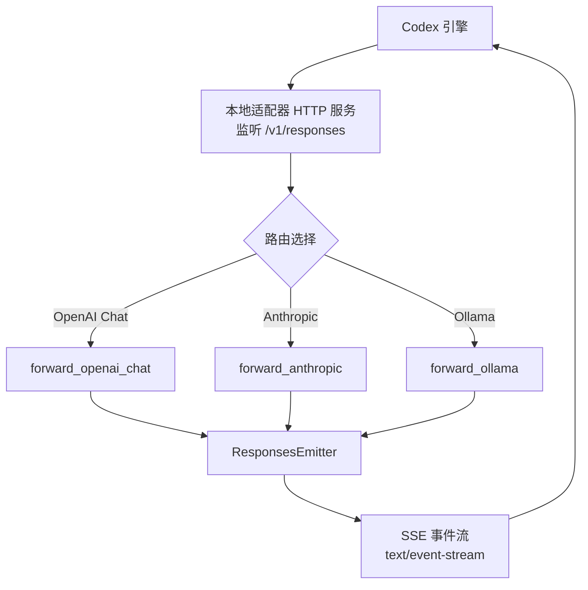
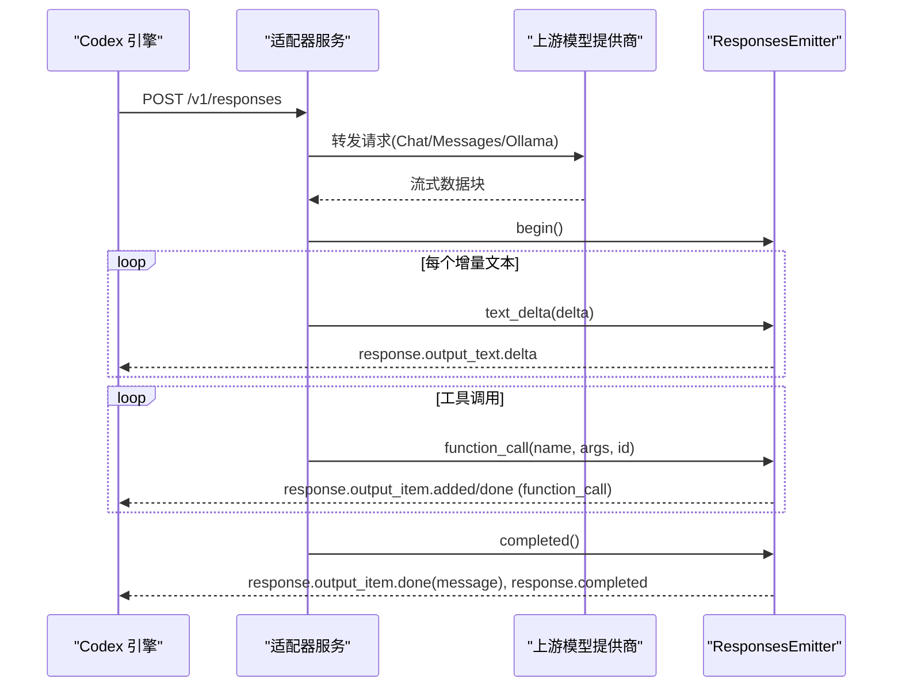
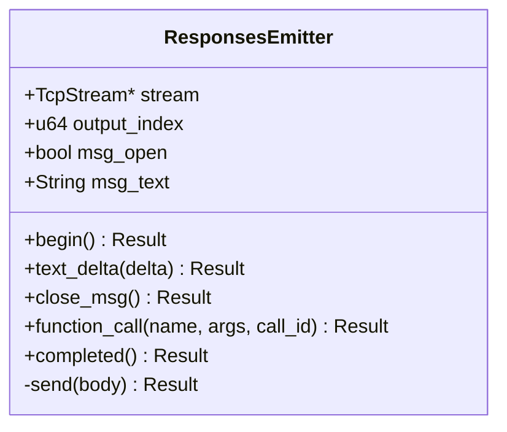
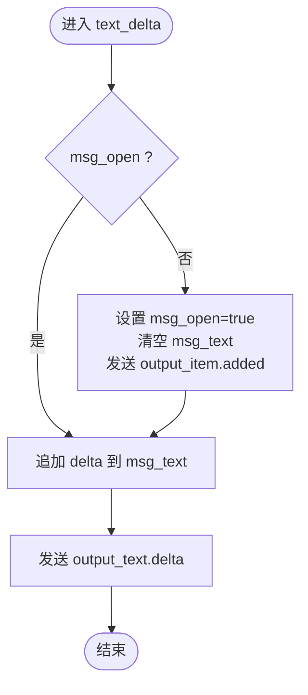
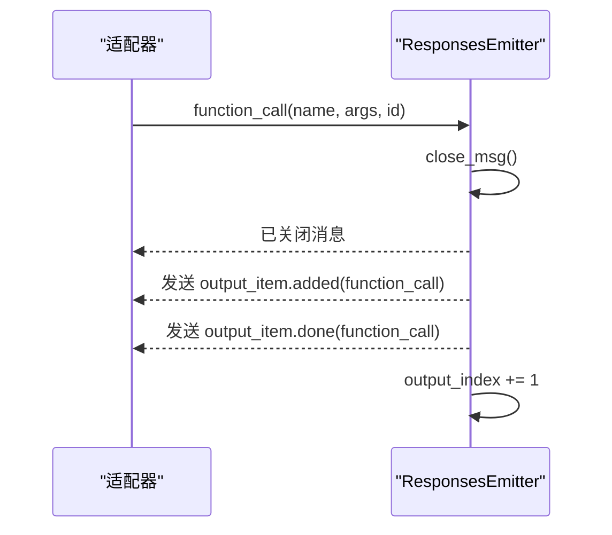
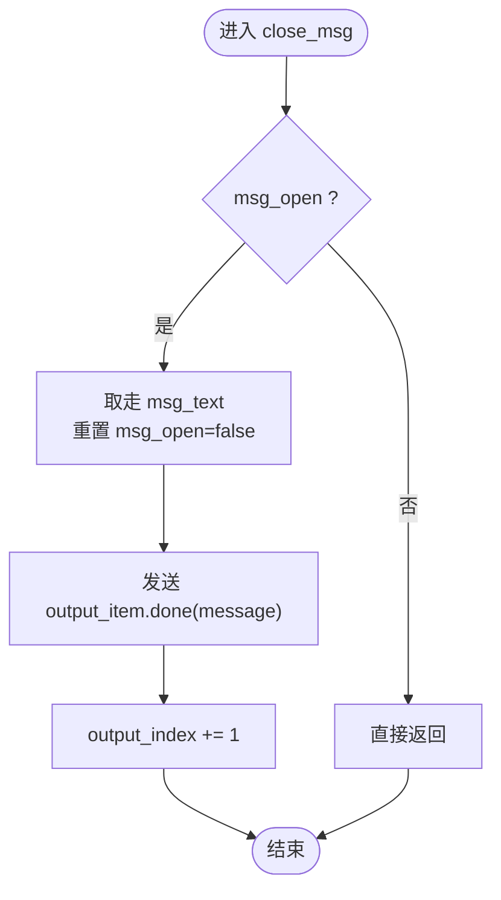
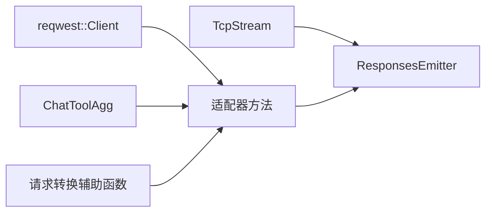

# 响应发射器

<cite>
**本文引用的文件**
- [adapter.rs](file://src-tauri/src/codex/adapter.rs)
</cite>

## 目录
1. [简介](#简介)
2. [项目结构](#项目结构)
3. [核心组件](#核心组件)
4. [架构总览](#架构总览)
5. [详细组件分析](#详细组件分析)
6. [依赖关系分析](#依赖关系分析)
7. [性能考量](#性能考量)
8. [故障排查指南](#故障排查指南)
9. [结论](#结论)
10. [附录：事件序列示例与调试技巧](#附录事件序列示例与调试技巧)

## 简介
本文件聚焦于 ResponsesEmitter 组件，详细说明其如何构建符合规范的 Responses SSE 事件流，包括 response.created、response.output_item.added、response.output_text.delta、response.output_item.done、response.completed 等事件的有序发送。同时深入解析 ResponsesEmitter 的状态管理（output_index 递增、msg_open 状态跟踪、msg_text 文本累积），并解释文本增量处理、函数调用封装、消息关闭和完成流程。文末提供事件序列示例与调试技巧，帮助快速定位问题。

## 项目结构
ResponsesEmitter 位于适配器模块中，负责将上游模型提供商的流式响应转换为 Codex 引擎期望的 Responses SSE 事件流。该模块还包含对不同上游协议（OpenAI Chat、Anthropic Messages、Ollama）的请求适配与流式转发逻辑，统一通过 ResponsesEmitter 输出标准事件。

图表来源
- [adapter.rs:222-343](file://src-tauri/src/codex/adapter.rs#L222-L343)
- [adapter.rs:345-494](file://src-tauri/src/codex/adapter.rs#L345-L494)
- [adapter.rs:496-601](file://src-tauri/src/codex/adapter.rs#L496-L601)
- [adapter.rs:604-724](file://src-tauri/src/codex/adapter.rs#L604-L724)

章节来源
- [adapter.rs:1-27](file://src-tauri/src/codex/adapter.rs#L1-L27)
- [adapter.rs:222-343](file://src-tauri/src/codex/adapter.rs#L222-L343)
- [adapter.rs:345-494](file://src-tauri/src/codex/adapter.rs#L345-L494)
- [adapter.rs:496-601](file://src-tauri/src/codex/adapter.rs#L496-L601)
- [adapter.rs:604-724](file://src-tauri/src/codex/adapter.rs#L604-L724)

## 核心组件
- ResponsesEmitter：维护连接、事件帧发送与内部状态，确保按规范顺序输出事件。
- 上游流聚合器（如 ChatToolAgg）：用于合并增量工具调用片段，最终生成完整 function_call 事件。
- 请求转换辅助函数：将 Responses 格式请求转换为不同上游协议的请求体。

章节来源
- [adapter.rs:604-724](file://src-tauri/src/codex/adapter.rs#L604-L724)
- [adapter.rs:726-769](file://src-tauri/src/codex/adapter.rs#L726-L769)
- [adapter.rs:851-925](file://src-tauri/src/codex/adapter.rs#L851-L925)

## 架构总览
ResponsesEmitter 作为统一的输出层，屏蔽了上游协议差异，保证下游 Codex 引擎接收到的事件流一致且可预测。三种上游路径在各自解析完成后，均调用 ResponsesEmitter 的方法输出标准事件。

图表来源
- [adapter.rs:222-343](file://src-tauri/src/codex/adapter.rs#L222-L343)
- [adapter.rs:345-494](file://src-tauri/src/codex/adapter.rs#L345-L494)
- [adapter.rs:496-601](file://src-tauri/src/codex/adapter.rs#L496-L601)
- [adapter.rs:604-724](file://src-tauri/src/codex/adapter.rs#L604-L724)

## 详细组件分析

### ResponsesEmitter 状态机与事件流
- 状态字段
  - output_index：当前输出项索引，每次新增 message 或 function_call 后递增。
  - msg_open：是否处于“打开”的 assistant 消息中；首次收到文本增量时开启。
  - msg_text：累积的 assistant 消息文本；在 close_msg 时一次性提交。
- 关键方法
  - begin：发送 response.created。
  - text_delta：若未开启消息则先发送 response.output_item.added，然后发送多次 response.output_text.delta。
  - close_msg：发送 response.output_item.done（message），重置状态并递增 output_index。
  - function_call：先关闭当前消息，再发送 function_call 的 added/done 事件对，最后递增 output_index。
  - completed：关闭消息并发送 response.completed。

图表来源
- [adapter.rs:604-724](file://src-tauri/src/codex/adapter.rs#L604-L724)

章节来源
- [adapter.rs:604-724](file://src-tauri/src/codex/adapter.rs#L604-L724)

### 文本增量处理流程
- 当上游返回文本增量时，调用 text_delta。
- 如果 msg_open 为 false，则：
  - 设置 msg_open = true，清空 msg_text。
  - 使用当前 output_index 构造 item 并发送 response.output_item.added。
- 将 delta 追加到 msg_text，并发送 response.output_text.delta。
- 后续增量继续追加并发送 delta，直到消息关闭。

图表来源
- [adapter.rs:640-660](file://src-tauri/src/codex/adapter.rs#L640-L660)

章节来源
- [adapter.rs:640-660](file://src-tauri/src/codex/adapter.rs#L640-L660)

### 函数调用封装流程
- 上游可能以增量形式返回工具调用参数（例如 OpenAI 的 tool_calls 增量）。
- 适配器侧进行聚合（如 ChatToolAgg），在合适时机调用 function_call。
- function_call 会先关闭当前消息（close_msg），然后：
  - 发送 response.output_item.added（function_call，arguments 为空字符串）。
  - 发送 response.output_item.done（function_call，arguments 为完整 JSON，status=completed）。
  - 递增 output_index。

图表来源
- [adapter.rs:684-714](file://src-tauri/src/codex/adapter.rs#L684-L714)

章节来源
- [adapter.rs:684-714](file://src-tauri/src/codex/adapter.rs#L684-L714)

### 消息关闭与完成流程
- close_msg：
  - 若 msg_open 为 false，直接返回。
  - 否则取走 msg_text，发送 response.output_item.done（message，content 包含 output_text）。
  - 重置 msg_open 为 false，并递增 output_index。
- completed：
  - 调用 close_msg 确保消息关闭。
  - 发送 response.completed，标志整个响应结束。

图表来源
- [adapter.rs:662-682](file://src-tauri/src/codex/adapter.rs#L662-L682)

章节来源
- [adapter.rs:662-682](file://src-tauri/src/codex/adapter.rs#L662-L682)

### 三种上游适配器的集成点
- OpenAI Chat：
  - 解析 choices[0].delta.content 文本增量，调用 text_delta。
  - 聚合 tool_calls 增量，结束时批量调用 function_call。
  - 最后调用 completed。
- Anthropic Messages：
  - 解析 content_block_start/content_block_delta/content_block_stop，分别处理文本与工具调用。
  - 遇到 message_stop 时停止读取，随后调用 function_call 与 completed。
- Ollama：
  - 解析 message.content 文本增量，调用 text_delta。
  - 解析 tool_calls，逐条调用 function_call。
  - 遇到 done 标记时停止读取，最后调用 completed。

章节来源
- [adapter.rs:222-343](file://src-tauri/src/codex/adapter.rs#L222-L343)
- [adapter.rs:345-494](file://src-tauri/src/codex/adapter.rs#L345-L494)
- [adapter.rs:496-601](file://src-tauri/src/codex/adapter.rs#L496-L601)

## 依赖关系分析
- ResponsesEmitter 依赖底层 TcpStream 进行 SSE 帧写入。
- 适配器各 forward_* 方法依赖 reqwest 客户端与上游 SSE 流。
- 工具调用聚合依赖 ChatToolAgg，用于合并增量工具调用。
- 请求转换依赖辅助函数，将 Responses 格式转为上游协议所需结构。

图表来源
- [adapter.rs:604-724](file://src-tauri/src/codex/adapter.rs#L604-L724)
- [adapter.rs:726-769](file://src-tauri/src/codex/adapter.rs#L726-L769)
- [adapter.rs:851-925](file://src-tauri/src/codex/adapter.rs#L851-L925)

章节来源
- [adapter.rs:604-724](file://src-tauri/src/codex/adapter.rs#L604-L724)
- [adapter.rs:726-769](file://src-tauri/src/codex/adapter.rs#L726-L769)
- [adapter.rs:851-925](file://src-tauri/src/codex/adapter.rs#L851-L925)

## 性能考量
- 文本增量采用追加累积策略，避免频繁拼接大字符串；在 close_msg 时使用 move 语义转移内容，减少拷贝。
- 工具调用增量聚合使用有序映射，保证按 index 顺序输出，避免乱序导致的下游解析错误。
- SSE 帧写入为异步 I/O，注意背压与缓冲区大小，避免阻塞上游读取。
- 对于长文本场景，建议监控内存占用与网络吞吐，必要时调整上游 chunk 大小或增加节流。

## 故障排查指南
- 事件顺序异常
  - 检查是否在 text_delta 之前发送了 output_item.done；确保先 added 再 delta，最后 done。
  - 确认 function_call 前是否调用了 close_msg，避免消息与函数调用混叠。
- 文本丢失或重复
  - 检查上游 SSE 是否包含空 delta；代码会跳过空内容，但需确认上游行为。
  - 确认 msg_text 是否正确累积并在 close_msg 时取走。
- 工具调用参数不完整
  - 检查聚合器是否正确合并增量 arguments；确认上游 tool_calls 的 index 字段稳定。
  - 对于 Anthropic，确认 input_json_delta 被正确拼接到 cur_tool.args。
- 连接提前关闭
  - 检查 message_stop 或 done 标记是否过早触发；确保循环读取直到上游结束。
  - 确认 completed 仅在适当时机调用，避免重复结束。

章节来源
- [adapter.rs:222-343](file://src-tauri/src/codex/adapter.rs#L222-L343)
- [adapter.rs:345-494](file://src-tauri/src/codex/adapter.rs#L345-L494)
- [adapter.rs:496-601](file://src-tauri/src/codex/adapter.rs#L496-L601)
- [adapter.rs:604-724](file://src-tauri/src/codex/adapter.rs#L604-L724)

## 结论
ResponsesEmitter 通过严格的状态管理与事件顺序控制，将多种上游模型的流式响应统一为标准的 Responses SSE 事件流。其设计清晰、职责单一，便于扩展新的上游协议。配合适配器层的请求转换与流式聚合，能够稳定地支持文本增量与函数调用场景，满足 Codex 引擎的规范要求。

## 附录：事件序列示例与调试技巧

### 典型事件序列（纯文本）
- response.created
- response.output_item.added（assistant message）
- 多次 response.output_text.delta
- response.output_item.done（assistant message）
- response.completed

### 典型事件序列（含函数调用）
- response.created
- response.output_item.added（assistant message）
- 多次 response.output_text.delta
- response.output_item.done（assistant message）
- response.output_item.added（function_call，arguments=""）
- response.output_item.done（function_call，arguments="完整JSON", status="completed"）
- response.completed

### 调试技巧
- 启用日志记录 ResponsesEmitter 的关键状态变化（msg_open、output_index、msg_text 长度）。
- 捕获并打印每个事件帧，验证 event 类型与 data 结构是否符合规范。
- 针对工具调用，打印聚合前后的 arguments 对比，确保增量合并正确。
- 在上游断点处观察 SSE 流，确认增量到达顺序与完整性。

章节来源
- [adapter.rs:604-724](file://src-tauri/src/codex/adapter.rs#L604-L724)
- [adapter.rs:726-769](file://src-tauri/src/codex/adapter.rs#L726-L769)