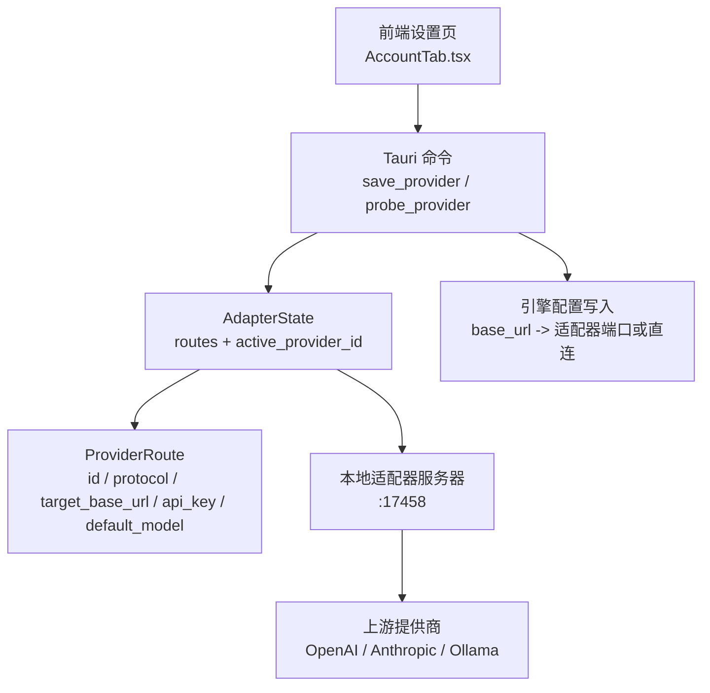
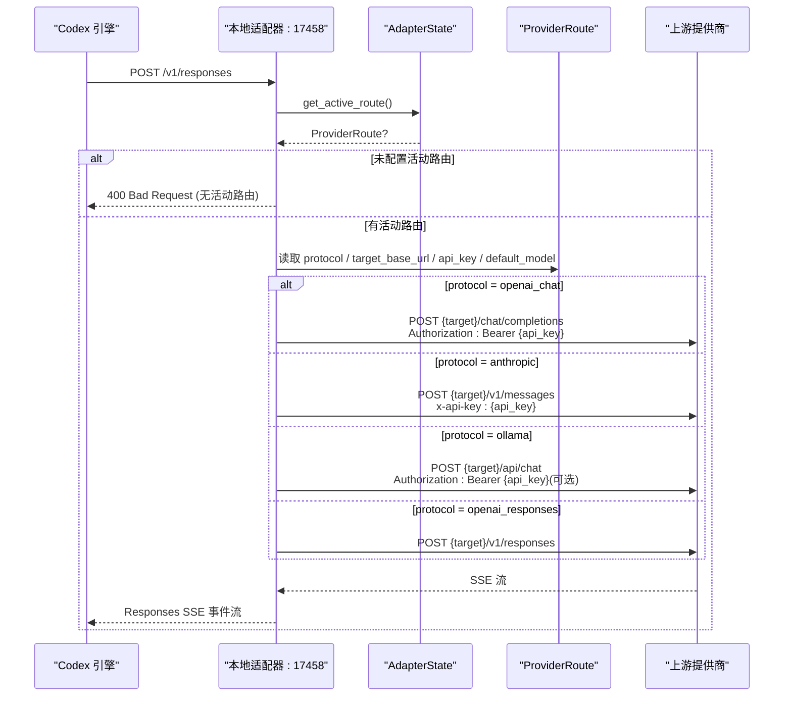
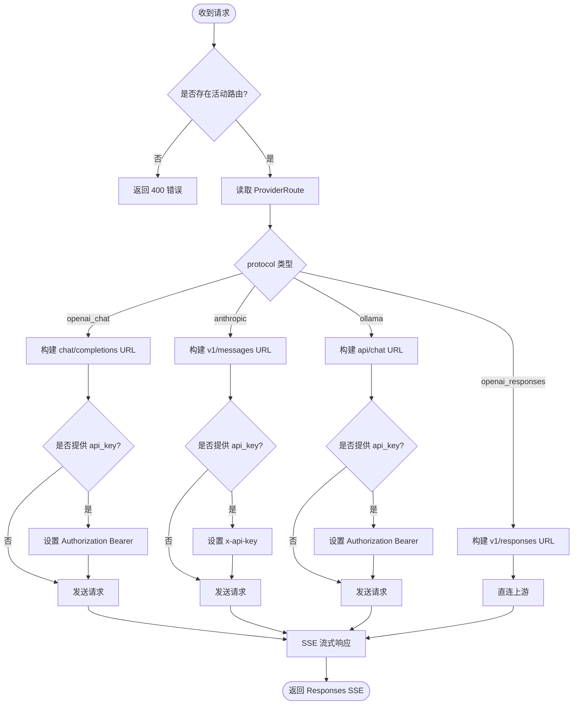
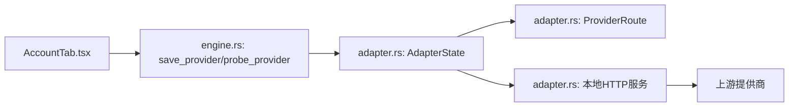

# 提供商路由

<cite>
**本文引用的文件**
- [adapter.rs](file://src-tauri/src/codex/adapter.rs)
- [engine.rs](file://src-tauri/src/commands/engine.rs)
- [AccountTab.tsx](file://frontend/app/views/settings/tabs/AccountTab.tsx)
- [appStore.ts](file://frontend/app/state/appStore.ts)
</cite>

## 目录
1. [简介](#简介)
2. [项目结构](#项目结构)
3. [核心组件](#核心组件)
4. [架构总览](#架构总览)
5. [详细组件分析](#详细组件分析)
6. [依赖关系分析](#依赖关系分析)
7. [性能考量](#性能考量)
8. [故障排查指南](#故障排查指南)
9. [结论](#结论)
10. [附录：配置示例与管理接口](#附录：配置示例与管理接口)

## 简介
本文件围绕 ProviderRoute 与 AdapterState 两个核心概念，系统化说明多提供商路由机制。内容涵盖：
- ProviderRoute 的结构字段与语义（id、protocol、target_base_url、api_key、default_model）
- AdapterState 的状态管理（路由注册、活动提供商切换、路由查找）
- 动态路由选择逻辑（协议类型判断、目标 URL 构建、API 密钥注入）
- 前端配置界面与管理接口使用方法（保存、探测、刷新）

## 项目结构
后端通过一个轻量本地 HTTP 适配器将 Codex 引擎的 Responses 请求转发到不同上游提供商（OpenAI Chat、Anthropic、Ollama），并根据 ProviderRoute 中的协议进行适配；AdapterState 维护所有已注册的路由以及当前“活动”提供商。前端提供账户设置页用于添加/编辑/启用提供商，并通过 Tauri 命令调用后端能力。

图表来源
- [adapter.rs:30-66](file://src-tauri/src/codex/adapter.rs#L30-L66)
- [engine.rs:264-404](file://src-tauri/src/commands/engine.rs#L264-L404)
- [AccountTab.tsx:87-147](file://frontend/app/views/settings/tabs/AccountTab.tsx#L87-L147)

章节来源
- [adapter.rs:1-111](file://src-tauri/src/codex/adapter.rs#L1-L111)
- [engine.rs:264-404](file://src-tauri/src/commands/engine.rs#L264-L404)
- [AccountTab.tsx:87-147](file://frontend/app/views/settings/tabs/AccountTab.tsx#L87-L147)

## 核心组件
- ProviderRoute：描述一个提供商路由的关键信息，包括唯一标识、协议类型、目标基础地址、API 密钥与默认模型。
- AdapterState：线程安全的状态容器，维护路由表与当前活动提供商 ID，并提供注册、激活、查询等方法。
- ProtocolAdapter：基于 Tokio 的本地 HTTP 服务，接收 Codex 引擎的请求，按活动路由的协议进行转换并转发到上游，再将响应以 Responses SSE 格式回写。

章节来源
- [adapter.rs:30-83](file://src-tauri/src/codex/adapter.rs#L30-L83)

## 架构总览
Codex 引擎统一使用 Responses 协议（/v1/responses）。当协议不是 openai_responses 时，shell 会将 base_url 指向本地适配器端口，由适配器根据 ProviderRoute.protocol 决定转发策略：
- openai_chat：转换为 OpenAI Chat Completions，追加 Authorization Bearer 头（若存在 api_key）
- anthropic：转换为 Anthropic Messages，使用 x-api-key 头
- ollama：转换为 Ollama Chat API，支持 Authorization Bearer（可选）
- openai_responses：直连上游，不经过适配器

图表来源
- [adapter.rs:162-220](file://src-tauri/src/codex/adapter.rs#L162-L220)
- [adapter.rs:222-601](file://src-tauri/src/codex/adapter.rs#L222-L601)
- [engine.rs:312-329](file://src-tauri/src/commands/engine.rs#L312-L329)

## 详细组件分析

### ProviderRoute 结构体
- id：提供商唯一标识，用于路由表索引与持久化键
- protocol：协议类型，支持 openai_chat、anthropic、ollama、openai_responses
- target_base_url：上游提供商的基础地址（不含路径）
- api_key：认证凭据，按协议注入对应头部
- default_model：当请求未指定模型时的回退模型名

该结构在保存提供商时被构造并写入 AdapterState，同时持久化到应用状态中。

章节来源
- [adapter.rs:30-37](file://src-tauri/src/codex/adapter.rs#L30-L37)
- [engine.rs:281-329](file://src-tauri/src/commands/engine.rs#L281-L329)

### AdapterState 状态管理
- routes：HashMap<id, ProviderRoute>，存储所有已注册路由
- active_provider_id：Option<String>，当前活动提供商 ID
- set_route：注册或更新路由
- set_active：设置活动提供商
- get_active_route：获取活动路由（先取 active id，再查路由表）
- get_route：按 id 查询任意路由

并发安全：内部使用 Arc<Mutex<...>> 保证多线程访问安全。

章节来源
- [adapter.rs:39-66](file://src-tauri/src/codex/adapter.rs#L39-L66)

### 动态路由选择逻辑
- 协议类型判断：根据 ProviderRoute.protocol 分支处理
  - openai_chat：目标 URL 为 {target_base_url}/chat/completions
  - anthropic：目标 URL 为 {target_base_url}/v1/messages
  - ollama：目标 URL 为 {target_base_url}/api/chat
  - openai_responses：直连 {target_base_url}/v1/responses
- 目标 URL 构建：拼接 target_base_url 与协议特定路径，自动去除末尾斜杠
- API 密钥注入：
  - openai_chat/ollama：Authorization: Bearer {api_key}
  - anthropic：x-api-key: {api_key}
  - openai_responses：透传上游要求（通常由上游自行鉴权）
- 默认模型：若请求未携带 model，则使用 ProviderRoute.default_model 作为回退

图表来源
- [adapter.rs:162-220](file://src-tauri/src/codex/adapter.rs#L162-L220)
- [adapter.rs:222-601](file://src-tauri/src/codex/adapter.rs#L222-L601)
- [engine.rs:312-329](file://src-tauri/src/commands/engine.rs#L312-L329)

章节来源
- [adapter.rs:162-220](file://src-tauri/src/codex/adapter.rs#L162-L220)
- [adapter.rs:222-601](file://src-tauri/src/codex/adapter.rs#L222-L601)
- [engine.rs:312-329](file://src-tauri/src/commands/engine.rs#L312-L329)

### 前端配置与管理接口
- 保存提供商：前端 AccountTab 调用 save_provider，传入 id、name、baseUrl、apiKey、protocol、defaultModel；后端将其写入 AdapterState 并持久化
- 探测连通性：probe_provider 对候选端点进行可达性与模型列表检查，返回 ok/error/hint/models
- 刷新与应用状态：refreshAppState 同步 providers 列表，UI 显示 active provider 与模型数量

章节来源
- [AccountTab.tsx:87-147](file://frontend/app/views/settings/tabs/AccountTab.tsx#L87-L147)
- [engine.rs:417-449](file://src-tauri/src/commands/engine.rs#L417-L449)
- [appStore.ts:195-213](file://frontend/app/state/appStore.ts#L195-L213)

## 依赖关系分析
- 命令层（engine.rs）负责解析前端输入、构造 ProviderRoute、写入 AdapterState、持久化配置，并将 base_url 指向本地适配器或直接上游
- 适配器层（adapter.rs）提供本地 HTTP 服务，依据活动路由的协议进行请求转换与响应封装
- 前端（AccountTab.tsx）提供用户交互入口，调用 Tauri 命令完成配置与探测

图表来源
- [engine.rs:264-404](file://src-tauri/src/commands/engine.rs#L264-L404)
- [adapter.rs:30-111](file://src-tauri/src/codex/adapter.rs#L30-L111)
- [AccountTab.tsx:87-147](file://frontend/app/views/settings/tabs/AccountTab.tsx#L87-L147)

章节来源
- [engine.rs:264-404](file://src-tauri/src/commands/engine.rs#L264-L404)
- [adapter.rs:30-111](file://src-tauri/src/codex/adapter.rs#L30-L111)
- [AccountTab.tsx:87-147](file://frontend/app/views/settings/tabs/AccountTab.tsx#L87-L147)

## 性能考量
- 适配器使用 Tokio 异步 I/O，连接级别处理避免阻塞主循环
- 上游请求超时设置为 180 秒，适合长对话流式场景
- SSE 流式转发减少内存占用，边收边发
- 工具调用聚合（如 OpenAI Chat 的 tool_calls delta）降低事件风暴
- 建议：
  - 合理设置上游超时与重试策略
  - 监控适配器端口占用与连接数
  - 对高频请求进行限流与缓存（如模型列表）

[本节为通用指导，无需具体文件引用]

## 故障排查指南
- 无活动路由：适配器返回 400，需确保至少一个提供商已保存并设为活动
- 上游不可达：适配器返回 502/错误码，检查 baseUrl、网络、证书与鉴权
- 鉴权失败：确认 api_key 正确且协议匹配（Bearer vs x-api-key）
- 模型缺失：probe_provider 可提示默认模型不在上游列表中
- 配置未生效：保存后需刷新应用状态，确保 providers 列表更新

章节来源
- [adapter.rs:162-191](file://src-tauri/src/codex/adapter.rs#L162-L191)
- [adapter.rs:270-295](file://src-tauri/src/codex/adapter.rs#L270-L295)
- [engine.rs:417-449](file://src-tauri/src/commands/engine.rs#L417-L449)

## 结论
ProviderRoute 与 AdapterState 构成了多提供商路由的核心：前者定义路由元数据，后者管理路由生命周期与活动选择。结合本地适配器，系统能够透明地将 Codex 的 Responses 请求适配到多种上游协议，实现统一的接入体验。前端提供直观的配置与探测能力，便于快速验证与切换。

[本节为总结，无需具体文件引用]

## 附录：配置示例与管理接口

### 配置字段说明
- id：字符串，唯一标识
- name：字符串，显示名称
- baseUrl：字符串，上游基础地址（http/https）
- apiKey：字符串，鉴权凭据（可选）
- protocol：字符串，协议类型（openai_chat | anthropic | ollama | openai_responses）
- defaultModel：字符串，默认模型（可选）

章节来源
- [engine.rs:281-329](file://src-tauri/src/commands/engine.rs#L281-L329)
- [AccountTab.tsx:27-45](file://frontend/app/views/settings/tabs/AccountTab.tsx#L27-L45)

### 管理接口用法
- 保存提供商：调用 save_provider，参数包含上述字段；成功后会写入 AdapterState 并持久化
- 探测连通性：调用 probe_provider，传入 baseUrl、protocol、apiKey、model；返回 ok 与模型信息或错误提示
- 刷新状态：调用 refreshAppState 以同步 providers 列表与活动提供商

章节来源
- [AccountTab.tsx:87-147](file://frontend/app/views/settings/tabs/AccountTab.tsx#L87-L147)
- [engine.rs:417-449](file://src-tauri/src/commands/engine.rs#L417-L449)
- [appStore.ts:195-213](file://frontend/app/state/appStore.ts#L195-L213)