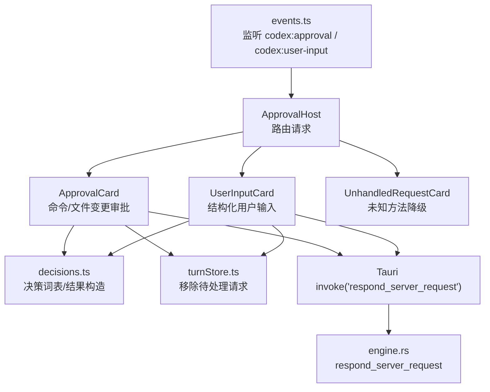
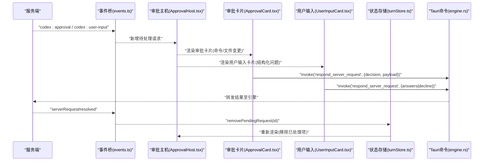
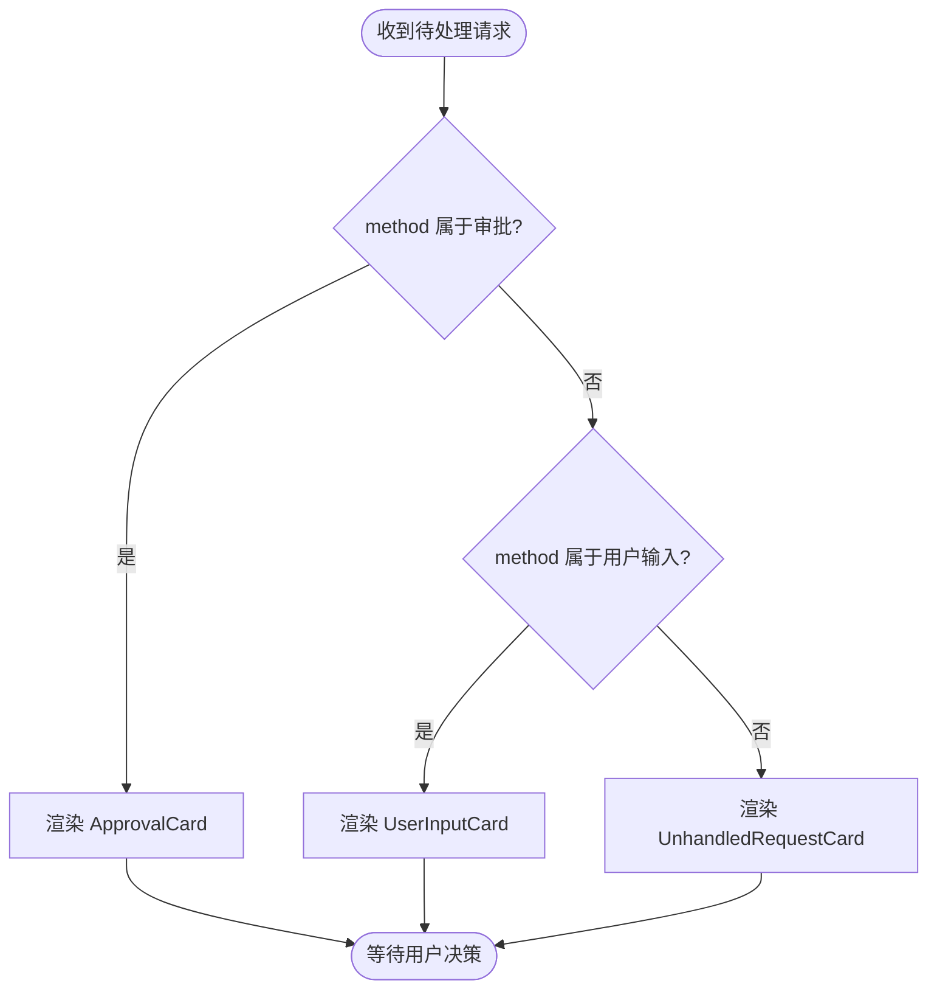
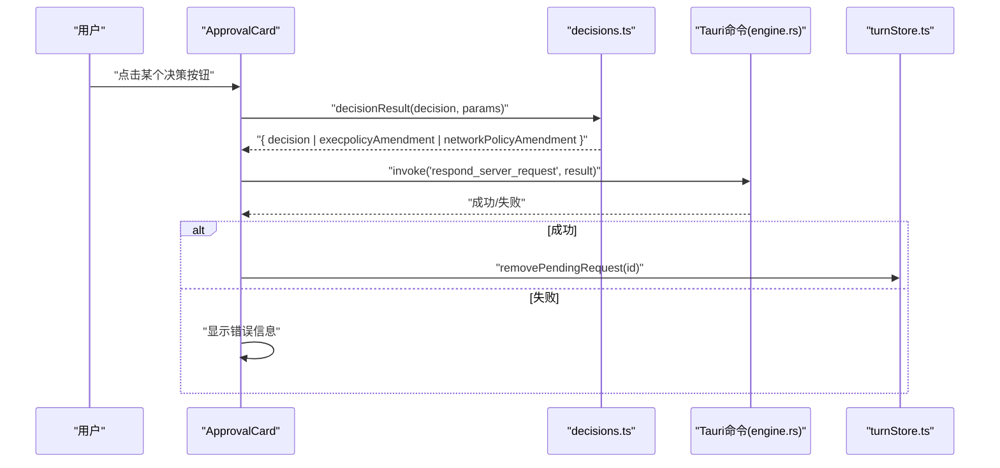
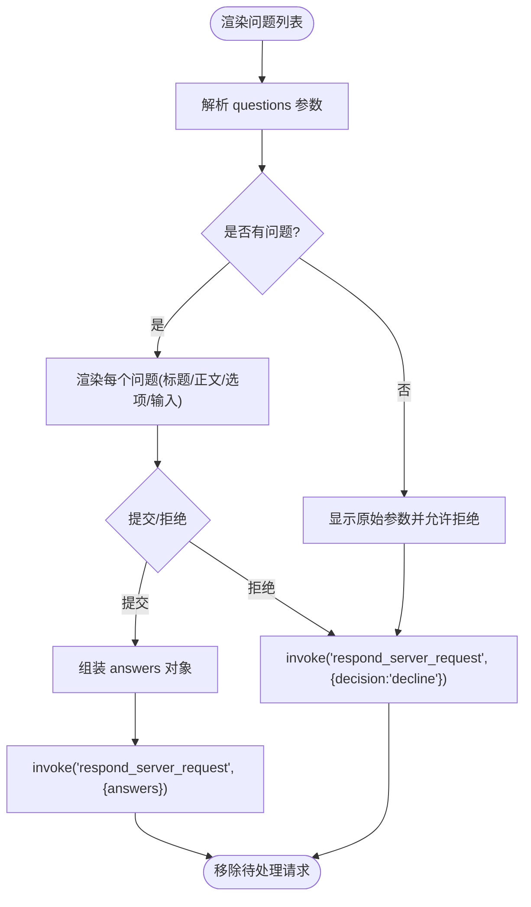
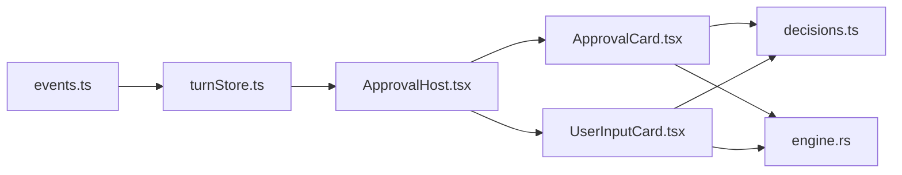

# 审批工作流

<cite>
**本文引用的文件**
- [ApprovalCard.tsx](file://frontend/app/approvals/ApprovalCard.tsx)
- [ApprovalHost.tsx](file://frontend/app/approvals/ApprovalHost.tsx)
- [UserInputCard.tsx](file://frontend/app/approvals/UserInputCard.tsx)
- [decisions.ts](file://frontend/app/approvals/decisions.ts)
- [turnStore.ts](file://frontend/app/state/turnStore.ts)
- [types.ts](file://frontend/app/state/types.ts)
- [hooks.ts](file://frontend/app/state/hooks.ts)
- [events.ts](file://frontend/app/bridge/events.ts)
- [approvals.css](file://frontend/app/styles/approvals.css)
- [engine.rs](file://src-tauri/src/commands/engine.rs)
</cite>

## 目录
1. [简介](#简介)
2. [项目结构](#项目结构)
3. [核心组件](#核心组件)
4. [架构总览](#架构总览)
5. [详细组件分析](#详细组件分析)
6. [依赖关系分析](#依赖关系分析)
7. [性能考量](#性能考量)
8. [故障排查指南](#故障排查指南)
9. [结论](#结论)
10. [附录](#附录)

## 简介
本文件为 Codex-Tauri 审批工作流系统的技术文档，聚焦以下目标：
- 用户输入确认与危险操作审批的交互流程
- 决策树管理与状态机设计（基于服务端下发的可用选项）
- 审批卡片组件、用户输入卡片的实现与集成
- 决策结果处理、错误恢复机制与不可挂起原则
- 审批规则自定义、条件判断、批量处理与审计日志记录建议
- 用户体验优化、无障碍访问、国际化支持与移动端适配
- 具体审批流程配置示例与自定义审批规则实现指南

## 项目结构
审批工作流由前端 React 组件、事件桥接、状态存储以及 Tauri 命令共同构成。关键路径如下：
- 前端展示层：ApprovalHost 负责分发渲染 ApprovalCard、UserInputCard 或“未处理请求”卡片
- 决策与文案：decisions.ts 定义决策词汇、标签键、视觉权重与回退文案
- 状态管理：turnStore.ts 维护 pendingRequests 等运行时状态；hooks.ts 提供订阅接口
- 事件桥接：events.ts 监听后端推送的通知与服务器请求，统一派发
- 后端命令：engine.rs 暴露 respond_server_request 等命令，将客户端决策回传给引擎

图表来源
- [ApprovalHost.tsx:20-29](file://frontend/app/approvals/ApprovalHost.tsx#L20-L29)
- [ApprovalCard.tsx:51-67](file://frontend/app/approvals/ApprovalCard.tsx#L51-L67)
- [UserInputCard.tsx:89-123](file://frontend/app/approvals/UserInputCard.tsx#L89-L123)
- [decisions.ts:79-108](file://frontend/app/approvals/decisions.ts#L79-L108)
- [turnStore.ts:274-281](file://frontend/app/state/turnStore.ts#L274-L281)
- [events.ts:145-153](file://frontend/app/bridge/events.ts#L145-L153)
- [engine.rs:177-183](file://src-tauri/src/commands/engine.rs#L177-L183)

章节来源
- [ApprovalHost.tsx:1-93](file://frontend/app/approvals/ApprovalHost.tsx#L1-L93)
- [events.ts:1-172](file://frontend/app/bridge/events.ts#L1-L172)
- [turnStore.ts:1-467](file://frontend/app/state/turnStore.ts#L1-L467)
- [engine.rs:137-183](file://src-tauri/src/commands/engine.rs#L137-L183)

## 核心组件
- 审批主机 ApprovalHost：根据请求 method 分派到审批卡片、用户输入卡片或未处理请求卡片，确保所有请求都有响应路径，避免挂起
- 审批卡片 ApprovalCard：渲染服务端提供的可执行命令、变更集、原因等信息，并展示服务端允许的决策列表；提交时调用 Tauri 命令返回决策结果
- 用户输入卡片 UserInputCard：渲染结构化问题（标题、正文、可选选项、是否保密），支持多选与自由文本；提交答案或拒绝
- 决策字典 decisions.ts：映射决策到本地化标签、视觉权重、回退文案，并构造符合协议的响应体（如“始终允许”需回显策略修订）
- 事件桥 events.ts：集中监听通知与服务器请求，保证 UI 不臆造状态
- 状态存储 turnStore.ts：维护 pendingRequests，提供添加/删除待处理请求的能力；通过 hooks 暴露给 React

章节来源
- [ApprovalHost.tsx:20-89](file://frontend/app/approvals/ApprovalHost.tsx#L20-L89)
- [ApprovalCard.tsx:37-127](file://frontend/app/approvals/ApprovalCard.tsx#L37-L127)
- [UserInputCard.tsx:65-206](file://frontend/app/approvals/UserInputCard.tsx#L65-L206)
- [decisions.ts:13-108](file://frontend/app/approvals/decisions.ts#L13-L108)
- [events.ts:57-87](file://frontend/app/bridge/events.ts#L57-L87)
- [turnStore.ts:274-281](file://frontend/app/state/turnStore.ts#L274-L281)

## 架构总览
审批工作流采用“服务端驱动 + 前端无状态渲染”的架构：
- 服务端通过 JSON-RPC 向客户端发起请求（审批/用户输入），携带 availableDecisions 决定可选项
- 前端仅渲染服务端提供的数据，并在用户选择后通过 Tauri 命令回传结果
- 状态存储在 turnStore 中，事件桥 events.ts 作为唯一入口接收后端消息
- 后端 engine.rs 暴露 respond_server_request，将任意结果转发给引擎以继续执行

图表来源
- [events.ts:145-153](file://frontend/app/bridge/events.ts#L145-L153)
- [ApprovalHost.tsx:74-89](file://frontend/app/approvals/ApprovalHost.tsx#L74-L89)
- [ApprovalCard.tsx:51-67](file://frontend/app/approvals/ApprovalCard.tsx#L51-L67)
- [UserInputCard.tsx:89-123](file://frontend/app/approvals/UserInputCard.tsx#L89-L123)
- [turnStore.ts:274-281](file://frontend/app/state/turnStore.ts#L274-L281)
- [engine.rs:177-183](file://src-tauri/src/commands/engine.rs#L177-L183)

## 详细组件分析

### 审批主机 ApprovalHost
- 职责：根据 method 集合判断请求类型，分别渲染 ApprovalCard、UserInputCard 或 UnhandledRequestCard
- 关键点：
  - 明确的方法白名单：命令执行、文件变更、权限审批属于审批类；工具/MCP 的用户输入属于输入类
  - 未处理请求必须提供拒绝路径，防止对话挂起
  - 使用 removePendingRequest 乐观移除，服务端也会幂等地移除

图表来源
- [ApprovalHost.tsx:20-29](file://frontend/app/approvals/ApprovalHost.tsx#L20-L29)
- [ApprovalHost.tsx:74-89](file://frontend/app/approvals/ApprovalHost.tsx#L74-L89)

章节来源
- [ApprovalHost.tsx:1-93](file://frontend/app/approvals/ApprovalHost.tsx#L1-L93)

### 审批卡片 ApprovalCard
- 职责：展示命令、工作目录、变更数量、原因、可执行决策按钮；提交决策并移除待处理项
- 决策来源：从 params.availableDecisions 读取有序列表，若缺失则回退到默认集合
- 结果构造：对“始终允许”和“应用网络策略修订”等决策，需回显服务端提供的策略修订字段
- 错误处理：捕获异常并显示失败信息，保持阻塞直到服务端得到答复

图表来源
- [ApprovalCard.tsx:51-67](file://frontend/app/approvals/ApprovalCard.tsx#L51-L67)
- [decisions.ts:79-108](file://frontend/app/approvals/decisions.ts#L79-L108)
- [turnStore.ts:274-281](file://frontend/app/state/turnStore.ts#L274-L281)
- [engine.rs:177-183](file://src-tauri/src/commands/engine.rs#L177-L183)

章节来源
- [ApprovalCard.tsx:1-131](file://frontend/app/approvals/ApprovalCard.tsx#L1-L131)
- [decisions.ts:1-109](file://frontend/app/approvals/decisions.ts#L1-L109)

### 用户输入卡片 UserInputCard
- 职责：解析 questions 数组，渲染标题、问题、选项与自由文本；支持多选与保密输入；提交答案或拒绝
- 关键行为：
  - isBlocking 控制按钮文案（提交/发送）
  - 未回答的可选问题将被忽略（服务端容忍缺失键）
  - 无结构化问题时仍需提供拒绝路径，避免挂起

图表来源
- [UserInputCard.tsx:36-55](file://frontend/app/approvals/UserInputCard.tsx#L36-L55)
- [UserInputCard.tsx:89-123](file://frontend/app/approvals/UserInputCard.tsx#L89-L123)
- [UserInputCard.tsx:125-147](file://frontend/app/approvals/UserInputCard.tsx#L125-L147)

章节来源
- [UserInputCard.tsx:1-209](file://frontend/app/approvals/UserInputCard.tsx#L1-L209)

### 决策字典 decisions.ts
- 职责：定义命令/文件变更的决策集合、标签键、视觉权重、回退文案；构造决策结果
- 要点：
  - 优先使用服务端提供的 availableDecisions；为空时回退到默认集合
  - “始终允许”需要回显 execpolicyAmendment；“应用网络策略修订”需要回显第一条 networkPolicyAmendment
  - 标签键通过 i18n 获取，并提供英文回退以保证加载前可渲染

章节来源
- [decisions.ts:1-109](file://frontend/app/approvals/decisions.ts#L1-L109)

### 事件桥 events.ts
- 职责：监听通知与服务器请求，统一派发；绑定 approval/user-input 通道
- 关键点：
  - 事件名规范化（替换点与斜杠）
  - 未知方法会警告但不中断桥接
  - 启动时并行绑定所有通知与方法

章节来源
- [events.ts:1-172](file://frontend/app/bridge/events.ts#L1-L172)

### 状态存储 turnStore.ts 与类型 types.ts
- 职责：维护 TurnState（包括 pendingRequests）、提供增删改查与订阅；定义数据结构
- 关键点：
  - addPendingRequest/removePendingRequest 用于审批/输入请求的生命周期
  - beginTurn 在切换线程时清理 items/order/pendingRequests 等
  - PendingRequest 包含 id/method/params/receivedAt

章节来源
- [turnStore.ts:71-107](file://frontend/app/state/turnStore.ts#L71-L107)
- [turnStore.ts:274-281](file://frontend/app/state/turnStore.ts#L274-L281)
- [types.ts:71-109](file://frontend/app/state/types.ts#L71-L109)

### 状态钩子 hooks.ts
- 职责：通过 useSyncExternalStore 暴露 turnStore 的快照与订阅
- 关键点：usePendingRequests 直接返回 pendingRequests 供审批主机消费

章节来源
- [hooks.ts:17-42](file://frontend/app/state/hooks.ts#L17-L42)

### 后端命令 engine.rs
- 职责：暴露 respond_server_request，将任意结果转发给引擎；也提供 resolve_approval 兼容旧接口
- 关键点：
  - 支持完整决策集（含带负载的“始终允许”与“应用网络策略修订”）
  - 旧接口仅支持布尔批准与简单分类

章节来源
- [engine.rs:137-183](file://src-tauri/src/commands/engine.rs#L137-L183)

## 依赖关系分析
- 组件耦合：
  - ApprovalHost 依赖 methods 白名单与两个子组件
  - ApprovalCard 依赖 decisions.ts 与 turnStore.ts
  - UserInputCard 依赖 turnStore.ts
  - 两者均通过 Tauri invoke 调用 engine.rs 的命令
- 外部依赖：
  - @protocol/notifications 与 @protocol/requests 生成方法集合
  - Tauri 事件系统用于跨进程通信
- 潜在循环：
  - 当前无循环依赖；事件桥单向流入状态存储与 UI

图表来源
- [events.ts:145-153](file://frontend/app/bridge/events.ts#L145-L153)
- [turnStore.ts:274-281](file://frontend/app/state/turnStore.ts#L274-L281)
- [ApprovalHost.tsx:74-89](file://frontend/app/approvals/ApprovalHost.tsx#L74-L89)
- [ApprovalCard.tsx:51-67](file://frontend/app/approvals/ApprovalCard.tsx#L51-L67)
- [UserInputCard.tsx:89-123](file://frontend/app/approvals/UserInputCard.tsx#L89-L123)
- [decisions.ts:79-108](file://frontend/app/approvals/decisions.ts#L79-L108)
- [engine.rs:177-183](file://src-tauri/src/commands/engine.rs#L177-L183)

章节来源
- [events.ts:1-172](file://frontend/app/bridge/events.ts#L1-L172)
- [turnStore.ts:1-467](file://frontend/app/state/turnStore.ts#L1-L467)
- [ApprovalHost.tsx:1-93](file://frontend/app/approvals/ApprovalHost.tsx#L1-L93)
- [ApprovalCard.tsx:1-131](file://frontend/app/approvals/ApprovalCard.tsx#L1-L131)
- [UserInputCard.tsx:1-209](file://frontend/app/approvals/UserInputCard.tsx#L1-L209)
- [decisions.ts:1-109](file://frontend/app/approvals/decisions.ts#L1-L109)
- [engine.rs:137-183](file://src-tauri/src/commands/engine.rs#L137-L183)

## 性能考量
- 高频率更新：turnStore 使用 subscribe/getSnapshot 模式，避免频繁重渲染上下文
- 批处理建议：
  - 服务端可在单个请求中携带多项变更（changes 数组），前端按长度提示；建议在批量场景下合并多次审批以减少交互次数
- 内存与渲染：
  - pendingRequests 仅保留活跃请求，完成后立即移除
  - 未处理请求提供降级路径，避免长时间占用 UI
- 网络与 IPC：
  - 使用 Tauri invoke 进行异步调用，注意错误重试与超时提示

[本节为通用指导，不直接分析具体文件]

## 故障排查指南
- 常见错误与恢复：
  - 审批响应失败：ApprovalCard 与 UserInputCard 捕获异常并显示错误信息，保持阻塞直至服务端收到答复
  - 未知方法：ApprovalHost 将其渲染为“未处理请求”，并提供拒绝按钮，确保对话可释放
  - 事件桥绑定失败：events.ts 捕获监听异常并记录日志，不影响其他通道
- 定位步骤：
  - 检查 pendingRequests 是否正确添加与移除
  - 查看 Tauri 命令返回值与错误消息
  - 核对 decisions.ts 中的决策是否与 availableDecisions 匹配
- 调试建议：
  - 在未处理请求卡片中查看原始 params，便于定位协议差异
  - 在服务端日志中追踪 request_id 对应的响应

章节来源
- [ApprovalCard.tsx:62-67](file://frontend/app/approvals/ApprovalCard.tsx#L62-L67)
- [ApprovalHost.tsx:31-72](file://frontend/app/approvals/ApprovalHost.tsx#L31-L72)
- [UserInputCard.tsx:104-123](file://frontend/app/approvals/UserInputCard.tsx#L104-L123)
- [events.ts:119-139](file://frontend/app/bridge/events.ts#L119-L139)

## 结论
Codex-Tauri 的审批工作流以“服务端驱动、前端无状态渲染”为核心，通过明确的决策词表、健壮的错误恢复与统一的 IPC 通道，确保危险操作可控、用户输入可收集、未知请求可降级。结合状态存储与事件桥，系统在可扩展性、可维护性与用户体验之间取得平衡。后续可在此基础上扩展批量审批、更丰富的条件判断与审计日志能力。

[本节为总结，不直接分析具体文件]

## 附录

### 审批流程配置示例
- 命令执行审批：
  - 服务端下发 method 为 item/commandExecution/requestApproval，携带 command、cwd、reason、availableDecisions
  - 前端渲染 ApprovalCard，用户选择“允许一次/允许本次会话/始终允许/应用网络策略修订/拒绝/取消”
  - 决策结果经 engine.rs 转发至引擎，完成或终止执行
- 文件变更审批：
  - 服务端下发 method 为 item/fileChange/requestApproval，携带 changes、availableDecisions
  - 前端渲染 ApprovalCard，用户选择“允许一次/允许本次会话/拒绝/取消”
- 权限审批：
  - 服务端下发 method 为 item/permissions/requestApproval，携带 reason、availableDecisions
  - 前端渲染 ApprovalCard，用户选择相应决策
- 用户输入：
  - 服务端下发 method 为 item/tool/requestUserInput 或 mcpServer/elicitation/request，携带 questions、isBlocking
  - 前端渲染 UserInputCard，用户填写答案或拒绝

章节来源
- [ApprovalHost.tsx:20-29](file://frontend/app/approvals/ApprovalHost.tsx#L20-L29)
- [ApprovalCard.tsx:42-50](file://frontend/app/approvals/ApprovalCard.tsx#L42-L50)
- [UserInputCard.tsx:36-55](file://frontend/app/approvals/UserInputCard.tsx#L36-L55)
- [decisions.ts:13-24](file://frontend/app/approvals/decisions.ts#L13-L24)

### 自定义审批规则实现指南
- 扩展决策词表：
  - 在 decisions.ts 中新增决策常量、标签键、视觉权重与回退文案
  - 在 decisionsFor 中增加对新决策的过滤逻辑（如需）
  - 在 decisionResult 中为新决策构造响应体（如携带策略修订）
- 条件判断：
  - 根据 params 中的字段（如 command、changes、reason）在前端进行条件分支，动态调整 availableDecisions 的展示顺序或禁用某些选项
- 批量处理：
  - 当 changes 数组较大时，考虑合并多次审批为一次交互（例如“全部允许”按钮），但需确保服务端支持该语义
- 审计日志记录：
  - 在 ApprovalCard/UserInputCard 提交前后记录决策、时间戳、request_id、用户标识（如有）
  - 将日志写入本地文件或通过后端命令上报，便于事后审计

章节来源
- [decisions.ts:39-67](file://frontend/app/approvals/decisions.ts#L39-L67)
- [decisions.ts:79-108](file://frontend/app/approvals/decisions.ts#L79-L108)
- [ApprovalCard.tsx:51-67](file://frontend/app/approvals/ApprovalCard.tsx#L51-L67)
- [UserInputCard.tsx:89-123](file://frontend/app/approvals/UserInputCard.tsx#L89-L123)

### 用户体验优化
- 即时反馈：
  - 提交后立即禁用按钮并显示加载中；失败时清晰展示错误信息
- 可读性：
  - 命令与工作目录使用等宽字体；变更数量与元数据清晰标注
- 无障碍访问：
  - 使用 role="dialog"、aria-modal、aria-expanded 等属性提升可访问性
- 国际化支持：
  - 所有用户可见文案通过 t() 获取，并提供英文回退
- 移动端适配：
  - 使用 flex-wrap 与紧凑间距；按钮尺寸适合触摸操作

章节来源
- [ApprovalCard.tsx:71-127](file://frontend/app/approvals/ApprovalCard.tsx#L71-L127)
- [UserInputCard.tsx:150-206](file://frontend/app/approvals/UserInputCard.tsx#L150-L206)
- [approvals.css:5-133](file://frontend/app/styles/approvals.css#L5-L133)
- [approvals.css:137-247](file://frontend/app/styles/approvals.css#L137-L247)