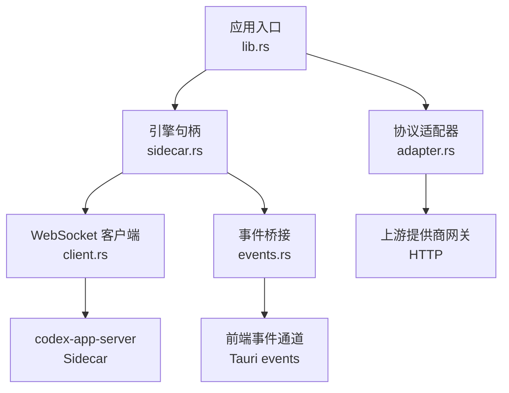
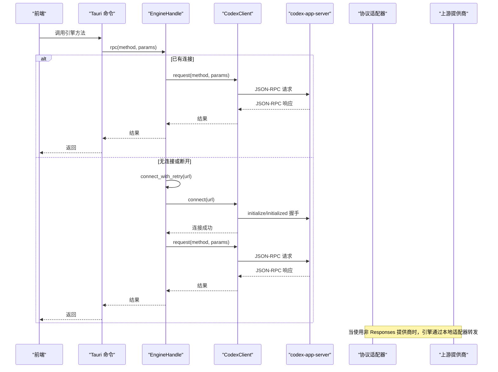
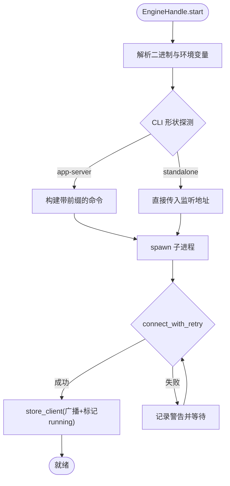
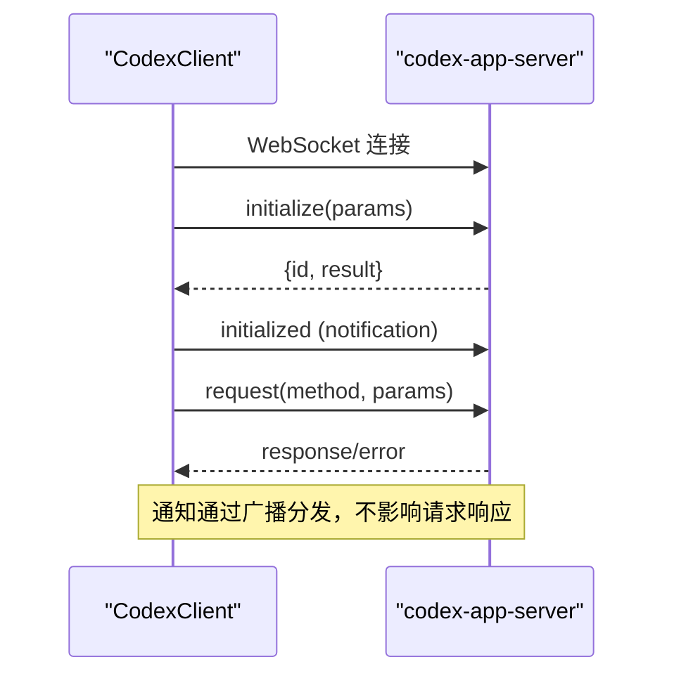
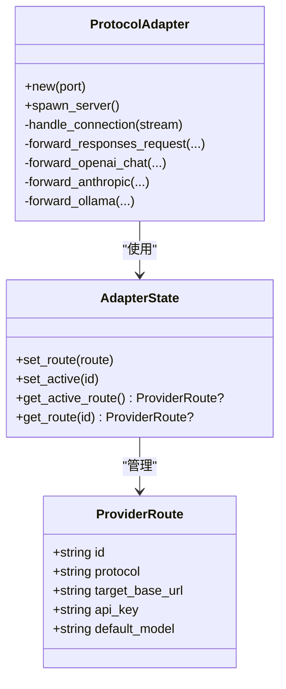
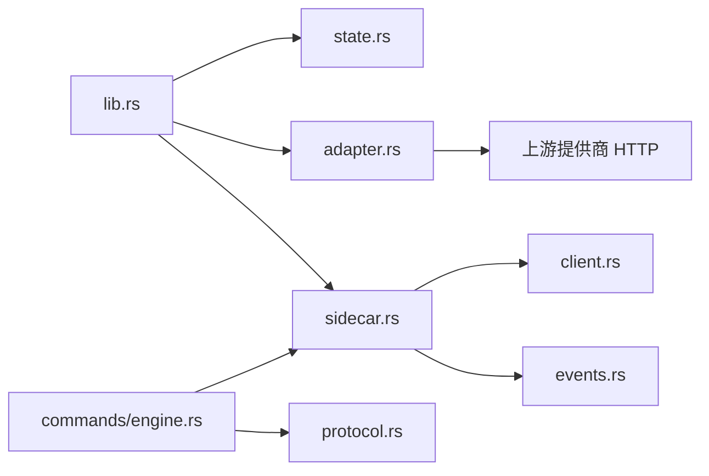

# 引擎管理

<cite>
**本文引用的文件**
- [src-tauri/src/codex/sidecar.rs](file://src-tauri/src/codex/sidecar.rs)
- [src-tauri/src/commands/engine.rs](file://src-tauri/src/commands/engine.rs)
- [src-tauri/src/state.rs](file://src-tauri/src/state.rs)
- [src-tauri/src/codex/mod.rs](file://src-tauri/src/codex/mod.rs)
- [src-tauri/src/codex/client.rs](file://src-tauri/src/codex/client.rs)
- [src-tauri/src/codex/adapter.rs](file://src-tauri/src/codex/adapter.rs)
- [src-tauri/src/codex/events.rs](file://src-tauri/src/codex/events.rs)
- [src-tauri/src/codex/protocol.rs](file://src-tauri/src/codex/protocol.rs)
- [src-tauri/src/lib.rs](file://src-tauri/src/lib.rs)
</cite>

## 目录
1. [简介](#简介)
2. [项目结构](#项目结构)
3. [核心组件](#核心组件)
4. [架构总览](#架构总览)
5. [详细组件分析](#详细组件分析)
6. [依赖关系分析](#依赖关系分析)
7. [性能考虑](#性能考虑)
8. [故障排查指南](#故障排查指南)
9. [结论](#结论)
10. [附录：扩展新引擎提供商示例](#附录：扩展新引擎提供商示例)

## 简介
本文件面向 Codex-Tauri 的“引擎管理系统”，聚焦 Sidecar 进程生命周期、二进制解析与安装、进程启动/停止、EngineHandle 设计模式、进程间通信（WebSocket JSON-RPC）、错误处理与资源清理；并说明多提供商引擎初始化流程、配置管理与状态同步，以及进程监控、健康检查、自动重启策略与故障恢复机制。文末提供扩展新引擎提供商的具体步骤与调试技巧。

## 项目结构
后端以 Tauri 应用为入口，启动时完成以下关键初始化：
- 加载本地状态（设置、偏好、提供商密钥等）
- 启动协议适配器（本地 HTTP 服务，将 Responses 适配到 OpenAI Chat / Anthropic / Ollama）
- 启动官方 codex-app-server Sidecar（WebSocket JSON-RPC）
- 建立事件桥接，将 Sidecar 通知转发到前端事件通道

图表来源
- [src-tauri/src/lib.rs:23-67](file://src-tauri/src/lib.rs#L23-L67)
- [src-tauri/src/codex/adapter.rs:85-111](file://src-tauri/src/codex/adapter.rs#L85-L111)
- [src-tauri/src/codex/sidecar.rs:31-125](file://src-tauri/src/codex/sidecar.rs#L31-L125)
- [src-tauri/src/codex/client.rs:37-94](file://src-tauri/src/codex/client.rs#L37-L94)
- [src-tauri/src/codex/events.rs:12-43](file://src-tauri/src/codex/events.rs#L12-L43)

章节来源
- [src-tauri/src/lib.rs:23-67](file://src-tauri/src/lib.rs#L23-L67)

## 核心组件
- EngineHandle：封装 Sidecar 子进程、WebSocket 客户端、连接重试、事件广播、元数据缓存与关闭逻辑。
- CodexClient：异步 WebSocket JSON-RPC 客户端，负责 initialize/initialized 握手、请求-响应映射、通知广播与超时控制。
- ProtocolAdapter：本地 HTTP 适配器，接收来自引擎的 Responses 请求，按路由转发到不同提供商协议，并将上游流式响应转回 Responses SSE。
- 命令层（engine.rs）：暴露 Tauri 命令，封装对 Sidecar 的 RPC 调用，统一参数构造与结果归一化。
- 状态管理（state.rs）：持久化本地设置、提供商密钥、协议与端点信息，并在启动时注入到适配器与 Sidecar 环境。
- 事件桥接（events.rs）：订阅 EngineHandle 的稳定广播通道，将服务器通知与请求映射为前端事件。

章节来源
- [src-tauri/src/codex/sidecar.rs:22-276](file://src-tauri/src/codex/sidecar.rs#L22-L276)
- [src-tauri/src/codex/client.rs:23-199](file://src-tauri/src/codex/client.rs#L23-L199)
- [src-tauri/src/codex/adapter.rs:30-111](file://src-tauri/src/codex/adapter.rs#L30-L111)
- [src-tauri/src/commands/engine.rs:13-20](file://src-tauri/src/commands/engine.rs#L13-L20)
- [src-tauri/src/state.rs:150-232](file://src-tauri/src/state.rs#L150-L232)
- [src-tauri/src/codex/events.rs:12-43](file://src-tauri/src/codex/events.rs#L12-L43)

## 架构总览
系统由三层组成：
- 应用层（Tauri 命令）：对外暴露 API，负责参数组装、错误归一化与 UI 友好返回。
- 引擎管理层（EngineHandle + Client）：管理 Sidecar 进程生命周期、连接与重连、RPC 请求与通知分发。
- 适配层（ProtocolAdapter）：将引擎的 Responses 协议适配到第三方提供商协议，实现多提供商统一接入。

图表来源
- [src-tauri/src/commands/engine.rs:13-20](file://src-tauri/src/commands/engine.rs#L13-L20)
- [src-tauri/src/codex/sidecar.rs:195-244](file://src-tauri/src/codex/sidecar.rs#L195-L244)
- [src-tauri/src/codex/client.rs:37-94](file://src-tauri/src/codex/client.rs#L37-L94)
- [src-tauri/src/codex/adapter.rs:162-220](file://src-tauri/src/codex/adapter.rs#L162-L220)

## 详细组件分析

### EngineHandle：Sidecar 进程与 RPC 的统一句柄
- 进程生命周期
  - start：解析二进制路径与环境变量，探测 CLI 形状（是否需 app-server 子命令），注入提供商密钥环境变量，构建 Command 并 spawn。
  - shutdown：关闭 WebSocket 客户端，终止子进程，重置运行标志。
- 连接与重连
  - connect_with_retry：在 Sidecar 存活时进行有限次数的连接重试，避免冷启动竞态导致的瞬时失败。
  - is_running：基于 AtomicBool 与客户端连接状态判断。
- 事件与元数据
  - subscribe：稳定广播通道，独立于客户端重连。
  - initialize_meta：缓存最后一次 initialize 结果，供 UI 读取能力与元信息。
- 错误处理
  - 连接失败记录警告日志，不阻塞 UI。
  - 首次连接失败会返回结构化错误，便于上层降级。

图表来源
- [src-tauri/src/codex/sidecar.rs:31-125](file://src-tauri/src/codex/sidecar.rs#L31-L125)
- [src-tauri/src/codex/sidecar.rs:195-244](file://src-tauri/src/codex/sidecar.rs#L195-L244)

章节来源
- [src-tauri/src/codex/sidecar.rs:22-276](file://src-tauri/src/codex/sidecar.rs#L22-L276)

### CodexClient：WebSocket JSON-RPC 客户端
- 握手流程：connect 后执行 initialize 请求，收到响应后发送 initialized 通知，完成握手。
- 请求-响应：维护 pending map（oneshot channel），支持超时与错误映射。
- 通知广播：所有服务端通知通过 broadcast 通道分发，避免抢占 pending 映射。
- 服务端请求响应：respond 用于回复审批、用户输入等 server→client 请求。

图表来源
- [src-tauri/src/codex/client.rs:37-94](file://src-tauri/src/codex/client.rs#L37-L94)
- [src-tauri/src/codex/client.rs:148-199](file://src-tauri/src/codex/client.rs#L148-L199)
- [src-tauri/src/codex/protocol.rs:103-156](file://src-tauri/src/codex/protocol.rs#L103-L156)

章节来源
- [src-tauri/src/codex/client.rs:23-199](file://src-tauri/src/codex/client.rs#L23-L199)
- [src-tauri/src/codex/protocol.rs:103-156](file://src-tauri/src/codex/protocol.rs#L103-L156)

### 协议适配器：多提供商统一接入
- 路由与状态：ProviderRoute 保存 id、协议、目标 base_url、api_key、默认模型；AdapterState 管理活跃路由。
- 请求转发：根据协议将 Responses 转换为 OpenAI Chat / Anthropic Messages / Ollama Chat，并附加工具定义与鉴权头。
- 流式响应：将上游 SSE 转换为 Responses 规范的事件流（response.created → output_text.delta → completed）。
- 错误处理：上游不可达或错误时返回 502/错误体，保证引擎侧可感知。

图表来源
- [src-tauri/src/codex/adapter.rs:30-111](file://src-tauri/src/codex/adapter.rs#L30-L111)
- [src-tauri/src/codex/adapter.rs:194-220](file://src-tauri/src/codex/adapter.rs#L194-L220)

章节来源
- [src-tauri/src/codex/adapter.rs:30-220](file://src-tauri/src/codex/adapter.rs#L30-L220)

### 命令层：引擎方法封装与归一化
- 会话管理：new_session、list_sessions、get_session、delete_session、archive/unarchive。
- 消息与中断：send_message、interrupt_session。
- 审批与请求：resolve_approval、respond_server_request。
- 提供商管理：list_providers、save_provider、probe_provider。
- MCP/技能/插件：list/save/test 等。
- Shell：open_shell、write_shell、read_shell、close_shell。

章节来源
- [src-tauri/src/commands/engine.rs:22-800](file://src-tauri/src/commands/engine.rs#L22-L800)

### 状态管理：配置与密钥注入
- Settings：包含主题、语言、活跃提供商、模型、终端 shell、审批策略、沙箱、监听地址、二进制路径等。
- InnerState：存储 provider_secrets、provider_protocols、provider_endpoints，并在启动时注入到适配器与 Sidecar 环境。
- 安全：API Key 不写入明文配置文件，仅保存 env_key 名称，实际密钥通过环境变量注入 Sidecar。

章节来源
- [src-tauri/src/state.rs:27-47](file://src-tauri/src/state.rs#L27-L47)
- [src-tauri/src/state.rs:150-232](file://src-tauri/src/state.rs#L150-L232)
- [src-tauri/src/state.rs:8-25](file://src-tauri/src/state.rs#L8-L25)

### 事件桥接：Sidecar 通知到前端
- 订阅 EngineHandle 的稳定广播通道，延迟启动确保 EngineHandle 已就绪。
- 将服务器通知与方法名映射为前端事件（如 codex:turn-completed）。
- 将审批与用户输入请求映射为专用事件（codex:approval、codex:user-input）。

章节来源
- [src-tauri/src/codex/events.rs:12-43](file://src-tauri/src/codex/events.rs#L12-L43)
- [src-tauri/src/codex/events.rs:45-82](file://src-tauri/src/codex/events.rs#L45-L82)

## 依赖关系分析
- lib.rs 作为入口，依次注册插件、菜单、setup 中启动适配器与引擎，并管理状态。
- EngineHandle 依赖 client、protocol、state；commands 依赖 EngineHandle 与 protocol。
- 适配器依赖 reqwest、tokio 网络库，与上游提供商通过 HTTP 交互。
- 事件桥接依赖 tauri::Emitter 与 EngineHandle 的广播通道。

图表来源
- [src-tauri/src/lib.rs:23-67](file://src-tauri/src/lib.rs#L23-L67)
- [src-tauri/src/codex/sidecar.rs:22-276](file://src-tauri/src/codex/sidecar.rs#L22-L276)
- [src-tauri/src/codex/client.rs:23-199](file://src-tauri/src/codex/client.rs#L23-L199)
- [src-tauri/src/codex/adapter.rs:30-111](file://src-tauri/src/codex/adapter.rs#L30-L111)
- [src-tauri/src/commands/engine.rs:13-20](file://src-tauri/src/commands/engine.rs#L13-L20)

章节来源
- [src-tauri/src/lib.rs:23-67](file://src-tauri/src/lib.rs#L23-L67)

## 性能考虑
- 连接重试预算：Sidecar 冷启动时限制重试次数与间隔，避免长时间阻塞 UI。
- 广播通道容量：事件与通知使用固定容量广播，防止背压导致内存增长。
- 超时控制：initialize 与请求分别设置超时，避免挂起。
- 流式响应：适配器将上游 SSE 逐步转换为 Responses 事件，减少缓冲与延迟。
- 二进制安装：内容哈希目录避免重复拷贝，原子写入提升可靠性。

[本节为通用指导，不直接分析具体文件]

## 故障排查指南
- Sidecar 未找到或无法启动
  - 检查环境变量 CODEX_APP_SERVER 与 settings.app_server_binary。
  - 查看日志中的警告信息，确认二进制是否存在与权限是否正确。
- 连接失败（端口拒绝/超时）
  - 确认监听地址与端口未被占用。
  - 观察 connect_with_retry 的重试日志，定位竞态问题。
- 提供商探针失败
  - 核对 Base URL 协议与路径（OpenAI 兼容通常以 /v1 结尾，Anthropic 不带 /v1）。
  - 检查鉴权头（Bearer vs x-api-key）与密钥格式。
- 审批与用户输入无响应
  - 确认 respond 调用携带正确的 request_id 与决策值。
  - 检查事件桥接是否订阅成功，前端是否收到 codex:approval 或 codex:user-input。

章节来源
- [src-tauri/src/codex/sidecar.rs:31-125](file://src-tauri/src/codex/sidecar.rs#L31-L125)
- [src-tauri/src/commands/engine.rs:416-521](file://src-tauri/src/commands/engine.rs#L416-L521)
- [src-tauri/src/codex/events.rs:45-82](file://src-tauri/src/codex/events.rs#L45-L82)

## 结论
Codex-Tauri 引擎管理系统通过 EngineHandle 统一管理 Sidecar 进程与 WebSocket 客户端，结合协议适配器实现多提供商统一接入。系统在启动阶段完成二进制解析、环境注入与连接预热，运行时通过广播通道与命令层提供稳定的事件与 API。错误处理与超时控制保障了健壮性，状态管理确保了配置与密钥的安全与一致性。

[本节为总结，不直接分析具体文件]

## 附录：扩展新引擎提供商示例
目标：新增一个自定义提供商（例如 “custom_chat”），使其可通过本地适配器被引擎调用。

步骤概览
- 在 ProviderRoute.protocol 中增加新协议标识（如 “custom_chat”）。
- 在 forward_responses_request 中添加分支，调用新的 forward_custom_chat 方法。
- 实现 forward_custom_chat：
  - 将 Responses 请求转换为上游协议的请求体（包括 messages、tools、鉴权头）。
  - 发起 HTTP 请求，处理流式响应，将其转换为 Responses SSE 事件。
  - 处理错误并返回合适的 HTTP 状态码与错误体。
- 更新 probe_provider：
  - 添加对新协议的候选端点与鉴权方式。
  - 提取模型列表并验证指定模型是否存在。
- 更新 save_provider：
  - 允许选择新协议，并正确设置 effective_base_url（若需要适配器）。
  - 将协议与端点保存到 AppState，并在启动时注入适配器。

参考位置
- 协议路由与分发：[src-tauri/src/codex/adapter.rs:194-220](file://src-tauri/src/codex/adapter.rs#L194-L220)
- OpenAI Chat 适配示例：[src-tauri/src/codex/adapter.rs:222-343](file://src-tauri/src/codex/adapter.rs#L222-L343)
- Anthropic 适配示例：[src-tauri/src/codex/adapter.rs:345-494](file://src-tauri/src/codex/adapter.rs#L345-L494)
- Ollama 适配示例：[src-tauri/src/codex/adapter.rs:496-601](file://src-tauri/src/codex/adapter.rs#L496-L601)
- 提供商探针：[src-tauri/src/commands/engine.rs:416-521](file://src-tauri/src/commands/engine.rs#L416-L521)
- 提供商保存：[src-tauri/src/commands/engine.rs:263-404](file://src-tauri/src/commands/engine.rs#L263-L404)

调试技巧
- 启用 tracing 日志，观察适配器连接与上游响应。
- 使用浏览器或 curl 直接测试上游接口，确认鉴权与路径正确。
- 在前端控制台监听 codex:* 事件，确认通知与请求正常到达。

[本节为扩展指导，不直接分析具体文件]