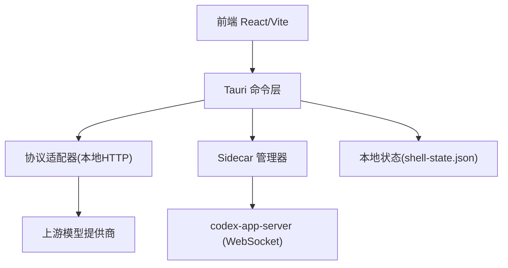
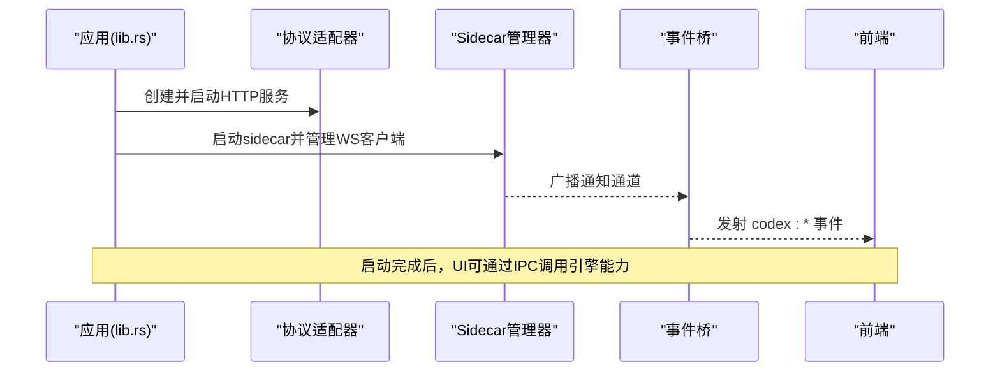
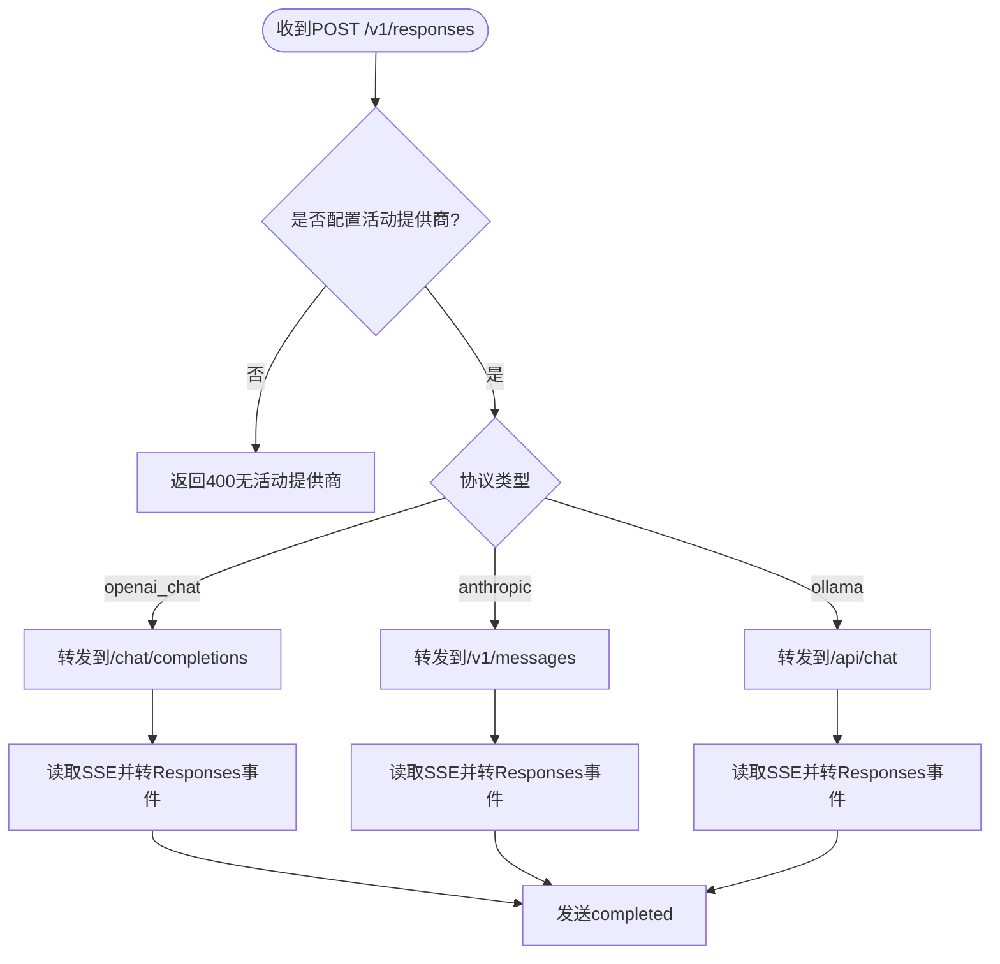
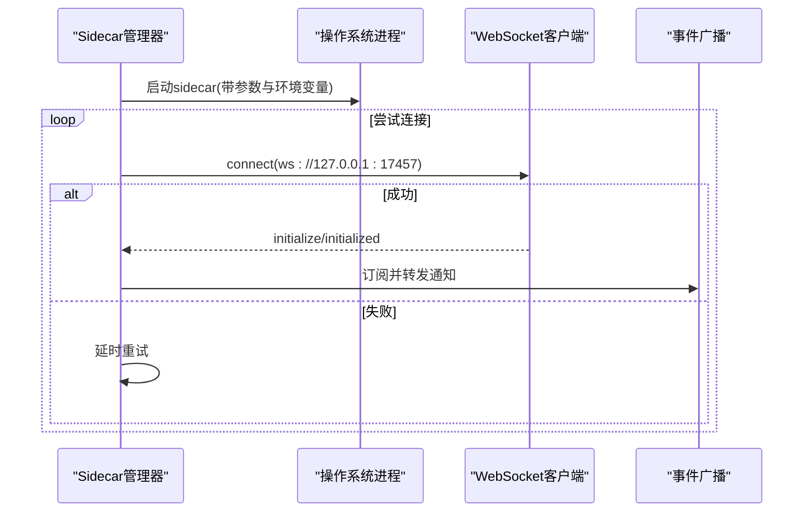
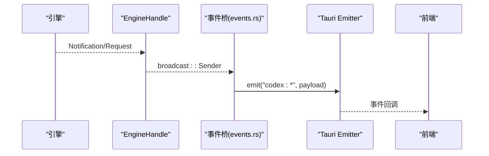
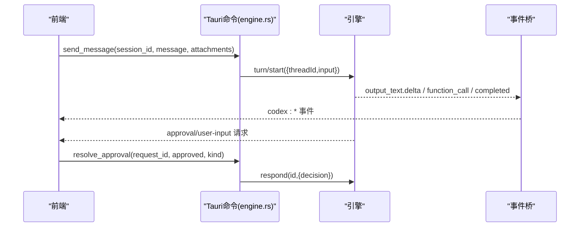
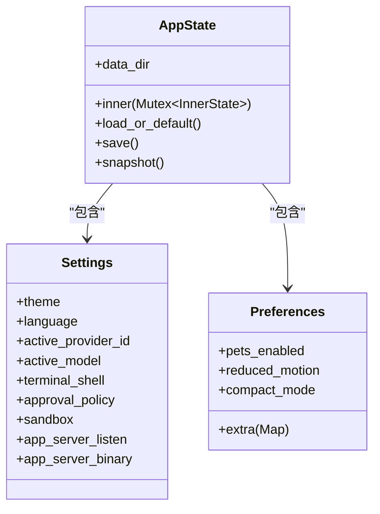
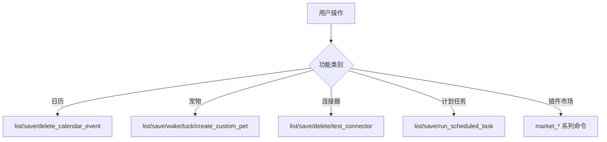
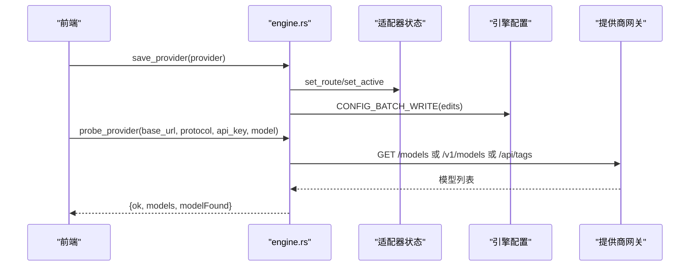
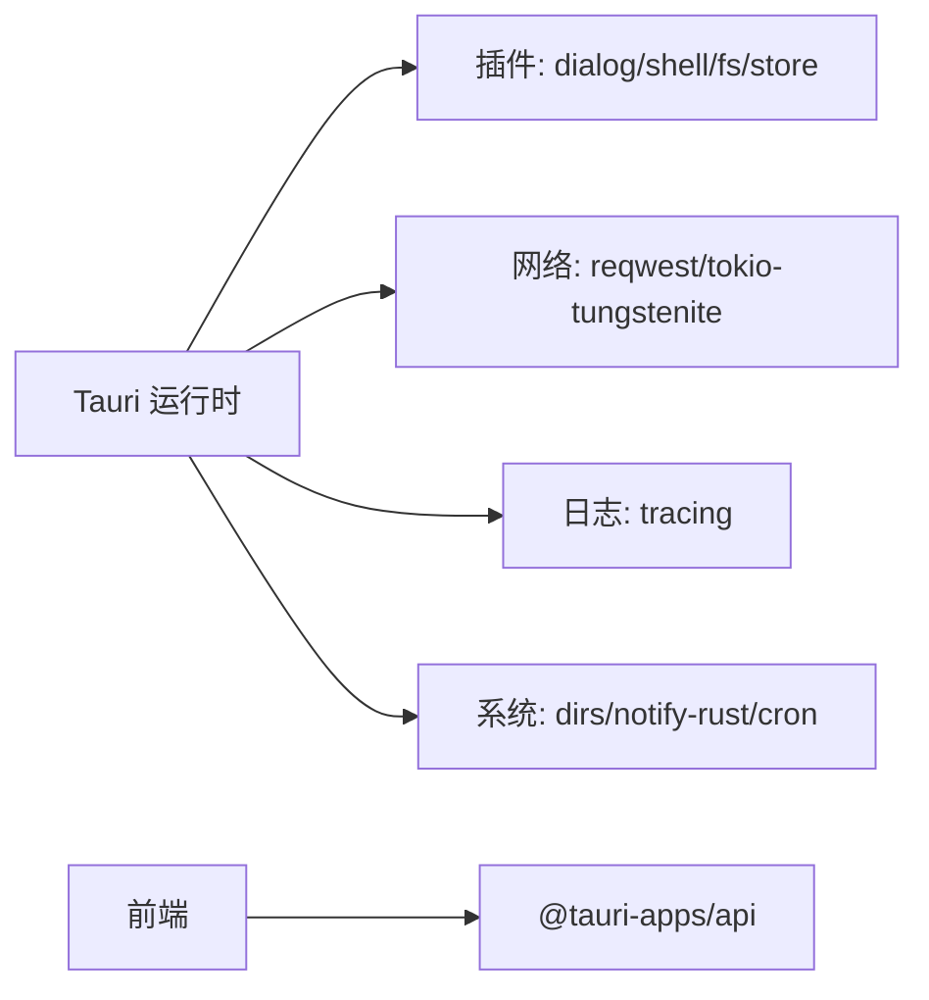

# 核心功能

<cite>
**本文引用的文件**
- [README.md](file://README.md)
- [lib.rs](file://src-tauri/src/lib.rs)
- [main.rs](file://src-tauri/src/main.rs)
- [Cargo.toml](file://src-tauri/Cargo.toml)
- [package.json](file://frontend/package.json)
- [mod.rs](file://src-tauri/src/codex/mod.rs)
- [adapter.rs](file://src-tauri/src/codex/adapter.rs)
- [sidecar.rs](file://src-tauri/src/codex/sidecar.rs)
- [events.rs](file://src-tauri/src/codex/events.rs)
- [protocol.rs](file://src-tauri/src/codex/protocol.rs)
- [engine.rs](file://src-tauri/src/commands/engine.rs)
- [settings.rs](file://src-tauri/src/commands/settings.rs)
- [pets.rs](file://src-tauri/src/commands/pets.rs)
- [state.rs](file://src-tauri/src/state.rs)
</cite>

## 目录
1. [简介](#简介)
2. [项目结构](#项目结构)
3. [核心组件](#核心组件)
4. [架构总览](#架构总览)
5. [详细组件分析](#详细组件分析)
6. [依赖关系分析](#依赖关系分析)
7. [性能考量](#性能考量)
8. [故障排除指南](#故障排除指南)
9. [结论](#结论)
10. [附录](#附录)

## 简介
本文件面向 Codex-Tauri 的核心能力，聚焦以下主题：
- 引擎适配器机制与多提供商支持（OpenAI、Anthropic、Ollama）
- 协议转换与错误处理
- 事件驱动架构、WebSocket 通信与实时数据流
- 设置管理、偏好持久化、日历集成、宠物系统等桌面原生能力
- 审批工作流、消息流处理与用户交互模式
- 配置选项、使用示例与排错建议

整体分层为：React UI → Tauri Shell API（产品 IPC）→ app-server JSON-RPC → 官方引擎。本地 store 承载宠物、日历、设置等桌面能力。

**章节来源**
- [README.md:16-22](file://README.md#L16-L22)

## 项目结构
仓库采用前后端分离的 Tauri 应用组织方式：
- 前端：React + Vite，通过 @tauri-apps/api 调用后端命令
- 后端：Rust/Tauri，负责启动 sidecar、事件桥接、IPC 命令实现、本地状态持久化
- 引擎：预编译的 codex-app-server 作为 sidecar，通过 WebSocket 暴露 JSON-RPC

**图表来源**
- [lib.rs:16-69](file://src-tauri/src/lib.rs#L16-L69)
- [adapter.rs:1-16](file://src-tauri/src/codex/adapter.rs#L1-L16)
- [sidecar.rs:1-29](file://src-tauri/src/codex/sidecar.rs#L1-L29)

**章节来源**
- [lib.rs:1-162](file://src-tauri/src/lib.rs#L1-L162)
- [package.json:1-31](file://frontend/package.json#L1-L31)

## 核心组件
- 协议适配器：将引擎的 Responses 请求适配到 OpenAI Chat、Anthropic Messages、Ollama Chat，并以 Responses SSE 格式回写
- Sidecar 管理器：发现并启动 codex-app-server，维护 WebSocket 客户端，转发通知到前端
- 事件桥：订阅引擎通知，映射为 Tauri 事件，供前端监听
- 命令层：封装对引擎的 RPC 调用，提供会话、消息、审批、MCP、插件、Shell 等能力
- 状态管理：持久化设置、偏好、宠物、日历、连接器、快捷方式、计划任务等

**章节来源**
- [adapter.rs:1-16](file://src-tauri/src/codex/adapter.rs#L1-L16)
- [sidecar.rs:1-29](file://src-tauri/src/codex/sidecar.rs#L1-L29)
- [events.rs:1-82](file://src-tauri/src/codex/events.rs#L1-L82)
- [engine.rs:1-20](file://src-tauri/src/commands/engine.rs#L1-L20)
- [state.rs:1-331](file://src-tauri/src/state.rs#L1-L331)

## 架构总览
应用启动时完成以下关键步骤：
- 初始化日志、插件、菜单
- 加载或创建本地状态
- 启动协议适配器（默认端口），注入提供商路由并激活当前提供商
- 启动 codex-app-server sidecar（WebSocket），建立连接
- 启动事件桥，将引擎通知广播到前端

**图表来源**
- [lib.rs:23-69](file://src-tauri/src/lib.rs#L23-L69)
- [events.rs:11-43](file://src-tauri/src/codex/events.rs#L11-L43)

**章节来源**
- [lib.rs:16-69](file://src-tauri/src/lib.rs#L16-L69)

## 详细组件分析

### 协议适配器与多提供商支持
- 职责：接收引擎的 POST /v1/responses，按配置的协议转发到上游（OpenAI Chat、Anthropic、Ollama），并将上游流式响应转换为 Responses SSE 事件序列
- 关键流程：
  - 解析 HTTP 头与体，路由到对应协议处理器
  - 构造上游请求体（含 messages、tools、temperature、reasoning_effort 等）
  - 流式读取上游 SSE，聚合工具调用，输出 response.output_text.delta、function_call、response.completed 等事件
- 错误处理：上游不可达返回 502；未配置活动提供商返回 400；非目标路径返回 404

**图表来源**
- [adapter.rs:113-191](file://src-tauri/src/codex/adapter.rs#L113-L191)
- [adapter.rs:222-343](file://src-tauri/src/codex/adapter.rs#L222-L343)
- [adapter.rs:345-494](file://src-tauri/src/codex/adapter.rs#L345-L494)
- [adapter.rs:496-601](file://src-tauri/src/codex/adapter.rs#L496-L601)

**章节来源**
- [adapter.rs:1-800](file://src-tauri/src/codex/adapter.rs#L1-L800)

### Sidecar 管理与 WebSocket 通信
- 职责：发现并启动 codex-app-server，维护 JSON-RPC 客户端，重连与握手，广播服务器通知
- 关键点：
  - 二进制解析优先级：环境变量 > 设置项 > 资源目录 > 可执行文件相邻目录 > 开发目录 > 已安装哈希目录 > PATH
  - CLI 探测：通过 --help 判断是否为多入口可执行及是否支持 --session-source
  - 连接重试：冷启动后短暂等待 sidecar 绑定端口，避免首次 RPC 失败
  - 事件广播：稳定 channel 独立于客户端重连，确保通知不丢失

**图表来源**
- [sidecar.rs:31-125](file://src-tauri/src/codex/sidecar.rs#L31-L125)
- [sidecar.rs:188-244](file://src-tauri/src/codex/sidecar.rs#L188-L244)
- [sidecar.rs:278-340](file://src-tauri/src/codex/sidecar.rs#L278-L340)
- [sidecar.rs:362-540](file://src-tauri/src/codex/sidecar.rs#L362-L540)

**章节来源**
- [sidecar.rs:1-540](file://src-tauri/src/codex/sidecar.rs#L1-L540)

### 事件驱动架构与前端桥接
- 职责：订阅引擎通知，映射为 Tauri 事件名（如 codex:turn-completed），并透传参数
- 特殊映射：
  - 审批类请求映射为 codex:approval
  - 用户输入/elicitation 映射为 codex:user-input
  - 其他 server→client 请求映射为 codex:server-request-*
- 前端通过 bridge.js 将 codex:* 事件转为 agent:* CustomEvent，便于统一消费

**图表来源**
- [events.rs:11-82](file://src-tauri/src/codex/events.rs#L11-L82)

**章节来源**
- [events.rs:1-82](file://src-tauri/src/codex/events.rs#L1-82)

### 审批工作流与消息流处理
- 审批：引擎发起 server→client 请求（如命令执行、文件变更、权限），前端展示审批卡片，用户决策后通过 resolve_approval 或 respond_server_request 回写结果
- 消息流：send_message 将文本与附件封装为 TurnStartParams.input 数组，触发 turn/start；后续增量文本、工具调用、完成事件由事件桥推送
- 中断：interrupt_session 用于中止当前 turn

**图表来源**
- [engine.rs:102-163](file://src-tauri/src/commands/engine.rs#L102-L163)
- [events.rs:45-82](file://src-tauri/src/codex/events.rs#L45-L82)

**章节来源**
- [engine.rs:102-183](file://src-tauri/src/commands/engine.rs#L102-L183)
- [events.rs:45-82](file://src-tauri/src/codex/events.rs#L45-L82)

### 设置管理系统与偏好持久化
- 设置（Settings）：主题、语言、活动提供商、活跃模型、终端 shell、审批策略、沙箱、app-server 监听地址与二进制路径
- 偏好（Preferences）：宠物开关、减少动效、紧凑模式以及各设置页扩展字段（通过 flatten 持久化）
- 持久化：AppState 在启动时从 shell-state.json 加载，保存时原子写入 tmp 再 rename
- 提供商密钥：保存在本地存储，通过环境变量名注入 sidecar，不在 config.toml 明文落盘

**图表来源**
- [state.rs:27-64](file://src-tauri/src/state.rs#L27-L64)
- [state.rs:150-232](file://src-tauri/src/state.rs#L150-L232)

**章节来源**
- [settings.rs:1-69](file://src-tauri/src/commands/settings.rs#L1-L69)
- [state.rs:1-331](file://src-tauri/src/state.rs#L1-L331)

### 日历集成、宠物系统与桌面原生能力
- 日历：定义 CalendarEvent 模型，提供列表、保存、删除命令
- 宠物：Pet 模型支持列出、保存、唤醒、隐藏、自定义创建，状态持久化
- 其他桌面能力：连接器、文件系统、计划任务、MCP、技能、插件、市场等命令均通过 engine.* 或专用命令暴露

**图表来源**
- [lib.rs:86-104](file://src-tauri/src/lib.rs#L86-L104)
- [pets.rs:1-66](file://src-tauri/src/commands/pets.rs#L1-L66)

**章节来源**
- [pets.rs:1-66](file://src-tauri/src/commands/pets.rs#L1-L66)
- [state.rs:79-136](file://src-tauri/src/state.rs#L79-L136)

### 提供商配置与运行检查
- 保存提供商：仅写入官方 schema 字段（name、base_url、wire_api、requires_openai_auth、env_key），禁用 code_mode_host
- 活动提供商切换：更新适配器活动路由
- 运行检查：直接 HTTP 探测提供商网关（OpenAI 兼容 /models，Anthropic /v1/models，Ollama /api/tags），提取模型列表并校验指定模型是否存在

**图表来源**
- [engine.rs:263-404](file://src-tauri/src/commands/engine.rs#L263-L404)
- [engine.rs:416-521](file://src-tauri/src/commands/engine.rs#L416-L521)

**章节来源**
- [engine.rs:263-521](file://src-tauri/src/commands/engine.rs#L263-L521)

## 依赖关系分析
- 运行时依赖：
  - Tauri 插件：dialog、shell、fs、store
  - 网络：reqwest（提供商探测）、tokio-tungstenite（WebSocket）
  - 序列化：serde、serde_json
  - 日志：tracing、tracing-subscriber
  - 系统：dirs、notify-rust、cron、walkdir、regex
- 前端依赖：@tauri-apps/api、react、vite、ws（调试）

**图表来源**
- [Cargo.toml:17-49](file://src-tauri/Cargo.toml#L17-L49)
- [package.json:15-29](file://frontend/package.json#L15-L29)

**章节来源**
- [Cargo.toml:1-58](file://src-tauri/Cargo.toml#L1-L58)
- [package.json:1-31](file://frontend/package.json#L1-L31)

## 性能考量
- 流式处理：适配器与 sidecar 均采用流式读取与事件发射，降低首字节延迟
- 重连与缓冲：sidecar 连接重试与广播通道容量控制，避免阻塞与丢消息
- 原子写入：设置与偏好保存使用 tmp+rename，防止损坏
- 二进制缓存：sidecar 按内容哈希安装，避免重复拷贝与版本混乱

[本节为通用指导，无需具体文件引用]

## 故障排除指南
- 无法连接引擎：
  - 检查 sidecar 二进制是否存在与可执行权限
  - 确认监听地址与端口未被占用
  - 查看首次连接重试日志
- 提供商运行检查失败：
  - Base URL 必须以 http/https 开头
  - Anthropic 需使用 x-api-key 与 anthropic-version
  - OpenAI 兼容通常以 /v1 结尾
- 适配器错误：
  - 未配置活动提供商会返回 400
  - 上游不可达返回 502
  - 未知路径返回 404
- 审批/用户输入无响应：
  - 确认事件桥已订阅并正确映射事件名
  - 检查 resolve_approval/respond_server_request 是否正确回写 request_id

**章节来源**
- [sidecar.rs:188-244](file://src-tauri/src/codex/sidecar.rs#L188-L244)
- [engine.rs:416-521](file://src-tauri/src/commands/engine.rs#L416-L521)
- [adapter.rs:162-191](file://src-tauri/src/codex/adapter.rs#L162-L191)
- [events.rs:45-82](file://src-tauri/src/codex/events.rs#L45-L82)

## 结论
Codex-Tauri 通过“协议适配器 + Sidecar 管理器 + 事件桥”的组合，实现了与官方引擎的稳定对接，同时扩展了对多种提供商的支持。本地状态管理提供了丰富的桌面能力，配合清晰的 IPC 命令与事件体系，使前端能够以一致的方式构建交互体验。建议在集成新提供商时优先遵循适配器协议约定，并在运行检查中覆盖常见网关差异。

[本节为总结性内容，无需具体文件引用]

## 附录
- 常用命令索引（部分）：
  - 引擎：engine_status、new_session、list_sessions、get_session、delete_session、archive_session、unarchive_session、send_message、interrupt_session、resolve_approval、respond_server_request、list_providers、save_provider、probe_provider、list_mcp_servers、save_mcp_server、test_mcp_connection、set_mcp_server_enabled、list_skills、reload_skills、list_plugins、set_plugin_enabled、open_shell、write_shell、read_shell、close_shell、git_status、get_runtime_events、list_agent_tools、rpc_raw
  - 设置：get_settings、save_settings、get_preferences、save_preferences、list_shortcuts、save_shortcuts
  - 宠物：list_pets、save_pets、wake_pet、tuck_pet、create_custom_pet
  - 日历：list_calendar_events、save_calendar_event、delete_calendar_event
  - 连接器：list_connectors、save_connector、delete_connector、test_connector
  - 计划任务：list_scheduled_tasks、save_scheduled_tasks、run_scheduled_task
  - 市场：plugin_marketplaces、plugin_marketplace_add、plugin_marketplace_remove、plugin_marketplace_plugins、plugin_install、plugin_add_local、plugin_installed、plugin_uninstall、plugin_set_enabled、plugin_skills

**章节来源**
- [lib.rs:71-148](file://src-tauri/src/lib.rs#L71-L148)