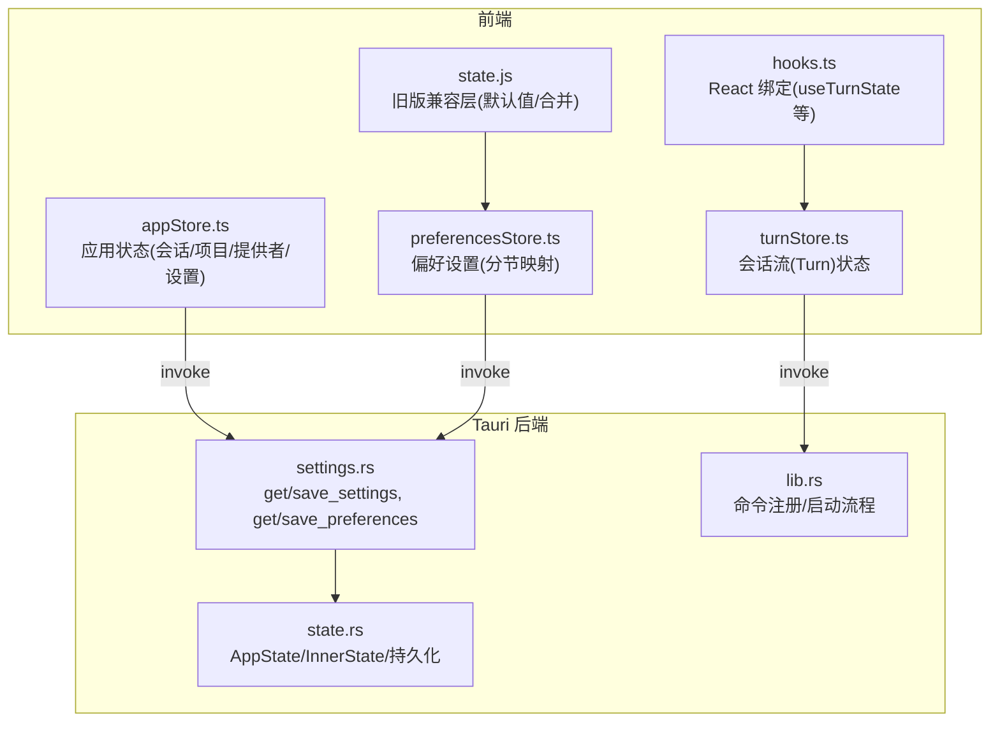
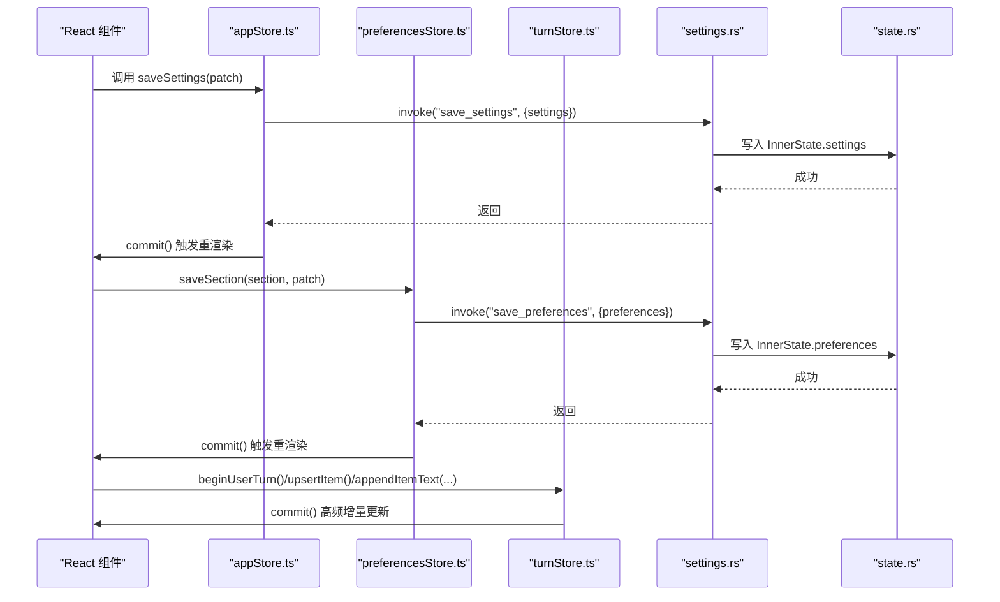
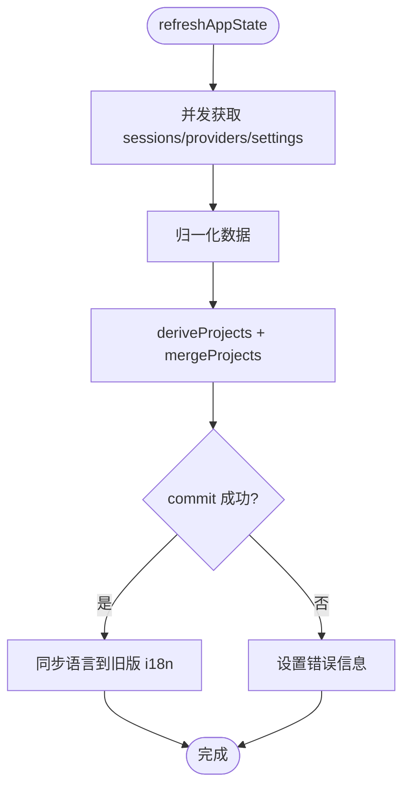
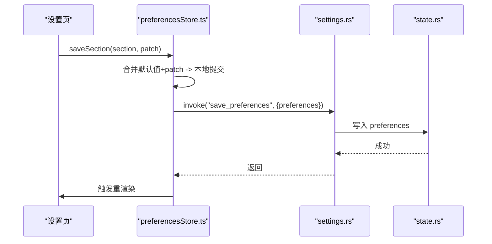
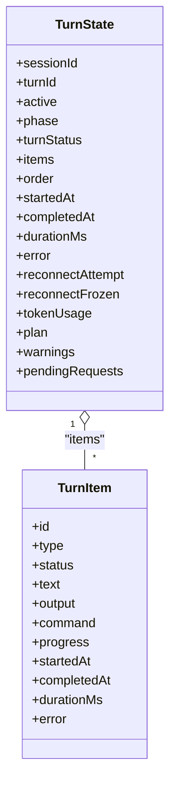
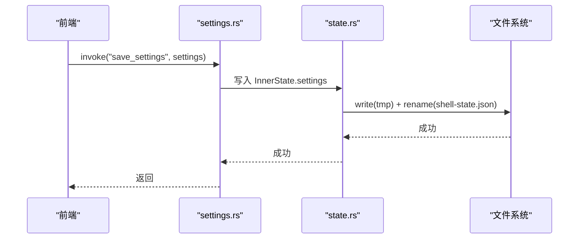
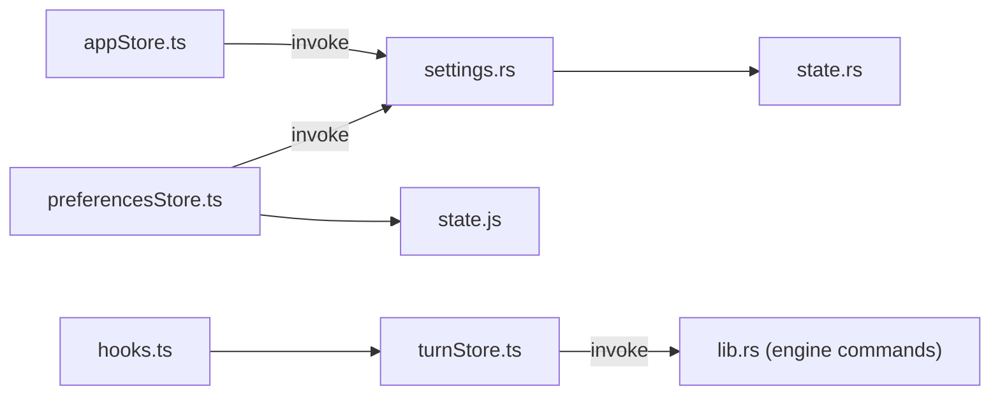

# 状态管理

<cite>
**本文引用的文件**
- [appStore.ts](file://frontend/app/state/appStore.ts)
- [preferencesStore.ts](file://frontend/app/state/preferencesStore.ts)
- [hooks.ts](file://frontend/app/state/hooks.ts)
- [turnStore.ts](file://frontend/app/state/turnStore.ts)
- [types.ts](file://frontend/app/state/types.ts)
- [state.js](file://frontend/src/js/state.js)
- [settings.rs](file://src-tauri/src/commands/settings.rs)
- [state.rs](file://src-tauri/src/state.rs)
- [lib.rs](file://src-tauri/src/lib.rs)
</cite>

## 目录
1. [简介](#简介)
2. [项目结构](#项目结构)
3. [核心组件](#核心组件)
4. [架构总览](#架构总览)
5. [详细组件分析](#详细组件分析)
6. [依赖关系分析](#依赖关系分析)
7. [性能与内存管理](#性能与内存管理)
8. [故障排查指南](#故障排查指南)
9. [结论](#结论)
10. [附录：最佳实践与示例](#附录最佳实践与示例)

## 简介
本文件系统化说明 Codex-Tauri 的状态管理方案，覆盖应用状态、偏好设置持久化、会话（Turn）状态管理与数据同步机制。重点解释 React Hook 的使用模式、Rust 后端状态存储、前后端一致性保证、设置项分类与默认值、迁移策略、变更监听、性能优化、内存管理与备份恢复，并提供可操作的最佳实践与示例路径。

## 项目结构
前端采用“外部 Store + useSyncExternalStore”的模式，将高频或全局状态置于 React 之外，通过订阅/快照机制与 UI 解耦；Rust 侧以 Tauri State 集中管理本地持久化数据（shell-state.json），并通过命令暴露给前端。

图表来源
- [appStore.ts:1-150](file://frontend/app/state/appStore.ts#L1-L150)
- [preferencesStore.ts:1-94](file://frontend/app/state/preferencesStore.ts#L1-L94)
- [turnStore.ts:1-120](file://frontend/app/state/turnStore.ts#L1-L120)
- [hooks.ts:1-43](file://frontend/app/state/hooks.ts#L1-L43)
- [state.js:1-136](file://frontend/src/js/state.js#L1-L136)
- [settings.rs:1-69](file://src-tauri/src/commands/settings.rs#L1-L69)
- [state.rs:150-232](file://src-tauri/src/state.rs#L150-L232)
- [lib.rs:71-148](file://src-tauri/src/lib.rs#L71-L148)

章节来源
- [appStore.ts:1-150](file://frontend/app/state/appStore.ts#L1-L150)
- [preferencesStore.ts:1-94](file://frontend/app/state/preferencesStore.ts#L1-L94)
- [turnStore.ts:1-120](file://frontend/app/state/turnStore.ts#L1-L120)
- [hooks.ts:1-43](file://frontend/app/state/hooks.ts#L1-L43)
- [state.js:1-136](file://frontend/src/js/state.js#L1-L136)
- [settings.rs:1-69](file://src-tauri/src/commands/settings.rs#L1-L69)
- [state.rs:150-232](file://src-tauri/src/state.rs#L150-L232)
- [lib.rs:71-148](file://src-tauri/src/lib.rs#L71-L148)

## 核心组件
- 应用状态 Store（appStore.ts）
  - 维护会话、项目、提供者、引擎状态、Shell 设置等。
  - 使用 useSyncExternalStore 暴露给 React，避免上下文传递。
  - 提供刷新、保存设置、选择项目/会话等操作。
- 偏好设置 Store（preferencesStore.ts）
  - 按分节（appearance、voice、browser、git 等）组织，统一合并默认值并持久化。
  - 支持读取单个分节、保存整张偏好表。
- 会话流 Store（turnStore.ts）
  - 单一事实源，承载当前 Turn 的完整状态（消息、工具调用、计划、警告、令牌用量等）。
  - 高频率增量更新通过 appendItemText/appendItemOutput 等 API 高效推进。
- React 绑定（hooks.ts）
  - 基于 turnStore 的订阅封装，提供 useTurnState/useTurnSelector/useTurnItems 等 Hook。
- 旧版兼容层（state.js）
  - 提供 defaultPreferences/mergePreferences/defaultSettings 等，作为默认值与合并逻辑的唯一来源，确保新旧层不漂移。
- Rust 后端（state.rs + settings.rs + lib.rs）
  - AppState/InnerState 集中管理 Settings、Preferences、Pets、Calendar、Cinema、Connectors、Shortcuts、ScheduledTasks、PullRequests、Provider Secrets/Protocols/Endpoints。
  - 通过 Tauri 命令暴露 get/save_settings、get/save_preferences 等能力，落盘到 shell-state.json。
  - 启动时加载/初始化默认值，并在关闭时优雅停止 sidecar。

章节来源
- [appStore.ts:98-155](file://frontend/app/state/appStore.ts#L98-L155)
- [preferencesStore.ts:17-94](file://frontend/app/state/preferencesStore.ts#L17-L94)
- [turnStore.ts:28-120](file://frontend/app/state/turnStore.ts#L28-L120)
- [hooks.ts:17-43](file://frontend/app/state/hooks.ts#L17-L43)
- [state.js:33-136](file://frontend/src/js/state.js#L33-L136)
- [state.rs:27-174](file://src-tauri/src/state.rs#L27-L174)
- [settings.rs:8-69](file://src-tauri/src/commands/settings.rs#L8-L69)
- [lib.rs:23-69](file://src-tauri/src/lib.rs#L23-L69)

## 架构总览
前后端通过 Tauri invoke 进行 RPC 通信，前端 Store 负责状态聚合与渲染，Rust 侧负责持久化与系统级资源协调。

图表来源
- [appStore.ts:446-511](file://frontend/app/state/appStore.ts#L446-L511)
- [preferencesStore.ts:76-88](file://frontend/app/state/preferencesStore.ts#L76-L88)
- [turnStore.ts:118-176](file://frontend/app/state/turnStore.ts#L118-L176)
- [settings.rs:18-52](file://src-tauri/src/commands/settings.rs#L18-L52)
- [state.rs:176-232](file://src-tauri/src/state.rs#L176-L232)

## 详细组件分析

### 应用状态 Store（appStore.ts）
- 职责
  - 管理会话列表、派生项目列表、提供者信息、引擎状态、Shell 设置。
  - 提供刷新、保存设置、打开项目目录、选择活跃项目/会话等能力。
- 关键设计
  - 使用 useSyncExternalStore 暴露全局快照，避免 Context 开销。
  - normaliseSessions/normaliseProviders/normaliseSettings 对后端数据进行容错解析。
  - deriveProjects 从会话 cwd 派生项目，extraProjects 保留未关联会话的临时项目。
  - saveSettings 同时写 Shell 配置与引擎配置（config/batchWrite），保证两端一致。
- 数据流
  - refreshAppState 并发拉取 sessions/providers/settings，归一化后提交。
  - setActiveProject 会同时更新 activeProjectPath 并尝试持久化。
- 错误处理
  - 网络/引擎离线时记录错误但不阻断 UI 更新；engine config 写入失败仅告警。

图表来源
- [appStore.ts:378-408](file://frontend/app/state/appStore.ts#L378-L408)
- [appStore.ts:169-236](file://frontend/app/state/appStore.ts#L169-L236)
- [appStore.ts:410-433](file://frontend/app/state/appStore.ts#L410-L433)

章节来源
- [appStore.ts:98-155](file://frontend/app/state/appStore.ts#L98-L155)
- [appStore.ts:249-376](file://frontend/app/state/appStore.ts#L249-L376)
- [appStore.ts:378-511](file://frontend/app/state/appStore.ts#L378-L511)

### 偏好设置 Store（preferencesStore.ts）
- 职责
  - 按分节组织偏好（appearance、voice、browser、git、worktrees、environments 等）。
  - 统一合并默认值，持久化整张偏好表。
- 关键设计
  - 默认值与合并逻辑来自 state.js，确保新旧层一致。
  - loadPreferences 幂等加载，失败回退到默认值。
  - saveSection 先本地提交再持久化，便于即时反馈。
- 事件
  - emitShellEvent 用于跨模块通知（如宠物、外观变化）。

图表来源
- [preferencesStore.ts:59-88](file://frontend/app/state/preferencesStore.ts#L59-L88)
- [settings.rs:35-52](file://src-tauri/src/commands/settings.rs#L35-L52)
- [state.rs:150-232](file://src-tauri/src/state.rs#L150-L232)

章节来源
- [preferencesStore.ts:17-94](file://frontend/app/state/preferencesStore.ts#L17-L94)
- [state.js:60-136](file://frontend/src/js/state.js#L60-L136)

### 会话流 Store（turnStore.ts）
- 职责
  - 维护当前 Turn 的完整状态：消息、工具输出、计划、警告、令牌用量、待审批请求等。
  - 提供开始/结束 Turn、追加文本/输出、完成项、设置阶段、重置等能力。
- 关键设计
  - 使用 items + order 双结构，O(1) 查找与稳定渲染顺序。
  - beginTurn 在切换线程时才清空历史，避免误删。
  - beginUserTurn 乐观插入用户消息，失败可回滚。
  - appendItemText/appendItemOutput 支持高频增量拼接。
  - loadThreadFromSession 从会话与时间线重建历史。
- 类型定义
  - types.ts 定义了 TurnItem/TurnState/TokenUsage/PlanStep/ServerWarning/PendingRequest 等。

图表来源
- [types.ts:11-146](file://frontend/app/state/types.ts#L11-L146)
- [turnStore.ts:28-120](file://frontend/app/state/turnStore.ts#L28-L120)

章节来源
- [turnStore.ts:53-285](file://frontend/app/state/turnStore.ts#L53-L285)
- [turnStore.ts:321-467](file://frontend/app/state/turnStore.ts#L321-L467)
- [types.ts:11-146](file://frontend/app/state/types.ts#L11-L146)

### React Hook 绑定（hooks.ts）
- 提供 useTurnState/useTurnSelector/useTurnItems/useTurnActive/usePendingRequests 等 Hook。
- 通过 subscribe/getSnapshot 与 turnStore 解耦，适合高频流式更新场景。

章节来源
- [hooks.ts:17-43](file://frontend/app/state/hooks.ts#L17-L43)
- [turnStore.ts:40-49](file://frontend/app/state/turnStore.ts#L40-L49)

### Rust 后端状态存储（state.rs + settings.rs + lib.rs）
- 数据结构
  - Settings：主题、语言、活动模型/提供者、终端、审批策略、沙箱等。
  - Preferences：pets_enabled、reduced_motion、compact_mode 及 extra 扩展段。
  - 其他：Pet、CalendarEvent、CinemaTimeline/Job、Connector、Shortcut、ScheduledTask、PullRequests。
- 生命周期
  - load_or_default：从 shell-state.json 加载，缺失则填充默认值（如语言 zh-CN、监听地址等）。
  - save：原子写入（先写 tmp 再 rename）。
  - snapshot：导出只读快照供前端查询。
- 命令
  - get_settings/save_settings：读写 Settings，并联动 AdapterState 激活 Provider。
  - get_preferences/save_preferences：读写 Preferences。
  - list_shortcuts/save_shortcuts：快捷键管理。
- 启动流程
  - 初始化日志、插件、菜单、状态、协议适配器、Sidecar、事件桥接，注册所有命令。

图表来源
- [settings.rs:18-33](file://src-tauri/src/commands/settings.rs#L18-L33)
- [state.rs:176-217](file://src-tauri/src/state.rs#L176-L217)

章节来源
- [state.rs:27-174](file://src-tauri/src/state.rs#L27-L174)
- [state.rs:176-232](file://src-tauri/src/state.rs#L176-L232)
- [settings.rs:1-69](file://src-tauri/src/commands/settings.rs#L1-L69)
- [lib.rs:23-69](file://src-tauri/src/lib.rs#L23-L69)

## 依赖关系分析
- 前端内部依赖
  - appStore 依赖 invoke 调用后端命令，依赖 state.js 的 i18n 更新。
  - preferencesStore 依赖 state.js 的默认值与合并逻辑。
  - hooks 依赖 turnStore 的订阅接口。
  - turnStore 依赖 types 的类型定义。
- 前后端契约
  - 命令名：get_settings/save_settings、get_preferences/save_preferences、rpc_raw(config/batchWrite) 等。
  - 字段命名：前端 camelCase 与后端 snake_case 双向兼容（normaliseSettings）。
- 耦合与内聚
  - Store 之间低耦合，通过命令与事件交互；Rust 侧通过 Mutex 保护共享状态，内聚良好。
- 潜在循环依赖
  - 无直接循环；事件桥接由 lib.rs 统一管理。

图表来源
- [appStore.ts:446-511](file://frontend/app/state/appStore.ts#L446-L511)
- [preferencesStore.ts:76-88](file://frontend/app/state/preferencesStore.ts#L76-L88)
- [turnStore.ts:321-467](file://frontend/app/state/turnStore.ts#L321-L467)
- [settings.rs:1-69](file://src-tauri/src/commands/settings.rs#L1-L69)
- [state.rs:150-232](file://src-tauri/src/state.rs#L150-L232)
- [lib.rs:71-148](file://src-tauri/src/lib.rs#L71-L148)

章节来源
- [appStore.ts:446-511](file://frontend/app/state/appStore.ts#L446-L511)
- [preferencesStore.ts:76-88](file://frontend/app/state/preferencesStore.ts#L76-L88)
- [turnStore.ts:321-467](file://frontend/app/state/turnStore.ts#L321-L467)
- [settings.rs:1-69](file://src-tauri/src/commands/settings.rs#L1-L69)
- [state.rs:150-232](file://src-tauri/src/state.rs#L150-L232)
- [lib.rs:71-148](file://src-tauri/src/lib.rs#L71-L148)

## 性能与内存管理
- 使用 useSyncExternalStore
  - 将 Store 置于 React 外部，避免 Context 与 prop drilling 带来的重渲染成本。
  - 高频流（turnStore）通过增量更新减少对象创建与比较开销。
- 数据归一化与派生
  - deriveProjects 从会话派生项目，避免重复计算；mergeProjects 去重合并。
- 批量写入与重试
  - saveSettings 将引擎配置通过 batchWrite 一次性下发，降低往返次数。
  - 引擎离线时仅告警，不阻塞 UI。
- 内存管理建议
  - 定期清理 turnStore 中已完成且不再展示的历史项（可按会话/时间窗口）。
  - 大对象（如长文本）考虑分页或虚拟滚动。
  - 谨慎持有全局引用，避免闭包泄漏。
- 性能优化建议
  - 使用 useTurnSelector 精确选择子集，减少无关重渲染。
  - 合并多次小更新为一次 commit。
  - 对频繁 I/O（如保存偏好）做节流/防抖。

[本节为通用指导，无需特定文件来源]

## 故障排查指南
- 常见问题定位
  - 设置未持久化：检查 save_settings/save_preferences 是否成功返回；查看 Rust 侧 save_ok 错误。
  - 引擎配置未生效：确认 batchWrite 调用是否成功；若引擎离线，需等待连接恢复。
  - 偏好分节丢失：确认 mergePreferences 是否正确合并默认值；检查 Rust 侧 Preferences.extra 是否被正确序列化。
  - 会话历史为空：检查 loadThreadFromSession 的 get_session/get_runtime_events 返回值结构。
- 日志与调试
  - 前端：console.warn/error 已记录关键失败点（如 saveSettings、loadPreferences）。
  - 后端：tracing_subscriber 已启用，可通过环境变量调整日志级别。
- 恢复策略
  - 重启应用会从 shell-state.json 恢复状态；若损坏，将回退到默认值。
  - 重要配置建议定期备份 shell-state.json。

章节来源
- [appStore.ts:446-511](file://frontend/app/state/appStore.ts#L446-L511)
- [preferencesStore.ts:59-88](file://frontend/app/state/preferencesStore.ts#L59-L88)
- [turnStore.ts:321-467](file://frontend/app/state/turnStore.ts#L321-L467)
- [settings.rs:18-52](file://src-tauri/src/commands/settings.rs#L18-L52)
- [state.rs:176-217](file://src-tauri/src/state.rs#L176-L217)
- [lib.rs:8-14](file://src-tauri/src/lib.rs#L8-L14)

## 结论
Codex-Tauri 的状态管理以“前端外部 Store + useSyncExternalStore”为核心，结合 Rust 侧集中化的 AppState 与持久化，实现了高性能、可扩展、易维护的前后端状态一致性。通过统一的默认值与合并策略、严格的类型定义与归一化逻辑，以及健壮的异常处理与恢复机制，保障了用户体验与数据可靠性。

[本节为总结性内容，无需特定文件来源]

## 附录：最佳实践与示例

- 设置项分类与默认值管理
  - 将设置分为 Shell 设置（appStore.SettingsState）与偏好设置（preferencesStore.PrefSection），默认值集中在 state.js，避免漂移。
  - 新增设置项时，优先添加到对应默认值函数，并在 normaliseSettings 中兼容新旧键名。
- 验证规则与迁移策略
  - 前端在提交前进行基本校验（非空、枚举值），后端通过 serde 默认值兜底。
  - 迁移策略：通过 mergePreferences/mergeSettings 逐步覆盖旧值，保持向后兼容。
- 状态变更监听
  - 使用 useSyncExternalStore 的 subscribe 机制监听 Store 变化，避免不必要的重渲染。
  - 对于跨模块通知，可使用 emitShellEvent 派发 CustomEvent。
- 数据同步机制
  - 设置变更：先本地 commit，再异步持久化；引擎配置通过 batchWrite 批量下发。
  - 会话状态：严格以服务端通知为准，本地只做乐观更新与回滚。
- 具体操作示例（路径参考）
  - 刷新应用状态：[refreshAppState:378-408](file://frontend/app/state/appStore.ts#L378-L408)
  - 保存设置：[saveSettings:446-511](file://frontend/app/state/appStore.ts#L446-L511)
  - 保存偏好分节：[saveSection:76-88](file://frontend/app/state/preferencesStore.ts#L76-L88)
  - 开始/结束会话：[beginTurn/finishTurn:71-107](file://frontend/app/state/turnStore.ts#L71-L107)
  - 追加流式文本：[appendItemText:159-176](file://frontend/app/state/turnStore.ts#L159-L176)
  - 加载会话历史：[loadThreadFromSession:321-467](file://frontend/app/state/turnStore.ts#L321-L467)
  - 后端持久化：[save:209-217](file://src-tauri/src/state.rs#L209-L217)

[本节为实践指导，无需特定文件来源]