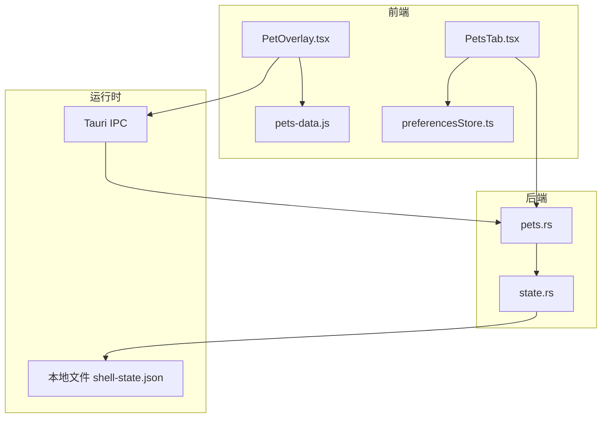
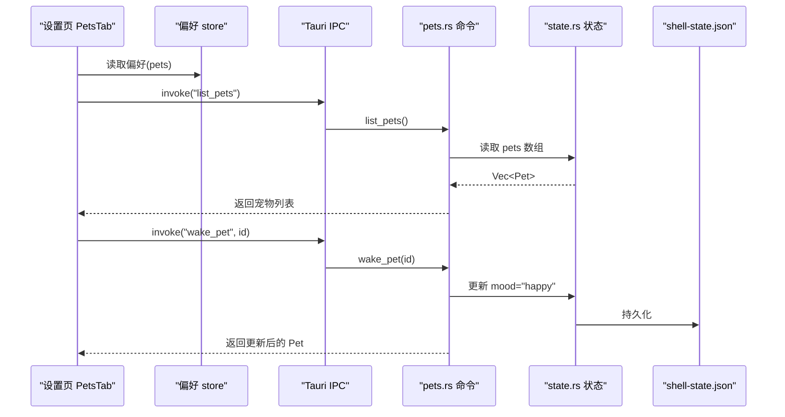
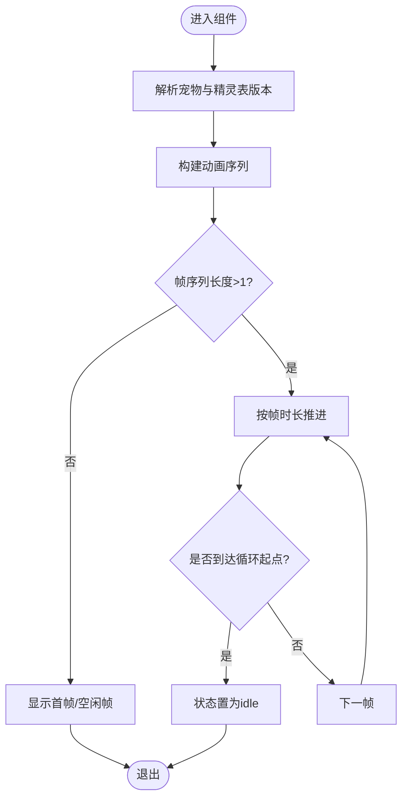
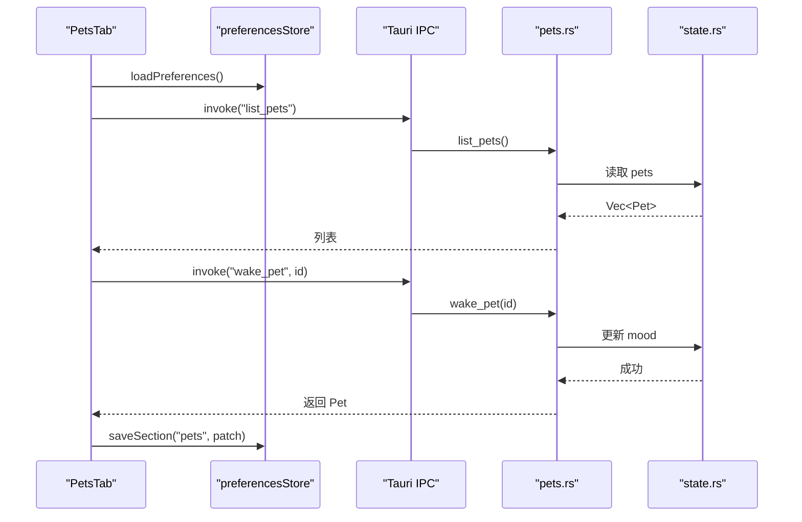
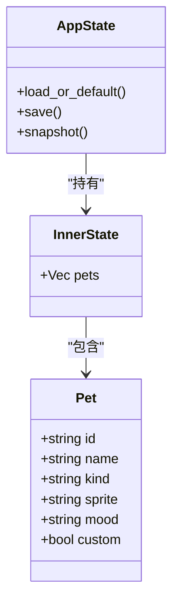
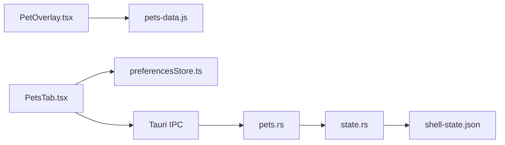

# 宠物系统

<cite>
**本文引用的文件**
- [PetOverlay.tsx](file://frontend/app/pet/PetOverlay.tsx)
- [pets-data.js](file://frontend/src/js/pets-data.js)
- [PetsTab.tsx](file://frontend/app/views/settings/tabs/PetsTab.tsx)
- [preferencesStore.ts](file://frontend/app/state/preferencesStore.ts)
- [pets.rs](file://src-tauri/src/commands/pets.rs)
- [state.rs](file://src-tauri/src/state.rs)
- [tauri-core.ts](file://frontend/app/devbridge/tauri-core.ts)
- [eventBus.ts](file://frontend/app/devbridge/eventBus.ts)
- [vite.config.ts](file://frontend/vite.config.ts)
- [pets.txt](file://docs/uia/outlines-t41/pets.txt)
</cite>

## 目录
1. [简介](#简介)
2. [项目结构](#项目结构)
3. [核心组件](#核心组件)
4. [架构总览](#架构总览)
5. [详细组件分析](#详细组件分析)
6. [依赖关系分析](#依赖关系分析)
7. [性能考虑](#性能考虑)
8. [故障排查指南](#故障排查指南)
9. [结论](#结论)
10. [附录：使用示例与扩展指南](#附录使用示例与扩展指南)

## 简介
本文件为 Codex-Tauri 的“宠物系统”提供完整技术文档。内容覆盖宠物的生命周期管理、动画效果控制、用户交互处理、状态同步机制；阐述前后端通信协议、资源管理与内存优化；解释显示逻辑、事件响应、配置选项与自定义能力；并给出性能考量、跨平台兼容性与用户体验优化建议，以及使用示例和开发新宠物类型的指南。

## 项目结构
宠物系统由前端渲染层（React + 精灵图数据）、设置页（选择与预览）、后端持久化（Tauri 命令与状态存储）三部分构成。关键路径如下：
- 前端渲染：PetOverlay 负责帧时钟、拖拽、方向注视、动画序列播放
- 数据与动画定义：pets-data.js 维护精灵表规格、动作帧、方向映射、内置宠物清单与资源 URL 解析
- 设置与选择：PetsTab 负责加载偏好、合并官方与自定义宠物列表、触发唤醒/创建等后端操作
- 偏好与状态：preferencesStore 统一读写偏好；state.rs 中的 Pet 结构与 AppState 持久化 pets 集合
- 后端命令：pets.rs 暴露 list/save/wake/tuck/create_custom_pet 等 Tauri 命令
- 开发桥接：浏览器模式下通过 tauri-core.ts 与 eventBus.ts 模拟 invoke/listen，便于无 Rust 环境调试

图表来源
- [PetOverlay.tsx:1-217](file://frontend/app/pet/PetOverlay.tsx#L1-L217)
- [pets-data.js:1-259](file://frontend/src/js/pets-data.js#L1-L259)
- [PetsTab.tsx:1-274](file://frontend/app/views/settings/tabs/PetsTab.tsx#L1-L274)
- [preferencesStore.ts:1-94](file://frontend/app/state/preferencesStore.ts#L1-L94)
- [pets.rs:1-66](file://src-tauri/src/commands/pets.rs#L1-L66)
- [state.rs:1-331](file://src-tauri/src/state.rs#L1-L331)

章节来源
- [PetOverlay.tsx:1-217](file://frontend/app/pet/PetOverlay.tsx#L1-L217)
- [pets-data.js:1-259](file://frontend/src/js/pets-data.js#L1-L259)
- [PetsTab.tsx:1-274](file://frontend/app/views/settings/tabs/PetsTab.tsx#L1-L274)
- [preferencesStore.ts:1-94](file://frontend/app/state/preferencesStore.ts#L1-L94)
- [pets.rs:1-66](file://src-tauri/src/commands/pets.rs#L1-L66)
- [state.rs:1-331](file://src-tauri/src/state.rs#L1-L331)

## 核心组件
- 精灵图与动画数据（pets-data.js）
  - 定义精灵表版本、行列数、单元格尺寸、每行动画帧数
  - 构建空闲循环、各动作帧序列、一次性动作三遍后回退到空闲
  - 计算指针方向对应的注视帧（16 方向），将帧坐标转为背景定位
  - 内置宠物清单与资源 URL 解析（支持 assetRef/sheet/thumb/url）
- 悬浮宠物渲染（PetOverlay.tsx）
  - 帧时钟：根据序列逐帧推进，支持循环起点与减少动效模式
  - 交互：拖拽（指针捕获、视口边界限制）、悬停/双击触发跳跃、方向注视
  - 显示：按精灵表行列计算背景大小与位置，像素化渲染
- 设置页与选择（PetsTab.tsx）
  - 从后端获取宠物列表，合并官方与自定义宠物
  - 保存偏好（active/selected/asleep/size），调用 wake_pet/create_custom_pet
  - 实时预览当前选中宠物的动画
- 偏好与状态（preferencesStore.ts, state.rs）
  - preferencesStore 提供统一的偏好读取/写入与订阅
  - state.rs 定义 Pet 结构、AppState 持久化 pets 数组至本地 JSON

章节来源
- [pets-data.js:20-149](file://frontend/src/js/pets-data.js#L20-L149)
- [pets-data.js:149-259](file://frontend/src/js/pets-data.js#L149-L259)
- [PetOverlay.tsx:56-114](file://frontend/app/pet/PetOverlay.tsx#L56-L114)
- [PetOverlay.tsx:123-183](file://frontend/app/pet/PetOverlay.tsx#L123-L183)
- [PetOverlay.tsx:183-217](file://frontend/app/pet/PetOverlay.tsx#L183-L217)
- [PetsTab.tsx:70-145](file://frontend/app/views/settings/tabs/PetsTab.tsx#L70-L145)
- [PetsTab.tsx:154-187](file://frontend/app/views/settings/tabs/PetsTab.tsx#L154-L187)
- [preferencesStore.ts:55-88](file://frontend/app/state/preferencesStore.ts#L55-L88)
- [state.rs:66-77](file://src-tauri/src/state.rs#L66-L77)
- [state.rs:150-231](file://src-tauri/src/state.rs#L150-L231)

## 架构总览
宠物系统采用“前端渲染 + 后端状态”的分层架构。前端负责动画与交互，后端负责持久化与元数据。两者通过 Tauri IPC 通信，在浏览器开发模式下通过 devbridge 代理实现等价行为。

图表来源
- [PetsTab.tsx:106-168](file://frontend/app/views/settings/tabs/PetsTab.tsx#L106-L168)
- [pets.rs:4-28](file://src-tauri/src/commands/pets.rs#L4-L28)
- [state.rs:176-217](file://src-tauri/src/state.rs#L176-L217)

## 详细组件分析

### 精灵图与动画数据（pets-data.js）
- 精灵表规格：支持 v1/v2 两种规格，包含宽高、单元格尺寸、列数、行数及每行所需帧数
- 动作序列：每个动作对应一行帧，末帧停留时间更长；空闲帧以倍数拉伸形成连续循环
- 一次性动作：播放三次后自动回到空闲循环，减少动效时锁定首帧
- 方向注视：基于指针相对中心的角度映射到 16 个方向，返回对应行列索引
- 资源解析：优先使用显式 thumb/url，其次匹配 assetRef/id 到内置资源

复杂度与优化
- 帧序列构建为 O(n)，n 为动作帧数；空闲循环放大因子固定
- 方向注视计算为常数时间
- 资源 URL 解析为 O(1) 哈希查找

章节来源
- [pets-data.js:20-43](file://frontend/src/js/pets-data.js#L20-L43)
- [pets-data.js:53-112](file://frontend/src/js/pets-data.js#L53-L112)
- [pets-data.js:114-147](file://frontend/src/js/pets-data.js#L114-L147)
- [pets-data.js:149-259](file://frontend/src/js/pets-data.js#L149-L259)

### 悬浮宠物渲染（PetOverlay.tsx）
- 帧时钟：根据序列 frames 与 loopStartIndex 推进，到达循环起点时重置状态为 idle
- 交互：
  - 拖拽：记录初始偏移，移动时计算 left/top 并限制在视口内
  - 方向注视：监听 pointermove，计算注视帧并保持一段时间
  - 悬停/双击：触发 jumping 动作
- 显示：根据精灵表行列计算 backgroundSize/backgroundPosition，imageRendering 设为 pixelated 保持像素风格

性能要点
- 使用 setTimeout 驱动帧时钟，避免阻塞主线程
- reduceMotion 时仅展示首帧，降低重绘
- 拖拽使用 Pointer Capture 提升移动端体验

图表来源
- [PetOverlay.tsx:62-114](file://frontend/app/pet/PetOverlay.tsx#L62-L114)
- [PetOverlay.tsx:123-164](file://frontend/app/pet/PetOverlay.tsx#L123-L164)
- [PetOverlay.tsx:166-217](file://frontend/app/pet/PetOverlay.tsx#L166-L217)

章节来源
- [PetOverlay.tsx:56-114](file://frontend/app/pet/PetOverlay.tsx#L56-L114)
- [PetOverlay.tsx:123-183](file://frontend/app/pet/PetOverlay.tsx#L123-L183)
- [PetOverlay.tsx:183-217](file://frontend/app/pet/PetOverlay.tsx#L183-L217)

### 设置页与选择（PetsTab.tsx）
- 合并目录：官方宠物 + 后端自定义宠物（去重）
- 偏好保存：先本地提交再持久化，保证即时反馈
- 后端交互：
  - list_pets：拉取后端宠物列表
  - wake_pet：唤醒选中宠物（mood 置为 happy）
  - create_custom_pet：创建自定义宠物（id 自动生成，custom=true）
- 预览：嵌入 PetOverlay 实时展示当前选中宠物

图表来源
- [PetsTab.tsx:106-187](file://frontend/app/views/settings/tabs/PetsTab.tsx#L106-L187)
- [pets.rs:4-28](file://src-tauri/src/commands/pets.rs#L4-L28)
- [preferencesStore.ts:55-88](file://frontend/app/state/preferencesStore.ts#L55-L88)

章节来源
- [PetsTab.tsx:70-187](file://frontend/app/views/settings/tabs/PetsTab.tsx#L70-L187)
- [preferencesStore.ts:55-88](file://frontend/app/state/preferencesStore.ts#L55-L88)

### 后端状态与持久化（state.rs, pets.rs）
- Pet 结构：id/name/kind/sprite/mood/custom
- AppState：持有 pets 数组，提供 load_or_default/save/snapshot
- 命令：
  - list_pets：返回 pets 副本
  - save_pets：替换 pets 并持久化
  - wake_pet/tuck_pet：修改指定 pet 的 mood 并持久化
  - create_custom_pet：生成新 pet 并持久化

图表来源
- [state.rs:66-77](file://src-tauri/src/state.rs#L66-L77)
- [state.rs:150-231](file://src-tauri/src/state.rs#L150-L231)
- [pets.rs:4-66](file://src-tauri/src/commands/pets.rs#L4-L66)

章节来源
- [state.rs:66-77](file://src-tauri/src/state.rs#L66-L77)
- [state.rs:150-231](file://src-tauri/src/state.rs#L150-L231)
- [pets.rs:4-66](file://src-tauri/src/commands/pets.rs#L4-L66)

### 前后端通信与开发桥接
- 生产环境：前端通过 @tauri-apps/api/core.invoke 调用 Rust 命令
- 浏览器开发模式：通过 vite alias 将 @tauri-apps/api/core 指向 app/devbridge/tauri-core.ts，内部转发到 commands 表，配合 eventBus 模拟 listen/emit
- 优势：无需编译 Rust，即可在浏览器中调试完整的前后端流程

章节来源
- [tauri-core.ts:1-23](file://frontend/app/devbridge/tauri-core.ts#L1-L23)
- [eventBus.ts:1-46](file://frontend/app/devbridge/eventBus.ts#L1-L46)
- [vite.config.ts:59-103](file://frontend/vite.config.ts#L59-L103)

## 依赖关系分析
- 组件耦合
  - PetOverlay 强依赖 pets-data.js 的动画与资源解析
  - PetsTab 依赖 preferencesStore 与 Tauri IPC 命令
  - 后端命令依赖 state.rs 的状态与持久化
- 外部依赖
  - Tauri IPC（invoke/listen）
  - 文件系统（shell-state.json）
  - 浏览器 API（Pointer Events、setTimeout）

图表来源
- [PetOverlay.tsx:16-26](file://frontend/app/pet/PetOverlay.tsx#L16-L26)
- [PetsTab.tsx:10-20](file://frontend/app/views/settings/tabs/PetsTab.tsx#L10-L20)
- [pets.rs:1-66](file://src-tauri/src/commands/pets.rs#L1-L66)
- [state.rs:176-217](file://src-tauri/src/state.rs#L176-L217)

章节来源
- [PetOverlay.tsx:16-26](file://frontend/app/pet/PetOverlay.tsx#L16-L26)
- [PetsTab.tsx:10-20](file://frontend/app/views/settings/tabs/PetsTab.tsx#L10-L20)
- [pets.rs:1-66](file://src-tauri/src/commands/pets.rs#L1-L66)
- [state.rs:176-217](file://src-tauri/src/state.rs#L176-L217)

## 性能考虑
- 动画性能
  - 使用 setTimeout 驱动帧时钟，避免 requestAnimationFrame 带来的额外开销
  - reduceMotion 模式仅展示首帧，显著降低重绘
  - 精灵图背景定位使用百分比，减少布局抖动
- 资源管理
  - 精灵表尺寸较大，按需加载；URL 解析缓存于模块级常量
  - 图片渲染使用 imageRendering: pixelated，确保清晰度与性能平衡
- 交互性能
  - 拖拽使用 Pointer Capture，减少事件冒泡与丢失
  - 方向注视仅在版本 v2 启用，避免旧版无效计算
- 持久化
  - 写盘采用临时文件 + rename 原子替换，避免损坏
  - 批量保存偏好，减少 IO 次数

[本节为通用性能指导，不直接分析具体代码]

## 故障排查指南
- 宠物未显示
  - 检查 preferences.pets.active/selected 是否为空
  - 确认 petSheetUrl 能解析到有效资源（assetRef/sheet/thumb/url）
  - 若 asleep=true，则不会渲染
- 动画不播放
  - 检查 reduceMotion 是否开启
  - 确认 buildPetSequence 返回的 frames 非空且 loopStartIndex 正确
- 拖拽异常
  - 确认 pointermove/pointerup 事件已绑定与清理
  - 检查视口边界计算是否正确
- 状态不同步
  - 确认 wake_pet/tuck_pet 调用成功并持久化
  - 刷新列表后确认 mood 已更新
- 浏览器模式无法调用命令
  - 确认 vite 模式为 browser，alias 生效
  - 检查 devbridge 的 commands 表是否注册了对应命令

章节来源
- [PetOverlay.tsx:176-217](file://frontend/app/pet/PetOverlay.tsx#L176-L217)
- [pets-data.js:231-259](file://frontend/src/js/pets-data.js#L231-L259)
- [pets.rs:4-66](file://src-tauri/src/commands/pets.rs#L4-L66)
- [tauri-core.ts:1-23](file://frontend/app/devbridge/tauri-core.ts#L1-L23)

## 结论
宠物系统通过清晰的前后端分层、稳定的动画数据模型与健壮的 IPC 通信，实现了可定制、可交互、可持久化的桌面宠物功能。其设计兼顾了性能与可维护性，并提供浏览器开发模式以提升迭代效率。未来可在自定义宠物类型、更多动作与主题方面进一步扩展。

[本节为总结性内容，不直接分析具体代码]

## 附录：使用示例与扩展指南

### 使用示例
- 在设置页选择并显示宠物
  - 打开“宠物”设置页，点击某个宠物卡片以激活
  - 页面会调用 wake_pet 并将 active/selected/asleep 保存到偏好
  - 预览区将实时显示该宠物的动画
- 创建自定义宠物
  - 点击“创建虚拟宠物”，输入名称后调用 create_custom_pet
  - 新宠物默认 mood=idle，custom=true，可后续通过 sprite 字段设置资源
- 调整大小与睡眠
  - 通过偏好 pets.size 控制显示尺寸（范围受组件约束）
  - 设置 pets.asleep=true 隐藏宠物

章节来源
- [PetsTab.tsx:154-187](file://frontend/app/views/settings/tabs/PetsTab.tsx#L154-L187)
- [PetOverlay.tsx:30-39](file://frontend/app/pet/PetOverlay.tsx#L30-L39)
- [PetOverlay.tsx:176-183](file://frontend/app/pet/PetOverlay.tsx#L176-L183)

### 开发新宠物类型
- 添加内置宠物
  - 在 pets-data.js 的 OFFICIAL_PETS 中添加条目，指定 id、displayName、description、spriteVersionNumber、sheet
  - 确保 assets/pets 下存在对应精灵图资源，并在构建产物中保留哈希后缀
- 使用自定义精灵图
  - 在 Pet 对象上设置 sprite 或 spritesheetUrl/thumbs，petSheetUrl 将优先使用这些字段
  - 支持 http(s) 与 data: 协议的 URL
- 适配新精灵表版本
  - 在 PET_SHEETS 中新增版本，定义 width/height/cellWidth/cellHeight/columns/rows/requiredFramesByRow
  - 更新 DEFAULT_SPRITE_VERSION 或各宠物的 spriteVersionNumber
- 扩展动作与方向
  - 在 PET_ACTIONS 中添加新动作帧序列
  - 如需更多方向，需扩展 lookFrameFromPointer 的计算逻辑与精灵表行

章节来源
- [pets-data.js:20-43](file://frontend/src/js/pets-data.js#L20-L43)
- [pets-data.js:83-112](file://frontend/src/js/pets-data.js#L83-L112)
- [pets-data.js:114-147](file://frontend/src/js/pets-data.js#L114-L147)
- [pets-data.js:149-259](file://frontend/src/js/pets-data.js#L149-L259)

### 跨平台与兼容性
- 目标引擎：现代 WebView（WebView2/WebKit），构建目标 es2022
- 指针事件：使用 Pointer Events 以获得一致的桌面/触控体验
- 浏览器开发模式：通过 vite alias 与 devbridge 实现零改动调试

章节来源
- [vite.config.ts:82-103](file://frontend/vite.config.ts#L82-L103)
- [tauri-core.ts:1-23](file://frontend/app/devbridge/tauri-core.ts#L1-L23)

### 无障碍与可访问性
- 宠物叠加层使用 role="img" 与 aria-label/title 提供语义信息
- 设置页按钮具备 aria-pressed 状态，便于屏幕阅读器识别选中态
- UIA 树中包含“宠物”相关节点，便于自动化测试与辅助技术

章节来源
- [PetOverlay.tsx:190-217](file://frontend/app/pet/PetOverlay.tsx#L190-L217)
- [PetsTab.tsx:237-268](file://frontend/app/views/settings/tabs/PetsTab.tsx#L237-L268)
- [pets.txt:77-112](file://docs/uia/outlines-t41/pets.txt#L77-L112)