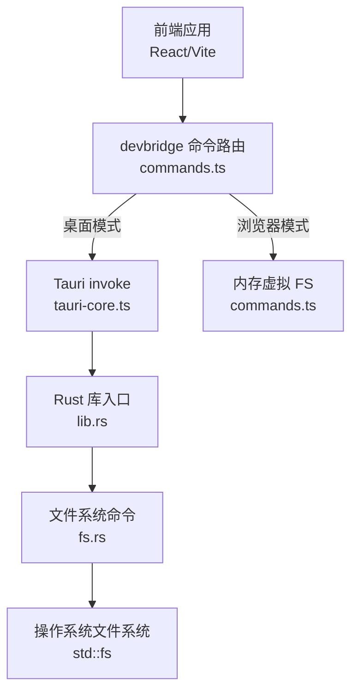
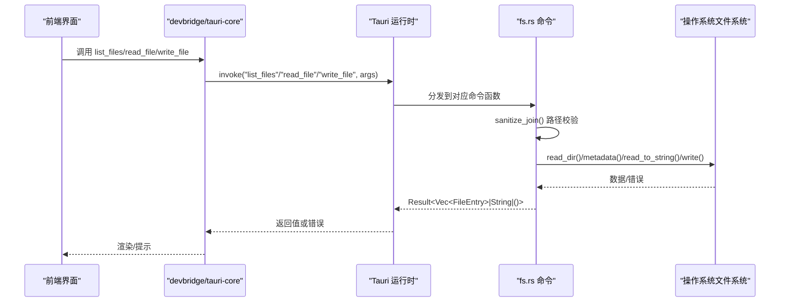
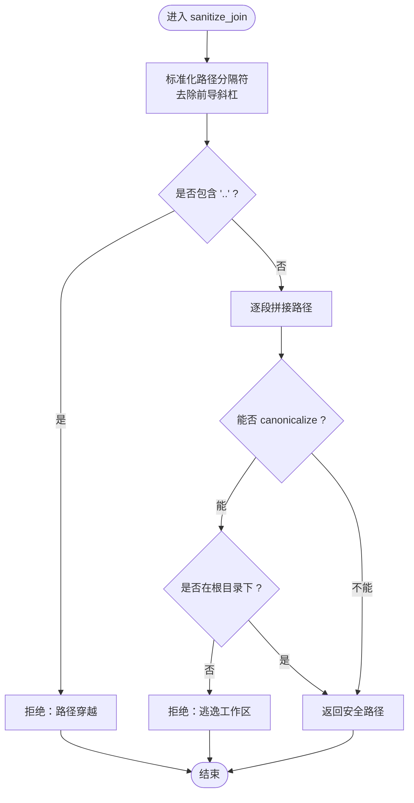
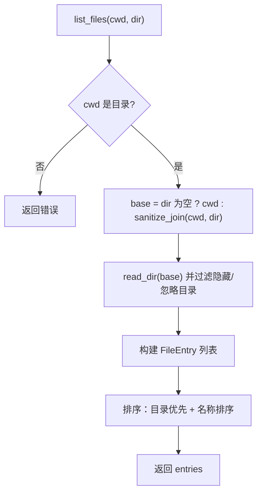
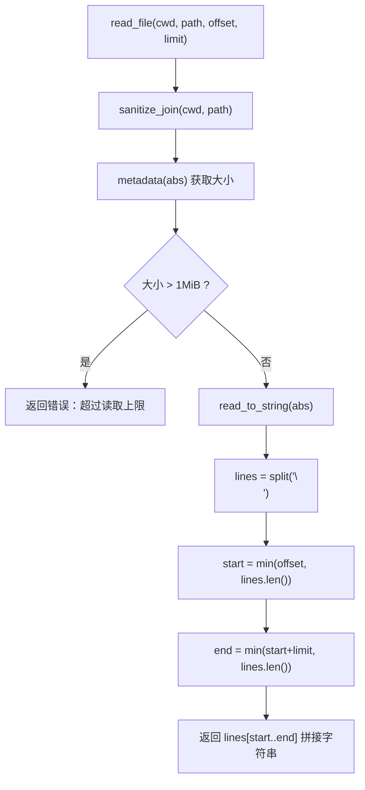
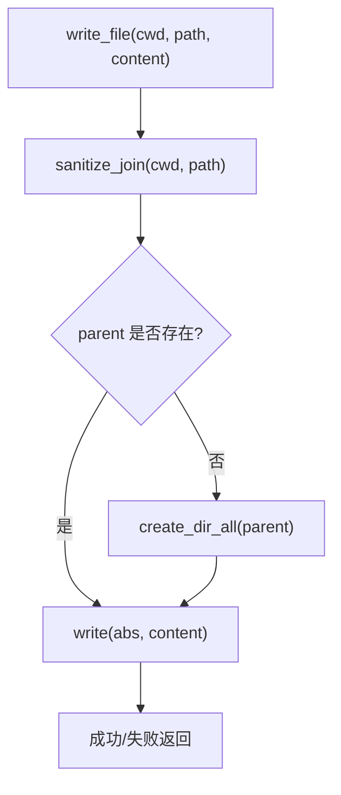
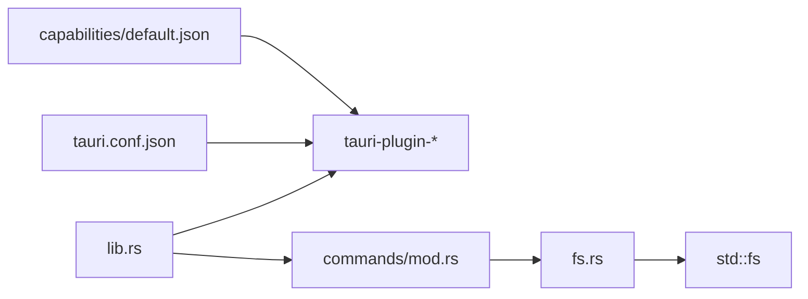

# 文件系统

<cite>
**本文引用的文件**
- [src-tauri/src/commands/fs.rs](file://src-tauri/src/commands/fs.rs)
- [src-tauri/src/lib.rs](file://src-tauri/src/lib.rs)
- [src-tauri/src/commands/mod.rs](file://src-tauri/src/commands/mod.rs)
- [src-tauri/tauri.conf.json](file://src-tauri/tauri.conf.json)
- [src-tauri/capabilities/default.json](file://src-tauri/capabilities/default.json)
- [frontend/app/devbridge/commands.ts](file://frontend/app/devbridge/commands.ts)
- [frontend/app/devbridge/tauri-core.ts](file://frontend/app/devbridge/tauri-core.ts)
</cite>

## 目录
1. [简介](#简介)
2. [项目结构](#项目结构)
3. [核心组件](#核心组件)
4. [架构总览](#架构总览)
5. [详细组件分析](#详细组件分析)
6. [依赖关系分析](#依赖关系分析)
7. [性能考量](#性能考量)
8. [故障排查指南](#故障排查指南)
9. [结论](#结论)
10. [附录：使用示例与安全最佳实践](#附录使用示例与安全最佳实践)

## 简介
本文件为 Codex-Tauri 的文件系统能力提供完整、深入的技术文档。内容涵盖安全文件操作的实现原理、路径验证机制、权限控制与错误处理策略；文件系统 API 的设计模式、大文件处理、异步操作与性能优化；以及文件浏览、读取、写入等核心功能的实现细节与安全考虑。同时说明与操作系统原生 API 的集成方式、跨平台兼容性处理和异常恢复机制，并提供使用示例与安全最佳实践。

## 项目结构
Codex-Tauri 的文件系统功能由后端 Rust 命令层（Tauri command）暴露给前端调用，并通过 Tauri 插件与能力配置进行权限管控。前端在桌面端通过 Tauri invoke 调用 Rust 命令；在浏览器开发模式下，通过 devbridge 将相同命令路由到内存虚拟文件系统，以保持一致的接口行为。

图表来源
- [frontend/app/devbridge/commands.ts:537-580](file://frontend/app/devbridge/commands.ts#L537-L580)
- [frontend/app/devbridge/tauri-core.ts:12-17](file://frontend/app/devbridge/tauri-core.ts#L12-L17)
- [src-tauri/src/lib.rs:71-101](file://src-tauri/src/lib.rs#L71-L101)
- [src-tauri/src/commands/fs.rs:50-131](file://src-tauri/src/commands/fs.rs#L50-L131)

章节来源
- [src-tauri/src/commands/fs.rs:1-131](file://src-tauri/src/commands/fs.rs#L1-L131)
- [src-tauri/src/lib.rs:71-101](file://src-tauri/src/lib.rs#L71-L101)
- [frontend/app/devbridge/commands.ts:537-580](file://frontend/app/devbridge/commands.ts#L537-L580)
- [frontend/app/devbridge/tauri-core.ts:12-17](file://frontend/app/devbridge/tauri-core.ts#L12-L17)

## 核心组件
- 文件系统命令模块（Rust）：提供 list_files、read_file、write_file 三个 Tauri 命令，统一进行路径校验、大小限制、目录过滤和排序输出。
- Tauri 注册与插件：在 lib.rs 中注册 fs 相关命令，并启用 tauri-plugin-fs 与 store/shell/dialog 等插件。
- 能力与权限：capabilities/default.json 声明了 fs 插件的最小权限集合（读文本、写文本、存在性检查、创建目录、读取目录）。
- 前端桥接：
  - 桌面模式：通过 tauri-core.ts 的 invoke 调用 Rust 命令。
  - 浏览器模式：commands.ts 中的 devbridge 用内存虚拟 FS 模拟相同接口，便于本地调试。

章节来源
- [src-tauri/src/commands/fs.rs:20-131](file://src-tauri/src/commands/fs.rs#L20-L131)
- [src-tauri/src/lib.rs:16-20](file://src-tauri/src/lib.rs#L16-L20)
- [src-tauri/capabilities/default.json:6-28](file://src-tauri/capabilities/default.json#L6-L28)
- [frontend/app/devbridge/tauri-core.ts:12-17](file://frontend/app/devbridge/tauri-core.ts#L12-L17)
- [frontend/app/devbridge/commands.ts:537-580](file://frontend/app/devbridge/commands.ts#L537-L580)

## 架构总览
下图展示了从前端到后端的完整调用链，包括路径校验、权限检查、I/O 操作与返回结果。

图表来源
- [src-tauri/src/commands/fs.rs:31-48](file://src-tauri/src/commands/fs.rs#L31-L48)
- [src-tauri/src/commands/fs.rs:50-131](file://src-tauri/src/commands/fs.rs#L50-L131)
- [src-tauri/src/lib.rs:71-101](file://src-tauri/src/lib.rs#L71-L101)
- [frontend/app/devbridge/tauri-core.ts:12-17](file://frontend/app/devbridge/tauri-core.ts#L12-L17)

## 详细组件分析

### 路径验证与安全边界（sanitize_join）
- 规范化路径分隔符并去除前导斜杠。
- 显式拒绝包含“..”的路径穿越尝试。
- 逐段拼接路径，并在可能情况下对根目录和目标路径进行 canonicalize，确保最终路径仍位于工作区根目录下。
- 若无法 canonicalize（例如不存在），则回退到相对拼接，但仍需满足“不包含 ..”的前置约束。

图表来源
- [src-tauri/src/commands/fs.rs:31-48](file://src-tauri/src/commands/fs.rs#L31-L48)

章节来源
- [src-tauri/src/commands/fs.rs:31-48](file://src-tauri/src/commands/fs.rs#L31-L48)

### 文件浏览（list_files）
- 参数：cwd（工作区根）、dir（子目录，可为空）。
- 行为：
  - 校验 cwd 是否为目录。
  - 使用 sanitize_join 计算 base 目录。
  - 遍历目录项，跳过隐藏文件（以“.”开头）与忽略目录（如 node_modules、dist、build、out、target、.git、.idea、.vscode、vendor）。
  - 生成 FileEntry 列表，包含 name、path、abs_path、is_directory、ext。
  - 排序：目录优先，其次按名称不区分大小写排序。
- 安全要点：所有子目录访问均经过 sanitize_join 校验。

图表来源
- [src-tauri/src/commands/fs.rs:50-99](file://src-tauri/src/commands/fs.rs#L50-L99)

章节来源
- [src-tauri/src/commands/fs.rs:50-99](file://src-tauri/src/commands/fs.rs#L50-L99)

### 文件读取（read_file）
- 参数：cwd、path、offset、limit。
- 行为：
  - 使用 sanitize_join 计算绝对路径。
  - 获取元信息，限制最大读取大小为 1MiB（MAX_READ_BYTES）。
  - 以文本形式读取，按行切分，支持 offset/limit 分页。
- 安全与健壮性：
  - 严格路径校验，防止越权访问。
  - 文件大小上限保护，避免内存占用过大。
  - 错误通过 Result 返回，上层可捕获并提示用户。

图表来源
- [src-tauri/src/commands/fs.rs:101-121](file://src-tauri/src/commands/fs.rs#L101-L121)

章节来源
- [src-tauri/src/commands/fs.rs:101-121](file://src-tauri/src/commands/fs.rs#L101-L121)

### 文件写入（write_file）
- 参数：cwd、path、content。
- 行为：
  - 使用 sanitize_join 计算绝对路径。
  - 自动创建父目录（create_dir_all）。
  - 写入文本内容。
- 安全与健壮性：
  - 路径校验防止越权。
  - 目录创建失败时返回错误。
  - 写入失败时返回错误，供上层处理。

图表来源
- [src-tauri/src/commands/fs.rs:123-131](file://src-tauri/src/commands/fs.rs#L123-L131)

章节来源
- [src-tauri/src/commands/fs.rs:123-131](file://src-tauri/src/commands/fs.rs#L123-L131)

### 前端桥接与一致性
- 桌面模式：通过 tauri-core.ts 的 invoke 调用 Rust 命令，保持与后端一致的数据结构与错误语义。
- 浏览器模式：commands.ts 中实现了相同的 list_files/read_file/write_file 接口，基于内存虚拟 FS，便于在无 Rust 环境调试。
- 注意：浏览器模式的虚拟 FS 同样执行路径穿越检查，保证前后端行为一致。

章节来源
- [frontend/app/devbridge/tauri-core.ts:12-17](file://frontend/app/devbridge/tauri-core.ts#L12-L17)
- [frontend/app/devbridge/commands.ts:537-580](file://frontend/app/devbridge/commands.ts#L537-L580)

## 依赖关系分析
- Rust 侧：
  - commands/fs.rs 通过 std::fs 与操作系统交互。
  - lib.rs 注册 Tauri 命令，并初始化 tauri-plugin-fs、store、shell、dialog 等插件。
  - commands/mod.rs 导出 fs 模块。
- 配置侧：
  - tauri.conf.json 启用 assetProtocol 与 fs 插件选项。
  - capabilities/default.json 声明最小权限集，仅允许必要的文件系统操作。

图表来源
- [src-tauri/src/commands/fs.rs:1-131](file://src-tauri/src/commands/fs.rs#L1-L131)
- [src-tauri/src/lib.rs:16-20](file://src-tauri/src/lib.rs#L16-L20)
- [src-tauri/src/commands/mod.rs:1-11](file://src-tauri/src/commands/mod.rs#L1-L11)
- [src-tauri/tauri.conf.json:29-58](file://src-tauri/tauri.conf.json#L29-L58)
- [src-tauri/capabilities/default.json:6-28](file://src-tauri/capabilities/default.json#L6-L28)

章节来源
- [src-tauri/src/commands/fs.rs:1-131](file://src-tauri/src/commands/fs.rs#L1-L131)
- [src-tauri/src/lib.rs:16-20](file://src-tauri/src/lib.rs#L16-L20)
- [src-tauri/src/commands/mod.rs:1-11](file://src-tauri/src/commands/mod.rs#L1-L11)
- [src-tauri/tauri.conf.json:29-58](file://src-tauri/tauri.conf.json#L29-L58)
- [src-tauri/capabilities/default.json:6-28](file://src-tauri/capabilities/default.json#L6-L28)

## 性能考量
- 大文件读取限制：read_file 强制限制单次读取不超过 1MiB，避免内存峰值过高。
- 分页读取：通过 offset/limit 支持按需加载行片段，适合大文本预览。
- 目录遍历优化：跳过隐藏文件与已知忽略目录，减少无效 I/O。
- 排序开销：entries 数量较大时，排序复杂度为 O(n log n)，建议在前端做增量展示与虚拟滚动。
- 异步与并发：当前命令为同步 I/O；在高并发场景下可考虑引入 tokio 异步 I/O 以提升吞吐，但需注意 Tauri 命令线程模型与阻塞风险。

[本节为通用性能指导，不直接分析具体代码文件]

## 故障排查指南
- 常见错误类型：
  - 路径穿越被拒绝：sanitize_join 检测到“..”，应检查前端传入的相对路径是否正确。
  - 工作区逃逸：canonicalize 后不在根目录下，检查 cwd 与 dir 的组合是否越界。
  - 读取超限：文件大于 1MiB，应改用分页或流式读取策略（当前实现不支持流式）。
  - 目录不存在：cwd 不是目录或父目录创建失败，检查路径有效性及权限。
  - 权限不足：capabilities 未授予相应权限，检查 default.json 的配置。
- 定位方法：
  - 查看 Tauri 日志（tracing-subscriber 已启用），关注错误消息。
  - 在浏览器模式下，devbridge 会抛出明确错误（如“browser-dev virtual fs: no such file ...”），便于快速定位。

章节来源
- [src-tauri/src/commands/fs.rs:31-48](file://src-tauri/src/commands/fs.rs#L31-L48)
- [src-tauri/src/commands/fs.rs:50-131](file://src-tauri/src/commands/fs.rs#L50-L131)
- [frontend/app/devbridge/commands.ts:569-580](file://frontend/app/devbridge/commands.ts#L569-L580)

## 结论
Codex-Tauri 的文件系统功能通过严格的 sanitize_join 路径校验、能力权限控制与大文件限制，提供了安全的文件浏览、读取与写入能力。API 设计简洁一致，前后端在桌面与浏览器模式下保持一致的行为契约。建议在后续迭代中引入异步 I/O 与流式读取，进一步提升大文件处理能力与整体性能。

[本节为总结，不直接分析具体代码文件]

## 附录：使用示例与安全最佳实践

### 使用示例（概念性）
- 列出目录内容
  - 调用：list_files({ cwd: "/workspace", dir: "src" })
  - 返回：FileEntry[]，包含 name、path、abs_path、is_directory、ext
- 读取文件片段
  - 调用：read_file({ cwd: "/workspace", path: "src/main.rs", offset: 0, limit: 100 })
  - 返回：字符串（指定范围的行片段）
- 写入文件
  - 调用：write_file({ cwd: "/workspace", path: "src/main.rs", content: "..." })
  - 返回：成功或错误

### 安全最佳实践
- 始终通过 sanitize_join 校验路径，禁止直接使用用户输入拼接路径。
- 限制读取大小，避免内存溢出；对超大文件采用分页或流式方案。
- 最小权限原则：仅在 capabilities 中授予必要权限。
- 忽略敏感目录：默认跳过 node_modules、.git、.vscode 等，降低扫描成本与泄露风险。
- 错误处理：统一通过 Result 返回错误，前端应显示友好提示并记录日志。
- 跨平台兼容：路径分隔符统一转换为“/”，避免 Windows 反斜杠问题。

[本节为通用指导，不直接分析具体代码文件]