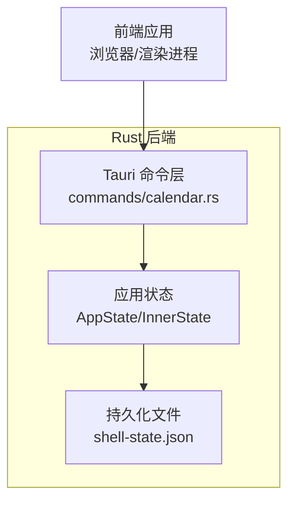
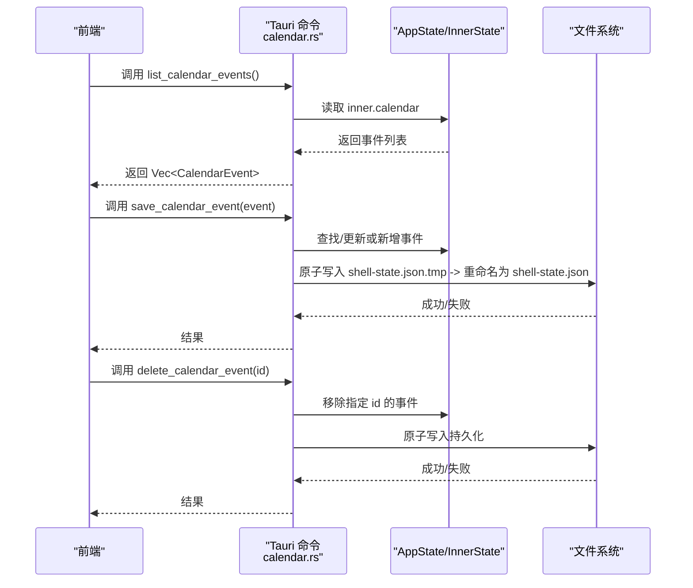
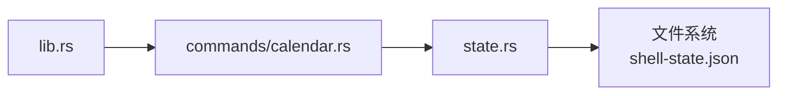

# 日历集成

<cite>
**本文引用的文件**
- [calendar.rs](file://src-tauri/src/commands/calendar.rs)
- [state.rs](file://src-tauri/src/state.rs)
- [lib.rs](file://src-tauri/src/lib.rs)
- [mod.rs](file://src-tauri/src/commands/mod.rs)
- [commands.ts（开发桥）](file://frontend/app/devbridge/commands.ts)
</cite>

## 目录
1. [简介](#简介)
2. [项目结构](#项目结构)
3. [核心组件](#核心组件)
4. [架构总览](#架构总览)
5. [详细组件分析](#详细组件分析)
6. [依赖关系分析](#依赖关系分析)
7. [性能与并发](#性能与并发)
8. [故障排查指南](#故障排查指南)
9. [结论](#结论)
10. [附录：使用示例与扩展指南](#附录：使用示例与扩展指南)

## 简介
本章节介绍 Codex-Tauri 的日历集成功能，涵盖事件增删改查、数据模型定义、状态管理与持久化机制；详细说明 Tauri 命令接口 list_calendar_events、save_calendar_event、delete_calendar_event 的实现原理与使用方法；解释 CalendarEvent 数据模型、事件 ID 管理、并发访问控制与错误处理策略；并给出生命周期管理、数据同步机制、性能优化建议以及扩展新日历功能的实践指南。

## 项目结构
日历功能由后端 Rust 模块提供 Tauri 命令，状态与持久化集中在 state.rs，命令在 commands/calendar.rs 中实现并通过 lib.rs 注册到 Tauri 运行时。前端通过开发桥（devbridge）或未来正式 IPC 调用这些命令进行 CRUD 操作。

图表来源
- [lib.rs:71-88](file://src-tauri/src/lib.rs#L71-L88)
- [calendar.rs:4-32](file://src-tauri/src/commands/calendar.rs#L4-L32)
- [state.rs:150-217](file://src-tauri/src/state.rs#L150-L217)

章节来源
- [lib.rs:71-88](file://src-tauri/src/lib.rs#L71-L88)
- [mod.rs:1-11](file://src-tauri/src/commands/mod.rs#L1-L11)

## 核心组件
- 数据模型 CalendarEvent：包含 id、title、starts_at、ends_at、notes 等字段，用于表示一个日历事件。
- 应用状态 InnerState：维护 calendar 列表，作为内存中的单一事实源。
- 持久化 ShellStateFile：将 InnerState 序列化为 JSON 文件 shell-state.json，采用原子写入（先写临时文件再重命名）。
- Tauri 命令：list_calendar_events、save_calendar_event、delete_calendar_event，暴露给前端进行 CRUD。

章节来源
- [state.rs:79-89](file://src-tauri/src/state.rs#L79-L89)
- [state.rs:155-174](file://src-tauri/src/state.rs#L155-L174)
- [state.rs:209-217](file://src-tauri/src/state.rs#L209-L217)
- [calendar.rs:4-32](file://src-tauri/src/commands/calendar.rs#L4-L32)

## 架构总览
下图展示了从前端调用到后端状态变更再到持久化的完整流程。

图表来源
- [calendar.rs:4-32](file://src-tauri/src/commands/calendar.rs#L4-L32)
- [state.rs:209-217](file://src-tauri/src/state.rs#L209-L217)

## 详细组件分析

### 数据模型：CalendarEvent
- 字段说明
  - id：字符串类型，唯一标识一个事件。
  - title：事件标题。
  - starts_at：开始时间（字符串，格式由业务约定）。
  - ends_at：结束时间（字符串，格式由业务约定）。
  - notes：备注信息。
- 序列化/反序列化：支持 serde 的 Serialize/Deserialize，便于持久化到 JSON。
- 默认值：可选字段通过 #[serde(default)] 提供空值默认。

章节来源
- [state.rs:79-89](file://src-tauri/src/state.rs#L79-L89)

### 状态管理与持久化
- 内存状态
  - AppState 持有 data_dir 和 Mutex<InnerState>，确保多线程安全访问。
  - InnerState 包含 settings、preferences、pets、calendar 等集合，其中 calendar 为 Vec<CalendarEvent>。
- 持久化
  - save() 方法将 InnerState 转换为 ShellStateFile，先写入临时文件 shell-state.json.tmp，再原子重命名为 shell-state.json，避免部分写入导致的数据损坏。
  - load_or_default() 在启动时尝试加载已有状态，若不存在则使用默认值初始化。
- 快照
  - snapshot() 提供只读视图，便于 UI 展示或调试。

章节来源
- [state.rs:150-174](file://src-tauri/src/state.rs#L150-L174)
- [state.rs:176-217](file://src-tauri/src/state.rs#L176-L217)
- [state.rs:219-231](file://src-tauri/src/state.rs#L219-L231)
- [state.rs:234-300](file://src-tauri/src/state.rs#L234-L300)

### Tauri 命令实现

#### list_calendar_events
- 功能：返回当前内存中的日历事件列表。
- 并发：通过 Mutex 锁保护读取，防止竞态条件。
- 错误：锁获取失败会转为 String 错误返回。

章节来源
- [calendar.rs:4-12](file://src-tauri/src/commands/calendar.rs#L4-L12)

#### save_calendar_event
- 功能：根据 event.id 判断是更新现有事件还是新增事件。
- 并发：加锁后修改 inner.calendar，然后释放锁再持久化。
- 持久化：调用 state.save() 原子写入 JSON。
- 错误：锁获取失败或保存失败均转为 String 错误返回。

章节来源
- [calendar.rs:14-24](file://src-tauri/src/commands/calendar.rs#L14-L24)
- [state.rs:209-217](file://src-tauri/src/state.rs#L209-L217)

#### delete_calendar_event
- 功能：按 id 过滤删除事件。
- 并发：加锁后使用 retain 移除匹配项，再释放锁并持久化。
- 错误：同 save_calendar_event。

章节来源
- [calendar.rs:26-32](file://src-tauri/src/commands/calendar.rs#L26-L32)

### 命令注册与前端调用
- 命令注册：在 lib.rs 的 invoke_handler 中注册三个日历命令，使前端可通过 Tauri 调用。
- 前端调用：开发桥（devbridge）提供了本地预览用的 list/save/delete 日历事件方法，实际生产环境可替换为正式 IPC 调用。

章节来源
- [lib.rs:86-88](file://src-tauri/src/lib.rs#L86-L88)
- [commands.ts:473-485](file://frontend/app/devbridge/commands.ts#L473-L485)

## 依赖关系分析
- 模块耦合
  - commands/calendar.rs 依赖 state.rs 中的 AppState 与 CalendarEvent。
  - state.rs 提供状态与持久化，被多个命令共享。
  - lib.rs 负责命令注册与应用初始化。
- 外部依赖
  - tauri::State、tauri::generate_handler! 用于命令绑定。
  - serde_json 用于序列化/反序列化。
  - dirs::config_dir 用于定位配置目录。

图表来源
- [calendar.rs:1-2](file://src-tauri/src/commands/calendar.rs#L1-L2)
- [lib.rs:86-88](file://src-tauri/src/lib.rs#L86-L88)
- [state.rs:176-217](file://src-tauri/src/state.rs#L176-L217)

章节来源
- [mod.rs:1-11](file://src-tauri/src/commands/mod.rs#L1-L11)
- [lib.rs:86-88](file://src-tauri/src/lib.rs#L86-L88)

## 性能与并发
- 并发控制
  - 使用 Mutex 保护 InnerState，所有读写操作均需获取锁，避免数据竞争。
  - 建议在批量操作时合并多次 save 调用，减少磁盘 I/O。
- 持久化策略
  - 原子写入（tmp + rename）保证一致性，但频繁保存仍可能带来 IO 压力。
  - 可考虑对 save 进行节流（debounce），或在 UI 提交后再统一持久化。
- 查询性能
  - list_calendar_events 直接返回 clone 后的向量，适合小数据集；若数据量增长，可考虑分页或索引。
- 内存占用
  - 每个事件对象较小，整体内存占用可控；注意避免不必要的深拷贝。

[本节为通用性能建议，不直接分析具体代码行]

## 故障排查指南
- 常见错误
  - 锁获取失败：map_err 将 MutexError 转为 String，检查是否有长时间持锁的逻辑。
  - 持久化失败：write/rename 异常，检查磁盘权限与路径有效性。
  - 数据不一致：确保每次修改后都调用 save，避免重启后丢失。
- 诊断步骤
  - 查看日志输出（tracing_subscriber 已启用 info/debug 级别）。
  - 检查 shell-state.json 是否被正确生成与更新。
  - 验证前端传入的 event.id 是否与后端期望一致。
- 恢复策略
  - 若文件损坏，删除临时文件或回滚至备份。
  - 重启应用以重新加载默认状态。

章节来源
- [calendar.rs:4-32](file://src-tauri/src/commands/calendar.rs#L4-L32)
- [state.rs:209-217](file://src-tauri/src/state.rs#L209-L217)
- [lib.rs:8-14](file://src-tauri/src/lib.rs#L8-L14)

## 结论
Codex-Tauri 的日历集成功能以简洁的 Rust 后端与 Tauri 命令为核心，提供稳定的增删改查能力。通过 Mutex 保障并发安全，原子持久化确保数据一致性。前端可通过开发桥快速验证，后续可无缝迁移到正式 IPC。该设计易于扩展，支持新增字段、校验逻辑与更复杂的业务规则。

[本节为总结性内容，不直接分析具体代码行]

## 附录：使用示例与扩展指南

### 使用示例
- 列出事件
  - 调用 list_calendar_events，获取 Vec<CalendarEvent> 并在前端渲染。
- 新增/更新事件
  - 构造 CalendarEvent，确保 id 唯一；调用 save_calendar_event，后端自动判断新增或更新。
- 删除事件
  - 调用 delete_calendar_event，传入要删除事件的 id。

章节来源
- [calendar.rs:4-32](file://src-tauri/src/commands/calendar.rs#L4-L32)
- [commands.ts:473-485](file://frontend/app/devbridge/commands.ts#L473-L485)

### 事件 ID 管理
- 建议在前端生成全局唯一 id（如 UUID 或时间戳组合），避免冲突。
- 后端不强制校验 id 唯一性，依赖前端保证；如需更强约束，可在 save 前增加重复检测。

章节来源
- [state.rs:79-89](file://src-tauri/src/state.rs#L79-L89)
- [calendar.rs:14-24](file://src-tauri/src/commands/calendar.rs#L14-L24)

### 并发访问控制
- 所有命令通过 Mutex 保护状态访问，避免竞态。
- 避免在锁内执行耗时操作（如网络请求），以免阻塞其他命令。

章节来源
- [calendar.rs:4-32](file://src-tauri/src/commands/calendar.rs#L4-L32)
- [state.rs:150-174](file://src-tauri/src/state.rs#L150-L174)

### 错误处理策略
- 命令返回 Result<T, String>，错误信息可直接透传到前端提示。
- 持久化失败时，应记录日志并提示用户重试或检查磁盘空间。

章节来源
- [calendar.rs:4-32](file://src-tauri/src/commands/calendar.rs#L4-L32)
- [state.rs:209-217](file://src-tauri/src/state.rs#L209-L217)

### 生命周期管理与数据同步
- 启动时加载状态：load_or_default 读取 shell-state.json，若无则初始化默认值。
- 运行时同步：每次 save 后立即持久化，确保多窗口或多进程间数据一致。
- 前端缓存：可结合本地存储做离线预览，最终提交到后端。

章节来源
- [state.rs:176-217](file://src-tauri/src/state.rs#L176-L217)
- [commands.ts:473-485](file://frontend/app/devbridge/commands.ts#L473-L485)

### 性能优化建议
- 节流保存：对高频保存操作进行 debounce，减少磁盘写入次数。
- 批量操作：合并多次修改后一次性持久化。
- 查询优化：当事件数量较大时，考虑分页或按需加载。

[本节为通用优化建议，不直接分析具体代码行]

### 扩展新日历功能指南
- 新增字段
  - 在 CalendarEvent 中添加字段，并确保 serde 注解正确。
  - 更新前端数据结构与表单字段。
- 新增命令
  - 在 commands/calendar.rs 添加新函数，并在 lib.rs 注册。
  - 在前端 devbridge 或正式 IPC 中封装调用。
- 校验与迁移
  - 对必填字段增加校验逻辑。
  - 为旧数据提供迁移脚本，确保向后兼容。

章节来源
- [state.rs:79-89](file://src-tauri/src/state.rs#L79-L89)
- [calendar.rs:4-32](file://src-tauri/src/commands/calendar.rs#L4-L32)
- [lib.rs:86-88](file://src-tauri/src/lib.rs#L86-L88)