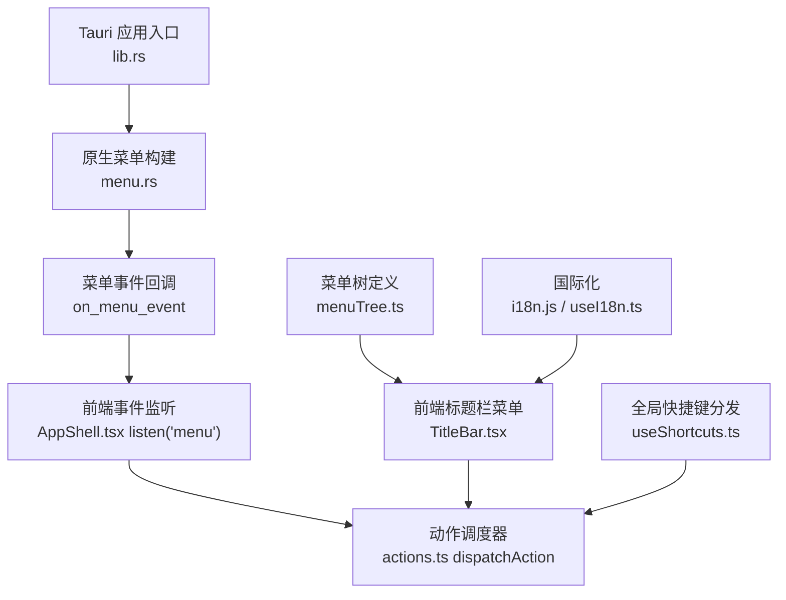
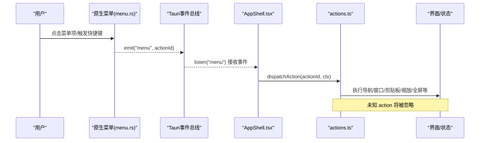
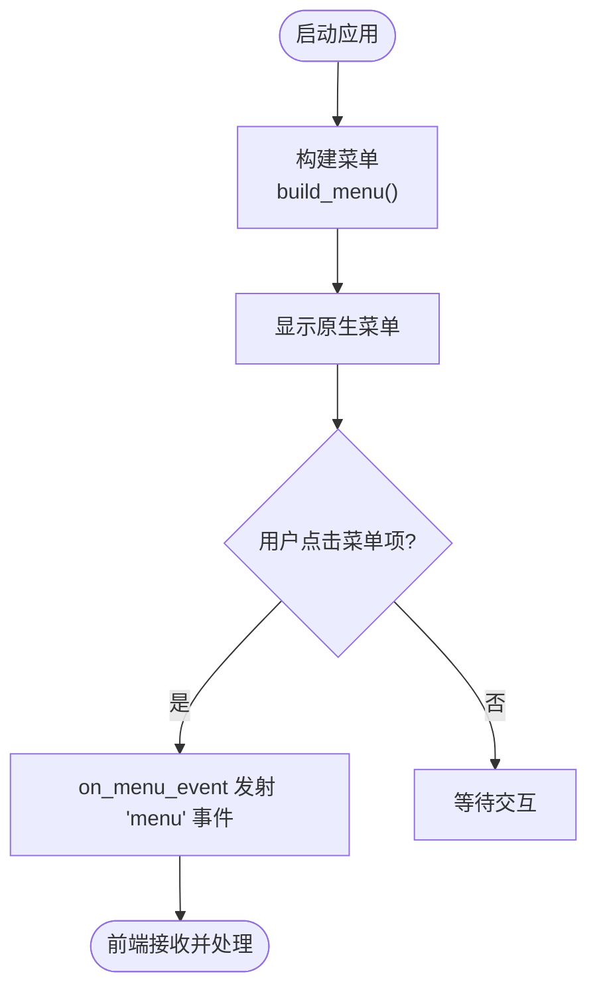
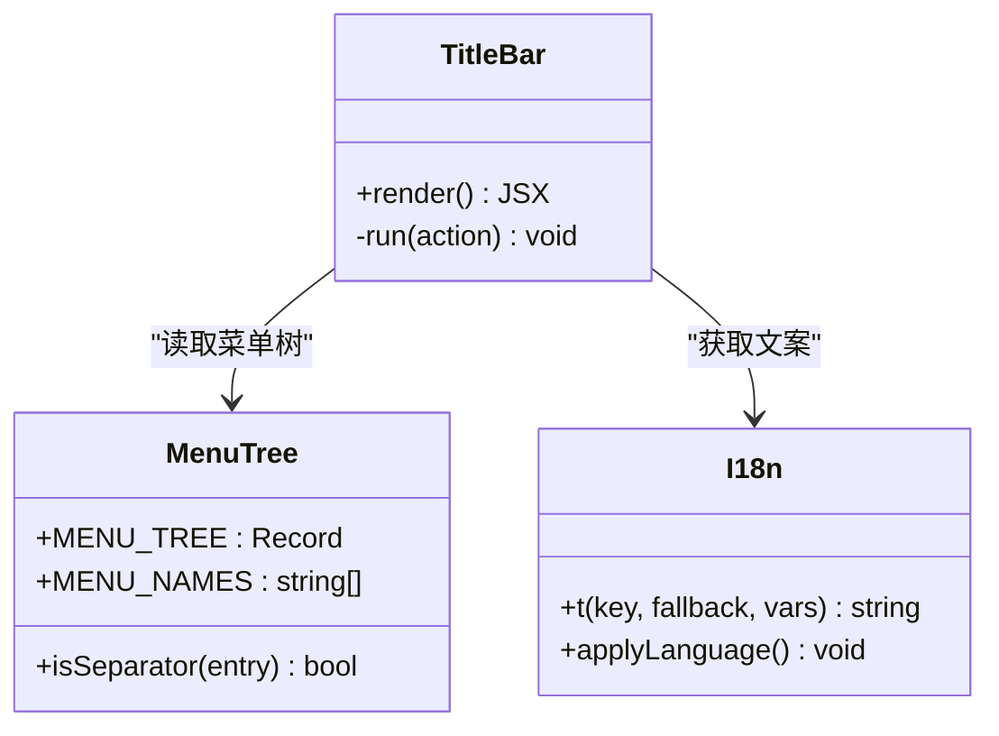
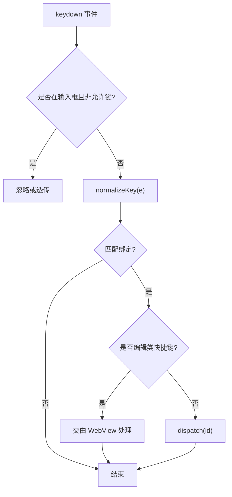
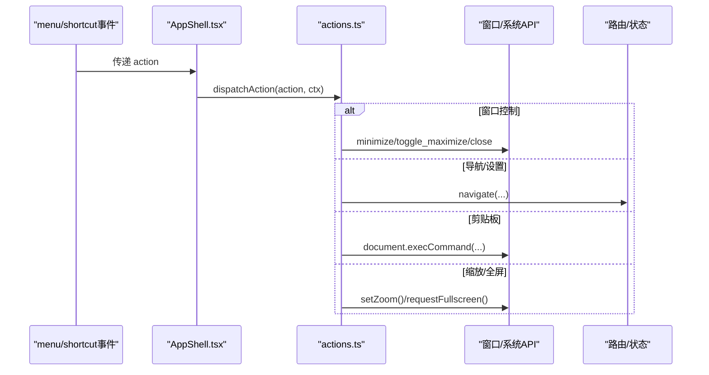

# 系统菜单

<cite>
**本文引用的文件**
- [src-tauri/src/menu.rs](file://src-tauri/src/menu.rs)
- [src-tauri/src/lib.rs](file://src-tauri/src/lib.rs)
- [frontend/app/shell/AppShell.tsx](file://frontend/app/shell/AppShell.tsx)
- [frontend/app/shell/actions.ts](file://frontend/app/shell/actions.ts)
- [frontend/app/shell/TitleBar.tsx](file://frontend/app/shell/TitleBar.tsx)
- [frontend/app/shell/menuTree.ts](file://frontend/app/shell/menuTree.ts)
- [frontend/app/shell/useShortcuts.ts](file://frontend/app/shell/useShortcuts.ts)
- [frontend/src/js/i18n.js](file://frontend/src/js/i18n.js)
- [frontend/app/shell/useI18n.ts](file://frontend/app/shell/useI18n.ts)
- [src-tauri/tauri.conf.json](file://src-tauri/tauri.conf.json)
</cite>

## 目录
1. [简介](#简介)
2. [项目结构](#项目结构)
3. [核心组件](#核心组件)
4. [架构总览](#架构总览)
5. [详细组件分析](#详细组件分析)
6. [依赖关系分析](#依赖关系分析)
7. [性能考量](#性能考量)
8. [故障排查指南](#故障排查指南)
9. [结论](#结论)
10. [附录](#附录)

## 简介
本文件系统性说明 Codex-Tauri 的系统菜单能力：包括原生应用菜单构建、前端标题栏菜单渲染、全局快捷键分发、事件桥接与动作调度，以及国际化与主题适配。文档覆盖跨平台差异处理思路、动态菜单更新机制、上下文菜单与托盘菜单的扩展点，并给出新增菜单项的实践指南。

## 项目结构
Codex 的菜单由“后端原生菜单 + 前端自定义标题栏菜单 + 全局快捷键”三部分协同完成：
- 后端（Rust/Tauri）负责构建 File/Edit/View/Help 等原生菜单，并在用户点击时向前端发射统一的 menu 事件。
- 前端 React Shell 监听该事件，统一进入动作调度器 dispatchAction，实现导航、窗口控制、剪贴板操作、缩放、全屏等行为。
- 前端同时维护一份 MENU_TREE 用于在无边框标题栏中渲染菜单；useShortcutDispatcher 提供全局快捷键匹配与冲突检测。
- 国际化通过 i18n 模块驱动，菜单文案使用 key 映射，支持运行时语言切换。



图表来源
- [src-tauri/src/lib.rs:16-22](file://src-tauri/src/lib.rs#L16-L22)
- [src-tauri/src/menu.rs:7-213](file://src-tauri/src/menu.rs#L7-L213)
- [src-tauri/src/menu.rs:215-219](file://src-tauri/src/menu.rs#L215-L219)
- [frontend/app/shell/AppShell.tsx:163-177](file://frontend/app/shell/AppShell.tsx#L163-L177)
- [frontend/app/shell/actions.ts:56-200](file://frontend/app/shell/actions.ts#L56-L200)
- [frontend/app/shell/TitleBar.tsx:92-127](file://frontend/app/shell/TitleBar.tsx#L92-L127)
- [frontend/app/shell/menuTree.ts:24-79](file://frontend/app/shell/menuTree.ts#L24-L79)
- [frontend/app/shell/useShortcuts.ts:104-132](file://frontend/app/shell/useShortcuts.ts#L104-L132)
- [frontend/src/js/i18n.js:2017-2085](file://frontend/src/js/i18n.js#L2017-L2085)
- [frontend/app/shell/useI18n.ts:1-14](file://frontend/app/shell/useI18n.ts#L1-L14)

章节来源
- [src-tauri/src/lib.rs:16-22](file://src-tauri/src/lib.rs#L16-L22)
- [src-tauri/src/menu.rs:7-213](file://src-tauri/src/menu.rs#L7-L213)
- [frontend/app/shell/AppShell.tsx:163-177](file://frontend/app/shell/AppShell.tsx#L163-L177)
- [frontend/app/shell/actions.ts:56-200](file://frontend/app/shell/actions.ts#L56-L200)
- [frontend/app/shell/TitleBar.tsx:92-127](file://frontend/app/shell/TitleBar.tsx#L92-L127)
- [frontend/app/shell/menuTree.ts:24-79](file://frontend/app/shell/menuTree.ts#L24-L79)
- [frontend/app/shell/useShortcuts.ts:104-132](file://frontend/app/shell/useShortcuts.ts#L104-L132)
- [frontend/src/js/i18n.js:2017-2085](file://frontend/src/js/i18n.js#L2017-L2085)
- [frontend/app/shell/useI18n.ts:1-14](file://frontend/app/shell/useI18n.ts#L1-L14)

## 核心组件
- 原生菜单构建与事件桥接（Rust）
  - 构建 File/Edit/View/Help 子菜单，并为每个菜单项分配 action id 与可选快捷键。
  - 捕获原生菜单事件，将 action id 作为 payload 通过 Tauri 事件系统发射到前端。
- 前端标题栏菜单（React）
  - 基于 MENU_TREE 渲染菜单面板，点击后直接调用 dispatchAction。
  - 通过 i18n 获取本地化文案，支持运行时语言切换刷新。
- 全局快捷键分发（React Hook）
  - 监听键盘事件，归一化按键序列并与绑定列表匹配，命中后调用 dispatchAction。
  - 内置编辑类快捷键透传策略，避免拦截浏览器/WebView 原生行为。
- 动作调度器（actions.ts）
  - 集中处理所有菜单/快捷键触发的业务逻辑：导航、窗口控制、剪贴板、缩放、全屏、外部链接等。
- 配置与集成
  - tauri.conf.json 设置无边框窗口（decorations: false），使 OS 菜单栏不可见，菜单由前端标题栏承载。
  - lib.rs 注册菜单构建与事件回调，确保前后端一致。

章节来源
- [src-tauri/src/menu.rs:7-213](file://src-tauri/src/menu.rs#L7-L213)
- [src-tauri/src/menu.rs:215-219](file://src-tauri/src/menu.rs#L215-L219)
- [frontend/app/shell/TitleBar.tsx:92-127](file://frontend/app/shell/TitleBar.tsx#L92-L127)
- [frontend/app/shell/useShortcuts.ts:104-132](file://frontend/app/shell/useShortcuts.ts#L104-L132)
- [frontend/app/shell/actions.ts:56-200](file://frontend/app/shell/actions.ts#L56-L200)
- [src-tauri/tauri.conf.json:12-27](file://src-tauri/tauri.conf.json#L12-L27)
- [src-tauri/src/lib.rs:16-22](file://src-tauri/src/lib.rs#L16-L22)

## 架构总览
下图展示了从原生菜单到前端动作执行的完整链路，以及前端标题栏菜单与全局快捷键如何汇入同一调度通道。



图表来源
- [src-tauri/src/menu.rs:215-219](file://src-tauri/src/menu.rs#L215-L219)
- [frontend/app/shell/AppShell.tsx:163-177](file://frontend/app/shell/AppShell.tsx#L163-L177)
- [frontend/app/shell/actions.ts:56-200](file://frontend/app/shell/actions.ts#L56-L200)

## 详细组件分析

### 原生菜单构建与事件桥接（Rust）
- 菜单结构
  - File：新建任务、无项目任务、打开文件夹、关闭标签、设置、登出、退出等。
  - Edit：撤销/重做、剪切/复制/粘贴、全选等预定义命令。
  - View：侧边栏/底部面板/文件树切换、终端、查找、任务切换、浏览器相关、缩放、全屏等。
  - Help：文档、更新日志、快捷键、故障排除、系统状态、反馈、性能追踪、关于。
- 事件桥接
  - on_menu_event 提取 action id 并通过 app.emit("menu", id) 发送到前端。
- 集成方式
  - lib.rs 中通过 .menu(build_menu) 和 .on_menu_event(on_menu_event) 完成注册。



图表来源
- [src-tauri/src/menu.rs:7-213](file://src-tauri/src/menu.rs#L7-L213)
- [src-tauri/src/menu.rs:215-219](file://src-tauri/src/menu.rs#L215-L219)
- [src-tauri/src/lib.rs:16-22](file://src-tauri/src/lib.rs#L16-L22)

章节来源
- [src-tauri/src/menu.rs:7-213](file://src-tauri/src/menu.rs#L7-L213)
- [src-tauri/src/menu.rs:215-219](file://src-tauri/src/menu.rs#L215-L219)
- [src-tauri/src/lib.rs:16-22](file://src-tauri/src/lib.rs#L16-L22)

### 前端标题栏菜单与菜单树（React）
- 菜单树（menuTree.ts）
  - 以 MENU_TREE 为单一事实源，定义 file/edit/view/help 四个分组及条目（action、i18n key、keys）。
  - 提供 isSeparator 判断分隔符。
- 标题栏（TitleBar.tsx）
  - 渲染菜单按钮与下拉面板，点击菜单项调用 run -> dispatchAction。
  - 使用 i18n 获取菜单名称与条目文案。
- 国际化（i18n.js / useI18n.ts）
  - t(key) 返回当前语言对应文案；useI18n 订阅语言版本变更，驱动组件重新渲染。



图表来源
- [frontend/app/shell/menuTree.ts:24-87](file://frontend/app/shell/menuTree.ts#L24-L87)
- [frontend/app/shell/TitleBar.tsx:92-127](file://frontend/app/shell/TitleBar.tsx#L92-L127)
- [frontend/src/js/i18n.js:2017-2085](file://frontend/src/js/i18n.js#L2017-L2085)
- [frontend/app/shell/useI18n.ts:1-14](file://frontend/app/shell/useI18n.ts#L1-L14)

章节来源
- [frontend/app/shell/menuTree.ts:24-87](file://frontend/app/shell/menuTree.ts#L24-L87)
- [frontend/app/shell/TitleBar.tsx:92-127](file://frontend/app/shell/TitleBar.tsx#L92-L127)
- [frontend/src/js/i18n.js:2017-2085](file://frontend/src/js/i18n.js#L2017-L2085)
- [frontend/app/shell/useI18n.ts:1-14](file://frontend/app/shell/useI18n.ts#L1-L14)

### 全局快捷键分发（useShortcuts.ts）
- 功能要点
  - normalizeKey 将 KeyboardEvent 转换为键序列（如 ["Ctrl","N"]）。
  - sameKeys 比较两个键序列是否相同。
  - findConflicts 检测重复绑定。
  - EDIT_PASSTHROUGH 允许编辑类快捷键（undo/redo/cut/copy/paste/delete/select-all）穿透至 WebView 原生处理。
  - useShortcutDispatcher 安装全局 keydown 监听，匹配成功后调用 dispatch(id)。
- 与菜单联动
  - AppShell 启动时使用 MENU_TREE 生成 fallback 绑定，保证在设置加载前快捷键可用。



图表来源
- [frontend/app/shell/useShortcuts.ts:47-68](file://frontend/app/shell/useShortcuts.ts#L47-L68)
- [frontend/app/shell/useShortcuts.ts:75-90](file://frontend/app/shell/useShortcuts.ts#L75-L90)
- [frontend/app/shell/useShortcuts.ts:104-132](file://frontend/app/shell/useShortcuts.ts#L104-L132)

章节来源
- [frontend/app/shell/useShortcuts.ts:47-68](file://frontend/app/shell/useShortcuts.ts#L47-L68)
- [frontend/app/shell/useShortcuts.ts:75-90](file://frontend/app/shell/useShortcuts.ts#L75-L90)
- [frontend/app/shell/useShortcuts.ts:104-132](file://frontend/app/shell/useShortcuts.ts#L104-L132)

### 动作调度器（actions.ts）
- 职责
  - 将 action id 映射到具体行为：新建会话、打开设置、切换侧边栏、剪贴板、窗口控制、缩放、全屏、打开外部链接等。
  - 对未知 action 静默忽略，保证健壮性。
- 与 Shell 集成
  - AppShell 注入 ShellContext（navigate、toggleSidebar、focusComposer、stepTask 等）给调度器使用。



图表来源
- [frontend/app/shell/AppShell.tsx:132-160](file://frontend/app/shell/AppShell.tsx#L132-L160)
- [frontend/app/shell/actions.ts:56-200](file://frontend/app/shell/actions.ts#L56-L200)

章节来源
- [frontend/app/shell/actions.ts:56-200](file://frontend/app/shell/actions.ts#L56-L200)
- [frontend/app/shell/AppShell.tsx:132-160](file://frontend/app/shell/AppShell.tsx#L132-L160)

### 跨平台菜单差异处理
- 无边框窗口
  - tauri.conf.json 设置 decorations: false，隐藏 OS 菜单栏，菜单由前端标题栏承载，保证一致的视觉体验。
- 预定义命令
  - Edit 菜单使用 PredefinedMenuItem 提供的 undo/redo/cut/copy/paste/select_all，这些命令在不同平台由底层 WebView 自动处理。
- 快捷键
  - 前端 useShortcuts 对修饰键顺序进行标准化，确保跨平台一致性；同时保留编辑类快捷键透传，避免与系统/浏览器行为冲突。

章节来源
- [src-tauri/tauri.conf.json:12-27](file://src-tauri/tauri.conf.json#L12-L27)
- [src-tauri/src/menu.rs:46-68](file://src-tauri/src/menu.rs#L46-L68)
- [frontend/app/shell/useShortcuts.ts:24-68](file://frontend/app/shell/useShortcuts.ts#L24-L68)

### 动态菜单更新
- 当前实现
  - 菜单结构与快捷键绑定主要来源于静态 MENU_TREE 与 Rust 构建的菜单。
  - 前端在启动时尝试从后端加载可编辑的快捷键列表（list_shortcuts），若存在则覆盖默认绑定，从而实现“动态快捷键”。
- 可扩展点
  - 如需动态增减菜单项，可在后端 build_menu 中根据运行时状态（如权限、功能开关）构造菜单；或通过 IPC 暴露“刷新菜单”命令，前端据此重建菜单树。

章节来源
- [frontend/app/shell/AppShell.tsx:100-110](file://frontend/app/shell/AppShell.tsx#L100-L110)
- [src-tauri/src/menu.rs:7-213](file://src-tauri/src/menu.rs#L7-L213)

### 上下文菜单与托盘菜单
- 现状
  - 代码库未包含上下文菜单与托盘菜单的实现。
- 建议扩展
  - 上下文菜单：可通过 Tauri 的 context-menu 插件或自定义右键事件 + 弹出层实现，结合 actions.ts 复用现有动作。
  - 托盘菜单：可使用 Tauri 托盘 API 创建托盘图标与菜单项，将 action id 映射到现有 dispatchAction 流程。

[本节为概念性说明，不直接分析具体文件]

### 权限检查与用户交互反馈
- 权限
  - 菜单动作本身不直接访问敏感资源；涉及文件系统、网络等通过 Tauri 插件或命令调用，受权限模型约束。
- 用户反馈
  - 动作执行结果通过界面变化体现（如导航跳转、面板显隐、缩放变化、全屏切换）。
  - 错误路径（如外部链接打开失败）会记录日志，便于定位问题。

章节来源
- [frontend/app/shell/actions.ts:30-47](file://frontend/app/shell/actions.ts#L30-L47)
- [frontend/app/shell/actions.ts:166-180](file://frontend/app/shell/actions.ts#L166-L180)

### 可定制性、国际化与主题适配
- 可定制性
  - 快捷键可在设置页保存并覆盖默认绑定；菜单项可通过修改 MENU_TREE 与后端菜单构建逻辑调整。
- 国际化
  - 菜单文案使用 i18n key（menu.*），运行时切换语言后通过 useI18n 触发重渲染。
- 主题适配
  - 菜单样式遵循 CSS 变量与主题体系；设置中的外观选项影响整体主题表现。

章节来源
- [frontend/app/shell/TitleBar.tsx:21-24](file://frontend/app/shell/TitleBar.tsx#L21-L24)
- [frontend/src/js/i18n.js:2017-2085](file://frontend/src/js/i18n.js#L2017-L2085)
- [frontend/app/shell/useI18n.ts:1-14](file://frontend/app/shell/useI18n.ts#L1-L14)

## 依赖关系分析
- 后端依赖
  - Tauri 菜单 API（Menu、Submenu、MenuItem、PredefinedMenuItem）。
  - Tauri 事件系统（Emitter）用于向页面发射 menu 事件。
- 前端依赖
  - @tauri-apps/api/event 监听 menu 事件。
  - @tauri-apps/api/core 调用 invoke（如 openProjectPicker、设置读写）。
  - React Hooks 管理状态与副作用。
- 耦合与内聚
  - 菜单动作集中在 actions.ts，降低分散耦合；菜单树与标题栏解耦但共享同一数据源。
  - 快捷键与菜单通过统一 action id 打通，形成高内聚的动作中心。

```mermaid
graph LR
MenuRS["menu.rs"] --> |emit "menu"| AppShellTSX["AppShell.tsx"]
AppShellTSX --> ActionsTS["actions.ts"]
TitleBarTSX["TitleBar.tsx"] --> ActionsTS
UseShortcutsTS["useShortcuts.ts"] --> ActionsTS
MenuTreeTS["menuTree.ts"] --> TitleBarTSX
I18nJS["i18n.js"] --> TitleBarTSX
```

图表来源
- [src-tauri/src/menu.rs:215-219](file://src-tauri/src/menu.rs#L215-L219)
- [frontend/app/shell/AppShell.tsx:163-177](file://frontend/app/shell/AppShell.tsx#L163-L177)
- [frontend/app/shell/actions.ts:56-200](file://frontend/app/shell/actions.ts#L56-L200)
- [frontend/app/shell/TitleBar.tsx:92-127](file://frontend/app/shell/TitleBar.tsx#L92-L127)
- [frontend/app/shell/useShortcuts.ts:104-132](file://frontend/app/shell/useShortcuts.ts#L104-L132)
- [frontend/app/shell/menuTree.ts:24-87](file://frontend/app/shell/menuTree.ts#L24-L87)
- [frontend/src/js/i18n.js:2017-2085](file://frontend/src/js/i18n.js#L2017-L2085)

章节来源
- [src-tauri/src/menu.rs:215-219](file://src-tauri/src/menu.rs#L215-L219)
- [frontend/app/shell/AppShell.tsx:163-177](file://frontend/app/shell/AppShell.tsx#L163-L177)
- [frontend/app/shell/actions.ts:56-200](file://frontend/app/shell/actions.ts#L56-L200)
- [frontend/app/shell/TitleBar.tsx:92-127](file://frontend/app/shell/TitleBar.tsx#L92-L127)
- [frontend/app/shell/useShortcuts.ts:104-132](file://frontend/app/shell/useShortcuts.ts#L104-L132)
- [frontend/app/shell/menuTree.ts:24-87](file://frontend/app/shell/menuTree.ts#L24-L87)
- [frontend/src/js/i18n.js:2017-2085](file://frontend/src/js/i18n.js#L2017-L2085)

## 性能考量
- 事件监听
  - 全局快捷键监听仅注册一次，使用 ref 保持最新绑定与回调，避免重复绑定。
- 渲染优化
  - 标题栏菜单仅在展开时渲染，减少 DOM 节点数量。
- 剪贴板操作
  - 使用 document.execCommand 走系统路径，避免额外开销；编辑类快捷键透传，减少 JS 层处理。
- 缩放与全屏
  - 缩放通过 CSS zoom 快速生效；全屏使用浏览器 API，避免复杂计算。

[本节提供通用指导，不直接分析具体文件]

## 故障排查指南
- 菜单点击无效
  - 确认后端已注册菜单与事件回调（lib.rs 中 .menu 与 .on_menu_event）。
  - 确认前端已监听 "menu" 事件并正确调用 dispatchAction。
- 快捷键不生效
  - 检查 useShortcuts 是否正确安装监听，是否被输入框焦点拦截。
  - 检查是否存在冲突绑定（findConflicts），必要时在设置页调整。
- 国际化文案不更新
  - 确认 i18n 语言切换后 useI18n 触发重渲染；检查菜单项 key 是否正确。
- 外部链接无法打开
  - 检查 shell 插件是否启用，查看控制台错误日志。

章节来源
- [src-tauri/src/lib.rs:16-22](file://src-tauri/src/lib.rs#L16-L22)
- [frontend/app/shell/AppShell.tsx:163-177](file://frontend/app/shell/AppShell.tsx#L163-L177)
- [frontend/app/shell/useShortcuts.ts:104-132](file://frontend/app/shell/useShortcuts.ts#L104-L132)
- [frontend/src/js/i18n.js:2017-2085](file://frontend/src/js/i18n.js#L2017-L2085)
- [frontend/app/shell/actions.ts:30-47](file://frontend/app/shell/actions.ts#L30-L47)

## 结论
Codex-Tauri 的菜单系统通过“后端原生菜单 + 前端标题栏菜单 + 全局快捷键”的统一动作调度模式，实现了跨平台一致的交互体验。其设计强调单一事实源（MENU_TREE）、集中式动作处理（dispatchAction）与良好的国际化/主题适配。未来可按需扩展上下文菜单与托盘菜单，进一步丰富系统级交互能力。

[本节为总结性内容，不直接分析具体文件]

## 附录

### 使用示例
- 通过原生菜单或标题栏菜单触发“新建任务”
  - 路径参考：[src-tauri/src/menu.rs:10-24](file://src-tauri/src/menu.rs#L10-L24)、[frontend/app/shell/actions.ts:59-72](file://frontend/app/shell/actions.ts#L59-L72)
- 通过全局快捷键切换侧边栏
  - 路径参考：[frontend/app/shell/menuTree.ts:52-53](file://frontend/app/shell/menuTree.ts#L52-L53)、[frontend/app/shell/useShortcuts.ts:104-132](file://frontend/app/shell/useShortcuts.ts#L104-L132)、[frontend/app/shell/actions.ts:97-99](file://frontend/app/shell/actions.ts#L97-L99)
- 打开外部文档链接
  - 路径参考：[frontend/app/shell/actions.ts:166-180](file://frontend/app/shell/actions.ts#L166-L180)

### 扩展新菜单项指南
- 后端新增菜单项
  - 在 build_menu 中添加 MenuItem/Submenu，分配唯一 action id 与可选快捷键。
  - 在 on_menu_event 中确保 action id 能正确发射到前端。
- 前端新增菜单项
  - 在 MENU_TREE 中添加对应条目（action、key、keys）。
  - 在 TitleBar 中无需改动，会自动渲染。
  - 在 actions.ts 中添加对应 case，实现业务逻辑。
- 新增快捷键
  - 在 MENU_TREE 中为条目添加 keys；或在设置中持久化自定义快捷键。
  - 注意避免与编辑类快捷键冲突（EDIT_PASSTHROUGH）。
- 国际化
  - 为新菜单项添加 menu.* 对应的翻译键，并确保 i18n 资源齐全。
- 主题与样式
  - 使用现有菜单样式类，确保与主题变量兼容。

章节来源
- [src-tauri/src/menu.rs:7-213](file://src-tauri/src/menu.rs#L7-L213)
- [frontend/app/shell/menuTree.ts:24-87](file://frontend/app/shell/menuTree.ts#L24-L87)
- [frontend/app/shell/TitleBar.tsx:92-127](file://frontend/app/shell/TitleBar.tsx#L92-L127)
- [frontend/app/shell/actions.ts:56-200](file://frontend/app/shell/actions.ts#L56-L200)
- [frontend/src/js/i18n.js:2017-2085](file://frontend/src/js/i18n.js#L2017-L2085)