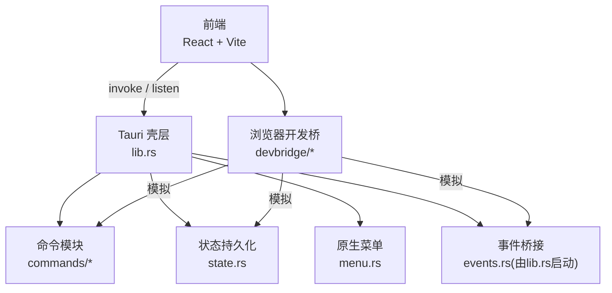
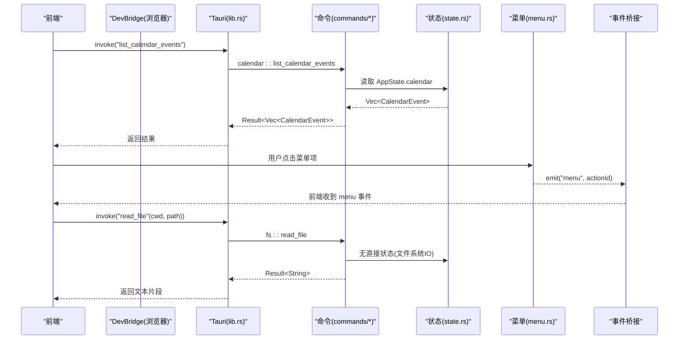
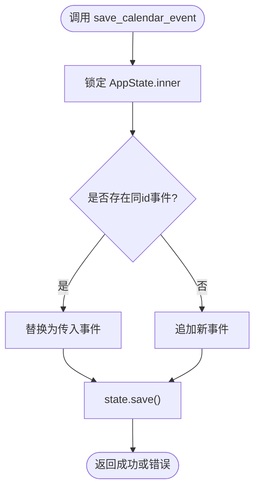
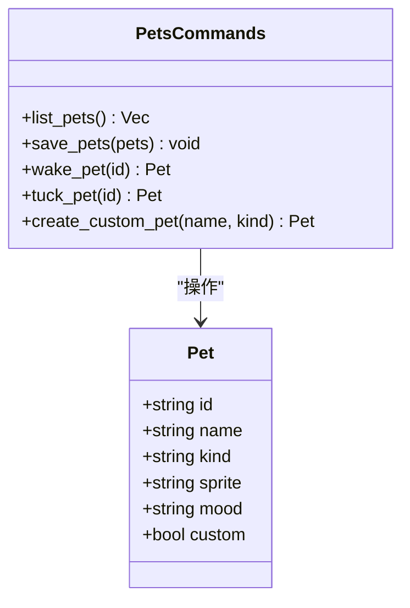
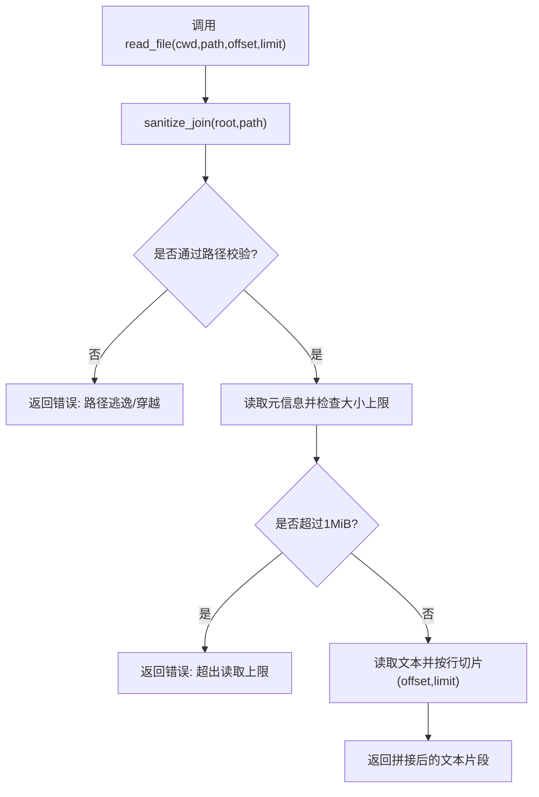
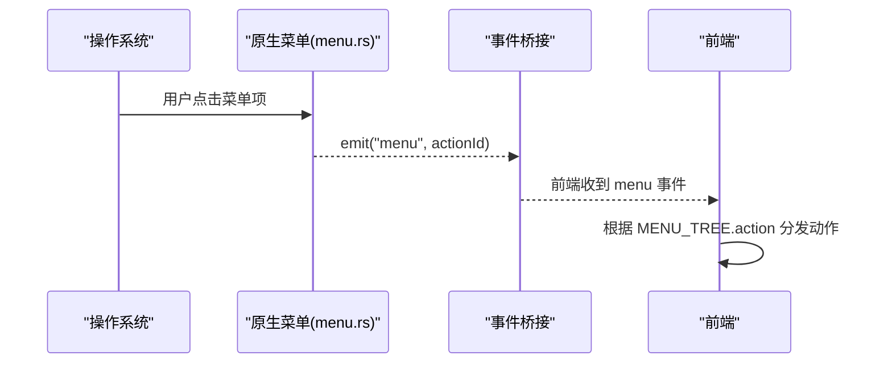
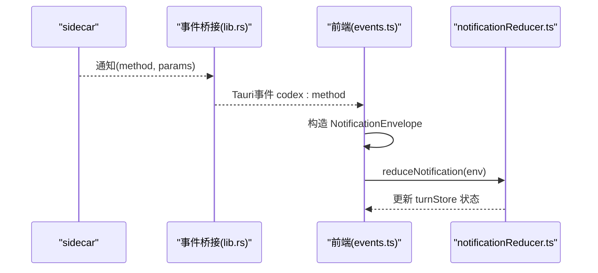
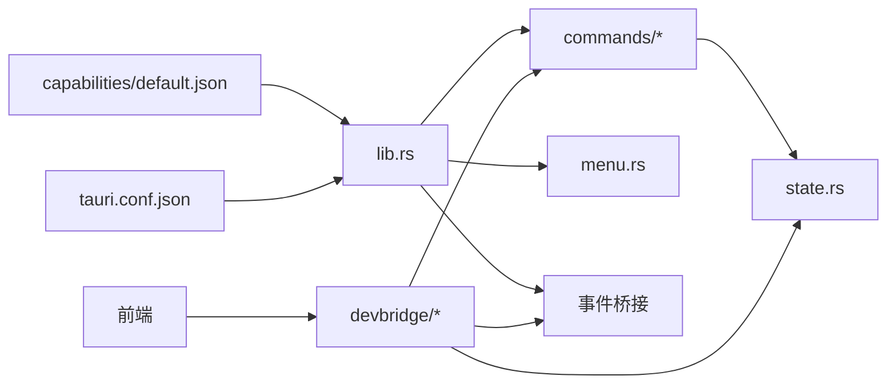

# 系统集成

<cite>
**本文引用的文件**
- [src-tauri/src/lib.rs](file://src-tauri/src/lib.rs)
- [src-tauri/src/main.rs](file://src-tauri/src/main.rs)
- [src-tauri/src/commands/mod.rs](file://src-tauri/src/commands/mod.rs)
- [src-tauri/src/commands/calendar.rs](file://src-tauri/src/commands/calendar.rs)
- [src-tauri/src/commands/pets.rs](file://src-tauri/src/commands/pets.rs)
- [src-tauri/src/commands/fs.rs](file://src-tauri/src/commands/fs.rs)
- [src-tauri/src/menu.rs](file://src-tauri/src/menu.rs)
- [src-tauri/src/state.rs](file://src-tauri/src/state.rs)
- [src-tauri/tauri.conf.json](file://src-tauri/tauri.conf.json)
- [src-tauri/capabilities/default.json](file://src-tauri/capabilities/default.json)
- [frontend/app/shell/menuTree.ts](file://frontend/app/shell/menuTree.ts)
- [frontend/app/devbridge/tauri-core.ts](file://frontend/app/devbridge/tauri-core.ts)
- [frontend/app/devbridge/commands.ts](file://frontend/app/devbridge/commands.ts)
- [frontend/app/bridge/events.ts](file://frontend/app/bridge/events.ts)
- [frontend/app/devbridge/tauri-event.ts](file://frontend/app/devbridge/tauri-event.ts)
- [frontend/app/devbridge/eventBus.ts](file://frontend/app/devbridge/eventBus.ts)
- [frontend/app/state/notificationReducer.ts](file://frontend/app/state/notificationReducer.ts)
</cite>

## 目录
1. [简介](#简介)
2. [项目结构](#项目结构)
3. [核心组件](#核心组件)
4. [架构总览](#架构总览)
5. [详细组件分析](#详细组件分析)
6. [依赖关系分析](#依赖关系分析)
7. [性能考虑](#性能考虑)
8. [故障排除指南](#故障排除指南)
9. [结论](#结论)
10. [附录：扩展新系统功能指南](#附录：扩展新系统功能指南)

## 简介
本文件面向 Codex-Tauri 的系统集成功能，聚焦以下能力：日历集成、宠物系统、文件系统访问、系统菜单与通知。文档从 Tauri 命令接口、原生能力封装、跨平台兼容性处理、权限管理入手，解释前端 UI 与后端服务的交互模式、数据格式转换、错误处理与用户体验优化，并给出安全、隐私、性能调优与故障排除建议，以及扩展新系统功能的实践指南。

## 项目结构
Codex-Tauri 采用“前端（Web）+ 后端（Tauri/Rust）”的桌面应用架构：
- 后端通过 Tauri 暴露命令（commands），管理本地状态（state），构建原生菜单（menu），并通过事件桥接将服务端通知转发到前端。
- 前端在浏览器开发模式下通过 devbridge 模拟 Tauri 命令与事件，保证开发与生产一致的行为。
- 配置与权限通过 tauri.conf.json 与 capabilities 声明式管理。

**图表来源**
- [src-tauri/src/lib.rs:16-70](file://src-tauri/src/lib.rs#L16-L70)
- [src-tauri/src/commands/mod.rs:1-11](file://src-tauri/src/commands/mod.rs#L1-L11)
- [src-tauri/src/state.rs:176-232](file://src-tauri/src/state.rs#L176-L232)
- [src-tauri/src/menu.rs:8-213](file://src-tauri/src/menu.rs#L8-L213)
- [frontend/app/devbridge/commands.ts:669-683](file://frontend/app/devbridge/commands.ts#L669-L683)

**章节来源**
- [src-tauri/src/lib.rs:16-70](file://src-tauri/src/lib.rs#L16-L70)
- [src-tauri/src/main.rs:1-7](file://src-tauri/src/main.rs#L1-L7)
- [src-tauri/tauri.conf.json:1-61](file://src-tauri/tauri.conf.json#L1-L61)
- [src-tauri/capabilities/default.json:1-31](file://src-tauri/capabilities/default.json#L1-L31)

## 核心组件
- 命令注册与路由：所有 Tauri 命令在 lib.rs 中集中注册，按功能域拆分至 commands/*。
- 状态管理与持久化：AppState 持有设置、偏好、宠物、日历等数据，提供加载、保存与快照能力。
- 原生菜单：menu.rs 构建 File/Edit/View/Help 菜单，并将点击事件以“menu”事件广播给前端。
- 事件桥接：后端将服务端通知转换为 Tauri 事件，前端统一订阅并归一化为通知流。
- 浏览器开发桥：在不具备原生能力的浏览器环境中，用内存 FS 和 localStorage 镜像 shell-state.json，保持行为一致。

**章节来源**
- [src-tauri/src/lib.rs:71-148](file://src-tauri/src/lib.rs#L71-L148)
- [src-tauri/src/state.rs:150-232](file://src-tauri/src/state.rs#L150-L232)
- [src-tauri/src/menu.rs:8-220](file://src-tauri/src/menu.rs#L8-L220)
- [frontend/app/bridge/events.ts:1-113](file://frontend/app/bridge/events.ts#L1-L113)
- [frontend/app/devbridge/commands.ts:494-601](file://frontend/app/devbridge/commands.ts#L494-L601)

## 架构总览
下图展示了从前端调用到后端命令执行、状态读写与事件回传的完整链路，涵盖日历、宠物、文件系统与菜单事件。

**图表来源**
- [src-tauri/src/lib.rs:71-148](file://src-tauri/src/lib.rs#L71-L148)
- [src-tauri/src/commands/calendar.rs:4-32](file://src-tauri/src/commands/calendar.rs#L4-L32)
- [src-tauri/src/commands/fs.rs:50-131](file://src-tauri/src/commands/fs.rs#L50-L131)
- [src-tauri/src/menu.rs:215-220](file://src-tauri/src/menu.rs#L215-L220)
- [frontend/app/bridge/events.ts:23-30](file://frontend/app/bridge/events.ts#L23-L30)

## 详细组件分析

### 日历集成
- 能力概述：列出、新增/更新、删除日历事件；数据持久化到 shell-state.json。
- 关键命令：
  - list_calendar_events：返回当前日历事件列表。
  - save_calendar_event：根据 id 判断新增或更新，随后持久化。
  - delete_calendar_event：按 id 移除事件并持久化。
- 数据结构：CalendarEvent 包含 id、title、starts_at、ends_at、notes。
- 错误处理：锁获取失败、持久化失败均转为字符串错误返回。
- 前端兼容：浏览器开发模式下，commands.ts 中的 storeCommands 实现相同语义，使用 localStorage 镜像 shell-state.json。

**图表来源**
- [src-tauri/src/commands/calendar.rs:14-24](file://src-tauri/src/commands/calendar.rs#L14-L24)
- [src-tauri/src/state.rs:209-217](file://src-tauri/src/state.rs#L209-L217)

**章节来源**
- [src-tauri/src/commands/calendar.rs:1-33](file://src-tauri/src/commands/calendar.rs#L1-L33)
- [src-tauri/src/state.rs:79-89](file://src-tauri/src/state.rs#L79-L89)
- [frontend/app/devbridge/commands.ts:473-485](file://frontend/app/devbridge/commands.ts#L473-L485)

### 宠物系统
- 能力概述：列出、批量保存、唤醒/安抚宠物、创建自定义宠物；数据持久化。
- 关键命令：
  - list_pets：返回宠物列表。
  - save_pets：覆盖保存整个宠物列表。
  - wake_pet/tuck_pet：修改指定宠物的心情并持久化。
  - create_custom_pet：生成带唯一 id 的新宠物并持久化。
- 数据结构：Pet 包含 id、name、kind、sprite、mood、custom。
- 错误处理：未找到宠物时返回错误；锁与持久化失败均上报。
- 前端兼容：浏览器开发模式下的 storeCommands 提供等价实现。

**图表来源**
- [src-tauri/src/commands/pets.rs:4-65](file://src-tauri/src/commands/pets.rs#L4-L65)
- [src-tauri/src/state.rs:66-77](file://src-tauri/src/state.rs#L66-L77)

**章节来源**
- [src-tauri/src/commands/pets.rs:1-66](file://src-tauri/src/commands/pets.rs#L1-L66)
- [frontend/app/devbridge/commands.ts:450-471](file://frontend/app/devbridge/commands.ts#L450-L471)

### 文件系统访问
- 能力概述：列举工作区文件、读取文件（支持分页）、写入文件；内置路径校验与安全限制。
- 关键命令：
  - list_files(cwd, dir)：过滤隐藏目录与忽略目录，返回目录条目。
  - read_file(cwd, path, offset, limit)：限制最大读取大小，按行分页返回。
  - write_file(cwd, path, content)：自动创建父目录后写入。
- 安全策略：sanitize_join 拒绝路径穿越，确保目标路径位于工作区根下；读文件上限 1MiB。
- 错误处理：非法目录、路径逃逸、IO 错误均返回明确错误信息。
- 前端兼容：浏览器开发模式使用内存虚拟 FS，保持一致的 API 行为。

**图表来源**
- [src-tauri/src/commands/fs.rs:31-48](file://src-tauri/src/commands/fs.rs#L31-L48)
- [src-tauri/src/commands/fs.rs:101-121](file://src-tauri/src/commands/fs.rs#L101-L121)

**章节来源**
- [src-tauri/src/commands/fs.rs:1-132](file://src-tauri/src/commands/fs.rs#L1-L132)
- [frontend/app/devbridge/commands.ts:537-581](file://frontend/app/devbridge/commands.ts#L537-L581)

### 系统菜单与事件
- 能力概述：构建原生菜单（File/Edit/View/Help），绑定快捷键，点击后以“menu”事件广播 actionId。
- 前端同步：menuTree.ts 定义前端标题栏菜单树与动作映射，与原生菜单保持一致。
- 事件处理：前端通过 events.ts 监听“menu”事件并分发到对应动作处理器。

**图表来源**
- [src-tauri/src/menu.rs:8-213](file://src-tauri/src/menu.rs#L8-L213)
- [src-tauri/src/menu.rs:215-220](file://src-tauri/src/menu.rs#L215-L220)
- [frontend/app/shell/menuTree.ts:24-79](file://frontend/app/shell/menuTree.ts#L24-L79)
- [frontend/app/bridge/events.ts:23-30](file://frontend/app/bridge/events.ts#L23-L30)

**章节来源**
- [src-tauri/src/menu.rs:1-220](file://src-tauri/src/menu.rs#L1-L220)
- [frontend/app/shell/menuTree.ts:1-87](file://frontend/app/shell/menuTree.ts#L1-L87)
- [frontend/app/bridge/events.ts:1-113](file://frontend/app/bridge/events.ts#L1-L113)

### 通知与事件桥接
- 后端事件：lib.rs 启动事件桥接，将 sidecar 通知转发为 Tauri 事件。
- 前端接收：events.ts 将方法名规范化为 Tauri 事件名并订阅，构造 NotificationEnvelope。
- 状态归一化：notificationReducer.ts 将各类通知映射到 turnStore 的状态变更，包括消息、命令输出、计划、错误与警告等。
- 浏览器兼容：tauri-event.ts 与 eventBus.ts 提供 listen/emit 的内存实现，使开发体验一致。

**图表来源**
- [src-tauri/src/lib.rs:62-68](file://src-tauri/src/lib.rs#L62-L68)
- [frontend/app/bridge/events.ts:23-30](file://frontend/app/bridge/events.ts#L23-L30)
- [frontend/app/state/notificationReducer.ts:189-445](file://frontend/app/state/notificationReducer.ts#L189-L445)
- [frontend/app/devbridge/tauri-event.ts:13-22](file://frontend/app/devbridge/tauri-event.ts#L13-L22)
- [frontend/app/devbridge/eventBus.ts:21-46](file://frontend/app/devbridge/eventBus.ts#L21-L46)

**章节来源**
- [frontend/app/bridge/events.ts:1-113](file://frontend/app/bridge/events.ts#L1-L113)
- [frontend/app/state/notificationReducer.ts:1-446](file://frontend/app/state/notificationReducer.ts#L1-L446)
- [frontend/app/devbridge/tauri-event.ts:1-22](file://frontend/app/devbridge/tauri-event.ts#L1-L22)
- [frontend/app/devbridge/eventBus.ts:1-46](file://frontend/app/devbridge/eventBus.ts#L1-L46)

## 依赖关系分析
- 命令与状态：commands/* 通过 AppState 读写共享状态，所有写操作最终调用 state.save() 持久化。
- 菜单与事件：menu.rs 仅负责构建菜单与广播事件，不直接操作业务状态。
- 前端桥接：devbridge 在浏览器环境下模拟 Tauri 命令与事件，避免环境差异导致的行为不一致。
- 权限与配置：capabilities 声明窗口、对话框、shell、fs、store 等权限；tauri.conf.json 控制资源、插件与安全策略。

**图表来源**
- [src-tauri/src/lib.rs:16-70](file://src-tauri/src/lib.rs#L16-L70)
- [src-tauri/capabilities/default.json:1-31](file://src-tauri/capabilities/default.json#L1-L31)
- [src-tauri/tauri.conf.json:1-61](file://src-tauri/tauri.conf.json#L1-L61)
- [frontend/app/devbridge/commands.ts:669-683](file://frontend/app/devbridge/commands.ts#L669-L683)

**章节来源**
- [src-tauri/src/lib.rs:16-70](file://src-tauri/src/lib.rs#L16-L70)
- [src-tauri/capabilities/default.json:1-31](file://src-tauri/capabilities/default.json#L1-L31)
- [src-tauri/tauri.conf.json:1-61](file://src-tauri/tauri.conf.json#L1-L61)
- [frontend/app/devbridge/commands.ts:669-683](file://frontend/app/devbridge/commands.ts#L669-L683)

## 性能考虑
- 状态并发：AppState.inner 使用 Mutex 保护，命令中先 lock 再 drop 锁以减少持锁时间，降低竞争。
- 文件读取限制：read_file 限制单次读取大小（1MiB），并按行分页，避免大文件阻塞 UI。
- 事件批处理：通知归一化与 reducer 设计减少不必要的重渲染，提升 UI 响应性。
- 浏览器开发桥：内存 FS 与 localStorage 镜像避免网络 IO，提高开发效率。

[本节为通用性能指导，不直接分析具体文件]

## 故障排除指南
- 命令不可用：确认 lib.rs 已注册对应命令；浏览器模式下检查 dispatchCommand 是否能匹配 handler。
- 菜单事件未触发：检查 menu.rs 是否构建了菜单且 on_menu_event 正确 emit；前端是否正确监听“menu”事件。
- 文件访问失败：验证 cwd 是否为目录；sanitize_join 是否拒绝路径穿越；权限是否在 capabilities 中启用。
- 状态未持久化：确认 state.save() 是否被调用；检查 shell-state.json.tmp 写入与 rename 是否成功。
- 通知丢失：确认事件桥接已启动；前端 events.ts 是否正确订阅；notificationReducer 是否缺少对应方法处理。

**章节来源**
- [src-tauri/src/lib.rs:71-148](file://src-tauri/src/lib.rs#L71-L148)
- [src-tauri/src/menu.rs:215-220](file://src-tauri/src/menu.rs#L215-L220)
- [src-tauri/src/commands/fs.rs:31-48](file://src-tauri/src/commands/fs.rs#L31-L48)
- [src-tauri/src/state.rs:209-217](file://src-tauri/src/state.rs#L209-L217)
- [frontend/app/bridge/events.ts:99-113](file://frontend/app/bridge/events.ts#L99-L113)
- [frontend/app/state/notificationReducer.ts:437-445](file://frontend/app/state/notificationReducer.ts#L437-L445)

## 结论
Codex-Tauri 通过清晰的命令分层、统一的状态持久化、原生菜单与事件桥接，实现了日历、宠物、文件系统、菜单与通知的系统级集成。前后端在浏览器开发模式下保持高度一致的抽象，便于开发与调试。结合权限声明与安全策略，系统在跨平台桌面环境中提供了稳定、可扩展的集成能力。

[本节为总结性内容，不直接分析具体文件]

## 附录：扩展新系统功能指南
- 新增命令
  - 在 commands/* 中添加模块并在 mod.rs 中导出。
  - 在 lib.rs 的 generate_handler! 中注册命令。
  - 如需持久化，复用 AppState 与 state.save()。
- 新增菜单项
  - 在 menu.rs 中增加 MenuItem/Submenu，并在 on_menu_event 中广播 actionId。
  - 在前端 menuTree.ts 中补充对应的 action 与 i18n key。
- 新增通知类型
  - 在后端事件桥接中发送新的 method。
  - 在前端 events.ts 中确保方法名映射正确。
  - 在 notificationReducer.ts 中增加处理方法，更新 turnStore。
- 权限与配置
  - 在 capabilities/default.json 中申请所需权限（如 fs、dialog、shell）。
  - 在 tauri.conf.json 中调整安全策略与资源打包。
- 浏览器开发兼容
  - 在 devbridge/commands.ts 中实现同名 handler，保证行为一致。
  - 在 devbridge/tauri-event.ts 与 eventBus.ts 中使用内存事件总线。

**章节来源**
- [src-tauri/src/commands/mod.rs:1-11](file://src-tauri/src/commands/mod.rs#L1-L11)
- [src-tauri/src/lib.rs:71-148](file://src-tauri/src/lib.rs#L71-L148)
- [src-tauri/src/menu.rs:8-213](file://src-tauri/src/menu.rs#L8-L213)
- [frontend/app/shell/menuTree.ts:24-79](file://frontend/app/shell/menuTree.ts#L24-L79)
- [frontend/app/state/notificationReducer.ts:189-445](file://frontend/app/state/notificationReducer.ts#L189-L445)
- [src-tauri/capabilities/default.json:1-31](file://src-tauri/capabilities/default.json#L1-L31)
- [src-tauri/tauri.conf.json:1-61](file://src-tauri/tauri.conf.json#L1-L61)
- [frontend/app/devbridge/commands.ts:669-683](file://frontend/app/devbridge/commands.ts#L669-L683)