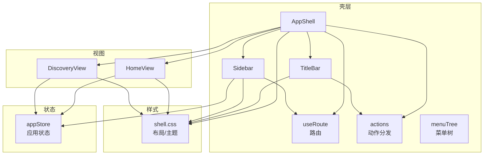
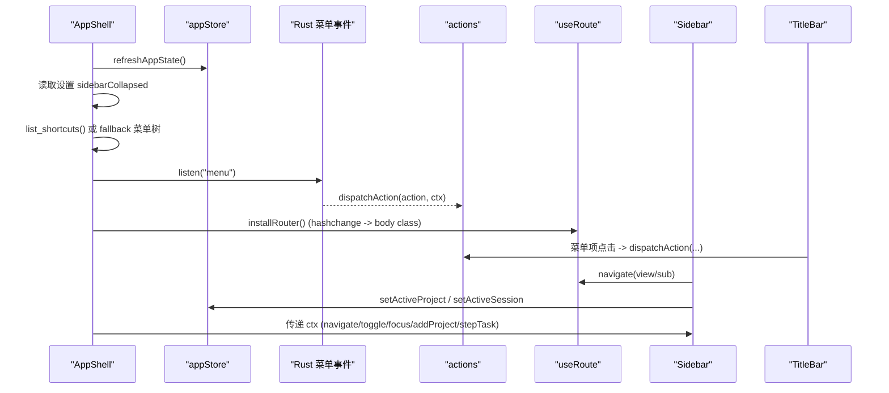
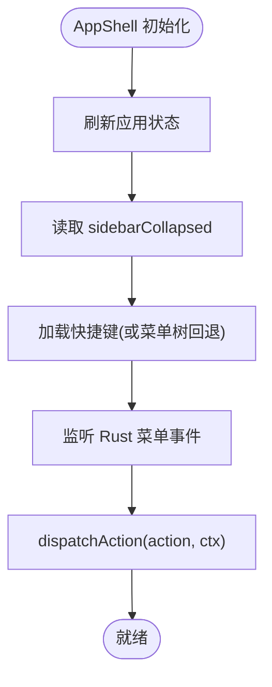
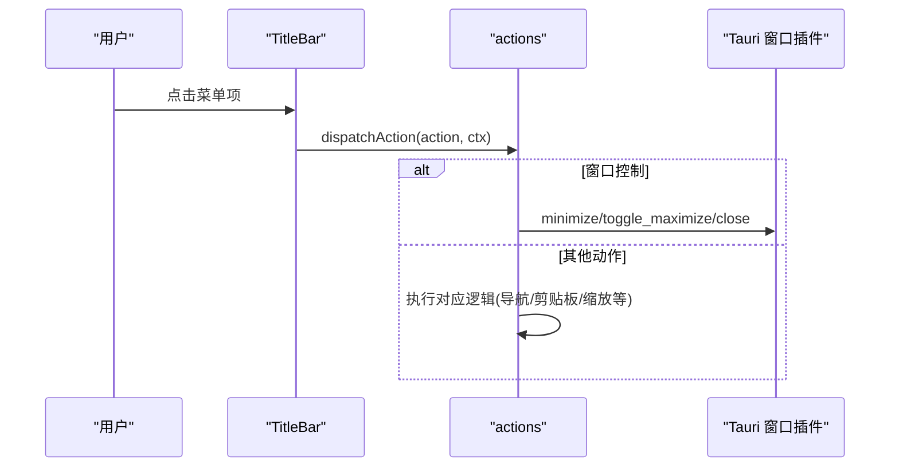
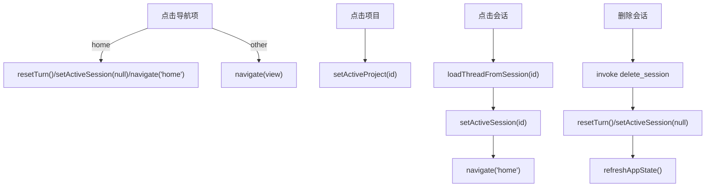
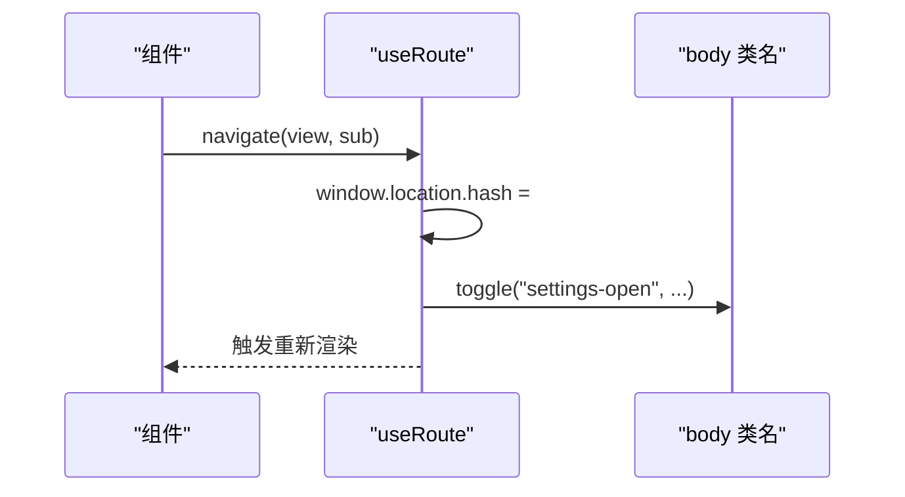
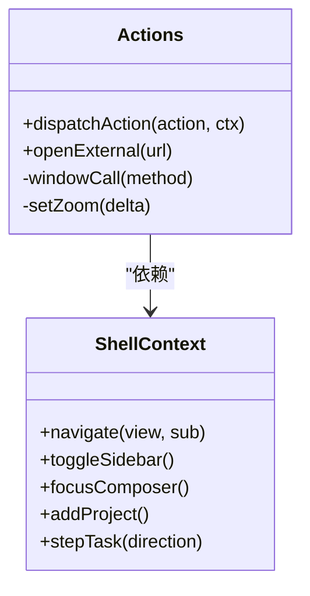
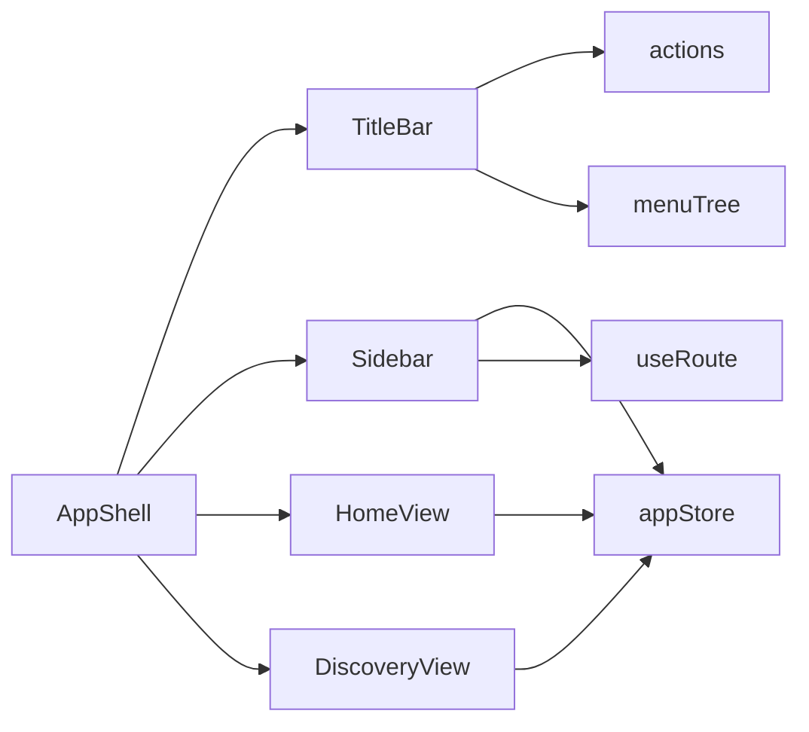

# 主界面

<cite>
**本文引用的文件**
- [AppShell.tsx](file://frontend/app/shell/AppShell.tsx)
- [Sidebar.tsx](file://frontend/app/shell/Sidebar.tsx)
- [TitleBar.tsx](file://frontend/app/shell/TitleBar.tsx)
- [useRoute.ts](file://frontend/app/shell/useRoute.ts)
- [actions.ts](file://frontend/app/shell/actions.ts)
- [menuTree.ts](file://frontend/app/shell/menuTree.ts)
- [HomeView.tsx](file://frontend/app/views/HomeView.tsx)
- [DiscoveryView.tsx](file://frontend/app/views/DiscoveryView.tsx)
- [appStore.ts](file://frontend/app/state/appStore.ts)
- [shell.css](file://frontend/src/styles/shell.css)
</cite>

## 目录
1. [简介](#简介)
2. [项目结构](#项目结构)
3. [核心组件](#核心组件)
4. [架构总览](#架构总览)
5. [详细组件分析](#详细组件分析)
6. [依赖关系分析](#依赖关系分析)
7. [性能考虑](#性能考虑)
8. [故障排查指南](#故障排查指南)
9. [结论](#结论)
10. [附录：使用示例与扩展方法](#附录使用示例与扩展方法)

## 简介
本文件为 Codex-Tauri 主界面的权威文档，聚焦应用壳层 AppShell 的整体架构与交互实现，覆盖标题栏、侧边栏、主视图容器、路由机制、状态持久化、主题适配与响应式布局。读者可据此理解并扩展主界面行为，包括菜单系统、快捷键处理、窗口控制、会话管理、项目切换以及主页与发现视图的渲染逻辑。

## 项目结构
主界面由 React 前端构成，采用“壳层 + 视图”的分层组织方式：
- 壳层（shell）：负责全局布局、导航、菜单、快捷键、窗口控制与上下文注入
- 视图（views）：具体页面内容，如首页对话、发现页（计划任务、插件、拉取请求）
- 状态（state）：应用级状态（会话、项目、设置等），通过外部 store 暴露给任意组件
- 样式（styles）：基于 CSS 变量与 body 类名的响应式与主题适配

图表来源
- [AppShell.tsx:1-205](file://frontend/app/shell/AppShell.tsx#L1-L205)
- [TitleBar.tsx:1-164](file://frontend/app/shell/TitleBar.tsx#L1-L164)
- [Sidebar.tsx:1-338](file://frontend/app/shell/Sidebar.tsx#L1-L338)
- [useRoute.ts:1-79](file://frontend/app/shell/useRoute.ts#L1-L79)
- [actions.ts:1-201](file://frontend/app/shell/actions.ts#L1-L201)
- [menuTree.ts:1-87](file://frontend/app/shell/menuTree.ts#L1-L87)
- [HomeView.tsx:1-207](file://frontend/app/views/HomeView.tsx#L1-L207)
- [DiscoveryView.tsx:1-800](file://frontend/app/views/DiscoveryView.tsx#L1-L800)
- [appStore.ts:1-200](file://frontend/app/state/appStore.ts#L1-L200)
- [shell.css:1-200](file://frontend/src/styles/shell.css#L1-L200)

章节来源
- [AppShell.tsx:1-205](file://frontend/app/shell/AppShell.tsx#L1-L205)
- [shell.css:1-200](file://frontend/src/styles/shell.css#L1-L200)

## 核心组件
- AppShell：应用壳层入口，组合标题栏、侧边栏与主视图容器；初始化全局快捷键、监听原生菜单事件、维护侧边栏折叠状态与设置持久化。
- TitleBar：无框标题栏，包含导航按钮、菜单栏（File/Edit/View/Help）、窗口控制（最小化/最大化/关闭）。
- Sidebar：品牌区、主导航、项目列表、最近会话、模型与思考等级选择、待决权限提示、底部账户与帮助入口。
- HomeView：对话主视图，包含空态引导卡片、线程流与输入框；根据活跃会话加载历史。
- DiscoveryView：发现视图集合（计划任务、插件、拉取请求），统一数据获取与本地回退策略。
- useRoute：Hash 路由，支持 view/subpage 形式，同步到 body 类名以驱动样式。
- actions：集中式动作分发器，将菜单/快捷键/窗口控制映射到具体行为。
- menuTree：菜单树定义，作为菜单渲染与快捷键绑定的单一事实源。
- appStore：应用状态（会话、项目、设置、引擎状态），提供订阅与刷新能力。

章节来源
- [AppShell.tsx:78-205](file://frontend/app/shell/AppShell.tsx#L78-L205)
- [TitleBar.tsx:26-164](file://frontend/app/shell/TitleBar.tsx#L26-L164)
- [Sidebar.tsx:89-338](file://frontend/app/shell/Sidebar.tsx#L89-L338)
- [HomeView.tsx:135-207](file://frontend/app/views/HomeView.tsx#L135-L207)
- [DiscoveryView.tsx:261-800](file://frontend/app/views/DiscoveryView.tsx#L261-L800)
- [useRoute.ts:1-79](file://frontend/app/shell/useRoute.ts#L1-L79)
- [actions.ts:1-201](file://frontend/app/shell/actions.ts#L1-L201)
- [menuTree.ts:1-87](file://frontend/app/shell/menuTree.ts#L1-L87)
- [appStore.ts:1-200](file://frontend/app/state/appStore.ts#L1-L200)

## 架构总览
AppShell 在启动时：
- 从后端刷新应用状态（会话、项目、设置）
- 恢复侧边栏折叠状态（读取设置）
- 加载用户自定义快捷键（若失败则回退到菜单树中的默认绑定）
- 监听来自 Rust 菜单的事件，统一分派到 actions
- 注册全局快捷键调度器，将按键事件映射到同一动作路径

图表来源
- [AppShell.tsx:84-186](file://frontend/app/shell/AppShell.tsx#L84-L186)
- [actions.ts:57-201](file://frontend/app/shell/actions.ts#L57-L201)
- [useRoute.ts:48-79](file://frontend/app/shell/useRoute.ts#L48-L79)
- [TitleBar.tsx:92-128](file://frontend/app/shell/TitleBar.tsx#L92-L128)
- [Sidebar.tsx:170-192](file://frontend/app/shell/Sidebar.tsx#L170-L192)

## 详细组件分析

### 应用壳层 AppShell
- 职责：组装标题栏、侧边栏与主视图；管理全局快捷键与菜单事件；维护侧边栏折叠与设置持久化；提供 ShellContext 供子组件调用导航、焦点、项目选择与会话切换。
- 关键流程：
  - 启动时刷新应用状态与设置
  - 监听 Rust 菜单事件并转发到 actions
  - 使用 useShortcutDispatcher 将快捷键映射到同一动作路径
  - 根据当前路由决定主视图与设置视图的显示

图表来源
- [AppShell.tsx:84-186](file://frontend/app/shell/AppShell.tsx#L84-L186)

章节来源
- [AppShell.tsx:78-205](file://frontend/app/shell/AppShell.tsx#L78-L205)

### 标题栏 TitleBar
- 功能：
  - 导航按钮（后退/前进）
  - 菜单栏（File/Edit/View/Help），菜单项来自 menuTree，支持 i18n 标签与快捷键显示
  - 窗口控制（最小化/最大化/关闭），通过 actions 调用 Tauri 窗口插件
- 交互：
  - 点击菜单项触发 dispatchAction
  - 点击窗口控制按钮触发对应窗口操作
  - 打开菜单后点击外部区域或按 Escape 关闭

图表来源
- [TitleBar.tsx:92-164](file://frontend/app/shell/TitleBar.tsx#L92-L164)
- [actions.ts:39-47](file://frontend/app/shell/actions.ts#L39-L47)

章节来源
- [TitleBar.tsx:26-164](file://frontend/app/shell/TitleBar.tsx#L26-L164)
- [actions.ts:39-47](file://frontend/app/shell/actions.ts#L39-L47)

### 侧边栏 Sidebar
- 功能：
  - 顶部导航（新建任务、拉取请求、计划任务、插件）
  - 待决权限请求徽章（点击进入主页）
  - 模型与思考等级快速调节（下拉选择并保存设置）
  - 项目列表（切换活跃项目）
  - 最近会话列表（点击加载线程并切换到主页）
  - 底部账户与帮助入口
- 状态与持久化：
  - 通过 appStore 读写 sessions/projects/settings
  - 删除会话调用后端 IPC，成功后重置 turn 并刷新状态
  - 模型与思考等级变更写入设置

图表来源
- [Sidebar.tsx:123-127](file://frontend/app/shell/Sidebar.tsx#L123-L127)
- [Sidebar.tsx:170-192](file://frontend/app/shell/Sidebar.tsx#L170-L192)
- [Sidebar.tsx:232-255](file://frontend/app/shell/Sidebar.tsx#L232-L255)
- [Sidebar.tsx:257-297](file://frontend/app/shell/Sidebar.tsx#L257-L297)
- [Sidebar.tsx:105-121](file://frontend/app/shell/Sidebar.tsx#L105-L121)

章节来源
- [Sidebar.tsx:89-338](file://frontend/app/shell/Sidebar.tsx#L89-L338)

### 路由 useRoute
- 机制：基于 URL hash（view 或 view/subpage），通过 useSyncExternalStore 暴露给任意组件读取
- 副作用：将路由变化同步到 body 类名（如 settings-open），以便样式规则生效
- 导航：navigate(view, sub?) 更新 hash 并触发重绘

图表来源
- [useRoute.ts:48-79](file://frontend/app/shell/useRoute.ts#L48-L79)

章节来源
- [useRoute.ts:1-79](file://frontend/app/shell/useRoute.ts#L1-L79)

### 动作分发 actions
- 职责：将菜单/快捷键/窗口控制等动作统一映射到具体实现
- 典型动作：
  - 新建任务/无项目任务：重置 turn、清空会话、导航到 home
  - 设置/关于/键盘快捷键：导航到 settings 子页面
  - 剪贴板操作：通过 execCommand 调用系统剪贴板
  - 窗口控制：调用 Tauri 窗口插件
  - 缩放/全屏：调整 zoom 或进入全屏
  - 任务切换：stepTask(-1/1) 循环活跃会话

图表来源
- [actions.ts:18-28](file://frontend/app/shell/actions.ts#L18-L28)
- [actions.ts:57-201](file://frontend/app/shell/actions.ts#L57-L201)

章节来源
- [actions.ts:1-201](file://frontend/app/shell/actions.ts#L1-L201)

### 菜单树 menuTree
- 作用：定义 File/Edit/View/Help 四个菜单的条目，包含 action、i18n key、快捷键字符串
- 特点：作为菜单渲染与快捷键匹配的唯一来源，避免 UI 与行为不一致

章节来源
- [menuTree.ts:1-87](file://frontend/app/shell/menuTree.ts#L1-L87)

### 主页视图 HomeView
- 渲染逻辑：
  - 当没有历史且不在运行中，显示 Hero 引导区（含提示卡片）
  - 否则显示 TurnStream 与 Composer
  - 监听 activeSessionId 变化，必要时加载线程历史
  - 启动时探测引擎状态，用于空态与诊断
- 交互：
  - 提示卡片派发 codex:use-prompt 事件，由 Composer 消费
  - 会话创建回调更新活跃会话 ID

章节来源
- [HomeView.tsx:1-207](file://frontend/app/views/HomeView.tsx#L1-L207)

### 发现视图 DiscoveryView
- 路由分发：根据 view 参数渲染 Scheduled/Plugins/PullRequests
- 数据获取：
  - 使用 useBackendList 封装 invoke 调用，失败时回退到 localStorage 或内置种子数据
  - 支持搜索、过滤、手动创建与开关状态持久化
- 计划任务：
  - 支持每日/工作日/每周/自定义 cron 时间
  - 提供抽屉表单与菜单选择器，保存后刷新列表

章节来源
- [DiscoveryView.tsx:1-800](file://frontend/app/views/DiscoveryView.tsx#L1-L800)

## 依赖关系分析
- AppShell 依赖：
  - TitleBar、Sidebar、useRoute、actions、menuTree、HomeView、DiscoveryView、SettingsShell
  - appStore 提供应用状态与设置
- TitleBar 依赖：
  - menuTree 渲染菜单项
  - actions 处理菜单点击与窗口控制
- Sidebar 依赖：
  - appStore 读写项目与会话
  - useRoute 进行导航
  - actions 触发查找等动作
- HomeView/DiscoveryView 依赖：
  - appStore 与 turnStore（会话与线程）
  - Tauri invoke 调用后端命令

图表来源
- [AppShell.tsx:14-24](file://frontend/app/shell/AppShell.tsx#L14-L24)
- [TitleBar.tsx:9-13](file://frontend/app/shell/TitleBar.tsx#L9-L13)
- [Sidebar.tsx:7-27](file://frontend/app/shell/Sidebar.tsx#L7-L27)
- [HomeView.tsx:14-29](file://frontend/app/views/HomeView.tsx#L14-L29)
- [DiscoveryView.tsx:26-31](file://frontend/app/views/DiscoveryView.tsx#L26-L31)

章节来源
- [AppShell.tsx:14-24](file://frontend/app/shell/AppShell.tsx#L14-L24)
- [TitleBar.tsx:9-13](file://frontend/app/shell/TitleBar.tsx#L9-L13)
- [Sidebar.tsx:7-27](file://frontend/app/shell/Sidebar.tsx#L7-L27)
- [HomeView.tsx:14-29](file://frontend/app/views/HomeView.tsx#L14-L29)
- [DiscoveryView.tsx:26-31](file://frontend/app/views/DiscoveryView.tsx#L26-L31)

## 性能考虑
- 状态刷新：
  - AppShell 启动时仅一次刷新应用状态，避免频繁 IPC
  - 侧边栏删除会话后按需刷新，减少不必要的全量更新
- 路由与渲染：
  - Hash 路由轻量，无需额外路由库开销
  - 使用 useSyncExternalStore 订阅外部状态，避免重复计算
- 数据回退：
  - DiscoveryView 在 IPC 不可用时回退到 localStorage 或种子数据，保证预览体验
- 主题与布局：
  - 通过 body 类名切换布局（sidebar-collapsed、settings-open），复用现有 CSS 规则，减少 JS 样式操作

[本节为通用指导，不直接分析具体文件]

## 故障排查指南
- 菜单/快捷键无效：
  - 检查 menuTree 是否定义了相应 action 与 keys
  - 确认 AppShell 已加载快捷键列表（list_shortcuts），失败时使用菜单树回退
  - 查看 actions 是否包含对应 case 分支
- 窗口控制无效：
  - 确认 actions.windowCall 调用的 Tauri 插件名称与方法正确
  - 检查错误日志输出
- 侧边栏折叠状态未持久化：
  - 确认 get_settings/save_settings 调用成功
  - 检查 body.sidebar-collapsed 类名是否正确切换
- 会话删除失败：
  - 检查 delete_session IPC 返回值与异常
  - 确认删除后 resetTurn 与 refreshAppState 被调用

章节来源
- [actions.ts:39-47](file://frontend/app/shell/actions.ts#L39-L47)
- [AppShell.tsx:90-110](file://frontend/app/shell/AppShell.tsx#L90-L110)
- [Sidebar.tsx:105-121](file://frontend/app/shell/Sidebar.tsx#L105-L121)

## 结论
Codex-Tauri 主界面通过 AppShell 将标题栏、侧边栏与主视图有机组合，借助 actions 与 menuTree 实现统一的菜单与快捷键处理，使用 useRoute 管理路由与样式联动，appStore 提供跨组件共享状态。该设计保证了可扩展性、一致性与良好的用户体验。

[本节为总结，不直接分析具体文件]

## 附录：使用示例与扩展方法
- 添加新菜单项：
  - 在 menuTree 中添加条目（action、key、keys）
  - 在 actions 中实现对应 case 分支
  - 在 TitleBar 中自动渲染（无需额外改动）
- 新增快捷键：
  - 在 menuTree 中配置 keys，或在后端 list_shortcuts 返回自定义绑定
  - AppShell 会合并并分发到 actions
- 扩展侧边栏导航：
  - 在 NAV_ITEMS 中添加新项，并在 Sidebar 中处理点击逻辑（如需）
  - 通过 navigate(view/sub) 跳转
- 自定义主题与布局：
  - 修改 shell.css 中的 CSS 变量与 body 类名规则
  - 利用 sidebar-collapsed/settings-open 等类名控制布局
- 集成后端 IPC：
  - 使用 @tauri-apps/api/core 的 invoke 调用后端命令
  - 在 DiscoveryView 中参考 useBackendList 的错误处理与本地回退模式

[本节为通用指导，不直接分析具体文件]