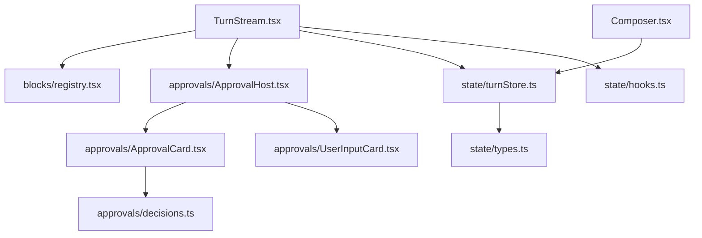
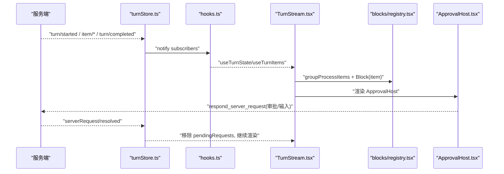
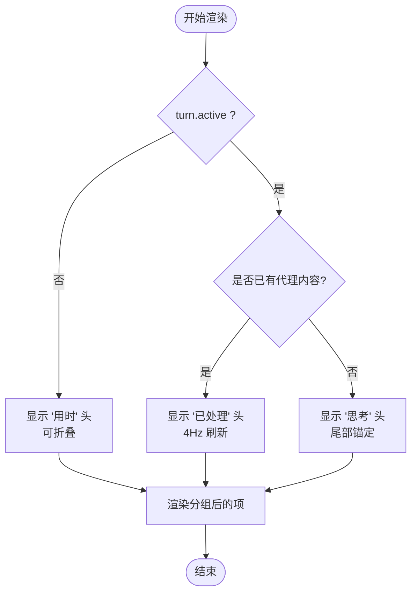
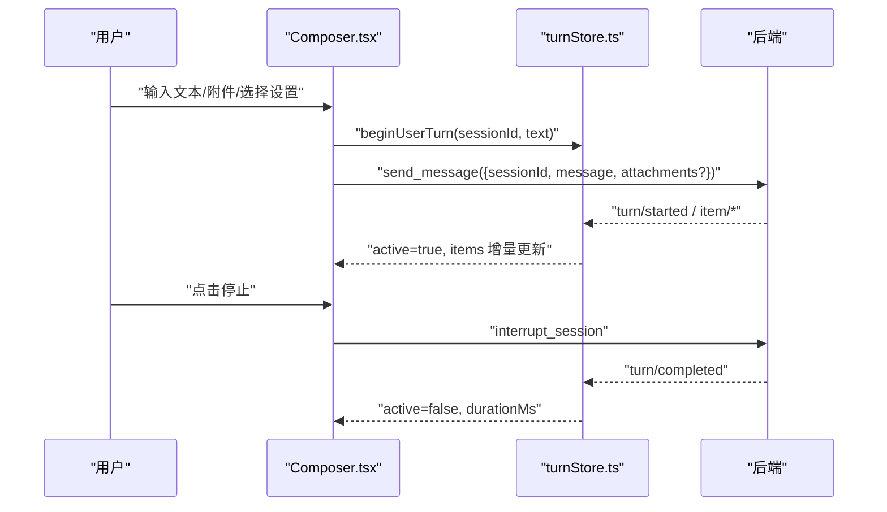
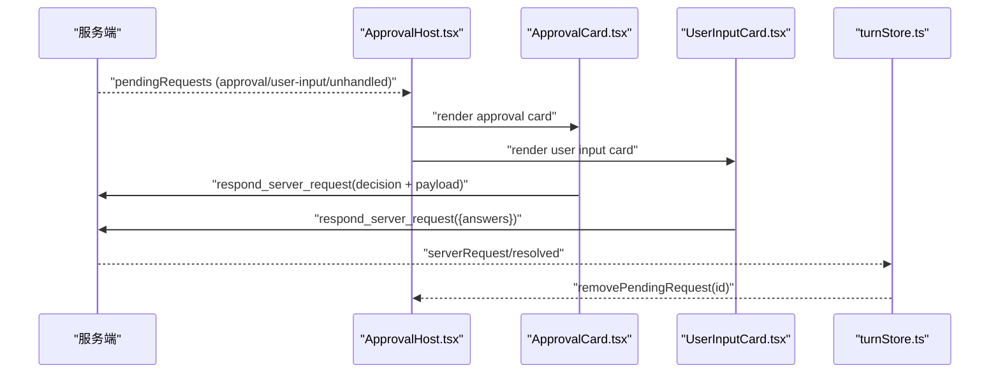
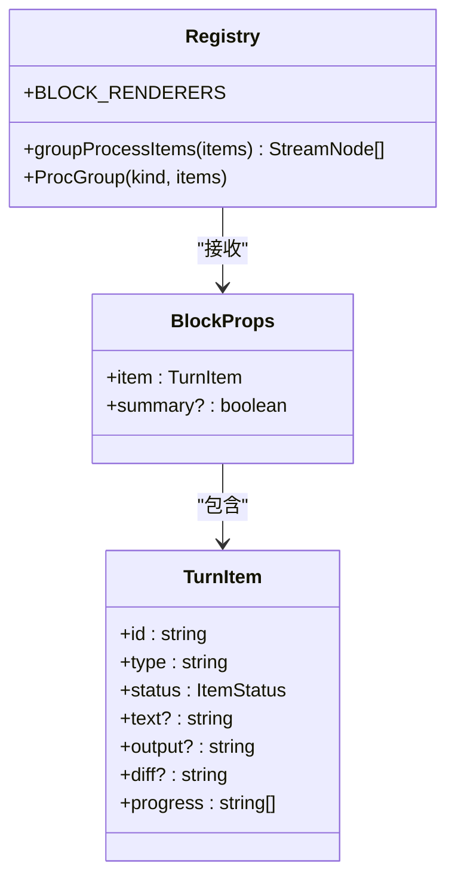
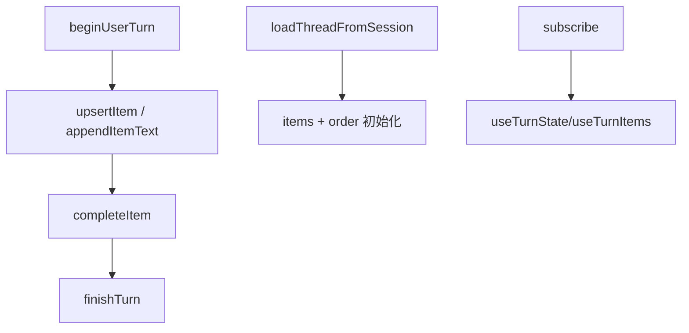
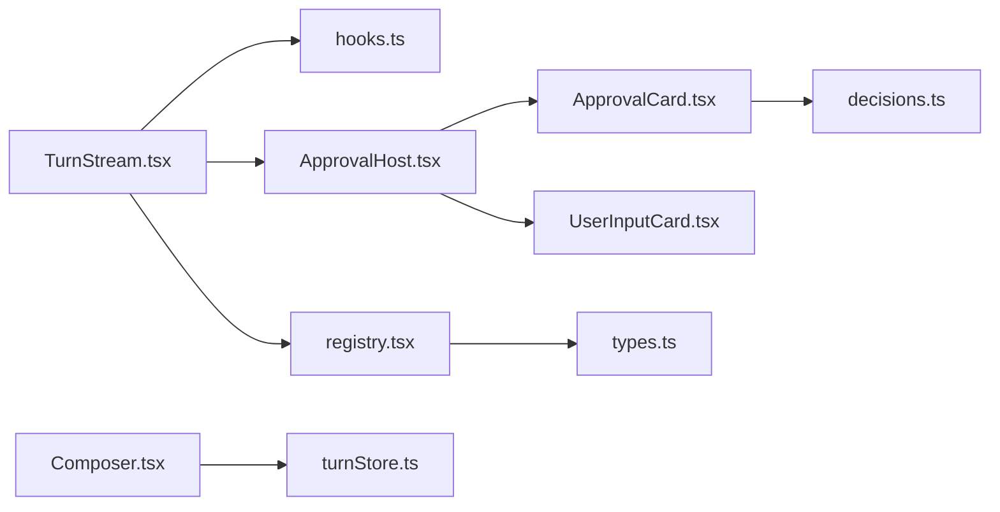

# 消息界面

<cite>
**本文引用的文件**
- [TurnStream.tsx](file://frontend/app/views/TurnStream.tsx)
- [Composer.tsx](file://frontend/app/views/Composer.tsx)
- [ApprovalHost.tsx](file://frontend/app/approvals/ApprovalHost.tsx)
- [ApprovalCard.tsx](file://frontend/app/approvals/ApprovalCard.tsx)
- [UserInputCard.tsx](file://frontend/app/approvals/UserInputCard.tsx)
- [decisions.ts](file://frontend/app/approvals/decisions.ts)
- [registry.tsx](file://frontend/app/blocks/registry.tsx)
- [turnStore.ts](file://frontend/app/state/turnStore.ts)
- [types.ts](file://frontend/app/state/types.ts)
- [hooks.ts](file://frontend/app/state/hooks.ts)
</cite>

## 目录
1. [简介](#简介)
2. [项目结构](#项目结构)
3. [核心组件](#核心组件)
4. [架构总览](#架构总览)
5. [详细组件分析](#详细组件分析)
6. [依赖关系分析](#依赖关系分析)
7. [性能考量](#性能考量)
8. [故障排查指南](#故障排查指南)
9. [结论](#结论)
10. [附录：扩展与自定义](#附录：扩展与自定义)

## 简介
本文件面向 Codex-Tauri 的消息界面，聚焦以下目标：
- 解释 TurnStream 的实时渲染机制：消息类型识别、富文本展示、代码高亮与工具执行可视化。
- 详解 Composer 输入组件：多行输入、自动完成、语法提示（通过外部事件注入）、发送控制与附件处理。
- 说明审批工作流的 UI 实现：审批卡片、用户输入表单与决策处理。
- 阐述消息状态管理、实时更新与性能优化策略。
- 提供自定义消息类型与审批流程的开发指南。

## 项目结构
前端采用 React + TypeScript，围绕“会话轮次（Turn）”的数据流组织视图与状态：
- 视图层：TurnStream 负责渲染当前轮次的消息流；Composer 负责输入与发送；Approvals 子树负责审批与用户输入交互。
- 数据层：turnStore 是单一事实来源，保存 items、order、turn 生命周期等；types 定义数据结构；hooks 暴露订阅能力。
- 渲染注册表：blocks/registry 将不同 item.type 映射到具体渲染器，并实现分组、折叠、差异对比等。

图表来源
- [TurnStream.tsx:23-27](file://frontend/app/views/TurnStream.tsx#L23-L27)
- [registry.tsx:17-25](file://frontend/app/blocks/registry.tsx#L17-L25)
- [ApprovalHost.tsx:11-18](file://frontend/app/approvals/ApprovalHost.tsx#L11-L18)
- [turnStore.ts:13-26](file://frontend/app/state/turnStore.ts#L13-L26)
- [hooks.ts:9-19](file://frontend/app/state/hooks.ts#L9-L19)

章节来源
- [TurnStream.tsx:1-187](file://frontend/app/views/TurnStream.tsx#L1-L187)
- [Composer.tsx:1-1089](file://frontend/app/views/Composer.tsx#L1-L1089)
- [ApprovalHost.tsx:1-93](file://frontend/app/approvals/ApprovalHost.tsx#L1-L93)
- [registry.tsx:1-824](file://frontend/app/blocks/registry.tsx#L1-L824)
- [turnStore.ts:1-467](file://frontend/app/state/turnStore.ts#L1-L467)
- [types.ts:1-146](file://frontend/app/state/types.ts#L1-L146)
- [hooks.ts:1-43](file://frontend/app/state/hooks.ts#L1-L43)

## 核心组件
- TurnStream：根据 turn 生命周期显示“思考/已处理时长/用时”，锚定当前轮次，折叠已完成内容，聚合连续同类工具输出。
- Composer：多行输入框、附件选择、模型/权限/项目菜单、发送与中断、快捷键控制、错误回滚。
- ApprovalHost：按协议方法分发待处理请求至审批卡片或用户输入卡片，未处理请求提供拒绝路径。
- blocks/registry：将 item.type 映射为渲染器，支持文本、命令执行、文件变更、计划、图片、错误等，并提供分组与折叠。
- turnStore：集中管理 TurnState，提供 begin/append/complete/finish 等操作，支持历史加载与增量更新。
- hooks：使用 useSyncExternalStore 订阅 store，避免高频重渲染带来的上下文开销。

章节来源
- [TurnStream.tsx:23-187](file://frontend/app/views/TurnStream.tsx#L23-L187)
- [Composer.tsx:59-800](file://frontend/app/views/Composer.tsx#L59-L800)
- [ApprovalHost.tsx:20-93](file://frontend/app/approvals/ApprovalHost.tsx#L20-L93)
- [registry.tsx:127-824](file://frontend/app/blocks/registry.tsx#L127-L824)
- [turnStore.ts:51-285](file://frontend/app/state/turnStore.ts#L51-L285)
- [hooks.ts:17-43](file://frontend/app/state/hooks.ts#L17-L43)

## 架构总览
消息流从后端通知驱动，turnStore 作为唯一状态源，视图通过 hooks 订阅并渲染。TurnStream 负责整体布局与头部状态机；blocks/registry 负责具体块渲染；Approvals 在需要时阻塞并等待用户决策。

图表来源
- [turnStore.ts:51-285](file://frontend/app/state/turnStore.ts#L51-L285)
- [hooks.ts:17-43](file://frontend/app/state/hooks.ts#L17-L43)
- [TurnStream.tsx:64-187](file://frontend/app/views/TurnStream.tsx#L64-L187)
- [registry.tsx:558-595](file://frontend/app/blocks/registry.tsx#L558-L595)
- [ApprovalHost.tsx:74-93](file://frontend/app/approvals/ApprovalHost.tsx#L74-L93)

## 详细组件分析

### TurnStream 实时渲染机制
- 头部状态机：thinking → live → done，分别对应“正在思考”、“已处理 X 秒”、“用时 X 秒”。
- 锚点定位：以最后一个 user-message 为边界，确保新轮次头部不会插入上一轮回答中间。
- 折叠策略：已完成轮次默认折叠，仅保留用户气泡可见；首次进入新轮次展开。
- 实时计时：约 4Hz 刷新，计算自 startedAt 以来的毫秒数，用于“已处理”文案。
- 摘要标记：完成轮次的最后一条 agentMessage 被标记为 summary，便于样式强调。

图表来源
- [TurnStream.tsx:33-103](file://frontend/app/views/TurnStream.tsx#L33-L103)
- [TurnStream.tsx:105-169](file://frontend/app/views/TurnStream.tsx#L105-L169)

章节来源
- [TurnStream.tsx:23-187](file://frontend/app/views/TurnStream.tsx#L23-L187)

### Composer 输入组件
- 多行输入：textarea 随内容高度自适应增长，上限固定；Enter/Shift+Enter 行为受全局偏好控制。
- 附件处理：调用原生对话框选择文件，转换为本地图片或文件对象，随消息一起发送。
- 发送控制：running 状态下按钮变为“停止”，调用中断接口；发送失败会回滚乐观气泡并标记失败。
- 设置面板：权限模式（工作区/帮助审批/完全访问）、模型与推理强度滑块、项目选择与搜索。
- 自动填充：监听 codex:use-prompt 事件，将外部提示词填入输入框。

图表来源
- [Composer.tsx:600-800](file://frontend/app/views/Composer.tsx#L600-L800)
- [turnStore.ts:118-133](file://frontend/app/state/turnStore.ts#L118-L133)

章节来源
- [Composer.tsx:1-1089](file://frontend/app/views/Composer.tsx#L1-L1089)
- [turnStore.ts:118-133](file://frontend/app/state/turnStore.ts#L118-L133)

### 审批工作流 UI
- 审批卡片（ApprovalCard）：根据服务端提供的 availableDecisions 渲染选项，支持“允许一次/允许本次会话/始终允许/拒绝/取消”等，部分决策携带策略修正参数需原样返回。
- 用户输入卡片（UserInputCard）：结构化问题列表，支持多选与自由文本，提交 answers 或拒绝。
- 未处理请求：当无专用渲染器时，显示原始参数并提供拒绝路径，保证轮次不被卡死。

图表来源
- [ApprovalHost.tsx:20-93](file://frontend/app/approvals/ApprovalHost.tsx#L20-L93)
- [ApprovalCard.tsx:37-131](file://frontend/app/approvals/ApprovalCard.tsx#L37-L131)
- [UserInputCard.tsx:65-209](file://frontend/app/approvals/UserInputCard.tsx#L65-L209)
- [decisions.ts:79-109](file://frontend/app/approvals/decisions.ts#L79-L109)

章节来源
- [ApprovalHost.tsx:1-93](file://frontend/app/approvals/ApprovalHost.tsx#L1-L93)
- [ApprovalCard.tsx:1-131](file://frontend/app/approvals/ApprovalCard.tsx#L1-L131)
- [UserInputCard.tsx:1-209](file://frontend/app/approvals/UserInputCard.tsx#L1-L209)
- [decisions.ts:1-109](file://frontend/app/approvals/decisions.ts#L1-L109)

### 消息类型识别与渲染
- 类型映射：registry 将 item.type 映射到具体渲染器，如 agentMessage、user-message、commandExecution、fileChange、plan、imageGeneration、error 等。
- 工具分组：连续完成的同类工具会被合并为 ProcGroup，减少视觉噪音；运行中或异常状态保持独立行。
- 文件操作：diff 解析为增删行，支持复制 diff、统计 +/- 数量。
- 代码高亮：通过 CSS 类名与 pre/code 标签呈现，结合 home.css 的 proc-line/diff-card 样式实现。

图表来源
- [registry.tsx:27-31](file://frontend/app/blocks/registry.tsx#L27-L31)
- [registry.tsx:554-595](file://frontend/app/blocks/registry.tsx#L554-L595)
- [types.ts:12-46](file://frontend/app/state/types.ts#L12-L46)

章节来源
- [registry.tsx:127-824](file://frontend/app/blocks/registry.tsx#L127-L824)
- [types.ts:12-46](file://frontend/app/state/types.ts#L12-L46)

### 消息状态管理与实时更新
- 单一事实来源：turnStore 维护 items、order、turn 生命周期字段，避免分散状态导致不一致。
- 增量更新：appendItemText/appendItemOutput/pushItemProgress 支持流式追加，避免全量重建。
- 历史加载：loadThreadFromSession 优先读取 thread.messages，否则回退到 timeline，构建初始 items。
- 订阅机制：hooks 使用 useSyncExternalStore 订阅 store，高频更新不依赖 Context 传递。

图表来源
- [turnStore.ts:118-285](file://frontend/app/state/turnStore.ts#L118-L285)
- [turnStore.ts:328-467](file://frontend/app/state/turnStore.ts#L328-L467)
- [hooks.ts:17-43](file://frontend/app/state/hooks.ts#L17-L43)

章节来源
- [turnStore.ts:51-467](file://frontend/app/state/turnStore.ts#L51-L467)
- [hooks.ts:17-43](file://frontend/app/state/hooks.ts#L17-L43)

## 依赖关系分析
- TurnStream 依赖 hooks 获取 turn 状态与 items，依赖 registry 进行分组与渲染，依赖 ApprovalHost 处理审批。
- Composer 依赖 turnStore 发起乐观写入与错误回滚，依赖 Tauri invoke 调用 send_message/interrupt/new_session。
- ApprovalHost 根据 method 路由到 ApprovalCard 或 UserInputCard，最终通过 invoke 响应服务端请求。
- registry 依赖 types 中的 TurnItem 结构与 protocol 的 BlockType 枚举，确保类型安全。

图表来源
- [TurnStream.tsx:23-27](file://frontend/app/views/TurnStream.tsx#L23-L27)
- [Composer.tsx:18-34](file://frontend/app/views/Composer.tsx#L18-L34)
- [ApprovalHost.tsx:11-18](file://frontend/app/approvals/ApprovalHost.tsx#L11-L18)
- [ApprovalCard.tsx:13-25](file://frontend/app/approvals/ApprovalCard.tsx#L13-L25)
- [registry.tsx:17-25](file://frontend/app/blocks/registry.tsx#L17-L25)
- [types.ts:1-10](file://frontend/app/state/types.ts#L1-L10)

章节来源
- [TurnStream.tsx:23-27](file://frontend/app/views/TurnStream.tsx#L23-L27)
- [Composer.tsx:18-34](file://frontend/app/views/Composer.tsx#L18-L34)
- [ApprovalHost.tsx:11-18](file://frontend/app/approvals/ApprovalHost.tsx#L11-L18)
- [ApprovalCard.tsx:13-25](file://frontend/app/approvals/ApprovalCard.tsx#L13-L25)
- [registry.tsx:17-25](file://frontend/app/blocks/registry.tsx#L17-L25)
- [types.ts:1-10](file://frontend/app/state/types.ts#L1-L10)

## 性能考量
- 高频更新节流：TurnStream 使用 ~4Hz 定时器更新“已处理时长”，避免过度重渲染。
- 流式追加：turnStore 的 append* 方法增量更新文本与输出，减少整树重建。
- 分组与折叠：registry 对连续完成的同类工具进行分组，降低 DOM 节点数量；ShellCard 限制最大行数，防止长输出撑爆内存。
- 历史加载优化：优先使用 thread.messages，否则回退 timeline，避免空消息导致的空白体验。
- 附件去重：Composer 使用 Set 去重附件路径，避免重复发送。

[本节为通用指导，无需特定文件引用]

## 故障排查指南
- 发送失败回滚：Composer 捕获异常后调用 discardItem 回滚乐观气泡，并 finishTurn 标记失败，同时触发 onRefresh。
- 审批响应失败：ApprovalCard/UserInputCard 在 catch 中显示错误信息，保持 busy 状态以便重试。
- 轮次卡住：若出现未处理请求，ApprovalHost 提供显式拒绝路径，确保轮次不会被静默阻塞。
- 历史为空：loadThreadFromSession 在无 messages 时使用 preview 生成用户气泡，避免空白线程。

章节来源
- [Composer.tsx:711-785](file://frontend/app/views/Composer.tsx#L711-L785)
- [ApprovalCard.tsx:51-68](file://frontend/app/approvals/ApprovalCard.tsx#L51-L68)
- [UserInputCard.tsx:89-123](file://frontend/app/approvals/UserInputCard.tsx#L89-L123)
- [turnStore.ts:328-467](file://frontend/app/state/turnStore.ts#L328-L467)

## 结论
Codex-Tauri 的消息界面通过 turnStore 统一管理状态，TurnStream 负责轮次级渲染与状态机，blocks/registry 提供丰富的消息类型渲染与分组策略，Composer 提供健壮的输入与发送控制，Approvals 确保人机协作的安全性与可控性。该架构在保证实时性的同时，兼顾了性能与可维护性，并为扩展自定义消息类型与审批流程提供了清晰的路径。

[本节为总结，无需特定文件引用]

## 附录：扩展与自定义

### 自定义消息类型
- 在 registry 的 BLOCK_RENDERERS 中添加新的 BlockType 映射到自定义渲染组件。
- 确保 TurnItem 结构能承载新类型的必要字段（如 text/output/diff/progress）。
- 如需参与分组，需在 groupProcessItems 的 TOOL_TYPES 或 FILE_OP_TYPES 中登记。

章节来源
- [registry.tsx:747-824](file://frontend/app/blocks/registry.tsx#L747-L824)
- [types.ts:12-46](file://frontend/app/state/types.ts#L12-L46)

### 自定义审批流程
- 在 ApprovalHost 中新增 method 匹配分支，路由到自定义卡片组件。
- 使用 decisions.ts 的 decisionResult 构造结果，必要时回显服务端提供的策略修正参数。
- 确保在未处理请求时提供拒绝路径，避免轮次阻塞。

章节来源
- [ApprovalHost.tsx:20-93](file://frontend/app/approvals/ApprovalHost.tsx#L20-L93)
- [decisions.ts:79-109](file://frontend/app/approvals/decisions.ts#L79-L109)