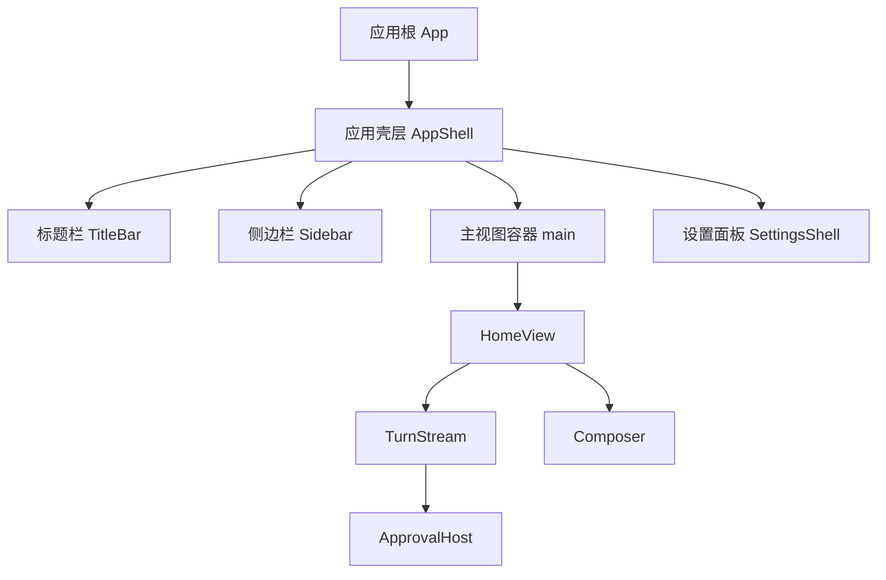
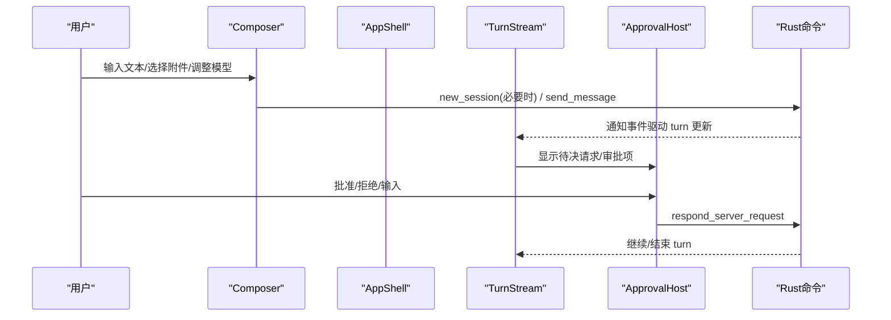
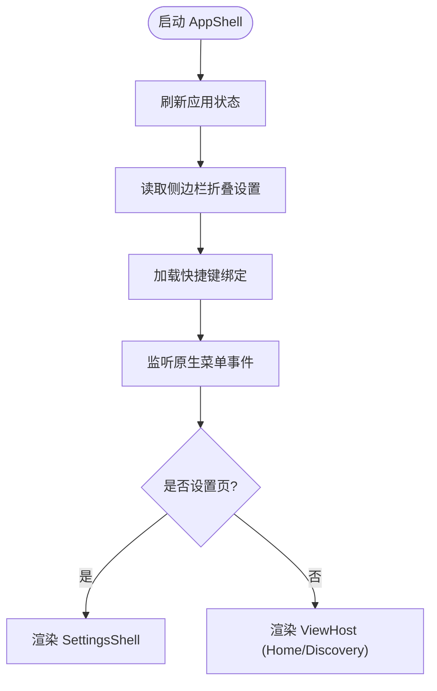
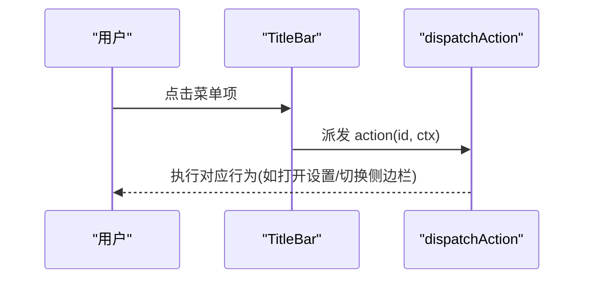
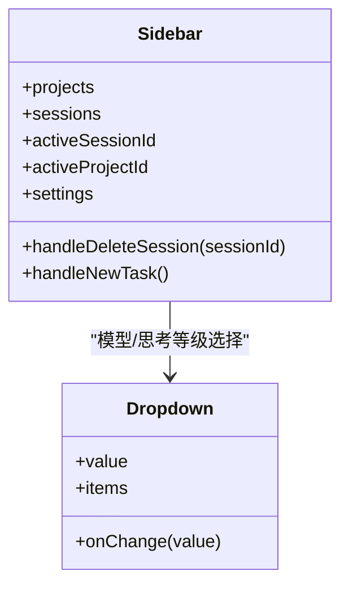
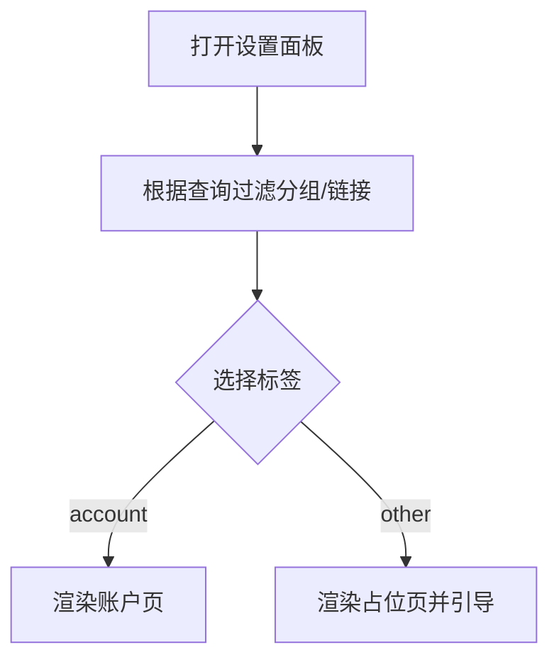
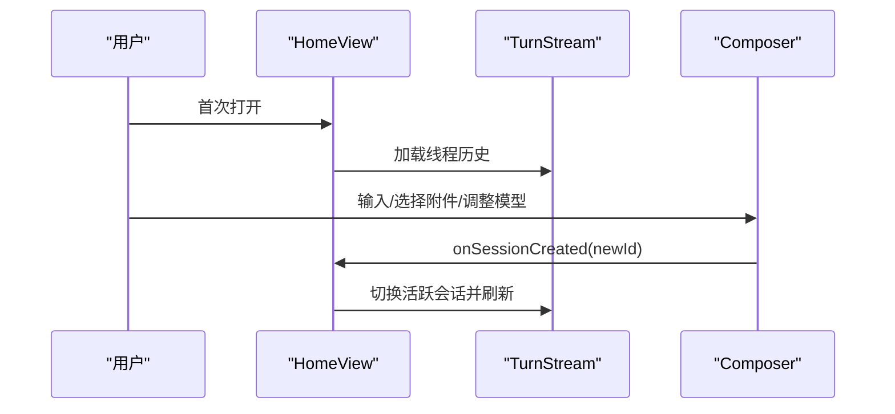
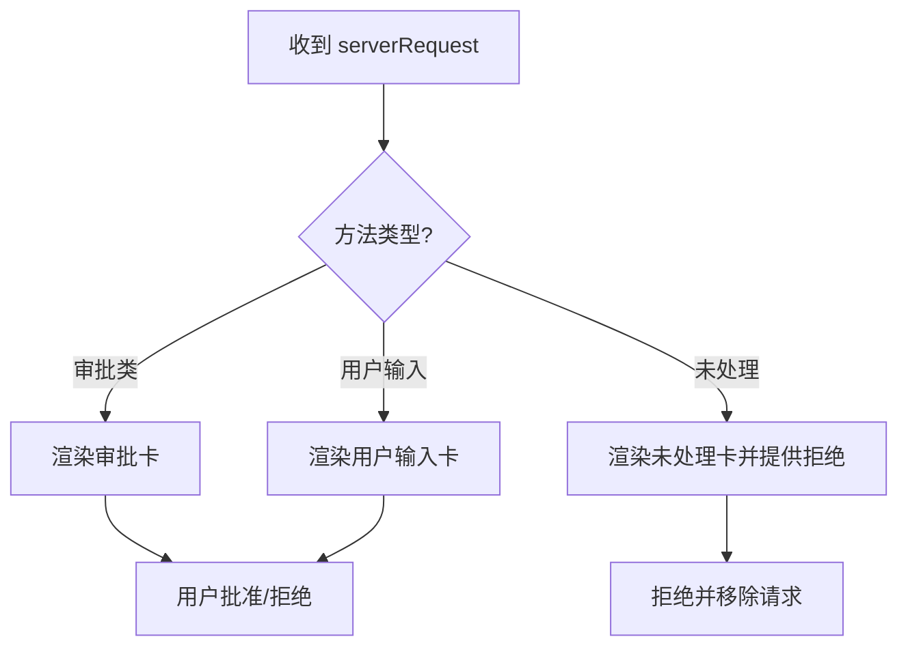
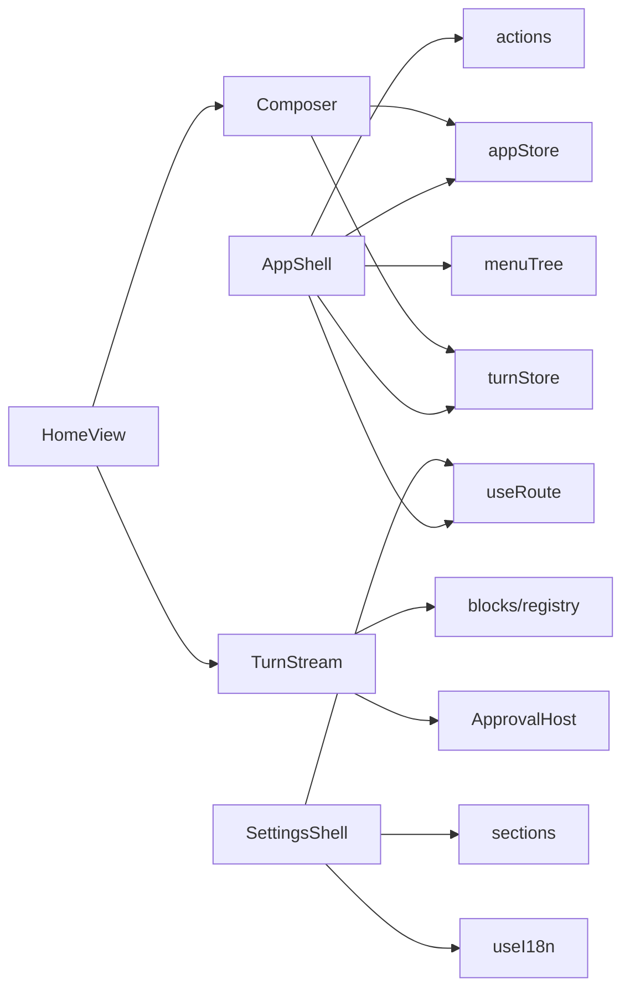

# 用户界面

<cite>
**本文引用的文件**
- [App.tsx](file://frontend/app/App.tsx)
- [AppShell.tsx](file://frontend/app/shell/AppShell.tsx)
- [TitleBar.tsx](file://frontend/app/shell/TitleBar.tsx)
- [Sidebar.tsx](file://frontend/app/shell/Sidebar.tsx)
- [Composer.tsx](file://frontend/app/views/Composer.tsx)
- [HomeView.tsx](file://frontend/app/views/HomeView.tsx)
- [TurnStream.tsx](file://frontend/app/views/TurnStream.tsx)
- [ApprovalHost.tsx](file://frontend/app/approvals/ApprovalHost.tsx)
- [SettingsShell.tsx](file://frontend/app/views/settings/SettingsShell.tsx)
- [sections.ts](file://frontend/app/views/settings/sections.ts)
- [shell.css](file://frontend/src/styles/shell.css)
- [settings.css](file://frontend/src/styles/settings.css)
- [tokens.css](file://frontend/src/styles/tokens.css)
- [i18n.js](file://frontend/src/js/i18n.js)
- [useI18n.ts](file://frontend/app/shell/useI18n.ts)
</cite>

## 目录
1. [简介](#简介)
2. [项目结构](#项目结构)
3. [核心组件](#核心组件)
4. [架构总览](#架构总览)
5. [详细组件分析](#详细组件分析)
6. [依赖关系分析](#依赖关系分析)
7. [性能考量](#性能考量)
8. [故障排查指南](#故障排查指南)
9. [结论](#结论)
10. [附录](#附录)

## 简介
本文件为 Codex-Tauri 桌面应用的用户界面文档，聚焦于主应用壳层、侧边栏导航、标题栏功能、设置面板组织与页面实现、消息流与对话输入、审批工作流的 UI 实现，以及响应式布局、主题定制、可访问性与用户体验优化。内容基于前端 React 代码与样式文件进行梳理，帮助开发者快速理解界面结构与交互流程。

## 项目结构
- 应用根入口负责订阅后端通知与服务器请求，将状态注入到全局 store，并挂载应用壳层。
- 应用壳层（AppShell）组合标题栏、侧边栏与主视图容器；当进入设置页时，通过 body 类名切换布局，使设置面板覆盖主区域。
- 侧边栏提供品牌区、主导航、项目列表、最近会话、模型与思考等级快捷调节、待决权限提示等。
- 标题栏提供无框标题栏、菜单条、窗口控制按钮，并通过菜单树驱动动作分发。
- 设置面板采用分组+标签的 Shell，支持搜索过滤与返回关闭操作。
- 消息流与对话输入：HomeView 组合空态引导、对话流 TurnStream 与 Composer 输入组件；Composer 支持项目、权限、模型三个弹出菜单与发送/停止逻辑。
- 审批工作流：ApprovalHost 根据协议方法类型渲染不同卡片，未处理请求提供拒绝路径以释放阻塞的 turn。

**图表来源**
- [App.tsx:15-45](file://frontend/app/App.tsx#L15-L45)
- [AppShell.tsx:78-204](file://frontend/app/shell/AppShell.tsx#L78-L204)
- [HomeView.tsx:135-206](file://frontend/app/views/HomeView.tsx#L135-L206)
- [TurnStream.tsx:64-186](file://frontend/app/views/TurnStream.tsx#L64-L186)
- [Composer.tsx:600-800](file://frontend/app/views/Composer.tsx#L600-L800)
- [ApprovalHost.tsx:74-92](file://frontend/app/approvals/ApprovalHost.tsx#L74-L92)
- [SettingsShell.tsx:66-161](file://frontend/app/views/settings/SettingsShell.tsx#L66-L161)

**章节来源**
- [App.tsx:15-45](file://frontend/app/App.tsx#L15-L45)
- [AppShell.tsx:78-204](file://frontend/app/shell/AppShell.tsx#L78-L204)
- [HomeView.tsx:135-206](file://frontend/app/views/HomeView.tsx#L135-L206)

## 核心组件
- 应用根 App：订阅通知与服务器请求，维护 pending requests 与 turn 状态，最终渲染 AppShell。
- 应用壳层 AppShell：管理侧边栏折叠、快捷键绑定、路由与视图宿主；在设置模式下隐藏主视图与侧边栏。
- 标题栏 TitleBar：渲染菜单条与窗口控制，统一通过 dispatchAction 触发行为。
- 侧边栏 Sidebar：导航、项目与会话列表、模型与思考等级选择、待决权限入口。
- HomeView：空态引导、TurnStream 与 Composer 的组合；同步活跃会话与引擎状态。
- TurnStream：按 turn 生命周期渲染头部状态（思考/进行中/完成），折叠已完成的 turn，聚合工具执行结果。
- Composer：输入框、附件、项目/权限/模型菜单；发送消息或中断运行；支持模拟 turn。
- ApprovalHost：根据协议方法分类渲染审批卡、用户输入卡或未处理请求卡。
- SettingsShell：设置分组导航、搜索过滤、关闭与返回；当前仅启用账户页，其他为占位。

**章节来源**
- [App.tsx:15-45](file://frontend/app/App.tsx#L15-L45)
- [AppShell.tsx:78-204](file://frontend/app/shell/AppShell.tsx#L78-L204)
- [TitleBar.tsx:26-163](file://frontend/app/shell/TitleBar.tsx#L26-L163)
- [Sidebar.tsx:88-334](file://frontend/app/shell/Sidebar.tsx#L88-L334)
- [HomeView.tsx:135-206](file://frontend/app/views/HomeView.tsx#L135-L206)
- [TurnStream.tsx:64-186](file://frontend/app/views/TurnStream.tsx#L64-L186)
- [Composer.tsx:600-800](file://frontend/app/views/Composer.tsx#L600-L800)
- [ApprovalHost.tsx:74-92](file://frontend/app/approvals/ApprovalHost.tsx#L74-L92)
- [SettingsShell.tsx:66-161](file://frontend/app/views/settings/SettingsShell.tsx#L66-L161)

## 架构总览
下图展示从用户输入到后端调用与审批反馈的关键序列：

**图表来源**
- [Composer.tsx:711-785](file://frontend/app/views/Composer.tsx#L711-L785)
- [TurnStream.tsx:64-186](file://frontend/app/views/TurnStream.tsx#L64-L186)
- [ApprovalHost.tsx:74-92](file://frontend/app/approvals/ApprovalHost.tsx#L74-L92)

## 详细组件分析

### 应用壳层与导航
- 壳层职责：加载引擎数据、恢复侧边栏折叠状态、初始化快捷键绑定、监听原生菜单事件、派发 action。
- 视图宿主：根据路由决定渲染 DiscoveryView（scheduled/plugins/pullrequests）或 HomeView。
- 设置模式：body 添加 settings-open 类，隐藏 .sidebar 与 .main，由 #view-settings 填充。

**图表来源**
- [AppShell.tsx:84-186](file://frontend/app/shell/AppShell.tsx#L84-L186)
- [AppShell.tsx:188-204](file://frontend/app/shell/AppShell.tsx#L188-L204)

**章节来源**
- [AppShell.tsx:78-204](file://frontend/app/shell/AppShell.tsx#L78-L204)

### 标题栏功能
- 菜单条：基于 MENU_TREE 渲染，点击后通过 dispatchAction 执行动作。
- 窗口控制：最小化、最大化、关闭均映射到 action。
- 国际化：菜单项使用 t() 获取本地化文本。

**图表来源**
- [TitleBar.tsx:26-163](file://frontend/app/shell/TitleBar.tsx#L26-L163)

**章节来源**
- [TitleBar.tsx:26-163](file://frontend/app/shell/TitleBar.tsx#L26-L163)

### 侧边栏导航
- 导航项：新任务、定时任务、插件、拉取请求。
- 项目与会话：选择项目、列出最近会话、删除会话。
- 模型与思考等级：下拉选择 activeModel 与 modelReasoningEffort。
- 待决权限：显示 badge 数量，点击跳转首页查看审批。

**图表来源**
- [Sidebar.tsx:88-334](file://frontend/app/shell/Sidebar.tsx#L88-L334)

**章节来源**
- [Sidebar.tsx:88-334](file://frontend/app/shell/Sidebar.tsx#L88-L334)

### 设置面板组织结构
- 分组与标签：SETTINGS_GROUPS 定义个人、集成、编码、归档四大组及子标签。
- 搜索过滤：根据查询词过滤链接与分组。
- 当前实现：仅 AccountTab 可用，其余为占位提示并引导至自定义供应商配置。

**图表来源**
- [SettingsShell.tsx:66-161](file://frontend/app/views/settings/SettingsShell.tsx#L66-L161)
- [sections.ts:44-94](file://frontend/app/views/settings/sections.ts#L44-L94)

**章节来源**
- [SettingsShell.tsx:66-161](file://frontend/app/views/settings/SettingsShell.tsx#L66-L161)
- [sections.ts:44-94](file://frontend/app/views/settings/sections.ts#L44-L94)

### 消息流界面与对话输入
- HomeView：空态引导（Hero）、TurnStream 与 Composer 组合；自动加载线程历史。
- TurnStream：根据 turn 状态显示“思考/已处理X秒/用时X秒”，折叠已完成 turn，聚合工具执行块。
- Composer：输入自适应高度、附件选择、项目/权限/模型菜单；发送消息或中断运行；支持 mock turn。

**图表来源**
- [HomeView.tsx:135-206](file://frontend/app/views/HomeView.tsx#L135-L206)
- [TurnStream.tsx:64-186](file://frontend/app/views/TurnStream.tsx#L64-L186)
- [Composer.tsx:600-800](file://frontend/app/views/Composer.tsx#L600-L800)

**章节来源**
- [HomeView.tsx:135-206](file://frontend/app/views/HomeView.tsx#L135-L206)
- [TurnStream.tsx:64-186](file://frontend/app/views/TurnStream.tsx#L64-L186)
- [Composer.tsx:600-800](file://frontend/app/views/Composer.tsx#L600-L800)

### 审批工作流 UI
- ApprovalHost：根据 method 集合判断渲染 ApprovalCard、UserInputCard 或未处理请求卡。
- 未处理请求：提供拒绝按钮，调用 respond_server_request 释放阻塞的 turn。

**图表来源**
- [ApprovalHost.tsx:20-92](file://frontend/app/approvals/ApprovalHost.tsx#L20-L92)

**章节来源**
- [ApprovalHost.tsx:20-92](file://frontend/app/approvals/ApprovalHost.tsx#L20-L92)

### 响应式设计、主题定制与可访问性
- 响应式：
  - 侧边栏宽度通过 CSS 变量与 clamp 计算，支持折叠与设置页全屏覆盖。
  - 设置面板在小屏下调整侧栏宽度与内容宽度。
- 主题定制：
  - tokens.css 定义明暗主题、字体栈、间距、圆角、阴影、语义色等。
  - shell.css 与 settings.css 消费这些变量，确保视觉一致性。
- 可访问性：
  - 按钮与菜单使用 aria-* 属性（aria-label、aria-expanded、role）。
  - 焦点可见性通过 focus-visible 统一强调环。
  - 减少动画与对比度增强通过 data 属性开关。

**章节来源**
- [shell.css:85-105](file://frontend/src/styles/shell.css#L85-L105)
- [shell.css:107-251](file://frontend/src/styles/shell.css#L107-L251)
- [settings.css:3-141](file://frontend/src/styles/settings.css#L3-L141)
- [tokens.css:21-168](file://frontend/src/styles/tokens.css#L21-L168)
- [tokens.css:546-645](file://frontend/src/styles/tokens.css#L546-L645)

### 用户体验优化
- 输入体验：Composer 文本框随内容自适应高度，限制最大高度；Enter/Ctrl+Enter 发送策略可配置。
- 实时反馈：TurnStream 头部在 turn 进行中每 250ms 刷新已处理时间；完成后提供折叠。
- 快捷操作：侧边栏提供模型与思考等级快速调节；标题栏菜单与全局快捷键统一派发。
- 错误回滚：发送失败时丢弃乐观气泡并标记 turn 失败，避免破坏历史。

**章节来源**
- [Composer.tsx:662-682](file://frontend/app/views/Composer.tsx#L662-L682)
- [Composer.tsx:711-785](file://frontend/app/views/Composer.tsx#L711-L785)
- [TurnStream.tsx:47-60](file://frontend/app/views/TurnStream.tsx#L47-L60)
- [TurnStream.tsx:83-103](file://frontend/app/views/TurnStream.tsx#L83-L103)

## 依赖关系分析
- 组件耦合：
  - AppShell 依赖 useRoute、actions、appStore、turnStore、menuTree。
  - HomeView 依赖 Composer、TurnStream、appStore、turnStore。
  - Composer 依赖 appStore、turnStore、preferencesStore、mockTurn。
  - TurnStream 依赖 blocks/registry、approvals/ApprovalHost。
  - SettingsShell 依赖 sections、useRoute、useI18n。
- 外部集成：
  - Tauri invoke 用于调用 Rust 命令（new_session、send_message、interrupt_session、engine_status、list_shortcuts、get_settings、save_settings、delete_session、respond_server_request）。
  - i18n 模块提供多语言支持与动态语言切换。

**图表来源**
- [AppShell.tsx:11-24](file://frontend/app/shell/AppShell.tsx#L11-L24)
- [HomeView.tsx:14-29](file://frontend/app/views/HomeView.tsx#L14-L29)
- [Composer.tsx:18-34](file://frontend/app/views/Composer.tsx#L18-L34)
- [TurnStream.tsx:23-26](file://frontend/app/views/TurnStream.tsx#L23-L26)
- [SettingsShell.tsx:20-25](file://frontend/app/views/settings/SettingsShell.tsx#L20-L25)

**章节来源**
- [AppShell.tsx:11-24](file://frontend/app/shell/AppShell.tsx#L11-L24)
- [HomeView.tsx:14-29](file://frontend/app/views/HomeView.tsx#L14-L29)
- [Composer.tsx:18-34](file://frontend/app/views/Composer.tsx#L18-L34)
- [TurnStream.tsx:23-26](file://frontend/app/views/TurnStream.tsx#L23-L26)
- [SettingsShell.tsx:20-25](file://frontend/app/views/settings/SettingsShell.tsx#L20-L25)

## 性能考量
- 渲染频率：TurnStream 在 turn 进行中以约 4Hz 刷新已处理时间，避免频繁重绘影响性能。
- 状态同步：仅在必要时机加载线程历史（如会话切换且非活跃 turn），防止重复加载。
- 网络调用：异步 invoke 不阻塞 UI，错误路径及时回滚乐观更新。
- 样式开销：CSS 变量集中管理主题与尺寸，减少重复计算与样式冲突。

[本节为通用指导，无需特定文件引用]

## 故障排查指南
- 发送失败：检查 send 流程中的异常捕获与 discardItem、finishTurn 调用，确认 turn 状态是否正确回滚。
- 审批阻塞：若出现未处理请求导致 turn 挂起，使用 ApprovalHost 的拒绝路径释放阻塞。
- 设置页空白：当前仅账户页可用，其他标签为占位；如需启用需实现对应 Tab。
- 语言切换无效：确保 useI18n 钩子订阅语言修订计数，强制组件重新渲染。

**章节来源**
- [Composer.tsx:762-785](file://frontend/app/views/Composer.tsx#L762-L785)
- [ApprovalHost.tsx:31-71](file://frontend/app/approvals/ApprovalHost.tsx#L31-L71)
- [SettingsShell.tsx:32-63](file://frontend/app/views/settings/SettingsShell.tsx#L32-L63)
- [useI18n.ts:1-14](file://frontend/app/shell/useI18n.ts#L1-L14)

## 结论
Codex-Tauri 的前端界面以清晰的壳层-视图分层组织，结合 Tauri 命令与协议事件驱动 turn 生命周期。设置面板采用分组导航与搜索过滤，当前优先实现账户页。消息流与输入组件提供流畅的交互体验，审批工作流确保安全性与可控性。通过 CSS 变量与主题系统实现一致的视觉风格与可访问性支持。后续可扩展更多设置页与自定义供应商能力，进一步提升用户体验。

[本节为总结，无需特定文件引用]

## 附录
- 国际化支持：i18n.js 提供多语言字典与 LOCALES 列表；useI18n.ts 通过订阅语言修订计数实现动态刷新。
- 样式定制：tokens.css 定义主题变量；shell.css 与 settings.css 消费变量构建界面；可通过 html.data-* 属性切换字体、对比度、动画等。
- 交互模式说明：
  - 发送快捷键：Enter 或 Ctrl+Enter 取决于设置。
  - 模型与思考等级：侧边栏与 Composer 菜单均可调节。
  - 审批流程：根据协议方法类型渲染不同卡片，支持批准、拒绝与输入。

**章节来源**
- [i18n.js:4-12](file://frontend/src/js/i18n.js#L4-L12)
- [useI18n.ts:1-14](file://frontend/app/shell/useI18n.ts#L1-L14)
- [tokens.css:600-645](file://frontend/src/styles/tokens.css#L600-L645)
- [Composer.tsx:787-800](file://frontend/app/views/Composer.tsx#L787-L800)