# 个人设置页面

<cite>
**本文引用的文件**
- [GeneralTab.tsx](file://frontend/app/views/settings/tabs/GeneralTab.tsx)
- [AppearanceTab.tsx](file://frontend/app/views/settings/tabs/AppearanceTab.tsx)
- [AccountTab.tsx](file://frontend/app/views/settings/tabs/AccountTab.tsx)
- [VoiceTab.tsx](file://frontend/app/views/settings/tabs/VoiceTab.tsx)
- [PersonalizationTab.tsx](file://frontend/app/views/settings/tabs/PersonalizationTab.tsx)
- [PetsTab.tsx](file://frontend/app/views/settings/tabs/PetsTab.tsx)
- [ShortcutsTab.tsx](file://frontend/app/views/settings/tabs/ShortcutsTab.tsx)
- [ImportTab.tsx](file://frontend/app/views/settings/tabs/ImportTab.tsx)
- [ConfigurationTab.tsx](file://frontend/app/views/settings/tabs/ConfigurationTab.tsx)
- [preferencesStore.ts](file://frontend/app/state/preferencesStore.ts)
- [appStore.ts](file://frontend/app/state/appStore.ts)
- [primitives.tsx](file://frontend/app/views/settings/primitives.tsx)
</cite>

## 目录
1. [简介](#简介)
2. [项目结构](#项目结构)
3. [核心组件](#核心组件)
4. [架构总览](#架构总览)
5. [详细组件分析](#详细组件分析)
6. [依赖关系分析](#依赖关系分析)
7. [性能考虑](#性能考虑)
8. [故障排查指南](#故障排查指南)
9. [结论](#结论)
10. [附录](#附录)

## 简介
本文件为 Codex-Tauri 的“个人设置”相关页面提供系统化、可操作的文档。覆盖通用设置（GeneralTab）、外观设置（AppearanceTab）、账户设置（AccountTab）、语音设置（VoiceTab）、个性化设置（PersonalizationTab）、宠物设置（PetsTab）、快捷键设置（ShortcutsTab）、导入设置（ImportTab）与配置设置（ConfigurationTab）。内容包含各页面的表单验证、数据持久化、用户交互流程、动态更新机制与实时预览能力，帮助开发者与使用者准确理解并扩展这些功能。

## 项目结构
个人设置由多个 Tab 组成，每个 Tab 负责一个领域：
- 通用设置：权限、常规、编辑器、弹出窗口、通知、趣味实验
- 外观设置：主题选择、代码预览、主题卡片编辑、显示偏好
- 账户设置：模型提供商列表、激活切换、新增/编辑、连通性探测
- 语音设置：麦克风选择、语言重试、听写热键、自定义词典
- 个性化设置：智能体指令、本地记忆开关、删除记忆
- 宠物设置：目录网格、选中状态、预览叠加层、创建/刷新
- 快捷键设置：只读展示、按键搜索过滤（无重绑定）
- 导入设置：从 JSON/TOML/TXT 导入配置、自动同步选项
- 配置设置：智能体默认策略、模型功能、工作空间依赖诊断

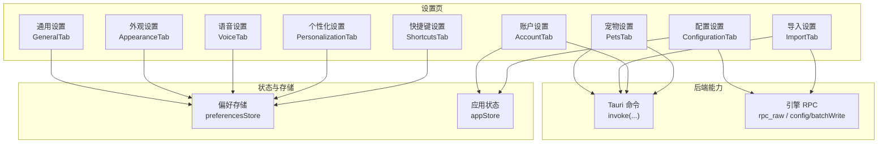

图表来源
- [GeneralTab.tsx:93-428](file://frontend/app/views/settings/tabs/GeneralTab.tsx#L93-L428)
- [AppearanceTab.tsx:46-187](file://frontend/app/views/settings/tabs/AppearanceTab.tsx#L46-L187)
- [AccountTab.tsx:55-336](file://frontend/app/views/settings/tabs/AccountTab.tsx#L55-L336)
- [VoiceTab.tsx:45-184](file://frontend/app/views/settings/tabs/VoiceTab.tsx#L45-L184)
- [PersonalizationTab.tsx:37-114](file://frontend/app/views/settings/tabs/PersonalizationTab.tsx#L37-L114)
- [PetsTab.tsx:101-274](file://frontend/app/views/settings/tabs/PetsTab.tsx#L101-L274)
- [ShortcutsTab.tsx:88-164](file://frontend/app/views/settings/tabs/ShortcutsTab.tsx#L88-L164)
- [ImportTab.tsx:81-206](file://frontend/app/views/settings/tabs/ImportTab.tsx#L81-L206)
- [ConfigurationTab.tsx:75-322](file://frontend/app/views/settings/tabs/ConfigurationTab.tsx#L75-L322)
- [preferencesStore.ts:45-88](file://frontend/app/state/preferencesStore.ts#L45-L88)
- [appStore.ts:446-511](file://frontend/app/state/appStore.ts#L446-L511)

章节来源
- [GeneralTab.tsx:93-428](file://frontend/app/views/settings/tabs/GeneralTab.tsx#L93-L428)
- [AppearanceTab.tsx:46-187](file://frontend/app/views/settings/tabs/AppearanceTab.tsx#L46-L187)
- [AccountTab.tsx:55-336](file://frontend/app/views/settings/tabs/AccountTab.tsx#L55-L336)
- [VoiceTab.tsx:45-184](file://frontend/app/views/settings/tabs/VoiceTab.tsx#L45-L184)
- [PersonalizationTab.tsx:37-114](file://frontend/app/views/settings/tabs/PersonalizationTab.tsx#L37-L114)
- [PetsTab.tsx:101-274](file://frontend/app/views/settings/tabs/PetsTab.tsx#L101-L274)
- [ShortcutsTab.tsx:88-164](file://frontend/app/views/settings/tabs/ShortcutsTab.tsx#L88-L164)
- [ImportTab.tsx:81-206](file://frontend/app/views/settings/tabs/ImportTab.tsx#L81-L206)
- [ConfigurationTab.tsx:75-322](file://frontend/app/views/settings/tabs/ConfigurationTab.tsx#L75-L322)
- [preferencesStore.ts:45-88](file://frontend/app/state/preferencesStore.ts#L45-L88)
- [appStore.ts:446-511](file://frontend/app/state/appStore.ts#L446-L511)

## 核心组件
- 偏好存储（preferencesStore）
  - 按 section 维护偏好对象，支持 usePrefSection 读取、saveSection 合并并持久化到后端 save_preferences。
  - 首次加载通过 get_preferences 拉取，失败时回退到默认值，保证 UI 可用。
- 应用状态（appStore）
  - 管理会话、项目、提供商、全局设置等；saveSettings 同时写入 shell 设置与引擎配置（config/batchWrite），并同步国际化语言。
- 基础控件（primitives）
  - PageHead、Block、Row、Switch、Segmented、TextInput、TextArea、SettingsButton 等，统一样式与行为。

章节来源
- [preferencesStore.ts:45-88](file://frontend/app/state/preferencesStore.ts#L45-L88)
- [appStore.ts:446-511](file://frontend/app/state/appStore.ts#L446-L511)
- [primitives.tsx:11-229](file://frontend/app/views/settings/primitives.tsx#L11-L229)

## 架构总览
设置页遵循“前端 Tab + 共享状态 + 后端命令”的分层模式：
- 每个 Tab 使用 primitives 构建界面，通过 preferencesStore 或 appStore 读写数据。
- 需要后端能力的操作通过 Tauri invoke 调用命令（如 list_providers、probe_provider、list_pets、check_dependencies、rpc_raw 等）。
- 对引擎配置变更的操作统一走 rpc_raw 的 config/batchWrite，确保与引擎侧一致。

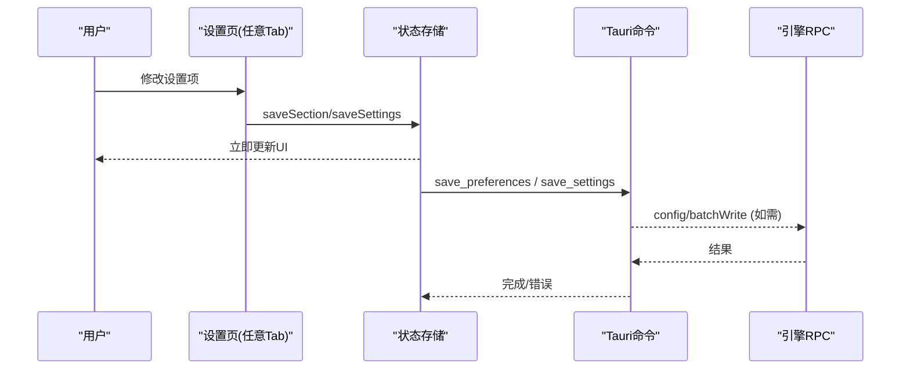

图表来源
- [preferencesStore.ts:76-88](file://frontend/app/state/preferencesStore.ts#L76-L88)
- [appStore.ts:446-511](file://frontend/app/state/appStore.ts#L446-L511)

## 详细组件分析

### 通用设置（GeneralTab）
- 配置选项
  - 权限：默认权限不可变，全量访问通过 Switch 控制，并联动保存至全局设置。
  - 常规：任务文件夹路径（读取引擎 codexHome）、默认打开方式、集成终端 Shell、语言、底部面板、提示建议、开源许可证查看、插件开关。
  - 编辑器：纯文本编辑器、上下文窗口用量显示、发送快捷键、后续处理模式。
  - 弹出窗口：弹出快捷键、默认独立聊天。
  - 通知：回合完成通知、权限通知、问题通知。
  - 趣味实验：彩纸特效开关。
- 表单验证
  - 语言下拉来自 i18n 选项；任务文件夹通过原生对话框选择；其余多为受控输入，类型与范围在渲染层约束。
- 数据持久化
  - 多数项通过 saveSection("general", patch) 持久化；全量访问与语言通过 saveSettings 写入 shell 与引擎配置。
- 用户交互流程
  - 打开许可证弹窗、更改任务文件夹、切换通知策略等均为即时反馈。
- 动态更新与实时预览
  - 语言切换即时生效；许可证以模态框内联显示；弹出快捷键选项带标签预览。

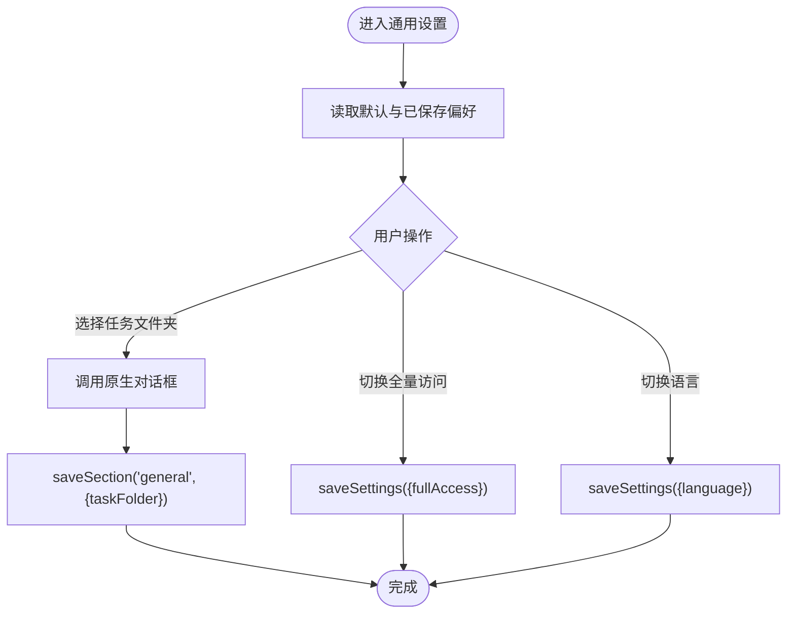

图表来源
- [GeneralTab.tsx:93-428](file://frontend/app/views/settings/tabs/GeneralTab.tsx#L93-L428)
- [appStore.ts:446-511](file://frontend/app/state/appStore.ts#L446-L511)

章节来源
- [GeneralTab.tsx:93-428](file://frontend/app/views/settings/tabs/GeneralTab.tsx#L93-L428)

### 外观设置（AppearanceTab）
- 主题与样式
  - 主题选择（系统/浅色/深色），切换后触发 appearance-applied 事件以应用主题。
  - 主题代码预览：根据当前主题卡片生成示例代码片段。
  - 主题卡片编辑器：支持颜色、字体、对比度、代码主题等字段，支持导入/复制 JSON。
- 显示偏好
  - 指针光标、减少动效、UI/代码字号、差异标记风格。
- 表单验证
  - 字号输入限制 10-24；颜色输入支持 HEX 与拾色器；导入 JSON 解析失败会记录警告。
- 数据持久化
  - 所有主题与显示偏好通过 saveSection("appearance", patch) 持久化。
- 动态更新与实时预览
  - 主题切换即时生效；主题卡片编辑即时反映到预览区。

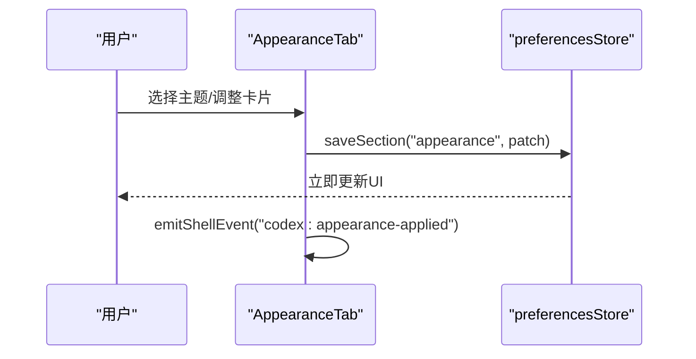

图表来源
- [AppearanceTab.tsx:46-187](file://frontend/app/views/settings/tabs/AppearanceTab.tsx#L46-L187)
- [preferencesStore.ts:76-88](file://frontend/app/state/preferencesStore.ts#L76-L88)

章节来源
- [AppearanceTab.tsx:46-187](file://frontend/app/views/settings/tabs/AppearanceTab.tsx#L46-L187)

### 账户设置（AccountTab）
- 用户认证与管理
  - 提供商列表与激活切换：activeProviderId 通过 saveSettings 写入。
  - 新增/编辑提供商：id/name/baseUrl/apiKey/protocol/defaultModel，保存后刷新状态。
  - 连通性探测：调用 probe_provider，返回 ok/error/hint/modelCount/models/modelFound。
- 表单验证
  - 必填校验（baseUrl 非空才允许探测）；ID 自动生成（slugify）。
- 数据持久化
  - 保存提供商通过 save_provider；激活提供商通过 saveSettings；探测通过 rpc_raw。
- 用户交互流程
  - 添加/编辑/设为活跃/探测连接，均有忙态与消息反馈。

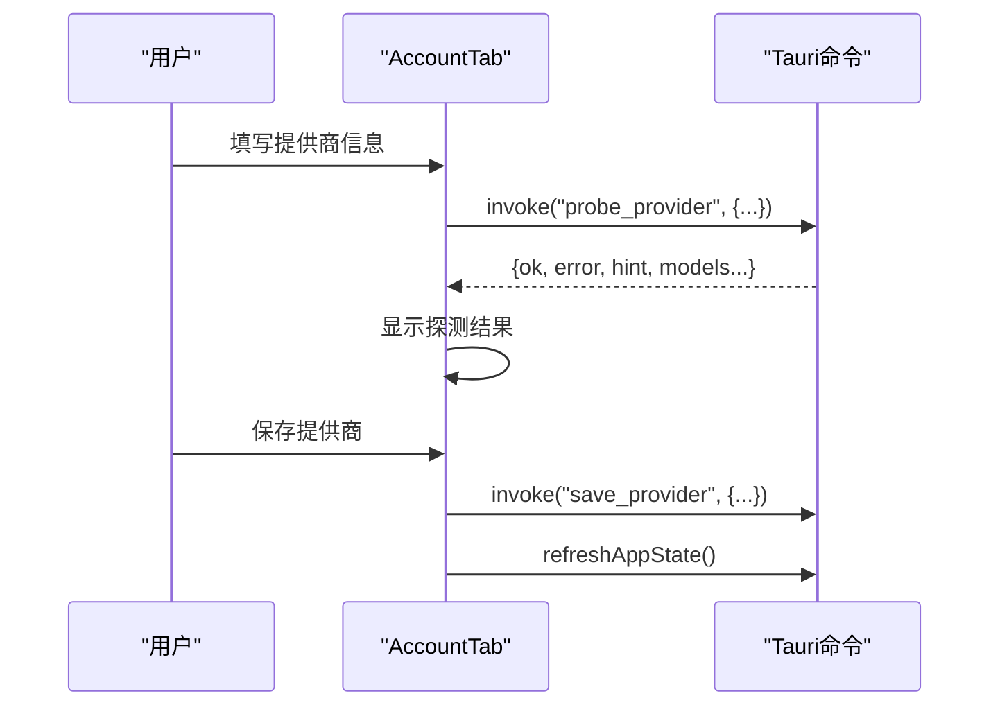

图表来源
- [AccountTab.tsx:55-336](file://frontend/app/views/settings/tabs/AccountTab.tsx#L55-L336)
- [appStore.ts:378-408](file://frontend/app/state/appStore.ts#L378-L408)

章节来源
- [AccountTab.tsx:55-336](file://frontend/app/views/settings/tabs/AccountTab.tsx#L55-L336)

### 语音设置（VoiceTab）
- 音频配置
  - 麦克风选择：尝试从引擎获取设备列表，失败则保留默认。
  - 语言：尝试 audio/list，成功显示下拉，否则显示重试按钮。
- 个性化设置
  - 听写热键：按住/切换热键捕获，组合键格式化为 "Ctrl+Shift+K" 形式。
  - 自定义词典：有序字符串数组，至少保留一项。
- 表单验证
  - 热键捕获仅接受非修饰键组合；词典行至少保留一条。
- 数据持久化
  - 所有语音偏好通过 saveSection("voice", patch) 持久化。
- 用户交互流程
  - 重试加载语言、添加/删除词典条目、设置热键。

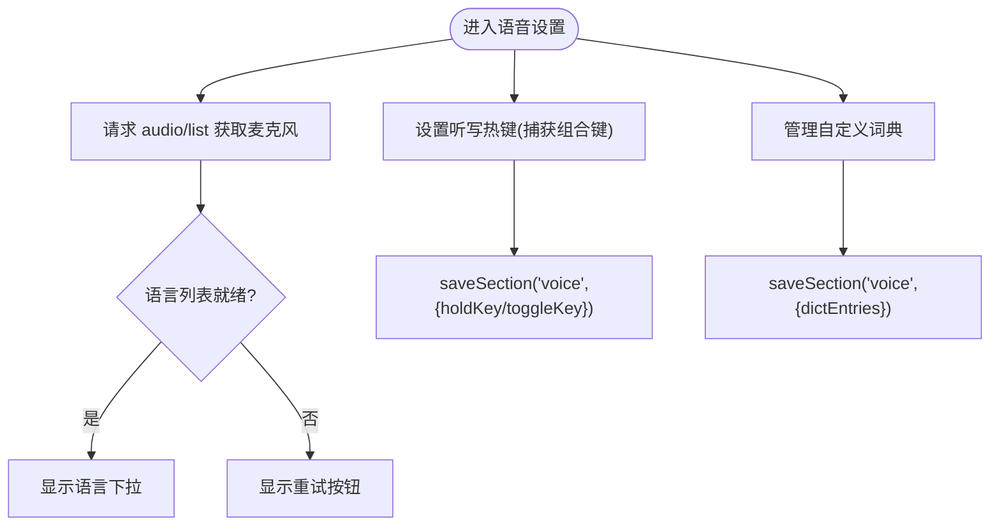

图表来源
- [VoiceTab.tsx:45-184](file://frontend/app/views/settings/tabs/VoiceTab.tsx#L45-L184)

章节来源
- [VoiceTab.tsx:45-184](file://frontend/app/views/settings/tabs/VoiceTab.tsx#L45-L184)

### 个性化设置（PersonalizationTab）
- 自定义选项
  - 智能体指令：文本区域编辑，显式保存（非每次按键）。
  - 本地记忆：开关控制；工具记忆当前禁用；支持删除记忆。
- 表单验证
  - 指令保存仅在草稿变化时启用保存按钮。
- 数据持久化
  - 指令与本地记忆通过 saveSection("personalization", patch) 持久化；删除记忆调用 memory/delete。
- 用户交互流程
  - 编辑指令→保存；切换本地记忆；删除记忆。

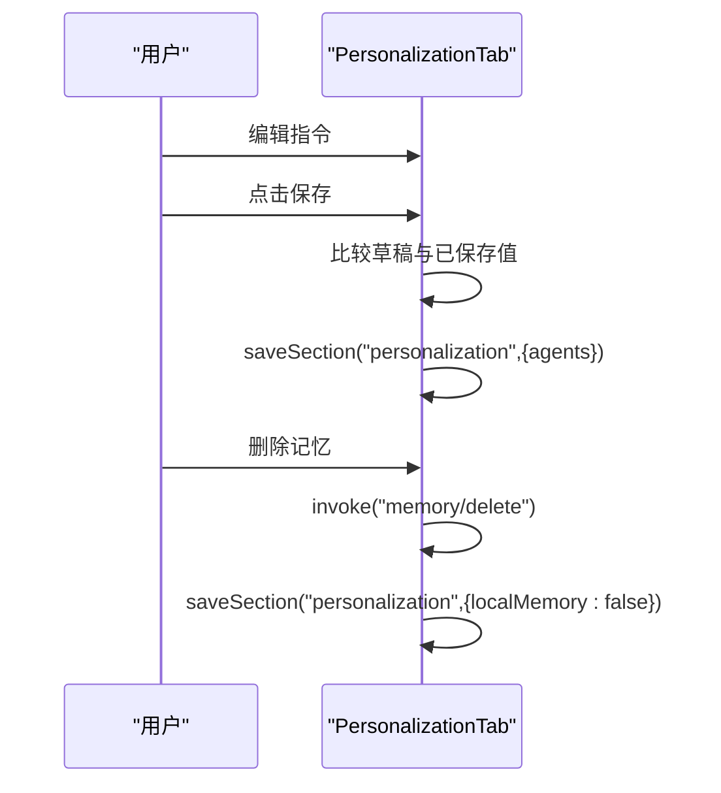

图表来源
- [PersonalizationTab.tsx:37-114](file://frontend/app/views/settings/tabs/PersonalizationTab.tsx#L37-L114)

章节来源
- [PersonalizationTab.tsx:37-114](file://frontend/app/views/settings/tabs/PersonalizationTab.tsx#L37-L114)

### 宠物设置（PetsTab）
- 虚拟宠物管理
  - 目录网格：官方宠物 + 后端自定义宠物合并展示；选中即激活。
  - 预览叠加层：PetOverlay 显示当前宠物的实时状态。
  - 创建/刷新：创建自定义宠物、刷新后端宠物列表。
- 数据持久化
  - 宠物偏好通过 get_preferences/save_preferences 读写 pets 段；激活宠物调用 wake_pet。
- 用户交互流程
  - 选择宠物→唤醒→刷新/创建→实时更新状态。

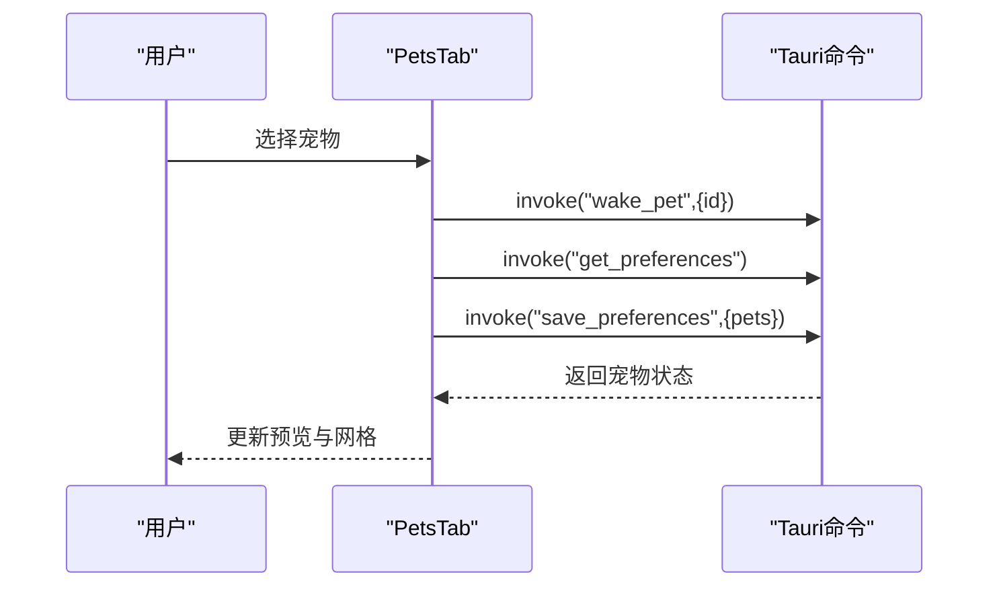

图表来源
- [PetsTab.tsx:101-274](file://frontend/app/views/settings/tabs/PetsTab.tsx#L101-L274)

章节来源
- [PetsTab.tsx:101-274](file://frontend/app/views/settings/tabs/PetsTab.tsx#L101-L274)

### 快捷键设置（ShortcutsTab）
- 绑定机制
  - 只读展示：快捷键目录来自静态 catalog，不支持重绑定（无 L3 重绑命令）。
  - 按键搜索：开启后监听键盘事件，将非修饰键组合转换为过滤条件。
- 表单验证
  - 过滤逻辑仅接受非修饰键；未分配项显示“未分配”。
- 数据持久化
  - 搜索模式开关保存在 shortcuts 段。
- 用户交互流程
  - 输入关键词或开启按键搜索→实时过滤列表。

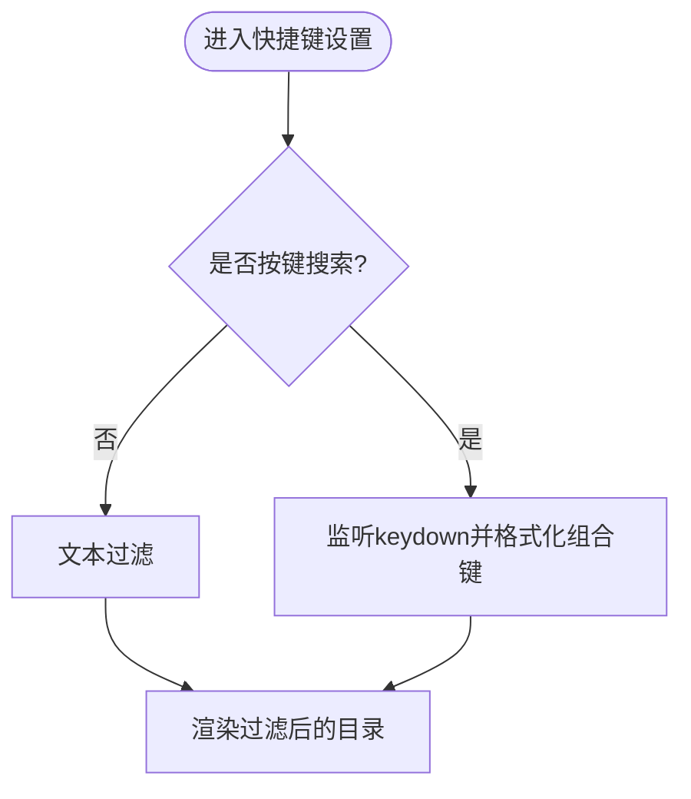

图表来源
- [ShortcutsTab.tsx:88-164](file://frontend/app/views/settings/tabs/ShortcutsTab.tsx#L88-L164)

章节来源
- [ShortcutsTab.tsx:88-164](file://frontend/app/views/settings/tabs/ShortcutsTab.tsx#L88-L164)

### 导入设置（ImportTab）
- 数据迁移功能
  - 支持导入 JSON/TOML/TXT（实际解析为 JSON），将多种导出形状归一化为 batchWrite edits。
  - 自动同步开关与内容选择（首次导入后才解锁）。
- 表单验证
  - 文件为空或非 JSON 时报错；无有效 keyPath 时报错。
- 数据持久化
  - 通过 rpc_raw 的 config/batchWrite 写入引擎配置；成功后标记 importDone。
- 用户交互流程
  - 选择文件→读取→解析→批量写入→显示结果。

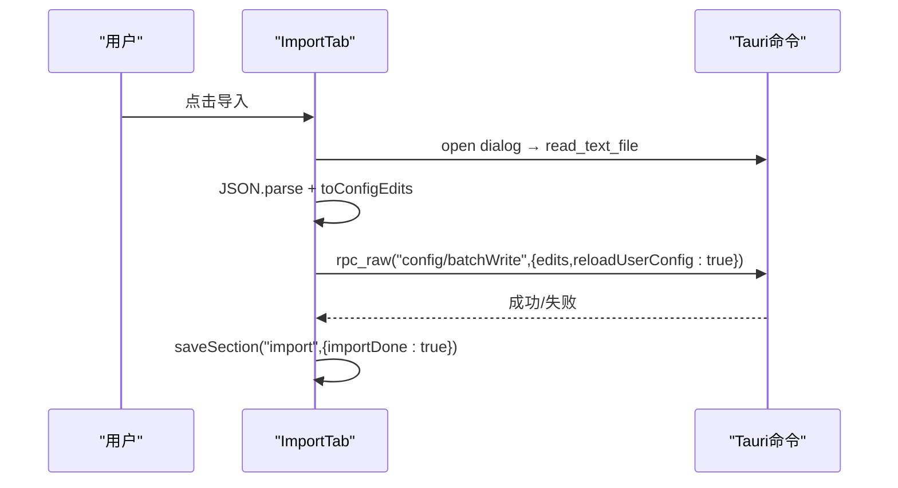

图表来源
- [ImportTab.tsx:81-206](file://frontend/app/views/settings/tabs/ImportTab.tsx#L81-L206)

章节来源
- [ImportTab.tsx:81-206](file://frontend/app/views/settings/tabs/ImportTab.tsx#L81-L206)

### 配置设置（ConfigurationTab）
- 高级选项
  - 智能体默认设置：用户配置文件（占位）、打开 config.toml、审批策略、沙箱模式、网络搜索、输出详细程度、推理摘要。
  - 模型功能：可选推理强度多选、Ultra 开关（禁用）。
  - 工作空间依赖项：Codex 依赖开关、诊断、重装（禁用）、当前版本。
- 表单验证
  - 策略/模式/详细程度/摘要均为下拉选择；Ultra 开关禁用。
- 数据持久化
  - 通过 saveSettings 写入 shell 设置与引擎配置（batchWrite）；诊断调用 check_dependencies；版本通过 engine_status 获取。
- 用户交互流程
  - 修改策略→保存→引擎配置更新；诊断→显示依赖状态；打开配置文件。

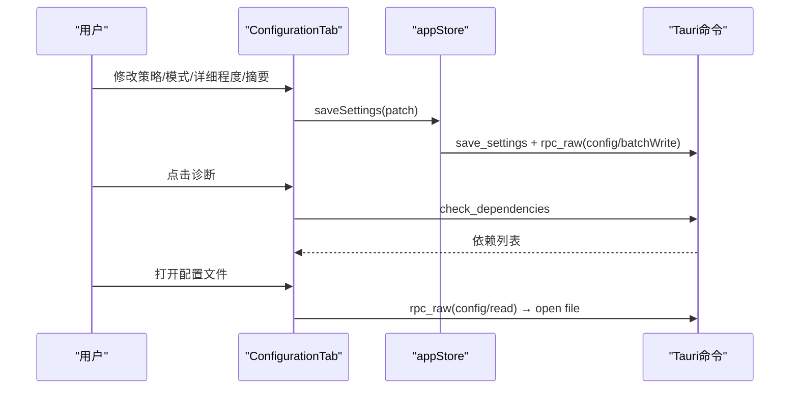

图表来源
- [ConfigurationTab.tsx:75-322](file://frontend/app/views/settings/tabs/ConfigurationTab.tsx#L75-L322)
- [appStore.ts:446-511](file://frontend/app/state/appStore.ts#L446-L511)

章节来源
- [ConfigurationTab.tsx:75-322](file://frontend/app/views/settings/tabs/ConfigurationTab.tsx#L75-L322)

## 依赖关系分析
- 组件耦合
  - 各 Tab 高度解耦，仅通过 preferencesStore 与 appStore 进行状态读写。
  - 需要后端能力的 Tab 通过 Tauri invoke 调用命令，避免直接耦合引擎细节。
- 外部依赖
  - Tauri 命令：save_settings、get_settings、list_providers、probe_provider、list_pets、create_custom_pet、wake_pet、check_dependencies、engine_status、rpc_raw、plugin:dialog/fs/shell 等。
- 潜在循环依赖
  - 未发现循环引用；状态模块被多个 Tab 消费，但单向依赖。

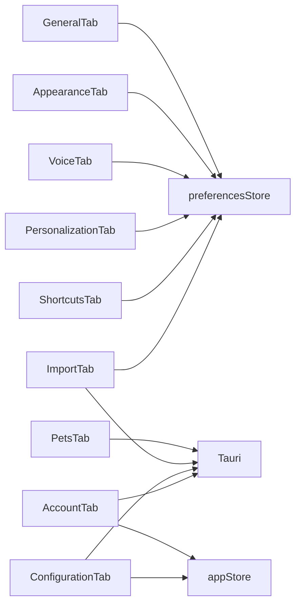

图表来源
- [GeneralTab.tsx:93-428](file://frontend/app/views/settings/tabs/GeneralTab.tsx#L93-L428)
- [AppearanceTab.tsx:46-187](file://frontend/app/views/settings/tabs/AppearanceTab.tsx#L46-L187)
- [VoiceTab.tsx:45-184](file://frontend/app/views/settings/tabs/VoiceTab.tsx#L45-L184)
- [PersonalizationTab.tsx:37-114](file://frontend/app/views/settings/tabs/PersonalizationTab.tsx#L37-L114)
- [ShortcutsTab.tsx:88-164](file://frontend/app/views/settings/tabs/ShortcutsTab.tsx#L88-L164)
- [ImportTab.tsx:81-206](file://frontend/app/views/settings/tabs/ImportTab.tsx#L81-L206)
- [AccountTab.tsx:55-336](file://frontend/app/views/settings/tabs/AccountTab.tsx#L55-L336)
- [ConfigurationTab.tsx:75-322](file://frontend/app/views/settings/tabs/ConfigurationTab.tsx#L75-L322)
- [PetsTab.tsx:101-274](file://frontend/app/views/settings/tabs/PetsTab.tsx#L101-L274)

章节来源
- [preferencesStore.ts:45-88](file://frontend/app/state/preferencesStore.ts#L45-L88)
- [appStore.ts:446-511](file://frontend/app/state/appStore.ts#L446-L511)

## 性能考虑
- 状态更新
  - preferencesStore 采用先本地提交再异步持久化的策略，确保 UI 即时响应。
  - appStore 的 saveSettings 同时写入 shell 与引擎配置，注意批量写入以减少往返。
- 网络与后端
  - 对引擎离线或命令失败的场景进行容错处理（例如忽略错误、降级显示默认值）。
- 渲染优化
  - 快捷键搜索使用 useMemo 缓存过滤结果；宠物目录按需合并官方与后端数据。

[本节为通用指导，不直接分析具体文件]

## 故障排查指南
- 通用设置
  - 任务文件夹未检测到：检查引擎是否在线；若离线则回退到已保存覆盖值。
  - 许可证弹窗无法打开：确认资源引入正确。
- 外观设置
  - 主题未生效：确认 appearance-applied 事件已发出；检查 CSS 类名是否正确。
- 账户设置
  - 探测失败：检查 baseUrl、协议、API Key；查看返回的 error/hint。
- 语音设置
  - 语言列表加载失败：重试 audio/list；若持续失败，保持默认。
- 个性化设置
  - 删除记忆失败：忽略异常，仍重置本地记忆开关。
- 宠物设置
  - 唤醒失败：可能官方宠物尚未存在于后端存储，忽略警告即可。
- 导入设置
  - 文件非 JSON：提示“不是有效的 JSON 设置导出”；无有效 keyPath：提示“未找到配置键”。
- 配置设置
  - 诊断结果为空：引擎可能未暴露依赖检查；版本为空：引擎状态未就绪。

章节来源
- [GeneralTab.tsx:93-428](file://frontend/app/views/settings/tabs/GeneralTab.tsx#L93-L428)
- [AppearanceTab.tsx:46-187](file://frontend/app/views/settings/tabs/AppearanceTab.tsx#L46-L187)
- [AccountTab.tsx:55-336](file://frontend/app/views/settings/tabs/AccountTab.tsx#L55-L336)
- [VoiceTab.tsx:45-184](file://frontend/app/views/settings/tabs/VoiceTab.tsx#L45-L184)
- [PersonalizationTab.tsx:37-114](file://frontend/app/views/settings/tabs/PersonalizationTab.tsx#L37-L114)
- [PetsTab.tsx:101-274](file://frontend/app/views/settings/tabs/PetsTab.tsx#L101-L274)
- [ImportTab.tsx:81-206](file://frontend/app/views/settings/tabs/ImportTab.tsx#L81-L206)
- [ConfigurationTab.tsx:75-322](file://frontend/app/views/settings/tabs/ConfigurationTab.tsx#L75-L322)

## 结论
个人设置页面通过清晰的模块化设计与统一的状态管理机制，实现了跨领域的配置能力。各 Tab 既独立又协同，借助 preferencesStore 与 appStore 完成数据的即时更新与持久化，并通过 Tauri 命令与引擎交互实现高级功能。整体架构具备良好的可扩展性与容错性，便于后续增加新的设置项与后端能力。

[本节为总结，不直接分析具体文件]

## 附录
- 关键交互流程图（概念性）
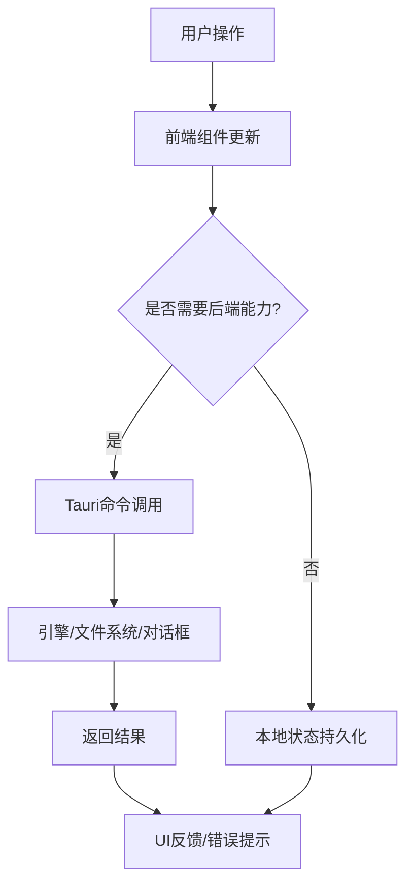

[本节为概念性图示，不直接映射具体文件]