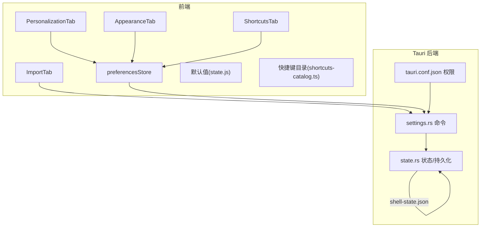
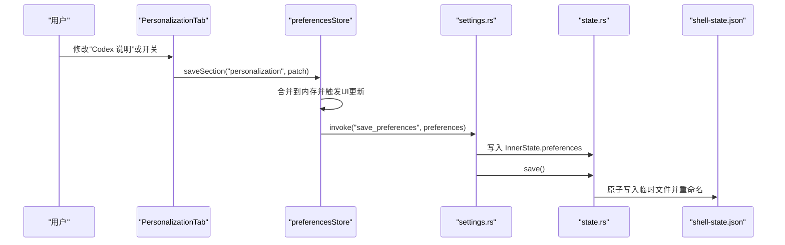
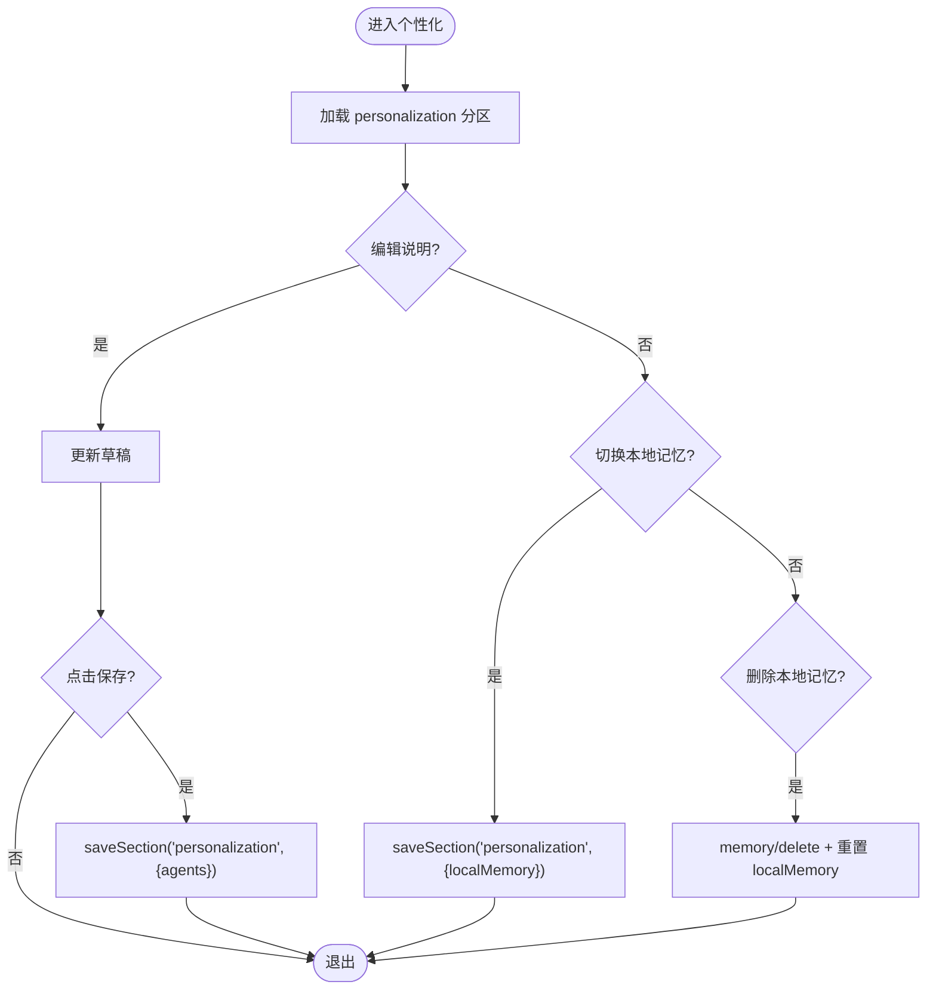
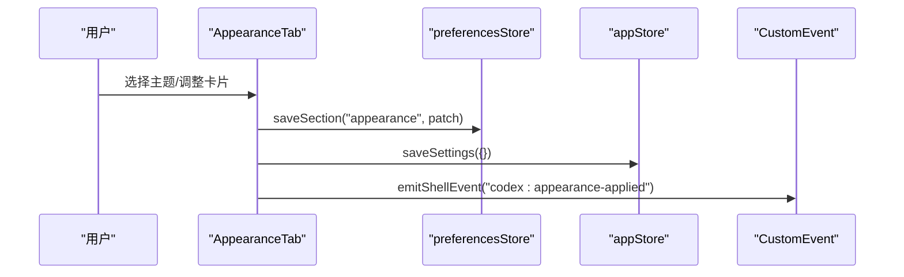
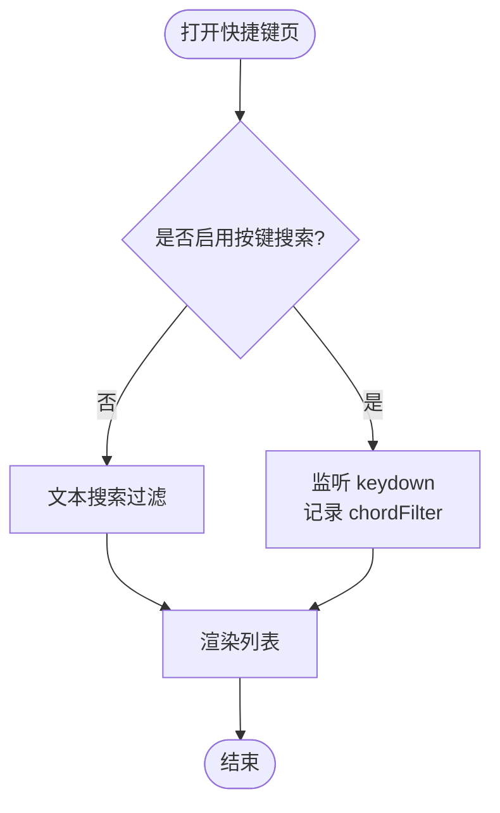
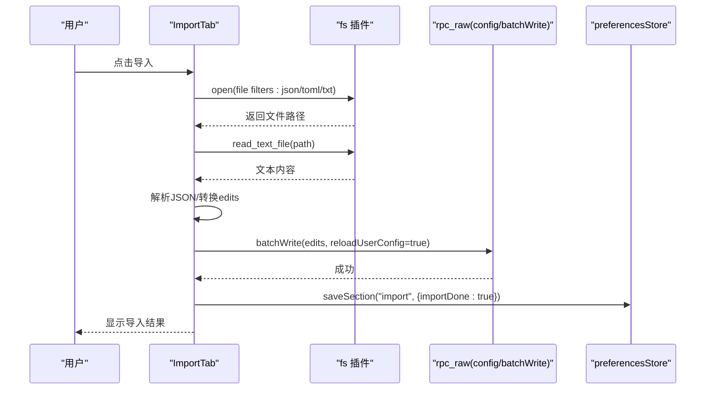
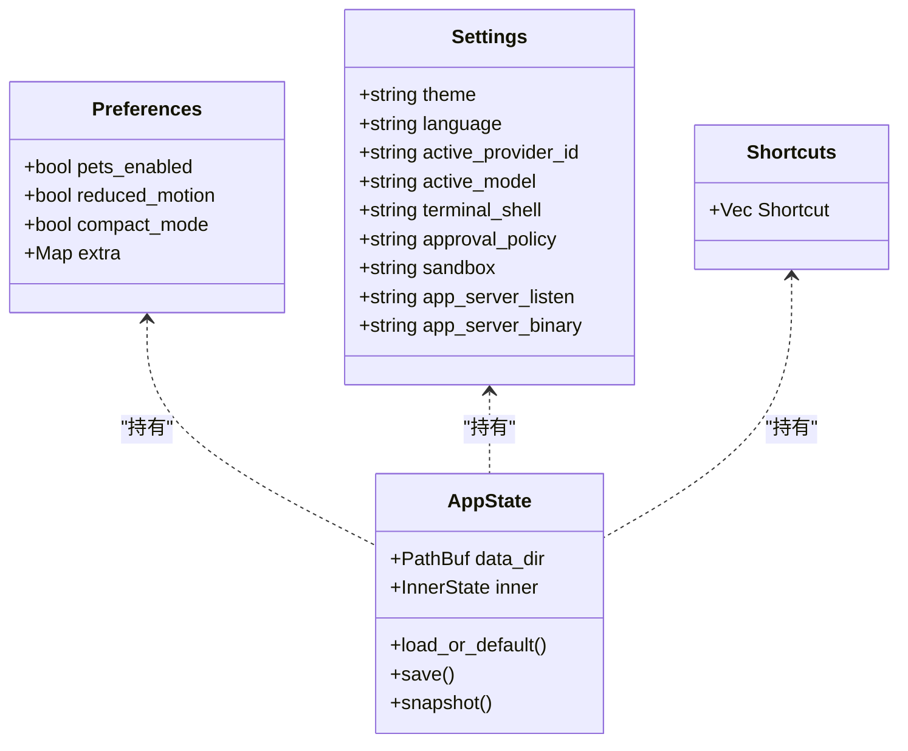
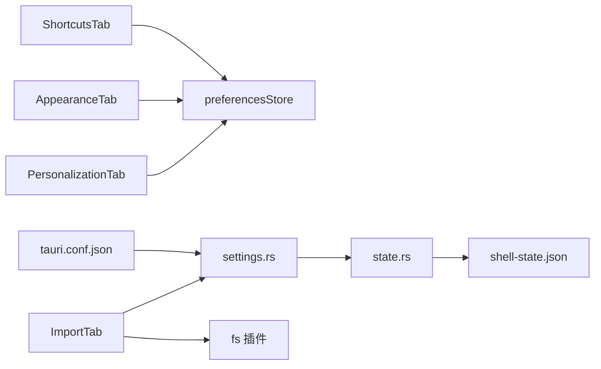

# 个性化设置页面

<cite>
**本文引用的文件**
- [PersonalizationTab.tsx](file://frontend/app/views/settings/tabs/PersonalizationTab.tsx)
- [AppearanceTab.tsx](file://frontend/app/views/settings/tabs/AppearanceTab.tsx)
- [ShortcutsTab.tsx](file://frontend/app/views/settings/tabs/ShortcutsTab.tsx)
- [ImportTab.tsx](file://frontend/app/views/settings/tabs/ImportTab.tsx)
- [preferencesStore.ts](file://frontend/app/state/preferencesStore.ts)
- [settings.rs](file://src-tauri/src/commands/settings.rs)
- [state.rs](file://src-tauri/src/state.rs)
- [state.js](file://frontend/src/js/state.js)
- [shortcuts-catalog.ts](file://frontend/app/data/shortcuts-catalog.ts)
- [personalization.txt](file://docs/uia/outlines-t41/personalization.txt)
- [tauri.conf.json](file://src-tauri/tauri.conf.json)
</cite>

## 目录
1. [简介](#简介)
2. [项目结构](#项目结构)
3. [核心组件](#核心组件)
4. [架构总览](#架构总览)
5. [详细组件分析](#详细组件分析)
6. [依赖关系分析](#依赖关系分析)
7. [性能与可靠性](#性能与可靠性)
8. [故障排查指南](#故障排查指南)
9. [结论](#结论)
10. [附录](#附录)

## 简介
本文件面向 Codex-Tauri 的“个性化设置”能力，覆盖用户偏好定制、界面布局配置、快捷方式自定义、功能开关管理；并说明个性化数据的存储结构、同步机制、迁移策略、隐私保护、配置备份与恢复、模板与共享配置的导入导出机制。文档以代码为依据，提供可追溯的文件路径与行号，帮助开发者与使用者准确理解实现细节。

## 项目结构
个性化设置由前端 React 设置页（多 Tab）与 Tauri Rust 后端命令共同组成：
- 前端设置页
  - 个性化：PersonalizationTab.tsx
  - 外观：AppearanceTab.tsx
  - 快捷键：ShortcutsTab.tsx
  - 导入：ImportTab.tsx
  - 偏好状态：preferencesStore.ts
  - 默认值与合并逻辑：state.js
  - 快捷键目录：shortcuts-catalog.ts
- 后端持久化
  - 命令接口：settings.rs
  - 状态模型与持久化：state.rs
  - 权限与插件：tauri.conf.json

图表来源
- [PersonalizationTab.tsx:37-113](file://frontend/app/views/settings/tabs/PersonalizationTab.tsx#L37-L113)
- [AppearanceTab.tsx:46-187](file://frontend/app/views/settings/tabs/AppearanceTab.tsx#L46-L187)
- [ShortcutsTab.tsx:88-163](file://frontend/app/views/settings/tabs/ShortcutsTab.tsx#L88-L163)
- [ImportTab.tsx:81-206](file://frontend/app/views/settings/tabs/ImportTab.tsx#L81-L206)
- [preferencesStore.ts:59-88](file://frontend/app/state/preferencesStore.ts#L59-L88)
- [settings.rs:35-68](file://src-tauri/src/commands/settings.rs#L35-L68)
- [state.rs:176-217](file://src-tauri/src/state.rs#L176-L217)
- [tauri.conf.json:52-59](file://src-tauri/tauri.conf.json#L52-L59)

章节来源
- [PersonalizationTab.tsx:37-113](file://frontend/app/views/settings/tabs/PersonalizationTab.tsx#L37-L113)
- [AppearanceTab.tsx:46-187](file://frontend/app/views/settings/tabs/AppearanceTab.tsx#L46-L187)
- [ShortcutsTab.tsx:88-163](file://frontend/app/views/settings/tabs/ShortcutsTab.tsx#L88-L163)
- [ImportTab.tsx:81-206](file://frontend/app/views/settings/tabs/ImportTab.tsx#L81-L206)
- [preferencesStore.ts:59-88](file://frontend/app/state/preferencesStore.ts#L59-L88)
- [settings.rs:35-68](file://src-tauri/src/commands/settings.rs#L35-L68)
- [state.rs:176-217](file://src-tauri/src/state.rs#L176-L217)
- [tauri.conf.json:52-59](file://src-tauri/tauri.conf.json#L52-L59)

## 核心组件
- 个性化设置（PersonalizationTab）
  - 提供“Codex 说明”文本保存、本地记忆开关、删除本地记忆操作。
  - 通过 preferencesStore 读写 personalization 分区。
- 外观设置（AppearanceTab）
  - 主题选择、明暗主题卡片编辑、字体与字号、对比度、差异标记等。
  - 支持主题卡片的复制与 JSON 导入。
- 快捷键（ShortcutsTab）
  - 展示官方快捷键目录，支持按键搜索过滤。
  - 当前版本未开放重新绑定（按钮禁用），仅展示只读视图。
- 导入（ImportTab）
  - 从 JSON/TOML/TXT 文件导入配置，解析为批量写入指令，调用后端 batchWrite。
  - 支持“保持同步”开关与内容选择（首次导入后解锁）。

章节来源
- [PersonalizationTab.tsx:37-113](file://frontend/app/views/settings/tabs/PersonalizationTab.tsx#L37-L113)
- [AppearanceTab.tsx:46-187](file://frontend/app/views/settings/tabs/AppearanceTab.tsx#L46-L187)
- [ShortcutsTab.tsx:88-163](file://frontend/app/views/settings/tabs/ShortcutsTab.tsx#L88-L163)
- [ImportTab.tsx:81-206](file://frontend/app/views/settings/tabs/ImportTab.tsx#L81-L206)

## 架构总览
个性化数据流遵循“前端偏好区段 → Tauri 命令 → Rust 状态 → 磁盘文件”的闭环：
- 前端通过 usePrefSection 读取指定分区（如 personalization、appearance、shortcuts、import）。
- 修改通过 saveSection 合并到内存状态并立即提交 UI，随后异步调用 save_preferences 持久化。
- Rust 侧将 Preferences 写回 InnerState 并调用 save() 原子写入 shell-state.json。
- 导入流程通过 dialog/fs 插件读取文件，解析为 edits，再调用 rpc_raw config/batchWrite 进行配置写入。

图表来源
- [PersonalizationTab.tsx:58-110](file://frontend/app/views/settings/tabs/PersonalizationTab.tsx#L58-L110)
- [preferencesStore.ts:76-88](file://frontend/app/state/preferencesStore.ts#L76-L88)
- [settings.rs:45-52](file://src-tauri/src/commands/settings.rs#L45-L52)
- [state.rs:209-217](file://src-tauri/src/state.rs#L209-L217)

## 详细组件分析

### 个性化（PersonalizationTab）
- 功能要点
  - “Codex 说明”文本框：变更时不实时保存，点击“保存”才写入 personalization.agents。
  - 本地记忆开关：切换即写入 personalization.localMemory。
  - 删除本地记忆：调用 memory/delete（若引擎暴露），并重置 localMemory。
- 数据模型
  - personalization 分区包含 agents、localMemory 等字段。
- 交互流程
  - 使用 usePrefSection 订阅 personalization 分区变化，draft 状态用于暂存输入。
  - 保存时调用 saveSection 合并并持久化。

图表来源
- [PersonalizationTab.tsx:37-113](file://frontend/app/views/settings/tabs/PersonalizationTab.tsx#L37-L113)

章节来源
- [PersonalizationTab.tsx:37-113](file://frontend/app/views/settings/tabs/PersonalizationTab.tsx#L37-L113)

### 外观（AppearanceTab）
- 功能要点
  - 主题选择：system/light/dark，切换后触发 appearance-applied 事件。
  - 明/暗主题卡片：颜色、字体、对比度等，支持复制与 JSON 导入。
  - 显示偏好：指针光标、减少动画、UI/代码字号、差异标记样式。
- 数据模型
  - appearance 分区包含 theme、lightTheme、darkTheme、uiFontSize、codeFontSize、diffMarkers 等。
- 交互流程
  - 所有更改通过 saveSection("appearance", patch) 写入。
  - 主题切换还会调用 saveSettings({}) 与 emitShellEvent("codex:appearance-applied") 通知全局应用。

图表来源
- [AppearanceTab.tsx:46-187](file://frontend/app/views/settings/tabs/AppearanceTab.tsx#L46-L187)
- [preferencesStore.ts:90-93](file://frontend/app/state/preferencesStore.ts#L90-L93)

章节来源
- [AppearanceTab.tsx:46-187](file://frontend/app/views/settings/tabs/AppearanceTab.tsx#L46-L187)

### 快捷键（ShortcutsTab）
- 功能要点
  - 展示官方快捷键目录（SHORTCUTS_CATALOG），支持按名称/描述/快捷键组合过滤。
  - 提供“按快捷键搜索”模式：开启后捕获非修饰键作为过滤条件。
  - 当前版本未开放重新绑定（按钮禁用），仅只读展示。
- 数据模型
  - shortcuts 分区包含 searchByKeys 开关。
  - SHORTCUTS_CATALOG 定义 name、desc、chords。
- 交互流程
  - 切换 searchByKeys 通过 saveSection("shortcuts", { searchByKeys }) 持久化。
  - 监听 keydown 事件，过滤并更新 chordFilter。

图表来源
- [ShortcutsTab.tsx:88-163](file://frontend/app/views/settings/tabs/ShortcutsTab.tsx#L88-L163)
- [shortcuts-catalog.ts:21-800](file://frontend/app/data/shortcuts-catalog.ts#L21-L800)

章节来源
- [ShortcutsTab.tsx:88-163](file://frontend/app/views/settings/tabs/ShortcutsTab.tsx#L88-L163)
- [shortcuts-catalog.ts:21-800](file://frontend/app/data/shortcuts-catalog.ts#L21-L800)

### 导入（ImportTab）
- 功能要点
  - 打开文件对话框，读取 JSON/TOML/TXT，尝试解析为 edits。
  - 将 edits 通过 rpc_raw config/batchWrite 写入，并标记 importDone。
  - 支持“保持同步”开关与内容选择（首次导入后解锁）。
- 数据模型
  - import 分区包含 importKeepSync、importContent、importDone。
- 交互流程
  - runImport：选择文件 → 读取文本 → 解析 JSON → 转换为 edits → 调用 batchWrite → 成功提示。

图表来源
- [ImportTab.tsx:81-206](file://frontend/app/views/settings/tabs/ImportTab.tsx#L81-L206)

章节来源
- [ImportTab.tsx:81-206](file://frontend/app/views/settings/tabs/ImportTab.tsx#L81-L206)

### 偏好存储与同步
- 前端
  - defaultPreferences 定义各分区默认值；mergePreferences 负责合并默认与用户值。
  - preferencesStore 维护内存快照，loadPreferences 一次性加载，saveSection 先本地提交再持久化。
- 后端
  - settings.rs 暴露 get/save_preferences、get/save_settings、list/save_shortcuts。
  - state.rs 中 Preferences 使用 flatten 保留未知分区；AppState.save 原子写入 shell-state.json。
- 持久化位置
  - 配置文件位于系统配置目录下的 CodexDesktop/shell-state.json。

图表来源
- [state.rs:27-64](file://src-tauri/src/state.rs#L27-L64)
- [state.rs:150-174](file://src-tauri/src/state.rs#L150-L174)
- [state.rs:176-217](file://src-tauri/src/state.rs#L176-L217)
- [preferencesStore.ts:59-88](file://frontend/app/state/preferencesStore.ts#L59-L88)
- [settings.rs:35-68](file://src-tauri/src/commands/settings.rs#L35-L68)

章节来源
- [state.js:60-136](file://frontend/src/js/state.js#L60-L136)
- [preferencesStore.ts:59-88](file://frontend/app/state/preferencesStore.ts#L59-L88)
- [settings.rs:35-68](file://src-tauri/src/commands/settings.rs#L35-L68)
- [state.rs:176-217](file://src-tauri/src/state.rs#L176-L217)

## 依赖关系分析
- 前端依赖
  - i18n 文案：t(key, fallback)
  - 偏好存储：usePrefSection/saveSection/emitShellEvent
  - 外部链接：openExternal
  - 快捷键目录：SHORTCUTS_CATALOG
- 后端依赖
  - Tauri 命令：get/save_preferences、get/save_settings、list/save_shortcuts
  - 文件系统：fs 插件（ImportTab）
  - 安全策略：tauri.conf.json 中的 CSP/Asset Protocol/Plugins
- 耦合与内聚
  - 偏好区段化设计使新增设置无需改动后端（extra 泛型 Map）。
  - 外观事件通过 CustomEvent 解耦 UI 层与应用层。

图表来源
- [PersonalizationTab.tsx:37-113](file://frontend/app/views/settings/tabs/PersonalizationTab.tsx#L37-L113)
- [AppearanceTab.tsx:46-187](file://frontend/app/views/settings/tabs/AppearanceTab.tsx#L46-L187)
- [ShortcutsTab.tsx:88-163](file://frontend/app/views/settings/tabs/ShortcutsTab.tsx#L88-L163)
- [ImportTab.tsx:81-206](file://frontend/app/views/settings/tabs/ImportTab.tsx#L81-L206)
- [settings.rs:35-68](file://src-tauri/src/commands/settings.rs#L35-L68)
- [state.rs:176-217](file://src-tauri/src/state.rs#L176-L217)
- [tauri.conf.json:52-59](file://src-tauri/tauri.conf.json#L52-L59)

章节来源
- [preferencesStore.ts:59-88](file://frontend/app/state/preferencesStore.ts#L59-L88)
- [settings.rs:35-68](file://src-tauri/src/commands/settings.rs#L35-L68)
- [state.rs:176-217](file://src-tauri/src/state.rs#L176-L217)
- [tauri.conf.json:52-59](file://src-tauri/tauri.conf.json#L52-L59)

## 性能与可靠性
- 即时反馈与持久化分离
  - saveSection 先合并到内存并触发 UI 更新，再异步持久化，避免阻塞交互。
- 原子写入
  - 后端 save() 先写 .tmp 再 rename，降低损坏风险。
- 容错处理
  - loadPreferences 失败降级为默认值，保证页面可用。
  - ImportTab 对空文件、解析失败、无 writes 等情况给出明确错误提示。
- 资源与权限
  - tauri.conf.json 启用 fs 插件与 assetProtocol，确保导入流程可用。

[本节为通用指导，不直接分析具体文件]

## 故障排查指南
- 无法加载偏好
  - 检查 get_preferences 调用是否成功；查看控制台日志 "[preferences] load failed"。
  - 确认 shell-state.json 可读且格式正确。
- 保存失败
  - 检查 save_preferences 返回值；查看控制台日志 "[preferences] save failed"。
  - 确认后端 save() 成功执行。
- 导入失败
  - 确认文件格式为有效 JSON；检查 toConfigEdits 是否能提取 edits。
  - 检查 batchWrite 调用是否成功；查看错误消息。
- 快捷键搜索无效
  - 确认 searchByKeys 已开启；检查 keydown 事件是否被捕获。

章节来源
- [preferencesStore.ts:59-88](file://frontend/app/state/preferencesStore.ts#L59-L88)
- [ImportTab.tsx:81-206](file://frontend/app/views/settings/tabs/ImportTab.tsx#L81-L206)
- [ShortcutsTab.tsx:94-112](file://frontend/app/views/settings/tabs/ShortcutsTab.tsx#L94-L112)

## 结论
Codex-Tauri 的个性化设置采用清晰的前后端分层与区段化偏好模型，既保证了扩展性（新增设置无需后端改动），又确保了数据一致性与可靠性（原子写入、容错降级）。个性化能力涵盖指令与记忆、外观主题、快捷键展示与搜索、以及配置导入导出。当前版本在快捷键重绑定方面仍为只读展示，后续可通过增加 L3 命令与映射完善。

[本节为总结性内容，不直接分析具体文件]

## 附录

### 个性化数据模型与默认值
- 默认值来源：frontend/src/js/state.js 的 defaultPreferences。
- 关键分区
  - personalization：agents、localMemory 等。
  - appearance：theme、lightTheme、darkTheme、uiFontSize、codeFontSize、diffMarkers 等。
  - shortcuts：searchByKeys。
  - import：importKeepSync、importContent、importDone。

章节来源
- [state.js:60-136](file://frontend/src/js/state.js#L60-L136)
- [PersonalizationTab.tsx:19-22](file://frontend/app/views/settings/tabs/PersonalizationTab.tsx#L19-L22)
- [AppearanceTab.tsx:32-41](file://frontend/app/views/settings/tabs/AppearanceTab.tsx#L32-L41)
- [ShortcutsTab.tsx:88-96](file://frontend/app/views/settings/tabs/ShortcutsTab.tsx#L88-L96)
- [ImportTab.tsx:21-32](file://frontend/app/views/settings/tabs/ImportTab.tsx#L21-L32)

### 存储结构与迁移策略
- 存储结构
  - Preferences.extra 使用 serde(flatten) 保留任意分区，新增设置无需后端变更。
  - 持久化为 shell-state.json，位于系统配置目录下的 CodexDesktop。
- 迁移策略
  - 启动时 load_or_default 填充缺失默认值（如 theme、language、app_server_listen）。
  - 前端 mergePreferences 合并默认与用户值，保证向后兼容。

章节来源
- [state.rs:50-64](file://src-tauri/src/state.rs#L50-L64)
- [state.rs:176-207](file://src-tauri/src/state.rs#L176-L207)
- [state.js:124-136](file://frontend/src/js/state.js#L124-L136)

### 隐私保护与行为收集
- 隐私相关
  - 未发现显式的遥测/分析收集代码；偏好与设置均本地存储于 shell-state.json。
  - 浏览器权限与工具访问在 BrowserTab 中提供控制项（部分功能待接入后端）。
- 建议
  - 如需收集用户行为，应提供明确的开关与隐私说明，并将敏感信息隔离存储。

[本节基于现有代码观察，未引用具体实现]

### 配置备份与恢复
- 备份
  - 直接复制 shell-state.json 即可备份全部偏好与设置。
- 恢复
  - 将备份文件替换为目标机器的 shell-state.json。
- 导入导出
  - 外观主题卡片支持复制 JSON 与导入 JSON。
  - 导入 Tab 支持从 JSON/TOML/TXT 导入配置，转换为 edits 并通过 batchWrite 写入。

章节来源
- [AppearanceTab.tsx:249-283](file://frontend/app/views/settings/tabs/AppearanceTab.tsx#L249-L283)
- [ImportTab.tsx:89-152](file://frontend/app/views/settings/tabs/ImportTab.tsx#L89-L152)
- [state.rs:176-217](file://src-tauri/src/state.rs#L176-L217)

### 快捷键模板与共享
- 模板
  - SHORTCUTS_CATALOG 提供官方快捷键清单，可作为参考模板。
- 共享
  - 当前版本未提供快捷键导出/导入；如需共享，可手动导出 shell-state.json 中的 shortcuts 数组。

章节来源
- [shortcuts-catalog.ts:21-800](file://frontend/app/data/shortcuts-catalog.ts#L21-L800)
- [state.rs:117-122](file://src-tauri/src/state.rs#L117-L122)

### 与官方界面的对齐
- 个性化页的 UIA 结构在 personalization.txt 中有完整记录，包括标题、描述、按钮与开关，便于对照验证实现一致性。

章节来源
- [personalization.txt:73-91](file://docs/uia/outlines-t41/personalization.txt#L73-L91)