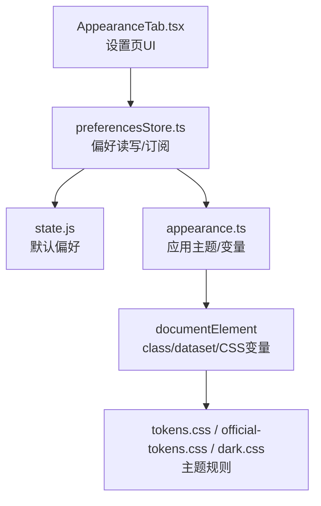
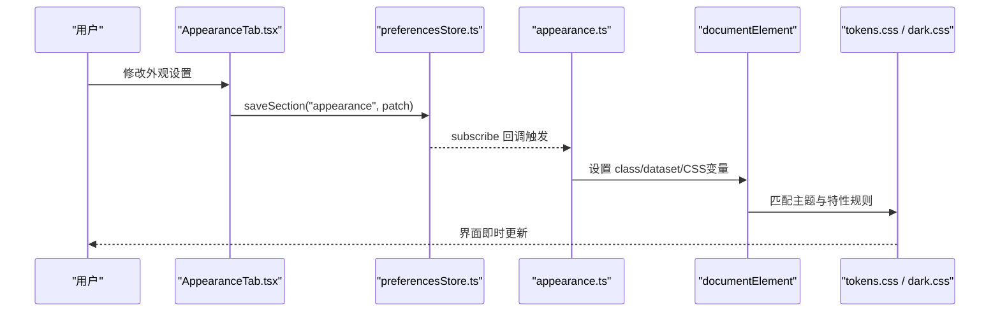
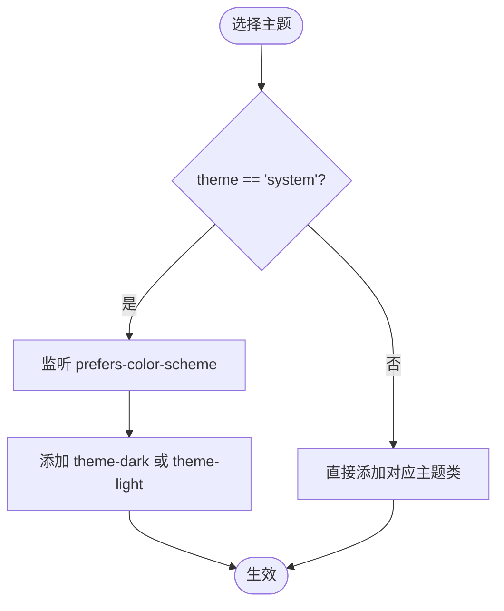
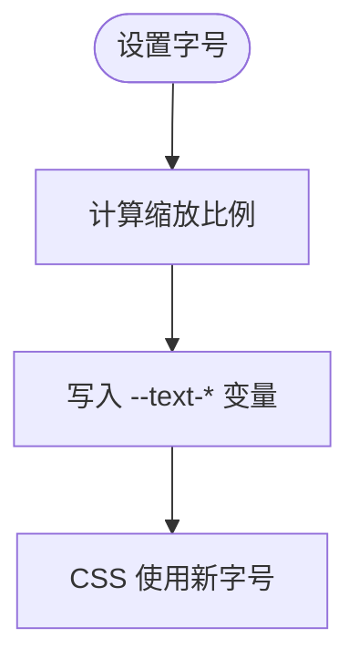
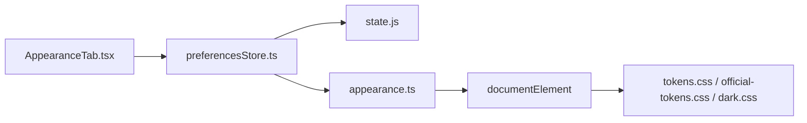

# 外观设置页面

<cite>
**本文引用的文件**
- [AppearanceTab.tsx](file://frontend/app/views/settings/tabs/AppearanceTab.tsx)
- [appearance.ts](file://frontend/app/state/appearance.ts)
- [preferencesStore.ts](file://frontend/app/state/preferencesStore.ts)
- [state.js](file://frontend/src/js/state.js)
- [tokens.css](file://frontend/src/styles/tokens.css)
- [official-tokens.css](file://frontend/src/styles/official-tokens.css)
- [dark.css](file://frontend/src/styles/dark.css)
- [main.tsx](file://frontend/app/main.tsx)
</cite>

## 目录
1. [简介](#简介)
2. [项目结构](#项目结构)
3. [核心组件](#核心组件)
4. [架构总览](#架构总览)
5. [详细组件分析](#详细组件分析)
6. [依赖关系分析](#依赖关系分析)
7. [性能考虑](#性能考虑)
8. [故障排查指南](#故障排查指南)
9. [结论](#结论)
10. [附录：主题扩展与自定义样式开发指南](#附录：主题扩展与自定义样式开发指南)

## 简介
本文件面向 Codex-Tauri 的外观设置页面，系统性说明主题切换（深色/浅色/跟随系统）、字体配置、界面缩放比例、颜色自定义等视觉相关设置；解释主题系统的实现原理、CSS 变量的动态替换机制和实时预览能力；并给出跨平台样式兼容性处理与用户偏好本地存储策略。文末提供主题扩展与自定义样式的开发指南，帮助开发者在现有体系上安全地扩展外观能力。

## 项目结构
外观设置由“设置页 UI”“偏好状态管理”“主题应用层”“CSS 变量与主题规则”四部分构成：
- 设置页 UI：AppearanceTab 提供主题选择、字体、字号、对比度、动效、指针光标、差异标记等开关与输入。
- 偏好状态管理：preferencesStore 负责加载、合并默认值、持久化到后端；state.js 维护默认外观偏好。
- 主题应用层：appearance.ts 将偏好写入 documentElement（类名、dataset、CSS 变量），驱动 CSS 规则生效。
- CSS 变量与主题规则：tokens.css、official-tokens.css、dark.css 定义主题色板、字体栈、字号阶梯、对比度与动效等规则。

图表来源
- [AppearanceTab.tsx:46-186](file://frontend/app/views/settings/tabs/AppearanceTab.tsx#L46-L186)
- [preferencesStore.ts:59-88](file://frontend/app/state/preferencesStore.ts#L59-L88)
- [appearance.ts:62-176](file://frontend/app/state/appearance.ts#L62-L176)
- [tokens.css:21-676](file://frontend/src/styles/tokens.css#L21-L676)
- [official-tokens.css:40-129](file://frontend/src/styles/official-tokens.css#L40-L129)
- [dark.css:1-61](file://frontend/src/styles/dark.css#L1-L61)

章节来源
- [AppearanceTab.tsx:46-186](file://frontend/app/views/settings/tabs/AppearanceTab.tsx#L46-L186)
- [preferencesStore.ts:59-88](file://frontend/app/state/preferencesStore.ts#L59-L88)
- [appearance.ts:62-176](file://frontend/app/state/appearance.ts#L62-L176)
- [tokens.css:21-676](file://frontend/src/styles/tokens.css#L21-L676)
- [official-tokens.css:40-129](file://frontend/src/styles/official-tokens.css#L40-L129)
- [dark.css:1-61](file://frontend/src/styles/dark.css#L1-L61)

## 核心组件
- AppearanceTab：渲染主题选项卡、主题卡片编辑器、显示偏好（指针光标、减少动效、UI/代码字号、差异标记）。通过 saveSection 写入 appearance 分区，并通过 emitShellEvent 通知外壳刷新。
- preferencesStore：统一读取/保存偏好，合并默认值，支持 subscribe 监听变化；首次启动时调用 loadPreferences 从后端获取并合并。
- appearance.ts：将偏好映射为对 documentElement 的变更（类名、dataset、CSS 变量），并订阅偏好变化以实时更新；同时监听系统主题变化以支持“跟随系统”。
- tokens.css / official-tokens.css / dark.css：集中定义主题色板、字体栈、字号阶梯、对比度增强、减少动效、指针光标、差异标记等规则，配合 class/dataset 进行主题切换与特性开关。

章节来源
- [AppearanceTab.tsx:46-186](file://frontend/app/views/settings/tabs/AppearanceTab.tsx#L46-L186)
- [preferencesStore.ts:59-88](file://frontend/app/state/preferencesStore.ts#L59-L88)
- [appearance.ts:62-176](file://frontend/app/state/appearance.ts#L62-L176)
- [tokens.css:21-676](file://frontend/src/styles/tokens.css#L21-L676)
- [official-tokens.css:40-129](file://frontend/src/styles/official-tokens.css#L40-L129)
- [dark.css:1-61](file://frontend/src/styles/dark.css#L1-L61)

## 架构总览
外观设置的运行流程如下：
- 启动阶段：main.tsx 加载所有样式表，调用 loadPreferences 获取偏好，随后 startAppearance 初始化主题与变量，并订阅后续偏好变化。
- 用户交互：AppearanceTab 中任何设置变更都会调用 saveSection 写入 appearance 分区，触发 store 更新并持久化到后端。
- 主题应用：appearance.ts 收到偏好后，立即应用 theme 类名、字体族、字号阶梯、accent、sidebarStyle、contrast、reduceMotion、pointerCursors、diffMarkers 等 dataset/变量，从而驱动 CSS 规则即时生效。
- 系统联动：当 theme 为“system”时，监听 prefers-color-scheme 变化，自动切换深色/浅色。

图表来源
- [main.tsx:44-54](file://frontend/app/main.tsx#L44-L54)
- [AppearanceTab.tsx:50-54](file://frontend/app/views/settings/tabs/AppearanceTab.tsx#L50-L54)
- [preferencesStore.ts:76-88](file://frontend/app/state/preferencesStore.ts#L76-L88)
- [appearance.ts:152-176](file://frontend/app/state/appearance.ts#L152-L176)
- [tokens.css:546-676](file://frontend/src/styles/tokens.css#L546-L676)
- [dark.css:1-61](file://frontend/src/styles/dark.css#L1-L61)

## 详细组件分析

### 主题切换（深色/浅色/跟随系统）
- 入口：AppearanceTab 中的主题单选按钮，点击后调用 setTheme，写入 appearance.theme 并触发外壳事件。
- 应用：appearance.ts 的 applyTheme 根据 theme 值在 documentElement 上添加 theme-dark 或 theme-light；当值为 system 时，依据 prefers-color-scheme 决定当前主题，并在系统主题变化时自动重算。
- 样式：tokens.css 在 :root 与 html.theme-dark 下分别定义语义化变量；dark.css 针对深色模式下的组件背景、边框、文本等进行细化覆盖。

图表来源
- [AppearanceTab.tsx:50-54](file://frontend/app/views/settings/tabs/AppearanceTab.tsx#L50-L54)
- [appearance.ts:62-72](file://frontend/app/state/appearance.ts#L62-L72)
- [appearance.ts:165-170](file://frontend/app/state/appearance.ts#L165-L170)
- [tokens.css:546-598](file://frontend/src/styles/tokens.css#L546-L598)
- [dark.css:1-61](file://frontend/src/styles/dark.css#L1-L61)

章节来源
- [AppearanceTab.tsx:50-54](file://frontend/app/views/settings/tabs/AppearanceTab.tsx#L50-L54)
- [appearance.ts:62-72](file://frontend/app/state/appearance.ts#L62-L72)
- [appearance.ts:165-170](file://frontend/app/state/appearance.ts#L165-L170)
- [tokens.css:546-598](file://frontend/src/styles/tokens.css#L546-L598)
- [dark.css:1-61](file://frontend/src/styles/dark.css#L1-L61)

### 字体配置
- 可配置项：UI 字体、内容字体、代码字体。AppearanceTab 提供下拉选择，默认包含系统字体与常用英文/中文字体。
- 应用逻辑：appearance.ts 将 uiFontFamily/codeFontFamily 映射到 --font-sans/--font-mono 两个 CSS 变量；若选择特定内置字体则回退到默认栈，避免破坏官方字体权重映射。
- 兼容性与字体栈：tokens.css 定义了 OpenAI Sans 与 Carlito 的 @font-face，以及多语言安全的字体栈；official-tokens.css 仅作为官方 CDP 解析后的色板与尺寸补充，不重复声明字体族。

章节来源
- [AppearanceTab.tsx:224-359](file://frontend/app/views/settings/tabs/AppearanceTab.tsx#L224-L359)
- [appearance.ts:111-123](file://frontend/app/state/appearance.ts#L111-L123)
- [tokens.css:5-19](file://frontend/src/styles/tokens.css#L5-L19)
- [tokens.css:45-62](file://frontend/src/styles/tokens.css#L45-L62)
- [official-tokens.css:6-38](file://frontend/src/styles/official-tokens.css#L6-L38)

### 界面缩放比例（字号阶梯）
- 可配置项：UI 字号、代码字号。AppearanceTab 提供数值输入框，限制合理范围。
- 应用逻辑：appearance.ts 的 applyTypeScale 基于 tokens.css 的字号阶梯（--text-*）按比例缩放，仅在用户偏离默认值时才注入 inline 变量，避免与 tokens 冲突；代码字号单独控制 --text-code。
- 设计要点：保持 tokens.css 的层级关系，确保 sm/base/code 等相对比例一致缩放。

图表来源
- [AppearanceTab.tsx:136-169](file://frontend/app/views/settings/tabs/AppearanceTab.tsx#L136-L169)
- [appearance.ts:80-106](file://frontend/app/state/appearance.ts#L80-L106)
- [tokens.css:91-104](file://frontend/src/styles/tokens.css#L91-L104)

章节来源
- [AppearanceTab.tsx:136-169](file://frontend/app/views/settings/tabs/AppearanceTab.tsx#L136-L169)
- [appearance.ts:80-106](file://frontend/app/state/appearance.ts#L80-L106)
- [tokens.css:91-104](file://frontend/src/styles/tokens.css#L91-L104)

### 颜色自定义（强调色、背景、前景、对比度）
- 可配置项：强调色、背景色、前景色、对比度滑块。AppearanceTab 提供颜色拾取器与十六进制输入，支持导入/复制主题卡片 JSON。
- 应用逻辑：appearance.ts 将 accent 映射到 --accent；对比度通过 contrast dataset 触发 tokens.css 的高对比度边框规则；背景/前景在主题卡片编辑器中用于预览与导出，实际运行时由主题变量与组件样式共同决定。
- 样式规则：tokens.css 在 light/dark 下分别定义语义变量；dark.css 针对深色模式下的组件背景与边框进行细化。

章节来源
- [AppearanceTab.tsx:224-372](file://frontend/app/views/settings/tabs/AppearanceTab.tsx#L224-L372)
- [appearance.ts:127-136](file://frontend/app/state/appearance.ts#L127-L136)
- [tokens.css:170-241](file://frontend/src/styles/tokens.css#L170-L241)
- [tokens.css:617-625](file://frontend/src/styles/tokens.css#L617-L625)
- [dark.css:1-61](file://frontend/src/styles/dark.css#L1-L61)

### 其他视觉特性
- 减少动效：reduceMotion 开启时在 documentElement 设置 dataset，CSS 强制缩短动画与过渡时间，提升可访问性。
- 指针光标：pointerCursors 关闭时禁用链接/按钮的指针样式，便于截图或录制。
- 差异标记：diffMarkers 支持颜色或 plusminus 两种模式，关闭时隐藏 diff 行前缀。

章节来源
- [AppearanceTab.tsx:121-183](file://frontend/app/views/settings/tabs/AppearanceTab.tsx#L121-L183)
- [appearance.ts:138-145](file://frontend/app/state/appearance.ts#L138-L145)
- [tokens.css:627-650](file://frontend/src/styles/tokens.css#L627-L650)

## 依赖关系分析
- AppearanceTab 依赖 preferencesStore 的 usePrefSection/saveSection 与 emitShellEvent。
- preferencesStore 依赖 state.js 的默认偏好与 mergePreferences，并通过 Tauri invoke 与后端通信。
- appearance.ts 依赖 preferencesStore 的 getPrefSection/subscribe，并将结果应用到 documentElement。
- CSS 层依赖 tokens.css/official-tokens.css/dark.css 定义的变量与规则，通过 class/dataset 进行主题与特性切换。

图表来源
- [AppearanceTab.tsx:46-186](file://frontend/app/views/settings/tabs/AppearanceTab.tsx#L46-L186)
- [preferencesStore.ts:59-88](file://frontend/app/state/preferencesStore.ts#L59-L88)
- [appearance.ts:152-176](file://frontend/app/state/appearance.ts#L152-L176)
- [tokens.css:21-676](file://frontend/src/styles/tokens.css#L21-L676)
- [official-tokens.css:40-129](file://frontend/src/styles/official-tokens.css#L40-L129)
- [dark.css:1-61](file://frontend/src/styles/dark.css#L1-L61)

章节来源
- [AppearanceTab.tsx:46-186](file://frontend/app/views/settings/tabs/AppearanceTab.tsx#L46-L186)
- [preferencesStore.ts:59-88](file://frontend/app/state/preferencesStore.ts#L59-L88)
- [appearance.ts:152-176](file://frontend/app/state/appearance.ts#L152-L176)
- [tokens.css:21-676](file://frontend/src/styles/tokens.css#L21-L676)
- [official-tokens.css:40-129](file://frontend/src/styles/official-tokens.css#L40-L129)
- [dark.css:1-61](file://frontend/src/styles/dark.css#L1-L61)

## 性能考虑
- 最小化 DOM 操作：appearance.ts 仅在偏好变化时批量设置 CSS 变量与 dataset，避免频繁重排。
- 保留 tokens 层级：字号缩放基于 tokens.css 的阶梯，避免覆盖基础变量导致布局抖动。
- 系统主题监听：仅在 theme 为 system 时监听 prefers-color-scheme，降低无关开销。
- 样式加载顺序：main.tsx 按序引入 tokens、official-tokens、reset、shell、components、controls、home、discovery、settings、dark 等样式，确保变量先于规则生效。

章节来源
- [appearance.ts:80-106](file://frontend/app/state/appearance.ts#L80-L106)
- [appearance.ts:165-170](file://frontend/app/state/appearance.ts#L165-L170)
- [main.tsx:4-23](file://frontend/app/main.tsx#L4-L23)

## 故障排查指南
- 主题未生效：检查 documentElement 是否包含 theme-dark/theme-light 类；确认 appearance.ts 的 applyTheme 被调用。
- 字体未更换：确认 --font-sans/--font-mono 是否被正确设置；检查 tokens.css 的字体栈与 @font-face 是否加载成功。
- 字号缩放异常：确认 applyTypeScale 是否仅在用户偏离默认值时写入变量；检查 tokens.css 的 --text-* 阶梯是否存在。
- 对比度/动效/光标/差异标记无效：检查对应的 dataset 是否正确设置；查看 tokens.css 的规则是否匹配。
- 偏好未持久化：确认 preferencesStore.saveSection 是否成功调用后端 save_preferences；检查网络与权限。

章节来源
- [appearance.ts:62-72](file://frontend/app/state/appearance.ts#L62-L72)
- [appearance.ts:111-145](file://frontend/app/state/appearance.ts#L111-L145)
- [appearance.ts:80-106](file://frontend/app/state/appearance.ts#L80-L106)
- [tokens.css:617-650](file://frontend/src/styles/tokens.css#L617-L650)
- [preferencesStore.ts:76-88](file://frontend/app/state/preferencesStore.ts#L76-L88)

## 结论
Codex-Tauri 的外观设置通过“设置页 UI + 偏好存储 + 主题应用层 + CSS 变量规则”的分层架构，实现了主题切换、字体配置、字号缩放、颜色自定义与多种视觉特性的实时应用。其核心在于将用户偏好映射为 documentElement 的类名、dataset 与 CSS 变量，再由统一的 CSS 规则驱动界面表现。该方案具备良好的可扩展性与跨平台兼容性，适合进一步扩展主题与自定义样式。

## 附录：主题扩展与自定义样式开发指南
- 新增主题色板：在 tokens.css 或 official-tokens.css 中扩展 --surface-*、--text-*、--border-* 等语义变量，并确保在 theme-dark 块中提供对应暗色值。
- 新增字体族：如需引入新字体，优先在 tokens.css 中声明 @font-face 并加入字体栈；避免在多个文件中重复声明同一字体族。
- 扩展特性开关：在 appearance.ts 中添加新的 dataset 或 CSS 变量映射，并在 tokens.css 中编写对应的规则（如高对比度、减少动效等）。
- 主题卡片编辑器：可在 AppearanceTab 中扩展 ThemeCardEditor，增加更多字段（如侧边栏风格、阴影强度等），并通过 saveSection 持久化。
- 实时预览：利用 ThemeCodePreview 展示当前主题的 JSON 片段，便于用户导入/导出；也可扩展为实时预览面板。
- 跨平台兼容：遵循 tokens.css 的 fallback 策略与 color-mix 降级方案，确保在不支持某些 CSS 特性的环境中仍可用。

章节来源
- [AppearanceTab.tsx:224-372](file://frontend/app/views/settings/tabs/AppearanceTab.tsx#L224-L372)
- [appearance.ts:111-145](file://frontend/app/state/appearance.ts#L111-L145)
- [tokens.css:21-676](file://frontend/src/styles/tokens.css#L21-L676)
- [official-tokens.css:40-129](file://frontend/src/styles/official-tokens.css#L40-L129)