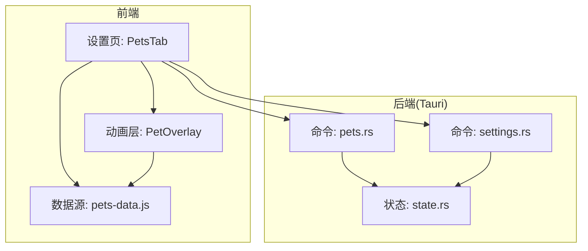
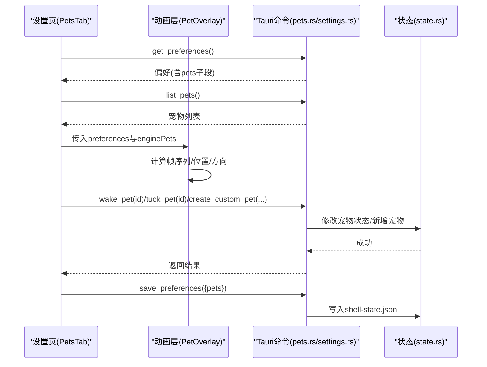
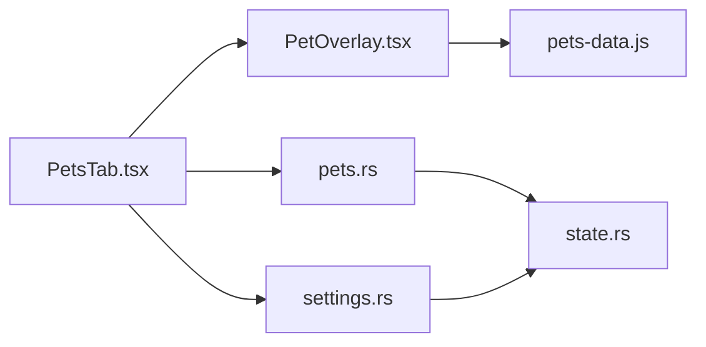

# 宠物设置页面

<cite>
**本文引用的文件**
- [PetsTab.tsx](file://frontend/app/views/settings/tabs/PetsTab.tsx)
- [PetOverlay.tsx](file://frontend/app/pet/PetOverlay.tsx)
- [pets-data.js](file://frontend/src/js/pets-data.js)
- [pets.rs](file://src-tauri/src/commands/pets.rs)
- [settings.rs](file://src-tauri/src/commands/settings.rs)
- [state.rs](file://src-tauri/src/state.rs)
- [pets.txt](file://docs/uia/outlines-t41/pets.txt)
</cite>

## 目录
1. [简介](#简介)
2. [项目结构](#项目结构)
3. [核心组件](#核心组件)
4. [架构总览](#架构总览)
5. [详细组件分析](#详细组件分析)
6. [依赖关系分析](#依赖关系分析)
7. [性能考量](#性能考量)
8. [故障排查指南](#故障排查指南)
9. [结论](#结论)
10. [附录：自定义宠物开发指南与API说明](#附录自定义宠物开发指南与api说明)

## 简介
本页面为 Codex-Tauri 的“宠物”设置页，提供虚拟宠物的添加、选择、外观定制（精灵图资源）、行为设置（动作序列）与互动模式配置（拖拽、方向注视、悬停反应）。该功能由前端 React 组件驱动，通过 Tauri 命令与 Rust 后端状态交互，持久化存储于本地 JSON 文件中。系统同时支持官方内置宠物与用户自定义宠物，并提供动画渲染机制以还原官方行为。

## 项目结构
- 前端设置页入口：位于设置面板的“宠物”标签页，负责展示宠物目录、预览与操作按钮。
- 前端动画层：浮动宠物覆盖层，实现帧时钟、拖拽、方向注视与动作序列播放。
- 前端数据源：官方宠物目录、精灵图集规格、动作定义与工具函数。
- 后端命令：提供列出宠物、唤醒/安抚宠物、创建自定义宠物等能力。
- 后端状态：集中管理偏好、设置与宠物列表，并持久化到本地文件。

图表来源
- [PetsTab.tsx:101-187](file://frontend/app/views/settings/tabs/PetsTab.tsx#L101-L187)
- [PetOverlay.tsx:56-216](file://frontend/app/pet/PetOverlay.tsx#L56-L216)
- [pets-data.js:22-147](file://frontend/src/js/pets-data.js#L22-L147)
- [pets.rs:4-65](file://src-tauri/src/commands/pets.rs#L4-L65)
- [settings.rs:35-52](file://src-tauri/src/commands/settings.rs#L35-L52)
- [state.rs:150-217](file://src-tauri/src/state.rs#L150-L217)

章节来源
- [PetsTab.tsx:1-274](file://frontend/app/views/settings/tabs/PetsTab.tsx#L1-L274)
- [PetOverlay.tsx:1-217](file://frontend/app/pet/PetOverlay.tsx#L1-L217)
- [pets-data.js:1-259](file://frontend/src/js/pets-data.js#L1-L259)
- [pets.rs:1-66](file://src-tauri/src/commands/pets.rs#L1-L66)
- [settings.rs:1-69](file://src-tauri/src/commands/settings.rs#L1-L69)
- [state.rs:1-331](file://src-tauri/src/state.rs#L1-L331)

## 核心组件
- 设置页 PetsTab：加载偏好与后端宠物列表，合并官方与自定义宠物目录；提供“显示宠物”、“刷新”、“创建宠物”等操作；在预览区嵌入 PetOverlay 实时渲染当前选中宠物。
- 动画层 PetOverlay：基于 pets-data.js 的精灵图集与动作定义，维护帧时钟、拖拽定位、方向注视、悬停/双击触发动作，以及尺寸控制。
- 数据源 pets-data.js：定义精灵图集版本、行列数、动作帧序列、方向注视映射、官方宠物清单与资源 URL 解析。
- 后端命令 pets.rs：暴露 list_pets、wake_pet、tuck_pet、create_custom_pet、save_pets 等命令，读写状态中的宠物集合。
- 后端命令 settings.rs：暴露 get_preferences、save_preferences，用于保存偏好（包含 pets 子段）。
- 状态 state.rs：定义 Preferences、Pet、AppState 等结构体，负责加载/保存 shell-state.json，保证跨重启的数据一致性。

章节来源
- [PetsTab.tsx:22-187](file://frontend/app/views/settings/tabs/PetsTab.tsx#L22-L187)
- [PetOverlay.tsx:34-216](file://frontend/app/pet/PetOverlay.tsx#L34-L216)
- [pets-data.js:22-147](file://frontend/src/js/pets-data.js#L22-L147)
- [pets.rs:4-65](file://src-tauri/src/commands/pets.rs#L4-L65)
- [settings.rs:35-52](file://src-tauri/src/commands/settings.rs#L35-L52)
- [state.rs:49-77](file://src-tauri/src/state.rs#L49-L77)

## 架构总览
前端通过 Tauri invoke 调用后端命令，读取/更新宠物列表与偏好；后端将宠物与偏好保存在本地 JSON 中。动画层完全在前端运行，依据 pets-data.js 提供的精灵图集与动作序列进行渲染。

图表来源
- [PetsTab.tsx:106-187](file://frontend/app/views/settings/tabs/PetsTab.tsx#L106-L187)
- [PetOverlay.tsx:78-114](file://frontend/app/pet/PetOverlay.tsx#L78-L114)
- [pets.rs:4-65](file://src-tauri/src/commands/pets.rs#L4-L65)
- [settings.rs:35-52](file://src-tauri/src/commands/settings.rs#L35-L52)
- [state.rs:176-217](file://src-tauri/src/state.rs#L176-L217)

## 详细组件分析

### 设置页 PetsTab
- 功能要点
  - 加载偏好与后端宠物列表，合并官方与自定义宠物目录。
  - 提供“显示宠物”按钮，唤醒选中的宠物并刷新列表。
  - 支持创建自定义宠物，自动设为活跃并保存偏好。
  - 在预览区域嵌入 PetOverlay 实时渲染当前宠物。
- 关键流程
  - 初始化时调用 get_preferences 与 list_pets。
  - 选择宠物后调用 wake_pet，并保存 active/selected/asleep 等偏好。
  - 创建自定义宠物时调用 create_custom_pet，成功后刷新列表。
- 错误处理
  - 网络或命令失败时记录日志并降级为空列表。
  - 唤醒未存在于后端存储的官方宠物时忽略错误。

章节来源
- [PetsTab.tsx:101-187](file://frontend/app/views/settings/tabs/PetsTab.tsx#L101-L187)
- [PetsTab.tsx:218-270](file://frontend/app/views/settings/tabs/PetsTab.tsx#L218-L270)

### 动画层 PetOverlay
- 功能要点
  - 基于 pets-data.js 的精灵图集与动作序列，维护帧时钟与循环。
  - 支持拖拽移动（指针捕获），限制在视口范围内。
  - 支持方向注视（16方向），鼠标移动时切换帧，离开后恢复。
  - 支持悬停/双击触发跳跃动作，支持减少动效模式。
  - 根据 preferences.size 调整尺寸，保持像素风格渲染。
- 关键流程
  - 根据当前状态构建帧序列，使用 setTimeout 推进帧索引。
  - 监听 pointermove/pointerup 实现拖拽与释放。
  - 监听 document.pointermove 计算方向注视帧。
- 性能考虑
  - 仅在序列变化时重置帧索引与定时器。
  - 减少动效模式下仅显示首帧，降低开销。

章节来源
- [PetOverlay.tsx:56-216](file://frontend/app/pet/PetOverlay.tsx#L56-L216)
- [pets-data.js:104-147](file://frontend/src/js/pets-data.js#L104-L147)

### 数据源 pets-data.js
- 功能要点
  - 定义精灵图集版本、行列数、单元格尺寸与所需帧数。
  - 定义动作帧序列（等待、跑动、挥手、失败等）与空闲循环。
  - 提供方向注视映射与背景定位计算。
  - 维护官方宠物清单与资源映射，支持自定义宠物资源URL。
- 关键点
  - 默认精灵图集版本与列数决定渲染布局。
  - 动作序列支持三遍播放后回落到空闲循环。
  - 方向注视仅在 v2 精灵图集生效。

章节来源
- [pets-data.js:22-147](file://frontend/src/js/pets-data.js#L22-L147)
- [pets-data.js:149-259](file://frontend/src/js/pets-data.js#L149-L259)

### 后端命令 pets.rs
- 功能要点
  - list_pets：返回当前内存中的宠物列表。
  - wake_pet/tuck_pet：修改指定宠物的心情（happy/sleepy）并持久化。
  - create_custom_pet：生成新宠物（带唯一ID、kind=custom、初始心情idle）并持久化。
  - save_pets：批量替换宠物列表并持久化。
- 并发与一致性
  - 使用 Mutex 保护 InnerState，避免竞态。
  - 每次修改后调用 save() 写入临时文件再原子替换。

章节来源
- [pets.rs:4-65](file://src-tauri/src/commands/pets.rs#L4-L65)
- [state.rs:150-217](file://src-tauri/src/state.rs#L150-L217)

### 后端命令 settings.rs
- 功能要点
  - get_preferences/save_preferences：读取/保存全局偏好，包括 pets 子段。
  - 其他设置项（主题、语言、模型等）与宠物无关，但共享同一持久化机制。
- 与宠物系统的集成
  - 设置页通过 save_preferences 将 pets 子段（active/selected/asleep/size）落盘。

章节来源
- [settings.rs:35-52](file://src-tauri/src/commands/settings.rs#L35-L52)

### 状态 state.rs
- 数据结构
  - Preferences：包含 pets_enabled、reduced_motion、compact_mode 及扁平化的 extra 字段。
  - Pet：id、name、kind、sprite、mood、custom。
  - AppState：持有 data_dir 与 Mutex<InnerState>，提供 load_or_default/save/snapshot。
- 持久化
  - 路径：应用配置目录下的 shell-state.json。
  - 写入策略：先写临时文件再 rename 原子替换，确保崩溃安全。

章节来源
- [state.rs:49-77](file://src-tauri/src/state.rs#L49-L77)
- [state.rs:150-217](file://src-tauri/src/state.rs#L150-L217)
- [state.rs:234-281](file://src-tauri/src/state.rs#L234-L281)

## 依赖关系分析
- 前端依赖
  - PetsTab 依赖 PetOverlay 与 pets-data.js。
  - PetOverlay 依赖 pets-data.js 的精灵图集、动作序列与工具函数。
- 前后端通信
  - 通过 Tauri invoke 调用 pets.rs 与 settings.rs 的命令。
- 后端内部依赖
  - 所有命令依赖 state.rs 的 AppState 与 InnerState。
  - 持久化统一通过 AppState.save() 完成。

图表来源
- [PetsTab.tsx:101-187](file://frontend/app/views/settings/tabs/PetsTab.tsx#L101-L187)
- [PetOverlay.tsx:56-216](file://frontend/app/pet/PetOverlay.tsx#L56-L216)
- [pets-data.js:22-147](file://frontend/src/js/pets-data.js#L22-L147)
- [pets.rs:4-65](file://src-tauri/src/commands/pets.rs#L4-L65)
- [settings.rs:35-52](file://src-tauri/src/commands/settings.rs#L35-L52)
- [state.rs:150-217](file://src-tauri/src/state.rs#L150-L217)

章节来源
- [PetsTab.tsx:101-187](file://frontend/app/views/settings/tabs/PetsTab.tsx#L101-L187)
- [PetOverlay.tsx:56-216](file://frontend/app/pet/PetOverlay.tsx#L56-L216)
- [pets-data.js:22-147](file://frontend/src/js/pets-data.js#L22-L147)
- [pets.rs:4-65](file://src-tauri/src/commands/pets.rs#L4-L65)
- [settings.rs:35-52](file://src-tauri/src/commands/settings.rs#L35-L52)
- [state.rs:150-217](file://src-tauri/src/state.rs#L150-L217)

## 性能考量
- 动画帧时钟
  - 使用 setTimeout 按帧时长推进，避免阻塞主线程。
  - 减少动效模式下仅显示首帧，降低渲染压力。
- 精灵图集
  - 使用 CSS background-position 与 background-size 裁剪帧，避免多图片请求。
  - 精灵图集版本与行列数需匹配，防止错位。
- 拖拽与事件
  - 使用指针捕获提升拖拽体验，及时移除事件监听避免泄漏。
- 持久化
  - 原子写入临时文件再替换，避免损坏配置文件。

[本节为通用性能建议，不直接分析具体文件]

## 故障排查指南
- 无法列出宠物
  - 检查 list_pets 是否返回空数组或报错；确认后端状态已加载。
  - 参考：[pets.rs:4-7](file://src-tauri/src/commands/pets.rs#L4-L7)
- 唤醒宠物失败
  - 若宠物不存在于后端存储，会抛出“pet not found”；可忽略或重新创建。
  - 参考：[pets.rs:15-28](file://src-tauri/src/commands/pets.rs#L15-L28)
- 偏好未保存
  - 确认 save_preferences 调用成功；检查 shell-state.json 是否被写入。
  - 参考：[settings.rs:45-52](file://src-tauri/src/commands/settings.rs#L45-L52)
  - 参考：[state.rs:209-217](file://src-tauri/src/state.rs#L209-L217)
- 动画不显示或错位
  - 检查精灵图集版本与行列数是否匹配；确认 petSheetUrl 返回有效地址。
  - 参考：[pets-data.js:22-51](file://frontend/src/js/pets-data.js#L22-L51)
  - 参考：[pets-data.js:231-249](file://frontend/src/js/pets-data.js#L231-L249)
- 方向注视无效
  - 仅在 v2 精灵图集生效；确认 spriteVersionNumber 为 2。
  - 参考：[pets-data.js:127-139](file://frontend/src/js/pets-data.js#L127-L139)

章节来源
- [pets.rs:15-28](file://src-tauri/src/commands/pets.rs#L15-L28)
- [settings.rs:45-52](file://src-tauri/src/commands/settings.rs#L45-L52)
- [state.rs:209-217](file://src-tauri/src/state.rs#L209-L217)
- [pets-data.js:22-51](file://frontend/src/js/pets-data.js#L22-L51)
- [pets-data.js:127-139](file://frontend/src/js/pets-data.js#L127-L139)
- [pets-data.js:231-249](file://frontend/src/js/pets-data.js#L231-L249)

## 结论
宠物设置页通过清晰的前后端分层实现了虚拟宠物的选择、预览与互动。前端负责动画与交互，后端负责状态与持久化。系统兼容官方与自定义宠物，具备可扩展性。建议在后续迭代中完善自定义宠物的外观定制能力与更多行为配置。

[本节为总结性内容，不直接分析具体文件]

## 附录：自定义宠物开发指南与API说明

### 自定义宠物数据模型
- 字段说明
  - id：唯一标识，建议使用 custom: 或 pet_ 前缀。
  - name：显示名称。
  - kind：类型标识，如 custom。
  - sprite：精灵图集文件名或 URL（可选）。
  - mood：心情状态（idle/happy/sleepy 等）。
  - custom：是否为自定义宠物。
- 参考结构
  - 参考：[state.rs:66-77](file://src-tauri/src/state.rs#L66-L77)

章节来源
- [state.rs:66-77](file://src-tauri/src/state.rs#L66-L77)

### 后端API（Tauri命令）
- list_pets
  - 作用：获取当前宠物列表。
  - 参考：[pets.rs:4-7](file://src-tauri/src/commands/pets.rs#L4-L7)
- wake_pet
  - 作用：唤醒指定宠物（心情设为 happy）。
  - 参数：id（字符串）。
  - 参考：[pets.rs:15-28](file://src-tauri/src/commands/pets.rs#L15-L28)
- tuck_pet
  - 作用：安抚宠物（心情设为 sleepy）。
  - 参数：id（字符串）。
  - 参考：[pets.rs:30-43](file://src-tauri/src/commands/pets.rs#L30-L43)
- create_custom_pet
  - 作用：创建自定义宠物。
  - 参数：name（字符串）、kind（字符串）。
  - 返回：新宠物的 Pet 对象。
  - 参考：[pets.rs:45-65](file://src-tauri/src/commands/pets.rs#L45-L65)
- save_pets
  - 作用：批量替换宠物列表。
  - 参数：pets（Pet[]）。
  - 参考：[pets.rs:9-13](file://src-tauri/src/commands/pets.rs#L9-L13)
- get_preferences / save_preferences
  - 作用：读取/保存偏好（包含 pets 子段）。
  - 参考：[settings.rs:35-52](file://src-tauri/src/commands/settings.rs#L35-L52)

章节来源
- [pets.rs:4-65](file://src-tauri/src/commands/pets.rs#L4-L65)
- [settings.rs:35-52](file://src-tauri/src/commands/settings.rs#L35-L52)

### 前端集成要点
- 资源映射
  - 自定义宠物可通过 thumb 或 spritesheetUrl 指定资源；否则尝试 assetRef/id 映射。
  - 参考：[pets-data.js:231-249](file://frontend/src/js/pets-data.js#L231-L249)
- 动画与交互
  - 使用 PetOverlay 渲染，传入 preferences 与 enginePets。
  - 支持 reduceMotion、action 预览等。
  - 参考：[PetOverlay.tsx:56-216](file://frontend/app/pet/PetOverlay.tsx#L56-L216)
- 设置页操作
  - 通过 PetsTab 调用 create_custom_pet 并保存偏好。
  - 参考：[PetsTab.tsx:170-187](file://frontend/app/views/settings/tabs/PetsTab.tsx#L170-L187)

章节来源
- [pets-data.js:231-249](file://frontend/src/js/pets-data.js#L231-L249)
- [PetOverlay.tsx:56-216](file://frontend/app/pet/PetOverlay.tsx#L56-L216)
- [PetsTab.tsx:170-187](file://frontend/app/views/settings/tabs/PetsTab.tsx#L170-L187)

### 持久化与版本兼容
- 存储位置
  - shell-state.json 位于应用配置目录。
  - 参考：[state.rs:176-217](file://src-tauri/src/state.rs#L176-L217)
- 兼容性
  - Preferences.extra 使用 flatten 序列化，确保新增字段不被丢弃。
  - 精灵图集版本与行列数需保持一致，避免渲染错位。
  - 参考：[state.rs:49-64](file://src-tauri/src/state.rs#L49-L64)
  - 参考：[pets-data.js:22-51](file://frontend/src/js/pets-data.js#L22-L51)

章节来源
- [state.rs:49-64](file://src-tauri/src/state.rs#L49-L64)
- [state.rs:176-217](file://src-tauri/src/state.rs#L176-L217)
- [pets-data.js:22-51](file://frontend/src/js/pets-data.js#L22-L51)

### 无障碍与界面结构
- 设置页包含“宠物”标签、显示/隐藏按钮、刷新与创建按钮，以及宠物卡片网格。
- 参考：[pets.txt:38-82](file://docs/uia/outlines-t41/pets.txt#L38-L82)

章节来源
- [pets.txt:38-82](file://docs/uia/outlines-t41/pets.txt#L38-L82)